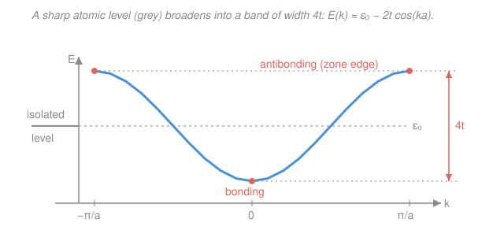

# Condensed Matter · Lesson 3.5: The tight-binding model

> ⏱ ~15 min · Module 3: Electrons in solids · Builds on: [3.4 The nearly-free-electron model](03-04-nearly-free-electron.md) · Unlocks: [3.6 Bands, zones, and the density of states](03-06-bands-zones-dos.md)

## Why this matters

The nearly-free-electron model ([3.4](03-04-nearly-free-electron.md)) built bands by starting from free plane waves and letting a *weak* lattice carve gaps into them. That works for simple metals — but it is a terrible starting point for the electrons that make chemistry interesting: the tightly bound $d$ electrons of transition metals, the $\pi$ electrons of graphene, the localized orbitals of Mott insulators. For those you want the **opposite** limit: start from isolated atoms with their sharp, familiar atomic levels and ask what happens when you push the atoms close enough that neighboring orbitals just barely overlap. That single idea — the **tight-binding** (or LCAO) model — is the working language of modern band structure, and it produces bands from the other end of the road. Both roads arrive at the same destination: bands separated by gaps.

## The idea

Picture a row of hydrogen-like atoms, far apart. Each has an electron sitting in the same orbital $\varphi$, all at the same energy $\varepsilon_0$ — a single sharp level, repeated $N$ times (once per atom). Now slide the atoms together. When two orbitals start to overlap, an electron on one atom can **tunnel** to its neighbor. That leaking is the whole story.

What does hopping do to the energy? Think of two atoms first, like the hydrogen molecule. The electron can sit in the **in-phase** combination $\varphi_1+\varphi_2$ (amplitude piles up *between* the atoms — bonding, lower energy) or the **out-of-phase** combination $\varphi_1-\varphi_2$ (a node between them — antibonding, higher energy). One level splits into two. Now do it with $N$ atoms in a chain: the single level splits into $N$ closely spaced levels smeared over an energy range — a **band**. The more the orbitals overlap, the more freely electrons hop, and the wider the band. A sharp atomic level *broadens* into a band exactly as a plane wave *gaps* in [3.4](03-04-nearly-free-electron.md); the two pictures are the same physics seen from opposite starting points.

The magic ingredient that turns "$N$ levels" into a clean dispersion $E(k)$ is that the right in-between combinations are **Bloch states** ([3.3](03-03-blochs-theorem.md)) — you assign each site a phase $e^{ikna}$ and add. Crystal momentum $k$ is just the phase twist per step down the chain.

## The formal version

Put one atomic orbital $\varphi(x-na)$ on each site $n$, at positions $x=na$ with lattice constant $a$. Build the **linear combination of atomic orbitals (LCAO)**, phased site by site:

$$\psi_k(x) = \sum_{n} e^{ikna}\,\varphi(x - na).$$

*In words: hang the same orbital on every atom, twist its phase by $e^{ika}$ as you step one site to the right, and sum.* Shifting $x \to x+a$ relabels the sum and pulls out a factor $e^{ika}$ — so $\psi_k$ is automatically a Bloch state ([3.3](03-03-blochs-theorem.md)), with $k$ the crystal momentum. No extra work needed.

Now feed $\psi_k$ into the crystal Hamiltonian $H$ and compute $E(k)=\langle\psi_k|H|\psi_k\rangle/\langle\psi_k|\psi_k\rangle$. Assume the orbitals are nearly orthonormal (overlap small) and keep only two kinds of matrix element:

- **On-site energy** $\varepsilon_0 = \int \varphi^*(x)\,H\,\varphi(x)\,dx$ — the atomic level, slightly shifted by the presence of neighbors. *In words: what one electron costs sitting still on its own atom.*
- **Hopping (transfer) integral** $t = -\int \varphi^*(x-a)\,H\,\varphi(x)\,dx$ — the amplitude to tunnel to an adjacent site. *In words: how easily an electron leaks to the next atom; big overlap $\Rightarrow$ big $t$.*

Keeping only nearest neighbors ($\delta = \pm a$), the two hops contribute $-t\,e^{ika}$ and $-t\,e^{-ika}$, giving the **1D $s$-band dispersion**:

$$\boxed{\,E(k) = \varepsilon_0 - 2t\cos(ka)\,}$$

*In words: a discrete atomic level $\varepsilon_0$ broadens into a cosine band as electrons delocalize by hopping.* Reading it off across the first Brillouin zone $-\pi/a \le k \le \pi/a$:

- **Band bottom** at $k=0$: $E_{\min} = \varepsilon_0 - 2t$. All sites in phase — the fully **bonding** state.
- **Band top** at $k=\pm\pi/a$: $E_{\max} = \varepsilon_0 + 2t$. Alternating signs site to site — the fully **antibonding** state.
- **Bandwidth** $W = E_{\max}-E_{\min} = 4t$. Set entirely by how much orbitals overlap.

**Coordination widens the band.** Each neighbor you can hop to adds another $-t\,e^{ik\cdot\delta}$ term. Summing over all $z$ nearest neighbors (the **coordination number**) gives a bandwidth that scales as $W \sim 2zt$ — more neighbors, wider band. In three dimensions, a simple-cubic lattice ($z=6$, neighbors along $\pm x,\pm y,\pm z$) gives

$$E(\mathbf{k}) = \varepsilon_0 - 2t\big(\cos k_x a + \cos k_y a + \cos k_z a\big),$$

with bottom $\varepsilon_0-6t$ at $\mathbf{k}=0$, top $\varepsilon_0+6t$ at the zone corner $(\pi/a,\pi/a,\pi/a)$, and bandwidth $W = 12t = 2zt$ with $z=6$. *In words: the 1D width $4t$ is just $z=2$; every extra hopping direction adds to the spread.*

**The Wannier picture.** Bloch states $\psi_k$ are spread over the whole crystal; their real-space partners are the **Wannier functions** $w(x-na) = \tfrac{1}{N}\sum_k e^{-ikna}\psi_k(x)$ — localized orbitals, one per site, that are the honest quantum-mechanical version of "the electron sits on atom $n$." Tight-binding is really just band theory written in the Wannier (localized) basis, exactly as nearly-free-electron theory is band theory in the plane-wave basis.

## Picture

## Worked examples

**Example 1 (band edges and width).** A crystal's $s$ orbitals have on-site energy $\varepsilon_0 = -3.0$ eV and nearest-neighbor hopping $t = 0.4$ eV in a 1D chain. Where are the band edges, and how wide is the band?

$$E_{\min} = \varepsilon_0 - 2t = -3.0 - 0.8 = -3.8\ \text{eV}\ (k=0,\ \text{bonding}),$$
$$E_{\max} = \varepsilon_0 + 2t = -3.0 + 0.8 = -2.2\ \text{eV}\ (k=\pm\pi/a,\ \text{antibonding}),$$
$$W = 4t = 1.6\ \text{eV}.$$

The center of the band sits at the (shifted) atomic level $\varepsilon_0=-3.0$ eV, and the band is symmetric about it — a hallmark of the simple one-orbital, one-$t$ model. If the same atoms formed a 3D simple-cubic crystal instead, the width would triple to $12t = 4.8$ eV: more neighbors, more hopping, more delocalization.

**Example 2 (group velocity — how fast the electron moves).** An electron in a band travels at the **group velocity** $v_g = \tfrac{1}{\hbar}\,dE/dk$ (the semiclassical speed of its wave packet; $\hbar$ is the reduced Planck constant). Differentiate the 1D band:

$$v_g(k) = \frac{1}{\hbar}\frac{dE}{dk} = \frac{1}{\hbar}\frac{d}{dk}\big[\varepsilon_0 - 2t\cos(ka)\big] = \frac{2ta}{\hbar}\sin(ka).$$

*In words: the electron is stationary at the band edges and fastest halfway up.* Check the special points: at the band bottom $k=0$ and the band top $k=\pm\pi/a$, $\sin(ka)=0$, so $v_g=0$ — an electron sitting exactly at a band edge does not propagate (a standing wave, just like the zone-boundary standing waves of [3.4](03-04-nearly-free-electron.md)). The speed peaks at $ka=\pm\pi/2$, mid-band, where $v_g = \pm 2ta/\hbar$. So the carriers that actually conduct live in the *middle* of the band, not at its edges — a fact we cash in when we fill bands and locate $E_F$ in [3.6](03-06-bands-zones-dos.md).

## Watch out

- **You might think a bigger hopping $t$ means the electron is more bound.** It is the reverse: bigger $t$ means *more overlap and easier delocalization*, hence a **wider** band ($W=4t$) and a lower band bottom. A vanishing $t$ (atoms pulled infinitely far apart) collapses the band back to the single sharp atomic level $\varepsilon_0$ — the isolated-atom limit.
- **You might read "band bottom" as "highest binding" and expect it at the zone edge.** For the standard $s$-band with $t>0$, the bottom is at $k=0$ (in-phase, bonding) and the top is at $k=\pm\pi/a$ (out-of-phase, antibonding). For a $p$-orbital the sign of $t$ can flip and invert the band — always check the sign of the overlap.
- **You might treat $k$ as ordinary momentum.** It is **crystal momentum** ([3.3](03-03-blochs-theorem.md)): defined only modulo $2\pi/a$, and living inside one Brillouin zone. $E(k)=\varepsilon_0-2t\cos(ka)$ is periodic in $k$ with period $2\pi/a$ — states at $k$ and $k+2\pi/a$ are the *same* state.

## One-liner

> Overlapping atomic orbitals let electrons hop with amplitude $t$, broadening a sharp level $\varepsilon_0$ into a band $E(k)=\varepsilon_0-2t\cos(ka)$ of width $4t$ (bonding at the bottom, antibonding at the top) — nearly-free-electron theory run in reverse.

## Problems

**P1 (🟢)** A 1D tight-binding $s$-band has $\varepsilon_0 = 2.0$ eV and $t = 0.6$ eV. (a) Give the energies at the band bottom and band top and the bandwidth. (b) If the *same* atoms and hopping formed a 3D simple-cubic crystal, what is the new bandwidth?

**P2 (🟡)** For the 1D band $E(k)=\varepsilon_0 - 2t\cos(ka)$: (a) derive the group velocity $v_g(k)$; (b) find the values of $k$ (within the first zone) where $v_g$ is zero and where it is maximum, and give the maximum speed in terms of $t,a,\hbar$; (c) explain in one sentence why the electrons that carry current sit mid-band.

**P3 (🔴, optional)** The curvature of the band sets the **effective mass** $m^* = \hbar^2 / (d^2E/dk^2)$ ([3.7](03-07-metals-insulators-semiconductors.md)). For the 1D band, compute $m^*(k)$ and evaluate it at the band bottom $k=0$ and the band top $k=\pi/a$. What is odd about $m^*$ near the top, and what physical object does it describe?

Solutions

**P1** (a) $E_{\min}=\varepsilon_0-2t = 2.0-1.2 = 0.8$ eV (bonding, $k=0$); $E_{\max}=\varepsilon_0+2t = 2.0+1.2 = 3.2$ eV (antibonding, $k=\pm\pi/a$); bandwidth $W=4t = 2.4$ eV. (b) Simple cubic has coordination $z=6$, so $W = 2zt = 12t = 12(0.6) = 7.2$ eV — three times the 1D width.

*Check.* Band centered on $\varepsilon_0=2.0$ eV, symmetric ($0.8$ and $3.2$ are equidistant) ✓. Ratio $12t/4t = 3 = $ (3D neighbors)/(1D neighbors) ✓.

**P2** (a) $v_g = \dfrac{1}{\hbar}\dfrac{dE}{dk} = \dfrac{1}{\hbar}\dfrac{d}{dk}[\varepsilon_0 - 2t\cos ka] = \dfrac{2ta}{\hbar}\sin(ka)$.

(b) $v_g=0$ when $\sin(ka)=0$, i.e. $k=0$ (band bottom) and $k=\pm\pi/a$ (band top — the zone edges). $|v_g|$ is maximum when $|\sin(ka)|=1$, i.e. $ka=\pm\pi/2$, so $k=\pm\pi/(2a)$, giving $v_{g,\max}=\dfrac{2ta}{\hbar}$.

(c) Current needs mobile electrons, and the electron speed $v_g\propto\sin(ka)$ is largest halfway up the band and vanishes at both edges — so the fast, conducting carriers live mid-band.

*Check.* Units: $[t\,a/\hbar] = \dfrac{\text{J}\cdot\text{m}}{\text{J}\cdot\text{s}} = \text{m/s}$ ✓ (a velocity). Limiting sense: at a band edge the state is a standing wave, and a standing wave carries no net current — consistent with $v_g=0$ ✓.

**P3** Differentiate twice: $\dfrac{dE}{dk}=2ta\sin(ka)$, so $\dfrac{d^2E}{dk^2}=2ta^2\cos(ka)$. Hence

$$m^*(k) = \frac{\hbar^2}{2ta^2\cos(ka)}.$$

At $k=0$: $\cos 0 = 1 \Rightarrow m^* = \dfrac{\hbar^2}{2ta^2} > 0$ (a normal, positive mass; the band curves upward like a parabola near the bottom). At $k=\pi/a$: $\cos\pi = -1 \Rightarrow m^* = -\dfrac{\hbar^2}{2ta^2} < 0$. Near the band **top** the effective mass is **negative** — the band curves downward, so an applied force accelerates the electron *opposite* to the naive direction. This is precisely a **hole**: it is cleaner to describe the near-empty top of a band as a positively charged, positive-mass carrier ([3.7](03-07-metals-insulators-semiconductors.md)). This is the heart of Boss problem 3.

*Check.* Free-electron limit: expand near $k=0$, $E\approx(\varepsilon_0-2t)+ta^2k^2$, a parabola $E=\text{const}+\hbar^2k^2/2m^*$ with $m^*=\hbar^2/2ta^2$ — matches, and a bigger $t$ (wider band) gives a *lighter* electron, as delocalization should ✓.

## Flashback

**From Lesson 3.4 (The nearly-free-electron model):** A weak periodic potential has Fourier component $U_G = 0.25$ eV at the reciprocal lattice vector $G=2\pi/a$. At the zone boundary $k=\pi/a$, the free-electron energy (unperturbed) is $\varepsilon = 5.0$ eV. Find the size of the band gap that opens there and the energies of the two split levels. (Fresh numbers — reason from the degenerate-perturbation result.)

Solution

At the zone boundary two free-electron states ($k=\pi/a$ and $k=-\pi/a$) are degenerate, and the weak potential mixes them into a bonding/antibonding pair split by $2|U_G|$:

$$E_\pm = \varepsilon \pm |U_G| = 5.0 \pm 0.25\ \text{eV} \;\Longrightarrow\; E_- = 4.75\ \text{eV},\quad E_+ = 5.25\ \text{eV},$$
$$\text{gap} = E_+ - E_- = 2|U_G| = 0.50\ \text{eV}.$$

*Check.* The gap is set entirely by the Fourier component of the potential, and vanishes as $U_G\to0$ (free electrons, no gap) ✓. Note the parallel to this lesson: there a *plane wave* splits into two standing waves at the zone edge; here *atomic levels* split into bonding/antibonding — the same gap-opening seen from opposite limits.

## Connections

- **Backward:** the LCAO wavefunction is a Bloch state by construction ([3.3 Bloch's theorem](03-03-blochs-theorem.md)) — the phase factor $e^{ikna}$ *is* crystal momentum — and the bonding/antibonding splitting is the periodic-solid version of the two-well molecular orbital problem from [`quantum-mechanics`](../../quantum-mechanics/syllabus.md).
- **Forward:** [3.6 Bands, zones, and the density of states](03-06-bands-zones-dos.md) assembles $E(k)$ into a density of states $g(\varepsilon)$ — the flat band edges (where $v_g=0$) become van Hove singularities — and [3.7](03-07-metals-insulators-semiconductors.md) fills the band to decide metal vs. insulator and turns the negative-mass band top into holes (Boss problem 3).
- **Sideways:** the cosine band is the exact discrete analogue of a vibrating chain of masses and springs — compare the phonon dispersion $\omega(k)\propto|\sin(ka/2)|$ from Module 2 and the normal-mode chains of [`waves-optics`](../../waves-optics/syllabus.md); tight-binding is also the native language of graphene's Dirac bands and Hubbard-model correlated electrons.
