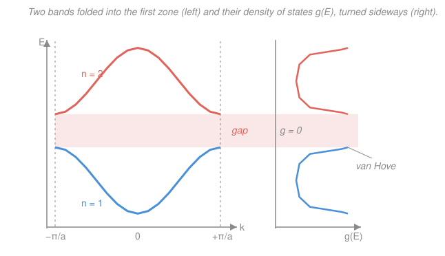

# Condensed Matter · Lesson 3.6: Bands, zones, and the density of states

> ⏱ ~15 min · Module 3: Electrons in solids · Builds on: [3.5 The tight-binding model](03-05-tight-binding.md), [3.3 Bloch's theorem](03-03-blochs-theorem.md) · Unlocks: [3.7 Metals, insulators, and semiconductors](03-07-metals-insulators-semiconductors.md)

## Why this matters

In [3.4](03-04-nearly-free-electron.md) and [3.5](03-05-tight-binding.md) you built a single band two ways — plane waves that crack open a gap at the zone boundary, and atomic orbitals that broaden into a cosine. Now we do the bookkeeping that turns those curves into a material's electronic identity. Two questions decide *everything* downstream: **how do the bands stack up in energy**, and **how many electrons can you pour in before you run out of room?** Answer them and you can predict, from the band diagram alone, whether a crystal is a copper wire or a diamond insulator — the punchline of [3.7](03-07-metals-insulators-semiconductors.md). The tool that makes the counting tractable is the **density of states**, and it will follow you into heat capacity, semiconductor carrier counts, magnetism, and superconductivity.

## The idea

A crystal doesn't have one band — it has infinitely many, one for each way the electron's internal wavefunction can arrange itself. Label them by a **band index** $n = 1, 2, 3, \dots$, so the full band structure is a family of curves $E_n(\mathbf{k})$: for each crystal momentum $\mathbf{k}$, a ladder of allowed energies.

Here's the catch that Bloch handed us in [3.3](03-03-blochs-theorem.md): $\mathbf{k}$ and $\mathbf{k}+\mathbf{G}$ (with $\mathbf{G}$ any reciprocal-lattice vector) label the *same* physical state. So you never need $\mathbf{k}$ outside the first Brillouin zone — anything further out is a copy. This gives you a choice of how to *draw* the same information, and then the real work: **stacking** the bands in energy and **counting** how many electron-slots each provides.

The counting has a clean punchline. A finite crystal of $N$ unit cells has exactly $N$ allowed $\mathbf{k}$-points in each Brillouin zone (from the Born–von Kármán boundary conditions of [3.3](03-03-blochs-theorem.md)). Each $\mathbf{k}$-point holds 2 electrons (spin up, spin down). So **every band holds $2N$ electrons — exactly 2 per unit cell.** That single fact is the hinge the metal/insulator question turns on.

## The formal version

**Zone schemes — three ways to draw one band structure.** All contain identical physics; they differ only in where you plot each piece.

- **Extended zone:** lay successive bands in successive Brillouin zones — band 1 in the first zone, band 2 in the second, and so on. Closest to the free-electron parabola of [3.1](03-01-free-electron-gas.md), which this deforms.
- **Reduced zone:** fold every band back into the **first** Brillouin zone using $\mathbf{k} \equiv \mathbf{k} + \mathbf{G}$. Each band index $n$ then gives one curve $E_n(\mathbf{k})$ over the first zone, stacked vertically. *In words: translate every stray piece of a band by whatever $\mathbf{G}$ lands it back in the first zone.* This is the standard picture (and what the figure below shows).
- **Repeated zone:** tile the reduced-zone picture periodically across all of $\mathbf{k}$-space, making the periodicity $E_n(\mathbf{k}) = E_n(\mathbf{k}+\mathbf{G})$ visible at a glance.

**Real (3D) band structures** are plotted as $E_n$ along **high-symmetry paths** through the Brillouin zone — a broken line like $\Gamma \to X \to L$ (where $\Gamma$ is the zone center and $X, L$ are special boundary points). You are seeing $E_n(\mathbf{k})$ sampled along a 1D route through a 3D zone, several bands at once.

**Band overlap.** Bands from *different directions* can overlap in energy even when a gap exists along one direction. A band might top out at $5.0\ \mathrm{eV}$ going toward $X$ but climb to $5.4\ \mathrm{eV}$ toward $L$; if the next band bottoms out at $5.2\ \mathrm{eV}$, then $5.2$–$5.4\ \mathrm{eV}$ is occupied by *both* bands (in different directions) and there is no true gap. *In words: to have a real gap, the lowest point of the upper band must sit above the highest point of the lower band, over the whole zone.* This is exactly what separates a metal from an insulator in [3.7](03-07-metals-insulators-semiconductors.md).

**Density of states.** Rather than track every $\mathbf{k}$, ask only: how many states lie in the energy window $[E, E+dE]$? That count per unit energy (per unit volume) is

$$g(E) = \sum_n \int_{\text{BZ}} \delta\!\big(E - E_n(\mathbf{k})\big)\, \frac{d^3k}{(2\pi)^3}.$$

*In words: sweep over the whole zone and every band, and tally a state each time $E_n(\mathbf{k})$ equals the energy $E$ you asked about.* Two consequences matter immediately: **$g(E) = 0$ inside a gap** (no band passes through), and $g(E)$ is large where bands are flat (many $\mathbf{k}$ share nearly the same energy).

**Van Hove singularities.** The integrand piles up wherever the band is flat, i.e. where the group velocity vanishes:

$$\nabla_{\mathbf{k}} E_n(\mathbf{k}) = 0.$$

These are band extrema (minima, maxima) and saddle points — and $g(E)$ develops a non-smooth feature there. *In words: flat spots in the band, like the zone-boundary regions of [3.4](03-04-nearly-free-electron.md)–[3.5](03-05-tight-binding.md), are where states bunch up in energy.* In **1D** these are $1/\sqrt{\,}$ **divergences** (as you'll derive below); in **3D** they are milder — $\sqrt{\,}$-type step edges at band bottoms/tops and kinks at saddle points. They are real, measurable features (in optical absorption, photoemission) that read out the shape of the bands.

**Filling and the Fermi level.** Pour in the crystal's electrons, filling $g(E)$ from the bottom up (Fermi–Dirac at $T=0$ is a hard cutoff — [3.1](03-01-free-electron-gas.md)). The level they reach is the **Fermi energy** $E_F$. Where it lands is the whole story:

- $E_F$ **inside a band** ($g(E_F) \neq 0$): partly filled, empty states just above — **metal**.
- $E_F$ **in a gap** ($g(E_F) = 0$): a filled band below, an empty band above — **insulator or semiconductor**.

Because each band holds 2 electrons per cell, this ties directly to valence: an *odd* number of electrons per cell can never exactly fill an integer number of bands, so it forces a partly filled band — a metal. (An even count *may* fill bands exactly, unless overlap intervenes.)

## Picture

Left: two bands folded into the first zone. Both are flat at the zone center and zone boundary — those flat spots ($\nabla_{\mathbf{k}}E = 0$) are the van Hove points. Right: the matching $g(E)$, turned on its side so energy still runs vertically. It spikes at every band edge and drops to exactly zero across the gap — no states there for $E_F$ to land in.

## Worked examples

**Example 1 (counting — fill a band).** A crystal has $N = 6\times10^{23}$ primitive cells, one atom per cell. (a) How many electron-states does the lowest band provide? (b) If the atom is **monovalent** (1 valence electron), what fraction of that band fills, and is the crystal a metal? (c) If it were **divalent**?

(a) Each band holds $2N$ states: $2 \times 6\times10^{23} = 1.2\times10^{24}$ states.

(b) Monovalent gives $N = 6\times10^{23}$ electrons. They occupy

$$\frac{N}{2N} = \frac12$$

of the band — **half-filled**. $E_F$ sits in the middle of the band, with empty states just above it: a **metal** (this is sodium, copper). Odd electron count $\Rightarrow$ guaranteed partial filling.

(c) Divalent gives $2N$ electrons — *exactly* one band's worth. If that band is cleanly separated from the next, the band fills completely, $E_F$ falls in the gap, and the crystal is an **insulator**. But if the filled band **overlaps** the next in energy (Example 3's mechanism), electrons spill into the upper band before the lower one is topped off, leaving both partly filled — a **metal** (a "semimetal," like calcium). Even valence is necessary but not sufficient for an insulator.

**Example 2 (sketch $g(E)$ and find the van Hove feature).** Take the 1D tight-binding $s$-band from [3.5](03-05-tight-binding.md), $E(k) = \varepsilon_0 - 2t\cos(ka)$, with $N$ cells and lattice constant $a$. Find $g(E)$ and locate its van Hove singularities.

Count states through the derivative. Along the chain, allowed $k$ are spaced $2\pi/L$ apart ($L = Na$), each energy $E$ is hit at two $k$-values ($\pm k$), and each carries 2 spins. So

$$g(E) = 2_{\text{spin}} \times 2_{\pm k} \times \frac{L}{2\pi}\,\frac{1}{|dE/dk|} = \frac{2N a}{\pi}\,\frac{1}{|dE/dk|}.$$

Now $\dfrac{dE}{dk} = 2ta\sin(ka)$, and since $\cos(ka) = (\varepsilon_0 - E)/2t$,

$$\sin(ka) = \sqrt{1 - \left(\frac{E - \varepsilon_0}{2t}\right)^2} = \frac{1}{2t}\sqrt{(2t)^2 - (E-\varepsilon_0)^2}.$$

Substituting, the $a$'s cancel:

$$\boxed{\,g(E) = \frac{2N}{\pi}\,\frac{1}{\sqrt{(2t)^2 - (E-\varepsilon_0)^2}}\,}, \qquad \varepsilon_0 - 2t \le E \le \varepsilon_0 + 2t.$$

This **diverges as $1/\sqrt{\,}$** at the two band edges $E = \varepsilon_0 \mp 2t$ and is smallest at the band center $E = \varepsilon_0$. The van Hove points sit where $dE/dk = 0$, i.e. $\sin(ka) = 0 \Rightarrow ka = 0$ (band bottom, $E = \varepsilon_0 - 2t$) and $ka = \pm\pi$ (band top, $E = \varepsilon_0 + 2t$). That is exactly the double-spiked, U-shaped $g(E)$ drawn (per band) in the figure.

## Watch out

- **You might think the reduced, extended, and repeated schemes are different physics.** They are the *same* band structure drawn three ways — every $\mathbf{k}$ outside the first zone is a relabeling $\mathbf{k}\to\mathbf{k}+\mathbf{G}$ of one inside it. Pick whichever makes the point clearest.
- **You might think "a gap along $\Gamma\to X$" means "an insulator."** Not necessarily — a gap in *one* direction can be swamped by band overlap from *another*. The gap must survive over the *entire* zone (upper band's global minimum above the lower band's global maximum) to block conduction.
- **You might read a van Hove divergence as "infinitely many states there."** $g(E)$ diverges but its *integral* (the actual state count) stays finite — $\int 1/\sqrt{E}\,dE$ converges. It's a sharp pile-up, not an infinity of electrons.
- **You might expect even valence $\Rightarrow$ insulator.** Only if the bands don't overlap. Divalent metals (Ca, Mg) exist precisely because they do.

## One-liner

> Fold the bands into the first zone, count $2N$ states (2 per cell) in each, tally them into $g(E)$ — zero in the gaps, spiking at the flat spots where $\nabla_{\mathbf{k}}E=0$ — then see whether the electrons stop $E_F$ inside a band (metal) or in a gap (insulator).

## Problems

**P1 (🟢)** A crystal has $N = 5\times10^{22}$ primitive cells with one monovalent atom per cell. How many valence electrons are there, how many states does the lowest band hold, and what fraction of it is filled? Metal or insulator, and why?

**P2 (🟡)** For a 1D tight-binding band $E(k) = \varepsilon_0 - 2t\cos(ka)$ over the first zone $-\pi/a \le k \le \pi/a$, find all $k$ where $dE/dk = 0$, give the energy at each, and state what the density of states does there and why those points are called van Hove singularities.

**P3 (🔴, optional)** A crystal's lower band reaches a maximum of $5.0\ \mathrm{eV}$ along $\Gamma\to X$ but climbs to $5.4\ \mathrm{eV}$ along $\Gamma\to L$; its upper band has a minimum of $5.2\ \mathrm{eV}$ (somewhere on the boundary). The atoms are divalent (2 electrons per cell). Filling exactly one band's worth of states, is $E_F$ in a gap or inside a band? Is this crystal an insulator or a metal? Explain using band overlap.

Solutions

**P1** One valence electron per cell gives $N = 5\times10^{22}$ electrons. The band holds $2N = 1\times10^{23}$ states. Filled fraction:

$$\frac{N}{2N} = \frac12 \quad\text{— half-filled.}$$

$E_F$ lands in the middle of the band, where $g(E_F)\neq 0$ and empty states sit just above: a **metal**. An odd number of electrons per cell can never fill a whole number of bands, so a partly filled band (hence a metal) is unavoidable.

*Check.* The absolute count cancels out — only electrons-per-cell versus 2-states-per-cell matters. $1/2 \le 1$, a sensible filling fraction. ✓

**P2** $\dfrac{dE}{dk} = 2ta\sin(ka) = 0 \Rightarrow \sin(ka) = 0 \Rightarrow ka = 0$ or $ka = \pm\pi$ (the zone center and the two zone boundaries, which are the same state).

- $ka = 0$: $E = \varepsilon_0 - 2t\cos 0 = \varepsilon_0 - 2t$ — the **band bottom**.
- $ka = \pm\pi$: $E = \varepsilon_0 - 2t\cos\pi = \varepsilon_0 + 2t$ — the **band top**.

At both, $g(E) = \dfrac{2N}{\pi}\big/\sqrt{(2t)^2 - (E-\varepsilon_0)^2}$ **diverges** (the denominator $\to 0$): a $1/\sqrt{\,}$ spike. They are van Hove singularities because $\nabla_k E = 0$ there — the band is flat, so a whole neighborhood of $k$ crowds into a razor-thin energy window, piling up the state density.

*Check.* The bandwidth is (top − bottom) $= 4t$, matching the $W = 2 \times(\text{coordination})\times t = 4t$ result for a 1D chain from [3.5](03-05-tight-binding.md) (coordination number 2). ✓ Between the spikes, at $E = \varepsilon_0$, $g$ is smallest — the band is steepest there, so states are spread thin. ✓

**P3** Compare the *global* extrema over the whole zone. The lower band's true maximum is $5.4\ \mathrm{eV}$ (reached along $\Gamma\to L$), while the upper band's minimum is $5.2\ \mathrm{eV}$. Since

$$5.2\ \mathrm{eV} \;<\; 5.4\ \mathrm{eV},$$

the bands **overlap** in the window $5.2$–$5.4\ \mathrm{eV}$: there is no global gap, even though a local gap ($5.0 \to 5.2$) exists along $\Gamma\to X$. Filling one band's worth of electrons, the last electrons prefer the upper band's low-lying states (below $5.4\ \mathrm{eV}$) over the lower band's remaining high states, so both bands end up **partly filled**. $E_F$ lies *inside* two overlapping bands, $g(E_F)\neq 0$ — a **metal** (specifically a semimetal). Divalence did **not** make it an insulator, because the gap doesn't survive across the zone.

*Check.* The insulator condition would need the upper band's minimum to exceed the lower band's maximum everywhere, i.e. $> 5.4\ \mathrm{eV}$; at $5.2\ \mathrm{eV}$ it fails. This is exactly the divalent-metal loophole from Example 1(c). ✓

## Flashback

**From Lesson 3.5 (The tight-binding model):** For the 1D $s$-band $E(k) = \varepsilon_0 - 2t\cos(ka)$, (a) what is the total bandwidth, and (b) at which $k$ in the first zone is the group velocity $v_g = \frac{1}{\hbar}\,dE/dk$ largest, and what is its value there? (Fresh variant — group velocity, not the DOS.)

Solution

(a) The band runs from its minimum $\varepsilon_0 - 2t$ (at $k=0$) to its maximum $\varepsilon_0 + 2t$ (at $k = \pm\pi/a$), so the bandwidth is

$$W = (\varepsilon_0 + 2t) - (\varepsilon_0 - 2t) = 4t.$$

(b) $v_g = \dfrac{1}{\hbar}\dfrac{dE}{dk} = \dfrac{2ta}{\hbar}\sin(ka)$, which is largest where $\sin(ka) = 1$, i.e. $ka = \pi/2 \Rightarrow k = \pi/2a$ (the middle of the zone). There

$$v_g^{\max} = \frac{2ta}{\hbar}.$$

*Check.* $v_g = 0$ at the band edges $k=0, \pm\pi/a$ — exactly the flat, van Hove spots of this lesson — and peaks in between, consistent with the steepest part of the cosine. Units: $[t\,a/\hbar] = (\mathrm{J}\cdot\mathrm{m})/(\mathrm{J\,s}) = \mathrm{m/s}$ ✓. Wider bands (larger $t$) carry faster electrons — more overlap, more mobile carriers. ✓

## Connections

- **Backward:** the folding rule $\mathbf{k}\equiv\mathbf{k}+\mathbf{G}$ is Bloch's theorem from [3.3](03-03-blochs-theorem.md); the bands being stacked are the very curves built in [3.4](03-04-nearly-free-electron.md) (NFE gap) and [3.5](03-05-tight-binding.md) (cosine band); and $g(E)$ generalizes the free-electron $g(\varepsilon)\propto\sqrt{\varepsilon}$ of [3.1](03-01-free-electron-gas.md) — that $\sqrt{\,}$ edge is itself the 3D van Hove feature at a band bottom.
- **Forward:** [3.7 Metals, insulators, and semiconductors](03-07-metals-insulators-semiconductors.md) turns "$E_F$ in a band vs in a gap" into the theory of conduction, effective mass, and holes; and $g(E)$ near the band edges is the raw material for counting carriers in [`semiconductor-devices`](../../semiconductor-devices/syllabus.md).
- **Sideways:** the Dirac-$\delta$ definition of $g(E)$ is the standard spectral-density construction from [`stat-mech`](../../stat-mech/syllabus.md) — the same object you integrate against Fermi–Dirac to get particle number and energy, and against Bose–Einstein for the phonon heat capacity of Module 2.
