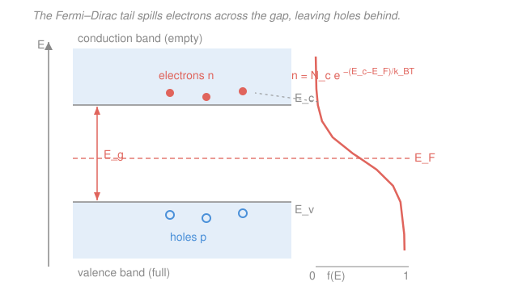

# Condensed Matter · Lesson 4.1: Intrinsic semiconductors and carrier statistics

> ⏱ ~15 min · Module 4: Semiconductors · Builds on: [3.7 Metals, insulators, and semiconductors](03-07-metals-insulators-semiconductors.md), [`stat-mech` syllabus](../../stat-mech/syllabus.md) · Unlocks: [4.2 Doping: donors, acceptors, and extrinsic carriers](04-02-doping-extrinsic.md)

## Why this matters

A pure silicon crystal at absolute zero is a perfect insulator: its valence band is completely full, its conduction band completely empty, and a filled band carries no current (that was the punchline of [3.7](03-07-metals-insulators-semiconductors.md)). Warm it up and something remarkable happens — a *tiny* population of electrons gets thermally kicked across the gap, and suddenly the material conducts, a little. How many carriers, and how does that number depend on temperature and on the gap? Answering that is the whole foundation of semiconductor electronics. The single most important result is the **law of mass action**, $np = n_i^2$ — a fixed budget that survives untouched when we start doping in [4.2](04-02-doping-extrinsic.md), and the reason a transistor works at all.

## The idea

Picture the gap as a cliff of height $E_g$ separating a full ledge (valence band) from an empty one (conduction band). Temperature is the only thing lifting electrons over the cliff. The probability of a thermal fluctuation big enough to clear an energy $E_g$ is governed by a Boltzmann factor $e^{-E_g/k_BT}$ — exponentially small, because $E_g \sim 1$ eV is dozens of times larger than the thermal energy $k_BT \approx 0.026$ eV at room temperature.

Every electron that makes the jump leaves behind an empty state in the valence band — a **hole**, which acts like a mobile positive charge ([3.7](03-07-metals-insulators-semiconductors.md)). In a pure crystal electrons and holes are created strictly in pairs, so their numbers are **equal**: $n = p$. Two facts do all the work. First, the number of carriers is set by a Boltzmann tail, so it's exponentially sensitive to $E_g/k_BT$. Second, because each band edge is parabolic with an effective mass, the "how many seats are available near the edge" factor is a clean, computable number. Multiply availability by occupancy probability and you have the carrier count.

## The formal version

**Where the carriers live.** Near the band edges $E(\mathbf{k})$ is parabolic (from [3.7](03-07-metals-insulators-semiconductors.md)): $E \approx E_c + \hbar^2k^2/2m_e^*$ in the conduction band and $E \approx E_v - \hbar^2 k^2/2m_h^*$ in the valence band, with **effective masses** $m_e^*$ (electrons) and $m_h^*$ (holes). A parabolic band in 3D has density of states $g(E) \propto (E-E_c)^{1/2}$ above $E_c$ (and the mirror image below $E_v$) — the same $\sqrt{E}$ shape as the free-electron gas of Module 3.1, just measured from the edge and weighted by $m^*$ instead of the bare mass.

**The Boltzmann approximation.** The occupancy is Fermi–Dirac, $f(E) = 1/\big(e^{(E-E_F)/k_BT}+1\big)$, with $E_F$ the Fermi level (= chemical potential; see [`stat-mech`](../../stat-mech/syllabus.md)). For an intrinsic semiconductor $E_F$ sits deep in the gap, so at the conduction edge $E_c - E_F \gg k_BT$ and the $+1$ is negligible:

$$f(E) \approx e^{-(E-E_F)/k_BT} \quad (E \ge E_c).$$

*In words: so few states are occupied that electrons don't compete for them — Fermi–Dirac collapses to plain Boltzmann.* Integrating $g(E)f(E)$ over the conduction band (a standard Gaussian-type integral) gives a beautifully simple result:

$$\boxed{\,n = N_c\, e^{-(E_c - E_F)/k_BT}\,}, \qquad N_c = 2\left(\frac{m_e^* k_B T}{2\pi\hbar^2}\right)^{3/2}.$$

The mirror calculation for holes (occupancy $1-f \approx e^{-(E_F-E_v)/k_BT}$) gives

$$\boxed{\,p = N_v\, e^{-(E_F - E_v)/k_BT}\,}, \qquad N_v = 2\left(\frac{m_h^* k_B T}{2\pi\hbar^2}\right)^{3/2}.$$

*In words: the whole band acts as if all its states were collapsed onto the edge, with an effective number $N_c$ (or $N_v$) of them.* $N_c$ and $N_v$ are the **effective densities of states** — think of $N_c$ as "how many conduction seats sit within $\sim k_BT$ of the edge." At 300 K they are of order $10^{19}\ \mathrm{cm^{-3}}$ (Si: $N_c \approx 2.8\times10^{19}$, $N_v \approx 1.0\times10^{19}\ \mathrm{cm^{-3}}$). Note $N_c, N_v \propto T^{3/2}$.

**Law of mass action.** Multiply $n$ and $p$. The Fermi level cancels completely:

$$np = N_c N_v\, e^{-(E_c - E_v)/k_BT} = N_c N_v\, e^{-E_g/k_BT} \equiv n_i^2,$$

with $E_g = E_c - E_v$. *In words: the product of electron and hole densities depends only on the gap and temperature — never on where $E_F$ sits, and (spoiler for [4.2](04-02-doping-extrinsic.md)) never on doping.* Define the **intrinsic carrier concentration**

$$\boxed{\,n_i = \sqrt{N_c N_v}\; e^{-E_g/2k_BT}\,}.$$

For a *pure* crystal $n = p$, and since $np = n_i^2$ this forces $n = p = n_i$ — that's what $n_i$ means. The factor $e^{-E_g/2k_BT}$ (note the **2**: it costs $E_g$ to make a *pair*, split between the two carriers) is why $n_i$ is minuscule and violently temperature-dependent.

**Where the Fermi level sits.** Set $n = p$ in the boxed expressions. The exponentials give

$$N_c\, e^{-(E_c-E_F)/k_BT} = N_v\, e^{-(E_F-E_v)/k_BT} \;\Longrightarrow\; E_F = \frac{E_c+E_v}{2} + \frac{3}{4}k_BT\ln\!\frac{m_h^*}{m_e^*}.$$

*In words: $E_F$ sits essentially at midgap, nudged off-center only by the logarithm of the effective-mass ratio.* The $\tfrac34$ comes from the $\tfrac32$ power in $N_c/N_v = (m_e^*/m_h^*)^{3/2}$, halved when you solve for $E_F$. Since $k_BT \approx 26$ meV and the log is $O(1)$, the offset is only tens of meV against a gap of $\sim1000$ meV — midgap is an excellent first guess.

## Picture

## Worked examples

**Example 1 — $n_i$ for silicon at 300 K.** Take $E_g = 1.12$ eV, $N_c = 2.8\times10^{19}\ \mathrm{cm^{-3}}$, $N_v = 1.0\times10^{19}\ \mathrm{cm^{-3}}$, and $k_BT = 0.02585$ eV. First the exponent:

$$\frac{E_g}{2k_BT} = \frac{1.12}{2(0.02585)} = 21.66, \qquad e^{-21.66} = 3.9\times10^{-10}.$$

The prefactor is $\sqrt{N_cN_v} = \sqrt{2.8\times10^{19}\cdot 1.0\times10^{19}} = 1.67\times10^{19}\ \mathrm{cm^{-3}}$. So

$$n_i = (1.67\times10^{19})(3.9\times10^{-10}) \approx 6.5\times10^{9}\ \mathrm{cm^{-3}}.$$

That is of order $10^{10}\ \mathrm{cm^{-3}}$ — the accepted room-temperature value for Si is $\approx 1\times10^{10}\ \mathrm{cm^{-3}}$ (the small difference is temperature-dependent effective masses and slight band-gap narrowing we've ignored). Compare it to silicon's $\sim 5\times10^{22}\ \mathrm{cm^{-3}}$ atoms, or to a metal's $\sim 10^{22}\ \mathrm{cm^{-3}}$ conduction electrons: intrinsic silicon has **twelve orders of magnitude** fewer free carriers than a metal. That's the whole reason it can be switched.

**Example 2 — the mass-action product, and Fermi-level offset.** In this same pure crystal, $n = p = n_i \approx 6.5\times10^9\ \mathrm{cm^{-3}}$, so

$$np = n_i^2 \approx (6.5\times10^9)^2 = 4.2\times10^{19}\ \mathrm{cm^{-6}}.$$

Here's the payoff: this product is *locked*. When we dope silicon $n$-type in [4.2](04-02-doping-extrinsic.md) to, say, $n = 10^{16}\ \mathrm{cm^{-3}}$, the hole density doesn't stay at $n_i$ — it's *squeezed* down to $p = n_i^2/n \approx 4.2\times10^{19}/10^{16} = 4.2\times10^{3}\ \mathrm{cm^{-3}}$. Majority carriers up, minority carriers down, product unchanged.

Now the Fermi level. Silicon's density-of-states masses give $N_c/N_v = 2.8$, so $(m_e^*/m_h^*)^{3/2} = 2.8$, i.e. $m_h^*/m_e^* = 2.8^{-2/3} = 0.50$. Then

$$E_F - \frac{E_c+E_v}{2} = \frac34 (0.02585)\ln(0.50) = \frac34(0.02585)(-0.693) = -0.013\ \mathrm{eV}.$$

$E_F$ sits about 13 meV *below* midgap. Holes are lighter here, so the valence band offers fewer effective seats; to keep $n=p$ the Fermi level drifts toward the valence side. A 13 meV shift on a 1120 meV gap — midgap was a fine approximation.

## Watch out

- **You might write $e^{-E_g/k_BT}$ for $n_i$.** That's the exponent for the *product* $np = n_i^2$. The concentration $n_i$ itself carries $e^{-E_g/2k_BT}$ — half the exponent, because one pair-creation energy $E_g$ is shared by two carriers. Dropping the 2 squares your error.
- **You might think doping breaks the law of mass action.** It doesn't. $np = n_i^2$ holds in *any* equilibrium semiconductor, doped or not, because $E_F$ cancels out of the product. Doping moves $E_F$ (raising $n$, lowering $p$, or vice versa) but leaves $n_i$ — a property of the host material — alone.
- **You might use the bare electron mass in $N_c$.** Use the *effective* mass $m_e^*$ from the band curvature, and specifically the density-of-states effective mass, which can differ from the transport one. And $N_c \ne N_v$ in general — that inequality is exactly what pushes $E_F$ off midgap.

## One-liner

> Thermal pair-creation across the gap gives $n = p = n_i = \sqrt{N_cN_v}\,e^{-E_g/2k_BT}$, and the product $np = n_i^2$ is a fixed budget independent of the Fermi level — the master equation of semiconductor physics.

## Problems

**P1 (🟢)** Confirm silicon's intrinsic concentration. Using $E_g = 1.12$ eV, $N_c = 2.8\times10^{19}\ \mathrm{cm^{-3}}$, $N_v = 1.0\times10^{19}\ \mathrm{cm^{-3}}$, and $k_BT = 0.0259$ eV, compute $n_i$ at 300 K.

**P2 (🟡)** Germanium has a smaller gap, $E_g = 0.66$ eV. Estimate the ratio $n_i(\mathrm{Ge})/n_i(\mathrm{Si})$ at 300 K from the **gap scaling alone** (i.e. ignore the difference in $\sqrt{N_cN_v}$ prefactors). Explain in one sentence why germanium is the "leakier" semiconductor.

**P3 (🔴, optional)** A hypothetical semiconductor has $m_h^* = 4\,m_e^*$. Find the position of $E_F$ relative to midgap at 300 K ($k_BT = 0.0259$ eV), and say which band edge it moves toward and why.

Solutions

**P1** Exponent: $E_g/2k_BT = 1.12/(2\cdot0.0259) = 21.62$, so $e^{-21.62} = 4.07\times10^{-10}$. Prefactor: $\sqrt{2.8\times10^{19}\cdot1.0\times10^{19}} = \sqrt{2.8}\times10^{19} = 1.67\times10^{19}\ \mathrm{cm^{-3}}$. Therefore

$$n_i = (1.67\times10^{19})(4.07\times10^{-10}) \approx 6.8\times10^{9}\ \mathrm{cm^{-3}}.$$

*Check.* Order $10^{10}\ \mathrm{cm^{-3}}$, matching the standard tabulated Si value $\approx1\times10^{10}$ to within the effective-mass approximations. Units: $\mathrm{cm^{-3}}$ from the prefactor, exponential dimensionless. ✓

**P2** With prefactors held equal, only the exponentials differ:

$$\frac{n_i(\mathrm{Ge})}{n_i(\mathrm{Si})} = \frac{e^{-E_g^{\mathrm{Ge}}/2k_BT}}{e^{-E_g^{\mathrm{Si}}/2k_BT}} = \exp\!\left[\frac{E_g^{\mathrm{Si}} - E_g^{\mathrm{Ge}}}{2k_BT}\right] = \exp\!\left[\frac{1.12 - 0.66}{2(0.0259)}\right] = e^{8.88} \approx 7\times10^{3}.$$

So germanium has roughly a thousand-fold-plus more intrinsic carriers. *In one sentence:* the exponential $e^{-E_g/2k_BT}$ is punishingly sensitive to the gap, so shaving 0.46 eV off $E_g$ multiplies the thermally generated carrier population by thousands — which is why Ge devices leak more current and are more temperature-sensitive.

*Check.* Actual $n_i(\mathrm{Ge}) \approx 2\times10^{13}$, $n_i(\mathrm{Si}) \approx 1\times10^{10}$, ratio $\sim 2\times10^3$ — same order as our gap-only estimate; the prefactor difference accounts for the rest. ✓

**P3** Offset formula:

$$E_F - E_{\text{mid}} = \frac34 k_BT\ln\frac{m_h^*}{m_e^*} = \frac34(0.0259)\ln(4) = (0.0194)(1.386) = +0.027\ \mathrm{eV}.$$

$E_F$ lies about **27 meV above midgap**, i.e. shifted toward the *conduction* band. *Why:* the heavy holes ($m_h^* = 4m_e^*$) make $N_v$ large — the valence band offers many effective seats — so to keep $n = p$ the Fermi level must sit closer to the conduction band, suppressing $n$ and boosting $p$ back into balance.

*Check.* Sign is consistent with Example 2, where the *lighter* holes ($m_h^*/m_e^* = 0.5$) pushed $E_F$ the opposite way (below midgap). Magnitude $\sim k_BT$, tiny against a full gap. ✓

## Flashback

**From Lesson 3.5 / 3.7 (tight-binding bands and effective mass):** A 1D tight-binding $s$-band is $E(k) = \varepsilon_0 - 2t\cos(ka)$ with hopping $t = 1.0$ eV and lattice spacing $a = 3.0$ Å. Find the effective mass $m^*$ at the **band bottom** ($k=0$), as a fraction of the free-electron mass $m_0 = 9.11\times10^{-31}$ kg. What is $m^*$ at the **band top** ($k = \pi/a$), and what does its sign mean?

Solution

Effective mass is $m^* = \hbar^2 / (d^2E/dk^2)$. Differentiate: $dE/dk = 2ta\sin(ka)$, then $d^2E/dk^2 = 2ta^2\cos(ka)$.

At the **bottom** $k=0$: $\cos = 1$, so $d^2E/dk^2 = 2ta^2$ and

$$m^* = \frac{\hbar^2}{2ta^2} = \frac{(1.055\times10^{-34})^2}{2(1.60\times10^{-19})(3.0\times10^{-10})^2} = \frac{1.11\times10^{-68}}{2.88\times10^{-38}} = 3.9\times10^{-31}\ \mathrm{kg} \approx 0.42\,m_0.$$

At the **top** $k=\pi/a$: $\cos(\pi) = -1$, so $d^2E/dk^2 = -2ta^2$ and $m^* = -\hbar^2/2ta^2 \approx -0.42\,m_0$. The **negative** effective mass means an electron near the band top accelerates *opposite* to an applied force — which is exactly why we bookkeep it instead as a positive-mass, positive-charge **hole**. Those holes are the valence-band carriers this whole lesson counts.

*Check.* $t = 1$ eV $= 1.60\times10^{-19}$ J; $a^2 = 9.0\times10^{-20}\ \mathrm{m^2}$. Result is a fraction of $m_0$, physically sensible for a moderately wide band. Larger $t$ (more overlap → wider band) would give a *smaller* $m^*$ — lighter, faster carriers. ✓

## Connections

- **Backward:** the parabolic band edges and effective masses come straight from [3.7](03-07-metals-insulators-semiconductors.md), and the $\sqrt{E}$ density of states is the free-electron $g(E)$ of Module 3.1 measured from a band edge. The Boltzmann-tail integral is the dilute limit of the Fermi–Dirac statistics of [`stat-mech`](../../stat-mech/syllabus.md).
- **Forward:** [4.2 Doping](04-02-doping-extrinsic.md) breaks the $n=p$ symmetry by adding donors/acceptors — but $np = n_i^2$ from this lesson survives untouched and immediately gives the minority-carrier density. This result also feeds Boss problem 4 and the whole diode story in [4.5](04-05-pn-junction.md).
- **Sideways (statistical mechanics):** $E_F$ here is the chemical potential $\mu$ of the electron gas ([`stat-mech`](../../stat-mech/syllabus.md)); "the Fermi level sits at midgap" is a statement about the chemical potential equilibrating electron and hole reservoirs. Downstream, these carrier statistics are the input to every device in [`semiconductor-devices`](../../semiconductor-devices/syllabus.md).
