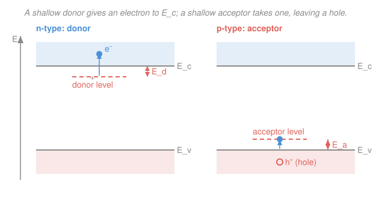

# Condensed Matter · Lesson 4.2: Doping — donors, acceptors, and extrinsic carriers

> ⏱ ~15 min · Module 4: Semiconductors · Builds on: [4.1 Intrinsic semiconductors and carrier statistics](04-01-intrinsic-carriers.md) · Unlocks: [4.3 The Fermi level vs temperature and doping](04-03-fermi-level-temperature-doping.md)

## Why this matters

Pure silicon at room temperature has about $10^{10}$ mobile electrons per cubic centimeter — sounds like a lot, until you learn a metal has $\sim 10^{22}$. Intrinsic silicon is a lousy conductor, and worse, its carrier count is set by the exponential in [4.1](04-01-intrinsic-carriers.md), so it swings wildly with temperature. Every transistor, diode, and solar cell in existence depends on fixing both problems at once: **doping** lets us dial the carrier concentration to any value we want, choose whether the carriers are electrons or holes, and make that count nearly temperature-independent. This one trick — swapping in a few parts-per-million of the right impurity — is what turned a mediocre semiconductor into the foundation of all electronics.

## The idea

Silicon sits in column IV: each atom shares four valence electrons into four bonds, and every electron is spoken for. Now replace one silicon atom with **phosphorus** (column V). Four of its electrons slot into the bonds — but the fifth has no bond to join. It's stuck orbiting the phosphorus nucleus's extra $+1$ charge, held by a weak Coulomb leash. Weak, because the silicon around it *screens* the attraction (the crystal's dielectric constant is large) and the electron is *light* (it moves with the small conduction-band effective mass). The leash is so slack that ordinary thermal jostling at room temperature snaps it: the electron breaks free into the conduction band, leaving a fixed positive phosphorus ion behind. Phosphorus **donated** an electron. Do this a lot and you have far more electrons than the intrinsic crystal ever had — an **n-type** semiconductor, "n" for the negative carriers.

Now instead use **boron** (column III), which brings only three electrons. One bond is left short a electron — a **hole**, an empty slot that neighboring electrons can hop into. It costs almost nothing for a valence electron next door to jump in and fill boron's missing bond; doing so leaves the hole where *it* came from. So the hole wanders off into the valence band, and boron sits as a fixed negative ion. Boron **accepted** an electron and set a hole loose — a **p-type** semiconductor, "p" for positive.

> In words: a dopant one column over drops a spare electron (or a spare hole) into the crystal for almost free.

The magic is that the "almost free" is quantitative. The binding energy of that extra electron isn't the ~1 eV of a normal bond — it's *tens of milli-electron-volts*, comparable to the thermal energy $k_B T \approx 26$ meV at room temperature. That's why doping works at all.

## The formal version

### The hydrogenic donor

The extra electron orbiting a donor ion is a hydrogen atom in disguise: one electron bound to one net $+e$ charge. Two things differ from vacuum hydrogen. First, the Coulomb attraction is screened by the host's **relative permittivity** $\varepsilon_r$ (about 12 for silicon), so $e^2/4\pi\varepsilon_0 \to e^2/4\pi\varepsilon_0\varepsilon_r$. Second, the electron carries the **effective mass** $m^*$ from the conduction band ([3.7](../../condensed-matter/lessons/03-07-metals-insulators-semiconductors.md) in scope), not the bare mass $m$. Rydberg's formula for the ground-state binding energy $E_d$ (measured *down* from the conduction-band edge $E_c$) and the orbit's Bohr radius $a_d$ then read

$$E_d = 13.6\ \text{eV} \times \frac{m^*/m}{\varepsilon_r^2}, \qquad a_d = a_0\,\frac{\varepsilon_r}{m^*/m},$$

with $a_0 = 0.0529$ nm the vacuum Bohr radius. *In words: the donor level is a hydrogen level, made shallow by the light effective mass in the numerator and the strong screening in the denominator.* For silicon ($m^*/m \approx 0.2$, $\varepsilon_r \approx 12$):

$$E_d \approx 13.6 \times \frac{0.2}{144} \approx 0.019\ \text{eV} = 19\ \text{meV}, \qquad a_d \approx 0.0529 \times \frac{12}{0.2} \approx 3.2\ \text{nm}.$$

The level sits a mere 19 meV below $E_c$ — a **shallow donor** — and the orbit spans ~6 lattice constants, so the electron really does average over many atoms and "sees" a dielectric continuum, which is what justifies using $\varepsilon_r$ in the first place. An acceptor is the mirror image: a shallow level a small energy $E_a$ **above** the valence-band edge $E_v$, ready to accept a valence electron.

### Majority and minority carriers, and mass action

Let $N_d$ be the donor density and $N_a$ the acceptor density. At room temperature $k_B T \approx 26\ \text{meV} > E_d$, so essentially **every donor is ionized**. For an n-type crystal with $N_d \gg n_i$ (the intrinsic density from [4.1](04-01-intrinsic-carriers.md)), charge neutrality gives the electron density

$$\boxed{\,n \approx N_d\,}$$

— the **majority carriers**. But the minority holes are *not* zero. The law of mass action from [4.1](04-01-intrinsic-carriers.md), $np = n_i^2$, is a statement about thermal equilibrium and holds no matter how you dope. So the **minority** hole density is

$$p = \frac{n_i^2}{n} \approx \frac{n_i^2}{N_d}.$$

*In words: pinning the electron count high forces the hole count symmetrically low, because their product is fixed.* Symmetrically, a p-type crystal has $p \approx N_a$ (majority holes) and $n = n_i^2/N_a$ (minority electrons). Doping shifts the two densities by many orders of magnitude in opposite directions while $np = n_i^2$ never budges — a see-saw pivoting on $n_i$.

### The three temperature regimes

The clean result $n \approx N_d$ only holds in a middle temperature window; sweep $T$ and $n(T)$ passes through three regimes (fully developed in [4.3](04-03-fermi-level-temperature-doping.md)):

- **Freeze-out** (low $T$, $k_B T \ll E_d$): thermal energy can't ionize the donors, electrons fall back onto them, and $n$ drops below $N_d$.
- **Extrinsic / saturation** (moderate $T$): all donors ionized but intrinsic generation still negligible, so $n \approx N_d$ — flat, temperature-independent. This is the useful device regime.
- **Intrinsic** (high $T$): $n_i(T)$ grows past $N_d$ and swamps the doping; the crystal forgets it was doped and $n \approx p \approx n_i$.

## Picture

## Worked examples

**Example 1 (the hydrogenic estimate).** Gallium arsenide has $m^*/m \approx 0.067$ and $\varepsilon_r \approx 12.9$. How shallow is a donor, and how big is its orbit?

$$E_d = 13.6 \times \frac{0.067}{12.9^2} = 13.6 \times \frac{0.067}{166} \approx 0.0055\ \text{eV} = 5.5\ \text{meV},$$
$$a_d = 0.0529\ \text{nm} \times \frac{12.9}{0.067} \approx 10\ \text{nm}.$$

Even shallower than silicon (the lighter effective mass wins), with an orbit spanning ~18 lattice constants. The lesson: light carriers and strong screening both push donors toward the band edge — which is exactly what you want, so thermal energy ionizes them easily.

**Example 2 (majority and minority, and why the see-saw matters).** Dope silicon n-type with $N_d = 1\times10^{17}\ \text{cm}^{-3}$; take $n_i = 1.0\times10^{10}\ \text{cm}^{-3}$ at 300 K. Then

$$n \approx N_d = 1\times10^{17}\ \text{cm}^{-3}, \qquad p = \frac{n_i^2}{N_d} = \frac{(10^{10})^2}{10^{17}} = 10^{3}\ \text{cm}^{-3}.$$

The electrons outnumber the holes by fourteen orders of magnitude. This is why a doped semiconductor conducts by *one* carrier type: the current through an n-type sample is carried by electrons almost exclusively, since there are essentially no holes to help. Note also that $n \approx 10^{17}$ is seven orders above the intrinsic $10^{10}$ — a few parts per million of phosphorus (silicon has $\sim 5\times10^{22}$ atoms/cm³) multiplied the free-electron count ten-million-fold. That leverage is the whole point of doping.

## Watch out

- **You might think doping violates the law of mass action.** It doesn't — $np = n_i^2$ holds in *any* non-degenerate semiconductor in equilibrium, doped or not. Doping changes $n$ and $p$ individually (pushing one up, the other down) but leaves their product locked at $n_i^2$. Mass action *is* how you get the minority density.
- **You might think an n-type crystal is negatively charged.** It is electrically neutral. Each donated electron leaves behind a fixed $+e$ donor ion; the mobile negative electrons and fixed positive ions balance exactly. "n-type" refers to the sign of the *mobile carriers*, not a net charge.
- **You might read $E_d$ as the level's energy above zero.** $E_d$ is the *binding energy* — the small gap $E_c - E_{\text{donor}}$ *below* the conduction band, not $E_c$ itself. Likewise $E_a$ is measured *up* from $E_v$. Shallow means small $E_d$, i.e. close to the band edge.

## One-liner

> A column-V or column-III impurity plants a hydrogen-like level a few $k_B T$ from the band edge; it ionizes at room temperature to set $n\approx N_d$ (or $p\approx N_a$), and the law of mass action fixes the minority carrier at $n_i^2/N_d$.

## Problems

**P1 (🟢)** A semiconductor has conduction-band effective mass $m^*/m = 0.3$ and relative permittivity $\varepsilon_r = 10$. Estimate the donor binding energy $E_d$ (in meV) and the donor Bohr radius $a_d$ (in nm). Is this a shallow donor?

**P2 (🟢)** Silicon is doped n-type with $N_d = 5\times10^{16}\ \text{cm}^{-3}$; take $n_i = 1.0\times10^{10}\ \text{cm}^{-3}$. Find the majority electron density $n$ and the minority hole density $p$. Which is the majority carrier, and is this n- or p-type?

**P3 (🟡)** Classify each doping of silicon (column IV) as donor or acceptor, and give the resulting type (n or p) and majority carrier: (a) arsenic, As (column V); (b) aluminum, Al (column III); (c) gallium, Ga (column III); (d) antimony, Sb (column V). *Stretch:* if a silicon sample contains $N_d = 1\times10^{16}\ \text{cm}^{-3}$ phosphorus **and** $N_a = 4\times10^{15}\ \text{cm}^{-3}$ boron together (compensation), what is the net majority carrier density?

Solutions

**P1** Plug into the hydrogenic formulas:

$$E_d = 13.6\ \text{eV} \times \frac{0.3}{10^2} = 13.6 \times \frac{0.3}{100} = 0.0408\ \text{eV} \approx 41\ \text{meV},$$
$$a_d = 0.0529\ \text{nm} \times \frac{10}{0.3} \approx 1.8\ \text{nm}.$$

Yes, it is shallow: 41 meV is only ~1.6× the room-temperature thermal energy $k_B T \approx 26$ meV, so thermal ionization is easy. (It's less shallow than silicon's 19 meV because the heavier effective mass and weaker screening both push the level deeper.)

*Check.* Units: 13.6 eV × (dimensionless) = eV ✓; $a_0$ × (dimensionless) = nm ✓. Limiting sense: increasing $\varepsilon_r$ (more screening) or decreasing $m^*$ (lighter electron) would shrink $E_d$ and grow $a_d$ — the level gets shallower and the orbit larger, as expected. ✓

**P2** All donors ionized at room temperature, and $N_d = 5\times10^{16} \gg n_i = 10^{10}$, so

$$n \approx N_d = 5\times10^{16}\ \text{cm}^{-3}, \qquad p = \frac{n_i^2}{n} = \frac{(1.0\times10^{10})^2}{5\times10^{16}} = \frac{10^{20}}{5\times10^{16}} = 2\times10^{3}\ \text{cm}^{-3}.$$

Electrons are the majority carrier by $n/p \approx 2.5\times10^{13}$; this is **n-type**.

*Check.* Mass action: $np = (5\times10^{16})(2\times10^3) = 10^{20} = n_i^2$ ✓ — the product is preserved. Order of magnitude: majority ≈ dopant, minority tiny, exactly the see-saw. ✓

**P3** Compare each dopant's column to silicon's column IV. Column V = one extra electron = **donor → n-type** (electrons majority). Column III = one fewer electron = **acceptor → p-type** (holes majority).

- (a) As (V): donor, **n-type**, electrons.
- (b) Al (III): acceptor, **p-type**, holes.
- (c) Ga (III): acceptor, **p-type**, holes.
- (d) Sb (V): donor, **n-type**, electrons.

*Stretch (compensation).* Donors and acceptors partly cancel: the $4\times10^{15}$ holes from boron are filled by electrons from phosphorus. What's left is the net donor excess,

$$n \approx N_d - N_a = 1\times10^{16} - 4\times10^{15} = 6\times10^{15}\ \text{cm}^{-3},$$

still n-type (net donors win), just with a reduced carrier count. (This assumes $N_d - N_a \gg n_i$, which holds here.)

*Check.* If instead $N_a > N_d$ the sign would flip to p-type with $p \approx N_a - N_d$; if $N_a = N_d$ the sample is "fully compensated" and behaves intrinsically ($n \approx p \approx n_i$). The formula degrades gracefully in every limit. ✓

## Flashback

**From Lesson 4.1 (Intrinsic carriers and mass action):** A pure semiconductor has effective densities of states $N_c = 2.8\times10^{19}\ \text{cm}^{-3}$ and $N_v = 1.0\times10^{19}\ \text{cm}^{-3}$, a band gap $E_g = 1.12$ eV, and $k_B T = 0.0259$ eV at 300 K. Use $n_i = \sqrt{N_c N_v}\,\exp(-E_g/2k_B T)$ to find the intrinsic carrier concentration. (Fresh variant — different numbers than the lesson.)

Solution

$$\sqrt{N_c N_v} = \sqrt{(2.8\times10^{19})(1.0\times10^{19})} = \sqrt{2.8\times10^{38}} = 1.67\times10^{19}\ \text{cm}^{-3}.$$

The exponent is $-E_g/2k_BT = -1.12/(2\times0.0259) = -1.12/0.0518 = -21.6$, so $e^{-21.6} \approx 4.1\times10^{-10}$. Then

$$n_i = 1.67\times10^{19} \times 4.1\times10^{-10} \approx 6.9\times10^{9}\ \text{cm}^{-3}.$$

*Check.* This is the ~$10^{10}\ \text{cm}^{-3}$ figure quoted for silicon at room temperature ✓. The exponential dominates: halving $k_B T$ (cooling to 150 K) would roughly double the exponent's magnitude to $-43$, sending $n_i$ down by another factor $\sim e^{-21} \approx 10^{-9}$ — the violent temperature sensitivity that doping exists to tame. ✓

## Connections

- **Backward:** the law of mass action $np = n_i^2$ and the intrinsic density $n_i$ come straight from [4.1](04-01-intrinsic-carriers.md); this lesson just breaks the electron–hole symmetry by adding fixed charges. The effective mass $m^*$ and dielectric screening that make donors shallow are the band-structure and free-carrier ideas of [3.7](../../condensed-matter/lessons/03-07-metals-insulators-semiconductors.md).
- **Forward:** [4.3](04-03-fermi-level-temperature-doping.md) turns "all donors ionized" and the three regimes into a quantitative $E_F(T)$ via charge neutrality; [4.4](04-04-transport-mobility-hall.md) puts these carriers in motion (conductivity $\sigma = ne\mu$, and the Hall sign that distinguishes n- from p-type); [4.5](04-05-pn-junction.md) joins an n-region to a p-region to make a diode. Feeds Boss problem 4.
- **Sideways (quantum mechanics):** the shallow-donor calculation *is* the hydrogen-atom solution from [`quantum-mechanics`](../../quantum-mechanics/syllabus.md), with the two substitutions $e^2 \to e^2/\varepsilon_r$ and $m \to m^*$ — the same Rydberg and Bohr-radius formulas, rescaled by the crystal's screening and effective mass.
