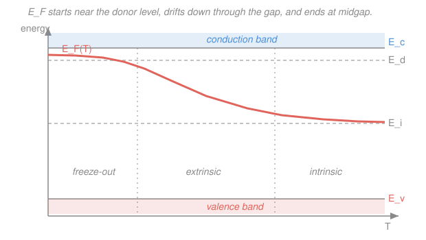

# Condensed Matter · Lesson 4.3: The Fermi level vs temperature and doping

> ⏱ ~15 min · Module 4: Semiconductors · Builds on: [4.2 Doping: donors, acceptors, and extrinsic carriers](04-02-doping-extrinsic.md), [4.1 Intrinsic semiconductors and carrier statistics](04-01-intrinsic-carriers.md) · Unlocks: [4.4 Transport: mobility, conductivity, and the Hall effect](04-04-transport-mobility-hall.md)

## Why this matters

You now know two things separately: a pure crystal makes electron–hole pairs by the millions (4.1), and a pinch of dopant floods one band with carriers (4.2). But *how many* carriers you actually get — and whether the dopant even matters — is decided by one number: where the **Fermi level** $E_F$ sits inside the band gap. Raise it toward the conduction band and you have electrons; drop it toward the valence band and you have holes; park it at midgap and you're back to the intrinsic crystal. This lesson is the single organizing principle of the whole module: **charge neutrality pins $E_F$**, and tracking $E_F(T, \text{doping})$ tells you everything — including the temperature above which your carefully doped transistor stops behaving like a transistor.

## The idea

A doped crystal has to stay electrically neutral — you can't build up net charge in a chunk of silicon sitting on the bench. So the mobile charges (electrons, holes) and the fixed ionized dopants (positive donor cores, negative acceptor cores) must exactly balance. That balance is a single equation, and it has exactly one free knob: the Fermi level. Slide $E_F$ up and you get more electrons and fewer holes; slide it down and the reverse. Nature slides it to wherever neutrality holds. **$E_F$ is not something you choose — it's the value that makes the books balance.**

Two levers move it. **Doping**: add donors and you're injecting electrons, so $E_F$ has to rise toward the conduction band to hold them; add acceptors and it sinks toward the valence band. Heavier doping pushes $E_F$ harder against the band edge (push hard enough and it crosses *into* the band — "degenerate" doping, a metal in disguise). **Temperature**: this one's sneakier, and it splits a fixed n-type sample into three acts. Cold, the donors haven't even given up their electrons yet (*freeze-out*). Warm, all donors are ionized and the carrier count is locked at the doping level (*extrinsic* — the useful regime). Hot, the crystal's own thermal pair-generation dwarfs the doping and $E_F$ crawls back to midgap (*intrinsic* — the doping has "washed out"). The whole story is one curve, $E_F(T)$, drooping from near the donor level down to midgap.

## The formal version

**Charge neutrality.** Sum of positive charges equals sum of negative charges, per unit volume:

$$p + N_d^+ = n + N_a^-.$$

*In words: holes plus ionized (positively charged) donors balance electrons plus ionized (negatively charged) acceptors.* Here $n$ is the electron density, $p$ the hole density, $N_d^+$ the density of donors that have given up their electron, and $N_a^-$ the density of acceptors that have grabbed one.

The carrier densities depend on $E_F$ through the Boltzmann tails you derived in [4.1](04-01-intrinsic-carriers.md):

$$n = N_c\, e^{-(E_c - E_F)/k_B T}, \qquad p = N_v\, e^{-(E_F - E_v)/k_B T},$$

where $E_c, E_v$ are the conduction/valence band edges, $k_B$ is Boltzmann's constant, $T$ the temperature, and $N_c, N_v$ are the **effective densities of states**, both scaling as $N_c, N_v \propto T^{3/2}$. *In words: how many electrons (holes) you get is set by how far $E_F$ sits below $E_c$ (above $E_v$), measured in units of $k_B T$.* Substituting these into neutrality gives one equation for the one unknown $E_F$ — that's the pin.

**The extrinsic plateau (fully ionized, doping dominates).** For an n-type sample warm enough that every donor is ionized ($N_d^+ = N_d$) but not so hot that intrinsic pairs matter ($n_i \ll N_d$), neutrality collapses to $n \approx N_d$. Inverting $n = N_c e^{-(E_c-E_F)/k_B T}$:

$$\boxed{\,E_c - E_F = k_B T \ln\!\left(\frac{N_c}{N_d}\right)\,}$$

*In words: the Fermi level sits below the conduction band by a logarithm of "how many seats vs how many electrons".* More doping ($N_d\uparrow$) shrinks the log and pushes $E_F$ **up** toward $E_c$. Higher temperature does the opposite: both $k_B T$ and $N_c\propto T^{3/2}$ grow, so $E_c - E_F$ grows and $E_F$ **drifts down** toward midgap even while $n$ stays flat at $N_d$. The mirror statement for p-type is $E_F - E_v = k_B T \ln(N_v/N_a)$.

**The three temperature regimes** (fixed n-type $N_d$), reading the curve in the Picture left to right:

- **Freeze-out** ($k_B T \lesssim E_d$, where $E_d = E_c - E_{\text{donor}}$ is the donor ionization energy): thermal energy is too small to ionize all donors, so $N_d^+ < N_d$ and $n < N_d$. $E_F$ sits **between the donor level and $E_c$**; $n$ climbs as $T$ rises and more donors let go.
- **Extrinsic / saturation** (intermediate $T$): all donors ionized, $n \approx N_d$ = constant. $E_F$ drifts **down** from the donor level toward midgap as $T$ rises (the $N_c\propto T^{3/2}$ effect above).
- **Intrinsic** (high $T$, once $n_i(T) > N_d$): thermal generation swamps the dopant, $n \approx n_i(T) = \sqrt{N_c N_v}\,e^{-E_g/2k_B T}$ rises exponentially, and $E_F$ returns to **midgap**. The doping is invisible.

The crossover — the **intrinsic onset** — is set by $n_i(T^\ast) \approx N_d$. Above $T^\ast$ your device's doping "washes out"; that's the top of its operating-temperature window.

## Picture

## Worked examples

**Example 1 (where does $E_F$ sit at 300 K?).** Take n-type silicon, $N_d = 1\times10^{17}\ \mathrm{cm^{-3}}$, with $N_c = 2.8\times10^{19}\ \mathrm{cm^{-3}}$ and $E_g = 1.12$ eV. At room temperature $k_B T = 0.0259$ eV and every shallow donor is ionized, so we're in the extrinsic plateau, $n \approx N_d$:

$$E_c - E_F = k_B T \ln\!\left(\frac{N_c}{N_d}\right) = 0.0259 \times \ln\!\left(\frac{2.8\times10^{19}}{1\times10^{17}}\right) = 0.0259 \times \ln(280) = 0.0259 \times 5.63 \approx 0.146\ \mathrm{eV}.$$

So $E_F$ lies $0.146$ eV below the conduction band. Compare to midgap, which is $E_g/2 = 0.56$ eV below $E_c$: our $E_F$ is far above midgap, in the upper third of the gap — exactly what "n-type" should look like. *Sanity:* undope it ($N_d\to n_i\approx10^{10}$) and the log becomes $\ln(2.8\times10^{9})\approx21.8$, giving $E_c-E_F\approx0.56$ eV — back to midgap. ✓

**Example 2 (which regime, and when does it wash out?).** Same sample. At 300 K, is it extrinsic? Yes: $k_B T = 0.0259$ eV comfortably exceeds a shallow donor's $E_d\approx0.045$ eV, so donors are ionized; and $n_i\approx10^{10}\ \mathrm{cm^{-3}} \lll N_d=10^{17}$, so intrinsic pairs are negligible. Squarely extrinsic — the good regime.

Now heat it. The **intrinsic onset** $T^\ast$ solves $n_i(T^\ast) = N_d$. Using $n_i = \sqrt{N_c N_v}\,e^{-E_g/2k_B T}$ with $\sqrt{N_c N_v}\approx1.7\times10^{19}\ \mathrm{cm^{-3}}$ (treating the prefactor as roughly constant for an estimate):

$$e^{-E_g/2k_B T^\ast} = \frac{N_d}{\sqrt{N_c N_v}} = \frac{10^{17}}{1.7\times10^{19}} = 5.9\times10^{-3} \;\Longrightarrow\; \frac{E_g}{2k_B T^\ast} = \ln\!\frac{1}{5.9\times10^{-3}} = 5.14.$$

With $E_g = 1.12$ eV and $k_B = 8.62\times10^{-5}\ \mathrm{eV/K}$:

$$T^\ast = \frac{E_g}{2 k_B \times 5.14} = \frac{1.12}{2\times8.62\times10^{-5}\times5.14} \approx 1.3\times10^{3}\ \mathrm{K}.$$

So this heavily doped chip stays extrinsic until roughly $1300$ K — hopelessly hot, which is *why* silicon works. *Check.* Including the $T^{3/2}$ growth of $\sqrt{N_c N_v}$ (which I froze at its 300 K value) makes $n_i$ rise faster, so the true onset is lower — iterating brings it down to $\sim\!950$ K. Order-of-magnitude the point stands: heavier doping $\Rightarrow$ higher $T^\ast$ $\Rightarrow$ a wider operating window. Lightly doped material goes intrinsic much sooner (Problem 2). ✓

## Watch out

- **You might think you set the Fermi level by choosing the doping.** You set the *inputs* ($N_d$, $N_a$, $T$); $E_F$ is the *output* — the root of the charge-neutrality equation. It moves on its own when $T$ changes even though you touched nothing.
- **You might think more doping always means more carriers, period.** In the extrinsic plateau yes, but heat past $T^\ast$ and $n\to n_i(T)$ regardless of $N_d$ — the intrinsic tide drowns the dopant. That "washout" is a failure mode, not a feature.
- **You might read the extrinsic $E_F$ drift as carriers disappearing.** In saturation $n\approx N_d$ is *constant*; $E_F$ slides down only because the number of available conduction-band states $N_c\propto T^{3/2}$ is ballooning, so the same $n$ electrons need less of a Boltzmann boost to fill. Don't confuse "$E_F$ falling" with "electrons leaving."

## One-liner

> Charge neutrality pins the Fermi level: doping lifts it toward a band edge, heat drags it back to midgap — and the temperature where it lets go is where your device stops working.

## Problems

**P1 (🟢)** A silicon sample is doped p-type with $N_a = 5\times10^{16}\ \mathrm{cm^{-3}}$. Using $N_v = 1.04\times10^{19}\ \mathrm{cm^{-3}}$ and $k_B T = 0.0259$ eV at 300 K (all acceptors ionized, extrinsic), find how far $E_F$ sits **above** the valence-band edge $E_v$. Is $E_F$ above or below midgap?

**P2 (🟡)** Lightly doped n-type silicon has $N_d = 1\times10^{15}\ \mathrm{cm^{-3}}$. Estimate the intrinsic-onset temperature $T^\ast$ (where $n_i \approx N_d$), using $n_i = \sqrt{N_c N_v}\,e^{-E_g/2k_B T}$ with $\sqrt{N_c N_v}\approx1.7\times10^{19}\ \mathrm{cm^{-3}}$ and $E_g = 1.12$ eV (freeze the prefactor for the estimate). Compare to Example 2's heavily doped result and explain the trend.

**P3 (🔴, optional)** Phosphorus donors in silicon have ionization energy $E_d \approx 0.045$ eV. A P-doped sample is cooled to liquid-nitrogen temperature, $T = 77$ K. Compute $k_B T$ there and argue which of the three regimes the sample is in. Which way (up or down) does $E_F$ move relative to its 300 K position, and roughly where does it end up?

Solutions

**P1** Extrinsic p-type mirror of the boxed formula:

$$E_F - E_v = k_B T \ln\!\left(\frac{N_v}{N_a}\right) = 0.0259 \times \ln\!\left(\frac{1.04\times10^{19}}{5\times10^{16}}\right) = 0.0259 \times \ln(208) = 0.0259 \times 5.34 \approx 0.138\ \mathrm{eV}.$$

So $E_F$ sits $0.138$ eV **above** $E_v$ — i.e. in the *lower* part of the gap, well below midgap (which is $0.56$ eV above $E_v$). *Check.* p-type should push $E_F$ toward the valence band, and it does. Units: eV $\times$ (dimensionless log) = eV ✓.

**P2** Solve $e^{-E_g/2k_B T^\ast} = N_d/\sqrt{N_c N_v} = 10^{15}/(1.7\times10^{19}) = 5.9\times10^{-5}$:

$$\frac{E_g}{2k_B T^\ast} = \ln\!\frac{1}{5.9\times10^{-5}} = 9.74 \;\Longrightarrow\; T^\ast = \frac{E_g}{2k_B\times9.74} = \frac{1.12}{2\times8.62\times10^{-5}\times9.74} \approx 670\ \mathrm{K}.$$

Lighter doping ($10^{15}$ vs $10^{17}$) gives a **lower** onset ($\sim\!670$ K vs $\sim\!1300$ K): there are fewer dopant-electrons for the intrinsic pairs to overtake, so the crystal goes intrinsic sooner. *Check.* Same trend the Watch-out predicts — a lightly doped device has a narrower temperature window. (Restoring the $T^{3/2}$ prefactor lowers this further, toward $\sim\!550$ K; order-of-magnitude intact.) ✓

**P3** $k_B T = 8.62\times10^{-5}\ \mathrm{eV/K}\times 77\ \mathrm{K} = 6.6\times10^{-3}$ eV $= 6.6$ meV. Compare to the donor binding energy $E_d = 45$ meV: the ratio $E_d/k_B T \approx 6.8$, so the Boltzmann factor $e^{-E_d/k_B T}\approx e^{-6.8}\approx1\times10^{-3}$ strongly suppresses ionization — most donors still clutch their electrons. This is **freeze-out**. As $T$ drops from 300 K to 77 K, $E_F$ moves **up**, climbing out of the gap toward the donor level, ending **between $E_d$ and $E_c$** (near their midpoint as $T\to0$). *Check.* Matches the left edge of the Picture's $E_F(T)$ curve, and the physics: cold means the electrons re-bind to their donors, so the Fermi level tracks back up to those donor states. ✓

## Flashback

**From Lesson 4.1 (Law of mass action):** An n-type silicon sample has an electron concentration $n = 1\times10^{16}\ \mathrm{cm^{-3}}$ at 300 K, where the intrinsic concentration is $n_i = 1\times10^{10}\ \mathrm{cm^{-3}}$. Find the minority-hole concentration $p$. (Fresh numbers — the mass-action law, not a plug-back of 4.1's example.)

Solution

The law of mass action $np = n_i^2$ holds in equilibrium regardless of doping:

$$p = \frac{n_i^2}{n} = \frac{(10^{10})^2}{10^{16}} = \frac{10^{20}}{10^{16}} = 1\times10^{4}\ \mathrm{cm^{-3}}.$$

*Check.* Majority electrons outnumber minority holes by $n/p = 10^{12}$ — a wild imbalance, exactly why one carrier type dominates conduction in doped material. Units: $(\mathrm{cm^{-3}})^2/\mathrm{cm^{-3}} = \mathrm{cm^{-3}}$ ✓. Note $p \lll N_d$, confirming the "$n\approx N_d$" approximation used throughout this lesson. ✓

## Connections

- **Backward:** this fuses [4.1](04-01-intrinsic-carriers.md)'s carrier formulas $n=N_c e^{-(E_c-E_F)/k_BT}$, $p=N_v e^{-(E_F-E_v)/k_BT}$ with [4.2](04-02-doping-extrinsic.md)'s ionized dopants into one neutrality equation. The Fermi level *is* the chemical potential of [`stat-mech` 1.4](../../stat-mech/lessons/01-04-temperature-pressure-chemical-potential.md) — the quantity that equalizes to balance particle exchange, here balancing charge.
- **Forward:** [4.4 Transport](04-04-transport-mobility-hall.md) turns the carrier count $n(T)$ you can now locate into a conductivity $\sigma = ne\mu$; the S-shaped $n$-vs-$1/T$ curve behind this lesson is exactly what a Hall measurement reconstructs. The $E_F$ on either side of a junction is what [`semiconductor-devices`](../../semiconductor-devices/syllabus.md) aligns to build the p–n diode ([4.5](04-05-pn-junction.md)).
- **Sideways:** the "one equation, one hidden variable set by a balance condition" move is the same self-consistency you meet in mean-field magnetism (Module 5) — there it's magnetization, here it's $E_F$.
