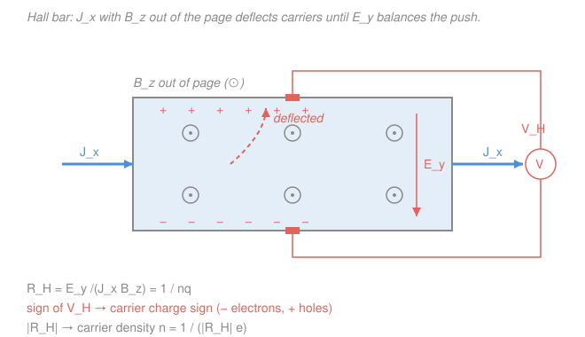

# Condensed Matter · Lesson 4.4: Transport — mobility, conductivity, and the Hall effect

> ⏱ ~15 min · Module 4: Semiconductors · Builds on: [4.3 The Fermi level vs temperature and doping](04-03-fermi-level-temperature-doping.md), [3.7 Metals, insulators, and semiconductors](03-07-metals-insulators-semiconductors.md) · Unlocks: [4.5 The p–n junction](04-05-pn-junction.md)

## Why this matters

So far we have *counted* carriers — how many electrons $n$ sit in the conduction band and holes $p$ in the valence band. But a count is not a current. To turn carrier statistics into the thing you measure on a bench — a resistance, a current, a voltage — you need to know how carriers *move* when you push on them. This lesson builds that bridge: from a field $\mathbf{E}$ to a drift, from a drift to a conductivity $\sigma = ne\mu$, and from a magnetic field to the **Hall effect** — the single cleanest experiment in solid-state physics, which tells you the carrier *density*, the carrier *sign*, and settles once and for all that holes are real, positive charge carriers. It is also how you tell a semiconductor from a metal without ever looking inside.

## The idea

Picture an electron in the crystal as a marble rolling down a gently tilted floor (the field $\mathbf{E}$) that is studded with pegs (phonons and impurities). Between pegs it accelerates; every collision randomizes its direction and it starts over. It never runs away — it reaches a steady average speed, the **drift velocity**, set by how hard you tilt the floor and how often you hit a peg. That is the whole **Drude picture**: acceleration plus random scattering equals a terminal drift proportional to the field.

Two knobs control the drift. **Mobility** $\mu$ answers "how fast per unit field?" — it bundles the average time between collisions and how sluggish the carrier is (its effective mass $m^*$ from [3.7](03-07-metals-insulators-semiconductors.md)). **Density** $n$ answers "how many marbles are rolling?" The current is just the two multiplied by the charge. And here is the punchline that separates metals from semiconductors: in a metal $n$ is fixed, so raising the temperature only adds pegs and current *drops*; in a semiconductor raising the temperature liberates exponentially more carriers, and current *rises sharply*. Opposite signs — that is the tell.

## The formal version

**Drift velocity and mobility.** Newton's law for a carrier of effective mass $m^*$ and charge $-e$ in a field $\mathbf{E}$, with scattering modeled as a drag that resets momentum on the average **scattering time** $\tau$ (seconds), gives a steady state when acceleration balances drag:

$$m^*\frac{\mathbf{v}_d}{\tau} = -e\mathbf{E} \qquad\Longrightarrow\qquad \mathbf{v}_d = -\frac{e\tau}{m^*}\,\mathbf{E} \equiv -\mu\mathbf{E}, \qquad \boxed{\;\mu = \frac{e\tau}{m^*}\;}$$

*In words: carriers do not accelerate forever; they settle at a drift speed proportional to the field, and the proportionality constant is the mobility.* Here $\mu$ (units $\mathrm{cm^2/(V\cdot s)}$, "how many cm/s of drift per V/cm of field") is large when collisions are rare (big $\tau$) and the carrier is nimble (small $m^*$).

**Current and conductivity.** A density $n$ (per $\mathrm{m^3}$) of charge $-e$ drifting at $\mathbf{v}_d$ carries a current density $\mathbf{J} = (-e)n\mathbf{v}_d = ne\mu\mathbf{E}$. Comparing to Ohm's law $\mathbf{J} = \sigma\mathbf{E}$:

$$\sigma = ne\mu, \qquad \sigma = e(n\mu_e + p\mu_h)\ \text{(both carriers)}, \qquad \rho = \frac{1}{\sigma}.$$

*In words: conductivity is charge times how many carriers times how mobile they are; electrons and holes add because both drift the same way as current even though they move in opposite directions.* Resistivity $\rho$ ($\Omega\cdot\mathrm{m}$) is just its reciprocal. Note $\mu_e, \mu_h$ differ because electrons and holes have different $m^*$ — in silicon electrons are roughly three times more mobile than holes.

**Temperature dependence — the diagnostic.** Split the two factors in $\sigma = ne\mu$:

- **Mobility** always *falls* with heating: more phonons means shorter $\tau$. For phonon-limited transport $\mu \propto T^{-3/2}$. Adding dopants adds a second scattering channel (charged impurities); by **Matthiessen's rule** the rates add, $1/\mu = 1/\mu_{\text{phonon}} + 1/\mu_{\text{imp}}$, so heavier doping always lowers $\mu$.
- **Carrier number** is the difference-maker. In a **metal** $n$ is pinned (the band is partly full regardless of $T$), so $\sigma \propto \mu$ *falls* and $\rho$ rises with $T$. In an intrinsic **semiconductor** $n \propto T^{3/2}e^{-E_g/2k_BT}$ explodes upward, and this exponential crushes the $\mu \propto T^{-3/2}$ power law, so

$$\sigma \propto e^{-E_g/2k_BT}\quad\text{(rises sharply with }T\text{)}.$$

*In words: heat a metal and it conducts worse; heat a semiconductor and it conducts far better — the sign of $d\sigma/dT$ is how you tell them apart.* A plot of $\ln\sigma$ vs $1/T$ is a straight line of slope $-E_g/2k_B$ — this is how the band gap is measured.

**The Hall effect.** Send a current $J_x$ along $x$ through a slab in a magnetic field $B_z$ pointing out of the plane. The moving carriers feel the Lorentz force $\mathbf{F} = q\mathbf{v}\times\mathbf{B}$, which shoves them sideways (along $y$). Charge piles up on one edge until the transverse **Hall field** $E_y$ it creates exactly cancels the magnetic push. Balancing $qE_y = -q v_x B_z$ and using $J_x = nqv_x$ gives the **Hall coefficient**

$$\boxed{\;R_H \equiv \frac{E_y}{J_x B_z} = \frac{1}{nq}\;}$$

with $q$ the *signed* carrier charge ($q=-e$ for electrons, $q=+e$ for holes). *In words: measure a sideways voltage per unit current per unit field, and you read off both the sign and the number of the charges doing the work.* Two facts fall out for free:

- **Sign.** Electrons and holes both deflect to the *same physical edge* (the force $q\mathbf{v}\times\mathbf{B}$ flips sign twice — once for $q$, once for $\mathbf{v}$), but they deposit *opposite* charge there. So $R_H < 0$ for electrons, $R_H > 0$ for holes. Measuring a **positive** $R_H$ in $p$-type material is the cleanest direct proof that holes are genuine positive carriers, not just bookkeeping — exactly the object [3.7](03-07-metals-insulators-semiconductors.md) introduced as an empty state in a nearly full band.
- **Density.** The magnitude gives $n = 1/(|R_H|\,e)$, and combined with $\sigma$ you also extract the **Hall mobility** $\mu_H = |R_H|\,\sigma$. This — the Hall bar — is *the* standard characterization measurement for any new semiconductor.

## Picture

## Worked examples

**Example 1 (mobility and conductivity from microscopics).** Electrons in a doped silicon sample have effective mass $m^* = 0.26\,m_e$ (with $m_e = 9.11\times10^{-31}\,\mathrm{kg}$) and scattering time $\tau = 2.0\times10^{-13}\,\mathrm{s}$. The doping gives $n = 1.0\times10^{22}\,\mathrm{m^{-3}}$ ($=10^{16}\,\mathrm{cm^{-3}}$). Find $\mu$, $\sigma$, and $\rho$.

Mobility:

$$\mu = \frac{e\tau}{m^*} = \frac{(1.6\times10^{-19})(2.0\times10^{-13})}{0.26\times9.11\times10^{-31}} = \frac{3.2\times10^{-32}}{2.37\times10^{-31}} \approx 0.135\ \mathrm{m^2/(V\cdot s)} = 1350\ \mathrm{cm^2/(V\cdot s)}.$$

That is right on top of silicon's measured electron mobility ($\sim\!1400$). Conductivity and resistivity:

$$\sigma = ne\mu = (10^{22})(1.6\times10^{-19})(0.135) \approx 216\ \mathrm{S/m}, \qquad \rho = \frac{1}{\sigma} \approx 4.6\times10^{-3}\ \Omega\cdot\mathrm{m} = 0.46\ \Omega\cdot\mathrm{cm}.$$

A realistic value for lightly doped silicon. Every number came from $\tau$, $m^*$, and $n$.

**Example 2 (reading a Hall measurement).** A rectangular sample is characterized on a Hall bar. The extracted Hall coefficient is $R_H = -6.25\times10^{-4}\ \mathrm{m^3/C}$, and a separate four-probe measurement gives $\sigma = 216\ \mathrm{S/m}$. What are the carrier type, density, and mobility?

- **Type:** $R_H < 0$ $\Rightarrow$ the carriers are **electrons** — the material is $n$-type.
- **Density:** $n = \dfrac{1}{|R_H|\,e} = \dfrac{1}{(6.25\times10^{-4})(1.6\times10^{-19})} = \dfrac{1}{1.0\times10^{-22}} = 1.0\times10^{22}\ \mathrm{m^{-3}} = 10^{16}\ \mathrm{cm^{-3}}.$
- **Mobility:** $\mu_H = |R_H|\,\sigma = (6.25\times10^{-4})(216) \approx 0.135\ \mathrm{m^2/(V\cdot s)} = 1350\ \mathrm{cm^2/(V\cdot s)}.$

Notice this is exactly the sample of Example 1, now read *backwards* from two bench measurements. That round-trip — microscopics predicting a measurement, a measurement recovering the microscopics — is the whole point of transport theory.

## Watch out

- **You might think electrons and holes deflect to opposite edges in the Hall bar.** They don't — they pile onto the *same* edge, because reversing the charge sign also reverses the drift direction and the two sign flips cancel in $q\mathbf{v}\times\mathbf{B}$. What differs is the *sign of the charge* deposited there, hence the sign of $V_H$. That is precisely why the Hall sign is diagnostic.
- **You might think a semiconductor conducts better when cold, like a metal cleaned of phonons.** Backwards. A metal's $n$ is fixed so cooling (fewer phonons, longer $\tau$) helps; a semiconductor's $n$ collapses exponentially on cooling as carriers freeze back onto their atoms, and that dominates the mobility gain. Cold semiconductors are near-insulators.
- **You might drop the effective mass and use the free electron mass in $\mu = e\tau/m^*$.** In a crystal it is always $m^*$ — the band curvature from [3.7](03-07-metals-insulators-semiconductors.md) — that sets the inertia. Using $m_e$ can be off by factors of several.

## One-liner

> Drift gives $\sigma = ne\mu$ with $\mu = e\tau/m^*$; the sign of $d\sigma/dT$ tells a semiconductor from a metal, and the sign of the Hall coefficient $R_H = 1/nq$ tells electrons from holes.

## Problems

**P1 (🟢)** Holes in a $p$-type semiconductor have effective mass $m^* = 0.5\,m_e$ and scattering time $\tau = 1.4\times10^{-13}\,\mathrm{s}$, at a density $p = 5.0\times10^{21}\,\mathrm{m^{-3}}$. Find the hole mobility $\mu_h$ (in $\mathrm{cm^2/(V\cdot s)}$) and the conductivity $\sigma$. Use $e = 1.6\times10^{-19}\,\mathrm{C}$, $m_e = 9.11\times10^{-31}\,\mathrm{kg}$.

**P2 (🟡)** A Hall-bar measurement on an unknown sample yields $R_H = +1.25\times10^{-3}\ \mathrm{m^3/C}$. (a) Is the sample $n$-type or $p$-type, and how do you know? (b) Find the majority-carrier density. (c) If the same sample has $\sigma = 400\ \mathrm{S/m}$, find the Hall mobility.

**P3 (🔴, optional)** A pure (intrinsic) semiconductor's conductivity is measured to be $\sigma = 2.4\ \mathrm{S/m}$ at $T_1 = 300\,\mathrm{K}$ and $\sigma = 38\ \mathrm{S/m}$ at $T_2 = 350\,\mathrm{K}$. Treating $\sigma \approx \sigma_0\,e^{-E_g/2k_BT}$ (ignore the weak $T^{3/2}$ prefactor), estimate the band gap $E_g$ in eV. Then explain in one sentence why a *metal* would show the opposite trend. Use $k_B = 8.62\times10^{-5}\ \mathrm{eV/K}$.

Solutions

**P1** Mobility:

$$\mu_h = \frac{e\tau}{m^*} = \frac{(1.6\times10^{-19})(1.4\times10^{-13})}{0.5\times9.11\times10^{-31}} = \frac{2.24\times10^{-32}}{4.56\times10^{-31}} \approx 0.0492\ \mathrm{m^2/(V\cdot s)} = 492\ \mathrm{cm^2/(V\cdot s)}.$$

Conductivity:

$$\sigma = pe\mu_h = (5.0\times10^{21})(1.6\times10^{-19})(0.0492) \approx 39\ \mathrm{S/m}.$$

*Check.* Units: $\mathrm{C\cdot s/kg} = \mathrm{A\cdot s^2/kg} = \mathrm{m^2/(V\cdot s)}$ ✓ (since $\mathrm{V} = \mathrm{kg\,m^2/(A\,s^3)}$). Magnitude: a hole mobility of a few hundred $\mathrm{cm^2/(V\cdot s)}$ and $m^*$ twice the electron value give roughly a third the electron mobility of Example 1 — the expected electron/hole asymmetry. ✓

**P2** (a) $R_H > 0$, so the carriers are **holes** — the sample is $p$-type. The sign of the Hall coefficient equals the sign of the carrier charge. (b)

$$p = \frac{1}{|R_H|\,e} = \frac{1}{(1.25\times10^{-3})(1.6\times10^{-19})} = \frac{1}{2.0\times10^{-22}} = 5.0\times10^{21}\ \mathrm{m^{-3}} = 5\times10^{15}\ \mathrm{cm^{-3}}.$$

(c) $\mu_H = |R_H|\,\sigma = (1.25\times10^{-3})(400) = 0.50\ \mathrm{m^2/(V\cdot s)} = 5000\ \mathrm{cm^2/(V\cdot s)}.$

*Check.* $R_H$ has units $\mathrm{m^3/C}$; $R_H\sigma$ has units $(\mathrm{m^3/C})(\mathrm{S/m}) = \mathrm{m^3\,S/(C\,m)} = \mathrm{m^2/(V\cdot s)}$ ✓. Density $\sim10^{15}\,\mathrm{cm^{-3}}$ is a sensible light doping. ✓

**P3** Take the ratio to kill $\sigma_0$:

$$\frac{\sigma_2}{\sigma_1} = \exp\!\left[-\frac{E_g}{2k_B}\left(\frac{1}{T_2}-\frac{1}{T_1}\right)\right] \;\Longrightarrow\; \ln\frac{\sigma_2}{\sigma_1} = -\frac{E_g}{2k_B}\left(\frac{1}{T_2}-\frac{1}{T_1}\right).$$

Numbers: $\ln(38/2.4) = \ln(15.8) = 2.76$. And $\frac{1}{350}-\frac{1}{300} = 2.857\times10^{-3} - 3.333\times10^{-3} = -4.76\times10^{-4}\ \mathrm{K^{-1}}$. So

$$E_g = -2k_B\,\frac{\ln(\sigma_2/\sigma_1)}{(1/T_2 - 1/T_1)} = -2(8.62\times10^{-5})\,\frac{2.76}{-4.76\times10^{-4}} \approx 2(8.62\times10^{-5})(5.80\times10^{3}) \approx 1.0\ \mathrm{eV}.$$

So $E_g \approx 1.0\ \mathrm{eV}$ — a silicon-like gap. A metal would show the *opposite* trend because its carrier density $n$ is fixed, so heating only shortens $\tau$ (more phonon scattering) and $\sigma \propto \mu$ *falls*; the semiconductor's exponential gain in $n$ has no counterpart in a metal.

*Check.* $\sigma$ rose by a factor $\sim16$ over just 50 K — a hallmark exponential (thermally activated) response, impossible for a metal, and the extracted $\sim1\,\mathrm{eV}$ lands squarely in the semiconductor range. ✓

## Flashback

**From Lesson 4.3 (The Fermi level vs temperature and doping):** An $n$-type silicon sample has electron density $n = 1.0\times10^{16}\ \mathrm{cm^{-3}}$, while the intrinsic concentration is $n_i = 1.0\times10^{10}\ \mathrm{cm^{-3}}$ at $T = 300\ \mathrm{K}$. Using $n = n_i\,e^{(E_F - E_i)/k_BT}$ (with $E_i$ the intrinsic/midgap level), find how far the Fermi level sits above midgap. Take $k_BT = 0.0259\ \mathrm{eV}$.

Solution

Solve for the offset:

$$E_F - E_i = k_BT\,\ln\!\frac{n}{n_i} = (0.0259)\,\ln\!\left(\frac{10^{16}}{10^{10}}\right) = (0.0259)\ln(10^6) = (0.0259)(13.82) \approx 0.358\ \mathrm{eV}.$$

So doping pushes $E_F$ about $0.36\ \mathrm{eV}$ above midgap, toward the conduction band — the signature of $n$-type material.

*Check.* Six decades of density enter through a logarithm, giving a sub-gap shift ($0.36\,\mathrm{eV} < E_g/2 \approx 0.56\,\mathrm{eV}$), so $E_F$ stays inside the gap as it must ✓. More doping $\Rightarrow$ larger $n/n_i \Rightarrow$ $E_F$ climbs further toward the band edge — consistent with 4.3's extrinsic regime. ✓

## Connections

- **Backward:** the mobility $\mu = e\tau/m^*$ inherits the effective mass $m^*$ from [3.7](03-07-metals-insulators-semiconductors.md)'s band curvature and the carrier densities $n, p$ from [4.1](04-01-intrinsic-carriers.md)–[4.3](04-03-fermi-level-temperature-doping.md); the Drude drag model is the semiclassical dynamics of a wavepacket accelerating under $\mathbf{E}$ between scattering events.
- **Forward:** [4.5 The p–n junction](04-05-pn-junction.md) sets the drift current of this lesson against a *diffusion* current (carriers flowing down a density gradient), and their balance builds the built-in potential of the diode — mobility and the Einstein relation $D = (k_BT/e)\mu$ tie the two together.
- **Sideways:** the scattering time $\tau$ and Matthiessen's rule reappear whenever phonons limit a rate — the same phonon population from the Bose–Einstein statistics of [`stat-mech`](../../stat-mech/syllabus.md) and the phonon modes of Module 2 ([2.3](02-03-phonons-quantization.md)) that set a metal's $\rho(T)$. The Lorentz-force balance behind $R_H$ is the same magnetostatics you would meet in [`waves-optics`](../../waves-optics/syllabus.md)/E&M.
