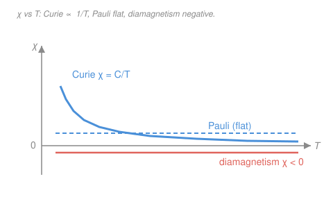

# Condensed Matter · Lesson 5.1: Diamagnetism and paramagnetism

> ⏱ ~15 min · Module 5: Magnetism and superconductivity · Builds on: [4.5 The p–n junction](04-05-pn-junction.md), [3.2 The Fermi surface and electronic heat capacity](03-02-fermi-surface-heat-capacity.md), [`stat-mech` syllabus](../../stat-mech/syllabus.md) · Unlocks: [5.2 Exchange and ferromagnetism](05-02-exchange-ferromagnetism.md)

## Why this matters

Hold a chunk of any material near a magnet and it responds — usually so feebly you'd never notice. Some materials are pushed *away* from the field (they are diamagnetic — water, copper, bismuth, your own hand); others are pulled gently *in* (paramagnetic — aluminum, liquid oxygen, most transition-metal salts). This weak, linear tug is the ground floor of magnetism, and it turns out to be a remarkably sharp diagnostic. The *sign* of the response tells you whether the atoms carry permanent magnetic moments; the *temperature dependence* tells you whether those moments are localized on ions or belong to a sea of conduction electrons. Before we can build a ferromagnet in [5.2](05-02-exchange-ferromagnetism.md), we need the non-cooperative baseline: how a material magnetizes when its electrons respond to the field but *not* to each other.

## The idea

Put a material in an applied field and it develops a **magnetization** $\mathbf{M}$ — a magnetic moment per unit volume. For weak fields the response is linear, and the constant of proportionality is the whole subject of this lesson: the **susceptibility** $\chi$. There are exactly two ways a pile of electrons can answer the field.

**Diamagnetism — the universal flinch.** Even electrons with no permanent moment must obey Lenz's law: switch on a field and the electron orbits speed up or slow down just enough to generate a current whose *own* field **opposes** the change. The material develops a moment pointing *against* the applied field, so $\chi < 0$. This happens in every material — it's a property of orbiting charge, not of any special magnetic ingredient — but it is tiny, and because it doesn't involve any thermal competition, it barely depends on temperature.

**Paramagnetism — pre-existing moments lining up.** If the atoms already carry permanent magnetic moments (from unpaired electron spins or orbital angular momentum), the field has something to grab. Each moment has lower energy pointing *along* the field, so the field tries to align them — but thermal kicks keep knocking them askew. The result is a partial alignment *with* the field, $\chi > 0$, set by a tug-of-war between alignment energy and $k_B T$. Turn up the temperature and the alignment loses ground: this is why paramagnetism famously *weakens as it heats up*.

There's a twist that makes the second case a beautiful probe. In a metal the "moments" are the spins of itinerant conduction electrons — but Pauli exclusion means almost all of them are blocked from flipping (the same logic that froze out the heat capacity in [3.2](03-02-fermi-surface-heat-capacity.md)). Only the few electrons near the Fermi surface can respond, and their number doesn't change with temperature. So metallic (Pauli) paramagnetism is *temperature-independent* — the exact opposite of the localized-moment case, and a direct readout of the density of states $g(E_F)$.

## The formal version

**Susceptibility.** In SI the magnetization responds to the field strength $\mathbf{H}$ (units A/m) as

$$\mathbf{M} = \chi\,\mathbf{H}, \qquad \chi \equiv \frac{M}{H} \ \ (\text{dimensionless}),$$

and the magnetic flux density is $\mathbf{B} = \mu_0(\mathbf{H}+\mathbf{M}) = \mu_0(1+\chi)\mathbf{H}$, with $\mu_0 = 4\pi\times10^{-7}\ \mathrm{T\,m/A}$. *In words: $\chi$ is the fractional magnetic response — how much moment per unit field the material makes.* For the responses in this lesson $|\chi|$ is small, $\sim 10^{-6}$ to $10^{-3}$, so we may freely treat $B \approx \mu_0 H$ inside the material.

**Larmor diamagnetism.** An applied field $B$ makes each electron orbit precess, adding a small current loop whose moment opposes $B$. Summing over $Z$ electrons per atom at mean-square orbital radius $\langle r^2\rangle$, with number density $n$ of atoms, gives

$$\boxed{\;\chi_{\text{dia}} \approx -\frac{\mu_0\, n\, e^2}{6 m}\,\langle r^2\rangle\;}$$

where $e$ is the electron charge magnitude and $m$ its mass. *In words: every orbiting electron makes a moment fighting the field, so $\chi$ is negative; it is set by the geometric size of the orbits, is independent of temperature, and is present in all matter.* The minus sign is Lenz's law made quantitative — it is the one truly universal magnetic response.

**Langevin / Curie paramagnetism (localized moments).** Take $n$ permanent moments per unit volume, each of magnitude $\mu$, in a field $B$. Model the simplest case — a spin that can only point along or against the field (a two-level moment $\pm\mu$, energy $\mp\mu B$). Boltzmann statistics (a two-state partition function — exactly the machinery of the [`stat-mech` syllabus](../../stat-mech/syllabus.md)) gives the average moment, and the magnetization is

$$M = n\mu\,\tanh\!\left(\frac{\mu B}{k_B T}\right).$$

*In words: at low field or high temperature only a slight majority points "up"; as $\mu B$ overwhelms $k_B T$ the $\tanh$ saturates at $n\mu$ — every moment aligned.* For the weak fields we care about, $\mu B \ll k_B T$, so $\tanh x \approx x$ and

$$M \approx \frac{n\mu^2 B}{k_B T} \quad\Longrightarrow\quad \chi = \frac{\mu_0 M}{B} = \frac{\mu_0 n \mu^2}{k_B T} \equiv \frac{C}{T} \qquad(\text{spin-}\tfrac12).$$

This is the **Curie law**: susceptibility falls as $1/T$ because thermal agitation fights alignment. The full quantum treatment for a moment of total angular momentum $J$ (Landé factor $g$) replaces the two-level average by the Brillouin function, and its small-field limit is the standard form

$$\boxed{\;\chi = \frac{C}{T}, \qquad C = \frac{\mu_0\, n\, g^2 J(J+1)\,\mu_B^2}{3 k_B}\;}$$

with $\mu_B = e\hbar/2m = 9.274\times10^{-24}\ \mathrm{J/T}$ the Bohr magneton and $\mu_{\text{eff}}^2 = g^2 J(J+1)\mu_B^2$ the *effective moment*. *In words: the Curie constant is set by how big the permanent moments are.* The factor $\tfrac13$ is the thermal average of $\cos^2\theta$ over orientations; for a pure spin-$\tfrac12$ moment $g^2 J(J+1) = 4\cdot\tfrac12\cdot\tfrac32 = 3$, which cancels the 3 and reproduces the two-level result $C = \mu_0 n\mu_B^2/k_B$ above.

**Pauli paramagnetism (itinerant electrons).** In a metal the moments are conduction-electron spins, each $\pm\mu_B$. The field lowers the energy of "up" spins by $\mu_B B$ and raises "down" by $\mu_B B$, so electrons want to flip down→up — but almost all sit deep in the Fermi sea with no empty state to move to. Only those within $\sim\mu_B B$ of $E_F$ can flip. The number that repopulate is $\sim g(E_F)\,\mu_B B$, each carrying $2\mu_B$, giving a moment density $\sim \mu_B^2 g(E_F) B$ and

$$\boxed{\;\chi_{\text{Pauli}} = \mu_0\,\mu_B^2\, g(E_F)\;}$$

with $g(E_F)$ the density of states (states per unit energy per unit volume, both spins) at the Fermi level from [3.2](03-02-fermi-surface-heat-capacity.md). *In words: only the electrons near $E_F$ can respond, and there are $g(E_F)$ of them per unit energy no matter the temperature — so $\chi_{\text{Pauli}}$ is small, positive, and independent of $T$.* Contrast the $1/T$ Curie law: the flat-vs-diverging temperature dependence is exactly what distinguishes localized moments from itinerant ones, and $\chi_{\text{Pauli}}$ is a clean second probe of $g(E_F)$ alongside the heat-capacity slope $\gamma$ of [3.2](03-02-fermi-surface-heat-capacity.md).

**Landau diamagnetism.** The same free electrons whose *spins* give $\chi_{\text{Pauli}}$ also have their *orbital* motion quantized into Landau levels by the field, producing a diamagnetic response. For free electrons it is exactly

$$\chi_{\text{Landau}} = -\tfrac13\,\chi_{\text{Pauli}},$$

so the net susceptibility of an ideal free-electron gas is $\chi_{\text{Pauli}} + \chi_{\text{Landau}} = \tfrac23\,\chi_{\text{Pauli}}$, still paramagnetic (band-structure effective mass can tip real metals like bismuth net-diamagnetic).

**The four responses at a glance:**

| Response | Origin | Sign of $\chi$ | $T$-dependence | Set by |
|---|---|---|---|---|
| Larmor diamagnetism | induced orbital currents (Lenz) | $<0$ | ~none | $n\langle r^2\rangle$ — universal |
| Curie paramagnetism | localized permanent moments align | $>0$ | $\propto 1/T$ | $\mu_{\text{eff}}^2$ |
| Pauli paramagnetism | conduction-electron spins near $E_F$ | $>0$ | ~none | $g(E_F)$ |
| Landau diamagnetism | orbital motion of the same electrons | $<0$ | ~none | $-\tfrac13\chi_{\text{Pauli}}$ |

## Picture

## Worked examples

**Example 1 (Curie law — localized spins).** A paramagnetic salt has $n = 1.0\times10^{28}\ \mathrm{m^{-3}}$ spin-$\tfrac12$ ions, each with moment $\mu = \mu_B = 9.274\times10^{-24}\ \mathrm{J/T}$. Find the Curie constant and $\chi$ at room temperature (300 K).

For spin-$\tfrac12$, $C = \mu_0 n\mu_B^2/k_B$:

$$C = \frac{(1.257\times10^{-6})(1.0\times10^{28})(9.274\times10^{-24})^2}{1.381\times10^{-23}} = \frac{1.08\times10^{-24}}{1.381\times10^{-23}} \approx 0.078\ \mathrm{K}.$$

Then

$$\chi(300\ \mathrm{K}) = \frac{C}{T} = \frac{0.078}{300} \approx 2.6\times10^{-4}.$$

A small positive number, as expected for a paramagnet. Cool the same salt to $T = 3$ K and $\chi$ jumps by a factor of 100 to $\approx 2.6\times10^{-2}$ — the $1/T$ divergence that makes paramagnetic salts the workhorses of low-temperature (adiabatic-demagnetization) refrigeration.

**Example 2 (Pauli — reading off the density of states).** Estimate the Pauli susceptibility of copper: $n = 8.5\times10^{28}\ \mathrm{m^{-3}}$, $E_F = 7.0\ \mathrm{eV} = 1.12\times10^{-18}\ \mathrm{J}$.

Use the free-electron density of states $g(E_F) = \tfrac{3n}{2E_F}$ (from [3.2](03-02-fermi-surface-heat-capacity.md)):

$$g(E_F) = \frac{3(8.5\times10^{28})}{2(1.12\times10^{-18})} \approx 1.14\times10^{47}\ \mathrm{J^{-1}m^{-3}}.$$

Then

$$\chi_{\text{Pauli}} = \mu_0\mu_B^2 g(E_F) = (1.257\times10^{-6})(9.274\times10^{-24})^2(1.14\times10^{47}) \approx 1.2\times10^{-5}.$$

Small, positive, and — the signature — the same number at 4 K or 400 K. Adding Landau diamagnetism, the net free-electron response is $\tfrac23\chi_{\text{Pauli}} \approx 8\times10^{-6}$. Notice this is *far* smaller than the localized-moment $\chi$ of Example 1 at room temperature: Pauli blocking lets only a sliver $\sim k_B T/E_F$ of the electrons play, so metallic paramagnetism is feeble even though every conduction electron carries a spin.

## Watch out

- **You might think diamagnetism means "no moments," so a material can't be both.** Every material *is* diamagnetic — the induced Larmor response is always there. It's just usually the smallest term: if the atoms also carry permanent moments, the (larger) Curie paramagnetism swamps it and the net $\chi$ is positive. You only *see* diamagnetism when there are no permanent moments to hide it.
- **You might expect metallic paramagnetism to follow the Curie $1/T$ law.** It doesn't — Pauli paramagnetism is flat in $T$. The difference is Pauli blocking: localized moments are all free to align (so raising $T$ hurts), but in a metal the number of *responsive* electrons near $E_F$ is fixed by $g(E_F)$, not by $T$. Seeing a flat $\chi$ versus a $1/T$ $\chi$ is how you tell itinerant from localized magnetism.
- **You might mix up $\mu$ (the moment) and $\mu_B$ (the Bohr magneton), or drop the factor 3.** The two-level $\tanh$ model gives $C = \mu_0 n\mu^2/k_B$ with $\mu$ the actual $\pm$ moment; the general formula carries $\tfrac13 g^2 J(J+1)\mu_B^2$. They agree only because $g^2 J(J+1)=3$ for spin-$\tfrac12$. Always state which moment you mean.

## One-liner

> Diamagnetism ($\chi<0$, universal, from Lenz-law orbital currents) and paramagnetism ($\chi>0$, from aligning moments) split by temperature: localized moments give the Curie law $\chi = C/T$, while a metal's itinerant spins give the flat $\chi_{\text{Pauli}} = \mu_0\mu_B^2 g(E_F)$.

## Problems

**P1 (🟢)** A crystal contains $n = 5.0\times10^{27}\ \mathrm{m^{-3}}$ spin-$\tfrac12$ paramagnetic ions with moment $\mu = \mu_B$. Compute the Curie constant $C$ and the susceptibility $\chi$ at $T = 77$ K (liquid nitrogen). Is the result temperature-independent?

**P2 (🟡)** A simple metal has density-of-states $g(E_F) = 2.0\times10^{47}\ \mathrm{J^{-1}m^{-3}}$. Compute its Pauli spin susceptibility, then its net free-electron susceptibility including Landau diamagnetism. State one experimental way you could tell this response apart from a Curie paramagnet.

**P3 (🔴, optional)** Estimate the diamagnetic susceptibility of a solid with $n = 6.0\times10^{28}$ atoms/m³, taking $Z = 10$ electrons per atom each at mean-square radius $\langle r^2\rangle = (0.5\ \text{Å})^2$ (use $\chi_{\text{dia}} \approx -\mu_0 n Z e^2\langle r^2\rangle/6m$). Then explain in one sentence why this response is negative and present in *every* material, magnetic or not.

Solutions

**P1** For spin-$\tfrac12$, $C = \mu_0 n\mu_B^2/k_B$:

$$C = \frac{(1.257\times10^{-6})(5.0\times10^{27})(9.274\times10^{-24})^2}{1.381\times10^{-23}} = \frac{5.41\times10^{-25}}{1.381\times10^{-23}} \approx 0.039\ \mathrm{K}.$$

Then

$$\chi(77\ \mathrm{K}) = \frac{C}{T} = \frac{0.039}{77} \approx 5.1\times10^{-4}.$$

It is **not** temperature-independent — this is the Curie law, $\chi \propto 1/T$. Warming to 300 K would shrink $\chi$ by a factor $77/300 \approx 0.26$.

*Check.* Half the density of Example 1 gives half the Curie constant ($0.078\to0.039$) ✓, and $\chi$ is a small positive dimensionless number ✓. The colder temperature (77 vs 300 K) makes $\chi$ here larger than Example 1's despite fewer ions — the $1/T$ enhancement at work. ✓

**P2** Pauli:

$$\chi_{\text{Pauli}} = \mu_0\mu_B^2 g(E_F) = (1.257\times10^{-6})(9.274\times10^{-24})^2(2.0\times10^{47}) \approx 2.2\times10^{-5}.$$

Net free-electron response with Landau diamagnetism ($-\tfrac13\chi_{\text{Pauli}}$):

$$\chi = \tfrac23\chi_{\text{Pauli}} \approx 1.4\times10^{-5}.$$

To distinguish it from a Curie paramagnet, **measure $\chi$ versus temperature**: Pauli paramagnetism is flat, while a Curie paramagnet's $\chi$ rises as $1/T$ on cooling. (Equivalently, plot $1/\chi$ vs $T$: flat-horizontal for Curie gives a line through the origin; Pauli gives a $1/\chi$ that is constant in $T$.)

*Check.* $\chi_{\text{Pauli}}$ scales linearly with $g(E_F)$: this $g(E_F)$ is $\sim\!1.75\times$ copper's ($1.14\times10^{47}$ in Example 2), and indeed $2.2\times10^{-5}$ is $\sim\!1.75\times$ copper's $1.2\times10^{-5}$ ✓. Positive and $\sim10^{-5}$, the right size for a metal. ✓

**P3** With $\langle r^2\rangle = (0.5\times10^{-10}\ \mathrm{m})^2 = 2.5\times10^{-21}\ \mathrm{m^2}$, $e = 1.602\times10^{-19}$ C, $m = 9.11\times10^{-31}$ kg, and $nZ = 6.0\times10^{29}\ \mathrm{m^{-3}}$ electrons:

$$\chi_{\text{dia}} \approx -\frac{\mu_0 (nZ) e^2\langle r^2\rangle}{6m} = -\frac{(1.257\times10^{-6})(6.0\times10^{29})(1.602\times10^{-19})^2(2.5\times10^{-21})}{6(9.11\times10^{-31})}.$$

Numerator: $(1.257\times10^{-6})(6.0\times10^{29}) = 7.54\times10^{23}$; $\times(2.567\times10^{-38}) = 1.936\times10^{-14}$; $\times(2.5\times10^{-21}) = 4.84\times10^{-35}$. Denominator: $5.47\times10^{-30}$. So

$$\chi_{\text{dia}} \approx -\frac{4.84\times10^{-35}}{5.47\times10^{-30}} \approx -8.9\times10^{-6}.$$

It is negative because, by **Lenz's law**, switching on the field drives orbital currents whose induced moment opposes the applied field; and it is present in *every* material because it needs only orbiting electrons — no permanent moments required.

*Check.* Small and negative, order $10^{-5}$ — the right size and sign for a diamagnet ✓. Dimensionless (same combination of units as the Pauli/Curie boxes) ✓. Comparable in magnitude to a weak Pauli term, which is why net diamagnets exist. ✓

## Flashback

**From Lesson 4.4 (Transport: mobility, conductivity, and the Hall effect):** A Hall-bar sample carries current in the $x$-direction with $B$ along $z$. The measured Hall coefficient is $R_H = +6.3\times10^{-7}\ \mathrm{m^3/C}$. Determine the sign of the dominant charge carriers and their number density (use $|R_H| = 1/(n e)$, $e = 1.602\times10^{-19}$ C). (Fresh variant — a positive coefficient this time.)

Solution

The Hall coefficient is $R_H = 1/(nq)$ with $q$ the carrier charge including sign; a **positive** $R_H$ means positive carriers — **holes** (a $p$-type semiconductor or a hole-like metal). The density follows from $|R_H| = 1/(ne)$:

$$n = \frac{1}{|R_H|\,e} = \frac{1}{(6.3\times10^{-7})(1.602\times10^{-19})} \approx 9.9\times10^{24}\ \mathrm{m^{-3}}.$$

*Check.* Units: $1/[(\mathrm{m^3/C})(\mathrm{C})] = \mathrm{m^{-3}}$ ✓. The density $\sim10^{25}\ \mathrm{m^{-3}}$ is far below a metal's $\sim10^{28}$–$10^{29}$, consistent with a doped semiconductor rather than a simple metal. ✓ The Hall *sign* is the classic way to read carrier type, just as the *temperature dependence* of $\chi$ reads out moment type in this lesson.

## Connections

- **Backward:** Pauli paramagnetism is the promised payoff of the "only electrons within $k_B T$ of $E_F$ respond" argument from [3.2](03-02-fermi-surface-heat-capacity.md) — the same Pauli blocking that made the electronic heat capacity linear in $T$ makes $\chi_{\text{Pauli}}$ flat in $T$, and both are proportional to $g(E_F)$, so together they pin it down.
- **Forward:** [5.2 Exchange and ferromagnetism](05-02-exchange-ferromagnetism.md) turns the non-interacting moments on: let each moment feel an effective field from its aligned neighbors and the Curie law $\chi = C/T$ becomes the Curie–Weiss law $\chi = C/(T-T_C)$, diverging at a finite temperature where the material magnetizes on its own.
- **Sideways (`stat-mech`):** the $\tanh$ alignment and its two-state partition function are the textbook two-level statistics of the [`stat-mech` syllabus](../../stat-mech/syllabus.md) — the *identical* mathematics returns as the mean-field Ising model in [5.3](05-03-heisenberg-ising.md), where $B$ is replaced by a self-consistent internal field.
