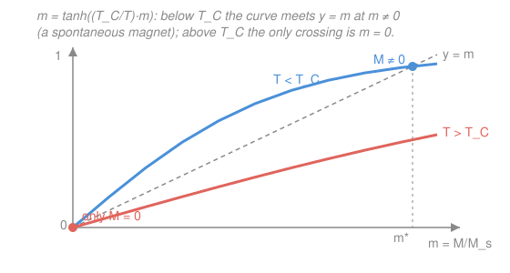

# Condensed Matter · Lesson 5.2: Exchange and ferromagnetism

> ⏱ ~15 min · Module 5: Magnetism and superconductivity · Builds on: [5.1 Diamagnetism and paramagnetism](05-01-dia-paramagnetism.md) · Unlocks: [5.3 The Heisenberg and Ising models](05-03-heisenberg-ising.md)

## Why this matters

A refrigerator magnet holds its magnetization $M$ with **no applied field** — the electron spins inside line up on their own and stay lined up. That is astonishing. In [5.1](05-01-dia-paramagnetism.md) a paramagnet's spins only aligned when you pushed them with a field $H$, and they scrambled the instant you removed it. Something inside a ferromagnet is supplying its own aligning field. What is it? Not the obvious guess — magnetic dipoles nudging each other — that is a thousand times too weak. The real cause is a purely quantum effect with no classical analog, and pinning it down explains why iron is magnetic below 1043 K and a paramagnet above it, all from one self-consistent equation. This is **Boss problem 5**.

## The idea

First, kill the obvious suspect. Two magnetic moments $\mu \sim \mu_B$ (a Bohr magneton) a lattice spacing $a \sim 3\,\text{Å}$ apart interact with a dipole–dipole energy of order $\mu_0\mu^2/4\pi a^3$. Put in the numbers and that energy corresponds to a temperature of about **1 K**. If dipole coupling were the glue, every magnet would melt into disorder above a few kelvin. Iron stays magnetic past 1000 K. Dipole–dipole is off by three orders of magnitude — it is not the answer.

The real mechanism is the **exchange interaction**, and it comes from two things you already know, working together: **Coulomb repulsion** and the **Pauli principle**. Here is the whole idea in one breath. Two electrons repel. The Pauli principle says the *total* two-electron wavefunction must be antisymmetric. If the two spins are **parallel** (a symmetric spin state), the *spatial* part must be **antisymmetric** — and an antisymmetric spatial wavefunction vanishes when the electrons coincide, so it automatically keeps them **farther apart**. Farther apart means **less Coulomb repulsion**, i.e. *lower* energy. So aligning two spins can lower the electrostatic energy. Nothing magnetic is doing the aligning — it is Coulomb repulsion, routed through Pauli, masquerading as a spin force.

When that energy saving wins, the system prefers parallel spins everywhere: a **ferromagnet**. The next lesson writes this as a clean spin Hamiltonian; here we take the payoff — a tendency for neighbors to align — and ask what it does to a whole crystal.

## The formal version

**The exchange coupling.** The Coulomb-plus-Pauli argument, worked out for two neighboring spins $\mathbf{S}_i$ and $\mathbf{S}_j$, collapses into a startlingly simple effective energy:

$$U_{ij} = -J\,\mathbf{S}_i \cdot \mathbf{S}_j .$$

*In words: the electrostatic cost of two electrons depends on their relative spin orientation, and that dependence acts exactly like a coupling between the spins.* The **exchange constant** $J$ (units of energy) is set by Coulomb integrals — it is *not* a magnetic energy. When $J > 0$, the energy is lowest for $\mathbf{S}_i \parallel \mathbf{S}_j$ (parallel spins) → **ferromagnetism**. When $J < 0$, antiparallel neighbors win → antiferromagnetism ([5.3](05-03-heisenberg-ising.md)). This is the **Heisenberg exchange**; deriving $J$ is [5.3](05-03-heisenberg-ising.md)'s job.

**The Weiss mean field.** Summing $-J\,\mathbf{S}_i\cdot\mathbf{S}_j$ over every interacting pair is a genuinely hard many-body problem. Pierre Weiss's 1907 shortcut, **mean-field theory**, is the single most useful trick in the subject: replace the fluctuating exchange field that spin $i$ feels from all its neighbors by their *average*, a smooth **molecular field** proportional to the magnetization itself. Each moment then feels an effective field

$$H_{\text{eff}} = H + \lambda M ,$$

where $H$ is the applied field, $M$ the magnetization, and $\lambda > 0$ the **Weiss molecular-field constant** (which packages up $J$ and the number of neighbors). *In words: every spin is pushed not only by the external field but by the collective alignment of everyone else — the more aligned the crowd already is, the harder it pushes each member to join.* That feedback — $M$ helps create the very field that sustains $M$ — is the seed of spontaneous order.

**Self-consistency.** Now recycle the [5.1](05-01-dia-paramagnetism.md) paramagnet result, but with $H \to H_{\text{eff}}$. For moments $\mu$ (the magnetic moment per site, so $\mu H$ is the Zeeman energy scale) and saturation magnetization $M_s = n\mu$ ($n$ = moments per volume), the spin-$\tfrac12$ paramagnet gave $M = M_s\tanh(\mu H/k_BT)$. Substituting the effective field:

$$\boxed{\,M = M_s \tanh\!\left(\frac{\mu(H + \lambda M)}{k_B T}\right)}$$

*In words: the magnetization appears on both sides — the field that produces $M$ depends on $M$.* $M$ must be solved for **self-consistently**. This one transcendental equation contains the entire mean-field story.

**Spontaneous magnetization and $T_C$.** Set $H = 0$ and write $m \equiv M/M_s \in [0,1]$. Define the **Curie temperature** by $k_B T_C \equiv \mu\lambda M_s = n\mu^2\lambda$. Then

$$m = \tanh\!\left(\frac{T_C}{T}\,m\right).$$

Graphically (see Picture), the straight line $y = m$ and the curve $y = \tanh\!\big((T_C/T)\,m\big)$ always cross at $m = 0$. They cross a *second* time at some $m^* \neq 0$ **iff** the tanh leaves the origin steeper than the line — its initial slope is $T_C/T$, so the condition is

$$\frac{T_C}{T} > 1 \quad\Longleftrightarrow\quad T < T_C .$$

*In words: below $T_C$ a nonzero magnetization solves the equation with no applied field at all — a spontaneous magnet — because the exchange feedback is strong enough to be self-sustaining. Above $T_C$ the only solution is $m = 0$: a paramagnet.* And $k_B T_C = n\mu^2\lambda \propto \lambda \propto J$ — **the exchange interaction sets the Curie temperature**. Strong exchange, hot magnet.

**Curie–Weiss law.** Just *above* $T_C$, turn a small field $H$ back on and linearize $\tanh x \approx x$ (valid since $M$ is small there):

$$M \approx M_s\,\frac{\mu(H+\lambda M)}{k_B T} = \frac{n\mu^2}{k_B T}\,(H + \lambda M) = \frac{C}{T}\,(H + \lambda M), \qquad C \equiv \frac{n\mu^2}{k_B}.$$

Here $C$ is the same **Curie constant** from [5.1](05-01-dia-paramagnetism.md) (whose law was $\chi = C/T$). Collect the $M$ terms:

$$M\left(1 - \frac{C\lambda}{T}\right) = \frac{C}{T}H \quad\Longrightarrow\quad \chi = \frac{M}{H} = \frac{C}{T - C\lambda} = \boxed{\frac{C}{T - T_C}}$$

using $T_C = C\lambda$ (identical to $k_BT_C = n\mu^2\lambda$). *In words: the paramagnetic susceptibility does not just fall as $1/T$ — it **diverges** as $T \to T_C^+$.* An infinite response to an infinitesimal field is the fingerprint of an ordering transition: the material is on a hair-trigger, about to align itself. Plotting $1/\chi$ versus $T$ gives a straight line hitting zero at $T_C$ — the standard experimental read-out of a ferromagnet.

**Domains (a caveat).** If every magnet spontaneously aligns below $T_C$, why is a fresh iron nail *not* magnetic? Because a uniformly magnetized block pays a large energy in the stray field outside it. The crystal lowers that cost by breaking into **domains** — regions each fully magnetized but pointing different ways, so the net $M$ cancels. An external field grows the favorably-aligned domains; that is how you magnetize the nail, and why the process shows hysteresis. Exchange still rules *inside* each domain — mean-field theory describes one domain.

## Picture

## Worked examples

**Example 1 (self-consistency, and $T_C$ from the exchange).** Take a material at $T = 0.7\,T_C$ (so $T_C/T = 1/0.7 \approx 1.43$) and find its spontaneous $m = M/M_s$. Solve $m = \tanh(1.43\,m)$ by iteration, starting near saturation:

$$m_0 = 0.9:\ \tanh(1.29) = 0.859;\quad \tanh(1.43\cdot 0.859)=\tanh(1.23)=0.842;\quad \to\ m^* \approx 0.83.$$

So at $70\%$ of $T_C$ the magnet still carries $\sim 83\%$ of full alignment — spontaneous order collapses only near $T_C$ itself, not gradually from $T=0$. To get $T_C$ from microscopics, use $k_BT_C = n\mu^2\lambda$: with $n \approx 8\times10^{28}\,\text{m}^{-3}$, $\mu \approx 2\mu_B$, and a molecular-field constant $\lambda \approx 5\times10^3$ (dimensionless in SI cgs-Gauss-style bookkeeping), you land at $T_C \sim 10^3\,\text{K}$ — iron's ballpark, and $10^3\times$ larger than the dipolar $\sim 1\,\text{K}$. Exchange, not dipoles.

**Example 2 (Curie–Weiss fit — Boss-problem flavor).** A paramagnet is measured above its ordering temperature; the inverse susceptibility $1/\chi$ is linear in $T$ and, extrapolated, crosses zero at $T = 150\,\text{K}$, with slope $1/C = 0.02\,\text{K}^{-1}$. Read off the physics. Curie–Weiss says $1/\chi = (T - T_C)/C$, a line of slope $1/C$ and $T$-intercept $T_C$. So directly

$$T_C = 150\,\text{K}, \qquad C = \frac{1}{0.02} = 50\,\text{K}.$$

The **positive** intercept ($T_C > 0$) signals *ferromagnetic* exchange ($\lambda > 0$): the moments *want* to align, and would spontaneously do so if cooled to $150\,\text{K}$. (A negative intercept would flag antiferromagnetic coupling.) From $C = n\mu^2/k_B$ you could back out the moment $\mu$; from $T_C = C\lambda$ you get $\lambda = T_C/C = 3$. The single line $1/\chi(T)$ hands you both the interaction strength and its sign.

## Watch out

- **You might think the aligning force is magnetic.** It is not — exchange is *electrostatic* (Coulomb) energy, sorted by spin only because Pauli ties spatial symmetry to spin symmetry. The moments' own magnetic dipole fields ($\sim 1\,\text{K}$) are a negligible bystander. This is why "magnetism" is really a misnomer for what makes a ferromagnet.
- **You might read $\lambda M$ as a real magnetic field in the lab.** It is a *fictitious* molecular field — a bookkeeping stand-in for the average exchange interaction, often equivalent to hundreds of tesla, far beyond any real applied field. Mean-field theory *invents* it to make a hard problem into a one-line self-consistency.
- **You might expect $M$ to fade linearly from $T = 0$.** It does not — from Example 1, $m$ stays near $1$ over most of the range and drops steeply only near $T_C$, where it vanishes as $m \propto \sqrt{T_C - T}$ (Problem 3). Mean field gets this square-root onset qualitatively right, though real exponents differ.

## One-liner

> Coulomb repulsion sorted by the Pauli principle makes parallel spins cheaper ($-J\,\mathbf{S}_i\cdot\mathbf{S}_j$); replacing the neighbors' exchange by an average field $\lambda M$ gives $M = M_s\tanh(\mu(H+\lambda M)/k_BT)$, which self-magnetizes below $k_BT_C = n\mu^2\lambda$ and obeys $\chi = C/(T-T_C)$ above it.

## Problems

**P1 (🟢)** A ferromagnet has $n = 6\times10^{28}\,\text{m}^{-3}$ moments of $\mu = \mu_B = 9.27\times10^{-24}\,\text{J/T}$ each, and a molecular-field constant such that $n\mu^2\lambda = 1.4\times10^{-20}\,\text{J}$. Find $T_C$. (Use $k_B = 1.38\times10^{-23}\,\text{J/K}$.) Is $T_C$ set by $\lambda$ (i.e. by the exchange), or by the applied field?

**P2 (🟡)** Above its Curie temperature a ferromagnet obeys the Curie–Weiss law $\chi = C/(T - T_C)$ with $C = 2\,\text{K}$ and $T_C = 300\,\text{K}$. (a) Compute $\chi$ at $T = 600\,\text{K}$ and at $T = 310\,\text{K}$. (b) By what factor does $\chi$ grow between them, and what does that growth signal physically? (This is the Curie–Weiss half of Boss problem 5.)

**P3 (🔴, optional)** Show that just below $T_C$ the spontaneous magnetization vanishes as $m \propto \sqrt{T_C - T}$. Start from $m = \tanh\!\big((T_C/T)\,m\big)$ and expand $\tanh x \approx x - \tfrac13 x^3$ for small $m$.

Solutions

**P1** By definition $k_B T_C = n\mu^2\lambda$, and we are handed $n\mu^2\lambda = 1.4\times10^{-20}\,\text{J}$ directly, so

$$T_C = \frac{n\mu^2\lambda}{k_B} = \frac{1.4\times10^{-20}}{1.38\times10^{-23}} \approx 1.0\times10^{3}\,\text{K}.$$

$T_C$ is set entirely by $\lambda$ (hence by the exchange $J$) — the applied field $H$ does not appear in it at all. $H$ only tilts *which* direction the spontaneous $M$ points; the *existence* and *temperature* of the ordering come from exchange alone.

*Check.* Units: $\text{J}/(\text{J/K}) = \text{K}$ ✓. Magnitude $\sim 10^3\,\text{K}$ is iron-like and $\sim\!10^3\times$ the dipolar $1\,\text{K}$ — the whole point that exchange, not dipole coupling, is responsible. ✓

**P2** (a) Plug into $\chi = C/(T - T_C)$:

$$\chi(600) = \frac{2}{600 - 300} = \frac{2}{300} \approx 6.7\times10^{-3}, \qquad \chi(310) = \frac{2}{310 - 300} = \frac{2}{10} = 0.20.$$

(b) The ratio is $0.20 / (6.7\times10^{-3}) = 30$: the susceptibility grows **30-fold** on approaching $T_C$. Physically, $\chi \to \infty$ as $T \to T_C^+$ — an ever-larger magnetization for an ever-smaller field — because the exchange feedback is on the verge of self-sustaining alignment. The divergence *is* the onset of ferromagnetic order.

*Check.* Denominator $T - T_C \to 0^+$ forces $\chi \to \infty$; far above $T_C$ (600 K) the $-T_C$ is a modest correction to plain Curie $C/T = 2/600$, as expected when exchange is a small perturbation on thermal disorder. ✓

**P3** With $t \equiv T_C/T$ and small $m$, keep two terms of the tanh:

$$m = \tanh(t m) \approx t m - \tfrac13 (t m)^3 .$$

For the nonzero branch divide by $m$:

$$1 = t - \tfrac13 t^3 m^2 \quad\Longrightarrow\quad m^2 = \frac{3(t - 1)}{t^3}.$$

Near $T_C$, $T \to T_C^-$ so $t = T_C/T \to 1^+$; write $t - 1 = (T_C - T)/T \approx (T_C - T)/T_C$ and set $t^3 \approx 1$ in the (already small) prefactor:

$$m^2 \approx \frac{3(T_C - T)}{T_C} \quad\Longrightarrow\quad m \approx \sqrt{3}\,\left(\frac{T_C - T}{T_C}\right)^{1/2}.$$

So $m \propto (T_C - T)^{1/2}$: the mean-field **critical exponent** $\beta = \tfrac12$.

*Check.* A nonzero real $m$ requires $t > 1$, i.e. $T < T_C$ — exactly the spontaneous-order condition, consistent with the graphical picture. At $T = T_C$ the magnetization vanishes continuously (a second-order transition), and the square-root gives the steep drop noted in "Watch out." (Real ferromagnets have $\beta \approx 0.33$; mean field overestimates it by ignoring fluctuations.) ✓

## Flashback

**From Lesson 5.1 (Diamagnetism and paramagnetism):** A dilute paramagnetic salt of independent local moments obeys the Curie law $\chi = C/T$. Its susceptibility is measured to be $\chi = 3.0\times10^{-3}$ at $T = 200\,\text{K}$. (a) Find $\chi$ at $T = 50\,\text{K}$. (b) Contrast this $1/T$ behavior with the temperature dependence of the *Pauli* (conduction-electron) susceptibility from the same lesson. (Fresh variant — this is today's equation in the $\lambda = 0$ limit.)

Solution

(a) Curie's law gives $\chi \propto 1/T$, so $\chi C^{-1} = T\chi$ is constant: $\chi(50) = \chi(200)\cdot\frac{200}{50} = 3.0\times10^{-3}\times 4 = 1.2\times10^{-2}.$ Cooling to a quarter of the temperature quadruples the susceptibility — cold local moments align far more readily, since thermal agitation ($k_BT$) that scrambles them is weaker.

(b) **Pauli paramagnetism is essentially temperature-independent.** Local moments (Curie) can each freely reorient, so the aligning tendency competes with $k_BT$ and gives $\chi \propto 1/T$. Conduction electrons instead obey the Pauli principle: only the few within $\sim k_BT$ of the Fermi energy $E_F$ can flip into the field's favor, and that fraction is $\sim k_BT/E_F$ — which cancels the $1/T$, leaving $\chi_{\text{Pauli}} \approx \mu_B^2 g(E_F)$, set by the density of states at $E_F$ and nearly flat in $T$. Today's ferromagnet is the Curie case ($\lambda = 0$ recovers $\chi = C/T$ exactly) with exchange feedback switched on: $T \to T - T_C$.

*Check.* $T\chi = 200\times3.0\times10^{-3} = 50\times1.2\times10^{-2} = 0.6$, constant ✓. Setting $\lambda = 0$ (hence $T_C = C\lambda = 0$) in $\chi = C/(T - T_C)$ returns the plain Curie law — the Flashback is literally the no-exchange limit of the lesson. ✓

## Connections

- **Backward:** the self-consistency equation is [5.1](05-01-dia-paramagnetism.md)'s paramagnet result $M = M_s\tanh(\mu H/k_BT)$ with the field upgraded to $H + \lambda M$; set $\lambda = 0$ and you recover Curie's $\chi = C/T$ exactly. The Pauli principle doing the spin-sorting is the same antisymmetry that built the Fermi sea in [3.1](03-01-free-electron-gas.md).
- **Forward:** [5.3 The Heisenberg and Ising models](05-03-heisenberg-ising.md) derives the $-J\,\mathbf{S}_i\cdot\mathbf{S}_j$ coupling we assumed, and treats the same lattice *without* the mean-field averaging — recovering spin waves and, for $J < 0$, antiferromagnetism. The Curie–Weiss divergence previews the general theory of continuous phase transitions.
- **Sideways (quantum mechanics & stat mech):** exchange is the two-electron symmetric/antisymmetric spatial wavefunction argument from [`quantum-mechanics`](../../quantum-mechanics/syllabus.md) (identical particles, the exchange integral) applied to a Coulomb energy — the very same reason for Hund's first rule in atoms. The self-consistent molecular field is the archetype of *mean-field theory*, reused across [`stat-mech`](../../stat-mech/syllabus.md) for every order–disorder transition. And the exchange $J$ reappears in [5.5](05-05-cooper-pairs-bcs.md): the same electron–lattice bookkeeping that here aligns spins is there recycled as the *phonon glue* binding a Cooper pair (Boss problem 5's second half).
