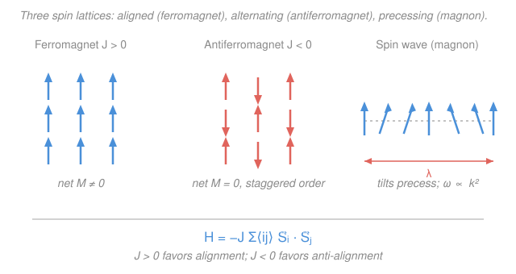

# Condensed Matter · Lesson 5.3: The Heisenberg and Ising models

> ⏱ ~15 min · Module 5: Magnetism and superconductivity · Builds on: [5.2 Exchange and ferromagnetism](05-02-exchange-ferromagnetism.md), [`stat-mech` syllabus](../../stat-mech/syllabus.md) · Unlocks: [5.4 Superconductivity I: the phenomena](05-04-superconductivity-phenomena.md)

## Why this matters

In [5.2](05-02-exchange-ferromagnetism.md) we found the surprise at the heart of magnetism: the force that aligns spins isn't magnetic dipole attraction (a thousand times too weak) but the **exchange interaction** — a purely quantum, electrostatic effect that ties the *energy* of two electrons to the *relative orientation* of their spins. That gave us an energy scale $J$. This lesson turns that scale into the two Hamiltonians the entire field of magnetism runs on: the **Heisenberg model** and its stripped-down cousin the **Ising model**. Between them they describe fridge magnets, hard drives, the ferrites in transformers, antiferromagnetic sensors, and the frontier of quantum spin liquids — and the Ising model is *the* archetype of statistical mechanics, the first system where we could prove, exactly, that microscopic rules produce a phase transition.

## The idea

Forget the electrons. Exchange says: put an arrow (a spin) on every lattice site, and let each arrow's energy depend on how it points *relative to its neighbors*. Neighbors that agree cost less energy; neighbors that disagree cost more (or vice versa). That's the whole model. Everything — ferromagnets, antiferromagnets, the temperature at which order melts, the ripples that carry heat through a magnet — falls out of that one rule applied to a lattice.

Two dials set the physics. **The sign of $J$**: positive means "agree to save energy" (spins align → ferromagnet), negative means "disagree to save energy" (spins alternate → antiferromagnet). **How much of the arrow you keep**: if the spin is a full quantum vector free to point anywhere, you have the *Heisenberg* model; if you allow only up-or-down along one axis, you have the *Ising* model. The second is a caricature — but a caricature so faithful to the essential physics of ordering that it became the hydrogen atom of phase transitions.

The payoff is **spontaneous symmetry breaking**. At high temperature, thermal kicks scramble the arrows, they point every which way, and the net magnetization is zero — the system respects the up/down symmetry of its own rules. Cool below a critical temperature and the arrows *collectively choose* a direction, even though no rule told them which. A quantity that was zero becomes nonzero: an **order parameter** is born.

## The formal version

**The Heisenberg Hamiltonian.** Put a spin operator $\mathbf{S}_i$ on each site $i$ of a lattice. Sum over each nearest-neighbor pair $\langle ij\rangle$ once:

$$H = -J \sum_{\langle ij\rangle} \mathbf{S}_i \cdot \mathbf{S}_j \;-\; h\sum_i S_i^z .$$

*In words: every bond between neighboring spins contributes an energy $-J\,\mathbf{S}_i\cdot\mathbf{S}_j$; the dot product is largest when the spins are parallel, so with $J>0$ parallel bonds are the cheapest.* Here $J$ (energy, joules) is the **exchange constant** from [5.2](05-02-exchange-ferromagnetism.md); $\mathbf{S}_i = (S_i^x, S_i^y, S_i^z)$ is the quantum spin vector at site $i$ (dimensionless, in units of $\hbar$); $h$ is an external magnetic field (in energy units) coupling to the $z$-component; and $\langle ij\rangle$ means "count each neighbor pair once." The sign convention here makes $J>0$ **ferromagnetic** (favoring alignment) and $J<0$ **antiferromagnetic** (favoring anti-alignment).

The defining feature: $\mathbf{S}_i\cdot\mathbf{S}_j$ is **rotationally symmetric** — rotate every spin together and the energy is unchanged. The spins are genuine quantum vectors that can cant, precess, and tunnel between orientations.

**The Ising limit.** Suppose the crystal has a strong easy axis (uniaxial anisotropy from spin–orbit coupling) that pins every spin to $\pm z$. Keep only the $z$-component of the dot product:

$$H = -J \sum_{\langle ij\rangle} S_i^z S_j^z, \qquad S_i^z = \pm 1 .$$

*In words: each spin is a two-way switch, up or down, and only the up/down agreement of neighbors matters.* We've thrown away the $x$ and $y$ parts — and with them the continuous rotational symmetry, leaving only the discrete up$\leftrightarrow$down flip symmetry. This is the **Ising model**, the simplest system that still has a genuine finite-temperature phase transition:

- **1D** (a chain): *no* ordering at any $T>0$. A single "domain wall" costs finite energy $2J$ but can sit at any of $N$ sites (huge entropy), so free energy $F = E - TS$ always favors making them — order is destroyed instantly. (This is why the flashback's mean-field prediction fails in 1D.)
- **2D** (square lattice): Onsager's 1944 exact solution gives a transition at
$$\frac{k_B T_c}{J} = \frac{2}{\ln(1+\sqrt2)} \approx 2.269,$$
where $k_B$ is Boltzmann's constant — the first phase transition ever derived rigorously from microscopics.

**The order parameter.** Define the **magnetization per spin** $M = \frac{1}{N}\sum_i \langle S_i^z\rangle$, with $N$ the number of spins. Then

$$M = 0 \ \ (T > T_c), \qquad M \neq 0 \ \ (T < T_c).$$

*In words: above the critical temperature the arrows average to nothing; below it they lock into a common direction and $M$ turns on.* This turning-on of a quantity that the Hamiltonian's symmetry says *should* average to zero is **spontaneous symmetry breaking** — the Hamiltonian is up/down symmetric, but any single cold sample picks one.

**Antiferromagnetism ($J<0$).** Now anti-aligned bonds are cheapest. On a **bipartite** lattice (one splittable into two interpenetrating sublattices A and B, like a checkerboard) the ground state is **Néel order**: every A-spin up, every B-spin down. The *net* magnetization is zero, but a **staggered magnetization** $M_s = \frac{1}{N}\sum_i (-1)^i \langle S_i^z\rangle$ (which flips sign each site) is nonzero — that is the order parameter here. It orders below the **Néel temperature** $T_N$, the antiferromagnetic analog of $T_c$.

**Magnons (spin waves).** What are the cheapest *excitations* of an ordered ferromagnet? Not flipping one spin outright — in the Heisenberg model a lone flipped spin isn't even an energy eigenstate. The true low-energy excitation is a **spin wave**: every spin tilts slightly off the ordering axis and precesses, with the tilt phase advancing site to site like a wave (see the Picture). Quantized, one unit of this wave is a **magnon** — a boson, the magnetic analog of the phonon. For a Heisenberg ferromagnet the dispersion at long wavelength is *quadratic*:

$$\hbar\omega(\mathbf{k}) \approx 2 J S a^2 k^2 \qquad (\text{small } k),$$

with $S$ the spin magnitude, $a$ the lattice spacing, $\mathbf{k}$ the wavevector, and $\hbar$ the reduced Planck constant. *In words: long-wavelength spin waves are very soft — their energy vanishes as $k^2$, even softer than phonons' $\omega \propto k$.* Counting how many magnons are thermally excited (Bose statistics, $\omega\propto k^2$) gives the **Bloch $T^{3/2}$ law** for how magnetization erodes as you warm a ferromagnet from absolute zero:

$$M(T) = M(0)\left[1 - \left(\tfrac{T}{T_0}\right)^{3/2}\right],$$

the spin analog of the Debye $T^3$ law for phonon heat capacity ([2.4](02-04-heat-capacity-einstein-debye.md)).

## Picture

## Worked examples

**Example 1 (ground-state energy: ferromagnet vs. antiferromagnet).** Take the Ising model with $S_i^z=\pm 1$ on a lattice of $N$ sites, coordination number $z$ (each site has $z$ neighbors), so there are $Nz/2$ bonds (each bond shared by two sites). 

*Ferromagnet, $J>0$.* Cheapest state: all spins up, every bond has $S_i^z S_j^z = (+1)(+1)=+1$, contributing $-J$. Total:
$$E_{\text{FM}} = -J \cdot \frac{Nz}{2} \quad\Longrightarrow\quad \frac{E_{\text{FM}}}{N} = -\frac{zJ}{2}.$$

*Antiferromagnet, $J<0$, bipartite lattice.* Cheapest state: Néel, every bond anti-aligned, $S_i^z S_j^z = -1$, contributing $-J(-1)=+J$. Total:
$$E_{\text{AFM}} = +J\cdot\frac{Nz}{2} \quad\Longrightarrow\quad \frac{E_{\text{AFM}}}{N} = +\frac{zJ}{2} = -\frac{z|J|}{2}\ \ (\text{since }J<0).$$

Both ground states sit at energy $-\tfrac{z|J|}{2}$ per spin below the "all bonds broken" reference — the sign of $J$ just picks *which* arrangement achieves it. (On a **non-bipartite** lattice like the triangular one, an antiferromagnet *can't* satisfy every bond at once — that frustration is the seed of spin liquids, teased at the end.)

**Example 2 (a flipped spin costs $2zJ$, and why the magnon is cheaper).** Start from the Ising ferromagnetic ground state and flip one spin down. Its $z$ bonds each switch from $S_i^zS_j^z=+1$ (energy $-J$) to $-1$ (energy $+J$) — a change of $+2J$ per bond:
$$\Delta E_{\text{flip}} = 2zJ.$$
For a simple cubic lattice ($z=6$) that's $12J$ — a stiff, *localized* cost. In the full **Heisenberg** model the spin can instead tilt only slightly and let the disturbance spread over many sites as a spin wave; sharing the tilt across a long wavelength $\lambda = 2\pi/k$ drops the energy all the way to $\hbar\omega \approx 2JSa^2k^2 \to 0$ as $k\to 0$. That gap between the rigid single-flip ($2zJ$) and the soft delocalized magnon ($\to 0$) is exactly why an ordered magnet melts gradually with temperature (Bloch $T^{3/2}$) rather than all at once: the cheapest excitations are collective, not local.

**Example 3 (mean-field $T_c$).** Estimate the ordering temperature with Weiss mean-field theory: replace the fluctuating neighbors of a spin by their average field. For the Heisenberg model this yields
$$k_B T_c = \frac{zJ\,S(S+1)}{3}.$$
For spin $S=\tfrac12$ on a simple cubic lattice ($z=6$): $S(S+1)=\tfrac34$, so $k_B T_c = \dfrac{6J\cdot\tfrac34}{3} = \dfrac{3J}{2}$, i.e. $k_B T_c = 1.5\,J$. 

The number to notice is *how wrong* mean field is where we can check it. For the 2D Ising model mean field predicts $k_B T_c = zJ = 4J$ (square lattice, $z=4$), whereas Onsager's exact answer is $2.269\,J$ — mean field overshoots by ~76%, because it ignores the thermal fluctuations that fight ordering, and those matter most in low dimensions. Mean field gets *better* in higher dimensions (more neighbors to average over) and becomes exact at infinite dimension.

## Watch out

- **You might think flipping one spin is the lowest excitation.** In the Ising model it costs a rigid $2zJ$; in the Heisenberg model it isn't even an eigenstate. The real low-energy excitation is the *delocalized* magnon, whose energy $\to 0$ as $k\to 0$. Local intuition badly overestimates the cost of disturbing an ordered magnet.
- **You might think an antiferromagnet is "just a ferromagnet with a minus sign."** Its *net* magnetization is zero, so it looks unmagnetized from outside — yet it is exquisitely ordered. You need the *staggered* magnetization (or neutron diffraction, which sees the doubled magnetic unit cell) to detect it.
- **You might trust mean-field $T_c$ as a real number.** It's an estimate that *overpredicts* order (it can even predict a transition in 1D, where there is none at $T>0$). Read it for scaling — $T_c \propto zJ$, more neighbors and stronger exchange raise $T_c$ — not for a precise value.
- **Ising is not "spin pointing up."** $S_i^z=\pm1$ is a *modeling choice* (strong easy-axis anisotropy), not the physical spin-$\tfrac12$ value $\pm\tfrac12$. When a lattice has no easy axis the Heisenberg (or XY) model is the right description, and the physics — especially in 2D — genuinely differs.

## One-liner

> Put an arrow on every site and pay $-J\,\mathbf{S}_i\cdot\mathbf{S}_j$ per bond: the sign of $J$ chooses ferro- or antiferromagnet, keeping one axis gives the Ising archetype of phase transitions, and the soft collective ripples of the ordered state are magnons.

## Problems

**P1 (🟢)** An Ising ferromagnet ($S_i^z=\pm1$, $J>0$) sits on a 2D square lattice (coordination $z=4$). Find the ground-state energy per spin. Then compute the energy cost of flipping a single interior spin.

**P2 (🟡)** Using the Heisenberg mean-field formula $k_B T_c = zJ\,S(S+1)/3$, estimate $T_c$ (in kelvin) for a spin-$\tfrac12$ ferromagnet on a body-centered cubic lattice ($z=8$) with exchange constant $J = 15\ \mathrm{meV}$. Use $k_B = 8.617\times10^{-5}\ \mathrm{eV/K}$. Is your estimate likely an over- or under-prediction, and why?

**P3 (🔴, optional)** For an antiferromagnet on a **triangular** lattice with Ising spins, show that no spin configuration can make all three bonds of a single triangle simultaneously anti-aligned. What is the minimum number of "unhappy" (aligned, energy-costing) bonds per triangle? (This is *geometric frustration*.)

Solutions

**P1** Ground state = all spins aligned. Each of the $z=4$ bonds per site contributes $-J$, and each bond is shared by two sites, so the energy per spin is
$$\frac{E_{\text{FM}}}{N} = -\frac{zJ}{2} = -\frac{4J}{2} = -2J.$$
Flipping one interior spin flips all $z=4$ of its bonds from $-J$ to $+J$, a change of $+2J$ each:
$$\Delta E_{\text{flip}} = 2zJ = 2\cdot 4\cdot J = 8J.$$
*Check.* Units: energy per spin is in units of $J$ ✓. Limiting sense: the flip cost $2zJ$ grows with connectivity $z$ — more neighbors to disagree with — as it must; and it's positive, so the aligned state is indeed a minimum. ✓

**P2** Plug in $z=8$, $S=\tfrac12$ so $S(S+1)=\tfrac34$, $J=15\ \mathrm{meV}=0.015\ \mathrm{eV}$:
$$k_B T_c = \frac{zJS(S+1)}{3} = \frac{8\cdot 0.015\cdot \tfrac34}{3}\ \mathrm{eV} = \frac{0.09}{3}\ \mathrm{eV} = 0.030\ \mathrm{eV}.$$
$$T_c = \frac{0.030\ \mathrm{eV}}{8.617\times10^{-5}\ \mathrm{eV/K}} \approx 348\ \mathrm{K}.$$
This is an **over-prediction**: mean-field theory replaces fluctuating neighbors by a static average field, ignoring the thermal fluctuations that disorder the spins and lower the true $T_c$. The real $T_c$ would be somewhat below 348 K.
*Check.* Order of magnitude: $J\sim15$ meV corresponds to $J/k_B \sim 175$ K, and $zS(S+1)/3 = 8\cdot0.75/3 = 2$, giving $T_c \sim 2\times175 = 350$ K — a room-temperature-scale ferromagnet, entirely reasonable (iron's $T_c$ is 1043 K, gadolinium's is 293 K). ✓

**P3** Label the three sites of one triangle 1, 2, 3, each $\pm1$. Anti-aligned means the product on a bond is $-1$. For all three bonds anti-aligned we'd need $s_1s_2=-1$, $s_2s_3=-1$, $s_3s_1=-1$. Multiply all three: $(s_1s_2)(s_2s_3)(s_3s_1) = s_1^2 s_2^2 s_3^2 = (+1)(+1)(+1) = +1$. But the right side is $(-1)^3=-1$. Contradiction — so all three bonds cannot be anti-aligned at once. The best you can do is two anti-aligned bonds and **one** aligned (unhappy) bond per triangle.
*Check.* Try $s_1=+1, s_2=-1, s_3=+1$: bonds $12$ and $23$ are anti-aligned (happy), bond $31=(+1)(+1)=+1$ is aligned (unhappy) — exactly one frustrated bond, matching the parity argument. ✓ This impossibility of satisfying every bond is *geometric frustration*, the route to exotic ground states like spin liquids.

## Flashback

**From Lesson 5.2 (Exchange and ferromagnetism):** A ferromagnet obeys the Curie–Weiss law $\chi = C/(T-\theta)$ above its ordering temperature, where $\chi$ is the magnetic susceptibility, $C$ the Curie constant, and $\theta$ the Weiss (paramagnetic Curie) temperature. A sample has Curie constant $C = 0.5\ \mathrm{K}$ (in convenient units where $\chi$ is dimensionless) and susceptibility $\chi = 0.02$ measured at $T = 320\ \mathrm{K}$. Estimate $\theta$. What sign of $\theta$ tells you the interactions are ferromagnetic?

Solution

Solve Curie–Weiss for $\theta$: $\chi(T-\theta) = C \Rightarrow \theta = T - C/\chi$.
$$\theta = 320 - \frac{0.5}{0.02} = 320 - 25 = 295\ \mathrm{K}.$$
A **positive** $\theta$ signals ferromagnetic interactions: the effective field reinforces alignment, so the susceptibility diverges as $T$ is lowered toward $\theta$ (the mean-field ordering temperature). A *negative* $\theta$ would signal antiferromagnetic coupling, with the divergence pushed to unphysical negative temperature and true (Néel) ordering occurring at a positive $T_N < |\theta|$.
*Check.* Units: $C/\chi = \mathrm{K}$, so $\theta$ comes out in kelvin ✓. Sanity: $\theta = 295$ K is below the measurement $T=320$ K, so we're in the paramagnetic phase where Curie–Weiss applies ($T>\theta$), and $\chi=0.02$ is positive and finite as it should be there. ✓

## Connections

- **Backward:** the exchange constant $J$ driving both Hamiltonians is exactly the [5.2](05-02-exchange-ferromagnetism.md) exchange integral — this lesson promotes that single number into a full lattice model. The magnon derivation reuses the quantized-oscillator machinery from phonons ([2.3](02-03-phonons-quantization.md)), and the Bloch $T^{3/2}$ law is the spin twin of the Debye $T^3$ heat capacity ([2.4](02-04-heat-capacity-einstein-debye.md)).
- **Forward:** the notions of an *order parameter* switching on below a critical temperature and *spontaneous symmetry breaking* carry directly into [5.4 Superconductivity I](05-04-superconductivity-phenomena.md), where the order parameter becomes the superconducting condensate wavefunction instead of the magnetization.
- **Sideways (statistical mechanics):** the Ising model is the central worked example of phase transitions in [`stat-mech`](../../stat-mech/syllabus.md) — partition function, free energy $F=E-TS$, and critical exponents — and its Monte Carlo simulation (Metropolis sampling of $e^{-\beta H}$ on a spin grid) is a rite of passage in computational physics. Same Hamiltonian, three subjects.
