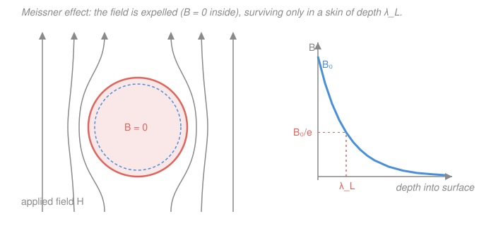

# Condensed Matter · Lesson 5.4: Superconductivity I — the phenomena

> ⏱ ~15 min · Module 5: Magnetism and superconductivity · Builds on: [5.3 The Heisenberg and Ising models](05-03-heisenberg-ising.md) · Unlocks: [5.5 Superconductivity II: Cooper pairs and BCS (qualitative)](05-05-cooper-pairs-bcs.md)

## Why this matters

In 1911 Kamerlingh Onnes cooled mercury to 4.2 K and watched its electrical resistance not just shrink but *vanish* — drop to a number indistinguishable from zero, forever. A current started in a superconducting loop still circulates years later with no measurable decay. That alone would be miraculous, but superconductors do something a "perfect conductor" cannot: they actively **push magnetic field out of their interior**. These two facts — zero resistance and flux expulsion — are the entire empirical foundation of superconductivity, and every deep theory (London, Ginzburg–Landau, BCS in [5.5](05-05-cooper-pairs-bcs.md)) exists to explain them. They also power the real world: the MRI magnet in a hospital and the dipoles bending beams at the LHC are superconducting because only a resistanceless wire can carry the huge currents those fields need without melting.

## The idea

Two experiments define the state.

**Experiment 1: cool a wire, measure resistance.** Above a material-specific **critical temperature** $T_c$ the resistivity behaves normally. At $T_c$ it drops *abruptly* — not smoothly — to exactly zero. Below $T_c$ you can set up a persistent current with no battery driving it. Zero resistance, full stop.

**Experiment 2: cool a lump *while it sits in a magnetic field*.** Naively you'd expect nothing — the field was already threading the metal before it went superconducting. Instead, at the moment it crosses $T_c$, the sample *ejects* the field: the flux is squeezed out and the field lines detour around the outside, leaving $B = 0$ everywhere inside. This is the **Meissner effect**, and it is the surprising one.

Why is expulsion surprising? Because a merely *perfect* conductor (zero resistance, nothing more) would **trap** whatever field was present when the resistance vanished — Faraday's law says you can't change the flux through a resistanceless loop, so the interior field would be frozen at its pre-cooling value, not zero. A superconductor instead reaches $B = 0$ *regardless of its history*. That means superconductivity is not "ordinary metal plus zero resistance." It is a genuinely new **thermodynamic phase**, with $B = 0$ as a defining property of the state itself — reached whether you apply the field before or after cooling. Perfect diamagnetism is the fingerprint.

The field isn't expelled from *literally* the whole volume, though. It leaks in a whisker-thin surface layer and dies off exponentially over a length called the **penetration depth** $\lambda_L$, typically a few tens of nanometers. The bulk is field-free; only the skin knows there's a field outside.

## The formal version

**Zero resistance.** Below $T_c$, the DC resistivity $\rho = 0$ exactly. An induced supercurrent in a ring obeys $\oint \mathbf{E}\cdot d\boldsymbol{\ell} = 0$ with $\mathbf{E} = \rho \mathbf{J} = 0$, so it persists indefinitely. *In words: no voltage is needed to keep a supercurrent flowing, so it never runs down.*

**The London equations.** The brothers London (1935) wrote the minimal electrodynamics of a charge density $n_s$ of "superconducting electrons" that feel no scattering. Combined with Ampère's law $\nabla\times\mathbf{B} = \mu_0 \mathbf{J}$, they yield, in the static case,

$$\nabla^2 \mathbf{B} = \frac{\mathbf{B}}{\lambda_L^2}, \qquad \lambda_L = \sqrt{\frac{m}{\mu_0\, n_s\, e^2}}.$$

*In words: the magnetic field cannot be constant and nonzero inside — the only bulk solution that stays finite is $B \to 0$, and near a surface the field decays exponentially into the material on the scale $\lambda_L$.* Here $m$ and $e$ are the electron mass and charge, $n_s$ the density of superconducting carriers, and $\mu_0$ the vacuum permeability. For a field $B_0$ applied parallel to a flat surface at $x = 0$, the equation gives

$$B(x) = B_0\, e^{-x/\lambda_L}.$$

This is *not* a law derived from first principles — it is a phenomenological guess that correctly encodes the Meissner effect. BCS ([5.5](05-05-cooper-pairs-bcs.md)) later explains where $n_s$ comes from.

**Critical field.** A strong enough magnetic field destroys superconductivity by making the normal state energetically cheaper. The threshold **critical field** $H_c$ falls from a maximum at $T = 0$ to zero at $T_c$, following an almost-perfect parabola:

$$H_c(T) \approx H_c(0)\left[\,1 - \left(\frac{T}{T_c}\right)^{2}\,\right].$$

*In words: the colder you are, the more field it takes to kill superconductivity; right at $T_c$ any field at all suffices.* There is likewise a **critical current** — push too much current and its own magnetic field exceeds $H_c$, quenching the state.

**Type I vs Type II.** How a superconductor responds to field splits it into two families:

- **Type I** (most pure elements: Hg, Pb, Al, Sn): full Meissner expulsion up to $H_c$, then a *sharp* jump to the normal state. One critical field, one clean transition. Their $H_c$ values are small (tens of millitesla), so they make poor magnets.
- **Type II** (alloys like Nb–Ti, Nb$_3$Sn, and the cuprates): full expulsion only up to a *lower* critical field $H_{c1}$. Between $H_{c1}$ and a much higher **upper critical field** $H_{c2}$, the sample enters a **mixed (vortex) state** — magnetic flux threads through in a lattice of thin normal cores, each carrying one quantum of flux, while the material *between* the cores stays superconducting. Because $H_{c2}$ can reach tens of tesla, Type II superconductors are what high-field magnets are wound from.

**The flux quantum.** Each vortex carries exactly

$$\Phi_0 = \frac{h}{2e} \approx 2.07\times 10^{-15}\ \text{Wb},$$

and any flux trapped in a superconducting ring is quantized in units of $\Phi_0$. *In words: magnetic flux through a superconductor comes in indivisible packets.* Look hard at the denominator: it is $2e$, not $e$. Flux is quantized in units set by charge **$2e$** — a dead giveaway that the current-carrying objects are electrons bound into **pairs**. That single factor of 2, together with zero resistance and the Meissner effect, is why the next lesson is about Cooper pairs.

## Picture

## Worked examples

**Example 1 (penetration depth from carrier density).** Estimate $\lambda_L$ for a superconductor with $n_s = 4\times 10^{28}\ \text{m}^{-3}$ (a typical metallic value). Use $m = 9.11\times 10^{-31}$ kg, $e = 1.60\times 10^{-19}$ C, $\mu_0 = 4\pi\times 10^{-7}\ \text{H/m}$.

$$\lambda_L = \sqrt{\frac{m}{\mu_0 n_s e^2}} = \sqrt{\frac{9.11\times10^{-31}}{(1.257\times10^{-6})(4\times10^{28})(1.60\times10^{-19})^2}}.$$

Denominator: $(1.257\times10^{-6})(4\times10^{28}) = 5.03\times10^{22}$; times $(2.56\times10^{-38}) = 1.287\times10^{-15}$. So

$$\lambda_L = \sqrt{\frac{9.11\times10^{-31}}{1.287\times10^{-15}}} = \sqrt{7.08\times10^{-16}} \approx 2.7\times10^{-8}\ \text{m} = 27\ \text{nm}.$$

A few tens of nanometers — the field really does die within a surface skin thousands of times thinner than a human hair. Notice $\lambda_L \propto n_s^{-1/2}$: as $T\to T_c$, $n_s\to 0$ and the penetration depth *diverges*, meaning the field floods all the way in just as superconductivity gives out.

**Example 2 (critical field vs temperature).** A superconductor has $T_c = 7.2$ K and $H_c(0) = 6.4\times10^{4}$ A/m (lead-like). What is $H_c$ at 4.2 K, and what fraction of the zero-temperature value is it?

$$H_c(4.2) = H_c(0)\left[1 - \left(\frac{4.2}{7.2}\right)^2\right] = 6.4\times10^4\left[1 - (0.583)^2\right] = 6.4\times10^4\,(1 - 0.340).$$

$$H_c(4.2) = 6.4\times10^4 \times 0.660 = 4.2\times10^4\ \text{A/m}, \quad \text{i.e. } 66\%\text{ of } H_c(0).$$

So cooling from $T_c$ down to 4.2 K restores about two-thirds of the material's full field tolerance — the parabola is steep near $T_c$ and flattens toward $T = 0$.

## Watch out

- **You might think zero resistance already implies the Meissner effect.** It doesn't. A perfect conductor freezes in whatever flux was present and would keep it forever; a superconductor expels flux regardless of history. Expulsion is *extra* physics — the signature of a distinct thermodynamic phase — which is exactly why the Meissner effect, not zero resistance, is the definitive test.
- **You might read the flux quantum as $h/e$.** It's $h/2e$. Getting this wrong isn't a factor-of-2 nuisance; the $2$ is the experimental fingerprint of electron pairing and the whole reason the microscopic theory pairs electrons up.
- **You might expect $B = 0$ literally everywhere inside.** The field penetrates a surface layer of thickness $\sim\lambda_L$ and only the *bulk* is truly field-free. For a macroscopic sample this skin is negligible; for a film thinner than $\lambda_L$ the Meissner effect is incomplete.

## One-liner

> A superconductor has exactly zero resistance *and* actively expels magnetic flux ($B=0$ in the bulk, decaying over $\lambda_L$ at the surface) — and the flux it does admit comes in quanta of $h/2e$, betraying a paired condensate.

## Problems

**P1 (🟢)** A superconductor has a superconducting-carrier density $n_s = 2.5\times10^{28}\ \text{m}^{-3}$. Compute its London penetration depth $\lambda_L$. (Use $m = 9.11\times10^{-31}$ kg, $e = 1.60\times10^{-19}$ C, $\mu_0 = 1.257\times10^{-6}$ H/m.)

**P2 (🟡)** Niobium has $T_c = 9.3$ K and $H_c(0) = 1.6\times10^{5}$ A/m. (a) At what temperature has $H_c$ fallen to half of $H_c(0)$? (b) What is $H_c$ at 4.2 K (liquid-helium temperature)?

**P3 (🔴, optional)** A Type II superconducting film in the mixed state is threaded by a uniform density of vortices, each carrying one flux quantum $\Phi_0 = h/2e$. If the average magnetic field over the film is $B = 0.10$ T, how many vortices pierce a $1\ \mu\text{m}\times 1\ \mu\text{m}$ square? (Use $h = 6.63\times10^{-34}$ J·s.)

Solutions

**P1** Straight substitution into $\lambda_L = \sqrt{m/(\mu_0 n_s e^2)}$:

$$\mu_0 n_s e^2 = (1.257\times10^{-6})(2.5\times10^{28})(1.60\times10^{-19})^2 = (1.257\times10^{-6})(2.5\times10^{28})(2.56\times10^{-38}).$$

$(1.257\times10^{-6})(2.5\times10^{28}) = 3.14\times10^{22}$; times $2.56\times10^{-38} = 8.04\times10^{-16}$. Then

$$\lambda_L = \sqrt{\frac{9.11\times10^{-31}}{8.04\times10^{-16}}} = \sqrt{1.133\times10^{-15}} \approx 3.4\times10^{-8}\ \text{m} = 34\ \text{nm}.$$

*Check.* Same order (tens of nm) as Example 1, and larger there because $n_s$ is smaller here — consistent with $\lambda_L \propto n_s^{-1/2}$. Units: $\sqrt{\text{kg}/[(\text{H/m})(\text{m}^{-3})(\text{C}^2)]}$; using $\text{H} = \text{kg·m}^2\text{C}^{-2}$ gives $\sqrt{\text{kg}\cdot\text{m}^3/(\text{kg·m·C}^{-2}\cdot\text{C}^2)} = \sqrt{\text{m}^2} = \text{m}$ ✓.

**P2** Use $H_c(T) = H_c(0)[1 - (T/T_c)^2]$.

(a) Set the bracket to $\tfrac12$: $1 - (T/T_c)^2 = 0.5 \Rightarrow (T/T_c)^2 = 0.5 \Rightarrow T/T_c = 0.707$. So

$$T = 0.707\times 9.3\ \text{K} = 6.6\ \text{K}.$$

(b) At $T = 4.2$ K: $(4.2/9.3)^2 = (0.4516)^2 = 0.204$, so

$$H_c(4.2) = 1.6\times10^5\,(1 - 0.204) = 1.6\times10^5 \times 0.796 = 1.27\times10^5\ \text{A/m}.$$

*Check.* Both results lie below $H_c(0)$ and above zero, and the half-field point ($6.6$ K) sits between $4.2$ K and $T_c$ as it must; at $4.2$ K we retain about 80% of full field tolerance, more than the 66% of the warmer Pb-like example, because $4.2$ K is a smaller fraction of Nb's higher $T_c$. ✓

**P3** The number of quanta is total flux divided by one quantum. First the flux quantum:

$$\Phi_0 = \frac{h}{2e} = \frac{6.63\times10^{-34}}{2(1.60\times10^{-19})} = \frac{6.63\times10^{-34}}{3.20\times10^{-19}} = 2.07\times10^{-15}\ \text{Wb}.$$

Total flux through the area $A = (10^{-6})^2 = 10^{-12}\ \text{m}^2$:

$$\Phi = B\,A = (0.10)(10^{-12}) = 1.0\times10^{-13}\ \text{Wb}.$$

Number of vortices:

$$N = \frac{\Phi}{\Phi_0} = \frac{1.0\times10^{-13}}{2.07\times10^{-15}} \approx 48.$$

*Check.* $\Phi_0$ matches the value quoted in the lesson ✓. Dimensionless count, and $\sim 50$ vortices in a square micron at $0.1$ T is the right ballpark (vortex spacing $\sim\sqrt{A/N}\approx 140$ nm, comparable to real vortex-lattice spacings). ✓

## Flashback

**From Lesson 5.3 (The Heisenberg and Ising models):** Consider a 1D Ising chain of four spins with open ends and ferromagnetic coupling $J > 0$, energy $E = -J\sum_{\langle ij\rangle} s_i s_j$ with $s_i = \pm 1$ summed over the three nearest-neighbor bonds. Compute the energy of the fully aligned state $(\uparrow\uparrow\uparrow\uparrow)$ and of the single-domain-wall state $(\uparrow\uparrow\downarrow\downarrow)$. What is the energy cost of the domain wall?

Solution

Each bond contributes $-J s_i s_{i+1}$. There are three bonds.

Aligned state $(\uparrow\uparrow\uparrow\uparrow)$: every adjacent pair has $s_i s_{i+1} = (+1)(+1) = +1$, so each bond gives $-J$:

$$E_{\text{aligned}} = -J(1 + 1 + 1) = -3J.$$

Domain-wall state $(\uparrow\uparrow\downarrow\downarrow)$: the three products $s_i s_{i+1}$ are $(+)(+) = +1$, $(+)(-) = -1$, $(-)(-) = +1$, so the bond energies $-Js_is_{i+1}$ are $-J,\ +J,\ -J$:

$$E_{\text{wall}} = -J + J - J = -J.$$

Energy cost of the wall:

$$\Delta E = E_{\text{wall}} - E_{\text{aligned}} = -J - (-3J) = 2J.$$

*Check.* A single domain wall breaks exactly one satisfied bond, flipping its contribution from $-J$ to $+J$, a change of $2J$ — matching the general result that each domain wall in a 1D Ising chain costs $2J$. In 1D this finite cost (independent of chain length) is why long-range order is destroyed at any $T>0$: the same "cheap defects kill order" logic that a supercurrent evades by being a rigid, phase-coherent condensate. ✓

## Connections

- **Backward:** [5.3](05-03-heisenberg-ising.md) built magnetic order from an *order parameter* (the magnetization) that turns on below a critical temperature; superconductivity is the same story with a *different* order parameter — a macroscopic quantum wavefunction whose amplitude sets $n_s$ — switching on below $T_c$. Both are broken-symmetry phases.
- **Forward:** [5.5 Cooper pairs and BCS](05-05-cooper-pairs-bcs.md) explains the two clues left dangling here: *why* electrons form the pairs that the $h/2e$ flux quantum demands, and *where* the energy gap that stabilizes the condensate comes from (electron–phonon attraction).
- **Sideways (electromagnetism):** the London equation $\nabla^2\mathbf{B} = \mathbf{B}/\lambda_L^2$ and the exponential field decay are the magnetostatics of a screened field — the same boundary-value and $\nabla\times\mathbf{B} = \mu_0\mathbf{J}$ machinery from the [`em-refresher` syllabus](../../em-refresher/syllabus.md), here producing screening instead of penetration.
