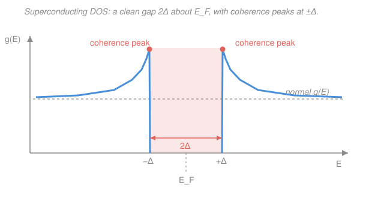

# Condensed Matter · Lesson 5.5: Superconductivity II: Cooper pairs and BCS (qualitative)

> ⏱ ~15 min · Module 5: Magnetism and superconductivity · Builds on: [5.4 Superconductivity I: the phenomena](05-04-superconductivity-phenomena.md), [3.2 Fermi surface and heat capacity](03-02-fermi-surface-heat-capacity.md) · Unlocks: [5.6 A glimpse of topological and strongly-correlated matter](05-06-topological-correlated.md)

## Why this matters

Lesson 5.4 handed you a mystery. Below $T_c$ a metal loses all resistance and expels magnetic field — but *why*? Zero resistance means a current that never decays, which means the carriers can't scatter off anything, which means there is an **energy gap** protecting them: no low-energy states to scatter into. The puzzle is that electrons **repel** each other, so what could possibly bind them into something gapped and rigid? The 1957 answer — Bardeen, Cooper, and Schrieffer's **BCS theory** — is one of the great triumphs of many-body physics: a whisper-weak attraction, borrowed from lattice vibrations, reorganizes the entire Fermi sea. This lesson is the qualitative core of that story.

## The idea

Start with the sign problem. Two electrons repel through the (screened) Coulomb force. To pair them you need a *net* attraction, and it comes from the lattice.

Picture an electron speeding through the crystal. The positive ions feel its negative charge and drift toward its path — but ions are thousands of times heavier than electrons, so they respond *slowly*. By the time the ions have bunched up into a little clot of extra positive charge, the first electron is long gone. That lingering positive smudge is exactly what a **second** electron, arriving a moment later, is attracted to. So the two electrons never meet face-to-face (where they'd repel); they communicate *through the lattice*, one leaving a positive wake that pulls the next one in. The messenger is a **phonon** — a quantum of lattice vibration ([2.3](02-03-phonons-quantization.md)) — and the net effect is a weak attraction between electrons whose energies lie within about $\hbar\omega_D$ (a phonon energy) of the Fermi level.

Now Leon Cooper's bombshell (1956): take a filled Fermi sea, add just **two** electrons a hair above it, and switch on *any* attraction, however feeble. Classically two weakly-attracting particles might or might not bind. Here they **always** bind — because the filled sea below blocks them from spreading out, leaving an enormous number of empty $\mathbf{k}$-states just above $E_F$ to build a bound state from. That gigantic phase space wins no matter how weak the glue. The bound object is a **Cooper pair**.

If one pair binds, the sea is unstable: it rebuilds itself so a macroscopic number of pairs form and condense into a *single, shared quantum state*. That coherent condensate — a charged superfluid — is the BCS ground state, and it flows without dissipation. That's superconductivity.

## The formal version

**The Cooper pair.** The two electrons pair with **opposite momenta and opposite spin**:

$$(\mathbf{k}\uparrow,\; -\mathbf{k}\downarrow).$$

*In words: if one electron carries momentum $\hbar\mathbf{k}$ and spin up, its partner carries $-\hbar\mathbf{k}$ and spin down.* Two consequences:

- **Total momentum is zero.** Every pair has $\mathbf{k} + (-\mathbf{k}) = 0$, so all pairs share the *same* centre-of-mass state and can condense together. (Pairing $+\mathbf{k}$ with $-\mathbf{k}$ also maximizes the number of interacting partners — every occupied $\mathbf{k}$ can scatter to every other $\mathbf{k}'$ while keeping the pair at zero total momentum.)
- **Total spin is zero** — a **singlet**, $\tfrac{1}{\sqrt2}(\uparrow\downarrow - \downarrow\uparrow)$. The pair (charge $2e$, spin $0$) behaves like a composite boson, and bosons *want* to pile into one state.

**The energy gap.** In the BCS ground state the electron spectrum near $E_F$ develops a gap: there are **no single-electron states** within an energy $\Delta$ above or below $E_F$. To excite the system you must *break a pair*, promoting both electrons out of the condensate, which costs

$$E_{\text{break}} = 2\Delta.$$

*In words: the cheapest excitation is snapping one pair, and it costs $2\Delta$ — twice the gap, because you free two electrons.* This gap is what forbids the small-angle scattering that would otherwise degrade a current: there is simply nothing to scatter into. BCS predicts a near-universal ratio between the zero-temperature gap and the transition temperature,

$$\boxed{\,2\Delta(0) \approx 3.5\,k_B T_c\,}$$

*In words: the gap and $T_c$ measure the same pairing strength, so their ratio is fixed* (3.52 in weak-coupling BCS). The gap is not static: $\Delta(T)$ is zero above $T_c$, switches on at $T_c$, and grows to its full value $\Delta(0)$ as $T\to 0$.

**Coherence length.** A Cooper pair is *huge* — its two electrons are separated by the **coherence length**

$$\xi = \frac{\hbar v_F}{\pi \Delta} \gg a,$$

with $v_F$ the Fermi velocity and $a$ the interatomic spacing. *In words: partners are typically thousands of atoms apart, so millions of pairs overlap in the same volume* — pairing is a collective, not a two-body, affair. (Contrast the London penetration depth $\lambda$ of [5.4](05-04-superconductivity-phenomena.md): the ratio $\lambda/\xi$ sorts type I from type II.)

**The condensate and its phase.** All pairs share one macroscopic wavefunction $\psi = |\psi|\,e^{i\varphi}$ with a single phase $\varphi$. This rigidity of $\varphi$ is what pins the supercurrent and expels field (the Meissner effect of 5.4). Because the charge carriers are pairs of charge $2e$, magnetic flux through a superconducting ring is quantized in units of

$$\Phi_0 = \frac{h}{2e} \approx 2.07\times10^{-15}\ \text{Wb},$$

the "2" being direct evidence of pairing.

## Picture

The normal metal's smooth density of states (grey dashed) is carved open: no states within $\pm\Delta$ of $E_F$, and the "missing" states are pushed to the **coherence peaks** that diverge just outside the gap. Tunneling experiments trace this curve directly — the gap edge at $\Delta$ is what you measure.

## Worked examples

**Example 1 (the gap from $T_c$).** Lead superconducts at $T_c = 7.2\ \text{K}$. Estimate its zero-temperature gap $\Delta(0)$, in meV.

Use the BCS ratio $2\Delta(0) = 3.5\,k_B T_c$, so $\Delta(0) = 1.76\,k_B T_c$. With $k_B = 8.617\times10^{-5}\ \text{eV/K}$:

$$\Delta(0) = 1.76 \times (8.617\times10^{-5}\ \text{eV/K}) \times 7.2\ \text{K} \approx 1.09\times10^{-3}\ \text{eV} \approx 1.1\ \text{meV}.$$

So it takes about $2\Delta \approx 2.2\ \text{meV}$ to break a pair. That is a *thousand* times smaller than a typical band gap in silicon (~1 eV) — superconductivity is a whisper of energy, which is exactly why $T_c$ is so low.

**Example 2 (the isotope effect — pinning the phonon).** Mercury's $T_c$ was measured for two isotopes: $^{199}\text{Hg}$ gives $T_c = 4.161\ \text{K}$. Predict $T_c$ for $^{204}\text{Hg}$.

Phonons are the glue, and their frequencies scale as $\omega_D \propto 1/\sqrt{M}$ (heavier ions vibrate more slowly, exactly the harmonic-oscillator $\omega=\sqrt{k/M}$ of [3.1 mechanics](../../mechanics-refresher/lessons/03-01-simple-harmonic-motion.md)). Since $k_B T_c \sim \hbar\omega_D$, BCS predicts

$$T_c \propto M^{-1/2} \qquad\Longrightarrow\qquad \frac{T_c'}{T_c} = \sqrt{\frac{M}{M'}}.$$

*In words: the same lattice stiffness that sets phonon frequencies sets $T_c$, so swapping in heavier ions lowers both.* Numerically:

$$T_c' = 4.161\ \text{K} \times \sqrt{\frac{199}{204}} = 4.161 \times 0.9877 \approx 4.11\ \text{K}.$$

The measured value is about $4.11\ \text{K}$ — a beautiful confirmation that **phonons** mediate the pairing. (Had the glue been purely electronic, changing the ion mass would do nothing.)

## Watch out

- **You might think the gap is $\Delta$, so breaking a pair costs $\Delta$.** It costs $2\Delta$: a broken pair produces *two* excited electrons (quasiparticles), each costing $\Delta$ above the condensate. The "$2$" in $2\Delta(0)=3.5\,k_BT_c$ is not decoration.
- **You might picture a Cooper pair as two electrons stuck side by side, like a tiny molecule.** They're typically $\xi\sim$ thousands of atoms apart, with countless other pairs overlapping the same space. Pairing is a correlation in momentum space $(\mathbf{k}\uparrow,-\mathbf{k}\downarrow)$, not a compact bound ball in real space.
- **You might expect the phonon-mediated force to lose to Coulomb repulsion** — after all, the bare Coulomb energy is larger. But the attraction operates only in a thin shell $\sim\hbar\omega_D$ around $E_F$ and on a retarded (delayed) timescale where the fast electron has already left; the repulsion is screened and further weakened by that retardation. Weak is enough — Cooper's result needs only *some* net attraction.

## One-liner

> A slow lattice turns electron repulsion into a retarded attraction; Cooper showed *any* attraction pairs $(\mathbf{k}\uparrow,-\mathbf{k}\downarrow)$ across the Fermi surface, and the condensate of pairs opens a gap $2\Delta(0)\approx3.5\,k_BT_c$ that makes current flow forever.

## Problems

**P1 (🟢)** Niobium has $T_c = 9.3\ \text{K}$. Using the BCS relation $2\Delta(0)=3.5\,k_BT_c$, find the full gap $2\Delta(0)$ in meV. What temperature (in kelvin) does that energy correspond to via $E=k_BT$?

**P2 (🟡)** A metal has $T_c = 3.72\ \text{K}$ for an isotope of mass $M = 118$. Assuming the ideal isotope effect $T_c\propto M^{-1/2}$, what $T_c$ would you measure for the $M = 124$ isotope? By what percentage does $T_c$ drop?

**P3 (🔴, optional)** A superconducting ring encloses a magnetic flux and is found to trap $\Phi = 4.14\times10^{-15}\ \text{Wb}$. Superconducting flux is quantized in units of $\Phi_0=h/2e$. How many flux quanta is this? If someone naively assumed the carriers had charge $e$ (not $2e$) and used $h/e$, how many "quanta" would they wrongly report, and why is the factor-of-2 the fingerprint of pairing? (Use $h=6.626\times10^{-34}\ \text{J·s}$, $e=1.602\times10^{-19}\ \text{C}$.)

Solutions

**P1** Directly, $2\Delta(0)=3.5\,k_BT_c$ with $k_B=8.617\times10^{-5}\ \text{eV/K}$:

$$2\Delta(0) = 3.5 \times (8.617\times10^{-5}\ \text{eV/K}) \times 9.3\ \text{K} \approx 2.80\times10^{-3}\ \text{eV} \approx 2.8\ \text{meV}.$$

The corresponding temperature from $E=k_BT$ is just $T = 2\Delta(0)/k_B = 3.5\,T_c = 3.5\times9.3 \approx 32.6\ \text{K}$.

*Check.* The gap energy corresponds to $3.5\,T_c$ by construction, sitting comfortably above $T_c$ — thermal energy $k_BT_c$ can't break a pair until $T$ approaches $T_c$, consistent with the transition happening *at* $T_c$. Units: eV/K × K = eV ✓.

**P2** Ratio form $T_c'/T_c=\sqrt{M/M'}$:

$$T_c' = 3.72\ \text{K}\times\sqrt{\frac{118}{124}} = 3.72\times\sqrt{0.9516} = 3.72\times0.9755 \approx 3.63\ \text{K}.$$

The fractional drop is $1 - 0.9755 = 0.0245$, i.e. about a **2.5% decrease**.

*Check.* Heavier ions → lower $T_c$, so $T_c'<T_c$ ✓. The mass changed by $6/118\approx5\%$; with the square root the effect is roughly halved to $\sim2.5\%$, matching. ✓

**P3** One quantum is

$$\Phi_0 = \frac{h}{2e} = \frac{6.626\times10^{-34}}{2\times1.602\times10^{-19}} = \frac{6.626\times10^{-34}}{3.204\times10^{-19}} \approx 2.068\times10^{-15}\ \text{Wb}.$$

Then the number of quanta is

$$n = \frac{\Phi}{\Phi_0} = \frac{4.14\times10^{-15}}{2.068\times10^{-15}} \approx 2.0.$$

So the ring traps **2 flux quanta**. If instead you used $h/e = 4.136\times10^{-15}\ \text{Wb}$ (twice as large), you'd compute $\Phi/(h/e)\approx1.0$ and report only "1 quantum." The measured quantization step is $h/2e$, half of $h/e$ — the extra factor of $2$ in the denominator is precisely the pair charge $2e$. Observing flux in units of $h/2e$ (Deaver–Fairbank / Doll–Näbauer, 1961) was direct proof the carriers are *pairs*, not single electrons.

*Check.* $\Phi_0\approx2.07\times10^{-15}\ \text{Wb}$ matches the quoted constant ✓, and $\Phi$ was chosen as very close to $2\Phi_0$, giving a clean integer ✓.

## Flashback

**From Lesson 5.4 (Superconductivity I — penetration depth):** A type-I superconductor has a London penetration depth $\lambda_L = 40\ \text{nm}$. An applied field $B_0 = 0.02\ \text{T}$ decays into the surface as $B(x)=B_0\,e^{-x/\lambda_L}$. At what depth $x$ has the field fallen to 10% of its surface value, and what is $B$ at $x = 100\ \text{nm}$?

Solution

Set $B(x)/B_0 = 0.10$: $e^{-x/\lambda_L}=0.10 \Rightarrow x = \lambda_L\ln(10) = 40\ \text{nm}\times2.303 \approx 92\ \text{nm}.$

At $x=100\ \text{nm}$: $B = 0.02\ \text{T}\times e^{-100/40} = 0.02\times e^{-2.5} = 0.02\times0.0821 \approx 1.6\times10^{-3}\ \text{T}.$

*Check.* $100\ \text{nm}$ is $2.5\,\lambda_L$ deep, so the field should be well under 10% of $B_0$ — and $1.6\ \text{mT}$ is $8\%$ of $20\ \text{mT}$ ✓. The Meissner screening this describes is *caused by* the rigid Cooper-pair condensate of this lesson: the pairs carry the screening supercurrents in the surface layer of thickness $\lambda_L$.

## Connections

- **Backward:** the gap sits right at $E_F$ on the Fermi surface of [3.2](03-02-fermi-surface-heat-capacity.md); the phonon glue is the quantized lattice vibration of [2.3](02-03-phonons-quantization.md), whose $\omega_D\propto M^{-1/2}$ is the harmonic oscillator of [`mechanics-refresher` 3.1](../../mechanics-refresher/lessons/03-01-simple-harmonic-motion.md). And the singlet-pairing bookkeeping is the exchange bookkeeping of Module 5.2 run in reverse — **Boss problem 5** asks you to see that the same coupling $J$ that *aligns* spins in a ferromagnet is here recycled as the *pairing* glue.
- **Forward:** [5.6 Topological and strongly-correlated matter](05-06-topological-correlated.md) picks up where BCS's phonon glue runs out — cuprate and iron-based superconductors pair *without* phonons, a still-open problem. The **Josephson effect** (Cooper pairs tunneling across a thin barrier, carrying a supercurrent $I=I_c\sin\varphi$ set purely by the phase difference $\varphi$) is the basis of SQUID magnetometers and superconducting qubits.
- **Sideways:** the macroscopic condensate wavefunction $\psi=|\psi|e^{i\varphi}$ is a charged cousin of the Bose–Einstein condensate from `stat-mech` — pairs are composite bosons occupying one state. The full many-body pairing formalism (Bogoliubov quasiparticles, the BCS gap equation solved self-consistently) is deliberately deferred to a `qft`-style methods course; here we stop at the qualitative gap and the Cooper-pair picture, as the [syllabus](../syllabus.md) promises.
