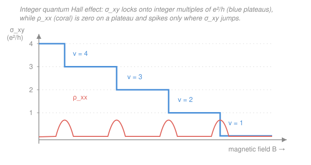

# Condensed Matter · Lesson 5.6: A glimpse of topological and strongly-correlated matter

> ⏱ ~15 min · Module 5: Magnetism and superconductivity · Builds on: [5.5 Superconductivity II: Cooper pairs and BCS (qualitative)](05-05-cooper-pairs-bcs.md), [3.7 Metals, insulators, and semiconductors](03-07-metals-insulators-semiconductors.md) · Unlocks: course finale — bridges to [`materials-science`](../../materials-science/syllabus.md) and modern research

## Why this matters

Band theory (Module 3) and BCS (5.5) are two of the great triumphs of 20th-century physics — but they are not the end of the story, and this final lesson is about where the road keeps going. Two frontiers, both discovered after the "solved" era, break the two things you have been trained to assume. The first, **topological matter**, has properties fixed by a *global* invariant — robust against disorder, impurities, and the exact shape of the sample, to a precision that now *defines* the standard of electrical resistance. The second, **strongly-correlated matter**, is where electron–electron repulsion is so strong that band theory doesn't just get numbers wrong — it predicts a *metal* where nature builds an *insulator*. This is a capstone: no new machinery to memorize, just an honest map of the modern field and how it reorganizes everything you've learned around two new ideas.

## The idea

Everything in this whole module has followed one script — the **Landau paradigm**. A phase is defined by a broken symmetry and an **order parameter**: a ferromagnet picks a direction ($\mathbf{M} \neq 0$, [5.2](05-02-exchange-ferromagnetism.md)), a superconductor picks a condensate phase ([5.5](05-05-cooper-pairs-bcs.md)). Heat it up, the order melts, the symmetry is restored. For a century that script classified *every* phase of matter.

The 21st century added two things the script can't see.

**Topology.** Imagine you could measure some property of a material and get *exactly* an integer — not "1.02, close to 1," but 1 to nine decimal places, unchanged if you bend the sample, dope it with dirt, or change its size. That's the signature of a **topological invariant**: a whole-system quantity that can only jump in discrete steps, like the number of holes in a surface (a coffee mug and a donut are "the same" — one hole each — because you can't remove a hole by smooth deformation). Some materials have an electronic structure with exactly this kind of integer buried in it, and that integer shows up as a physical observable of astonishing precision. Crucially, *no symmetry is broken* — two topological phases can have identical symmetry and still be genuinely, unmeltably different. That's outside Landau's script entirely.

**Strong correlations.** Band theory's founding move (Module 3) is to solve for *one* electron in the average field of all the others, then fill the bands. It works spectacularly when electrons mostly ignore each other. But push electrons close and make them repel hard, and the "average field" lie collapses: what one electron does depends violently on where every *other* electron is, instant to instant. When repulsion wins, you can have a half-filled band — which band theory swears must be a metal — that is a flat-out **insulator**, because the electrons refuse to pass through each other. That's a **Mott insulator**, and it's the doorway to the hardest open problems in the field.

## The formal version

### Topological matter — the integer quantum Hall effect

Take a 2D electron gas (a sheet of electrons at a semiconductor interface), cool it near absolute zero, and apply a strong magnetic field $B$ perpendicular to the sheet. Drive a current and measure the **Hall conductance** $\sigma_{xy}$ (current sideways per unit transverse voltage). Classically it should slide smoothly with $B$. Instead it climbs a **staircase of flat plateaus**, and on every plateau

$$\boxed{\;\sigma_{xy} = \nu\,\frac{e^2}{h}, \qquad \nu = 1, 2, 3, \ldots\;}$$

where $e$ is the electron charge, $h$ is Planck's constant, and $\nu$ is an **integer**. *In words: the Hall conductance is quantized in exact integer multiples of the fundamental unit $e^2/h$* — measured to parts per billion, identical across different samples, materials, and levels of disorder. The quantity $h/e^2 \approx 25{,}813\ \Omega$ (the **von Klitzing constant** $R_K$) is now the international standard of resistance.

Where do the integers come from? A magnetic field quantizes the 2D electron energies into evenly spaced **Landau levels** (the free-electron parabola of [3.1](03-01-free-electron-gas.md), reorganized into discrete rungs). The integer $\nu$ counts how many Landau levels are completely filled. A filled level, like a filled band ([3.7](03-07-metals-insulators-semiconductors.md)), carries no net current on its own — but each contributes exactly $e^2/h$ to $\sigma_{xy}$, and that "exactly" is a **topological invariant** (the *Chern number*) of the filled states. Because an integer cannot change under smooth deformation, the plateau doesn't care about the sample's dirt or shape. *The robustness is topological, not material.*

### Topological insulators

Push the idea past magnetic fields. A **topological insulator** is a material that is a genuine **insulator in the bulk** — a full valence band, an empty conduction band, a real gap — but is forced to carry **conducting states on its edge or surface**. These edge states are **symmetry-protected**: you cannot remove them by any smooth change, adding disorder or squeezing the crystal, *without closing the bulk gap*. They are **chiral or helical** (electrons of a given spin move in one direction only) and therefore **dissipationless** — there is no backward state to scatter into.

*In words: two insulators can have the exact same symmetry and the same bulk gap, yet be different states of matter — one has protected metallic edges, the other doesn't — and the only thing distinguishing them is a topological invariant, not a broken symmetry or an order parameter.* This is the sharpest possible contrast with the rest of Module 5.

### Strongly-correlated matter — the Mott insulator

Now the other frontier. Consider a lattice with one orbital per site and, on average, one electron per site — a **half-filled band**. Band theory's verdict is unambiguous: half-filled band $\Rightarrow$ partially filled $\Rightarrow$ **metal** ([3.7](03-07-metals-insulators-semiconductors.md)). Many such materials (e.g. certain transition-metal oxides) are instead excellent **insulators**. The resolution is the **Hubbard model**, the minimal Hamiltonian of correlation:

$$H = -t\sum_{\langle i j\rangle,\,\sigma} c^{\dagger}_{i\sigma}c_{j\sigma} \;+\; U\sum_{i} n_{i\uparrow}n_{i\downarrow}.$$

*In words: the first term (hopping amplitude $t$) lets an electron of spin $\sigma$ move from site $j$ to a neighboring site $i$ — this is band theory, and alone it makes a metal. The second term charges an energy penalty $U$ every time two electrons (opposite spins) sit on the same site — the on-site Coulomb repulsion.* Here $c^{\dagger}_{i\sigma}$ creates and $c_{j\sigma}$ destroys an electron; $n_{i\sigma}$ counts electrons of spin $\sigma$ on site $i$; $\langle ij\rangle$ means nearest-neighbor pairs.

The whole story is the ratio $U/t$:

- **$U \ll t$** (weak repulsion): hopping wins, electrons delocalize into a band — an ordinary **metal**, band theory correct.
- **$U \gg t$** (strong repulsion): to move, an electron must briefly double-occupy a neighboring site, paying $U$. At half filling every site already holds one electron, so *any* motion costs $U$ — the electrons **freeze, one per site**, and the material is an insulator. This is a **Mott insulator**: the gap is opened by *correlation*, not by band filling.

*In words: band theory fails not by a little but categorically — it predicts a metal, and strong on-site repulsion delivers an insulator, because the electrons simply refuse to pile up.* This physics underlies **high-$T_c$ cuprate superconductors** (dope a Mott insulator and superconductivity appears), **heavy-fermion** compounds, and **quantum spin liquids** — collectively the most active open frontier in the field.

## Picture

The blue staircase is $\sigma_{xy}$ pinned to integer multiples of $e^2/h$. The coral curve is the longitudinal resistance $\rho_{xx}$: it is **zero on every plateau** (the filled Landau levels carry current with no dissipation) and spikes only in the narrow transitions where $\sigma_{xy}$ jumps by one unit and a partially filled level briefly conducts.

## Worked examples

**Example 1 (the quantized value and the resistance standard).** On the $\nu = 2$ plateau, what is the Hall conductance, and the corresponding Hall *resistance*? Use $e = 1.602\times10^{-19}$ C, $h = 6.626\times10^{-34}$ J·s.

The conductance quantum is

$$\frac{e^2}{h} = \frac{(1.602\times10^{-19})^2}{6.626\times10^{-34}} = \frac{2.566\times10^{-38}}{6.626\times10^{-34}} \approx 3.874\times10^{-5}\ \Omega^{-1}.$$

So $\sigma_{xy} = 2\,(e^2/h) \approx 7.75\times10^{-5}\ \Omega^{-1}$. The Hall resistance is the inverse:

$$R_{xy} = \frac{1}{\sigma_{xy}} = \frac{1}{\nu}\frac{h}{e^2} = \frac{1}{2}\,(25{,}813\ \Omega) \approx 12{,}906\ \Omega.$$

The unit $h/e^2 = R_K \approx 25.8\ \mathrm{k}\Omega$ is reproducible so precisely — across labs, samples, and impurity levels — that it *defines* the ohm. That reproducibility is the fingerprint of a topological integer.

**Example 2 (why a half-filled band can insulate).** Band theory says a half-filled band is a metal. Explain, using $U$ and $t$, how the same material becomes an insulator — and what happens in between.

Line up the atoms with one electron each, band-theory style. To conduct, an electron must hop to an occupied neighbor, momentarily creating a doubly-occupied site (cost $U$) and an empty site. When $U \gg t$ the system cannot afford this: the energy to make a "doublon–holon" pair, roughly $U - $ (a few $t$ of kinetic relief), stays positive, so there is a gap and no conduction — a **Mott insulator**. When $U \ll t$ the kinetic energy gained by delocalizing overwhelms $U$, doubly-occupied sites are common, and the band-theory metal survives. Tuning $U/t$ (by pressure, which changes orbital overlap and hence $t$) drives an actual **metal–insulator (Mott) transition** at a critical $U/t$ of order 1. The lesson: *filling tells you what band theory predicts; the ratio $U/t$ tells you whether to believe it.*

## Watch out

- **You might think the quantum Hall plateaus are precise because the samples are clean — it's the opposite.** Disorder is what *widens* the plateaus: it localizes the states between Landau levels so that $\sigma_{xy}$ stays locked while $B$ varies. The integer itself comes from topology and is immune to the disorder; the dirtier sample just shows the plateau over a wider field range.
- **You might think a Mott insulator is "just an insulator like diamond."** It is not. A band insulator ([3.7](03-07-metals-insulators-semiconductors.md)) has a filled band and an *even* number of electrons per cell — non-interacting theory already explains it. A Mott insulator has an *odd* number (half-filled) and is a metal in every non-interacting theory; only the interaction $U$ makes it insulate. Same word, different universe.
- **You might expect a topological phase to have an order parameter like magnetization.** It generally doesn't — that's the whole point. There is no local quantity that turns on at a "transition temperature"; the phase is labeled by a global integer. Landau's symmetry-breaking classification simply doesn't apply.

## One-liner

> Twentieth-century condensed matter sorted phases by broken symmetry and order parameters; the twenty-first adds two organizing principles band theory can't reach — **topology** (integers protected globally, like the quantized Hall $\sigma_{xy} = \nu e^2/h$) and **strong correlation** (repulsion $U$ that turns a half-filled "metal" into a Mott insulator).

## Problems

**P1 (🟢)** A quantum Hall sample sits on the $\nu = 4$ plateau. (a) Write its Hall conductance in units of $e^2/h$. (b) Using $h/e^2 = 25{,}813\ \Omega$, find the Hall resistance $R_{xy}$. (c) What is the longitudinal resistance $\rho_{xx}$ *on* the plateau, and why?

**P2 (🟡)** Sort these three insulators by *mechanism*, not by resistance: (i) diamond, (ii) a half-filled transition-metal oxide with $U \gg t$, (iii) the bulk of a topological insulator. For each, state in one line why it doesn't conduct — and which one band theory gets *wrong*.

**P3 (🔴, optional)** In the Hubbard model at half filling, argue qualitatively why the Mott gap scales like $U$ for $U \gg t$, and estimate the crude filling-in of the gap. What physical knob would you turn to drive the metal–insulator transition, and which way?

Solutions

**P1** (a) On an integer plateau $\sigma_{xy} = \nu\,e^2/h$, so $\sigma_{xy} = 4\,e^2/h$. (b) The Hall resistance is the reciprocal of the Hall conductance:

$$R_{xy} = \frac{1}{\nu}\frac{h}{e^2} = \frac{25{,}813}{4} \approx 6{,}453\ \Omega.$$

(c) On the plateau $\rho_{xx} = 0$ — zero longitudinal resistance, i.e. dissipationless flow. The filled Landau levels have no empty states nearby for an electron to scatter into (Pauli), so current runs without loss; $\rho_{xx}$ only spikes in the transitions between plateaus, where a level is partially filled.

*Check.* Larger $\nu$ (weaker field, more filled levels) gives *smaller* Hall resistance, matching the staircase in the figure descending toward the origin as $\nu \to 0$ at high field. Units: $h/e^2$ has units of (J·s)/C² $=$ V·s/(A·s·C·... )$\;=\Omega$ ✓ (indeed $R_K = 25.8\ \mathrm{k}\Omega$). ✓

**P2**
- (i) **Diamond — band insulator.** A filled valence band, a large gap ($\approx 5.5$ eV) to the empty conduction band, an even number of electrons per cell. Non-interacting band theory explains it completely.
- (ii) **Mott insulator — correlation.** Half-filled band (odd electron count), so band theory predicts a **metal** — this is the one band theory gets *wrong*. Strong on-site repulsion $U \gg t$ freezes one electron per site; hopping would cost $U$, so a correlation gap opens.
- (iii) **Topological insulator — bulk.** A genuine bulk gap (band-insulator-like in the interior), but distinguished by a topological invariant that forces protected conducting states on the *surface*. The bulk doesn't conduct; the edges do.

*Check.* The discriminator is electron count per cell and interaction strength: even filling + weak $U$ → band insulator; odd (half) filling + strong $U$ → Mott; gapped bulk + nontrivial invariant → topological. Only the Mott case contradicts non-interacting theory. ✓

**P3** At half filling with $U \gg t$, the ground state is one electron per site. The cheapest charge excitation moves one electron onto a neighbor, creating a doubly-occupied site ("doublon") and an empty site ("holon"). Making that pair costs the on-site penalty $U$, offset by a kinetic gain of order the bandwidth ($\sim$ a few $t$) as the doublon and holon delocalize. So the charge gap is roughly

$$\Delta_{\text{Mott}} \sim U - (\text{order } t),$$

which $\to U$ as $U/t \to \infty$ and closes when $U$ drops to order the bandwidth — a **Mott transition** at $U/t \sim \mathcal{O}(1)$. The natural experimental knob is **pressure**: squeezing the lattice increases orbital overlap, raising $t$ (lowering $U/t$), which drives a Mott insulator *toward* the metallic side. (Chemical doping — adding/removing electrons off half filling — also destroys the Mott insulator and, in the cuprates, uncovers high-$T_c$ superconductivity.)

*Check.* Limiting cases: $U \to \infty$ gives $\Delta \to U$ (a hard insulator, electrons fully frozen); $U \to 0$ gives $\Delta \to 0$ (the band-theory metal). Both endpoints are correct, so the crossover at $U \sim t$ is sensible. ✓

## Flashback

**From Lesson 3.7 (Metals, insulators, and semiconductors):** A crystal has a single band that is *exactly filled* — two electrons per unit cell, no partially filled band anywhere, and a 4 eV gap to the next band. Is it a metal or an insulator, and what is the one-sentence reason? Then contrast: how does a Mott insulator reach the *same* zero conductivity from a completely different starting point?

Solution

The exactly-filled band with a 4 eV gap is an **insulator** (band insulator). Reason: a completely filled band carries no net current — for every electron at crystal momentum $+\mathbf{k}$ there is one at $-\mathbf{k}$, and an applied field can't accelerate any of them because every nearby state is occupied (Pauli) and the gap to empty states is far too large for room-temperature heat ($k_BT \approx 0.025$ eV) to bridge.

The contrast: a **Mott insulator** has a *half*-filled band — band theory says partially filled, i.e. a **metal**. It insulates anyway, but for an entirely different reason: strong on-site repulsion $U$ makes it energetically forbidden for two electrons to share a site, so at one electron per site nothing can move. Same observable (zero conductivity), opposite mechanism — filled band and Pauli in one case, half-filled band and Coulomb correlation in the other.

*Check.* The band-insulator argument needs *no* electron–electron interaction (it's pure counting + Pauli); the Mott argument needs interaction as its whole engine. That's exactly the Module 3 → frontier divide this lesson draws. ✓

## Connections

- **Backward:** both frontiers are built on Module 3. The quantum Hall integer counts filled **Landau levels** — the free-electron gas of [3.1](03-01-free-electron-gas.md) reorganized by a magnetic field — and a filled level is inert for the same Pauli reason a filled band is ([3.7](03-07-metals-insulators-semiconductors.md)). The Mott insulator is the tight-binding cosine band of [3.5](03-05-tight-binding.md) with the on-site repulsion $U$ that band theory throws away, restored.
- **Forward:** this closes the course by tracing the whole arc — from a **static lattice** (Module 1) → its **vibrations** (phonons, Module 2) → **electrons in bands** (Module 3) → **devices** (Module 4) → **collective order** (magnetism and superconductivity, Module 5) → and finally to the two ideas — topology and correlation — that organize the *modern* research field. It feeds directly into [`materials-science`](../../materials-science/syllabus.md), where these mechanisms become design principles for real compounds.
- **Sideways:** the topological invariant (Chern number) is the physics face of ideas from **topology and differential geometry** — the same "you can't smoothly change an integer" logic that classifies surfaces by their number of holes (see the `topology`/`differential-geometry` tracks). The Hubbard model and correlations are the entry point to **modern many-body methods** (quantum Monte Carlo, dynamical mean-field theory) — genuinely beyond this course's scope, and where the open problems of the field actually live.
