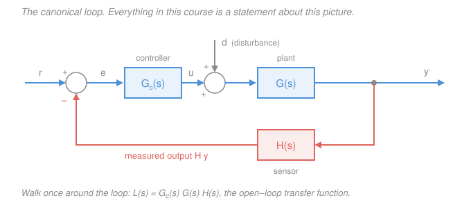
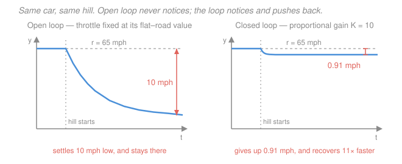

# Control Systems · Lesson 1.1: Feedback & the control problem

> ⏱ ~15 min · Module 1: Modeling & the Laplace transform · Builds on: nothing — this is the front door · Unlocks: [1.2 Modeling systems as ODEs](01-02-modeling-systems-as-odes.md), and every lesson after it

## Why this matters

In 1868 James Clerk Maxwell published a paper called *On Governors*, because steam engines fitted with Watt's centrifugal governor — a beautifully simple feedback device — had started **hunting**: instead of holding a steady speed they surged and sagged, sometimes violently. Maxwell's answer was that the whole machine, engine plus governor, obeys a differential equation, and it misbehaves exactly when that equation's roots have positive real parts. That paper is the birth certificate of control theory. Note what happened: someone added feedback to a perfectly stable machine and **made it unstable**.

That is the tension this course lives in. Feedback is close to magic — it makes cheap, drifting, poorly-known hardware behave like precision equipment. It is also the fastest way to turn a well-behaved system into an oscillating wreck. Everything in Modules 2 through 5 is machinery for getting the magic without the wreck.

## The idea

Set the vocabulary against one system you have physically felt: **cruise control**.

- **Plant** $G$ — the thing you're stuck with. Here: car plus engine plus road. It converts throttle into speed.
- **Actuator** — the muscle you're allowed to move. Here: the throttle.
- **Sensor** — how you find out what happened. Here: the wheel-speed pickup.
- **Output** $y$ — what you actually care about (mph).
- **Reference** or **setpoint** $r$ — what you *want* $y$ to be. 65 mph.
- **Error** $e = r - y$ — how wrong you currently are.
- **Control effort** $u$ — the command sent to the actuator (throttle position).
- **Disturbance** $d$ — everything the world does to you that you didn't ask for. A hill.
- **Controller** $G_c$ — the rule that turns $e$ into $u$. This is the only part you get to design.

Now, two ways to hold 65 mph.

**Open loop.** Calibrate once: on flat ground, this throttle setting gives 65. Then hold it there forever. No sensor, no feedback, no loop. It works *perfectly* — on the exact car, exact road, exact day you calibrated. Hit a hill and you slow down and never notice. Load four passengers and you're slow all afternoon. Let the engine age five years and you're slow permanently. Open loop has **no mechanism for noticing it is wrong**, because nothing ever tells it what $y$ is.

**Closed loop.** Measure the speed, subtract it from 65, and push the throttle in proportion to the difference: $u = K e$. Now the hill *announces itself* — the speed sags, the error grows, the throttle opens. You didn't have to predict the hill, model the hill, or even know hills exist.

That's the whole trick, and it's worth saying precisely what changed. Open loop needs a good *model*; closed loop needs a good *measurement*. Models are always somewhat wrong. Measurements are about right, right now. Feedback trades your dependence on knowing the plant for a dependence on watching the output.

## The formal version

**The standard loop.** Signals get capital letters in the Laplace domain ($R, E, U, Y, D$); we'll build that machinery in [1.3](01-03-laplace-transform-toolkit.md) and [1.4](01-04-transfer-functions-poles-zeros.md). For this lesson treat every block as a plain multiplier — a gain — which is exactly what it is at steady state.

Reference $r$ enters a **summing junction** that subtracts the fed-back measurement, producing the error; the error drives the controller $G_c$, whose output $u$ drives the plant $G$, whose output is $y$; the sensor $H$ measures $y$ and feeds it back. The minus sign on the feedback path is what makes it **negative feedback**, and it is the single most important sign in the subject.

Two definitions the whole course reuses:

$$\boxed{\;L(s) = G_c(s)\,G(s)\,H(s)\;}\qquad\text{(open-loop transfer function)}$$

*In words: $L$ is what you get by breaking the loop at the junction and multiplying everything on the way around.* And for **unity feedback** ($H = 1$, a perfect sensor, so $e = r - y$ exactly):

$$T(s) = \frac{Y(s)}{R(s)} = \frac{G_c G}{1 + G_c G}.$$

*In words: forward path over one-plus-loop-gain.* We'll prove this and its general-$H$ cousin $T = G_cG/(1+G_cGH)$ in [1.5](01-05-block-diagram-algebra.md); today just use it.

### Benefit 1: sensitivity to plant error collapses

Let the controller be a constant gain $K$ and the plant a constant gain $G$. Compare two setups.

*Open loop:* $T_{\mathrm{ol}} = KG$. If $G$ drifts by 20 percent, $T_{\mathrm{ol}}$ drifts by 20 percent. The output error is exactly the plant error. One-to-one, always.

*Closed loop:* $T = \dfrac{KG}{1+KG}$. Ask how much $T$ moves when $G$ moves, in relative terms — the **sensitivity**:

$$S \;\equiv\; \frac{dT/T}{dG/G} \;=\; \frac{dT}{dG}\cdot\frac{G}{T}.$$

Differentiate with the quotient rule: $\dfrac{dT}{dG} = \dfrac{K(1+KG) - KG\cdot K}{(1+KG)^2} = \dfrac{K}{(1+KG)^2}$. Then

$$S = \frac{K}{(1+KG)^2}\cdot\frac{G(1+KG)}{KG} \;\;\Longrightarrow\;\; \boxed{\;S = \frac{1}{1+KG} = \frac{1}{1+L}\;}$$

*In words: a percentage error in the plant shows up in the closed-loop output divided by $1+L$.* Open loop has $S = 1$; with loop gain $L = 10$ you get $S = 1/11$. **This one line is the thesis of the entire course.** Big loop gain buys you accuracy you never had to build into the hardware — and everything hard about control is the price of making $L$ big without going unstable.

### Benefit 2: disturbances get divided by the same factor

Let the disturbance enter at the plant input (a hill acts like a throttle you didn't ask for), so $y = G(u + d)$ with $u = K(r-y)$. Solve:

$$y(1+KG) = KGr + Gd \;\;\Longrightarrow\;\; y = \underbrace{\frac{KG}{1+KG}}_{\text{tracking}}r \;+\; \underbrace{\frac{G}{1+KG}}_{\text{disturbance}}d.$$

*In words: the loop passes the reference through nearly unchanged and squashes the disturbance by $1+L$.* Open loop, the same $d$ hits the output with full weight $G$. Same denominator, same lever: crank $L$, shrink both errors.

### Benefit 3: you can change the dynamics — the deep one

The first two benefits shrink errors. The third changes *what the system is*. Take a first-order plant $G(s) = \dfrac{1}{s+1}$ — a car whose speed responds with a 1-second time constant. Close the loop with gain $K$:

$$T(s) = \frac{K/(s+1)}{1 + K/(s+1)} = \frac{K}{s + 1 + K}.$$

The plant's pole was at $s = -1$. The closed-loop pole is at $s = -(1+K)$. **Feedback moved it.** With $K = 10$ the pole sits at $-11$: the same physical car now responds eleven times faster, with no change to the engine. Poles are where a system's speed, ringing, and stability all live ([1.4](01-04-transfer-functions-poles-zeros.md)), so being able to *place* them is being able to dictate behavior. Push this idea all the way and you get [5.4 Pole placement & observers](05-04-pole-placement-observers.md), where you put every closed-loop pole exactly where you want it.

### The costs, stated honestly

1. **You need a sensor, and sensors lie.** If the measurement is $y + n$ for some noise $n$, the loop cannot tell $n$ from a genuine error — it will happily chase noise, burning actuator life and injecting jitter into $y$. Feedback is only as good as what you measure.
2. **You spend control effort.** At the instant a step reference arrives, $y$ is still zero, so $u = Ke = Kr$ — a spike proportional to $K$. Real actuators saturate; a throttle can't open to 700 percent.
3. **You can make a stable plant unstable.** This is the big one, and it's Maxwell's governor. The intuition in one sentence: **the loop acts on stale information** — every real plant takes time to respond, so the correction you compute now lands after the situation has moved on, and if it lands half a cycle late it *adds* to the error instead of cancelling it. Negative feedback delayed by half a period is positive feedback. Deciding whether that happens, and how much margin you have before it does, is what [2.4 Stability & Routh–Hurwitz](02-04-stability-routh-hurwitz.md), [3.4 Gain & phase margins](03-04-gain-and-phase-margins.md), and [3.5 The Nyquist criterion](03-05-nyquist-criterion.md) exist to settle.

### What counts as "good": specs, and where each one is delivered

A control spec is never "make it work." It is four numbers, and each one has an address in this syllabus:

| You want it… | Measured by | Delivered in |
|---|---|---|
| **Fast** | rise time $t_r$, settling time $t_s$, time constant $\tau$ | [2.1](02-01-first-order-response.md), [2.2](02-02-second-order-response.md) |
| **Accurate** | steady-state error $e_{ss}$, system type, $K_p/K_v/K_a$ | [2.3](02-03-steady-state-error-system-type.md) |
| **Well-behaved** | percent overshoot $M_p$, damping ratio $\zeta$ | [2.2](02-02-second-order-response.md) to predict, [3.2](03-02-root-locus-design.md) to design |
| **Stable at all** | poles strictly in the left half-plane | [2.4](02-04-stability-routh-hurwitz.md), [3.5](03-05-nyquist-criterion.md) |
| **Robust** | gain margin, phase margin | [3.4](03-04-gain-and-phase-margins.md) |

Those specs conflict — fast usually means overshooting, accurate usually means less margin — and the design lessons ([3.2](03-02-root-locus-design.md), [4.1](04-01-pid-control.md), [4.2](04-02-tuning-pid.md), [4.3](04-03-lead-lag-compensators.md)) are all about trading them deliberately.

## Picture

## Worked examples

**Example 1 (the calculation this course is built on).** Cruise control. Plant DC gain $G = 1$ mph per unit of throttle command, nominally. Target $r = 65$ mph. Then the engine ages / the air gets thin / your calibration was off, and the true plant gain turns out to be $G' = 1.2$ — **20 percent** high.

*Open loop.* Pick the throttle that gives 65 on the nominal plant: $u = 65/G = 65$. Hold it. On the true plant,

$$y = G'u = 1.2 \times 65 = 78\ \text{mph}.$$

You are 13 mph fast — the full 20 percent, passed straight through.

*Closed loop*, $u = K(r-y)$ with $K = 10$. To make the comparison fair, set the reference so that this loop *also* delivers exactly 65 on the nominal plant. Since $y = r\,\frac{KG}{1+KG} = r\cdot\frac{10}{11}$, choose $r = 65 \times \tfrac{11}{10} = 71.5$. On the true plant $G' = 1.2$, the loop gain becomes $KG' = 12$:

$$y = 71.5 \times \frac{12}{13} = 66.0\ \text{mph}.$$

You are 1.0 mph fast — **1.54 percent**. Same hardware, same 20 percent plant error, and the output error dropped by a factor of 13.

*Where does 13 come from?* Exactly, for a finite change (not just a derivative):

$$\frac{\Delta T/T}{\Delta G/G} = \frac{1}{1+KG'} = \frac{1}{13} \quad\Longrightarrow\quad 20\% \times \tfrac{1}{13} = 1.54\%.$$

That matches the 66.0 mph we computed directly. ✓

The infinitesimal formula $S = 1/(1+KG) = 1/11$ predicts 1.82 percent; the exact finite answer is 1.54 percent. They differ because 20 percent is not a small perturbation, and the perturbed loop is *stiffer* ($1+KG' = 13 > 11$) so it rejects even better than the nominal sensitivity promised. Order of magnitude: identical, and that's the point.

*The disturbance, same lesson.* A hill worth $d = -10$ units of throttle. Open loop: $\Delta y = Gd = -10$ mph, permanently. Closed loop:

$$\Delta y = \frac{G}{1+KG}\,d = \frac{-10}{11} = -0.909\ \text{mph}.$$

Elevenfold rejection, from the same $1+L$. ✓

That's the second panel of the figure.

*The honest asterisk.* Notice we had to fudge $r$ up to 71.5 to get 65 out. Proportional control leaves a **steady-state offset**: the error must be nonzero, or the throttle would be zero and the car would coast to a stop. $e_{ss} = 71.5 - 65 = 6.5$ mph of standing error is the price of $u = Ke$. Two fixes exist — scale $r$ (what we did, and it depends on knowing $G$, which defeats the purpose) or add an **integrator**, which accumulates error until it vanishes. That's the "I" of PID, [4.1](04-01-pid-control.md), and the general theory of who has offset and who doesn't is [2.3](02-03-steady-state-error-system-type.md).

**Example 2 (the cost, priced).** Same loop, $K = 10$, $r$ stepping from 0 to 71.5 at $t=0$.

At $t = 0^+$ the car hasn't moved, so $y = 0$, $e = 71.5$, and

$$u(0^+) = Ke = 10 \times 71.5 = 715\ \text{units}.$$

At steady state $e_{ss} = 6.5$, so $u_{ss} = 10 \times 6.5 = 65$ units — the throttle setting we knew we needed. The loop demanded an **11× transient overdrive** to get there fast. Real throttle plates stop at 100 percent, so the actuator saturates, the effective gain drops during the transient, and the response is slower than $T(s) = 10/(s+11)$ predicts. This is why "just crank $K$" is not a design method: raising $K$ buys accuracy (Benefit 1) and speed (Benefit 3) with actuator effort, noise amplification, and — for any plant more complicated than first order — stability margin.

## Watch out

- **You might think open loop is just the lazy option.** It isn't; it's the right answer when the plant is well known, the disturbances are small, and there's no cheap sensor. A microwave runs its magnetron open loop for 90 seconds. A stepper motor positions open loop. Feedback is a *purchase*, and you should know what you're paying.
- **You might think more feedback is monotonically better.** For a first-order plant it nearly is — the pole just slides left forever. For anything second order or higher, cranking $K$ eventually walks the closed-loop poles into the right half-plane and the thing oscillates and diverges. [3.1](03-01-root-locus-construction.md) draws exactly that migration; it's the single most useful picture in classical control.
- **You might read $e = r - y$ as always literally true.** It's true only for unity feedback, $H = 1$. With a real sensor the junction computes $r - Hy$ — the error against the *measurement*, not the truth. If the sensor has gain 0.98, the loop will confidently hold $y$ at $r/0.98$ and report success. Feedback makes you insensitive to the plant by making you *completely* sensitive to the sensor.
- **You might expect the disturbance to enter where the reference does.** It rarely does. A hill enters at the plant input, sensor noise enters at the measurement, wind gusts enter at the output — and each entry point gets its own transfer function with the same $1+L$ denominator but a different numerator. Always ask *where* a signal enters before writing its effect.

## One-liner

> Feedback divides your ignorance by $1+L$ — plant error, disturbances, and drift all shrink by the loop gain — and charges you a sensor, actuator effort, and the very real possibility of instability.

## Problems

**P1 (🟢)** A heater has nominal DC gain $G = 2$ (degrees Celsius per unit of drive). It is driven open loop by $u = r/2$, which gives $y = r$ on the nominal plant. Over five years the element degrades and the true gain falls 30 percent, to $G' = 1.4$.

(a) What is the percentage output error open loop?
(b) The same plant is put in a unity-feedback loop with proportional gain $K = 4$. Compute the closed-loop gain $T = KG/(1+KG)$ before and after the degradation, and give the percentage change.
(c) The sensitivity formula gives $S = 1/(1+KG) = 1/9$, predicting a 3.3 percent change. The exact answer in (b) is larger. Why?

**P2 (🟡)** A room's temperature obeys $y = G(u + d)$ with DC gain $G = 2$ °C per unit of heater drive. Someone opens a window, a disturbance worth $d = -3$ units.

(a) With the heater held at a fixed setting (open loop), how far does the temperature fall?
(b) Now close the loop with $u = K(r - y)$. Find the smallest $K$ that keeps the steady-state temperature drop to at most 0.2 °C.

**P3 (🔴)** A motor has $G(s) = \dfrac{4}{s+2}$ and sits in a unity-feedback loop with proportional gain $K$.

(a) Find $T(s) = Y/R$ and its pole. Choose $K$ so the closed-loop time constant is $\tau = 0.05$ s (ten times faster than the open-loop motor).
(b) With that $K$, what is the DC gain of $T$, and hence the steady-state error to a unit step reference?
(c) For that unit step, compare the control effort $u$ at $t = 0^+$ with its steady-state value. What design tension does the ratio expose, and which later lesson removes the error in (b)?

Solutions

**P1**

(a) Open loop the drive is frozen at $u = r/2$, so the output on the degraded plant is

$$y = G'u = 1.4 \times \frac{r}{2} = 0.7\,r.$$

That is **30 percent low** — the plant error passed through one-for-one, exactly as $S_{\mathrm{ol}} = 1$ says.

(b) Nominal: $KG = 4 \times 2 = 8$, so

$$T = \frac{8}{1+8} = \frac{8}{9} = 0.8889.$$

Degraded: $KG' = 4 \times 1.4 = 5.6$, so

$$T' = \frac{5.6}{1+5.6} = \frac{5.6}{6.6} = 0.8485.$$

Relative change:

$$\frac{T'-T}{T} = \frac{0.8485 - 0.8889}{0.8889} = -0.04545 = -4.55\%.$$

Thirty percent of plant error became **4.55 percent** of output error — a factor of 6.6 reduction.

*Check.* The exact finite-perturbation identity is $\dfrac{\Delta T/T}{\Delta G/G} = \dfrac{1}{1+KG'}$. Here that gives $\dfrac{-30\%}{6.6} = -4.545\%$ ✓, matching to the digit. (Derivation: $T'-T = \frac{K(G'-G)}{(1+KG')(1+KG)}$, and dividing by $T = KG/(1+KG)$ leaves $\frac{G'-G}{G(1+KG')}$.)

(c) $S = 1/(1+KG)$ is a **derivative** — it is exact only for infinitesimal changes, evaluated at the nominal point $KG = 8$. A 30 percent drop is not infinitesimal, and it moves the loop gain *down* to $KG' = 5.6$, so the loop is weaker over most of the excursion than the nominal $1/9$ assumed. The honest divisor is $1 + KG' = 6.6$, not $1 + KG = 9$. Rule of thumb: for a gain **drop**, the true sensitivity is worse than $S$ predicts; for a gain **rise**, better (Example 1 saw exactly that — 1.54 percent beat the predicted 1.82 percent).

**P2**

(a) Open loop the drive $u$ is fixed, so the change in output is the disturbance straight through the plant:

$$\Delta y = G\,d = 2 \times (-3) = -6\ ^\circ\text{C}.$$

A six-degree drop, permanent until someone shuts the window.

(b) Closing the loop, $y = G(K(r-y) + d)$ gives $y(1+KG) = KGr + Gd$, so the disturbance term is

$$\Delta y = \frac{G}{1+KG}\,d = \frac{-6}{1+2K}.$$

Require $|\Delta y| \le 0.2$:

$$\frac{6}{1+2K} \le 0.2 \;\Longrightarrow\; 1+2K \ge 30 \;\Longrightarrow\; K \ge 14.5.$$

So $\boxed{K_{\min} = 14.5}$.

*Check.* At $K = 14.5$: $1+2(14.5) = 30$ and $6/30 = 0.2$ ✓ exactly at the bound. Sanity: the open-loop 6 °C had to shrink by a factor of 30, and $1+L = 1+2K = 30$ is precisely that factor — the disturbance is divided by one-plus-loop-gain, as it must be.

**P3**

(a) With $G_c = K$ and unity feedback,

$$T(s) = \frac{KG}{1+KG} = \frac{\dfrac{4K}{s+2}}{1 + \dfrac{4K}{s+2}} = \frac{4K}{s+2+4K}.$$

The single pole is at $s = -(2+4K)$, so $\tau = \dfrac{1}{2+4K}$. For $\tau = 0.05$ s we need $2+4K = 20$, i.e.

$$\boxed{K = 4.5}, \qquad \text{pole at } s = -20.$$

*Check.* Open loop the pole is at $-2$, $\tau = 0.5$ s; closed loop $-20$, $\tau = 0.05$ s — ten times faster ✓, and the pole moved *left*, so still stable.

(b) DC gain is $T(0)$:

$$T(0) = \frac{4K}{2+4K} = \frac{18}{20} = 0.9.$$

A unit step reference therefore settles at $y_{ss} = 0.9$, leaving

$$e_{ss} = 1 - 0.9 = 0.1 \quad (10\text{ percent standing error}).$$

(c) At $t = 0^+$ the output hasn't moved, so $e(0^+) = 1$ and

$$u(0^+) = K\,e(0^+) = 4.5.$$

At steady state $e_{ss} = 0.1$, so $u_{ss} = 4.5 \times 0.1 = 0.45$. The actuator must momentarily deliver **ten times** its eventual working command.

The tension: the same knob sets all three outcomes. Raising $K$ pushes the pole further left (faster), raises the DC gain toward 1 (more accurate), and raises the initial control effort in exact proportion. If the motor's amplifier saturates at, say, 2 units, this design silently doesn't happen — the response is effort-limited, slower than $\tau = 0.05$ s, and no amount of gain fixes it. The residual 10 percent error in (b) is removed not by more gain but by a *different controller structure*: an integral term, which keeps pushing while any error remains. That's [4.1 PID control](04-01-pid-control.md), with the general theory of which loops have standing error in [2.3](02-03-steady-state-error-system-type.md).

*Check on (b) and (c) together.* The plant's DC gain is $G(0) = 4/2 = 2$, and at steady state $y_{ss} = G(0)\,u_{ss}$, so $u_{ss} = 0.9/2 = 0.45$. That agrees with $u_{ss} = K e_{ss} = 4.5 \times 0.1 = 0.45$ ✓ — two independent routes to the same number, confirming both the DC gain and the standing error.

## Connections

- **Backward:** nothing in this course yet — but the differential equations behind $G(s)$ are [`ode-refresher` 2.1](../../ode-refresher/lessons/02-01-second-order-constant-coefficient.md) and [2.2](../../ode-refresher/lessons/02-02-oscillations-damping.md), and the transfer-function language is developed in depth in [`signals-systems` 2.5](../../signals-systems/lessons/02-05-transfer-functions-poles-zeros.md). This course borrows that machinery and spends its budget on *design*.
- **Forward:** [1.2](01-02-modeling-systems-as-odes.md) makes $G$ concrete by deriving it from Newton's laws and Kirchhoff's laws; [1.3](01-03-laplace-transform-toolkit.md) and [1.4](01-04-transfer-functions-poles-zeros.md) turn it into a pole–zero picture; [1.5](01-05-block-diagram-algebra.md) proves the $G_cG/(1+G_cG)$ formula used freely today. Benefit 3 — feedback relocating poles — is the seed of [3.1](03-01-root-locus-construction.md) (watch them move) and [5.4](05-04-pole-placement-observers.md) (put them exactly where you want).
- **Sideways:** the same $1/(1+L)$ appears everywhere a loop does — a thermostat, an aircraft autopilot (modern fighters are deliberately built *unstable* and made flyable only by feedback, Maxwell's lesson run in reverse), an insulin pump tracking blood glucose, and the centrifugal governor that started it all. In economics the identical algebra is a multiplier with leakage; in biology it's homeostasis. Later, in [`signals-systems` 2.1](../../signals-systems/lessons/02-01-eigenfunctions-frequency-response.md)'s language, the whole stability question becomes: what does $L(j\omega)$ do near the point where its phase hits $-180^\circ$?
