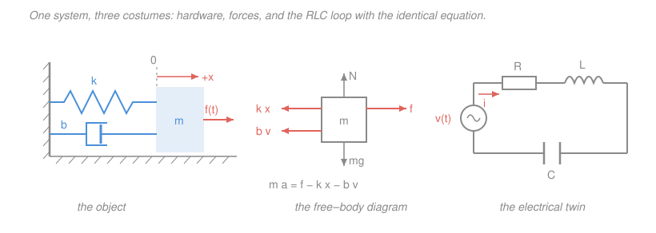
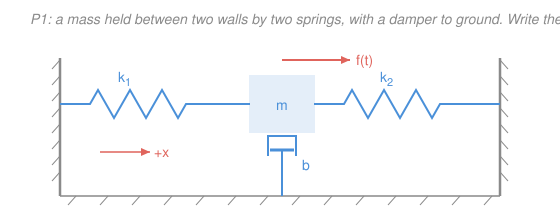

# Control Systems · Lesson 1.2: Modeling systems as ODEs

> ⏱ ~15 min · Module 1: Modeling & the Laplace transform · Builds on: [1.1 Feedback and the control problem](01-01-feedback-and-the-control-problem.md), [`mechanics-refresher` 1.3](../../mechanics-refresher/lessons/01-03-applying-newtons-laws.md), [`circuits` 1.3](../../circuits/lessons/01-03-kirchhoffs-laws-kcl-kvl.md) · Unlocks: [1.3 The Laplace transform toolkit](01-03-laplace-transform-toolkit.md)

## Why this matters

[1.1](01-01-feedback-and-the-control-problem.md) drew a box labelled "plant" and waved at it. This lesson opens the box. Everything the rest of the course does — poles, root loci, Bode plots, PID tuning, pole placement — operates on a **differential equation**, and somebody has to write that equation down by looking at actual hardware. That somebody is you, and it is the step where control projects actually fail: a beautifully tuned controller for the wrong model is worse than a crude controller for the right one.

Here's the payoff that makes the effort worth it. A car suspension, a hard-drive head, a series RLC filter, and a motor shaft all reduce to the *same three-term equation*. Learn to write it once and you own all four. That's not a cute coincidence — it's why a control engineer can walk between industries with one toolkit.

## The idea

Modeling is a loop, and every step is a decision:

1. **Physical object** — a real thing with paint on it.
2. **Idealized elements** — replace it with a small vocabulary of perfect parts: masses that only store kinetic energy, springs that only store potential, dampers that only dissipate. Resistors, inductors, capacitors on the electrical side.
3. **A diagram** — a free-body diagram (mechanical) or a circuit schematic (electrical), with **sign conventions committed to in ink**.
4. **A conservation law** — Newton's second law, or Kirchhoff's voltage/current laws. This is the only physics; everything else is bookkeeping.
5. **An ODE** — collect terms, put the unknown on the left and the input on the right.

The art is entirely in step 2, and the art is **choosing what to neglect**. A real spring has mass. A real damper is nonlinear at high speed. A real motor's wires have inductance. Keep all of it and you get a model you cannot design with; throw away too much and you design for a system that doesn't exist. The working rule: *keep the effects that act on the timescale you care about, throw away the ones that are much faster or much slower.* Then check the model against the real thing, because you will be wrong at least once.

Two more habits worth forming now. **Name your positive direction before you write a single force** — sign errors, not calculus errors, are what actually kill free-body diagrams. And **write the equation with the thing you want to control on the left, the thing you can push on the right**; that ordering becomes "output over input" the moment we hit transfer functions in [1.4](01-04-transfer-functions-poles-zeros.md).

## The formal version

### Translational mechanical elements

Three elements, each a rule linking force $f$ (newtons, N) to the motion of a point at displacement $x$ (meters, m), with velocity $v = \dot x$ (m/s):

| Element | Parameter (units) | Force it exerts | Stores / dissipates |
|---|---|---|---|
| Mass | $m$ (kg) | $f = m\ddot x$ | kinetic energy $\tfrac12 m\dot x^2$ |
| Spring | $k$ (N/m) | $f = k x$ | potential energy $\tfrac12 kx^2$ |
| Viscous damper | $b$ (N·s/m) | $f = b\dot x$ | dissipates $b\dot x^2$ (heat) |

*In words: the mass resists acceleration, the spring resists displacement, the damper resists velocity.* Note the pattern — the three elements respond to the **second, zeroth, and first** derivative of $x$. That is why a system with all three gives a *second-order* equation, and why second-order behavior is everywhere.

The magnitudes in that table are unsigned. The signs come from the free-body diagram, next.

### The mass–spring–damper, done carefully

Setup: a block of mass $m$ slides on a frictionless floor, tied to a wall by a spring $k$ and a damper $b$, pushed by an external force $f(t)$. Let $x$ be the displacement **to the right**, measured from the position where the spring is relaxed. Positive $x$ = right, positive force = right, positive $\dot x$ = moving right. Committed.

Now enumerate the horizontal forces **on the block**:

- **Spring.** If $x > 0$ the spring is stretched, so it pulls the block back toward the wall — i.e. to the *left*, i.e. negative. Contribution: $-kx$. (Check the other case: $x<0$ compresses the spring, which pushes right; $-kx$ with $x<0$ is positive. Same formula works.)
- **Damper.** If $\dot x > 0$ the block is moving right, so the damper drags left. Contribution: $-b\dot x$.
- **Applied.** $+f(t)$.
- **Vertically:** the normal force and weight cancel, and the floor is frictionless, so nothing horizontal comes from them.

Newton's second law ([`mechanics-refresher` 1.3](../../mechanics-refresher/lessons/01-03-applying-newtons-laws.md)) along $+x$:

$$m\ddot x = f(t) - kx - b\dot x.$$

Move everything but the input to the left:

$$\boxed{\,m\ddot x + b\dot x + kx = f(t)\,}$$

*In words: inertia plus friction plus stiffness, all opposing the motion, must add up to whatever you push with.* This is the exact equation of [`mechanics-refresher` 3.2](../../mechanics-refresher/lessons/03-02-damped-driven-oscillations.md) — the damped driven oscillator — which is a good sign: control isn't new physics, it's a new *use* for the physics you have.

**The sign sanity check you should run every time:** with $f=0$, all three terms on the left must have the *same sign* for a passive system. If your damping term comes out as $-b\dot x$ on the left, you have a system that gains energy as it moves — you flipped a sign, or you accidentally invented an unstable plant.

### Rotational mechanical elements — the same table, rotated

Swap force for **torque** $\tau$ (newton-meters, N·m) and displacement for **angle** $\theta$ (radians):

| Translational | Rotational | Units |
|---|---|---|
| force $f$ | torque $\tau$ | N·m |
| displacement $x$ | angle $\theta$ | rad |
| mass $m$ | moment of inertia $J$ | kg·m² |
| damping $b$ | rotational damping $b$ | N·m·s/rad |
| stiffness $k$ | torsional stiffness $k$ | N·m/rad |

Newton's law for rotation, $\sum\tau = J\ddot\theta$ ([`mechanics-refresher` 4.1](../../mechanics-refresher/lessons/04-01-rotational-dynamics.md)), run through the identical free-body argument gives

$$J\ddot\theta + b\dot\theta + k\theta = \tau(t).$$

*In words: a shaft on bearings with a torsion spring is a mass–spring–damper wearing polar coordinates.* Nothing is new; only the letters changed. Robot joints, motor shafts, and satellite attitude all live here.

### Electrical: the series RLC from KVL

Elements: resistor $v = Ri$, inductor $v = L\,di/dt$, capacitor $v = q/C$ where $q$ is the charge on it and $i = \dot q$ ([`circuits` 3.1](../../circuits/lessons/03-01-capacitors-and-inductors.md)). Put $R$, $L$, $C$ in series around one loop driven by a source $v(t)$, with loop current $i$.

Kirchhoff's voltage law ([`circuits` 1.3](../../circuits/lessons/01-03-kirchhoffs-laws-kcl-kvl.md)) — the sum of voltage drops around any closed loop is zero, i.e. the source equals the sum of the drops:

$$v(t) = R\,i + L\frac{di}{dt} + \frac{q}{C}.$$

There are two variables here, $i$ and $q$, but they are the same variable: $i = \dot q$. Substituting,

$$\boxed{\,L\ddot q + R\dot q + \frac{1}{C}q = v(t)\,}$$

*In words: the inductor resists changes in current, the resistor burns voltage in proportion to current, and the capacitor pushes back in proportion to accumulated charge.* Full derivation and the damping analysis: [`circuits` 3.3](../../circuits/lessons/03-03-second-order-rlc.md).

### The force–voltage analogy

Now stare at the two boxed equations. They are the same equation.

| Mechanical (translational) | Electrical (series RLC) |
|---|---|
| displacement $x$ (m) | charge $q$ (C) |
| velocity $\dot x$ (m/s) | current $i = \dot q$ (A) |
| **force** $f$ (N) | **voltage** $v$ (V) |
| mass $m$ (kg) | inductance $L$ (H) |
| damping $b$ (N·s/m) | resistance $R$ ($\Omega$) |
| stiffness $k$ (N/m) | inverse capacitance $1/C$ (1/F) |
| $m\ddot x + b\dot x + kx = f$ | $L\ddot q + R\dot q + q/C = v$ |

*In words: mass is electrical inertia, resistance is electrical friction, and a stiff spring is a small capacitor.* The consequence is not aesthetic, it is practical: **one analysis serves both.** When [2.2](02-02-second-order-response.md) computes overshoot and settling time from $\zeta$ and $\omega_n$, it computes them for the suspension *and* the power supply in one pass. A control engineer designs for a plant shape, not for an industry.

Two sanity checks on the analogy. Springs in parallel add ($k_1 + k_2$); capacitors in *series* add reciprocally ($1/C_1 + 1/C_2$) — matching $k \leftrightarrow 1/C$. And energy maps: $\tfrac12 m\dot x^2 \leftrightarrow \tfrac12 Li^2$, $\tfrac12 kx^2 \leftrightarrow \tfrac12 q^2/C$.

One warning so other books don't confuse you: there is a rival **force–current analogy** (force ↔ current, velocity ↔ voltage, $m \leftrightarrow C$, $b \leftrightarrow 1/R$, $k \leftrightarrow 1/L$), which preserves network *topology* rather than equation form. Both are correct; this course uses force–voltage throughout.

### Real systems give you *systems* of equations

Couple two masses: $m_1$ tied to a wall by spring $k_1$, connected to $m_2$ by a spring $k_2$ in parallel with a damper $b$, and push $m_2$ with $f(t)$. Displacements $x_1, x_2$, both positive to the right, both zero when everything is relaxed.

The coupling spring's *stretch* is $x_2 - x_1$. A stretched spring pulls its two ends toward each other: it pulls $m_1$ to the **right** and $m_2$ to the **left**. So $m_1$ sees $+k_2(x_2-x_1)$ and $m_2$ sees $-k_2(x_2-x_1)$ — equal and opposite, as Newton's third law demands. The damper does the same with $\dot x_2 - \dot x_1$.

$$m_1\ddot x_1 = -k_1x_1 + k_2(x_2-x_1) + b(\dot x_2 - \dot x_1),$$
$$m_2\ddot x_2 = -k_2(x_2-x_1) - b(\dot x_2 - \dot x_1) + f(t).$$

Tidied:

$$m_1\ddot x_1 + b\dot x_1 - b\dot x_2 + (k_1+k_2)x_1 - k_2x_2 = 0,$$
$$m_2\ddot x_2 + b\dot x_2 - b\dot x_1 + k_2x_2 - k_2x_1 = f(t).$$

*In words: each mass obeys its own $F = ma$, and the coupling elements appear in both equations with opposite signs.* **Check:** add the two equations after forcing them to move together ($x_1 = x_2 = x$). All the $k_2$ and $b$ terms cancel and you get $(m_1+m_2)\ddot x + k_1 x = f$ — one rigid body of combined mass on the wall spring. Exactly right, and it catches most sign slips.

Two coupled second-order equations is already unpleasant, and a car has more. This is precisely the pressure that produces **state space** in [5.1](05-01-state-space-modeling.md): stop writing high-order coupled ODEs and write one first-order *vector* equation instead.

### Linearization, honestly

Everything downstream of this lesson — Laplace transforms, transfer functions, root locus, Bode — assumes the plant is **linear**. Almost no real plant is. A pendulum has $\sin\theta$; a valve's flow goes like $\sqrt{\Delta p}$; aerodynamic drag goes like $v^2$; every actuator saturates.

The fix is the oldest trick in calculus ([`calc-refresher` 1.3](../../calc-refresher/lessons/01-03-linearization-and-taylor.md)): pick an **operating point** the system will sit near, and keep only the first Taylor term about it. For a nonlinearity $g(x)$ near $x_0$,

$$g(x) \approx g(x_0) + g'(x_0)\,(x-x_0),$$

and you rewrite the model in **deviation variables** $\delta x = x - x_0$, which turns the curve into its tangent line.

**Worked instance — the pendulum.** A point mass $m$ on a massless rod of length $L$, angle $\theta$ from straight down, pivot friction $b$, applied torque $\tau(t)$. Gravity exerts a restoring torque $-mgL\sin\theta$, and $J = mL^2$:

$$mL^2\ddot\theta + b\dot\theta + mgL\sin\theta = \tau(t).$$

Nonlinear, and unusable as written. Operating point: hanging at rest, $\theta_0 = 0$. Expand $\sin\theta = \theta - \theta^3/6 + \cdots$ and keep the first term, $\sin\theta \approx \theta$:

$$mL^2\ddot\theta + b\dot\theta + mgL\,\theta = \tau(t).$$

That is $J\ddot\theta + b\dot\theta + k\theta = \tau$ with $k = mgL$ — the rotational template, recovered.

**Name the consequence out loud: the model is only trustworthy near that operating point.** At $\theta = 10^\circ$ the error in $\sin\theta \approx \theta$ is about half a percent; at $60^\circ$ it is about 15 percent and your predicted settling time is fiction. Worse, a *different* operating point gives a *different linear model*: expand about the inverted position $\theta_0 = \pi$ (write $\phi = \theta - \pi$, so $\sin\theta = -\sin\phi \approx -\phi$) and the stiffness term flips sign:

$$mL^2\ddot\phi + b\dot\phi - mgL\,\phi = \tau(t).$$

Negative stiffness — the "spring" pushes *away* from equilibrium. Same hardware, same procedure, and one linear model is stable while the other falls over. Linearization is a local statement, always.

## Picture

## Worked examples

**Example 1 (mechanical — a quarter-car suspension, and what we throw away).** Model one corner of a car: body mass $m$ (about 400 kg), suspension spring $k$, shock absorber $b$, road height $r(t)$ as the input, body height $x(t)$ as the output. Positive up for both.

The spring's compression is $x - r$ (body position relative to the road), so the spring pushes the body up with $-k(x-r)$ and the shock with $-b(\dot x - \dot r)$:

$$m\ddot x = -k(x-r) - b(\dot x - \dot r) \quad\Longrightarrow\quad m\ddot x + b\dot x + kx = b\dot r + k r.$$

Note the input arrives as $k r + b\dot r$ — the road's *velocity* matters too, because the shock reacts to relative speed. (Gravity: it just shifts the equilibrium. Measure $x$ from the statically-loaded ride height and $mg$ cancels against the spring preload, which is why it doesn't appear.)

**What we neglected:** the tire's own stiffness and the unsprung mass of the wheel — that's the second mass in the two-mass model above, and it matters at 10–15 Hz (wheel hop). If you only care about ride comfort near 1 Hz, dropping it is correct. If you care about tire grip over bumps, dropping it is a serious bug. *Same hardware, different model, because a different question was asked.* That is the whole discipline in one sentence.

**Example 2 (the canonical control plant — a DC motor).** A DC motor is where electrical and mechanical models meet, coupled in both directions. Armature voltage $v(t)$ (input), armature current $i$, shaft angle $\theta$ (output), armature resistance $R_a$ and inductance $L_a$, rotor inertia $J$, bearing damping $b$.

*Electrical side (KVL around the armature loop).* The spinning rotor generates a **back-EMF** opposing the applied voltage, proportional to speed: $e_b = K_b\dot\theta$, with $K_b$ in V·s/rad.

$$v(t) = R_a i + L_a\frac{di}{dt} + K_b\dot\theta.$$

*Mechanical side (Newton for the shaft).* Motor torque is proportional to current: $\tau = K_t i$, with $K_t$ in N·m/A.

$$J\ddot\theta + b\dot\theta = K_t\, i.$$

Two equations, coupled: current makes torque, and speed makes voltage. Now the neglect step. The electrical time constant $L_a/R_a$ is typically milliseconds while the mechanical one $J/b$ is tenths of a second, so for control purposes the current settles *instantly*: set $L_a \approx 0$ and solve the first equation for $i$:

$$i = \frac{v - K_b\dot\theta}{R_a}.$$

Substitute into the second:

$$J\ddot\theta + b\dot\theta = \frac{K_t}{R_a}\left(v - K_b\dot\theta\right) \quad\Longrightarrow\quad J\ddot\theta + \left(b + \frac{K_tK_b}{R_a}\right)\dot\theta = \frac{K_t}{R_a}\,v(t).$$

Read the punchline off the parentheses: **back-EMF appears as extra damping.** The motor brakes itself, and the effect is bigger the smaller $R_a$ is — which is why short-circuiting a motor's terminals makes it hard to spin by hand. Note also that $\theta$ appears only through its derivatives, so in terms of *speed* $\omega = \dot\theta$ this is a first-order system — the reason motor speed control is the standard first-order example in [2.1](02-01-first-order-response.md). [5.1](05-01-state-space-modeling.md) returns to this motor and keeps $L_a$, giving a genuine third-order state-space model.

## Watch out

- **You might think you can skip declaring the positive direction.** You cannot, and this is where readers actually lose points. A spring force is $-kx$ *only* when $x$ is measured from the relaxed length in the same direction the force is resolved. Write the arrow on the page first, then read every force off it.
- **You might think a heavier model is a better model.** It usually isn't. A model with dynamics far outside your control bandwidth adds algebra and no accuracy — that's exactly why we dropped $L_a$ in the motor. The right question is never "what's true?" but "what's true *on my timescale*?"
- **You might think linearization is a minor technicality.** It is the load-bearing assumption of Modules 1–4. Every stability margin you compute later is a statement about the *linearized* plant near one operating point, and a system with comfortable margins at one setpoint can be marginal at another. Gain scheduling — re-linearizing at several operating points and switching controllers — exists entirely because of this.
- **You might mix up the two analogies.** Force–voltage ($m \leftrightarrow L$) and force–current ($m \leftrightarrow C$) both appear in textbooks and give different-looking tables for the same hardware. Pick one and say which; we use force–voltage.

## One-liner

> Idealize, draw the free body or the loop, apply $\sum F = ma$ or KVL, and out falls $m\ddot x + b\dot x + kx = f$ — the same equation as $L\ddot q + R\dot q + q/C = v$, valid only near the operating point you linearized about.

## Problems

**P1 (🟢)** A mass $m$ is held between two walls by springs $k_1$ (left) and $k_2$ (right), with a viscous damper $b$ connecting it to the ground. A horizontal force $f(t)$ pushes it to the right. Displacement $x$ is positive to the right, measured from the position where both springs are relaxed. Write the governing ODE. Then give the series RLC circuit that is its force–voltage twin, and state what the two springs correspond to electrically.

**P2 (🟡)** A series RLC loop has $L = 0.5$ H, $R = 4\ \Omega$, $C = 0.05$ F, driven by $v(t)$. Write the ODE in $q(t)$, put it in the standard form $\ddot q + 2\zeta\omega_n\dot q + \omega_n^2 q = (\text{input})$, and report $\omega_n$ and $\zeta$. Then state the mass–spring–damper with numerically identical dynamics.

**P3 (🔴)** A tank of constant cross-sectional area $A$ (m²) is filled at volumetric rate $q_{\text{in}}(t)$ (m³/s) and drains through an orifice at the bottom at rate $c\sqrt{h}$, where $h$ is the liquid height (m). The mass balance is $A\dot h = q_{\text{in}} - c\sqrt{h}$. Linearize about a steady operating level $h_0$ and give the resulting first-order ODE in the deviation variables, along with its time constant. With $A = 2$ m², $c = 0.4$, compare the time constant at $h_0 = 1$ m and $h_0 = 4$ m, and say what that means for a controller tuned at one level and run at the other.

Solutions

**P1** Declare $+x$ to the right, and enumerate horizontal forces on the mass.

- **Left spring $k_1$:** when $x>0$ the mass has moved *away* from the left wall, stretching that spring, so it pulls left. Contribution $-k_1x$.
- **Right spring $k_2$:** when $x>0$ the mass has moved *toward* the right wall, compressing that spring, so it pushes left. Contribution $-k_2x$.
- **Damper to ground:** opposes velocity, $-b\dot x$.
- **Applied:** $+f(t)$.

Newton's second law:

$$m\ddot x = f(t) - k_1x - k_2x - b\dot x \quad\Longrightarrow\quad \boxed{m\ddot x + b\dot x + (k_1+k_2)\,x = f(t)}$$

The two springs act **in parallel** — both are anchored to fixed walls and both stretch/compress by the same $x$ — so their stiffnesses add: $k_{\text{eq}} = k_1 + k_2$.

*Electrical twin.* Using $x \leftrightarrow q$, $m \leftrightarrow L$, $b \leftrightarrow R$, $k \leftrightarrow 1/C$, $f \leftrightarrow v$: a series loop of $L = m$, $R = b$, and a capacitance $C_{\text{eq}}$ with $1/C_{\text{eq}} = k_1 + k_2$, driven by $v(t) = f(t)$:

$$L\ddot q + R\dot q + \frac{q}{C_{\text{eq}}} = v(t), \qquad C_{\text{eq}} = \frac{1}{k_1+k_2}.$$

The two springs correspond to **two capacitors in series**: $1/C_{\text{eq}} = 1/C_1 + 1/C_2$ with $C_1 = 1/k_1$, $C_2 = 1/k_2$. *Check:* springs in parallel add stiffness; capacitors in series add reciprocal capacitance — and $k \leftrightarrow 1/C$ converts one statement into the other exactly. ✓ Sanity check on the mechanics: remove the right wall ($k_2 = 0$) and the equation collapses to the ordinary mass–spring–damper. ✓

**P2** KVL gives $L\ddot q + R\dot q + q/C = v(t)$, so

$$0.5\,\ddot q + 4\,\dot q + \frac{q}{0.05} = v(t), \qquad \frac{1}{0.05} = 20,$$
$$0.5\,\ddot q + 4\,\dot q + 20\,q = v(t).$$

Divide by $L = 0.5$ to make the leading coefficient 1:

$$\ddot q + 8\,\dot q + 40\,q = 2\,v(t).$$

Match $\ddot q + 2\zeta\omega_n\dot q + \omega_n^2 q$:

$$\omega_n^2 = 40 \;\Rightarrow\; \omega_n = \sqrt{40} \approx 6.325\ \mathrm{rad/s}, \qquad 2\zeta\omega_n = 8 \;\Rightarrow\; \zeta = \frac{8}{2\sqrt{40}} = \frac{4}{\sqrt{40}} \approx 0.632.$$

Since $0<\zeta<1$ the loop is **underdamped** — the charge overshoots and rings before settling.

*Check* against the standard RLC formulas from [`circuits` 3.3](../../circuits/lessons/03-03-second-order-rlc.md):

$$\omega_n = \frac{1}{\sqrt{LC}} = \frac{1}{\sqrt{0.5 \times 0.05}} = \frac{1}{\sqrt{0.025}} = \frac{1}{0.15811} = 6.325\ \mathrm{rad/s},$$
$$\zeta = \frac{R}{2}\sqrt{\frac{C}{L}} = 2\sqrt{\frac{0.05}{0.5}} = 2\sqrt{0.1} = 2(0.31623) = 0.632.$$

Both agree with the coefficient matching above. ✓

*Mechanical twin.* Read the analogy table straight across: $m = L = 0.5$ kg, $b = R = 4$ N·s/m, $k = 1/C = 20$ N/m, driven by $f(t) = v(t)$, giving $0.5\ddot x + 4\dot x + 20x = f(t)$. Verify its damping independently: $\zeta = \dfrac{b}{2\sqrt{km}} = \dfrac{4}{2\sqrt{20 \times 0.5}} = \dfrac{4}{2\sqrt{10}} = \dfrac{4}{6.3246} = 0.632$ ✓ and $\omega_n = \sqrt{k/m} = \sqrt{40} = 6.325$ rad/s ✓. Identical dynamics, different laboratory.

**P3** *Find the operating point.* Steady state means $\dot h = 0$, so the inflow exactly balances the outflow:

$$q_{\text{in},0} = c\sqrt{h_0}.$$

*Deviation variables.* Write $h = h_0 + \delta h$ and $q_{\text{in}} = q_{\text{in},0} + \delta q$. Since $h_0$ is constant, $\dot h = \dot{\delta h}$. Linearize the only nonlinearity, $g(h) = c\sqrt h$, about $h_0$:

$$g'(h) = \frac{c}{2\sqrt h} \quad\Longrightarrow\quad c\sqrt{h} \approx c\sqrt{h_0} + \frac{c}{2\sqrt{h_0}}\,\delta h.$$

Substitute into $A\dot h = q_{\text{in}} - c\sqrt h$:

$$A\,\dot{\delta h} = \left(q_{\text{in},0} + \delta q\right) - \left(c\sqrt{h_0} + \frac{c}{2\sqrt{h_0}}\delta h\right).$$

The constants $q_{\text{in},0}$ and $c\sqrt{h_0}$ cancel — that is exactly what choosing an equilibrium buys you — leaving a linear first-order ODE:

$$\boxed{\,A\,\dot{\delta h} + \frac{c}{2\sqrt{h_0}}\,\delta h = \delta q\,}$$

Divide by the coefficient of $\delta h$ to read off the time constant $\tau$ (from the standard form $\tau\,\dot{\delta h} + \delta h = K\,\delta q$):

$$\tau = \frac{A}{\;c/(2\sqrt{h_0})\;} = \frac{2A\sqrt{h_0}}{c}.$$

*Numbers,* with $A = 2$, $c = 0.4$:

$$\tau(h_0=1) = \frac{2(2)(1)}{0.4} = \frac{4}{0.4} = 10\ \mathrm{s}, \qquad \tau(h_0=4) = \frac{2(2)(2)}{0.4} = \frac{8}{0.4} = 20\ \mathrm{s}.$$

*Check.* Units: $[A]/[c/\sqrt h] = \mathrm{m^2}/(\mathrm{m^3/s}\,/\,\mathrm{m}) = \mathrm{m^2}/(\mathrm{m^2/s}) = \mathrm{s}$ ✓. Physical sense: at a deeper level the outflow curve $c\sqrt h$ is *flatter* (its slope $c/(2\sqrt{h_0})$ is smaller), so the tank corrects a level error more feebly and responds more slowly — $\tau$ growing with $h_0$ is right. ✓ And $\tau \propto \sqrt{h_0}$, so quadrupling the level doubles the time constant, matching $10 \to 20$ s. ✓

*What it means for control.* The plant is **not one system, it is a family of systems indexed by the operating level.** A controller tuned for the fast plant at $h_0 = 1$ m is being aggressive by a factor of two when the tank runs at 4 m — sluggish tracking there, but far more dangerously, a controller tuned at the *slow* 4 m plant is twice as aggressive as intended down at 1 m, which eats stability margin and can produce oscillation the design never predicted. This is the practical face of "linearization is local," and the standard industrial answers are gain scheduling ($\tau$ is a known function of $h_0$, so schedule the gains against measured level) or designing for robustness across the whole range.

## Connections

- **Backward:** the mechanical models are [`mechanics-refresher` 1.3](../../mechanics-refresher/lessons/01-03-applying-newtons-laws.md) and [4.1](../../mechanics-refresher/lessons/04-01-rotational-dynamics.md) applied without modification, and the result is literally the damped driven oscillator of [`mechanics-refresher` 3.2](../../mechanics-refresher/lessons/03-02-damped-driven-oscillations.md). The electrical side is [`circuits` 1.3](../../circuits/lessons/01-03-kirchhoffs-laws-kcl-kvl.md) and [3.3](../../circuits/lessons/03-03-second-order-rlc.md). Linearization is [`calc-refresher` 1.3](../../calc-refresher/lessons/01-03-linearization-and-taylor.md) with a physical operating point attached. The "plant" box from [1.1](01-01-feedback-and-the-control-problem.md) now has an equation in it.
- **Forward:** [1.3](01-03-laplace-transform-toolkit.md) transforms these ODEs into algebra, and [1.4](01-04-transfer-functions-poles-zeros.md) turns them into $G(s)$ — for the mass–spring–damper, $G(s) = 1/(ms^2+bs+k)$, the plant in Boss problem 1. [2.2](02-02-second-order-response.md) reads overshoot and settling time off $\zeta$ and $\omega_n$, which is why P2 asked you to extract them. The coupled two-mass equations are the motivation for [5.1](05-01-state-space-modeling.md).
- **Sideways:** [`ode-refresher` 2.2](../../ode-refresher/lessons/02-02-oscillations-damping.md) solves $m\ddot x + b\dot x + kx = 0$ in closed form and [2.3](../../ode-refresher/lessons/02-03-forcing-resonance.md) adds the forcing — the same equation this lesson derives from hardware. And every model here is an LTI system in the sense of [`signals-systems` 1.3](../../signals-systems/lessons/01-03-systems-and-properties.md), which is exactly what licenses the transfer-function machinery that follows.
