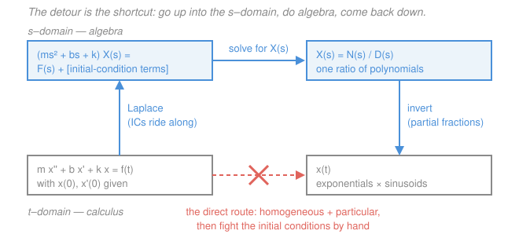

# Control Systems · Lesson 1.3: The Laplace transform toolkit

> ⏱ ~15 min · Module 1: Modeling & the Laplace transform · Builds on: [1.2 Modeling systems as ODEs](01-02-modeling-systems-as-odes.md), [`ode-refresher` 4.1](../../ode-refresher/lessons/04-01-laplace-transform.md), [`signals-systems` 2.4](../../signals-systems/lessons/02-04-laplace-transform-roc.md) · Unlocks: [1.4 Transfer functions, poles & zeros](01-04-transfer-functions-poles-zeros.md)

## Why this matters

Let's be honest about what this lesson is. You have met the Laplace transform twice already — once as an ODE-solving trick in [`ode-refresher` 4.1](../../ode-refresher/lessons/04-01-laplace-transform.md), and once properly, with the bilateral integral, the region of convergence, and pole geometry, in [`signals-systems` 2.4](../../signals-systems/lessons/02-04-laplace-transform-roc.md) and [2.6](../../signals-systems/lessons/02-06-solving-systems-with-laplace.md). **Nothing here re-derives that.** This is the *toolkit*: the table you'll reach for a hundred times, the two properties control actually leans on, and partial fractions drilled until it's reflex.

Why drill partial fractions specifically? Because every single thing downstream cashes out through it. Root locus ([3.1](03-01-root-locus-construction.md)) puts poles somewhere; partial fractions tells you what that *sounds like* in time. Second-order specs ([2.2](02-02-second-order-response.md)) — overshoot, settling time — are read off a damped sinusoid you got by completing the square. Steady-state error ([2.3](02-03-steady-state-error-system-type.md)) is one limit of $sX(s)$. If partial fractions is slow for you, every later lesson is slow.

Two scoping notes, stated plainly so you're not looking for them:

- **Control uses the *unilateral* transform**, $\int_{0^-}^{\infty}$, because hardware starts at a definite moment and we care what happens *after* we switch it on — and because the initial conditions of the flywheel, the capacitor, the tank are part of the problem.
- **We deliberately drop the ROC.** In signals it was essential (the same formula can describe two different signals). In control it is dead weight: every plant we model is causal and starts at rest or at a known state, so the ROC is always "right of the rightmost pole." One convention, never mentioned again.

## The idea

Differentiation is the enemy. It's the reason $m\ddot{x} + b\dot{x} + kx = f(t)$ from [1.2](01-02-modeling-systems-as-odes.md) is harder than $3x = 7$.

The Laplace transform is a **change of currency** that makes $\frac{d}{dt}$ into "multiply by $s$." Under that exchange rate a differential equation becomes a *polynomial* equation, which you solve by dividing. The catch is that your answer comes back as a ratio of polynomials $X(s)$, and no table has your exact ratio in it. So you shatter it into pieces that *are* in the table — one piece per pole. That shattering is partial fractions, and it is genuinely the whole job.

The picture to hold: it's a **detour**. The direct route (solve the ODE in the time domain) crosses hard terrain. The detour goes up into the $s$-domain, walks across flat algebra, and comes back down. And the detour has a bonus the direct route lacks: the initial conditions get swept up by the transform automatically, on line one, instead of being a separate linear-system fight at the end.

## The formal version

### The table

Everything below is the unilateral transform $X(s) = \int_{0^-}^{\infty} x(t)e^{-st}\,dt$, and every entry implicitly carries a $u(t)$ (the unit step: $0$ for $t<0$, $1$ for $t\ge 0$) — signals start when we switch them on.

| $x(t)$, $t\ge 0$ | $X(s)$ | where it shows up |
|---|---|---|
| $\delta(t)$ | $1$ | impulse test, hammer blow |
| $u(t)$ | $\dfrac{1}{s}$ | **the** standard test input |
| $t$ | $\dfrac{1}{s^2}$ | ramp reference (tracking a moving target) |
| $t^n$ | $\dfrac{n!}{s^{n+1}}$ | parabolic reference, $n=2$ |
| $e^{-at}$ | $\dfrac{1}{s+a}$ | first-order decay, time constant $\tau = 1/a$ |
| $t\,e^{-at}$ | $\dfrac{1}{(s+a)^2}$ | **repeated pole** — ramp-then-decay |
| $\sin\omega t$ | $\dfrac{\omega}{s^2+\omega^2}$ | undamped ring |
| $\cos\omega t$ | $\dfrac{s}{s^2+\omega^2}$ | undamped ring |
| $e^{-at}\sin\omega t$ | $\dfrac{\omega}{(s+a)^2+\omega^2}$ | ⭐ **underdamped response** |
| $e^{-at}\cos\omega t$ | $\dfrac{s+a}{(s+a)^2+\omega^2}$ | ⭐ **underdamped response** |

The last two starred rows are the ones this course actually runs on. A damped sinusoid $e^{-at}\sin\omega t$ *is* the overshoot-and-ring of a second-order system: $a$ sets how fast it dies, $\omega$ sets how fast it wiggles. Nearly every design question in [Module 2](../syllabus.md) is "where do I put $a$ and $\omega$?" Notice the pattern relating them to the two rows above: **replacing $s$ by $s+a$ in the transform multiplies the time function by $e^{-at}$.** That single rule (frequency shifting) generates the bottom half of the table from the top half — you don't have to memorize it twice.

### The three properties that earn their keep

**1. Linearity.** $\mathcal{L}\{\alpha f(t) + \beta g(t)\} = \alpha F(s) + \beta G(s)$. *In words: transforms add and scale like everything else.* This is what lets you break $X(s)$ into pieces at all.

**2. Differentiation with initial conditions.** This is the whole reason we're here.

$$\boxed{\;\mathcal{L}\{\dot{x}\} = sX(s) - x(0^-), \qquad \mathcal{L}\{\ddot{x}\} = s^2X(s) - s\,x(0^-) - \dot{x}(0^-)\;}$$

*In words: each derivative costs you a factor of $s$ and pays you back the initial conditions as subtracted constants.* Both follow from integrating by parts (done in [`ode-refresher` 4.1](../../ode-refresher/lessons/04-01-laplace-transform.md)). The notation $0^-$ means "an instant before the clock starts," which matters only if the input contains an impulse at $t=0$; write $x(0)$ and don't lose sleep.

The mirror-image rule, needed the moment we meet integral control in [4.1](04-01-pid-control.md):

$$\mathcal{L}\left\{\int_0^t x(\tau)\,d\tau\right\} = \frac{X(s)}{s}.$$

*In words: integrating divides by $s$, exactly as differentiating multiplies by it.*

**3. Time delay.** $\mathcal{L}\{x(t-T)\,u(t-T)\} = e^{-sT}X(s)$ for $T > 0$. *In words: shifting a signal $T$ seconds later multiplies its transform by $e^{-sT}$.* Flagged now because **dead time** is real and nasty — a temperature sensor 3 m downstream, a network hop, a conveyor belt — and $e^{-sT}$ is not a ratio of polynomials, so it breaks every polynomial method in this course. It eats phase margin for breakfast; it returns in [3.4](03-04-gain-and-phase-margins.md).

### Partial fractions, all three cases

Write $X(s) = N(s)/D(s)$. **First, check the degrees.** If $\deg N \ge \deg D$ the fraction is *improper* and you must long-divide first:

$$X(s) = \frac{s^2+4s+5}{s^2+3s+2} = 1 + \frac{s+3}{(s+1)(s+2)} = 1 + \frac{2}{s+1} - \frac{1}{s+2},$$

$$x(t) = \delta(t) + 2e^{-t} - e^{-2t}.$$

That leading constant is an **impulse** — a real physical statement: the output responds instantaneously to the input, with no lag at all. (Check the split: $\frac{2}{s+1} - \frac{1}{s+2} = \frac{2(s+2)-(s+1)}{(s+1)(s+2)} = \frac{s+3}{(s+1)(s+2)}$. ✓)

Now factor $D(s)$. Every root — every pole — contributes a term, and which term depends on which of three cases it falls into.

**Case (a) — distinct real poles: the cover-up method.** For $D(s) = (s-p_1)(s-p_2)\cdots$, write $X = \sum_k \frac{A_k}{s-p_k}$ with

$$A_k = \big[(s-p_k)X(s)\big]_{\,s=p_k}.$$

*In words: physically cover the factor you're solving for, then evaluate whatever is left at that pole.* Watch the covering — the blanked box is the factor your thumb is on — for $X(s) = \dfrac{10}{s(s+2)(s+5)}$:

$$A_1 = \frac{10}{\underline{\phantom{(s)}}\,(s+2)(s+5)}\bigg|_{s=0} = \frac{10}{(2)(5)} = 1,\qquad
A_2 = \frac{10}{s\,\underline{\phantom{(s+2)}}\,(s+5)}\bigg|_{s=-2} = \frac{10}{(-2)(3)} = -\frac{5}{3},$$

$$A_3 = \frac{10}{s\,(s+2)\,\underline{\phantom{(s+5)}}}\bigg|_{s=-5} = \frac{10}{(-5)(-3)} = \frac{2}{3}.$$

$$X(s) = \frac{1}{s} - \frac{5/3}{s+2} + \frac{2/3}{s+5} \;\Longrightarrow\; x(t) = 1 - \tfrac53 e^{-2t} + \tfrac23 e^{-5t}.$$

*Check:* $x(0) = 1 - \frac53 + \frac23 = 0$, and indeed $\lim_{s\to\infty} sX(s) = 0$. ✓

**Case (b) — repeated poles.** A pole of multiplicity $r$ at $s = -a$ needs $r$ terms, one for *every* power:

$$X(s) = \frac{A_1}{s+a} + \frac{A_2}{(s+a)^2} + \cdots + \frac{A_r}{(s+a)^r} + (\text{other poles}).$$

One term cannot do it — a single $\frac{A}{s+a}$ has one free constant and the numerator generally demands $r$. Cover-up gets the *highest* power; **differentiating gets the lower ones**:

$$A_{r-k} = \frac{1}{k!}\,\frac{d^k}{ds^k}\Big[(s+a)^r X(s)\Big]_{\,s=-a}, \qquad k = 0, 1, \dots, r-1.$$

*In words: multiply out the repeated factor, evaluate for the top coefficient, then differentiate once for the next one down, twice for the one below that (dividing by $k!$).* On $X(s) = \dfrac{s+3}{s(s+1)^2}$, with $\dfrac{A}{s} + \dfrac{A_1}{s+1} + \dfrac{A_2}{(s+1)^2}$:

- $A = \big[sX\big]_{s=0} = \dfrac{0+3}{(0+1)^2} = 3$ (ordinary cover-up).
- $(s+1)^2X(s) = \dfrac{s+3}{s}$, so $A_2 = \left[\dfrac{s+3}{s}\right]_{s=-1} = \dfrac{2}{-1} = -2$.
- $A_1 = \dfrac{d}{ds}\left[\dfrac{s+3}{s}\right]_{s=-1} = \dfrac{d}{ds}\left[1 + \dfrac{3}{s}\right]_{s=-1} = \left[-\dfrac{3}{s^2}\right]_{s=-1} = -3$.

$$X(s) = \frac{3}{s} - \frac{3}{s+1} - \frac{2}{(s+1)^2} \;\Longrightarrow\; x(t) = 3 - 3e^{-t} - 2t\,e^{-t}.$$

*Check:* recombine over $s(s+1)^2$: $3(s+1)^2 - 3s(s+1) - 2s = 3s^2+6s+3-3s^2-3s-2s = s+3$. ✓ Also $x(0)=0$ and $x(\infty)=3$, matching $\lim_{s\to 0}sX(s) = \frac{0+3}{1} = 3$. ✓ The $t\,e^{-t}$ term is the signature of a repeated pole.

**Case (c) — complex-conjugate pairs: complete the square, never split.** You *could* treat $-2 \pm 3j$ as two distinct poles and chase complex residues. Don't. It is arithmetic misery and you end up reassembling $e^{(-2+3j)t}$ terms into a real answer anyway. Instead keep the quadratic whole, **complete the square**, and match the two starred table rows.

Completing the square is where readers stall, so here it is one step at a time on $s^2 + 6s + 25$:

1. Take half the coefficient of $s$: $\;6/2 = 3$.
2. That's your shift: the square is $(s+3)^2 = s^2+6s+9$.
3. Fix the constant: $s^2+6s+25 = (s^2+6s+9) + 16 = (s+3)^2 + 16$.
4. Read off: $(s+3)^2 + 4^2$, so $a = 3$ (decay rate) and $\omega = 4$ (ring frequency). The poles are $s = -3 \pm 4j$.

Now the numerator has to speak the same language — it must be rewritten in terms of $(s+3)$. For $X(s) = \dfrac{2s+10}{s^2+6s+25}$, split $2s+10 = 2(s+3) + 4$. The cosine row wants $(s+3)$ upstairs (we have $2$ of those); the sine row wants a bare $\omega = 4$ upstairs (we have exactly $4$, so its coefficient is $4/4 = 1$):

$$X(s) = 2\cdot\underbrace{\frac{s+3}{(s+3)^2+4^2}}_{\to\; e^{-3t}\cos 4t} \;+\; 1\cdot\underbrace{\frac{4}{(s+3)^2+4^2}}_{\to\; e^{-3t}\sin 4t} \;\Longrightarrow\; x(t) = e^{-3t}\big(2\cos 4t + \sin 4t\big).$$

*In words: the real part of the pole sets the decay envelope, the imaginary part sets the ringing frequency, and the numerator split sets how much cosine versus sine.* No complex number was ever written down.

*Check:* $x(0) = 2$, and $\lim_{s\to\infty} sX(s) = \lim \frac{2s^2+10s}{s^2+6s+25} = 2$. ✓ Differentiate back: $\dot{x} = e^{-3t}(-2\cos 4t - 11\sin 4t)$, so $\dot{x}(0) = -2$; from the transform, $\dot{x}(0^+) = \lim_{s\to\infty} s\big(sX - x(0)\big) = \lim \frac{s(-2s-50)}{s^2+6s+25} = -2$. ✓

### Final value theorem — and its teeth

$$\boxed{\;x(\infty) = \lim_{s\to 0} s\,X(s)\;}\qquad\textbf{only if all poles of } sX(s) \textbf{ lie strictly in the left half-plane.}$$

*In words: where a signal ends up can be read straight off its transform, without inverting anything — provided the signal actually settles somewhere.* This one line is the entire engine of [2.3 Steady-state error](02-03-steady-state-error-system-type.md), where you ask "how far off is the output forever?" and answer it with a limit instead of a time solution.

The condition is not fine print. See **Watch out** — the theorem does not fail loudly, it fails *confidently*.

## Picture

The diagram *commutes*: both routes reach the same $x(t)$. You take the top one because every leg of it is mechanical — transform by table, solve by dividing, invert by partial fractions — while the bottom leg requires cleverness and then a separate skirmish with the initial conditions.

## Worked examples

**Example 1 (the full pipeline, with the initial conditions carried along).** Take the mass–spring–damper of [1.2](01-02-modeling-systems-as-odes.md) with $m = 1$ kg, $b = 3$ N·s/m, $k = 2$ N/m:

$$\ddot{x} + 3\dot{x} + 2x = f(t).$$

Apply a step force $f(t) = 2u(t)$ newtons to a cart that is **not** at rest: it starts displaced at $x(0) = 1$ m and already moving at $\dot{x}(0) = 2$ m/s.

*Step 1 — transform.* Using $\mathcal{L}\{\ddot{x}\} = s^2X - sx(0) - \dot{x}(0)$ and $\mathcal{L}\{\dot{x}\} = sX - x(0)$:

$$\big[s^2X - s(1) - 2\big] + 3\big[sX - 1\big] + 2X = \frac{2}{s}.$$

*Step 2 — algebra.* Collect $X$ on the left, junk on the right:

$$(s^2+3s+2)X(s) = \frac{2}{s} + s + 5 \;\Longrightarrow\; X(s) = \frac{s^2+5s+2}{s(s+1)(s+2)},$$

factoring $s^2+3s+2 = (s+1)(s+2)$. Notice what just happened: the $s + 5$ on the right is *pure initial condition*, and it arrived without being asked for. No separate step, no system in $c_1, c_2$.

*Step 3 — partial fractions (case (a), cover-up).*

$$A_0 = \frac{2}{(1)(2)} = 1,\qquad A_1 = \frac{1-5+2}{(-1)(1)} = \frac{-2}{-1} = 2,\qquad A_2 = \frac{4-10+2}{(-2)(-1)} = \frac{-4}{2} = -2.$$

$$X(s) = \frac{1}{s} + \frac{2}{s+1} - \frac{2}{s+2} \;\Longrightarrow\; \boxed{\,x(t) = 1 + 2e^{-t} - 2e^{-2t}\,}$$

*Checks — three of them, all independent.*
- Initial position: $x(0) = 1 + 2 - 2 = 1$ ✓ (matches the given $x(0) = 1$).
- Initial velocity: $\dot{x} = -2e^{-t} + 4e^{-2t}$, so $\dot{x}(0) = -2+4 = 2$ ✓ (matches the given $\dot{x}(0)=2$).
- Final value: $\lim_{s\to 0} sX(s) = \frac{2}{(1)(2)} = 1$ m, and physically the spring must eventually balance the force, $kx = f \Rightarrow x = 2/2 = 1$ m ✓. Legal, since the poles of $sX(s)$ are $-1$ and $-2$, both in the left half-plane.

That the initial conditions *come back out correctly at the end* is the practical selling point. You never handled them; the transform did.

**Example 2 (the control payoff — an answer with no inversion at all).** A unity-feedback loop has plant $G(s) = \dfrac{10}{(s+1)(s+5)}$ and reference $r(t) = u(t)$, so $R(s) = 1/s$. How far off is the output *forever*?

The error transform for unity feedback is $E(s) = \dfrac{R(s)}{1+G(s)}$ (you'll derive this in [1.5](01-05-block-diagram-algebra.md)):

$$E(s) = \frac{1}{s}\cdot\frac{1}{1 + \frac{10}{(s+1)(s+5)}} = \frac{1}{s}\cdot\frac{(s+1)(s+5)}{(s+1)(s+5)+10} = \frac{(s+1)(s+5)}{s\,(s^2+6s+15)}.$$

Before applying the theorem, **check legality**: the poles of $sE(s)$ are the roots of $s^2+6s+15$, namely $s = -3 \pm j\sqrt{6}$ — both strictly left half-plane. ✓ Now:

$$e(\infty) = \lim_{s\to 0} sE(s) = \frac{(1)(5)}{15} = \frac{1}{3}.$$

One-third of the reference, forever. No partial fractions, no inversion, no time solution — and the answer is a *design verdict*: proportional gain alone will never make this plant track a step exactly. (Sanity: $e(\infty) = 1/(1+K_p)$ with $K_p = G(0) = 10/5 = 2$, giving $1/3$ ✓. That formula is [2.3](02-03-steady-state-error-system-type.md)'s whole subject.)

## Watch out

- **You might think the final value theorem always works.** It doesn't, and its failure mode is vicious: it returns a clean, confident, *wrong* number. Take $X(s) = \frac{3}{(s-1)(s+2)}$. Then $\lim_{s\to 0} sX(s) = 0$ — but the actual signal is $x(t) = e^{t} - e^{-2t}$, which explodes. The RHP pole at $s = +1$ makes the theorem inapplicable, and nothing in the arithmetic warns you. Same trap with $X(s) = \frac{\omega}{s^2+\omega^2}$: the limit says $0$, the signal is $\sin\omega t$ and never settles. **Always look at the poles before you take the limit.** On an unstable or marginally stable closed loop, "steady-state error" is a meaningless question.
- **You might try to cover-up a repeated pole.** Covering the factor $(s+1)$ in $\frac{s+3}{s(s+1)^2}$ leaves $\frac{s+3}{s(s+1)}$, which is infinite at $s=-1$ — the method just breaks. Multiply by the *full* power $(s+1)^2$, and get the lower coefficients by differentiating. Skipping the lower-power terms entirely is the more common error, and it silently gives a wrong answer that still looks plausible.
- **You might forget to make the numerator speak in $(s+a)$.** After completing the square to $(s+3)^2+16$, a numerator left as $2s+10$ matches nothing in the table. It must be rewritten as $2(s+3)+4$. The cosine row needs $(s+a)$ on top; the sine row needs a bare $\omega$ on top — scale to make it so.
- **You might drop the initial conditions when the problem says "at rest."** That's fine, and it's the standard case for a transfer function ([1.4](01-04-transfer-functions-poles-zeros.md) *defines* $G(s)$ with zero initial conditions). But "at rest" must be stated or assumed deliberately — silently zeroing a nonzero $\dot{x}(0)$ deletes a real transient.

## One-liner

> Transform to kill the derivatives, divide to solve, then shatter the answer into table pieces — cover-up for simple poles, differentiate for repeated ones, complete the square for complex ones — and the initial conditions ride along for free.

## Problems

**P1 (🟢)** Invert $X(s) = \dfrac{3s+11}{(s+1)(s+3)}$ using the cover-up method. Verify your answer with the initial value theorem $x(0^+) = \lim_{s\to\infty} sX(s)$.

**P2 (🟡)** A closed loop obeys $\ddot{y} + 4\dot{y} + 13y = 26\,u(t)$, starting from rest ($y(0) = \dot{y}(0) = 0$). Find $y(t)$. Verify both initial conditions and the final value.

**P3 (🔴)** (a) Invert $X(s) = \dfrac{s+4}{s^2(s+2)}$. (b) A colleague applies the final value theorem to $Z(s) = \dfrac{3}{(s-1)(s+2)}$ and reports $z(\infty) = 0$. Find $z(t)$ and explain, in one sentence, what went wrong and how you'd have caught it from $Z(s)$ alone.

Solutions

**P1** Two distinct real poles, $s = -1$ and $s = -3$. Cover up each factor in turn and evaluate the rest at that pole:

$$A_1 = \left[\frac{3s+11}{s+3}\right]_{s=-1} = \frac{-3+11}{2} = \frac{8}{2} = 4, \qquad A_2 = \left[\frac{3s+11}{s+1}\right]_{s=-3} = \frac{-9+11}{-2} = \frac{2}{-2} = -1.$$

$$X(s) = \frac{4}{s+1} - \frac{1}{s+3} \;\Longrightarrow\; x(t) = 4e^{-t} - e^{-3t}.$$

*Check 1 (recombine).* $\dfrac{4(s+3) - (s+1)}{(s+1)(s+3)} = \dfrac{4s+12-s-1}{(s+1)(s+3)} = \dfrac{3s+11}{(s+1)(s+3)}$ ✓.

*Check 2 (initial value).* $\lim_{s\to\infty} sX(s) = \lim_{s\to\infty}\dfrac{3s^2+11s}{s^2+4s+3} = 3$, and directly $x(0) = 4 - 1 = 3$ ✓.

**P2** Transform with zero initial conditions, so $\mathcal{L}\{\ddot{y}\} = s^2Y$ and $\mathcal{L}\{\dot{y}\} = sY$, and $\mathcal{L}\{26u(t)\} = 26/s$:

$$(s^2+4s+13)\,Y(s) = \frac{26}{s} \;\Longrightarrow\; Y(s) = \frac{26}{s\,(s^2+4s+13)}.$$

The quadratic has complex roots (discriminant $16 - 52 = -36 < 0$), so keep it whole. Write

$$Y(s) = \frac{A}{s} + \frac{Bs+C}{s^2+4s+13}.$$

Cover-up gives $A = \left[\dfrac{26}{s^2+4s+13}\right]_{s=0} = \dfrac{26}{13} = 2$. Clear denominators:

$$26 = 2(s^2+4s+13) + (Bs+C)s = (2+B)s^2 + (8+C)s + 26.$$

Matching coefficients: $B = -2$, $C = -8$. So $Y(s) = \dfrac{2}{s} - \dfrac{2s+8}{s^2+4s+13}$.

Complete the square: half of $4$ is $2$, so $s^2+4s+13 = (s+2)^2 + 9 = (s+2)^2 + 3^2$ — decay rate $2$, ring frequency $3$ rad/s, poles at $-2 \pm 3j$. Rewrite the numerator in $(s+2)$: $\;2s+8 = 2(s+2) + 4$. The sine row needs $\omega = 3$ on top, so write $4 = \tfrac43\cdot 3$:

$$Y(s) = \frac{2}{s} - \frac{2(s+2)}{(s+2)^2+3^2} - \frac{4}{3}\cdot\frac{3}{(s+2)^2+3^2}$$

$$\Longrightarrow\quad y(t) = 2 - e^{-2t}\left(2\cos 3t + \tfrac{4}{3}\sin 3t\right).$$

*Check 1 (initial position).* $y(0) = 2 - (2 + 0) = 0$ ✓.

*Check 2 (initial velocity).* Differentiate:
$$\dot{y} = 2e^{-2t}\left(2\cos 3t + \tfrac43\sin 3t\right) - e^{-2t}\left(-6\sin 3t + 4\cos 3t\right) = e^{-2t}\left[(4-4)\cos 3t + \left(\tfrac83+6\right)\sin 3t\right] = \tfrac{26}{3}e^{-2t}\sin 3t.$$
So $\dot{y}(0) = 0$ ✓. (Bonus: this also confirms the ODE — substituting $y, \dot{y}, \ddot{y}$ into $\ddot{y}+4\dot{y}+13y$ cancels every cosine and sine term and leaves exactly $26$.)

*Check 3 (final value).* Poles of $sY(s)$ are $-2\pm 3j$, strictly LHP, so the theorem is legal: $\lim_{s\to 0}sY(s) = 26/13 = 2$, matching $y(\infty) = 2$ since the exponential dies ✓.

**P3 (a)** The pole at $s=0$ is *repeated* (multiplicity 2), so it needs both powers:

$$X(s) = \frac{A_1}{s} + \frac{A_2}{s^2} + \frac{C}{s+2}.$$

Multiply by the full power: $s^2X(s) = \dfrac{s+4}{s+2}$. Then

$$A_2 = \left[\frac{s+4}{s+2}\right]_{s=0} = \frac{4}{2} = 2, \qquad A_1 = \frac{d}{ds}\left[\frac{s+4}{s+2}\right]_{s=0} = \left[\frac{(s+2)-(s+4)}{(s+2)^2}\right]_{s=0} = \frac{-2}{4} = -\frac12,$$

and ordinary cover-up on the simple pole: $C = \left[\dfrac{s+4}{s^2}\right]_{s=-2} = \dfrac{2}{4} = \dfrac12$. Therefore

$$X(s) = -\frac{1/2}{s} + \frac{2}{s^2} + \frac{1/2}{s+2} \;\Longrightarrow\; x(t) = -\tfrac12 + 2t + \tfrac12 e^{-2t}.$$

*Check (recombine over $s^2(s+2)$):* $-\tfrac12 s(s+2) + 2(s+2) + \tfrac12 s^2 = -\tfrac12 s^2 - s + 2s + 4 + \tfrac12 s^2 = s+4$ ✓. Also $x(0) = -\tfrac12 + \tfrac12 = 0$, agreeing with $\lim_{s\to\infty}sX(s) = \lim \frac{s+4}{s(s+2)} = 0$ ✓. The double pole at the origin produced the ramp $2t$ — the signal grows forever, exactly as $\frac{2}{s^2}\leftrightarrow 2t$ predicts.

**(b)** Cover-up on $Z(s) = \dfrac{3}{(s-1)(s+2)}$: $\;A_1 = \left[\dfrac{3}{s+2}\right]_{s=1} = 1$ and $A_2 = \left[\dfrac{3}{s-1}\right]_{s=-2} = \dfrac{3}{-3} = -1$, so

$$z(t) = e^{t} - e^{-2t},$$

which grows without bound. The theorem's limit, $\lim_{s\to 0}\frac{3s}{(s-1)(s+2)} = 0$, is simply not applicable: $sZ(s)$ has a pole at $s = +1$, in the **right** half-plane, so the final value theorem's hypothesis fails and its output is meaningless. Catching it needs nothing but a glance at the denominator — factor $D(s)$ and confirm every root has a negative real part *before* taking the limit. This is why [2.3](02-03-steady-state-error-system-type.md) always checks stability first, and why [2.4](02-04-stability-routh-hurwitz.md) exists.

## Flashback

**From Lesson 1.2 (Modeling systems as ODEs):** A series RLC circuit has $L = 0.5$ H, $R = 4\ \Omega$, and $C = 0.05$ F, driven by a source voltage $v_{\text{in}}(t)$. The output is the **capacitor voltage** $v_C(t)$. Write the governing ODE in $v_C$ alone, and name the mass–spring–damper element each of $L$, $R$, $1/C$ plays. (Fresh variant — a circuit, and the output is the capacitor voltage rather than the current.)

Solution

KVL around the single loop: the source drives the drops across inductor, resistor, and capacitor, with the same current $i$ through all three:

$$L\frac{di}{dt} + Ri + v_C = v_{\text{in}}.$$

The capacitor relation ties the current to the output: $i = C\dfrac{dv_C}{dt}$. Substituting (and $\frac{di}{dt} = C\ddot{v}_C$):

$$LC\,\ddot{v}_C + RC\,\dot{v}_C + v_C = v_{\text{in}}.$$

With the numbers, $LC = (0.5)(0.05) = 0.025$ and $RC = (4)(0.05) = 0.2$:

$$0.025\,\ddot{v}_C + 0.2\,\dot{v}_C + v_C = v_{\text{in}} \qquad\Longleftrightarrow\qquad \ddot{v}_C + 8\dot{v}_C + 40\,v_C = 40\,v_{\text{in}}.$$

**Force–voltage analogy:** compare with $m\ddot{x} + b\dot{x} + kx = f$. Here $L$ plays the **mass** (inertia — current resists changing), $R$ plays the **damper** (dissipation), and $1/C$ plays the **spring stiffness** (energy stored proportional to displacement/charge). Voltage plays force, and charge plays displacement.

*Check.* Divide-through arithmetic: $0.2/0.025 = 8$ ✓ and $1/0.025 = 40$ ✓. Dimensional sanity: at DC ($\dot{v}_C = \ddot{v}_C = 0$) the equation gives $v_C = v_{\text{in}}$ — correct, since a capacitor blocks steady current and takes the full source voltage. And this course's next step: transform it, and you get $(s^2+8s+40)V_C = 40V_{\text{in}}$, poles at $s = -4 \pm j\sqrt{24}$ — underdamped, which is exactly case (c) territory.

## Connections

- **Backward:** [1.2](01-02-modeling-systems-as-odes.md) produced ODEs; this lesson makes them algebra. The mechanics of the transform itself come from [`ode-refresher` 4.1](../../ode-refresher/lessons/04-01-laplace-transform.md), and the deeper theory — bilateral transform, ROC, why poles live where they do — is [`signals-systems` 2.4](../../signals-systems/lessons/02-04-laplace-transform-roc.md) and [2.5](../../signals-systems/lessons/02-05-transfer-functions-poles-zeros.md), deliberately not repeated here.
- **Forward:** [1.4](01-04-transfer-functions-poles-zeros.md) zeroes the initial conditions and keeps only $G(s) = Y(s)/U(s)$ — the transform's real gift to control. [2.1](02-01-first-order-response.md) and [2.2](02-02-second-order-response.md) are nothing but the case-(a) and case-(c) inversions of this lesson, given engineering names ($\tau$, $\zeta$, $\omega_n$). [2.3](02-03-steady-state-error-system-type.md) is the final value theorem and nothing else.
- **Sideways:** the same $e^{-at}\cos\omega t$ pair describes the RLC ringdown of [`circuits` 3.3](../../circuits/lessons/03-03-second-order-rlc.md) and the damped oscillator of [`mechanics-refresher` 3.2](../../mechanics-refresher/lessons/03-02-damped-driven-oscillations.md) — one transform pair, three subjects. And completing the square here is the identical algebraic move you make to find the vertex of a parabola or to normalize a Gaussian.
