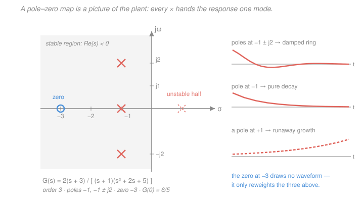
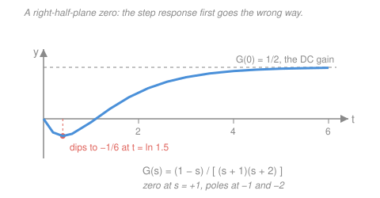

# Control Systems · Lesson 1.4: Transfer functions, poles & zeros

> ⏱ ~15 min · Module 1: Modeling & the Laplace transform · Builds on: [1.2 Modeling systems as ODEs](01-02-modeling-systems-as-odes.md), [1.3 The Laplace transform toolkit](01-03-laplace-transform-toolkit.md) · Unlocks: [1.5 Block-diagram algebra](01-05-block-diagram-algebra.md) and every technique in Modules 2–4

## Why this matters

In [1.2](01-02-modeling-systems-as-odes.md) you turned hardware into an ODE. In [1.3](01-03-laplace-transform-toolkit.md) you turned an ODE into algebra. This lesson names the object that falls out and it is the object this entire course manipulates: the **plant transfer function** $G(s)$ — the thing you are about to wrap a feedback loop around.

Two payoffs. First, $G(s)$ is a *component*: it plugs into a block diagram, gets multiplied by a controller, gets buried in a feedback formula, and comes back out as a closed-loop transfer function ([1.5](01-05-block-diagram-algebra.md)). Second, and bigger — its denominator, set to zero, is the **characteristic equation**, and every graphical trick, stability test, and design method you will meet from here on is a different way of asking *where are that polynomial's roots, and how do I move them?*

`signals-systems` [2.5](../../signals-systems/lessons/02-05-transfer-functions-poles-zeros.md) already derives poles-as-modes and the geometric "distances to poles and zeros" reading of the magnitude response, in depth. Rather than repeat it, this lesson states what you need compactly, links there for the full treatment, and spends its budget on the control-specific vocabulary — DC gain, order, type, properness, relative degree, non-minimum phase — that Modules 2 and 3 assume you already own.

## The idea

A transfer function is a **contract between the input and the output, written as one fraction**. Feed the system a signal, take the Laplace transform of what comes out, divide by the Laplace transform of what went in, and the messy time-domain convolution collapses into a single ratio $G(s) = Y(s)/X(s)$ that no longer mentions the input at all. It is a property of the *machine*, not of what you do to it.

That fraction is always one polynomial over another, and the two polynomials play completely different roles.

- The **denominator** is the machine's biography. Its roots — the **poles** — are the behaviors the system produces *when left alone*: exponentials that decay or blow up, ringing that dies or grows. You inherit them from the hardware and you spend the rest of this course fighting to relocate them.
- The **numerator** is the machine's editorial policy. Its roots — the **zeros** — create no behaviors of their own. They decide *how loudly each pole's behavior shows up*, and they can silence particular input frequencies entirely.

Poles are what the system *can* do. Zeros are what it *lets through*. Confusing the two is the most common way to misread a plant.

## The formal version

### Definition, and the zero-initial-condition clause

For a linear time-invariant system with input $x(t)$ and output $y(t)$,

$$\boxed{\;G(s) \;=\; \frac{Y(s)}{X(s)}\;\Big|_{\text{all initial conditions}\,=\,0}\;}$$

where $s = \sigma + j\omega$ is complex frequency and $X(s), Y(s)$ are the Laplace transforms from [1.3](01-03-laplace-transform-toolkit.md). *In words: the transfer function is the output-to-input ratio in the $s$-domain, computed as though the system started from rest.*

**Why that clause is legitimate, not a cheat.** Linearity splits the total response exactly in two:

$$y(t) \;=\; \underbrace{y_{\text{zi}}(t)}_{\text{from the initial conditions, input off}} \;+\; \underbrace{y_{\text{zs}}(t)}_{\text{from the input, starting at rest}}$$

*In words: what the system was already doing, plus what your input made it do.* The transfer function captures the second piece, the **forced (zero-state) response** — which is the only piece you have any control over, so it is the piece you design with. Two facts make the split harmless:

1. **Nothing is hidden.** $y_{\text{zi}}$ is built from the *same* modes as $y_{\text{zs}}$ — the roots of the ODE's homogeneous characteristic polynomial *are* the roots of $G$'s denominator. So $G(s)$'s poles describe both halves.
2. **For a stable plant it evaporates.** Every mode decays, so $y_{\text{zi}} \to 0$ and the two responses merge within a few time constants.

[1.3](01-03-laplace-transform-toolkit.md) already handled the initial-condition-carrying case, where the differentiation rule contributes extra $y(0)$ and $\dot y(0)$ terms. Those terms are real and they matter when you simulate a specific run; they just do not belong in a *model of the machine*.

### Getting $G(s)$ from an ODE by inspection

With zero initial conditions the differentiation rule is $\dfrac{d^k}{dt^k} \leftrightarrow s^k$. So you do not "take a Laplace transform" — you **replace every $d/dt$ with $s$** and read off the fraction. Take the mass–spring–damper from [1.2](01-02-modeling-systems-as-odes.md): mass $m$ (kg), damping $b$ (N·s/m), spring constant $k$ (N/m), input force $f(t)$ (N), output displacement $x(t)$ (m):

$$m\ddot x + b\dot x + kx = f(t)
\;\;\xrightarrow{\;d/dt\,\to\,s\;}\;\;
(ms^2 + bs + k)\,X(s) = F(s),
\qquad
G(s) = \frac{X(s)}{F(s)} = \frac{1}{ms^2 + bs + k}.$$

Units of $G$ here are meters per newton — a transfer function carries units whenever input and output are different physical quantities.

**The course's running plant.** Boss problem 1 of the [syllabus](../syllabus.md) sets $m = 1$, $b = 3$, $k = 2$:

$$G(s) = \frac{1}{s^2 + 3s + 2} = \frac{1}{(s+1)(s+2)}.$$

*Factoring check:* $(s+1)(s+2) = s^2 + 2s + s + 2 = s^2 + 3s + 2$. Correct. Equivalently, the quadratic formula gives $s = \frac{-3 \pm \sqrt{9-8}}{2} = \frac{-3 \pm 1}{2} = \{-1,\,-2\}$.

So: **poles at $s = -1$ and $s = -2$; no finite zeros** (the numerator is the constant $1$, which has no roots). Both poles are real and negative, so this cart is stable and does not ring — it just slumps toward its new resting place as $Ae^{-t} + Be^{-2t}$.

### Poles, zeros, and the map

Factor both polynomials:

$$G(s) = K\,\frac{(s-z_1)\cdots(s-z_m)}{(s-p_1)\cdots(s-p_n)}.$$

**Zeros** $z_i$ are the numerator's roots, where $G(z_i) = 0$. **Poles** $p_k$ are the denominator's roots, where $|G(s)| \to \infty$. **Plot convention: poles are $\times$, zeros are $\circ$.** Real coefficients force complex poles and zeros into conjugate pairs, so every map is mirror-symmetric about the real axis.

Each pole contributes one term to the response. Compactly:

$$\text{pole at } s = \sigma \pm j\omega \;\longrightarrow\; \text{mode }\; e^{\sigma t}\cos(\omega t + \phi).$$

| Pole location | Mode it contributes |
|---|---|
| Real, left half ($\sigma<0$, $\omega=0$) | decaying exponential $e^{\sigma t}$ |
| Complex pair, left half | damped ringing $e^{\sigma t}\cos(\omega t+\phi)$ |
| On the $j\omega$ axis | sustained oscillation (or a constant, at the origin) |
| Anywhere in the right half | growth — the system runs away |

Horizontal position sets how fast the mode dies (time constant $\tau = 1/|\sigma|$); vertical position sets how fast it wiggles. **A causal LTI system is stable exactly when every pole has $\mathrm{Re}\{p_k\} < 0$.** For the derivation of the mode table, the region-of-convergence subtleties behind that stability rule, and the ruler-and-distances reading of $|G(j\omega)|$, see `signals-systems` [2.5](../../signals-systems/lessons/02-05-transfer-functions-poles-zeros.md) — we take all of it as given and use it.

### The characteristic equation — the object this course is about

Write $G(s) = N(s)/D(s)$. Then

$$\boxed{\,D(s) = 0\,}$$

is the **characteristic equation**, and $D(s)$ the **characteristic polynomial**. For the running plant it is $s^2 + 3s + 2 = 0$. *In words: the equation whose roots are the poles.*

This deserves more than a definition, because **every remaining technique in this course is a different way of interrogating or relocating the roots of a characteristic equation.** Look at what is coming:

- [2.4 Routh–Hurwitz](02-04-stability-routh-hurwitz.md) asks *are all the roots in the left half-plane?* — and answers without ever solving for them.
- [3.1 Root locus](03-01-root-locus-construction.md) asks *where do the roots travel as I turn up the gain?* — and draws their trajectories.
- [3.3 Bode](03-03-frequency-response-bode-plots.md) and [3.5 Nyquist](03-05-nyquist-criterion.md) ask the same root question from the frequency response, without factoring anything.
- [4.1 PID](04-01-pid-control.md) and [4.3 lead/lag](04-03-lead-lag-compensators.md) *add* poles and zeros in order to drag the closed-loop roots somewhere better.
- [5.4 Pole placement](05-04-pole-placement-observers.md) skips the negotiation: pick the roots you want and solve for the feedback gains that produce them.

And the twist that makes control a subject rather than an analysis exercise: once the plant sits inside a unity-feedback loop with controller $G_c(s)$, the closed loop is $T(s) = \dfrac{G_c G}{1 + G_c G}$ ([1.5](01-05-block-diagram-algebra.md)), so the characteristic equation becomes

$$1 + G_c(s)G(s) = 0.$$

The plant's poles are no longer the system's poles. **Feedback moves them** — that is the whole promise of [1.1](01-01-feedback-and-the-control-problem.md), stated algebraically.

### DC gain

Set $s = 0$. **The DC gain is $G(0)$**, and it is the steady-state output for a unit step input. Proof, via the final value theorem from [1.3](01-03-laplace-transform-toolkit.md): a unit step has $X(s) = 1/s$, so

$$y_{\infty} = \lim_{t\to\infty} y(t) = \lim_{s\to 0} s\,Y(s) = \lim_{s\to 0} s\,G(s)\frac{1}{s} = G(0).$$

*In words: push with a constant input forever, and the output settles at $G(0)$ times that input.* For the running plant,

$$G(0) = \frac{1}{0 + 0 + 2} = \frac{1}{2}\ \text{m/N}.$$

**Sanity check against physics**, which is exactly why this is the first number you compute on any plant model: at steady state the cart is not moving and not accelerating, so $\dot x = \ddot x = 0$ and the ODE collapses to $kx = f$, giving $x = f/k = 1/2$ m for $f = 1$ N. The DC gain of a mass–spring–damper is $1/k$ — mass and damping are irrelevant once the motion stops. If your $G(0)$ disagrees with the static physics, you made an algebra error; catch it here, before it poisons a whole design.

DC gain is also the seed of accuracy. In [2.3](02-03-steady-state-error-system-type.md) the steady-state error of a unity-feedback loop to a step is $e_{ss} = \dfrac{1}{1 + K_p}$ with position error constant $K_p = \lim_{s\to 0} G_c(s)G(s)$ — a DC gain of the whole forward path. Big DC gain, small error.

### Vocabulary Modules 2–3 will assume

Let $n = \deg D$ and $m = \deg N$.

- **Order** $= n$, the degree of the denominator — the number of poles, and the number of energy-storing elements in the physical model. The running plant is **second order** (a mass stores kinetic energy, a spring stores potential energy).
- **Type** $=$ the number of poles at the origin, i.e. the power of $s$ you can factor out of $D(s)$. The running plant is **type 0**. A pole at the origin is a pure integrator, and type is what [2.3](02-03-steady-state-error-system-type.md) uses to classify which inputs a loop can track with zero error.
- **Proper**: $m \le n$. **Strictly proper**: $m < n$. Our plant has $m = 0 < n = 2$, so strictly proper.
- **Relative degree** $r = n - m$ — here $r = 2$.

**Why improper transfer functions never occur physically.** If $m > n$, long division leaves a polynomial part in $s$: terms like $s$, meaning $y = \dot x$, a **pure differentiator**. Two objections, both fatal. Its gain $|j\omega|$ grows without bound, so it amplifies high-frequency measurement noise infinitely — and noise always lives up there. And it is non-causal: an exact derivative at time $t$ needs to know the signal *just after* $t$. Real hardware refuses. This is why practical derivative action in [4.1](04-01-pid-control.md) is never $K_D s$ but a filtered $\dfrac{K_D s}{\tau s + 1}$, which is proper.

**What relative degree buys you.** At high frequency the leading terms dominate, so $|G(j\omega)| \sim \left|\frac{b_m}{a_n}\right|\omega^{-r}$: **the gain rolls off like $\omega^{-r}$**. For our plant, $r = 2$ means the response falls like $1/\omega^2$ — shake the cart fast and it barely moves, because the mass cannot keep up. The same $r$ counts the branches of the root locus that fly off to infinity, and the number of asymptotes guiding them ([3.1](03-01-root-locus-construction.md)).

### Zeros are not small poles

Poles create modes. Zeros do not — they **reweight** modes and can **block** frequencies. Concretely, compare two plants with identical poles:

$$G_a(s) = \frac{1}{(s+1)(s+2)}, \qquad G_b(s) = \frac{s + 1.5}{(s+1)(s+2)}.$$

Partial fractions give the residue on each mode. For $G_a$: at $s=-1$, $\frac{1}{-1+2} = 1$; at $s=-2$, $\frac{1}{-2+1} = -1$, so $g_a(t) = e^{-t} - e^{-2t}$. For $G_b$: at $s=-1$, $\frac{-1+1.5}{-1+2} = 0.5$; at $s=-2$, $\frac{-2+1.5}{-2+1} = 0.5$, so $g_b(t) = 0.5e^{-t} + 0.5e^{-2t}$. *Same two modes, same decay rates, completely different mixture* — one is a difference that starts at zero and humps, the other a sum that starts at 1 and slumps. Slide the zero all the way onto a pole and that mode's residue hits zero: the mode is still in the hardware, but the input can no longer excite it. And a zero sitting on the $j\omega$ axis at $\pm j\omega_0$ makes $|G(j\omega_0)| = 0$ exactly — that frequency is annihilated.

**Non-minimum phase.** A zero in the **right** half-plane is called a **non-minimum-phase zero**, and it has an unmistakable signature: **the step response initially moves the wrong way.** Take $G(s) = \dfrac{1-s}{(s+1)(s+2)}$, a stable plant (poles $-1, -2$) with a zero at $s = +1$. Its unit-step response works out to $y(t) = \tfrac12 - 2e^{-t} + \tfrac32 e^{-2t}$, which starts at $0$ with slope $\dot y(0) = 2 - 3 = -1 < 0$, dips to exactly $-\tfrac16$ at $t = \ln 1.5 \approx 0.405$ s, and only then climbs to its DC gain of $+\tfrac12$. Ask for "up" and you first get "down."

This makes control genuinely harder, not merely annoying: a feedback loop watching the output sees the initial dip as *error in the wrong direction* and pushes harder, which deepens the dip. RHP zeros therefore impose a hard ceiling on usable loop gain and closed-loop speed — you cannot out-tune them, and no controller can cancel one (cancelling would require an unstable pole in the controller). Real examples: the altitude of an aircraft just after the elevator deflects, the level in a boiler drum when you add cold feedwater, and a bicycle steered into a turn.

## Picture

## Worked examples

**Example 1 (the boss plant, end to end).** Cart with $m=1$ kg, $b=3$ N·s/m, $k=2$ N/m, input force $f$, output displacement $x$.

$$\ddot x + 3\dot x + 2x = f \;\Longrightarrow\; G(s) = \frac{1}{s^2+3s+2} = \frac{1}{(s+1)(s+2)}.$$

Read the whole system off without solving a single differential equation:

| Question | Answer | Where it came from |
|---|---|---|
| Poles | $-1$, $-2$ | roots of $s^2+3s+2$ |
| Zeros | none (finite) | numerator is a constant |
| Characteristic equation | $s^2+3s+2=0$ | denominator set to zero |
| Order / type | 2 / 0 | $\deg D = 2$; no pole at origin |
| Properness | strictly proper, $r=2$ | $m=0 < n=2$ |
| Stable? | yes | both poles have $\mathrm{Re} < 0$ |
| Rings? | no | both poles real, $\omega = 0$ |
| Settling scale | $\tau = 1$ s from the slower pole at $-1$; essentially done by $4\tau = 4$ s | rightmost pole dominates |
| DC gain | $G(0) = 1/2$ m/N | $1/k$, matching statics |

**Example 2 (a plant with a zero, and what changes).** A DC motor driving a load through a flexible shaft is modeled as

$$G(s) = \frac{10(s+4)}{s(s+2)(s+10)}.$$

*Poles:* $s = 0,\,-2,\,-10$. *Zero:* $s = -4$. *Order* 3, *type* **1** (one pole at the origin), *relative degree* $r = 3 - 1 = 2$, strictly proper.

*DC gain?* $G(0) = \dfrac{10(4)}{0 \cdot 2 \cdot 10}$ — undefined, it blows up. That is not a mistake; it is the meaning of type 1. The pole at the origin is an **integrator**: hold a constant voltage on a motor and the shaft angle grows without bound rather than settling, so there is no finite steady-state output for a step and no DC gain to speak of. In [2.3](02-03-steady-state-error-system-type.md) this is exactly the property that lets a type-1 loop track a step reference with **zero** steady-state error.

*Stability of the plant alone:* the pole at $s=0$ is on the axis, not strictly left of it, so the open-loop plant is **marginally stable**, not stable. Close the loop and the characteristic equation becomes $s(s+2)(s+10) + 10K(s+4) = 0$ — a different polynomial, whose roots can all be pushed into the left half-plane. That gap between "the plant is not stable" and "the closed loop is" is the reason this course exists.

## Watch out

- **You might think $G(0)$ is always the DC gain.** It is the DC gain only when the final value theorem applies, which requires every pole of $sY(s)$ to sit strictly in the left half-plane. A plant with a pole at the origin (type 1 or higher) has $G(0) = \infty$ and no steady-state step response, and an *unstable* plant will hand you a perfectly finite $G(0)$ that is pure fiction — the real output diverges. Check pole locations before you trust the number.
- **You might think you can cancel a pole with a zero and be rid of it.** On paper, $\frac{(s-1)}{(s-1)(s+3)} = \frac{1}{s+3}$. In the hardware, the mode at $s = +1$ is still there, growing, merely invisible from this input–output pair. Cancelling an unstable pole with a controller zero is the classic way to build a system that passes every input–output test and then destroys itself. (Cancelling a *stable* pole is legal but fragile — the cancellation is only ever approximate.) [5.3](05-03-controllability-observability.md) gives this its proper name.
- **You might think zeros are irrelevant because they don't affect stability.** They do not appear in the stability test for the plant, true. But they set the residues, so they control overshoot and how much of each mode you actually see; and a right-half-plane zero puts a hard, controller-proof limit on how fast and how aggressive your closed loop can be. Zeros do not decide *whether* you can stabilize; they decide *how well*.

## One-liner

> A plant is two polynomials: the denominator's roots are the modes you inherit — set it to zero and you have the characteristic equation that every technique in this course tries to move — while the numerator's roots decide how loudly each mode speaks, and $G(0)$ tells you where a steady push finally lands you.

## Problems

**P1 (🟢)** A series RLC circuit with $L = 1$ H, $R = 3\ \Omega$, $C = \tfrac12$ F is driven by voltage $v_{\text{in}}(t)$; the output is the capacitor voltage $v_C(t)$. The governing ODE is $LC\,\ddot v_C + RC\,\dot v_C + v_C = v_{\text{in}}$. Find $G(s) = V_C(s)/V_{\text{in}}(s)$, factor the denominator, and give the poles, the zeros, the order, the type, and the DC gain. Explain the DC gain physically.

**P2 (🟡)** A system obeys $\ddot y + 5\dot y + 6y = 2\dot u + 8u$, with input $u$ and output $y$. Find $G(s)$ in factored form; give its poles, zeros, order, and relative degree; state whether it is proper, strictly proper, or improper; compute the DC gain; and say how $|G(j\omega)|$ behaves as $\omega \to \infty$.

**P3 (🔴, optional)** A plant $G(s) = \dfrac{2-s}{(s+1)(s+4)}$ is placed in a unity-feedback loop with proportional gain $K > 0$, so the closed-loop transfer function is $T(s) = \dfrac{KG}{1+KG}$. (a) Show the open-loop step response initially moves the wrong way, using the initial value theorem on $\dot y$. (b) Write the closed-loop characteristic equation. (c) A second-order polynomial $s^2 + a_1 s + a_0$ has both roots in the left half-plane if and only if $a_1 > 0$ and $a_0 > 0$. Use this to find the range of $K$ for which the closed loop is stable, and state what happens at the boundary.

Solutions

**P1** Substitute the numbers: $LC = (1)(\tfrac12) = \tfrac12$ and $RC = (3)(\tfrac12) = \tfrac32$, so

$$\tfrac12 \ddot v_C + \tfrac32 \dot v_C + v_C = v_{\text{in}}
\;\xrightarrow{\;d/dt \to s\;}\;
\left(\tfrac12 s^2 + \tfrac32 s + 1\right)V_C(s) = V_{\text{in}}(s).$$

$$G(s) = \frac{1}{\tfrac12 s^2 + \tfrac32 s + 1} = \frac{2}{s^2 + 3s + 2} = \frac{2}{(s+1)(s+2)}.$$

*Factoring check:* $(s+1)(s+2) = s^2 + 3s + 2$. Correct.

- **Poles:** $s = -1$ and $s = -2$.
- **Zeros:** none finite — the numerator is the constant $2$.
- **Order:** 2 (denominator degree 2 — an inductor and a capacitor, two energy stores).
- **Type:** 0 (no pole at the origin).
- **DC gain:** $G(0) = \dfrac{2}{(1)(2)} = 1$.

*Physical explanation.* At DC the capacitor is fully charged and passes no current, so the current is zero; with zero current there is no drop across $R$ and none across $L$, so the entire source voltage appears across the capacitor. Output equals input: gain exactly 1, dimensionless, as it must be for a volts-to-volts transfer function.

*Check.* Same denominator roots as the cart in Example 1 — this is the force–voltage analogy from [1.2](01-02-modeling-systems-as-odes.md) with $m \leftrightarrow L$, $b \leftrightarrow R$, $k \leftrightarrow 1/C$: here $L=1$, $R=3$, $1/C = 2$, matching $m=1$, $b=3$, $k=2$ exactly. Only the DC gains differ ($1/k = \tfrac12$ versus $1$) because the two outputs are different quantities.

**P2** Replace $d/dt$ with $s$ on both sides (zero initial conditions):

$$(s^2 + 5s + 6)Y(s) = (2s + 8)U(s)
\;\Longrightarrow\;
G(s) = \frac{2s+8}{s^2+5s+6} = \frac{2(s+4)}{(s+2)(s+3)}.$$

*Factoring check:* $(s+2)(s+3) = s^2 + 5s + 6$. Correct. And $2(s+4) = 2s+8$. Correct.

- **Poles:** $s = -2$, $s = -3$. **Zero:** $s = -4$.
- **Order:** $n = 2$. **Numerator degree:** $m = 1$. **Relative degree:** $r = n - m = 1$.
- Since $m = 1 < n = 2$, it is **strictly proper** (hence also proper).
- **DC gain:** $G(0) = \dfrac{2(4)}{(2)(3)} = \dfrac{8}{6} = \dfrac{4}{3} \approx 1.33$.

*High-frequency behavior:* with $r = 1$, $|G(j\omega)| \approx \dfrac{2\omega}{\omega^2} = \dfrac{2}{\omega} \to 0$ — the gain dies off like $1/\omega$, one order slower than the running plant's $1/\omega^2$. That is exactly what the extra zero buys: a numerator that grows with $\omega$ partially offsets the denominator.

*Check.* Direct substitution in the unfactored form: $G(0) = 8/6 = 4/3$, agreeing with the factored value. All three critical points ($-2, -3, -4$) are in the left half-plane, so the system is stable **and** minimum-phase; both poles are real, so no ringing.

**P3**

**(a)** With a unit step, $Y(s) = G(s)/s$, and since $y(0)=0$ the transform of $\dot y$ is $sY(s)$. The initial value theorem gives

$$\dot y(0^+) = \lim_{s\to\infty} s\big[sY(s)\big] = \lim_{s\to\infty} s\,G(s) = \lim_{s\to\infty} \frac{s(2-s)}{s^2+5s+4} = \lim_{s\to\infty}\frac{-s^2 + 2s}{s^2+5s+4} = -1.$$

The initial slope is $-1 < 0$. But the final value is $G(0) = \dfrac{2}{(1)(4)} = \dfrac12 > 0$. So the output starts by heading *down* and ends up *above* where it began: the classic non-minimum-phase undershoot, caused by the zero at $s = +2$.

**(b)** With unity feedback and forward gain $K$, the characteristic equation is $1 + KG(s) = 0$, i.e. $(s+1)(s+4) + K(2-s) = 0$. Expand $(s+1)(s+4) = s^2 + 5s + 4$ (check: $s^2 + 4s + s + 4$, correct), so

$$s^2 + 5s + 4 + 2K - Ks = 0 \;\Longrightarrow\; \boxed{\,s^2 + (5-K)s + (4+2K) = 0\,}$$

**(c)** Apply the two-coefficient test to $a_1 = 5-K$ and $a_0 = 4+2K$:

$$5 - K > 0 \;\Longrightarrow\; K < 5, \qquad 4 + 2K > 0 \;\Longrightarrow\; K > -2.$$

Combined with the requirement $K > 0$, the closed loop is stable for

$$0 < K < 5.$$

At the boundary $K = 5$ the $s$-coefficient vanishes and the equation becomes $s^2 + 14 = 0$, whose roots are $s = \pm j\sqrt{14} \approx \pm j3.742$ — a conjugate pair sitting exactly on the $j\omega$ axis. The loop is **marginally stable**: it oscillates forever at $\sqrt{14} \approx 3.74$ rad/s. Push past $K = 5$ and $a_1$ turns negative, the roots cross into the right half-plane, and the output grows without bound.

*Check.* Numerically at $K = 1$: $s^2 + 4s + 6 = 0$ gives $s = -2 \pm j\sqrt{2}$, both in the left half-plane. At $K = 6$: $s^2 - s + 16 = 0$ gives $s = 0.5 \pm j3.969$, both in the right half-plane. The transition happens exactly at $K=5$, as predicted.

*The moral.* This plant has an absolute gain ceiling that no amount of tuning removes, and the culprit is the right-half-plane zero. Notice where the closed-loop poles are headed: one branch of the root locus runs toward the zero at $s = +2$, dragging poles rightward as $K$ grows. [3.1](03-01-root-locus-construction.md) makes this visual, and [2.4](02-04-stability-routh-hurwitz.md) generalizes the coefficient test to any order.

## Flashback

**From Lesson 1.2 (Modeling systems as ODEs):** A cart of mass $m = 4$ kg rolls on a level track with viscous friction of coefficient $b = 2$ N·s/m and is pushed by a force $f(t)$. There is **no spring**. (a) Write the governing ODE with the cart's *velocity* $v(t)$ as the variable. (b) Name the electrical circuit that is its force–voltage analog, with element values.

Solution

**(a)** Newton's second law on the cart: the net force is the applied force minus the viscous drag $b v$ (which opposes motion), and the acceleration is $\dot v$:

$$m\dot v = f(t) - bv \;\Longrightarrow\; 4\dot v + 2v = f(t).$$

Only *one* energy store (the mass's kinetic energy), so it is a **first-order** ODE in $v$ — no spring means no potential energy and no second derivative. Written in the standard first-order form $\tau \dot v + v = \tfrac{1}{b}f$ with $\tau = m/b = 4/2 = 2$ s.

**(b)** Under the force–voltage analogy ($f \leftrightarrow v_{\text{in}}$, mass $\leftrightarrow$ inductance, damper $\leftrightarrow$ resistance, velocity $\leftrightarrow$ current), the analog is a **series RL circuit driven by a voltage source**, with $L = 4$ H and $R = 2\ \Omega$:

$$L\frac{di}{dt} + Ri = v_{\text{in}}(t) \;\Longrightarrow\; 4\frac{di}{dt} + 2i = v_{\text{in}}(t).$$

Identical equation, different hardware — the same $\tau = L/R = 2$ s.

*Bridge to today.* Replacing $d/dt$ with $s$ gives $G(s) = \dfrac{V(s)}{F(s)} = \dfrac{1}{4s+2} = \dfrac{1/4}{s + 0.5}$: **one** pole, at $s = -0.5$, no zeros, order 1, type 0, DC gain $G(0) = 1/2$ (m/s per N). The pole's reciprocal magnitude $1/0.5 = 2$ s is precisely the time constant $\tau$ above — the same physical number, read off the map instead of the ODE. [2.1](02-01-first-order-response.md) makes this identification the centerpiece.

## Connections

- **Backward:** the ODEs come from [1.2](01-02-modeling-systems-as-odes.md) and the $d/dt \to s$ rule plus the final value theorem come from [1.3](01-03-laplace-transform-toolkit.md). The mode table, the stability rule, and the geometric reading of $|G(j\omega)|$ are established in `signals-systems` [2.5](../../signals-systems/lessons/02-05-transfer-functions-poles-zeros.md); the underlying characteristic-root machinery is [`ode-refresher` 2.1](../../ode-refresher/lessons/02-01-second-order-constant-coefficient.md).
- **Forward:** [1.5](01-05-block-diagram-algebra.md) treats $G(s)$ as a block and derives $T(s) = \frac{G_cG}{1+G_cG}$, turning the characteristic equation into $1 + G_cG = 0$. [2.1](02-01-first-order-response.md) and [2.2](02-02-second-order-response.md) convert pole locations into time-domain specs; [2.3](02-03-steady-state-error-system-type.md) runs on DC gain and type; [2.4](02-04-stability-routh-hurwitz.md) tests the characteristic equation's roots without finding them; [3.1](03-01-root-locus-construction.md) tracks them as $K$ varies (with $n-m$ asymptotes); [5.1](05-01-state-space-modeling.md) rebuilds $G(s)$ as $C(sI-A)^{-1}B + D$, where the poles reappear as eigenvalues of $A$.
- **Sideways:** the mass–spring–damper of Example 1 and the RLC circuit of P1 are the *same transfer function*, an instance of the force–voltage analogy — see [`circuits` 3.3](../../circuits/lessons/03-03-second-order-rlc.md) and [`ode-refresher` 2.2](../../ode-refresher/lessons/02-02-oscillations-damping.md), where the identical poles are called the characteristic roots and the identical $\zeta$ decides the damping regime.
