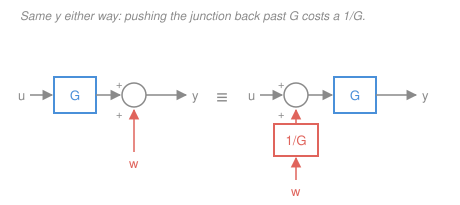
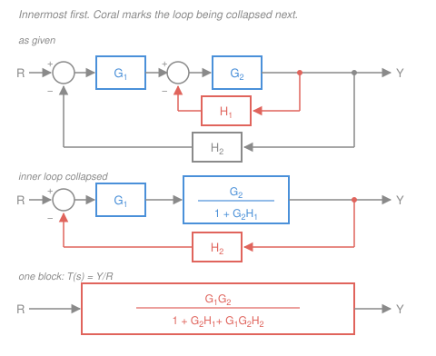

# Control Systems · Lesson 1.5: Block-diagram algebra

> ⏱ ~15 min · Module 1: Modeling & the Laplace transform · Builds on: [1.1 Feedback & the control problem](01-01-feedback-and-the-control-problem.md), [1.4 Transfer functions, poles & zeros](01-04-transfer-functions-poles-zeros.md) · Unlocks: [2.3 Steady-state error](02-03-steady-state-error-system-type.md), [2.4 Stability & Routh–Hurwitz](02-04-stability-routh-hurwitz.md), [3.1 Root locus](03-01-root-locus-construction.md)

## Why this matters

A real control system is never one box. It's an amplifier feeding a motor, with a tachometer wrapped around the motor and an encoder wrapped around the whole thing — three or four blocks and two or three loops, drawn as a spaghetti diagram on a whiteboard. Every technique in the rest of this course (Routh, root locus, Bode, Nyquist) takes as input **one rational function**. So the very first thing you do with any diagram is crush it down to one.

This is a mechanical skill, and it is worth becoming mechanical at. There are exactly three reduction rules and two block-relocation moves, and everything else is bookkeeping. Do it right and the reduction hands you the **characteristic equation** $1 + L(s) = 0$ — the single expression the next twelve lessons operate on.

## The idea

A block diagram is a picture of a set of algebraic equations, drawn so you can see the flow. Three pieces of vocabulary:

- **A block** multiplies. A signal $U(s)$ entering a block labeled $G(s)$ leaves as $G(s)U(s)$. Blocks in a row therefore multiply along the path — that's all "series" means.
- **A summing junction** (a small circle) adds, *with the sign written at each incoming arrow*. Two arrows in with $+$ and $-$ means "the difference." The signs are the entire content of feedback and they are where people lose points.
- **A pickoff point** (a dot on a line) copies a signal and sends it two places. Crucially, **taking a copy does not change the original**.

That last one deserves a flag right now, because it's the physical assumption that makes all of this legal. In a real circuit, hanging a second stage off a node draws current and *does* change the voltage there — the second stage **loads** the first. Block algebra assumes that never happens: every block has infinite input impedance and zero output impedance, so signals flow one way and copies are free. Real designs earn this assumption by inserting buffers (op-amp followers, for example). When they don't, the diagram is a lie and $G_1G_2$ is the wrong answer.

Granting the idealization, reduction is just eliminating internal variables from a set of linear equations. You could always do it by writing down every node equation and grinding — and honestly, when a diagram gets ugly, *do that*. The three rules below are just the three eliminations you'd perform over and over, memorized.

## The formal version

Throughout: $R(s)$ reference, $E(s)$ error, $Y(s)$ output, $G(s)$ forward-path transfer function, $H(s)$ feedback-path transfer function, $T(s) = Y(s)/R(s)$ the closed-loop transfer function.

### Rule 1 — series (cascade)

Signals: $V = G_1U$ and $Y = G_2V$. Substitute:

$$Y = G_2(G_1 U) = G_1G_2\,U \qquad\Longrightarrow\qquad \frac{Y}{U} = G_1G_2.$$

*In words: blocks in a row multiply.* **Caveat:** this used $V = G_1U$ *after* $G_2$ was attached — i.e. it assumed $G_2$ doesn't load $G_1$. Two RC lowpass sections each with transfer function $\frac{1}{\tau s + 1}$ do **not** cascade to $\frac{1}{(\tau s+1)^2}$; the second section's impedance drags on the first (see [`circuits` 4.2](../../circuits/lessons/04-02-impedance-phasor-analysis.md)). Buffer between them and it does.

### Rule 2 — parallel

Same input $U$ splits at a pickoff into two blocks whose outputs meet at a summing junction (both $+$):

$$Y = G_1U + G_2U = (G_1+G_2)U \qquad\Longrightarrow\qquad \frac{Y}{U} = G_1 + G_2.$$

*In words: blocks fed the same signal, with their outputs summed, add.* If the junction sign is $-$ on the second branch, it's $G_1 - G_2$; the sign lives in the junction, not the rule.

### Rule 3 — feedback (the one that matters)

Forward path $G$, feedback path $H$, **negative** feedback at the junction. Two equations:

$$E = R - HY, \qquad Y = GE.$$

Substitute the first into the second, then collect the $Y$'s:

$$Y = G(R - HY) \;\Longrightarrow\; Y + GHY = GR \;\Longrightarrow\; Y(1+GH) = GR,$$

$$\boxed{\;T(s) = \frac{Y}{R} = \frac{G}{1+GH}\;}$$

*In words: forward path over one-plus-loop-gain.* The product $GH$ — once around the loop and back — is the **loop gain**; we'll call the full version $L(s)$ shortly.

Two immediate corollaries, both free:

- **Positive feedback** ($E = R + HY$) flips one sign: $T = \dfrac{G}{1-GH}$. The sign of the denominator is the single most common error in this entire course. Read it off the junction, every time.
- **Unity feedback** ($H = 1$, the sensor is perfect): $T = \dfrac{G}{1+G}$.

And the error itself, which [2.3](02-03-steady-state-error-system-type.md) will live on: from $E = R - HGE$,

$$\frac{E}{R} = \frac{1}{1+GH}.$$

*In words: big loop gain means small error — that is the whole promise of feedback, in one fraction.*

### Moving blocks past junctions

Sometimes no rule applies because a loop's pickoff and its junction are in the wrong places. Then you **relocate** a junction or a pickoff, inserting a compensating block so the algebra is unchanged. The compensating factor is where readers go wrong, so derive one and trust the pattern.

**Derivation (summing junction moved backward past $G$).** Original: $u$ goes through $G$, then $w$ is added.

$$y = Gu + w.$$

Now move the junction *upstream* of $G$, adding some signal $w'$ before the block:

$$y = G(u + w') = Gu + Gw'.$$

These agree for **all** $u$ and $w$ only if $Gw' = w$, i.e. $w' = w/G$. So the entering branch must acquire a $1/G$ block.

The other three cases follow identically. Note the table's two rows are opposites, because a pickoff *reads* a signal while a junction *writes* one:

| Move it… | Summing junction | Pickoff point |
|---|---|---|
| **backward** past $G$ (upstream) | insert $1/G$ in the entering branch (**divide** by $G$) | insert $G$ in the branch (**multiply** by $G$) |
| **forward** past $G$ (downstream) | insert $G$ in the entering branch (**multiply** by $G$) | insert $1/G$ in the branch (**divide** by $G$) |

Quick check on the pickoff row: a pickoff after $G$ carries $Gu$; slide it to before $G$ and it now carries only $u$, so the branch needs a $G$ to restore what it lost. Multiply. The mnemonic is *the inserted block undoes what the move did to that branch*.

Two more moves that need no compensation at all: **adjacent summing junctions commute and merge** ($(r-a)-b = (r-b)-a$, addition is associative), and **two pickoffs on the same line are the same node**. You'll use both constantly.

### What the reduction hands you

Write the full loop gain, also called the **open-loop transfer function**:

$$L(s) = G_c(s)\,G(s)\,H(s) \quad (\text{controller} \times \text{plant} \times \text{sensor}),$$

so a single-loop system reduces to $T = \dfrac{G_cG}{1+L}$. The closed-loop poles are the roots of the denominator:

$$\boxed{\;1 + L(s) = 0\;}$$

the **characteristic equation** from [1.4](01-04-transfer-functions-poles-zeros.md). Two things to burn in:

1. **Every later technique is this expression in a costume.** Routh–Hurwitz ([2.4](02-04-stability-routh-hurwitz.md)) tests the roots' signs without finding them; root locus ([3.1](03-01-root-locus-construction.md)) plots how they move as a gain varies; Nyquist ([3.5](03-05-nyquist-criterion.md)) counts encirclements of the point $L = -1$, which is exactly $1 + L = 0$ drawn in the complex plane.
2. **Closed-loop poles are not open-loop poles.** $L$'s poles are the hardware's; $T$'s poles are the roots of $1 + L = 0$, which sit somewhere else entirely and *move as you change the gain*. Closing the loop relocates the poles. That is the point of closing the loop.

### Mason's gain formula — a touch

Sequential reduction is fine for two or three loops. When loops interlock so that nothing is directly reducible, **Mason's gain formula** reads the answer straight off the diagram:

$$T = \frac{1}{\Delta}\sum_k P_k \Delta_k,$$

$$\Delta = 1 - \sum(\text{loop gains}) + \sum(\text{products of non-touching pairs}) - \sum(\text{non-touching triples}) + \cdots$$

where $P_k$ is the gain of the $k$-th **forward path** (input to output, hitting no node twice), a **loop gain** is the product of everything around a closed loop *including the junction sign*, two loops are **non-touching** if they share no block and no node, and $\Delta_k$ is $\Delta$ recomputed with every loop that touches path $k$ deleted.

*In words: the denominator counts loops with alternating signs, and the numerator is a sum over routes from input to output.* When it wins: many interlocking loops, where sequential reduction becomes a chain of error-prone block moves. When it doesn't: nearly everything you'll meet in practice — hand reduction is faster and you can sanity-check each intermediate diagram. Example 3 runs it on the same system reduced by hand in Example 1, and P2 shows the non-touching-pairs term earning its keep.

## Picture

## Worked examples

### Example 1 — a motor with rate feedback (the full reduction)

A DC servo positions a shaft. The plant, from amplifier voltage to shaft angle, is $G_2(s) = \dfrac{1}{s(s+2)}$ (rad per volt; the free $s$ is the integration from speed to angle). An amplifier of gain $G_1 = K$ drives it. A **tachometer** on the shaft measures speed, which is $s$ times angle, so its path from $Y$ is $H_1(s) = K_t s$ ($K_t$ in volts per rad/s) — this is the inner loop. An encoder measures position with $H_2 = 1$ — the outer loop. Both feed back negatively. This is the diagram in the figure.

**Strategy, and state it as a standing rule: reduce the innermost loop first.** An inner loop has no other loop hiding inside it, so Rule 3 applies immediately; collapsing it turns the *next* loop into a plain single loop. Repeat outward.

**Step 1 — collapse the inner loop.** Forward $G_2$, feedback $H_1$, negative:

$$G_{\text{in}} = \frac{G_2}{1+G_2H_1} = \frac{\dfrac{1}{s(s+2)}}{1 + \dfrac{K_t s}{s(s+2)}} = \frac{1}{s(s+2) + K_t s} = \frac{1}{s\,(s + 2 + K_t)}.$$

(Multiply numerator and denominator by $s(s+2)$ to clear.) Read what happened physically: rate feedback moved the motor's pole from $-2$ to $-(2+K_t)$. It didn't add a pole; it *slid* one.

**Step 2 — series with the amplifier.** Rule 1:

$$G_{\text{fwd}} = G_1 G_{\text{in}} = \frac{K}{s\,(s+2+K_t)}.$$

**Step 3 — collapse the outer loop.** Rule 3 with $H_2 = 1$:

$$T(s) = \frac{G_{\text{fwd}}}{1+G_{\text{fwd}}} = \frac{\dfrac{K}{s(s+2+K_t)}}{1+\dfrac{K}{s(s+2+K_t)}} = \boxed{\;\frac{K}{s^2 + (2+K_t)s + K}\;}$$

**Read the answer.** The characteristic equation is $s^2 + (2+K_t)s + K = 0$. Compare it to the canonical second-order form $s^2 + 2\zeta\omega_n s + \omega_n^2$ from [`signals-systems` 2.5](../../signals-systems/lessons/02-05-transfer-functions-poles-zeros.md):

$$\omega_n = \sqrt{K}, \qquad \zeta = \frac{2+K_t}{2\sqrt{K}}.$$

**Two knobs, two independent effects** — $K$ sets the speed, $K_t$ sets the damping. That is a design, not just an algebra exercise. Numerically, with $K = 10$ and no tachometer ($K_t = 0$): $T = \dfrac{10}{s^2+2s+10}$, poles $-1 \pm j3$, $\zeta = 2/(2\sqrt{10}) \approx 0.316$ — badly underdamped, it will ring. Turn the tach on at $K_t = 2$: $T = \dfrac{10}{s^2+4s+10}$, poles $-2 \pm j\sqrt6 \approx -2 \pm j2.449$, $\zeta \approx 0.632$. Same $\omega_n = \sqrt{10} \approx 3.16$ rad/s, twice the damping.

*Check.* Symbolically the general result is $T = \dfrac{G_1G_2}{1 + G_2H_1 + G_1G_2H_2}$ (this is the figure's final block). Substituting $G_1=K,\ G_2 = 1/(s(s+2)),\ H_1 = K_ts,\ H_2=1$ and clearing $s(s+2)$: numerator $K$, denominator $s(s+2) + K_ts + K = s^2 + (2+K_t)s + K$. ✓ And at $s=0$, $T(0) = K/K = 1$ — a unity-feedback loop with a free integrator tracks a constant reference exactly, as it must.

### Example 2 — Boss problem 1's reduction, and why $K$ matters

Module 1's boss problem ends with the cart plant $G(s) = \dfrac{1}{s^2+3s+2} = \dfrac{1}{(s+1)(s+2)}$ (from $m\ddot x + b\dot x + kx = f$ with $m=1,\,b=3,\,k=2$), a forward gain $K$, and unity negative feedback. Reduce it.

Series first: forward path $= KG$. Then Rule 3 with $H=1$:

$$T(s) = \frac{KG}{1+KG} = \frac{\dfrac{K}{s^2+3s+2}}{1+\dfrac{K}{s^2+3s+2}} = \frac{K}{s^2+3s+2+K}.$$

Multiplying top and bottom by $s^2+3s+2$ is the whole trick, and it's worth naming: **clear the fraction inside the fraction immediately**, and the characteristic polynomial appears by itself.

$$\text{characteristic equation:}\qquad s^2 + 3s + (2+K) = 0 \quad\Longrightarrow\quad s = \frac{-3 \pm \sqrt{1-4K}}{2}.$$

Now watch the poles move as $K$ turns:

| $K$ | closed-loop poles | behavior |
|---|---|---|
| $0$ | $-1,\; -2$ | the open-loop poles, loop effectively open |
| $0.25$ | $-1.5,\;-1.5$ | repeated: critically damped, fastest without overshoot |
| $2$ | $-1.5 \pm j1.323$ | underdamped, rings |
| $10$ | $-1.5 \pm j3.122$ | rings faster, same decay rate |

At $K=0$ they sit exactly at the open-loop poles $-1$ and $-2$; as $K$ grows they slide toward each other along the real axis, collide at $-1.5$ when $K = 1/4$, and then split vertically. **The plant's poles never moved — the closed-loop poles did.** Note also that the real part locks at $-1.5$ for all $K > 1/4$: the roots sum to $-3$ (minus the $s^1$ coefficient) no matter what $K$ is, so a conjugate pair must straddle $-1.5$. That vertical line is a root locus, and [3.1](03-01-root-locus-construction.md) is the systematic way to draw it.

*Check.* At $K = 2$: $s^2+3s+4$, discriminant $9-16 = -7$, roots $(-3 \pm j\sqrt7)/2 = -1.5 \pm j1.323$ ✓, product of roots $= 1.5^2 + 1.323^2 = 4$ = constant term ✓. DC gain $T(0) = K/(2+K)$, which is $0.5$ at $K=2$ and $\to 1$ as $K\to\infty$: more gain, less steady-state error, exactly $E/R = 1/(1+L)$ predicts.

### Example 3 — the same system, by Mason's rule

Back to Example 1's two-loop diagram, symbolically. Inventory the diagram:

- **Forward paths:** one, $P_1 = G_1G_2$ (in through $G_1$, through $G_2$, out).
- **Loops:** $L_1 = -G_2H_1$ (inner; the minus is the summing junction's sign) and $L_2 = -G_1G_2H_2$ (outer).
- **Non-touching?** Both loops pass through $G_2$, so they touch. No pair term.
- $\Delta = 1 - (L_1 + L_2) = 1 + G_2H_1 + G_1G_2H_2$.
- $\Delta_1$: every loop touches $P_1$, delete them all, so $\Delta_1 = 1$.

$$T = \frac{P_1\Delta_1}{\Delta} = \frac{G_1G_2}{1 + G_2H_1 + G_1G_2H_2}.$$

Identical to the three-step hand reduction, obtained in one pass with no intermediate diagrams. Honest accounting: the formula didn't remove the thinking, it moved it — you now have to get every loop's sign and every touching relation right, in one shot, with no intermediate picture to sanity-check. For two loops, hand reduction is safer. For six interlocking ones, Mason is the only sane route.

## Watch out

- **You might think the denominator sign follows the feedback path's algebra.** It follows the **summing junction**. Negative feedback gives $1+GH$, positive gives $1-GH$ — and if $H$ itself carries a minus sign, a "negative" junction can still produce $1-|GH|$. Read the sign off the circle, then substitute $H$ as written. A wrong sign here doesn't just shift a number; it flips your stability verdict.
- **You might think $G_1G_2$ is always the cascade.** Only if stage 2 doesn't load stage 1. Two identical RC sections wired directly together give a denominator with a cross term, not $(\tau s + 1)^2$ — the product rule is an idealization you're allowed only when a buffer (or a genuinely high input impedance) enforces it.
- **You might insert $G$ where $1/G$ belongs when relocating a block.** Don't memorize the table — regenerate it. Write the output equation before and after in one line each and see which factor makes them match, exactly as in the fig-2 derivation. Fast sanity check: after any relocation, evaluate the whole diagram at $s=0$ (DC gain) both ways; a wrong compensator almost never survives it.
- **You might treat the plant's poles as the system's poles.** The plant's poles are $L$'s poles. The system you actually built has poles at the roots of $1 + L(s) = 0$, and every one of them moves when you turn a gain — which is the entire reason feedback is worth the trouble.

## One-liner

> Multiply along paths, add at junctions, and collapse every loop innermost-first with $G/(1+GH)$ — what falls out is $1 + L(s) = 0$, the equation the rest of control theory is about.

## Problems

**P1 (🟢)** Blocks $G_1(s) = \dfrac{1}{s}$ and $G_2(s) = 3$ sit in **parallel** (same input, outputs added at a $+/+$ junction). That combination is the forward path of a **unity negative feedback** loop. Find $T(s)$ and its DC gain.

**P2 (🟡)** A diagram has forward path $R \to \Sigma_1 \to G_1 \to \Sigma_2 \to G_2 \to Y$. There are two negative-feedback loops: $H_1$ runs from the output of $G_1$ back to $\Sigma_1$, and $H_2$ runs from $Y$ back to $\Sigma_2$. With $G_1 = \dfrac{2}{s+1}$, $H_1 = 1$, $G_2 = \dfrac{4}{s+3}$, $H_2 = \dfrac12$: reduce by hand to $T(s)$, then verify with Mason's formula. (Look carefully at whether the two loops touch.)

**P3 (🔴)** Same forward chain but three blocks: $R \to \Sigma_1 \to G_1 \to \Sigma_2 \to G_2 \to A \to G_3 \to Y$, where $A$ is a pickoff node between $G_2$ and $G_3$. Loop *a* runs from node $A$ back to $\Sigma_1$ through $H_1$; loop *b* runs from $Y$ back to $\Sigma_2$ through $H_2$. Both negative. These loops **interlock** — neither is nested inside the other — so no rule applies as drawn. Relocate blocks to reduce it, and give $T(s)$ symbolically. Then evaluate for $G_1 = 1$, $G_2 = \dfrac1s$, $G_3 = \dfrac{1}{s+2}$, $H_1 = 4$, $H_2 = 1$.

Solutions

**P1** Parallel first (Rule 2), then feedback (Rule 3).

$$G = G_1 + G_2 = \frac{1}{s} + 3 = \frac{3s+1}{s}.$$

$$T = \frac{G}{1+G} = \frac{\dfrac{3s+1}{s}}{1 + \dfrac{3s+1}{s}} = \frac{3s+1}{s + 3s + 1} = \frac{3s+1}{4s+1}.$$

DC gain: $T(0) = 1/1 = 1$.

*Check.* Two independent routes. (i) The forward path contains a free integrator ($1/s$), so $G(s)\to\infty$ as $s\to0$ and $T = G/(1+G) \to 1$ — a unity-feedback loop with an integrator has zero steady-state error to a step, so DC gain must be exactly 1 ✓. (ii) High frequency: as $s\to\infty$, $G \to 3$ and $T \to 3/4$; the formula gives $3s/4s = 3/4$ ✓.

**P2** **Do the loops touch?** Loop *a* contains only $G_1$ and $H_1$; loop *b* contains only $G_2$ and $H_2$. They share no block and no node — they are **non-touching**, and this diagram is really two independent single loops in cascade.

*Hand reduction.* Collapse each loop separately with Rule 3, then multiply (Rule 1):

$$T_1 = \frac{G_1}{1+G_1H_1} = \frac{\dfrac{2}{s+1}}{1+\dfrac{2}{s+1}} = \frac{2}{s+1+2} = \frac{2}{s+3},$$

$$T_2 = \frac{G_2}{1+G_2H_2} = \frac{\dfrac{4}{s+3}}{1+\dfrac{2}{s+3}} = \frac{4}{s+3+2} = \frac{4}{s+5},$$

$$T = T_1T_2 = \frac{8}{(s+3)(s+5)} = \frac{8}{s^2+8s+15}.$$

*Mason verification.* One forward path, $P_1 = G_1G_2 = \dfrac{8}{(s+1)(s+3)}$, and $\Delta_1 = 1$ (both loops touch it). Loop gains $L_a = -G_1H_1$, $L_b = -G_2H_2$; because they are non-touching, $\Delta$ keeps the pair term:

$$\Delta = 1 - (L_a + L_b) + L_aL_b = 1 + G_1H_1 + G_2H_2 + G_1G_2H_1H_2 = (1+G_1H_1)(1+G_2H_2).$$

That factorization *is* the hand reduction, and it's exactly the term a careless Mason application drops. Numerically, $1 + G_1H_1 = \dfrac{s+3}{s+1}$ and $1+G_2H_2 = \dfrac{s+5}{s+3}$, so $\Delta = \dfrac{s+5}{s+1}$ and

$$T = \frac{P_1}{\Delta} = \frac{8}{(s+1)(s+3)}\cdot\frac{s+1}{s+5} = \frac{8}{(s+3)(s+5)}.$$

Same answer. ✓

*Check.* DC gain by a third route: each loop's DC gain is $G/(1+GH)$ at $s=0$, i.e. $\frac{2}{3}$ and $\frac{4/3}{1+2/3} = \frac{4}{5}$, product $= \frac{8}{15}$ — matching $T(0) = 8/15 \approx 0.533$ ✓. Poles at $-3$ and $-5$: the closed loops pulled the open-loop poles from $-1$ and $-3$ leftward, i.e. made the system faster ✓.

**P3** The obstruction: loop *a* spans $G_1,G_2$ and loop *b* spans $G_2,G_3$, overlapping on $G_2$. Fix it by moving the two problem elements so a single junction and a single pickoff serve both loops.

*Move 1 — slide the pickoff at $A$ forward past $G_3$ to $Y$.* The branch carried $A$; at $Y$ it would carry $G_3A$, so **divide by $G_3$**: the $H_1$ branch becomes $H_1/G_3$, now taken from $Y$.

*Move 2 — slide $\Sigma_2$ backward past $G_1$, to sit beside $\Sigma_1$.* Its entering signal was $-H_2Y$; moved upstream of $G_1$ it must be **divided by $G_1$**, becoming $-H_2Y/G_1$.

Now both feedback signals enter adjacent junctions, which merge (addition is associative), and the forward path from that single junction to $Y$ is $G_1G_2G_3$. So with $E = R - Y\!\left(\dfrac{H_1}{G_3} + \dfrac{H_2}{G_1}\right)$ and $Y = G_1G_2G_3E$, Rule 3 gives

$$T = \frac{G_1G_2G_3}{1 + G_1G_2G_3\left(\dfrac{H_1}{G_3} + \dfrac{H_2}{G_1}\right)} = \frac{G_1G_2G_3}{1 + G_1G_2H_1 + G_2G_3H_2}.$$

*Numerically*, with $G_1=1$, $G_2 = 1/s$, $G_3 = 1/(s+2)$, $H_1 = 4$, $H_2 = 1$:

$$T = \frac{\dfrac{1}{s(s+2)}}{1 + \dfrac{4}{s} + \dfrac{1}{s(s+2)}} = \frac{1}{s(s+2) + 4(s+2) + 1} = \frac{1}{s^2+6s+9} = \frac{1}{(s+3)^2}.$$

(Multiply through by $s(s+2)$.) A repeated pole at $s=-3$: critically damped.

*Check by Mason (independent route).* Forward paths: one, $P_1 = G_1G_2G_3$, $\Delta_1 = 1$. Loops: $L_a = -G_1G_2H_1$, $L_b = -G_2G_3H_2$ — they share $G_2$, so they **touch** and there is no pair term. Then $\Delta = 1 + G_1G_2H_1 + G_2G_3H_2$ and $T = P_1/\Delta$, identical to the relocation result ✓. Second check, on the numbers: expand $s(s+2)+4(s+2)+1 = s^2+2s+4s+8+1 = s^2+6s+9$ ✓, and $T(0) = 1/9$, which also equals $\frac{1}{0+8+1}$ from the cleared form ✓.

*Moral:* the relocation route took two careful moves and could go wrong in two places; Mason took four lines. This is the diagram class where Mason earns its keep.

## Flashback

**From Lesson 1.4 (Transfer functions, poles & zeros):** A system with input $u$ and output $y$ obeys

$$\ddot y + 7\dot y + 12y = 3\dot u + 6u,$$

with zero initial conditions. Find $G(s) = Y(s)/U(s)$, its poles, zeros, and DC gain. Then — today's move — place this $G$ in a unity negative-feedback loop behind a forward gain $K = 4$ and locate the closed-loop poles.

Solution

Each $d/dt$ becomes an $s$ (zero initial conditions), so $(s^2+7s+12)Y = (3s+6)U$:

$$G(s) = \frac{3s+6}{s^2+7s+12} = \frac{3(s+2)}{(s+3)(s+4)}.$$

**Zero** at $s=-2$; **poles** at $s=-3$ and $s=-4$; both poles in the left half-plane, so the plant is stable. **DC gain** $G(0) = 6/12 = 0.5$.

*Closed loop with $K=4$.* Forward path $KG$, unity feedback:

$$T = \frac{KG}{1+KG} = \frac{12(s+2)}{(s+3)(s+4) + 12(s+2)} = \frac{12s+24}{s^2+19s+36}.$$

Roots of $s^2+19s+36 = 0$: discriminant $361 - 144 = 217$, $\sqrt{217} \approx 14.731$, so

$$s = \frac{-19 \pm 14.731}{2} \approx -2.13 \;\text{ and }\; -16.87.$$

*Check.* Sum of roots $= -19$ ✓ (matches the $s^1$ coefficient) and product $\approx 2.13 \times 16.87 = 36.0$ ✓. Note the zero at $-2$ is unmoved — feedback never moves zeros of $G$ — while both poles left $-3,-4$ entirely: one crept toward the zero at $-2$, the other bolted off to $-16.87$. That "one pole heads for the finite zero, the other runs to infinity" pattern is the root locus of a two-pole/one-zero plant, coming in [3.1](03-01-root-locus-construction.md).

## Connections

- **Backward:** the whole method rests on [1.4](01-04-transfer-functions-poles-zeros.md)'s transfer function — because a block *is* a multiplication in $s$, connecting hardware becomes multiplying polynomials, and the denominators you produce here are that lesson's characteristic polynomials. The reason multiplication is legal at all is the Laplace differentiation rule from [1.3](01-03-laplace-transform-toolkit.md), and the error signal $E = R - HY$ is [1.1](01-01-feedback-and-the-control-problem.md)'s loop drawn algebraically.
- **Forward:** every remaining lesson consumes the output of this one. [2.3](02-03-steady-state-error-system-type.md) applies the final value theorem to $E/R = 1/(1+L)$; [2.4](02-04-stability-routh-hurwitz.md) runs a Routh array on $1 + L(s) = 0$; [3.1](03-01-root-locus-construction.md) and [3.2](03-02-root-locus-design.md) plot how its roots migrate with gain; [3.4](03-04-gain-and-phase-margins.md) and [3.5](03-05-nyquist-criterion.md) study $L(j\omega)$ near the critical point $-1$; [4.1](04-01-pid-control.md) inserts a specific $G_c(s)$ into exactly the slot Example 1 called $G_1$. Example 1's rate-feedback trick reappears as derivative action in PID and, generalized to feeding back *every* state, as pole placement in [5.4](05-04-pole-placement-observers.md).
- **Sideways:** the loading caveat on Rule 1 is an impedance question, handled properly in [`circuits` 4.2](../../circuits/lessons/04-02-impedance-phasor-analysis.md) — an ideal block diagram is what you get after buffering. And a signal-flow graph is just a weighted directed graph, so Mason's formula is a determinant expansion in disguise: $\Delta$ is $\det(I - A)$ for the graph's adjacency matrix, the same object as the characteristic determinant in [`linalg-refresher` 2.3](../../linalg-refresher/lessons/02-03-determinants.md). Feedback moving poles is the design counterpart to the pole reading you did in [`signals-systems` 2.5](../../signals-systems/lessons/02-05-transfer-functions-poles-zeros.md).
