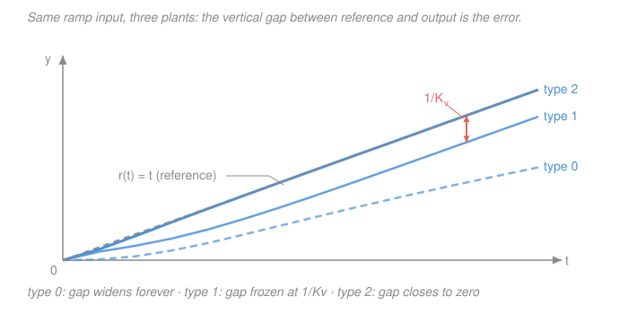
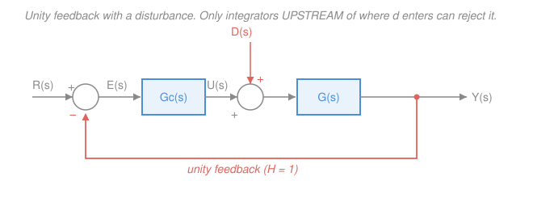

# Control Systems · Lesson 2.3: Steady-state error & system type

> ⏱ ~15 min · Module 2: Time response & stability · Builds on: [1.3 The Laplace transform toolkit](01-03-laplace-transform-toolkit.md), [1.5 Block-diagram algebra](01-05-block-diagram-algebra.md), [2.1 First-order response](02-01-first-order-response.md), [2.2 Second-order response](02-02-second-order-response.md) · Unlocks: [2.4 Stability & Routh–Hurwitz](02-04-stability-routh-hurwitz.md), [4.1 PID control](04-01-pid-control.md), [4.3 Lead & lag compensators](04-03-lead-lag-compensators.md)

## Why this matters

[2.1](02-01-first-order-response.md) and [2.2](02-02-second-order-response.md) answered *how fast*: time constant, overshoot, settling time. Those are **speed** specs. They say nothing about whether the elevator actually stops at floor 7 — only how briskly it gets to wherever it ends up.

This lesson is the **accuracy** spec. Wait for the transient to die completely, then ask the blunt question: **is the output equal to the reference, or not?** A thermostat that settles two degrees cool, a servo that trails the commanded angle by a fixed lag, a cruise control that holds 68 when you asked for 70 — these are all steady-state error, and they are all diagnosable *before you build anything*, from one number you can read off the open-loop transfer function by counting poles at the origin.

That number is the **system type**, and it turns out to control the entire accuracy story. It is also the reason the "I" in PID exists.

## The idea

Here is the whole lesson in one sentence: **a feedback loop only works as hard as the error tells it to, so if the loop needs a nonzero output it needs a nonzero error to produce it — unless there's an integrator, which remembers.**

Think about a proportional controller holding a heavy door open at a target angle. The control effort is $u = K e$: it pushes in proportion to how far off you are. But gravity is pulling the door shut, so holding position requires a *nonzero* push forever. The only way to get a nonzero $u$ out of $u = Ke$ is a nonzero $e$. The door **must** sit slightly off target. Cranking $K$ up shrinks the required $e$ but never kills it.

Now put an **integrator** in the controller: $u = \int e\,dt$. This one is different. As long as $e \ne 0$, $u$ keeps *climbing*. The controller is not reporting the current error, it's accumulating the whole history. So $u$ can be large and steady while $e$ sits at exactly zero — the integrator holds the effort by memory. The loop cannot come to rest until the error is gone.

That is the mechanism. Everything below is bookkeeping on top of it: **count the integrators, and you know which inputs you can track perfectly.**

## The formal version

### Setting up the error

Take the standard **unity-feedback** loop (figure below, ignoring $D$ for now): reference $R(s)$, error $E(s) = R(s) - Y(s)$, controller $G_c(s)$, plant $G(s)$, and open-loop transfer function

$$L(s) \;=\; G_c(s)\,G(s).$$

The forward path gives $Y = L\,E$, so $E = R - LE$, hence $E(1+L) = R$ and

$$\boxed{\,E(s) \;=\; \frac{R(s)}{1 + L(s)}\,}$$

*In words: the error is the reference, divided down by one plus the loop gain — big loop gain, small error.*

Now apply the **final value theorem** from [1.3](01-03-laplace-transform-toolkit.md), $\lim_{t\to\infty} e(t) = \lim_{s\to 0} sE(s)$:

$$e_{ss} \;=\; \lim_{s\to 0}\; \frac{s\,R(s)}{1 + L(s)}.$$

**The caveat, stated loudly: this is valid only if the closed loop is stable.** The final value theorem requires $sE(s)$ to have all its poles in the open left half-plane. If the closed loop is unstable, $e(t)$ diverges, has no final value — and the limit above will still hand you a finite, tidy, completely wrong number. **Check stability first** ([2.4](02-04-stability-routh-hurwitz.md)), then compute the error.

### System type

**Definition.** Write the open-loop transfer function with its poles at the origin pulled out front:

$$L(s) \;=\; \frac{K\,(s+z_1)(s+z_2)\cdots}{s^{N}\,(s+p_1)(s+p_2)\cdots}, \qquad z_i, p_i \ne 0 .$$

The integer $N$ — the number of **pure integrators**, i.e. poles of $L$ at $s = 0$ — is the **system type**.

*In words: system type counts how many times the loop integrates.* Two things to nail down:

- Type is a property of the **open-loop** transfer function $L$, not the closed loop $T = L/(1+L)$. Look at $L$, count the $s$'s in the denominator, done.
- It doesn't matter whether the integrator lives in the controller or was already in the plant — a DC motor whose output is *position* has a free integrator built in, because position is the integral of speed.

### The three error constants

Each standard test input has its own constant. Define:

| Constant | Definition | Reads off |
|---|---|---|
| **Position** $K_p$ | $\displaystyle K_p = \lim_{s\to 0} L(s)$ | DC gain of the loop |
| **Velocity** $K_v$ | $\displaystyle K_v = \lim_{s\to 0} sL(s)$ | residue of the single integrator |
| **Acceleration** $K_a$ | $\displaystyle K_a = \lim_{s\to 0} s^2 L(s)$ | residue of the double integrator |

("Velocity" and "acceleration" name the *input* being tracked, not a physical speed. $K_v$ has units of $1/\text{s}$ when $r$ and $y$ share units.)

Feed each test input into $e_{ss} = \lim_{s\to0} sR(s)/(1+L)$:

**Unit step**, $r(t) = 1$, $R(s) = 1/s$:

$$e_{ss} = \lim_{s\to 0}\frac{s\cdot \tfrac1s}{1+L(s)} = \frac{1}{1 + K_p}.$$

**Unit ramp**, $r(t) = t$, $R(s) = 1/s^2$:

$$e_{ss} = \lim_{s\to 0}\frac{s\cdot \tfrac1{s^2}}{1+L(s)} = \lim_{s\to 0}\frac{1}{s + sL(s)} = \frac{1}{K_v},$$

since $s \to 0$ kills the lone $s$ and leaves $sL(s) \to K_v$.

**Unit parabola**, $r(t) = t^2/2$, $R(s) = 1/s^3$:

$$e_{ss} = \lim_{s\to 0}\frac{1}{s^2 + s^2L(s)} = \frac{1}{K_a}.$$

*In words: each error is one over "how much gain the loop still has at DC, measured in the currency of that input."*

### The master table

Evaluate the three constants for each type and you get the table this whole lesson exists to produce:

| | Step $r = 1$ | Ramp $r = t$ | Parabola $r = t^2/2$ |
|---|---|---|---|
| **Type 0** | $\dfrac{1}{1+K_p}$ | $\infty$ | $\infty$ |
| **Type 1** | $0$ | $\dfrac{1}{K_v}$ | $\infty$ |
| **Type 2** | $0$ | $0$ | $\dfrac{1}{K_a}$ |

Read it as a diagonal sweeping down and right. Above the diagonal: zero error, perfect tracking. On the diagonal: a finite, nonzero, *tunable* error. Below it: the output falls hopelessly behind and the error runs to infinity.

Why the diagonal? Because the constants collapse in a pattern. For type 0, $K_p = L(0)$ is finite but $K_v = \lim sL = 0$ and $K_a = 0$ — a zero constant means infinite error. For type 1, the integrator makes $K_p = \lim L = \infty$ (so $1/(1+K_p) = 0$) while $K_v$ becomes finite. Each extra $s$ in the denominator promotes one constant from zero to finite and the one before it from finite to infinite.

The sentence to remember:

> **Each integrator you add kills the error for one more class of input.** To track with *zero* error an input whose Laplace transform has an $m$-th-order pole at the origin, you need type $\ge m$; type exactly $m-1$ gives a finite nonzero error, and anything lower diverges.

Check it: the step has $R = 1/s$, a first-order pole, so you need type 1 for zero error and type 0 gives the finite $1/(1+K_p)$. The ramp has $R = 1/s^2$, second-order, so you need type 2, and type 1 gives $1/K_v$. Same statement, every row.

## Picture

One figure, the whole table. Chase a ramp with a type 0 loop and the output settles into a *shallower slope* — it tracks at rate $K_p/(1+K_p) < 1$, so the gap widens forever. Type 1 gets the slope exactly right but is permanently late by a frozen amount $1/K_v$ (the coral bar). Type 2 closes the gap entirely.

## Worked examples

**Example 1 — one integrator, before and after.**

Take the unity-feedback loop with

$$L_0(s) = \frac{10}{(s+1)(s+2)}.$$

No $s$ in the denominator, so this is **type 0**. Stability first: the characteristic equation $1+L_0=0$ gives $(s+1)(s+2)+10 = s^2+3s+12 = 0$, roots $s = -1.5 \pm j\,\tfrac{\sqrt{39}}{2} \approx -1.5 \pm j3.12$ — both in the left half-plane, stable, so the final value theorem is licensed.

$$K_p = \lim_{s\to0} \frac{10}{(s+1)(s+2)} = \frac{10}{1\cdot 2} = 5 \quad\Longrightarrow\quad e_{ss}^{\text{step}} = \frac{1}{1+5} = \frac16 \approx 0.167 .$$

A unit step command settles **16.7 percent short**, forever. And the ramp:

$$K_v = \lim_{s\to0} \frac{10s}{(s+1)(s+2)} = 0 \quad\Longrightarrow\quad e_{ss}^{\text{ramp}} = \frac{1}{0} = \infty .$$

Now slide one pole to the origin — physically, make the plant output a *position* instead of a speed, or add an integral term to the controller:

$$L_1(s) = \frac{10}{s(s+2)}.$$

One pole at $s=0$, so **type 1**. Characteristic equation: $s(s+2)+10 = s^2+2s+10=0$, roots $s = -1 \pm j3$ — stable. (Recognize the form from [2.2](02-02-second-order-response.md): $\omega_n = \sqrt{10} \approx 3.16$, $2\zeta\omega_n = 2$ so $\zeta \approx 0.316$ — it *will* overshoot about 35 percent. Hold that thought.)

$$K_p = \lim_{s\to0}\frac{10}{s(s+2)} = \infty \quad\Longrightarrow\quad e_{ss}^{\text{step}} = \frac{1}{1+\infty} = 0,$$
$$K_v = \lim_{s\to0}\frac{10s}{s(s+2)} = \frac{10}{2} = 5 \quad\Longrightarrow\quad e_{ss}^{\text{ramp}} = \frac{1}{5} = 0.2 .$$

**The contrast is the point.** The same gain 10, the same second pole at $-2$, one pole moved from $-1$ to $0$ — and the step error went from **16.7 percent to exactly zero**, while the ramp error went from **infinite to 0.2**. That single integrator bought an entire column of the table.

**Example 2 — the design tension (why you can't just crank the gain).**

Take $L(s) = \dfrac{K}{s(s+2)}$ with $K$ adjustable. It's type 1 for any $K>0$, so:

$$K_v = \frac{K}{2}, \qquad e_{ss}^{\text{ramp}} = \frac{2}{K}.$$

Bigger $K$, smaller error — you can make it as small as you like. Free lunch? Look at what the closed loop is doing while you turn the knob. $T(s) = K/(s^2+2s+K)$, so $\omega_n = \sqrt{K}$ and $2\zeta\omega_n = 2$, giving $\zeta = 1/\sqrt{K}$. Percent overshoot from [2.2](02-02-second-order-response.md) is $M_p = 100\,e^{-\pi\zeta/\sqrt{1-\zeta^2}}$:

| $K$ | $K_v = K/2$ | ramp error $2/K$ | $\zeta = 1/\sqrt K$ | overshoot $M_p$ |
|---|---|---|---|---|
| 4 | 2 | 0.50 | 0.500 | 16.3 percent |
| 10 | 5 | 0.20 | 0.316 | 35.1 percent |
| 25 | 12.5 | 0.08 | 0.200 | 52.7 percent |

Every factor you shave off the error, you pay for in ringing — and on a higher-order plant the poles eventually cross into the right half-plane and the loop goes unstable outright ([2.4](02-04-stability-routh-hurwitz.md), [3.4](03-04-gain-and-phase-margins.md)). **Raising gain trades accuracy against stability, always.**

The other lever, adding an integrator, is not free either. An integrator is $1/s$, which contributes a flat $-90^\circ$ of phase at *every* frequency — including near crossover, where phase is exactly the thing keeping you stable. So it eliminates the steady-state error outright and eats your phase margin doing it. This is the honest reason the integral gain in a PID controller is **tuned, not maximized**: too much of it and the loop that had zero error starts oscillating around zero error. [4.1](04-01-pid-control.md) is that story; [4.2](04-02-tuning-pid.md) is how to pick the number.

The clean escape is a **lag compensator** — a pole and a zero placed close together near the origin, which multiplies up the low-frequency gain (hence $K_p$ or $K_v$) while contributing almost no phase where crossover lives. "Boost the DC gain without wrecking the margins" is precisely its job description, and it's designed in [4.3](04-03-lead-lag-compensators.md).

### Disturbances: the same machinery, a different entry point

Reference tracking is half the job; the other half is rejecting a load you didn't ask for — wind on an antenna, a passenger stepping into an elevator. Let $D(s)$ enter at the **plant input** as in the figure, and set $R=0$ to isolate its effect. Then $y = G(G_c e + d)$ with $e = -y$, so $y(1 + G_cG) = Gd$ and

$$E(s) = -Y(s) = -\,\frac{G(s)}{1 + G_c(s)G(s)}\,D(s) \;=\; -\,\frac{D(s)}{\dfrac{1}{G(s)} + G_c(s)} .$$

For a step disturbance $d(t) = D_0$, the final value theorem gives $e_{ss} = -D_0 \big/ \lim_{s\to0}\big[1/G(s) + G_c(s)\big]$. Now read off the punchline: the error vanishes only if that limit is infinite, which needs $G_c(0) = \infty$ — **an integrator in the controller, upstream of where the disturbance enters.** An integrator sitting inside the plant *downstream* of the entry point sends $1/G \to 0$ and leaves $e_{ss} = -D_0/G_c(0)$, finite and nonzero. So "type 1" alone doesn't tell you a disturbance is rejected; *where the integrator sits relative to the disturbance* does. In practice this is what steady-state error means: not chasing ramps, but holding a setpoint against a load.

### One caution on non-unity feedback

If $H(s) \ne 1$, the signal leaving the summing junction is $R - HY$, which is **not** the error anyone cares about. Define the real error as $E = R - Y = (1 - T)R$ with $T = G_cG/(1+G_cGH)$, and compute $e_{ss} = \lim_{s\to0} sR(s)\big[1 - T(s)\big]$. The $K_p, K_v, K_a$ table above applies to unity feedback only — for $H \ne 1$, convert the loop to an equivalent unity-feedback form first, or just use $1-T$ directly.

## Watch out

- **You might think the error formula always works. It only works on a stable loop.** Try $L(s) = \dfrac{100}{(s+1)(s+2)(s+3)}$: type 0, $K_p = 100/6 = 16.7$, and the formula confidently reports $e_{ss} = 1/17.7 = 0.057$. But the characteristic polynomial is $s^3+6s^2+11s+106$, and its Routh array has a sign change ($(6\cdot11-106)/6 = -6.7 < 0$), so the closed loop is **unstable** — the true error oscillates with growing amplitude and has no final value at all. A finite, confident, wrong number. Stability check first, every time.
- **You might count integrators in the closed-loop transfer function. Count them in the open-loop one.** $T(s) = L/(1+L)$ has *no* pole at the origin when $L$ does — the integrator shows up as $T(0) = 1$, not as a pole. System type lives in $L$.
- **You might think "type 1 means zero error, period."** It means zero error *to a step*. The same type 1 loop has a finite lag on a ramp and loses a parabola completely. Type always answers "zero error to **which** input?"
- **You might read $K_v$ as a velocity.** It's not; it's the gain constant that governs the error when the *reference* is a velocity command. Its units are $1/\text{s}$, and $1/K_v$ is a dimensionless fraction of the ramp slope, not a speed.

## One-liner

> Count the poles at the origin in $L(s)$: each one wipes out the steady-state error for one more class of input — but you buy them with phase margin, which is why the "I" in PID is tuned rather than maximized.

## Problems

**P1 (🟢)** A unity-feedback loop has $L(s) = \dfrac{20}{(s+2)(s+5)}$. State the system type, compute $K_p$, $K_v$, $K_a$, and give the steady-state error for a unit step and a unit ramp. Confirm the closed loop is stable before you quote any of it.

**P2 (🟡)** A unity-feedback loop has $L(s) = \dfrac{K(s+3)}{s(s+4)(s+6)}$ with $K>0$. Find the smallest $K$ for which the steady-state error to a unit ramp is at most $0.05$, and verify that this $K$ leaves the closed loop stable.

**P3 (🔴)** For $L(s) = \dfrac{K}{s(s+2)}$ in unity feedback, the specs are: steady-state error to a unit ramp $\le 0.2$, **and** percent overshoot $\le 20$ percent. Show that no single value of $K$ meets both, give the two ranges explicitly, and name the compensator you'd reach for.

Solutions

**P1** No pole at $s=0$, so **type 0**.

*Stability check first.* $1 + L = 0 \Rightarrow (s+2)(s+5) + 20 = s^2 + 7s + 10 + 20 = s^2 + 7s + 30 = 0$. For a quadratic, all coefficients positive is necessary and sufficient — $1, 7, 30$ all positive, so both roots are in the left half-plane. (Explicitly, $s = \tfrac{-7 \pm \sqrt{49-120}}{2} = -3.5 \pm j\,\tfrac{\sqrt{71}}{2} \approx -3.5 \pm j4.21$.) Stable, so the final value theorem applies.

$$K_p = \lim_{s\to0}\frac{20}{(s+2)(s+5)} = \frac{20}{2\cdot 5} = \frac{20}{10} = 2,$$
$$K_v = \lim_{s\to0}\frac{20s}{(s+2)(s+5)} = \frac{0}{10} = 0, \qquad K_a = \lim_{s\to0}\frac{20s^2}{(s+2)(s+5)} = 0 .$$

Errors:

$$e_{ss}^{\text{step}} = \frac{1}{1+K_p} = \frac{1}{3} \approx 0.333, \qquad e_{ss}^{\text{ramp}} = \frac{1}{K_v} = \infty .$$

*Check.* Cross-check the step error a second way, without $K_p$: the closed loop is $T(s) = \dfrac{20}{s^2+7s+30}$, so its DC gain is $T(0) = 20/30 = 2/3$. A unit step therefore settles at $y_\infty = 2/3$, leaving $e_{ss} = 1 - 2/3 = 1/3$ — agrees. And $2/3 = K_p/(1+K_p) = 2/3$ ✓. The type 0 row of the master table also predicts the infinite ramp error, matching the type 0 curve in the figure. ✓

**P2** One pole at $s=0$, so **type 1**, and the ramp error is $1/K_v$.

$$K_v = \lim_{s\to0} s\cdot\frac{K(s+3)}{s(s+4)(s+6)} = \lim_{s\to0}\frac{K(s+3)}{(s+4)(s+6)} = \frac{3K}{4\cdot 6} = \frac{3K}{24} = \frac{K}{8}.$$

Require $e_{ss} = 1/K_v \le 0.05$, i.e. $K_v \ge 20$:

$$\frac{K}{8} \ge 20 \quad\Longrightarrow\quad \boxed{K \ge 160}, \text{ so the smallest is } K = 160 .$$

*Stability.* The characteristic equation is $s(s+4)(s+6) + K(s+3) = 0$:

$$s^3 + 10s^2 + 24s + Ks + 3K = s^3 + 10s^2 + (24+K)s + 3K = 0 .$$

For a cubic $s^3 + a_2s^2 + a_1s + a_0$, the Routh conditions ([2.4](02-04-stability-routh-hurwitz.md)) are all coefficients positive **and** $a_2a_1 > a_0$. Here every coefficient is positive for $K>0$, and

$$a_2a_1 - a_0 = 10(24+K) - 3K = 240 + 10K - 3K = 240 + 7K > 0 \quad\text{for all } K>0 .$$

So this loop is stable for *every* positive $K$, and $K=160$ is fine. (At $K=160$: $s^3+10s^2+184s+480$; the Routh entry is $(10\cdot184-480)/10 = 136 > 0$, no sign changes.) ✓

*Check.* Note this plant is unusually forgiving — the zero at $s=-3$ pulls the locus left. Do not generalize: on the very similar $L = K/(s(s+4)(s+6))$ the same test gives $a_2a_1 - a_0 = 240 - K$, unstable beyond $K=240$. The stability check is never optional.

**P3** Type 1, so the ramp error is $1/K_v$ with $K_v = \lim_{s\to0} sL = K/2$:

$$e_{ss}^{\text{ramp}} = \frac{2}{K} \le 0.2 \quad\Longrightarrow\quad K \ge 10 .$$

Overshoot: $T(s) = \dfrac{K}{s^2+2s+K}$, a standard second-order form with $\omega_n = \sqrt K$ and $2\zeta\omega_n = 2$, so $\zeta = 1/\sqrt{K}$. Inverting $M_p = e^{-\pi\zeta/\sqrt{1-\zeta^2}} \le 0.20$:

$$\zeta \;\ge\; \frac{-\ln 0.20}{\sqrt{\pi^2 + \ln^2 0.20}} = \frac{1.6094}{\sqrt{9.8696 + 2.5902}} = \frac{1.6094}{3.5299} = 0.4559 .$$

Since $\zeta = 1/\sqrt K$, larger $K$ means *smaller* $\zeta$, so this is an upper bound on $K$:

$$K \;\le\; \frac{1}{\zeta^2} = \frac{1}{0.4559^2} = \frac{1}{0.2078} = 4.81 .$$

The two requirements are $K \ge 10$ and $K \le 4.81$ — **empty intersection**, so no proportional gain satisfies both. The conflict is structural, not arithmetic: $K$ is a single knob and the two specs pull it in opposite directions.

*Check.* Spot-check the boundaries. At $K=10$: $\zeta = 1/\sqrt{10} = 0.3162$, $M_p = e^{-\pi(0.3162)/\sqrt{1-0.1}} = e^{-0.9935/0.9487} = e^{-1.0472} = 0.351$, i.e. 35.1 percent — well over the 20 percent budget ✓. At $K = 4.81$: $K_v = 2.41$, ramp error $= 1/2.41 = 0.416$, more than double the 0.2 budget ✓. Both rows match the Example 2 table.

*The fix.* Add a **lag compensator**, $G_c(s) = \dfrac{s+z}{s+p}$ with $0 < p < z$ and both close to the origin (say $z = 0.1$, $p = 0.01$, giving a low-frequency gain boost of $z/p = 10$). It multiplies $K_v$ by roughly $z/p$ while leaving the gain and phase near crossover essentially untouched — so the damping, and hence the overshoot, survives. That design is [4.3](04-03-lead-lag-compensators.md). A pure integrator (PI) would also kill the ramp error outright, but its $-90^\circ$ costs phase margin at crossover; the lag is the surgical version.

## Flashback

**From Lesson 1.5 (Block-diagram algebra):** A plant $G(s) = \dfrac{5}{s+3}$ sits in a feedback loop with a **non-unity** sensor $H(s) = 2$ in the return path (negative feedback, no separate controller). Reduce the diagram to the closed-loop transfer function $T(s) = Y(s)/R(s)$, give its pole and time constant, and state its DC gain.

Solution

The feedback formula from [1.5](01-05-block-diagram-algebra.md) is $T = \dfrac{\text{forward}}{1 + \text{loop}} = \dfrac{G}{1+GH}$ for negative feedback:

$$1 + GH = 1 + \frac{5}{s+3}\cdot 2 = \frac{(s+3) + 10}{s+3} = \frac{s+13}{s+3},$$

$$T(s) = \frac{5}{s+3}\cdot\frac{s+3}{s+13} = \frac{5}{s+13}.$$

Single pole at $s = -13$, so by [2.1](02-01-first-order-response.md) the time constant is $\tau = 1/13 \approx 0.077$ s — the open-loop plant had $\tau = 1/3 \approx 0.33$ s, so feedback sped it up by more than $4\times$. DC gain: $T(0) = 5/13 \approx 0.385$.

*Check.* Two ways. (i) Feedback should pull a stable first-order pole leftward by the loop gain: $-3 - 5\cdot 2 = -13$ ✓. (ii) DC gain should equal $G(0)/(1+G(0)H) = (5/3)/(1 + 10/3) = (5/3)/(13/3) = 5/13$ ✓.

Note the tie-in to this lesson: because $H = 2 \ne 1$, the steady-state *error* $r - y$ is **not** $1/(1+K_p)$. A unit step here settles at $0.385$, so $e_{ss} = 1 - 0.385 = 0.615$ — which is $1 - T(0)$, exactly the non-unity-feedback formula, not the unity-feedback table.

## Connections

- **Backward:** the whole computation is the final value theorem from [1.3](01-03-laplace-transform-toolkit.md) applied to the closed-loop error, with the loop reduced by the feedback formula of [1.5](01-05-block-diagram-algebra.md). A pole at $s=0$ is exactly the "integrator" row of the pole-location table in [1.4](01-04-transfer-functions-poles-zeros.md) — the mode that never returns. If your Laplace mechanics are rusty, [`signals-systems` 2.6](../../signals-systems/lessons/02-06-solving-systems-with-laplace.md) does the inversion machinery in depth; this course assumes it.
- **Forward:** [2.4](02-04-stability-routh-hurwitz.md) supplies the stability check this lesson depends on and quantifies the gain ceiling that Example 2's trade-off runs into. [3.2](03-02-root-locus-design.md) picks gains on the locus with both specs in hand, [3.4](03-04-gain-and-phase-margins.md) puts a number on the phase an integrator costs you, and [4.1](04-01-pid-control.md)/[4.3](04-03-lead-lag-compensators.md) are the two answers to the tension: integral action, and lag compensation.
- **Sideways:** the "you need memory to hold a nonzero output at zero error" idea is the same one behind an op-amp integrator in [`circuits` 3.1](../../circuits/lessons/03-01-capacitors-and-inductors.md) — a capacitor's voltage is the accumulated current, and it holds that voltage with no current flowing. Mechanically, the free integrator in a position servo is just $x = \int v\,dt$ from [`mechanics-refresher` 1.2](../../mechanics-refresher/lessons/01-02-newtons-laws.md): command a speed, measure a position, and you got an integrator for free.
