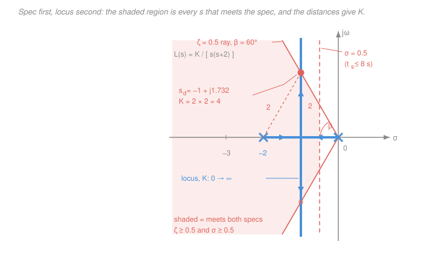
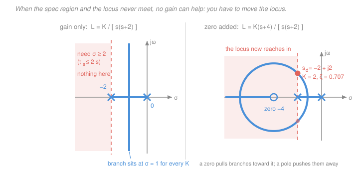

# Control Systems · Lesson 3.2: Root locus — design

> ⏱ ~15 min · Module 3: Root locus & frequency response · Builds on: [3.1 Root locus: construction](03-01-root-locus-construction.md), [2.2 Second-order response](02-02-second-order-response.md), [2.3 Steady-state error & system type](02-03-steady-state-error-system-type.md) · Unlocks: 3.3–3.5 (frequency-domain design), and all of Module 4

## Why this matters

Everything up to here has been **analysis**: you were handed a system and asked what it does. This lesson flips the arrow. You are handed a *requirement* — "overshoot under 16 percent, settled in 8 seconds" — and asked to produce a number: the gain $K$ you will actually dial into the hardware.

The root locus makes that flip almost embarrassingly easy, because it turns a design question into a **geometry question**. The spec becomes a *region* of the s-plane. The locus is a *curve*. Where the curve enters the region, you have your answer, and a ruler measures the gain. That is the whole lesson.

It also delivers the bad news honestly, which is rarer and more valuable: sometimes the curve and the region never meet. No gain works. When that happens the picture tells you *exactly* what to do instead — and that "instead" is Module 4.

## The idea

Two objects, one plane.

**Object one: the spec, drawn as a region.** [2.2](02-02-second-order-response.md) taught that a complex pole pair $s = -\sigma \pm j\omega_d$ has a damping ratio $\zeta$ read off its *angle* and a settling time read off its *distance from the imaginary axis*. So each transient requirement carves the s-plane in a simple way:

- "Not too much overshoot" ⟹ stay within a **wedge** around the negative real axis.
- "Settle fast" ⟹ stay **left of a vertical line**.

Intersect them and you get the shaded region in the figure below: every point in it is an acceptable place for the dominant closed-loop poles to live.

**Object two: the locus, drawn as a curve.** [3.1](03-01-root-locus-construction.md) gave you the sketching rules. The locus is the complete list of places the closed-loop poles are *willing* to go as $K$ sweeps from $0$ to $\infty$. You cannot put a pole anywhere else — not with gain alone.

Design is now trivially stated: **find a point that is on both.** Call it the design point $s_d$. Then read off the gain that puts a pole there — and here is the pretty part — by *measuring lengths with a ruler*. No algebra required.

## The formal version

### Step 1 — translate the spec into a region

Let $s = -\sigma + j\omega_d$ be a candidate dominant pole, with $\sigma > 0$ its distance left of the imaginary axis (units $\mathrm{s^{-1}}$) and $\omega_d$ its damped frequency (rad/s). Write $\omega_n = |s| = \sqrt{\sigma^2 + \omega_d^2}$ for the natural frequency, and let $\beta$ be the angle between $s$ and the **negative** real axis. Then, from [2.2](02-02-second-order-response.md),

$$\zeta = \frac{\sigma}{\omega_n} = \cos\beta.$$

*In words: the damping ratio is the cosine of the angle you make with the negative real axis — so constant $\zeta$ is a straight ray through the origin, and small $\beta$ (close to the real axis) means well damped.*

| Requirement | Formula | Region in the s-plane |
|---|---|---|
| Percent overshoot $M_p \le$ target | $M_p = 100\,e^{-\pi\zeta/\sqrt{1-\zeta^2}}$, invert for $\zeta_{\min}$ | inside the wedge $\beta \le \arccos\zeta_{\min}$ |
| 2 percent settling time $t_s \le$ target | $t_s \approx \dfrac{4}{\zeta\omega_n} = \dfrac{4}{\sigma}$ | left of the vertical line $\sigma = 4/t_s$ |
| Peak time $t_p \le$ target | $t_p = \dfrac{\pi}{\omega_d}$ | above the horizontal line $\omega_d = \pi/t_p$ |
| Rise/speed via $\omega_n \ge$ target | $\omega_n$ = distance from the origin | outside the circle of radius $\omega_n$ |

Inverting the overshoot formula (you will do this constantly):

$$\boxed{\;\zeta_{\min} = \frac{-\ln(M_p/100)}{\sqrt{\pi^2 + \ln^2(M_p/100)}}\;}$$

*In words: pick the overshoot you can tolerate, and this hands you the minimum damping ratio, hence the maximum wedge half-angle $\beta = \arccos\zeta_{\min}$.*

### Step 2 — sketch the locus

Exactly as in [3.1](03-01-root-locus-construction.md): real-axis segments, asymptotes, breakaway points, $j\omega$ crossings.

### Step 3 — intersect

The design point $s_d$ is where the locus first enters the admissible region. If several points qualify, prefer the one giving the most margin against the binding spec — but any point in the region is, by construction, acceptable.

### Step 4 — get the gain from the magnitude condition

Write the open-loop transfer function as $L(s) = K\hat{L}(s)$, with $K$ the adjustable gain and $\hat{L}$ everything else. The closed-loop poles satisfy $1 + L(s) = 0$, which splits into the angle condition ($\angle L = 180^\circ$, used to *find* the locus) and the **magnitude condition** $|L(s_d)| = 1$, used to *find the gain*:

$$\boxed{\;K = \frac{1}{|\hat{L}(s_d)|} = \frac{\prod_i |s_d - p_i|}{\prod_j |s_d - z_j|}\;}$$

where $p_i$ are the open-loop poles and $z_j$ the open-loop zeros of $\hat L$. *In words: the gain is the product of the distances from your design point to every open-loop pole, divided by the product of the distances to every open-loop zero.*

Every term in that formula is a **length on your sketch**. Put a ruler on the paper, measure from $s_d$ to each $\times$ and each $\circ$, multiply and divide. That is genuinely how this was done before computers, and it is still the fastest way to sanity-check a number a computer gave you.

### Step 5 — verify, including the dominant-pole assumption

Steps 1–4 quietly assumed the closed loop behaves like a *second-order* system with poles at $s_d, \bar s_d$. Real loops have more poles than that. So finish the job:

1. Form the closed-loop characteristic polynomial with your $K$ and find **all** its roots (you know two of them — divide them out).
2. Check every other pole is at least **5 times farther left** than $\sigma$. Rule of thumb: $|\mathrm{Re}\{p_{\text{other}}\}| \ge 5\sigma$.
3. Check no closed-loop **zero** sits near the dominant pair — a nearby zero partially cancels a pole's residue and the second-order formulas stop describing the shape.

If the check fails, the $M_p$ and $t_s$ numbers are estimates, not predictions, and you should say so out loud.

## Picture

## Worked examples

### Example 1 — a complete design, all five steps

**Plant.** Unity feedback around $G(s) = \dfrac{K}{s(s+2)}$, so $L(s) = K\hat L(s)$ with $\hat L(s) = \dfrac{1}{s(s+2)}$. This is boss problem 2(a) from the [syllabus](../syllabus.md).

**Spec.** $M_p \le 16.3$ percent and $t_s \le 8$ s.

**Step 1 (region).** Invert the overshoot formula with $M_p/100 = 0.163$: $\ln 0.163 = -1.814$, so

$$\zeta_{\min} = \frac{1.814}{\sqrt{\pi^2 + 1.814^2}} = \frac{1.814}{\sqrt{9.870 + 3.291}} = \frac{1.814}{3.628} = 0.500.$$

So $\beta \le \arccos 0.5 = 60^\circ$: stay inside the $60^\circ$ wedge. And $t_s \le 8$ needs $\sigma \ge 4/8 = 0.5$: stay left of $\mathrm{Re}\{s\} = -0.5$. That is the shaded region above.

**Step 2 (locus).** Two poles, $s = 0$ and $s = -2$, no zeros. The real axis between them is on the locus; the two asymptotes are at $\pm 90^\circ$ from the centroid $(0 + (-2))/2 = -1$; the breakaway is at $s = -1$. So the locus is the segment $[-2,\,0]$ plus **the vertical line $\mathrm{Re}\{s\} = -1$**, running to $\pm j\infty$.

**Step 3 (intersect).** The $\zeta = 0.5$ ray leaves the origin at $180^\circ - 60^\circ = 120^\circ$, i.e. it is the set $s = r(-\tfrac12 + j\tfrac{\sqrt3}{2})$. It meets the vertical line $\mathrm{Re}\{s\} = -1$ when $r/2 = 1$, so $r = 2$:

$$s_d = -1 + j\sqrt{3} = -1 + j1.732 .$$

*Angle check (never skip this).* $\angle s_d = 120^\circ$ and $\angle(s_d + 2) = \angle(1 + j1.732) = 60^\circ$, so $\angle \hat L(s_d) = -(120^\circ + 60^\circ) = -180^\circ$. On the locus. ✓ And $\sigma = 1 \ge 0.5$, so the settling spec is satisfied too, with room to spare.

**Step 4 (gain by ruler).** Two poles, no zeros, so $K$ is just the product of two distances:

$$|s_d - 0| = |-1 + j1.732| = \sqrt{1 + 3} = 2, \qquad |s_d - (-2)| = |1 + j1.732| = \sqrt{1+3} = 2,$$

$$K = 2 \times 2 = \boxed{4}.$$

Both distances are exactly 2 because $s_d$ sits at the apex of an equilateral triangle over the segment from $0$ to $-2$ — which you can *see* on the sketch.

**Step 5 (verify).** The closed loop is $T(s) = \dfrac{K}{s^2 + 2s + K}$. Match to $s^2 + 2\zeta\omega_n s + \omega_n^2$: $2\zeta\omega_n = 2$ and $\omega_n^2 = K$. With $\zeta = 0.5$, $\omega_n = 1/\zeta = 2$ and $K = \omega_n^2 = 4$ — the algebra agrees with the ruler. Roots of $s^2 + 2s + 4$: $s = \dfrac{-2 \pm \sqrt{4 - 16}}{2} = -1 \pm j\sqrt3$. ✓

Predicted response, from [2.2](02-02-second-order-response.md):

$$M_p = 100\,e^{-\pi(0.5)/\sqrt{0.75}} = 100\,e^{-1.814} = 16.3 \text{ percent}, \qquad t_s = \frac{4}{\zeta\omega_n} = \frac{4}{1} = 4\ \text{s},$$

with peak time $t_p = \pi/\omega_d = \pi/1.732 = 1.81$ s. There are only two closed-loop poles, so the dominant-pole check is automatic. Design complete: **set $K = 4$.**

### Example 2 — step 5 done honestly: when the third pole bites

**Plant.** $\hat L(s) = \dfrac{1}{(s+1)^3}$ — three coincident poles at $s = -1$ (three identical lags in series: a common shape).

**Design.** Branches leave the triple pole along the asymptotes at $60^\circ, 180^\circ, 300^\circ$ from the centroid $-1$, and here the branches *are* those rays exactly, because $(s+1)^3 = -K$ forces $|s+1| = K^{1/3}$ at angle $60^\circ$. Aiming for $\zeta = 0.5$ means intersecting the $120^\circ$ ray from the origin, $s = r(-\tfrac12 + j\tfrac{\sqrt3}{2})$, with the locus ray $s = -1 + \rho(\tfrac12 + j\tfrac{\sqrt3}{2})$. Matching imaginary parts gives $r = \rho$; matching real parts gives $-\tfrac{r}{2} = -1 + \tfrac{r}{2}$, so $r = 1$ and

$$s_d = -1 + 1\cdot e^{j60^\circ} = -0.5 + j0.866, \qquad |s_d| = 1,\; \zeta = 0.5/1 = 0.5 .$$

Magnitude condition: $K = |s_d + 1|^3 = 1^3 = 1$.

**Now step 5.** Characteristic polynomial $(s+1)^3 + 1 = s^3 + 3s^2 + 3s + 2$. Divide out the pair $s^2 + s + 1$ (whose roots are $-0.5 \pm j0.866$, with $\omega_n = 1$, $\zeta = 0.5$):

$$s^3 + 3s^2 + 3s + 2 = (s+2)(s^2 + s + 1).$$

The third pole is at $s = -2$. Ratio to the dominant real part: $2/0.5 = 4$. **Under the 5 threshold — the check fails.** The second-order formulas predict $M_p = 16.3$ percent, $t_p = \pi/0.866 = 3.63$ s, $t_s = 4/0.5 = 8$ s. Inverting the actual third-order step response gives

$$\hat y(t) = 1 - \tfrac13 e^{-2t} - \tfrac43 e^{-0.5t}\cos(0.866\,t - \pi/3),$$

whose true peak is $\hat y = 1.139$ at $t = 4.23$ s, and which stays inside the 2 percent band only after $t \approx 8.4$ s. So the real numbers are $M_p \approx 13.9$ percent (less than predicted) at $t_p \approx 4.23$ s (17 percent later than predicted), settling at $8.4$ s (later than predicted).

That is the general pattern worth memorising: **an extra left-half-plane pole slows the response down and shaves the overshoot; an extra left-half-plane zero speeds it up and adds overshoot.** Here the estimate was optimistic about speed. Nothing catastrophic — but if the spec were $t_s \le 8$ s exactly, you would have shipped a design that misses.

(Also worth noting: this plant is type 0, so its position error constant is $K_p = \lim_{s\to0} L(s) = K = 1$, and the step response settles at $K_p/(1+K_p) = 0.5$ — a steady-state error of $1/(1+K_p) = 0.5$, per [2.3](02-03-steady-state-error-system-type.md). The locus says nothing about that; you check it separately.)

### Example 3 — when no gain works, and what to do about it

**Same plant as Example 1**, $\hat L(s) = \dfrac{1}{s(s+2)}$, but now the spec tightens: $t_s \le 2$ s, still with $\zeta \ge 0.5$.

**Step 1.** $t_s \le 2$ needs $\sigma \ge 4/2 = 2$: the dominant poles must lie **left of $\mathrm{Re}\{s\} = -2$**.

**Step 3 fails, and it fails permanently.** Look at the locus. Once $K > 1$ the two closed-loop poles are $s = -1 \pm j\sqrt{K-1}$ — the real part is **exactly $-1$ for every such $K$**. Raising the gain moves the poles *up and down*, never left. (For $K < 1$ the poles are real at $-1 \pm \sqrt{1-K}$, and the slower one is to the *right* of $-1$, which is worse.) So

$$\sigma_{\max} = 1 \quad\Longrightarrow\quad t_s \ge 4\ \text{s for every } K > 0 .$$

The required region and the locus are disjoint sets. This is not "try harder with the gain"; it is a proof that **no proportional controller can meet this spec.** Note what it means physically: on this plant, $K$ has *zero authority* over settling time. It only trades overshoot against steady-state error.

**The fix: move the locus.** The locus is determined by the open-loop poles and zeros. If you don't like where it goes, add poles or zeros — that is precisely what a **compensator** is. The governing intuition:

> **A zero pulls the locus toward itself; a pole pushes the locus away from itself.** So a zero planted out to the left drags branches leftward — faster, better damped, stabilising. An added pole shoves them rightward — slower, less damped, destabilising.

Add a zero at $s = -4$, i.e. $\hat L(s) = \dfrac{s+4}{s(s+2)}$. The complex part of this locus is a **circle centred on the zero**, radius $2\sqrt2 \approx 2.83$, leaving the real axis at $-4 + 2\sqrt2 = -1.17$ and re-entering at $-4 - 2\sqrt2 = -6.83$. It sweeps deep into the admissible region:

Take the point on that circle where $\sigma = 2$ exactly, $s_d = -2 + j2$.

*Angle check:* $\angle(s_d + 4) - \angle s_d - \angle(s_d+2) = 45^\circ - 135^\circ - 90^\circ = -180^\circ$. ✓
*Magnitude condition:* $K = \dfrac{|s_d|\,|s_d + 2|}{|s_d+4|} = \dfrac{2\sqrt2 \cdot 2}{2\sqrt2} = 2$.
*Verify:* characteristic polynomial $s(s+2) + K(s+4) = s^2 + (2+K)s + 4K = s^2 + 4s + 8$, roots $-2 \pm j2$. ✓ Then $\omega_n = 2\sqrt2$, $\zeta = 2/(2\sqrt2) = 0.707$, $t_s = 4/2 = 2$ s, $M_p = 100e^{-\pi} = 4.3$ percent. Spec met.

Two bonuses fall out of the picture. First, the tangent line from the origin to that circle makes $45^\circ$ with the *negative* real axis (its centre is $4$ away, its radius $2\sqrt2$, and $\arcsin(2\sqrt2/4) = 45^\circ$), so **every complex point on this locus has $\zeta \ge \cos 45^\circ = 0.707$** — the overshoot spec is now satisfied automatically, whatever gain you pick. Second, gain has regained its authority over speed: push to $K = 6$ and the poles move to $-4 \pm j2\sqrt2$, giving $t_s = 1$ s.

The catch: a pure zero, $G_c(s) = K(s+4)$, is a differentiator — improper, noise-amplifying, unbuildable on its own. Real compensators pair the zero with a far-off pole, $G_c(s) = K\dfrac{s+z}{s+p}$ with $p \gg z$, which keeps most of the leftward pull while staying realisable. That is the **lead compensator** of [4.3](04-03-lead-lag-compensators.md), and the derivative term of a PID controller ([4.1](04-01-pid-control.md)) is the same idea wearing different clothes.

### Putting Module 2 on one picture

Turn a single knob, $K$, and watch three separate consequences move together along the locus:

| Raising $K$ | Effect | Where you learned it |
|---|---|---|
| Steady-state error | **falls** ($e_{ss} = 1/K_v$, and $K_v \propto K$) | [2.3](02-03-steady-state-error-system-type.md) |
| Damping ratio $\zeta$ | **falls**, so overshoot **rises** (poles climb the locus, $\beta$ grows) | [2.2](02-02-second-order-response.md) |
| Stability | eventually **lost**, when a branch crosses into $\mathrm{Re}\{s\} > 0$ | [2.4](02-04-stability-routh-hurwitz.md) |

Concretely for $\hat L = \dfrac{1}{s(s+2)(s+6)}$: $K_v = K/12$ so error falls as $1/K$; $\zeta$ falls as the branches climb; and the Routh array on $s^3 + 8s^2 + 12s + K$ gives instability at $K = 96$. All three facts are one curve. **That is why the picture is worth drawing.**

## Watch out

- **You might think the magnitude condition alone hands you the gain. It doesn't — the angle condition has to hold first, and skipping it fails silently.** $K = \prod|s_d - p_i| / \prod|s_d - z_j|$ returns a perfectly cheerful positive number for *any* point $s_d$ in the plane, on the locus or not. It is only the gain that places a closed-loop pole at $s_d$ if $s_d$ actually satisfies $\angle L(s_d) = 180^\circ$. Verify the angle first, then measure.
- **You might think "dominant" means "the two poles I designed".** It means "the poles closest to the imaginary axis, by a wide margin". Naming a pair dominant does not make it so. Example 2's design was perfectly correct arithmetic attached to an invalid assumption — the honest report is "$M_p \approx 14$ percent, $t_s \approx 8.4$ s", not "$16.3$ percent, $8$ s".
- **You might think a spec you can't meet means you chose the wrong $K$.** More often the locus simply doesn't go there, and no $K$ exists. Diagnose it geometrically (region and curve are disjoint) rather than hunting numerically — the geometry also tells you *which way* to bend the locus, and hence whether you need a zero (pull left) or a pole (push right).
- **You might think $t_s = 4/\sigma$ is exact.** It is the 2 percent envelope estimate, ignoring the cosine's zero-crossings and valid only for a dominant complex pair. For a critically damped or overdamped closed loop it is noticeably wrong (a double pole at $-1$ actually settles at $t \approx 5.8$ s, not 4 s).

## One-liner

> Draw the spec as a region, draw the locus as a curve, put your design point where they cross, and read the gain off as a ratio of measured distances — and if they never cross, stop turning the knob and start reshaping the locus.

## Problems

**P1 (🟢)** Unity feedback around $G(s) = \dfrac{K}{s(s+4)}$. Find the gain $K$ that gives $\zeta = 0.707$, using the magnitude condition on the locus. Then verify by factoring the closed-loop characteristic polynomial, and report $M_p$ and the 2 percent settling time.

**P2 (🟡)** For $\hat L(s) = \dfrac{1}{s(s+2)(s+6)}$, the claim is that $s_d = -0.75 + j1.299$ lies on the locus. (a) Confirm it with the angle condition. (b) Find $K$ from the magnitude condition. (c) Find the third closed-loop pole and decide whether the dominant-pole assumption is safe.

**P3 (🔴)** Unity feedback around $G(s) = \dfrac{K}{s(s+2)}$ again, with two requirements: steady-state error to a unit ramp no more than $0.05$, **and** percent overshoot no more than $20$. Show that no single value of $K$ satisfies both, by turning each requirement into an inequality on $K$. Which kind of compensator would you reach for?

Solutions

**P1** Open-loop poles at $0$ and $-4$, no zeros. The locus is the real segment $[-4, 0]$ plus the vertical line through the centroid, $\mathrm{Re}\{s\} = -2$.

$\zeta = 0.707$ means $\beta = \arccos 0.707 = 45^\circ$, so the design ray from the origin is at $180^\circ - 45^\circ = 135^\circ$, i.e. points $s = r(-\tfrac{1}{\sqrt2} + j\tfrac{1}{\sqrt2})$. It meets $\mathrm{Re}\{s\} = -2$ when $r/\sqrt2 = 2$, so $r = 2\sqrt2$ and

$$s_d = -2 + j2 .$$

*Angle check:* $\angle s_d = \angle(-2 + j2) = 135^\circ$, $\angle(s_d + 4) = \angle(2 + j2) = 45^\circ$; sum $= 180^\circ$, so $\angle \hat L(s_d) = -180^\circ$. ✓ On the locus.

*Magnitude condition:*

$$K = |s_d|\cdot|s_d + 4| = |-2+j2|\cdot|2+j2| = 2\sqrt2 \cdot 2\sqrt2 = 8 .$$

*Verification.* Characteristic polynomial $s(s+4) + K = s^2 + 4s + 8$, whose roots are

$$s = \frac{-4 \pm \sqrt{16 - 32}}{2} = \frac{-4 \pm j4}{2} = -2 \pm j2 .$$

The design point came back out. ✓

Matching $s^2 + 2\zeta\omega_n s + \omega_n^2$: $\omega_n = \sqrt8 = 2\sqrt2 = 2.828$, and $2\zeta\omega_n = 4 \Rightarrow \zeta = 4/(2\cdot 2.828) = 0.707$. ✓

$$M_p = 100\,e^{-\pi(0.707)/\sqrt{1 - 0.5}} = 100\,e^{-\pi(0.707)/0.707} = 100\,e^{-\pi} = 4.3 \text{ percent},$$
$$t_s = \frac{4}{\zeta\omega_n} = \frac{4}{2} = 2\ \text{s}.$$

*Check.* $\zeta = 1/\sqrt2$ always gives exactly $e^{-\pi}$ overshoot — a useful landmark to memorise. Only two closed-loop poles exist, so dominance is automatic.

**P2** (a) Compute the three pole-vector angles at $s_d = -0.75 + j1.299$:

- $\angle(s_d - 0) = \angle(-0.75 + j1.299)$: second quadrant, $\arctan(1.299/0.75) = 60^\circ$, so the angle is $180^\circ - 60^\circ = 120^\circ$.
- $\angle(s_d + 2) = \angle(1.25 + j1.299) = \arctan(1.0392) = 46.10^\circ$.
- $\angle(s_d + 6) = \angle(5.25 + j1.299) = \arctan(0.24743) = 13.90^\circ$.

$$\angle \hat L(s_d) = -(120 + 46.10 + 13.90)^\circ = -180^\circ .$$

The point is on the locus. (Its damping ratio is $\zeta = 0.75/\sqrt{0.75^2 + 1.299^2} = 0.75/1.5 = 0.5$.)

(b) Magnitude condition — three distances, no zeros:

$$|s_d| = \sqrt{0.5625 + 1.6875} = \sqrt{2.25} = 1.5,$$
$$|s_d + 2| = \sqrt{1.5625 + 1.6875} = \sqrt{3.25}, \qquad |s_d + 6| = \sqrt{27.5625 + 1.6875} = \sqrt{29.25},$$
$$K = 1.5\sqrt{3.25}\sqrt{29.25} = 1.5\sqrt{95.0625} = 1.5 \times 9.75 = 14.625 .$$

(c) Characteristic polynomial: $s(s+2)(s+6) + K = s^3 + 8s^2 + 12s + 14.625$. The sum of the roots is $-8$; two of them sum to $-1.5$, so the third is $-6.5$. Confirm by multiplying out:

$$(s + 6.5)(s^2 + 1.5s + 2.25) = s^3 + 8s^2 + 12s + 14.625 .$$

That reproduces the polynomial exactly. ✓

(The quadratic factor $s^2 + 1.5s + 2.25$ has $\omega_n = 1.5$, $\zeta = 1.5/(2\cdot1.5) = 0.5$, roots $-0.75 \pm j1.299$ — matching (a).)

Dominance: $|{-6.5}| / 0.75 = 8.67 \ge 5$, and there are no closed-loop zeros. **Safe.** So the second-order estimates stand: $M_p = 16.3$ percent, $t_s = 4/0.75 = 5.33$ s.

**P3** *Error requirement.* $\hat L = 1/[s(s+2)]$ is type 1, so the ramp error constant is

$$K_v = \lim_{s\to0} s\,L(s) = \lim_{s\to0}\frac{K}{s+2} = \frac{K}{2}, \qquad e_{ss} = \frac{1}{K_v} = \frac{2}{K}.$$

$e_{ss} \le 0.05$ requires $2/K \le 0.05$, i.e. $\;K \ge 40$.

*Overshoot requirement.* Closed loop $s^2 + 2s + K$, so $2\zeta\omega_n = 2$, $\omega_n = \sqrt K$, giving $\zeta = 1/\sqrt K$. Invert the overshoot formula at $M_p = 20$: $\ln 0.20 = -1.6094$, so

$$\zeta_{\min} = \frac{1.6094}{\sqrt{\pi^2 + 1.6094^2}} = \frac{1.6094}{\sqrt{9.8696 + 2.5903}} = \frac{1.6094}{3.5299} = 0.4559 .$$

$\zeta = 1/\sqrt K \ge 0.4559$ requires $\;K \le 1/0.4559^2 = 4.81$.

*The conflict.* The two requirements are $K \ge 40$ and $K \le 4.81$ — an empty intersection, so **no gain works**. (Sanity check the extreme: at $K = 40$, $\zeta = 1/\sqrt{40} = 0.158$ and $M_p = 100e^{-\pi(0.158)/\sqrt{1-0.025}} = 100e^{-0.503} = 60.5$ percent. Wildly over.)

Geometrically: raising $K$ drives the poles straight up the line $\mathrm{Re}\{s\} = -1$, so $\zeta = \cos\beta$ collapses as $\beta \to 90^\circ$, while the error keeps improving. One knob, two demands pulling opposite ways.

*Resolution.* You need low-frequency gain (for $K_v$) without the extra phase lag showing up near the closed-loop poles — that is a **lag compensator**, $G_c(s) = K_c\dfrac{s+z}{s+p}$ with $p < z$, both close to the origin: it multiplies $K_v$ by $z/p$ while barely moving the locus near $s_d$. (A lead compensator would be the answer to a *speed* or *phase-margin* shortfall instead.) This is boss problem 4's situation, and it's built in [4.3](04-03-lead-lag-compensators.md).

## Flashback

**From Lesson 2.4 (Stability & Routh–Hurwitz):** A unity-feedback loop has forward path $G(s) = \dfrac{K(s+1)}{s(s+2)(s+5)}$ — note the compensator zero at $s = -1$. Use the Routh array to find every $K > 0$ for which the closed loop is stable. *(Fresh variant: the zero is new.)*

Solution

Characteristic equation $1 + G(s) = 0$, i.e. $s(s+2)(s+5) + K(s+1) = 0$. Expand $s(s+2)(s+5) = s(s^2 + 7s + 10) = s^3 + 7s^2 + 10s$, so

$$s^3 + 7s^2 + (10 + K)s + K = 0 .$$

Routh array (the zero has pushed $K$ into *two* coefficients, not one):

| | | |
|---|---|---|
| $s^3$ | $1$ | $10 + K$ |
| $s^2$ | $7$ | $K$ |
| $s^1$ | $\dfrac{7(10+K) - K}{7} = \dfrac{70 + 6K}{7}$ | $0$ |
| $s^0$ | $K$ | |

For $K > 0$, both $\dfrac{70 + 6K}{7}$ and $K$ are positive, so there is **no sign change in the first column for any positive gain**:

$$\boxed{\text{stable for every } K > 0}$$

*Check, two ways.* (i) Numerically at $K = 1000$: the roots of $s^3 + 7s^2 + 1010s + 1000$ are $-3.002 \pm j31.54$ and $-0.996$ — all in the left half-plane. (ii) By this lesson's geometry: three poles and one zero leave $3 - 1 = 2$ asymptotes at $\pm 90^\circ$, centred at

$$\sigma_a = \frac{(0 - 2 - 5) - (-1)}{3 - 1} = \frac{-6}{2} = -3,$$

so the two runaway branches climb the line $\mathrm{Re}\{s\} = -3$ and never cross into the right half-plane, while the third branch is captured by the zero at $-1$. Compare the same plant *without* the zero, $K/[s(s+2)(s+5)]$: three asymptotes at $\pm 60^\circ$ and $180^\circ$, two of which head right, and Routh gives the finite limit $K < 70$. That is the "a zero pulls the locus left, and left is stabilising" claim from Example 3, made quantitative.

## Connections

- **Backward:** the spec-to-region translation is [2.2](02-02-second-order-response.md) read backwards ($\zeta = \cos\beta$, $t_s = 4/\sigma$), the locus itself is [3.1](03-01-root-locus-construction.md), the magnitude condition is the other half of the $1 + L(s) = 0$ split, and the gain trade-off ties together [2.3](02-03-steady-state-error-system-type.md) and [2.4](02-04-stability-routh-hurwitz.md). The "poles are the modes" reading of the s-plane is [1.4](01-04-transfer-functions-poles-zeros.md), developed at length in [`signals-systems` 2.5](../../signals-systems/lessons/02-05-transfer-functions-poles-zeros.md).
- **Forward:** Example 3's dead end is the entire motivation for Module 4 — [4.1](04-01-pid-control.md) (the derivative term as a zero you add), [4.3](04-03-lead-lag-compensators.md) (lead and lag networks placed deliberately). [3.3](03-03-frequency-response-bode-plots.md)–[3.4](03-04-gain-and-phase-margins.md) will re-run this same design conversation in the frequency domain, where the spec becomes a *phase margin* rather than a wedge; and [5.4](05-04-pole-placement-observers.md) will show that with full state feedback you can place **every** pole exactly where you like, no locus intersection required — which is precisely what makes state space feel like cheating after this lesson.
- **Sideways:** "find where a curve meets a feasible region, then read off the parameter" is the same move as a graphical linear program, and the dominant-pole approximation is the same instinct as keeping the leading eigenvalue in a linear ODE system ([`ode-refresher` 3.1](../../ode-refresher/lessons/03-01-linear-systems-eigenvalues.md)) or the slowest mode of a vibrating structure.
