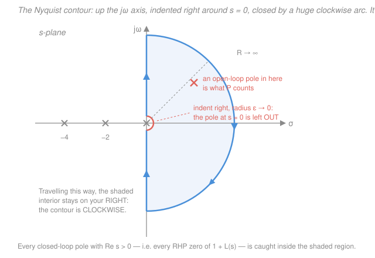
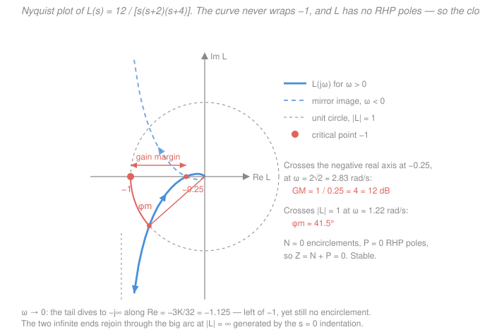

# Control Systems · Lesson 3.5: The Nyquist criterion

> ⏱ ~15 min · Module 3: Root locus & frequency response · Builds on: [3.4 Gain & phase margins](03-04-gain-and-phase-margins.md), [2.4 Stability & Routh–Hurwitz](02-04-stability-routh-hurwitz.md), [`complex-analysis` 6.3](../../complex-analysis/lessons/06-03-argument-principle-rouche.md) · Unlocks: [4.3 Lead & lag compensators](04-03-lead-lag-compensators.md), and every robustness argument after it

## Why this matters

The margins of [3.4](03-04-gain-and-phase-margins.md) are a rule of thumb wearing a lab coat. They work beautifully on the well-behaved loop — one crossing of $0\ \text{dB}$, one crossing of $-180^\circ$, phase falling monotonically — and they lie in two situations you will absolutely meet:

1. **Conditionally stable loops.** Some loops go *unstable if you turn the gain down*. Their phase dips below $-180^\circ$ and comes back up, so the Bode plot has several $-180^\circ$ crossings and "the gain margin" is not even well defined. Reading a single margin off such a plot can hand you a confident, wrong verdict.
2. **Open-loop-unstable plants.** An inverted pendulum, a magnetically levitated bearing, a fighter aircraft deliberately built statically unstable — these have $L(s)$ with poles in the right half-plane before you close the loop. For these the usual reading is *inverted*: "no $-180^\circ$ crossing" means unstable, not stable. Bode margins alone simply cannot tell you.

Nyquist replaces the rule of thumb with a theorem. It answers, exactly and with no approximation: **given the open-loop transfer function $L(s)$ — the thing you can measure with a signal generator on the real hardware, without ever closing the loop — is the closed loop stable?** It is the only classical tool that is *complete*, and it is where the mysterious critical point $-1$ finally gets explained instead of asserted.

## The idea

Closed-loop stability is a question about roots. For the unity-feedback loop $T(s) = \dfrac{L(s)}{1+L(s)}$, the closed-loop poles are the roots of

$$1 + L(s) = 0.$$

We want to know **how many of those roots sit in the right half-plane (RHP)**. We do *not* want to compute them — that's the whole point; $L$ may be a measured frequency response with no polynomial behind it at all.

So here is the trick, and it is the only genuinely new idea in the lesson.

> **Walk a closed path around the entire right half-plane, watch where $1+L(s)$ goes, and count how many times its image loops around the origin.**

Why does that count roots? Think of $1+L(s)$ as a product of factors $(s - z_i)$ over factors $(s - p_k)$. As $s$ walks once around a closed path, each factor $(s-z_i)$ contributes a rotation to the output angle: if $z_i$ is **inside** the path, the vector from $z_i$ to $s$ makes one full turn, so that factor spins the image around the origin exactly once. If $z_i$ is **outside**, the vector wiggles back and forth and returns without a net turn — zero contribution. Denominator factors do the same thing but with the opposite sign, since a pole's angle enters with a minus.

Net result: **each enclosed zero of $1+L$ winds the image once around the origin one way; each enclosed pole winds it once the other way.** Count net windings, and you have counted (zeros $-$ poles) inside. That's it. This is exactly the **argument principle** you proved in [`complex-analysis` 6.3](../../complex-analysis/lessons/06-03-argument-principle-rouche.md) — we use it here as a black box rather than reproving it.

Two more moves finish the job:

- **The path** we walk has to be the boundary of the right half-plane, since that's the region whose root count we care about. That's the *Nyquist contour*.
- **The plot** we actually draw is $L$, not $1+L$. Adding $1$ just slides the whole picture right by one unit, so watching $1+L$ encircle $\mathbf{0}$ is identical to watching $L$ encircle $\mathbf{-1}$. That is the entire reason $-1$ is the critical point of classical control — the same $-1$ you measured margins against in [3.4](03-04-gain-and-phase-margins.md), now derived rather than declared.

And the winding count only ever comes out an integer, which is the small miracle: a smooth, wobbly, measured curve answers a yes/no question with an integer.

## The formal version

### The contour

The **Nyquist contour** $\Gamma$ is the boundary of the right half-plane, traversed **clockwise**:

1. Up the imaginary axis from $s=-j\infty$ to $s=+j\infty$;
2. Closed by a semicircle $s = Re^{j\theta}$, $R\to\infty$, with $\theta$ swinging from $+90^\circ$ down to $-90^\circ$ through the right half-plane.

*In words: go up the $j\omega$ axis, then loop back around the right half-plane at infinite radius.* Walk it in that order and the enclosed region — the whole RHP — stays on your right, which is what "clockwise" means here.

**The indentation.** The argument principle forbids zeros or poles *on* the contour. A pole of $L$ sitting on the $j\omega$ axis — overwhelmingly, the **integrator at $s=0$** that every Type-1 system has — must be dodged. Convention: dodge it with a **small semicircle of radius $\varepsilon\to0$ bulging into the right half-plane**, so the pole is left *outside* the enclosed region.

That indentation is where beginners get lost, so here is exactly what it does. Near $s=0$, a Type-1 loop looks like $L(s)\approx K_v/s$ (with $K_v$ the velocity error constant of [2.3](02-03-steady-state-error-system-type.md)). On the indentation, $s = \varepsilon e^{j\theta}$ with $\theta$ running $-90^\circ \to 0^\circ \to +90^\circ$, so

$$L \approx \frac{K_v}{\varepsilon}e^{-j\theta} \quad\longrightarrow\quad \text{radius } \frac{K_v}{\varepsilon}\to\infty, \text{ angle running } +90^\circ \to 0^\circ \to -90^\circ .$$

*In words: a tiny half-loop around $s=0$ maps to a giant half-loop of infinite radius, swept clockwise, from $+j\infty$ around through $+\infty$ on the real axis down to $-j\infty$.* Physically: an integrator has infinite gain at DC, so as $\omega\to0$ the plot runs off the page; the big arc is the bookkeeping that connects the runaway end of the $\omega<0$ branch to the runaway end of the $\omega>0$ branch. Because it sweeps through the **right** side of the plane at infinite radius, it never wraps $-1$ — one integrator costs you nothing in the encirclement count. (Two integrators give a full $360^\circ$ clockwise sweep, and *that* one can bite.)

### The criterion

Apply the argument principle to $f(s) = 1+L(s)$ on the clockwise contour $\Gamma$, and translate "encircle $0$ with $1+L$" into "encircle $-1$ with $L$":

$$\boxed{\,Z = N + P\,}$$

- $Z$ — number of **closed-loop** poles in the RHP, i.e. RHP zeros of $1+L$. **You want $Z=0$.**
- $N$ — number of **clockwise** encirclements of the point $-1$ by the plot of $L(s)$ as $s$ traverses $\Gamma$. Counterclockwise encirclements count as **negative** $N$.
- $P$ — number of **open-loop** poles of $L(s)$ in the RHP. (Poles of $1+L$ are the poles of $L$: adding $1$ changes no denominator. So $P$ is read straight off the factored $L$, or off the plant datasheet — never off a measurement.)

*In words: the RHP closed-loop pole count equals the clockwise winding number around $-1$, plus however many RHP poles you started with.*

**Sign convention — read this twice.** Textbooks disagree. Some traverse the contour counterclockwise and write $Z = P - N$; some define $N$ as counterclockwise encirclements. Every version is correct with its own conventions and every mix-up is a sign error that flips your verdict. **Fix one convention (the boxed one above: clockwise contour, clockwise $N$, $Z=N+P$), and sanity-check it once on a system you already know is stable.** Do that check before you trust the machinery on anything real.

**The special case you will use 90 percent of the time.** If the open-loop plant is itself stable, $P=0$, and the criterion collapses to:

> **No encirclements of $-1$ $\Rightarrow$ closed loop stable.** Any encirclement $\Rightarrow$ unstable, with $N$ telling you how many bad poles.

**The special case that justifies the whole apparatus.** If $P>0$, you *need* $N=-P$: exactly $P$ **counterclockwise** encirclements of $-1$. Here "the curve wraps $-1$" is the good outcome — the opposite of the reflex you just built.

### Drawing the plot

There is no mystery to the curve. The Nyquist plot **is the Bode plot of [3.3](03-03-frequency-response-bode-plots.md) replotted in polar form**: at each $\omega$, take the magnitude $|L(j\omega)|$ as a radius and the phase $\angle L(j\omega)$ as an angle, and drop a dot in the complex plane. Same data, one curve instead of two, frequency now an unlabelled parameter running along it.

For real-coefficient systems $L(-j\omega) = \overline{L(j\omega)}$, so the $\omega<0$ half is the **mirror image** of the $\omega>0$ half across the real axis. Draw the positive-frequency half, reflect it, and you have the whole thing. (And the infinite arc: for any strictly proper $L$, $|L|\to0$ on it, so it maps to the single point at the origin and contributes nothing — unless there are $j\omega$-axis poles, which is what the indentation handles.)

## Picture

The two margins of [3.4](03-04-gain-and-phase-margins.md) are now *geometry on one picture*:

- **Gain margin** — where the curve crosses the negative real axis. If it crosses at $-a$ (with $0<a<1$), you may multiply the gain by $1/a$ before that crossing lands on $-1$. So $\text{GM} = 1/a$, or $-20\log_{10} a$ in dB.
- **Phase margin** — where the curve crosses the **unit circle** ($|L|=1$). The angle from the negative real axis to that crossing is $\phi_m$: rotate the curve clockwise by $\phi_m$ (which is exactly what added phase lag does) and the crossing lands on $-1$.
- **Vector margin** — the honest single number: the shortest distance from $-1$ to the curve, $\min_\omega |1+L(j\omega)|$. Gain and phase margins each probe one direction; the vector margin asks how close the curve gets to disaster *at all*, and a loop can have handsome values of both classical margins while sneaking within $0.2$ of $-1$ diagonally.

## Worked examples

### Example 1 — the running system, third opinion

Take the unity-feedback loop with $L(s) = \dfrac{K}{s(s+2)(s+4)}$, $K>0$. Expand the denominator: $s(s+2)(s+4) = s^3+6s^2+8s$. Substituting $s=j\omega$ and using $j^2=-1$, $j^3=-j$:

$$L(j\omega) = \frac{K}{-j\omega^3 - 6\omega^2 + 8j\omega} = \frac{K}{\underbrace{-6\omega^2}_{\text{real}} + j\,\underbrace{(8\omega-\omega^3)}_{\text{imaginary}}}.$$

**Where does it cross the negative real axis?** When the denominator is purely real:

$$8\omega - \omega^3 = 0 \;\Longrightarrow\; \omega^2 = 8 \;\Longrightarrow\; \omega = 2\sqrt2 \approx 2.83\ \text{rad/s}.$$

There the denominator is $-6(8) = -48$, so

$$L(j2\sqrt2) = \frac{K}{-48} = -\frac{K}{48}.$$

**Shape.** One RHP-free plant, one integrator, so $P=0$ and the contour indents at $s=0$. As $\omega\to0^+$, $L\to K/(8j\omega)$: magnitude $\to\infty$ at phase $-90^\circ$, i.e. the tail dives toward $-j\infty$ (its asymptote is the vertical line $\operatorname{Re}L = -3K/32$). As $\omega\to\infty$, $|L|\to0$ at phase $-270^\circ$, so the curve spirals into the origin from the $+j$ side. In between it crosses the negative real axis once, at $-K/48$. Mirror it, close through the infinite arc on the right, and you have the figure above (drawn for $K=12$).

**The verdict.** $-1$ is encircled exactly when the crossing point lies to the *left* of $-1$:

$$\frac{K}{48} > 1 \;\Longleftrightarrow\; K > 48 \;\Longrightarrow\; N=2 \text{ (clockwise)},\; Z = 2+0 = 2 \;\text{— unstable, two RHP poles}.$$

$$\frac{K}{48} < 1 \;\Longleftrightarrow\; \boxed{0<K<48}\;\Longrightarrow\; N=0,\; Z=0 \;\text{— stable}.$$

(Why $N=2$ and not $1$? Both the $\omega>0$ branch and its mirror sweep past the crossing point, so the closed curve wraps twice — matching the two poles that cross into the RHP as a conjugate pair.)

**Three methods, one number.** This is the payoff of the whole module:

| Method | Where it lives | Answer |
|---|---|---|
| Routh–Hurwitz array on $s^3+6s^2+8s+K$ | [2.4](02-04-stability-routh-hurwitz.md) | stable for $0<K<48$ |
| Root locus $j\omega$ crossing at $\omega = 2\sqrt2$ | [3.1](03-01-root-locus-construction.md) | critical $K = 48$ |
| Nyquist crossing $-K/48$ reaching $-1$ | this lesson | critical $K = 48$ |

Three completely independent arguments — an algebraic array, a pole-migration sketch, and a winding number — land on $K=48$ and $\omega=2\sqrt2$. Nothing else in classical control gives you that kind of triangulated confidence, and when a design problem gives you the chance to cross-check like this, take it.

At $K=12$ (the figure): the crossing is at $-12/48 = -0.25$, so $\text{GM} = 1/0.25 = 4$, i.e. $20\log_{10}4 = 12.0\ \text{dB}$, and the unit-circle crossing sits at $\omega\approx1.22$ with $\phi_m\approx41.5^\circ$. The vector margin is about $0.53$, near $\omega\approx1.7$ — noticeably tighter than either classical margin suggests, which is the point of measuring it.

### Example 2 — an unstable plant, where the intuition inverts

Let $L(s) = \dfrac{K}{s-1}$, $K>0$: a plant with an open-loop pole at $s=+1$. So $P=1$.

$$L(j\omega) = \frac{K}{j\omega-1} = \frac{K(-1-j\omega)}{1+\omega^2} \;\Longrightarrow\; \operatorname{Re}L = \frac{-K}{1+\omega^2},\quad \operatorname{Im}L = \frac{-K\omega}{1+\omega^2}.$$

Check a few points: $\omega=0$ gives $-K$; $\omega=1$ gives $-K/2 - jK/2$; $\omega\to\infty$ gives $0$. In fact the whole plot is the **circle of radius $K/2$ centred at $-K/2$** (verify: the distance from $-K/2$ to $-K/2-jK/2$ is $K/2$). The $\omega>0$ branch is the lower half, its mirror the upper half; together, one closed circle from $0$ out to $-K$ and back.

**Direction.** Traverse in contour order, $\omega: -\infty \to 0 \to +\infty$. That starts at the origin, goes up through $-K/2+jK/2$, reaches $-K$ at $\omega=0$, comes down through $-K/2-jK/2$, and returns to the origin: right $\to$ up $\to$ left $\to$ down, which is **counterclockwise**.

**The verdict.** The point $-1$ lies inside that circle exactly when $K>1$.

- $K>1$: one counterclockwise encirclement, so $N=-1$, and $Z = -1 + 1 = 0$ — **stable**.
- $K<1$: no encirclement, $N=0$, and $Z = 0+1 = 1$ — **unstable**, one RHP closed-loop pole.

*Check, directly:* $1 + \dfrac{K}{s-1} = 0 \Rightarrow s = 1-K$, which is in the left half-plane precisely when $K>1$. The criterion is right, and note what it said: for this plant **you must wrap $-1$ to be safe.** A Bode-margin reading of "the phase never hits $-180^\circ$, no gain margin issue, looks fine" would have called $K=0.5$ stable. It isn't. That is the case the whole apparatus exists for.

## Watch out

- **You might think "the curve passes to the left of $-1$, so it's unstable."** Encirclement is about *winding*, not about position. In the Picture, the low-frequency tail runs out to $\operatorname{Re}L = -1.125$, genuinely left of $-1$ — but far below it, so the curve never wraps it and the loop is stable. Ask "does a rubber band from $-1$ to a point on the curve wind around as the point traverses?", never "is $-1$ to the right of some bit of the curve?"
- **You might forget that $P$ counts open-loop poles, not closed-loop ones.** $P$ is free information about the plant you already have; $Z$ is the unknown you're solving for. Reading them backwards inverts every conclusion. And with the right-side indentation, poles *on* the $j\omega$ axis (integrators) are excluded from the enclosed region, so they do **not** contribute to $P$.
- **You might mix conventions mid-problem.** Clockwise contour, clockwise $N$, $Z=N+P$ — or the mirror-image set, consistently. Never half of each. If a verdict surprises you, re-derive the sign on a first-order example you can solve by hand before you believe it.
- **You might drop the mirror half.** Counting encirclements from the $\omega>0$ branch alone halves your answer. In Example 1 that turns $N=2$ into $N=1$, and $Z=2$ into $Z=1$ — still "unstable", but the pole count is now wrong, and on other systems the verdict itself flips.

## One-liner

> Walk the boundary of the right half-plane, watch $L(j\omega)$ wind around $-1$, and read off $Z = N + P$: closed-loop instability is a winding number you can measure without ever closing the loop.

## Problems

**P1 (🟢)** For the unity-feedback loop with $L(s) = \dfrac{K}{(s+1)(s+2)(s+3)}$, $K>0$: find the frequency at which the Nyquist plot crosses the negative real axis and the value there, then give the range of $K$ for closed-loop stability. Verify the range with a Routh array.

**P2 (🟡)** A measured open-loop frequency response, from a plant known to have **no** RHP poles, crosses the negative real axis once at $-0.4$ (at $\omega=5$ rad/s) and crosses the unit circle once at a phase of $-145^\circ$. Give the gain margin in dB, the phase margin, the stability verdict with its $Z=N+P$ justification, and the largest factor by which the loop gain may be raised before instability.

**P3 (🔴)** For $L(s) = \dfrac{K}{(s-1)(s+3)}$, $K>0$: state $P$, sketch enough of the Nyquist plot to determine the encirclement count and its direction, and find the range of $K$ for closed-loop stability. Check against Routh.

Solutions

**P1** Expand: $(s+1)(s+2)(s+3) = s^3 + 6s^2 + 11s + 6$. At $s=j\omega$, using $j^2=-1$ and $j^3=-j$:

$$(j\omega)^3 + 6(j\omega)^2 + 11(j\omega) + 6 = (6 - 6\omega^2) + j(11\omega - \omega^3),$$

so $L(j\omega) = \dfrac{K}{(6-6\omega^2) + j(11\omega-\omega^3)}$.

The plot meets the real axis where the imaginary part of the denominator vanishes: $\omega(11-\omega^2)=0$, so (discarding $\omega=0$, which gives the positive-real DC point $K/6$)

$$\omega = \sqrt{11} \approx 3.317\ \text{rad/s}.$$

There the denominator is $6 - 6(11) = -60$, hence

$$L(j\sqrt{11}) = -\frac{K}{60}.$$

$P=0$ (open-loop poles at $-1,-2,-3$, all in the LHP), so stability requires $N=0$, i.e. the crossing must sit to the right of $-1$:

$$\frac{K}{60} < 1 \;\Longrightarrow\; \boxed{0 < K < 60}.$$

*Check (Routh).* Closed-loop characteristic polynomial: $s^3+6s^2+11s+6+K$. Array:

$$\begin{array}{c|cc} s^3 & 1 & 11\\ s^2 & 6 & 6+K\\ s^1 & \dfrac{6\cdot 11 - (6+K)}{6} = \dfrac{60-K}{6} & 0\\ s^0 & 6+K & \end{array}$$

No sign changes in the first column requires $60-K>0$ and $6+K>0$, i.e. $-6<K<60$; with $K>0$ that is $0<K<60$. Matches. (Second check: at $K=60$ the marginal case should oscillate at $\omega=\sqrt{11}$ — from the $s^2$ row, the auxiliary polynomial is $6s^2 + 66 = 0 \Rightarrow s = \pm j\sqrt{11}$. It does.)

**P2** Gain margin: the crossing is at $a = 0.4$, so

$$\text{GM} = \frac{1}{0.4} = 2.5, \qquad 20\log_{10}2.5 = 20(0.39794) \approx 7.96\ \text{dB}.$$

Phase margin: $\phi_m = 180^\circ + (-145^\circ) = 35^\circ$.

Verdict: the plant has no RHP poles, so $P=0$. The single real-axis crossing is at $-0.4$, which lies **between** $-1$ and the origin, so the curve (and its mirror) never wraps $-1$: $N=0$. Then

$$Z = N + P = 0 + 0 = 0,$$

no RHP closed-loop poles — **stable**.

Largest gain increase: scaling the loop gain by $\alpha$ scales the whole plot radially by $\alpha$, moving the crossing to $-0.4\alpha$. Instability begins when $0.4\alpha = 1$, i.e. $\alpha = 2.5$ — the gain margin *is* that factor, which is exactly what "gain margin" means.

*Check.* $7.96\ \text{dB}$ and $35^\circ$ are both slightly below the usual comfort zone (roughly 6 to 12 dB and 45 to 60 degrees), so this is a stable-but-twitchy loop — consistent with a crossing at $-0.4$, which is not far from $-1$.

**P3** $L$ has open-loop poles at $s=+1$ and $s=-3$, so $\boxed{P=1}$.

Write $L(j\omega) = \dfrac{K}{(j\omega-1)(j\omega+3)}$. Expand the denominator: $(j\omega)^2 + 2j\omega - 3 = -(3+\omega^2) + 2j\omega$. Rationalising,

$$\operatorname{Re}L = \frac{-K(3+\omega^2)}{(3+\omega^2)^2 + 4\omega^2}, \qquad \operatorname{Im}L = \frac{-2K\omega}{(3+\omega^2)^2+4\omega^2}.$$

Key features: $\operatorname{Re}L<0$ for **all** $\omega$, so the curve never leaves the left half of the plot. For $\omega>0$, $\operatorname{Im}L<0$ (lower half); the mirror branch $\omega<0$ has $\operatorname{Im}L>0$. At $\omega=0$: $L = -K/3$ on the negative real axis. As $\omega\to\pm\infty$: $L\to0$. So the plot is a closed loop through the origin and $-K/3$, lying entirely in the third and second quadrants. Two sample points fix the shape: $\omega=1$ gives $\dfrac{K}{-4+2j} = \dfrac{K(-4-2j)}{20} = -0.2K - 0.1jK$; $\omega=2$ gives $\dfrac{K}{-7+4j} = \dfrac{K(-7-4j)}{65} \approx -0.108K - 0.062jK$.

Direction, in contour order $\omega:-\infty\to0\to+\infty$: start at the origin, travel up-and-left through the second quadrant, reach $-K/3$ at $\omega=0$, then down-and-right through the third quadrant back to the origin. Right $\to$ up $\to$ left $\to$ down is **counterclockwise**, so any enclosed point gets $N=-1$.

$-1$ is enclosed exactly when the loop reaches past it, i.e. $K/3 > 1$:

- $K>3$: $N=-1$, $Z = -1+1 = 0$ — **stable**.
- $K<3$: $N=0$, $Z = 0+1 = 1$ — **unstable** (one RHP closed-loop pole).

So the range is $\boxed{K>3}$.

*Check (Routh).* Characteristic polynomial: $(s-1)(s+3)+K = s^2 + 2s + (K-3)$. For a second-order polynomial, stability requires all coefficients positive and same-signed: $1>0$, $2>0$, $K-3>0 \Rightarrow K>3$. Matches. (Direct check at $K=4$: $s^2+2s+1 = (s+1)^2$, poles at $-1,-1$ — stable, as claimed.)

Note the moral: the *more* gain you apply, the safer you get. That is backwards from every intuition built on stable plants, and Nyquist is the tool that tells you so without lying.

## Flashback

**From Lesson 2.3 (Steady-state error & system type):** A unity-feedback loop has forward path $G(s) = \dfrac{20}{s(s+5)}$. State the system type, compute the relevant error constant, and give the steady-state error to a unit-ramp reference $r(t)=t$. Then say what the steady-state error to a unit *step* would be, without further computation.

Solution

**Type.** Count the poles at the origin in the open-loop transfer function: $G$ has exactly one factor of $s$ in the denominator, so this is a **Type 1** system.

**Error constant.** For a ramp input the relevant constant is the velocity error constant

$$K_v = \lim_{s\to0} sG(s) = \lim_{s\to0} s\cdot\frac{20}{s(s+5)} = \lim_{s\to0}\frac{20}{s+5} = \frac{20}{5} = 4\ \text{s}^{-1}.$$

**Ramp error.**

$$e_{ss} = \frac{1}{K_v} = \frac{1}{4} = 0.25.$$

**Step error.** A Type 1 system has $K_p = \lim_{s\to0} G(s) = \infty$ (the integrator's DC gain is unbounded), so $e_{ss} = \dfrac{1}{1+K_p} = 0$ — the integrator drives step error to zero exactly. That is the defining property of Type 1.

*Check.* Via the final value theorem with $R(s)=1/s^2$: $E(s) = \dfrac{R(s)}{1+G(s)}$, so

$$e_{ss} = \lim_{s\to0} s\cdot\frac{1/s^2}{1 + \frac{20}{s(s+5)}} = \lim_{s\to0}\frac{1}{s\left(1+\frac{20}{s(s+5)}\right)} = \lim_{s\to0}\frac{s+5}{s(s+5)+20} = \frac{5}{20} = 0.25.$$

Same answer, and it confirms $K_v=4$. Worth noting the connection to this lesson: that same integrator is exactly the $j\omega$-axis pole the Nyquist contour has to indent around.

## Connections

- **Backward:** this lesson *derives* the critical point $-1$ that [3.4](03-04-gain-and-phase-margins.md) took on faith, and turns both margins into distances and angles on one curve. The curve itself is nothing but the [3.3](03-03-frequency-response-bode-plots.md) Bode data in polar coordinates. And it lands on the same critical gain as the Routh array of [2.4](02-04-stability-routh-hurwitz.md) and the $j\omega$ crossing of [3.1](03-01-root-locus-construction.md).
- **Forward:** loop shaping in [4.3](04-03-lead-lag-compensators.md) is Nyquist thinking made constructive — a lead network rotates the curve counterclockwise near the crossover to push it away from $-1$; a lag network shrinks the low-frequency end without disturbing the crossing. Every "add phase here, cut gain there" argument in Module 4 is a statement about this picture.
- **Sideways (complex analysis):** the criterion is the [argument principle](../../complex-analysis/lessons/06-03-argument-principle-rouche.md) with the contour chosen to be the right half-plane — one theorem, worn as an engineering uniform. The same winding-number idea sizes root counts in [`numerical-analysis`](../../numerical-analysis/syllabus.md) and underlies the encirclement tests for discrete systems (unit circle instead of $j\omega$ axis) that [5.5](05-05-digital-control.md) touches.
