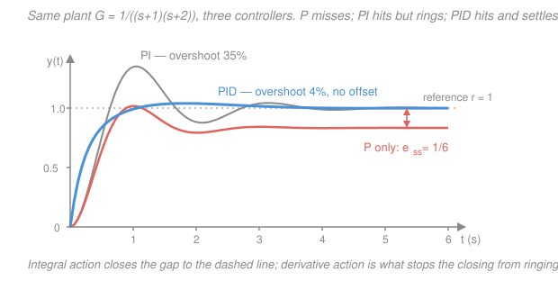
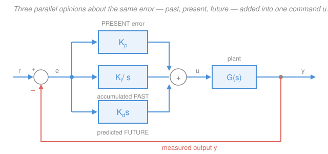

# Control Systems · Lesson 4.1: PID control

> ⏱ ~15 min · Module 4: PID & compensator design · Builds on: [2.3 Steady-state error & system type](02-03-steady-state-error-system-type.md), [2.4 Stability & Routh–Hurwitz](02-04-stability-routh-hurwitz.md), [3.4 Gain & phase margins](03-04-gain-and-phase-margins.md) · Unlocks: [4.2 Tuning PID](04-02-tuning-pid.md), [4.3 Lead & lag compensators](04-03-lead-lag-compensators.md)

## Why this matters

Surveys of industrial process control consistently find that the overwhelming majority of feedback loops in the world — cruise control, thermostats, refinery columns, drone attitude, 3D-printer hotends, disk-drive heads — run some form of **PID**. Not $\mathcal{H}_\infty$, not model predictive control, not neural anything: three gains, one equation, decades of hardware. It survives because it needs no model of the plant, it has exactly three knobs, and each knob does something a human can *name*.

That last point is the whole lesson. By the end you should be able to hear a symptom — "it settles a bit low," "it rings," "the valve buzzes" — and say which knob is guilty and which knob fixes it. Everything you learned in Module 2 about type and steady-state error and everything in Module 3 about phase margin comes due here.

## The idea

You are steering toward a target. At any instant you know one number: the **error** $e(t)$ — how far off you are right now. Three different, sensible people look at that same error signal and give you three different pieces of advice.

- **The proportional one** looks at the error *right now*: "you're two meters off — push twice as hard as you would for one meter." Present tense. Simple, immediate, and it never quite finishes the job, because when the error gets small, so does the push.
- **The integral one** keeps a grudge. It looks at the error *accumulated over the past*: "we have been a little bit low for the last ten minutes; that is unacceptable; keep pushing harder and harder until it stops." Past tense. It is the only one of the three that refuses to accept a permanent offset — and it is slow and prone to overreacting, the way grudges are.
- **The derivative one** looks at where the error is *heading*: "yes, you're still off, but you're closing fast — ease up or you'll blow through it." Future tense. It is the brake. It is also the nervous one: it reacts to every twitch of the sensor, including noise.

PID is what you get when you let all three talk and simply **add their advice up**, weighted by how much you trust each. The weights are $K_p$, $K_i$, $K_d$. That's it. That's the controller.

## The formal version

**Time domain.** With reference $r(t)$, measured output $y(t)$, and error $e(t) = r(t) - y(t)$, the control signal $u(t)$ is

$$\boxed{\,u(t) = K_p\,e(t) \;+\; K_i\!\int_0^t \! e(\tau)\,d\tau \;+\; K_d\,\frac{de(t)}{dt}\,}$$

*In words: command = (a multiple of the current error) + (a multiple of all error so far) + (a multiple of how fast the error is changing).* Units: if $u$ is volts and $e$ is meters, then $K_p$ is V/m, $K_i$ is V/(m·s), $K_d$ is V·s/m. The three gains are **not** interchangeable — they don't even share dimensions.

**Laplace domain.** Transform term by term (integration is $1/s$, differentiation is $s$ — see [1.3](01-03-laplace-transform-toolkit.md)) to get the controller transfer function $G_c(s) = U(s)/E(s)$:

$$G_c(s) = K_p + \frac{K_i}{s} + K_d s = \frac{K_d s^2 + K_p s + K_i}{s}.$$

*In words: PID is a controller with one pole fixed at the origin and two zeros you place wherever you like by choosing the gains.* That single sentence is the design view of PID, and it is what makes [4.3](04-03-lead-lag-compensators.md) feel familiar: the pole at $s=0$ is where the integral's magic lives, and the two zeros are the steering wheel.

**The other form you will meet.** Real hardware — Honeywell, Siemens, Allen-Bradley — and most textbooks use the **standard (ISA) form**:

$$G_c(s) = K_p\left(1 + \frac{1}{T_i s} + T_d s\right),$$

where $T_i$ is the **integral (reset) time** in seconds and $T_d$ the **derivative (rate) time** in seconds. Multiply out and match coefficients against the parallel form:

$$\boxed{\;T_i = \frac{K_p}{K_i}, \qquad T_d = \frac{K_d}{K_p}\;}\qquad\Longleftrightarrow\qquad K_i = \frac{K_p}{T_i},\quad K_d = K_p T_d.$$

*In words: the same controller, re-parameterized so that both extra knobs are times, and turning up $K_p$ scales all three actions together.* $T_i$ has a nice reading: it is the time the integral term needs to reproduce, on its own, the contribution the proportional term made instantly. You will hit both forms; always check which one a formula or a datasheet means before plugging numbers in.

### Proportional — the present

Raising $K_p$ raises the loop gain, which does two things at once. From [2.3](02-03-steady-state-error-system-type.md), for a **type-0** plant in unity feedback the position error constant is $K_{\text{pos}} = \lim_{s\to0} K_p G(s) = K_p G(0)$ and

$$e_{ss} = \frac{1}{1 + K_{\text{pos}}}.$$

So bigger $K_p$ means smaller error — but never zero. Concretely, with $G(s) = \dfrac{1}{(s+1)(s+2)}$ we have $G(0) = 1/2$; take $K_p = 10$, so $K_{\text{pos}} = 5$ and

$$e_{ss} = \frac{1}{1+5} = \frac{1}{6} \approx 0.167.$$

The output parks at $0.833$ and stays there forever. Pushing $K_p$ to 100 shrinks the offset to $1/51 \approx 0.020$, but by then the closed-loop poles have marched toward the imaginary axis and the response is a barely-damped ring — and for a higher-order plant, [2.4](02-04-stability-routh-hurwitz.md)'s Routh array will tell you the exact $K_p$ at which it goes unstable. **Proportional action trades accuracy against damping, and it can never buy accuracy outright.**

### Integral — the past (the important one)

This is the single most valuable fact in the lesson:

$$\boxed{\;\text{Adding } \frac{K_i}{s} \text{ puts a pole at the origin, raising the system type by one} \;\Longrightarrow\; e_{ss} \to 0 \text{ for a step.}\;}$$

*In words: integral action makes the steady-state step error exactly zero, not merely small.* The mechanism is worth saying twice. In steady state $u$ must be some nonzero constant (the valve has to stay part-open to hold temperature). A proportional term can only produce a nonzero $u$ from a nonzero $e$ — hence the offset. The integrator can hold a nonzero output with **zero** input, because its output is a running total that just stays where it was. So the loop can rest at $e = 0$ and still command whatever $u$ the plant needs. Equivalently, in the type table from [2.3](02-03-steady-state-error-system-type.md):

| Plant type | Step error, P only | Step error, with I |
|---|---|---|
| 0 | $1/(1+K_{\text{pos}})$, nonzero | $0$ |
| 1 | $0$ | $0$ (and ramp error becomes $0$ too) |

Any nonzero $e$, however small, keeps accumulating; the loop cannot settle until $e$ is exactly zero. That is why every temperature controller, flow controller, and cruise control in existence has integral action.

**The bill.** $1/(j\omega)$ has phase $-90^\circ$ at *every* frequency, and enormous gain at low frequency. That $-90^\circ$ eats directly into your phase margin ([3.4](03-04-gain-and-phase-margins.md)), so integral action moves you toward instability, slows the loop, and adds overshoot. You pay for perfect accuracy with damping.

### Derivative — the future

$K_d s$ responds to the *rate* of error, not its size. When the output is racing toward the setpoint, $e$ is shrinking fast, $de/dt$ is large and negative, and the derivative term subtracts from $u$ — it hits the brakes before you arrive. That's damping, and in the frequency domain it is **phase lead**: $j\omega K_d$ contributes $+90^\circ$, pushing phase margin back up and cutting overshoot.

**The bill, and it is a real one.** The magnitude of $j\omega K_d$ is $K_d\omega$ — rising at $20\ \text{dB}$/decade **forever**. Sensor noise lives at high frequency, so a differentiator amplifies it without limit; the symptom is an actuator that chatters or buzzes. Worse, $K_d s$ alone is improper (more zeros than poles) and hence not physically realizable. So **nobody ships a pure derivative**. What ships is a *filtered* derivative,

$$K_d s \;\longrightarrow\; \frac{K_d\, s}{1 + s\,T_d/N}, \qquad N \approx 8\text{–}20,$$

a differentiator up to the corner $\omega = N/T_d$ and a flat gain of $K_d N/T_d$ above it. (You will also see it written $\dfrac{K_d s}{1 + s/N}$ when the filter frequency is quoted directly in rad/s — same object, different bookkeeping.) Choose $N$ small and you lose derivative action; choose it large and you let the noise back in.

### The effects table

Increasing one gain, holding the other two fixed, on a typical plant:

| Gain ↑ | Rise time $t_r$ | Overshoot $M_p$ | Settling time $t_s$ | Steady-state error | Stability |
|---|---|---|---|---|---|
| $K_p$ | decreases | increases | small change | decreases (not to zero) | degrades |
| $K_i$ | decreases | increases | increases | **eliminated** for a step | degrades |
| $K_d$ | small change | decreases | decreases | small change | improves |

**Read the fine print.** These are *rules of thumb for typical plants*, not theorems. They are stated one-gain-at-a-time, and the terms interact: the same $K_d$ that damps a sluggish loop can destabilize one with a resonance or a time delay, and raising $K_i$ often forces you to lower $K_p$ to keep the loop civil. Use the table to form a hypothesis, then check it with a root locus ([3.2](03-02-root-locus-design.md)) or a Bode plot ([3.4](03-04-gain-and-phase-margins.md)).

## Picture

## Worked examples

**Example 1 — the same plant, three controllers.** Plant $G(s) = \dfrac{1}{(s+1)(s+2)} = \dfrac{1}{s^2+3s+2}$, unity feedback, unit step reference. Closed loop $T(s) = \dfrac{G_cG}{1+G_cG}$, and the characteristic polynomial is the numerator of $1 + G_cG$.

**(a) P only, $K_p = 10$.** Characteristic polynomial:

$$s^2 + 3s + 2 + 10 = s^2 + 3s + 12.$$

Poles at $s = -1.5 \pm j3.122$, so $\omega_n = \sqrt{12} = 3.464$ and $\zeta = 3/(2\sqrt{12}) = 0.433$. From [2.2](02-02-second-order-response.md), overshoot $e^{-\pi\zeta/\sqrt{1-\zeta^2}} = e^{-1.509} = 0.221$, i.e. 22.1 percent. DC gain $T(0) = 10/12 = 0.833$, so the output parks at $0.833$ — offset $1/6$, exactly as the type argument predicted.

**(b) PI, $K_p = 10$, $K_i = 10$.** Now $G_c = \dfrac{10s+10}{s} = \dfrac{10(s+1)}{s}$. I chose $K_i$ so the controller zero lands on the plant pole at $s=-1$ — a deliberate tactic that makes the algebra transparent (and is exactly the lag-compensator move of [4.3](04-03-lead-lag-compensators.md)). The open loop collapses:

$$L(s) = \frac{10(s+1)}{s(s+1)(s+2)} = \frac{10}{s(s+2)}.$$

Characteristic polynomial: $s(s+1)(s+2) + 10(s+1) = (s+1)\big(s^2+2s+10\big) = s^3+3s^2+12s+10$. After the cancellation, $T(s) = \dfrac{10}{s^2+2s+10}$, with $\omega_n = \sqrt{10} = 3.162$, $\zeta = 2/(2\sqrt{10}) = 0.316$.

Two things happened. **Accuracy:** $L$ now has a pole at the origin — type 1 — so $T(0) = 10/10 = 1$ and the step error is **zero**. **Damping:** $\zeta$ fell from $0.433$ to $0.316$, so overshoot rose from 22.1 to $e^{-\pi(0.3162)/\sqrt{0.9}} = e^{-1.047} = 0.351$, i.e. 35.1 percent. The integrator bought the offset and charged us damping — precisely the trade the table promises. (Bonus: $K_v = \lim_{s\to0} sL(s) = 10/2 = 5$, so a *ramp* reference now leaves error $1/K_v = 0.2$ instead of running away.)

**(c) PID, $K_p = 10$, $K_i = 10$, $K_d = 4$.** Adding $K_d s$ contributes $K_d s^2$ to the characteristic polynomial:

$$s^3 + (3+K_d)s^2 + 12s + 10 \;\xrightarrow{\;K_d=4\;}\; s^3 + 7s^2 + 12s + 10 = (s+5)(s^2+2s+2).$$

*Watch the poles move.* PI left them at $-1 \pm j3$; PID puts a fast real pole at $-5$ and pulls the dominant pair to $-1 \pm j1$, where $\omega_n = \sqrt2$ and $\zeta = 2/(2\sqrt2) = 0.707$ — the textbook sweet spot. The integrator is still there, so $T(0) = 10/10 = 1$ and the error is still zero; simulating the actual third-order response (which has the PID zeros at $-1.25 \pm j0.968$) gives 3.9 percent overshoot and 2 percent settling in 2.8 s, versus PI's 35.1 percent and 3.5 s. Derivative action cost nothing in accuracy and bought back all the damping.

In ISA form this controller is $10\left(1 + \dfrac{1}{1.0\,s} + 0.4\,s\right)$: $T_i = K_p/K_i = 1.0$ s, $T_d = K_d/K_p = 0.4$ s. With $N=10$ the derivative filter pole sits at $N/T_d = 25$ rad/s — comfortably above the loop's $\omega_n \approx 1.4$ rad/s, so it filters noise without touching the design.

**Example 2 — what actually ships.** Two practical failures that the clean equation hides.

**Derivative kick.** Step the reference from 20 to 25 degrees. Then $e$ jumps by 5 instantly, $de/dt$ is momentarily *infinite*, and $K_d\,de/dt$ slams the actuator to its limit for one sample — a bang the hardware feels and the operator hears. But note that in $e = r - y$, the reference contributes nothing useful to the derivative: $r$ is piecewise constant, so its derivative is zero except for that pathological spike. So the universal fix is to **differentiate the measurement, not the error**:

$$u = K_p e + K_i\!\int\! e\,d\tau \;-\; K_d\frac{dy}{dt}.$$

*In words: let the D term watch the plant, not the operator.* The minus sign is right because $de/dt = dr/dt - dy/dt$ and we simply drop the $dr/dt$ piece. The general version is **setpoint weighting**, $u = K_p(br - y) + K_i\int e\,d\tau + K_d\frac{d}{dt}(cr - y)$, with $c = 0$ almost always and $b \in [0,1]$ traded to soften the proportional kick too. Steady-state behavior is untouched — with $b=1$ and constant $r$ the two forms are identical — so you get the fix for free.

**Integral windup.** Every real actuator saturates: a valve is at most fully open, a motor has a maximum current. Suppose a loop with $K_i = 2$ commands a valve limited to $u \le 5$, and a large disturbance holds $e = +1$ for 10 seconds. The integrator faithfully accumulates $\int e\,d\tau = 10$, so the integral term alone demands $K_i \cdot 10 = 20$ — four times what the valve can deliver. The extra 15 is fiction. Now the output finally reaches setpoint: the loop *should* back off, but it cannot, because the integrator must first burn off its stored 15. If the overshoot produces $e = -0.5$, unwinding $\int e$ from $10$ down to $2.5$ takes $7.5/0.5 = 15$ seconds — fifteen seconds of pointless overshoot with the valve pinned wide open. That is windup, and it is the most common bad behavior in deployed PID loops. Three standard cures: **clamping** (freeze the integrator whenever the actuator is saturated), **back-calculation** (feed the difference between commanded and delivered $u$ back into the integrator so it unwinds at a chosen rate $1/T_t$), and **conditional integration** (integrate only when the error is inside some band). All three amount to the same principle: *do not accumulate credit for control effort you never delivered.*

## Watch out

- **You might think the effects table is a set of theorems. It is a set of habits.** Every entry is "typically, for a well-behaved plant, holding the other two fixed." Plants with lightly damped resonances, non-minimum-phase zeros, or transport delay routinely violate the $K_d$ row — derivative action amplifies exactly the frequencies a resonance lives at. Always confirm on a locus or a Bode plot before you believe a prediction.
- **You might think "integral action reduces steady-state error." It eliminates it — for a step, and only if the loop stays stable.** The type argument is worthless if the added $-90^\circ$ of phase pushed you past the stability boundary; an unstable loop has no steady state to have an error in. And a *ramp* input still leaves error $1/K_v$ unless you add a second integrator.
- **You might think Example 1(b)'s pole–zero cancellation is exact. It is exact only in the model.** The real plant pole is at $-1.02$, or drifts with temperature, and the near-cancelled mode reappears as a slow tail in the response. Cancelling a *stable, well-damped* pole this way is a normal and safe design tactic; cancelling an unstable or lightly damped one is a classic way to build a controller that works on paper and destroys hardware.

## One-liner

> P acts on the error now, I on the error accumulated, D on the error predicted; I is the only one that drives steady-state step error to zero, D is the only one that pays you back in damping, and the version that ships filters the D and stops the I from winding up.

## Problems

**P1 (🟢)** For each symptom, name the term to add or increase, say in one sentence *why* it fixes it, and name the price you pay.

(a) A tank-level loop under proportional-only control settles 4 cm below setpoint and sits there indefinitely.
(b) A different loop tracks setpoint perfectly in steady state but overshoots 40 percent and rings for several cycles.
(c) After the fix in (b), the control valve buzzes audibly and the actuator command is visibly fuzzy.

**P2 (🟡)** A type-0 plant $G(s) = \dfrac{4}{(s+2)(s+4)}$ sits in a unity-feedback loop with proportional control $G_c = K_p$.

(a) With $K_p = 6$, find the steady-state error to a unit step.
(b) Find the smallest $K_p$ meeting a spec of $e_{ss} \le 0.05$, then compute $\zeta$ and the percent overshoot at that gain.
(c) In one sentence, say what you'd do instead and why it's better.

**P3 (🔴)** Plant $G(s) = \dfrac{1}{s+1}$ with PI control $G_c(s) = K_p + \dfrac{K_i}{s}$ in unity feedback. Find $K_p$ and $K_i$ that place the closed-loop poles at $\omega_n = 4$ rad/s with $\zeta = 0.7$. Then explain why the actual step overshoot is not the 4.6 percent the second-order formula predicts.

Solutions

**P1**

**(a) Integral.** A permanent offset under P control is the signature of a type-0 loop: $e_{ss} = 1/(1+K_{\text{pos}})$, and proportional action can only produce a nonzero command from a nonzero error, so it must keep a little error alive to hold the valve open. Adding $K_i/s$ puts a pole at the origin, raising the system type to 1, and the integrator can hold a nonzero output at *zero* input — so the loop can finally rest at $e = 0$. **Price:** $-90^\circ$ of low-frequency phase lag, so less phase margin, a slower loop, and more overshoot. (Cranking $K_p$ up instead only *shrinks* the offset — it never removes it, and it costs damping too.)

**(b) Derivative.** "Perfect in steady state" says integral action is already present, so the problem is purely damping. $K_d s$ responds to $de/dt$, braking as the output rushes the setpoint; in frequency terms it adds phase lead ($+90^\circ$ asymptotically), raising phase margin and cutting $M_p$. **Price:** noise amplification, and $K_d s$ alone is improper.

**(c) That price, arriving.** The differentiator's gain rises at $20\ \text{dB}$/decade without limit, so it is amplifying high-frequency sensor noise straight into the actuator. **Fix:** the filtered derivative $\dfrac{K_d s}{1 + sT_d/N}$ with $N \approx 8\text{–}20$, which differentiates up to $\omega = N/T_d$ and then flattens out; back $K_d$ off if the buzz persists. (If the fuzz appeared only on setpoint changes rather than continuously, the diagnosis would instead be derivative kick — fix by differentiating $-y$ rather than $e$.)

**P2**

**(a)** The plant's DC gain is $G(0) = \dfrac{4}{2 \cdot 4} = 0.5$. With $G_c = K_p$ the position error constant is $K_{\text{pos}} = K_p G(0) = 6(0.5) = 3$, so

$$e_{ss} = \frac{1}{1+K_{\text{pos}}} = \frac{1}{1+3} = 0.25.$$

*Check.* Closed loop $T(s) = \dfrac{24}{s^2+6s+8+24} = \dfrac{24}{s^2+6s+32}$, so $T(0) = 24/32 = 0.75$ and the error is $1 - 0.75 = 0.25$. ✓

**(b)** Require $\dfrac{1}{1 + 0.5K_p} \le 0.05 \iff 1 + 0.5K_p \ge 20 \iff K_p \ge 38$. Take $K_p = 38$. The characteristic polynomial is $ (s+2)(s+4) + 4K_p = s^2 + 6s + 8 + 152 = s^2 + 6s + 160$, so

$$\omega_n = \sqrt{160} = 12.649\ \text{rad/s}, \qquad \zeta = \frac{6}{2\sqrt{160}} = \frac{3}{12.649} = 0.237.$$

Overshoot: $\sqrt{1-\zeta^2} = \sqrt{1-0.0563} = 0.9715$, so $\dfrac{\pi\zeta}{\sqrt{1-\zeta^2}} = \dfrac{\pi(0.2372)}{0.9715} = 0.767$ and $M_p = e^{-0.767} = 0.464$ — **46.4 percent overshoot**.

*Check.* Poles at $s = -3 \pm j12.288$; $\zeta = 3/\sqrt{3^2+12.288^2} = 3/12.649 = 0.237$ ✓. Note the real part stayed pinned at $-3$ (the $s$-coefficient never changed), so raising $K_p$ bought speed and accuracy purely by flinging the poles vertically — the classic P-control bargain, and why accuracy and damping fight.

**(c)** Add integral action. A PI controller drives $e_{ss}$ to **exactly** zero rather than merely to 0.05, and it does it without demanding $K_p = 38$, so you keep a usable damping ratio. (You would then re-check phase margin, since the integrator subtracts $90^\circ$.)

**P3** Open loop $L(s) = \dfrac{K_p + K_i/s}{s+1} = \dfrac{K_p s + K_i}{s(s+1)}$, so the characteristic polynomial is

$$s(s+1) + K_p s + K_i = s^2 + (1+K_p)s + K_i.$$

Match to $s^2 + 2\zeta\omega_n s + \omega_n^2$ with $\omega_n = 4$, $\zeta = 0.7$:

$$K_i = \omega_n^2 = 16, \qquad 1 + K_p = 2\zeta\omega_n = 2(0.7)(4) = 5.6 \;\Longrightarrow\; K_p = 4.6.$$

*Check.* Characteristic polynomial $s^2 + 5.6s + 16$; poles $s = \dfrac{-5.6 \pm \sqrt{31.36 - 64}}{2} = -2.8 \pm j2.857$, and $\zeta = 2.8/\sqrt{2.8^2 + 2.857^2} = 2.8/4.0 = 0.700$ ✓, $\omega_n = 4$ ✓. Also $T(0) = 16/16 = 1$, confirming zero steady-state step error. ✓ (Note PI gave *full* pole placement here — two gains, two coefficients — because the plant is first order.)

**Why not 4.6 percent:** the closed-loop transfer function is $T(s) = \dfrac{4.6s + 16}{s^2 + 5.6s + 16}$, which carries a **zero** at $s = -K_i/K_p = -16/4.6 = -3.48$. The $M_p = e^{-\pi\zeta/\sqrt{1-\zeta^2}}$ formula assumes a *pure* two-pole system with no zeros. A closed-loop zero adds a scaled derivative of the zero-free response, and it matters when it sits near the poles: here $|{-3.48}|$ is only $1.24$ times $\zeta\omega_n = 2.8$, so it is right on top of them. Simulating $T$ gives about **14.4 percent** overshoot — triple the formula's answer. Every PI and PID controller drags such zeros into the closed loop (that is what the numerator $K_ds^2 + K_ps + K_i$ *is*), which is why Example 1's PID overshoot had to be simulated rather than read off the $\zeta$ table.

## Flashback

**From Lesson 2.4 (Stability & Routh–Hurwitz):** A unity-feedback loop has forward path $G(s) = \dfrac{K}{s(s+1)(s+4)}$. Use the Routh array to find the range of $K$ for which the closed loop is stable, and give the frequency at which it oscillates at the upper limit.

Solution

Characteristic equation $1 + G(s) = 0 \Rightarrow s(s+1)(s+4) + K = 0$. Expand: $s(s^2+5s+4) + K = s^3 + 5s^2 + 4s + K$.

Routh array:

$$\begin{array}{c|cc} s^3 & 1 & 4 \\ s^2 & 5 & K \\ s^1 & \dfrac{5(4) - 1(K)}{5} = \dfrac{20-K}{5} & 0 \\ s^0 & K & \end{array}$$

No sign changes in the first column requires both $\dfrac{20-K}{5} > 0$ and $K > 0$:

$$\boxed{0 < K < 20.}$$

At $K = 20$ the $s^1$ row vanishes, signalling a pair of poles on the imaginary axis. Form the auxiliary polynomial from the row above, $5s^2 + K = 5s^2 + 20 = 0 \Rightarrow s^2 = -4 \Rightarrow s = \pm j2$, so the loop oscillates at $\omega = 2$ rad/s.

*Check.* Substitute $K=20$ into the characteristic polynomial and divide by $(s^2+4)$: $s^3+5s^2+4s+20 = (s^2+4)(s+5)$ ✓ — roots $\pm j2$ and $-5$, exactly marginal stability. ✓

**Why it's here:** every PID gain you add reshapes this same polynomial. In Example 1, $K_i$ added the constant term and $K_d$ added to the $s^2$ coefficient — and a Routh array on $s^3 + (3+K_d)s^2 + 12s + K_i$ is how you'd find the gain combinations that stay stable, which is exactly what [4.2](04-02-tuning-pid.md) exploits.

## Connections

- **Backward:** the integral term's payoff is [2.3](02-03-steady-state-error-system-type.md)'s system-type table read as a *design tool* rather than an analysis one — you're not classifying a plant, you're raising its type on purpose. The costs are priced in [2.4](02-04-stability-routh-hurwitz.md)'s stability boundary and [3.4](03-04-gain-and-phase-margins.md)'s phase margin: $-90^\circ$ from the integrator, $+90^\circ$ from the derivative.
- **Forward:** [4.2 Tuning PID](04-02-tuning-pid.md) turns the qualitative effects table into recipes (Ziegler–Nichols and friends) that pick actual numbers for $K_p, T_i, T_d$ from a couple of plant measurements. [5.5](05-05-digital-control.md) revisits all three terms as difference equations, where the integral becomes a running sum and the derivative a backward difference — and where windup and noise amplification get *worse*, not better.
- **Sideways:** PID is the special case of the compensators in [4.3](04-03-lead-lag-compensators.md) with the poles driven to their extremes. A **lag** compensator $\dfrac{s+z}{s+p}$ with $p \ll z$ boosts low-frequency gain to shrink steady-state error; push $p$ all the way to $0$ and you have exactly **PI**, with the offset shrunk to nothing instead of merely reduced. A **lead** compensator with $p \gg z$ adds phase around crossover; push $p \to \infty$ and you have **PD**. The filtered derivative $\dfrac{K_ds}{1+sT_d/N}$ is not an approximation to PD at all — it *is* a lead network with a finite pole, which is why real PID and lead–lag design are the same craft in two vocabularies.
