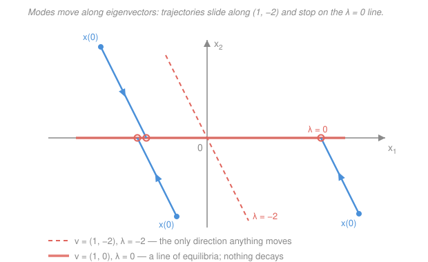

# Control Systems · Lesson 5.2: Solving the state equations

> ⏱ ~15 min · Module 5: State-space control · Builds on: [5.1 State-space modeling](05-01-state-space-modeling.md), [`linalg-refresher` 3.2](../../linalg-refresher/lessons/03-02-diagonalization.md), [`ode-refresher` 3.1](../../ode-refresher/lessons/03-01-linear-systems-eigenvalues.md) · Unlocks: [5.3 Controllability & observability](05-03-controllability-observability.md), [5.4 Pole placement & observers](05-04-pole-placement-observers.md)

## Why this matters

[5.1](05-01-state-space-modeling.md) gave you $\dot{x} = Ax + Bu$. That's a *model*, not an *answer* — it tells you the rate of change, not the trajectory. This lesson closes the loop: given $A$, $B$, the initial state $x(0)$, and the input $u(t)$, produce $x(t)$ for every $t$, in closed form.

The payoff isn't the formula, it's what falls out of it. When you solve $\dot{x} = Ax$ you discover that the whole response is built from $e^{\lambda_i t}$ terms, one per **eigenvalue** of $A$ — and those eigenvalues are exactly the poles you've been staring at on the s-plane since [1.4](01-04-transfer-functions-poles-zeros.md). The classical picture and the state-space picture are the same picture. That equivalence is the reason Module 5 is worth your time, and it's the foundation of [5.4](05-04-pole-placement-observers.md), where you'll *move* those eigenvalues on purpose.

## The idea

Start with the smallest possible case. One state, one number:

$$\dot{x} = ax, \qquad x(0) = x_0 \qquad\Longrightarrow\qquad x(t) = e^{at}x_0.$$

You've known this since [`ode-refresher` 1.2](../../ode-refresher/lessons/01-02-separable-and-linear-first-order.md). Growth if $a > 0$, decay if $a < 0$, and the exponential is the *only* function that reproduces itself under differentiation.

Now the honest claim of this lesson: **the matrix case is identical in form.**

$$\dot{x} = Ax, \qquad x(0) \text{ given} \qquad\Longrightarrow\qquad x(t) = e^{At}x(0).$$

Same equation, same solution, capital letters. Everything that remains is answering two questions: *what does $e^{At}$ mean when $A$ is a matrix?* and *how do I actually compute it?*

The mental image: $e^{At}$ is not a number, it's an **operator** — a matrix that takes the state you have now and hands you the state $t$ seconds later. Feed it $x(0)$, it returns $x(t)$. Feed it $x(3)$, it returns $x(3+t)$. It's a time machine with a dial, and the dial is $t$.

## The formal version

### Defining $e^{At}$

Take the scalar power series $e^{z} = 1 + z + \frac{z^2}{2!} + \cdots$ and put a matrix in it. The only thing you need is matrix multiplication, and you have that:

$$\boxed{\;e^{At} \;=\; I + At + \frac{A^2t^2}{2!} + \frac{A^3t^3}{3!} + \cdots \;=\; \sum_{k=0}^{\infty}\frac{A^kt^k}{k!}\;}$$

*In words: raise $A$ to powers, scale by $t^k/k!$, and add up the matrices.* Here $I$ is the $n\times n$ identity and $A^0 = I$ by convention. This series **always converges**, for every square $A$ and every $t$ — the terms are bounded by $\|A\|^k|t|^k/k!$, whose sum is the ordinary scalar $e^{\|A\||t|}$, which is finite.

A quick sanity example: for the pure double integrator $A = \begin{bmatrix}0&1\\0&0\end{bmatrix}$ we have $A^2 = 0$, so the series *stops*: $e^{At} = I + At = \begin{bmatrix}1&t\\0&1\end{bmatrix}$. Position accumulates velocity linearly in $t$. Exactly right.

### The state transition matrix

Give $e^{At}$ a name:

$$\Phi(t) \;\equiv\; e^{At}.$$

$\Phi$ is called the **state transition matrix**, and the name earns itself — it is the operator that transports the state forward by $t$. Four properties, each with its one-line reason:

| Property | Reason |
|---|---|
| $\Phi(0) = I$ | Set $t=0$ in the series; every term after the first dies. Transporting by zero time changes nothing. |
| $\Phi(t_1+t_2) = \Phi(t_1)\Phi(t_2)$ | Transporting $t_1$ seconds and then $t_2$ more is the same as transporting $t_1+t_2$ at once. |
| $\Phi^{-1}(t) = \Phi(-t)$ | Put $t_2 = -t_1$ above: $\Phi(t)\Phi(-t) = \Phi(0) = I$. Running time backwards undoes it. **$\Phi(t)$ is always invertible.** |
| $\dfrac{d\Phi}{dt} = A\Phi(t) = \Phi(t)A$ | Differentiate the series term by term: $A + A^2t + \frac{A^3t^2}{2!}+\cdots = A\left(I + At + \cdots\right)$. |

That last one is the whole point: $\Phi$ satisfies the very equation we're solving, so $x(t) = \Phi(t)x(0)$ satisfies $\dot{x} = Ax$ with the right initial condition. *In words: $\Phi$ is the matrix version of "the exponential is its own derivative."*

Note $A$ and $e^{At}$ always **commute** (both are polynomials/series in $A$) — we'll use that in a moment.

### The full solution, with input

$$\boxed{\;x(t) \;=\; \underbrace{e^{At}x(0)}_{\text{zero-input response}} \;+\; \underbrace{\int_0^{t} e^{A(t-\tau)}Bu(\tau)\,d\tau}_{\text{zero-state response}}\;}\qquad y(t) = Cx(t) + Du(t).$$

*In words: where you end up equals where you started (transported forward, decaying through the system's natural modes) plus the accumulated effect of everything you pushed in along the way.*

Read the two pieces:

- **Zero-input response**, $e^{At}x(0)$: what the system does if you never touch it. Pure natural modes, set entirely by $A$ and the initial conditions.
- **Zero-state response**, the integral: what the system does starting from rest. Look at its shape — a kernel $e^{A(t-\tau)}B$ slid against the input $u(\tau)$ and integrated. That **is** a convolution, the matrix version of $y = x * h$ from [`signals-systems` 1.4](../../signals-systems/lessons/01-04-convolution-continuous-time.md). The impulse-response kernel here is $Ce^{At}B + D\delta(t)$.

**Derivation (variation of constants).** Same trick as [`ode-refresher` 2.4](../../ode-refresher/lessons/02-04-variation-of-parameters.md), one line shorter. Start from $\dot{x} - Ax = Bu$ and multiply on the left by the integrating factor $e^{-At}$:

$$e^{-At}\dot{x} - e^{-At}Ax = e^{-At}Bu.$$

Because $A$ and $e^{-At}$ commute and $\frac{d}{dt}e^{-At} = -Ae^{-At}$, the left side is exactly a product-rule derivative:

$$\frac{d}{dt}\left[e^{-At}x(t)\right] = e^{-At}Bu(t).$$

Integrate from $0$ to $t$ (using $\Phi(0)=I$), then multiply through by $e^{At}$:

$$e^{-At}x(t) - x(0) = \int_0^t e^{-A\tau}Bu(\tau)\,d\tau \quad\Longrightarrow\quad x(t) = e^{At}x(0) + \int_0^t e^{A(t-\tau)}Bu(\tau)\,d\tau.$$

### Three ways to compute $e^{At}$

**1. Laplace — the practical one.** Transform $\dot x = Ax$ with initial state: $sX(s) - x(0) = AX(s)$, so $(sI-A)X(s) = x(0)$ and $X(s) = (sI-A)^{-1}x(0)$. Compare with $x(t) = e^{At}x(0)$:

$$e^{At} = \mathcal{L}^{-1}\left\{(sI-A)^{-1}\right\}.$$

*In words: invert the matrix $sI-A$ symbolically, then inverse-transform every entry.* This is what you'll actually do by hand, and it recycles two things you already own: the resolvent $(sI-A)^{-1}$ from [5.1](05-01-state-space-modeling.md), and the partial fractions of [1.3](01-03-laplace-transform-toolkit.md).

**2. Diagonalization — the structural one.** If $A$ has $n$ distinct eigenvalues, [`linalg-refresher` 3.2](../../linalg-refresher/lessons/03-02-diagonalization.md) gives $A = V\Lambda V^{-1}$ with $\Lambda = \mathrm{diag}(\lambda_1,\dots,\lambda_n)$ and $V$ the matrix of eigenvectors. Then $A^k = V\Lambda^kV^{-1}$, and every term of the series carries the same $V\cdots V^{-1}$ sandwich, so

$$e^{At} = Ve^{\Lambda t}V^{-1}, \qquad e^{\Lambda t} = \mathrm{diag}\!\left(e^{\lambda_1 t},\dots,e^{\lambda_n t}\right).$$

*In words: change coordinates so the states decouple, exponentiate $n$ independent scalars, change back.* This is the version that reveals the structure — see the next section.

If $A$ is **defective** (a repeated eigenvalue without enough independent eigenvectors), no $V$ exists; you use the Jordan form instead and the answer picks up terms like $te^{\lambda t}$, $t^2e^{\lambda t}/2$. That's the same behavior as a repeated pole in [1.3](01-03-laplace-transform-toolkit.md) — same phenomenon, matrix clothing. We won't go further; it changes nothing about design.

**3. Numerically.** Truncating the series works in principle but is badly behaved; real software uses scaling-and-squaring with a Padé approximant (MATLAB's `expm`), never the naive sum.

### Eigenvalues are the poles; eigenvectors are the mode shapes

Write $x(0)$ in the eigenvector basis, $x(0) = \sum_i c_i v_i$ where $Av_i = \lambda_i v_i$. Then diagonalization collapses to something you can read:

$$x(t) = e^{At}x(0) = \sum_{i=1}^{n} c_i\,e^{\lambda_i t}\,v_i.$$

*In words: the response is a sum of **modes**. Mode $i$ has a fixed **shape** — the eigenvector $v_i$, saying in what combination the states move together — and a **time profile** $e^{\lambda_i t}$, saying how fast that combination grows or decays.* Start on an eigenvector and you stay on it, sliding toward or away from the origin along a straight line.

Two consequences, both already familiar in other clothes:

- **Stability.** Every mode decays iff $\mathrm{Re}\{\lambda_i\} < 0$ for all $i$. That is *literally* the "all poles in the open left half-plane" criterion from [2.4](02-04-stability-routh-hurwitz.md), because the eigenvalues of $A$ are the roots of $\det(sI-A) = 0$, which is the denominator of $G(s) = C(sI-A)^{-1}B + D$ from [5.1](05-01-state-space-modeling.md).
- **Speed and ringing.** A real $\lambda = -1/\tau$ is a first-order mode ([2.1](02-01-first-order-response.md)); a complex pair $\lambda = -\zeta\omega_n \pm j\omega_d$ is a ringing second-order mode ([2.2](02-02-second-order-response.md)). Nothing you learned about the s-plane is discarded — it's re-derived.

The one thing state space *adds* is the eigenvector: the s-plane tells you a mode rings at $\omega_d$ and decays at $\zeta\omega_n$; the eigenvector tells you **which physical states participate**, and in what ratio.

## Picture

This is the same phase-portrait language as [`ode-refresher` 3.2](../../ode-refresher/lessons/03-02-phase-portraits-stability.md), now attached to a plant. Every trajectory of the example system below is a straight line parallel to the $\lambda=-2$ eigenvector $(1,-2)$ — that's the only mode that *moves* — and it comes to rest somewhere on the $\lambda = 0$ eigenvector line, the $x_1$-axis, where the state just stays. The system settles, but *where* it settles depends on where it started. That's the signature of an eigenvalue at the origin.

## Worked examples

### Example 1: $e^{At}$ for the running plant

Take the Module 5 workhorse — a cart with velocity damping, position $x_1$, velocity $x_2$, force input $u$:

$$A = \begin{bmatrix}0&1\\0&-2\end{bmatrix},\qquad B = \begin{bmatrix}0\\1\end{bmatrix},\qquad C = \begin{bmatrix}1&0\end{bmatrix},\qquad D = 0.$$

**Step 1 — form $sI-A$ and invert it.**

$$sI - A = \begin{bmatrix}s&-1\\0&s+2\end{bmatrix},\qquad \det(sI-A) = s(s+2) - (-1)(0) = s(s+2).$$

For a $2\times2$ matrix $\begin{bmatrix}a&b\\c&d\end{bmatrix}$ the adjugate is $\begin{bmatrix}d&-b\\-c&a\end{bmatrix}$, so

$$\mathrm{adj}(sI-A) = \begin{bmatrix}s+2&1\\0&s\end{bmatrix}, \qquad (sI-A)^{-1} = \frac{1}{s(s+2)}\begin{bmatrix}s+2&1\\0&s\end{bmatrix} = \begin{bmatrix}\dfrac{1}{s}&\dfrac{1}{s(s+2)}\\[2ex]0&\dfrac{1}{s+2}\end{bmatrix}.$$

**Step 2 — inverse-transform entry by entry.** Only one entry needs work; partial fractions gives $\dfrac{1}{s(s+2)} = \dfrac{1/2}{s} - \dfrac{1/2}{s+2}$, so it inverts to $\tfrac12\left(1 - e^{-2t}\right)$. With $\mathcal{L}^{-1}\{1/s\} = 1$ and $\mathcal{L}^{-1}\{1/(s+2)\} = e^{-2t}$:

$$\Phi(t) = e^{At} = \begin{bmatrix}1 & \dfrac{1-e^{-2t}}{2}\\[2ex] 0 & e^{-2t}\end{bmatrix}.$$

**Step 3 — verify.** Never publish a $\Phi$ you haven't checked.

- $\Phi(0)$: the off-diagonal entry is $(1-1)/2 = 0$ and the corner is $e^0 = 1$, so $\Phi(0) = I$. Good.
- $\dot\Phi = A\Phi$: differentiating, $\dot\Phi = \begin{bmatrix}0 & e^{-2t}\\ 0 & -2e^{-2t}\end{bmatrix}$. And $A\Phi$ — row 1 of $A$ is $[0\;\;1]$, which just copies row 2 of $\Phi$, giving $[0\;\;e^{-2t}]$; row 2 of $A$ is $[0\;\;{-2}]$, giving $-2\times$ row 2 of $\Phi = [0\;\;{-2}e^{-2t}]$. Identical for all $t$. Good. (At $t=0$ this reads $\dot\Phi(0) = A$, the derivative property in its most checkable form.)

**Step 4 — read the modes.** $\det(sI-A) = s(s+2)$ gives eigenvalues $\lambda_1 = 0$ and $\lambda_2 = -2$, and sure enough $\Phi$ contains exactly two time profiles: a constant ($e^{0t}$) and a decaying exponential $e^{-2t}$. Cross-check by diagonalizing: $v_1 = \begin{bmatrix}1\\0\end{bmatrix}$ (from $Av=0 \Rightarrow x_2=0$) and $v_2 = \begin{bmatrix}1\\-2\end{bmatrix}$ (from $(A+2I)v=0 \Rightarrow 2v_1+v_2 = 0$), so with $V = \begin{bmatrix}1&1\\0&-2\end{bmatrix}$, $V^{-1} = \begin{bmatrix}1&1/2\\0&-1/2\end{bmatrix}$:

$$Ve^{\Lambda t}V^{-1} = \begin{bmatrix}1&e^{-2t}\\0&-2e^{-2t}\end{bmatrix}\begin{bmatrix}1&1/2\\0&-1/2\end{bmatrix} = \begin{bmatrix}1&\tfrac12 - \tfrac12 e^{-2t}\\0&e^{-2t}\end{bmatrix},$$

the same $\Phi$. Two independent methods, one answer.

The eigenvalue at $\lambda = 0$ is the headline: the plant is an **integrator** (velocity feeds position, and nothing pulls position back). It is *not* asymptotically stable — nudge the cart and it stops somewhere new and stays there. No choice of open-loop input fixes that; you need feedback, which is [5.4](05-04-pole-placement-observers.md)'s job.

### Example 2: the actual responses

**Zero-input**, with $x(0) = \begin{bmatrix}1\\2\end{bmatrix}$ (at position 1, moving at speed 2):

$$x(t) = \Phi(t)x(0) = \begin{bmatrix}1\cdot 1 + \tfrac{1-e^{-2t}}{2}\cdot 2\\[1ex] 0\cdot1 + e^{-2t}\cdot 2\end{bmatrix} = \begin{bmatrix}2 - e^{-2t}\\ 2e^{-2t}\end{bmatrix}.$$

*Check:* at $t=0$ this is $[1,\,2]^{\mathsf T}$ ✓. And $\dot x_1 = 2e^{-2t} = x_2$ ✓, $\dot x_2 = -4e^{-2t} = -2x_2$ ✓ — it satisfies $\dot x = Ax$. Physically: the velocity dies with time constant $\tfrac12$ s while the cart coasts an extra $\int_0^\infty x_2\,dt = 1$ unit, ending at position 2 forever. That's one of the blue trajectories in the figure.

**Zero-state step response**, $x(0)=0$, $u(t) = 1$ for $t\ge0$. Since $B = [0,\,1]^{\mathsf T}$ picks off the second column of $\Phi$,

$$e^{A(t-\tau)}B = \begin{bmatrix}\tfrac12\left(1-e^{-2(t-\tau)}\right)\\ e^{-2(t-\tau)}\end{bmatrix}.$$

Substituting $\sigma = t-\tau$ (so $\int_0^t f(t-\tau)d\tau = \int_0^t f(\sigma)d\sigma$):

$$x_2(t) = \int_0^t e^{-2\sigma}d\sigma = \frac{1-e^{-2t}}{2}, \qquad x_1(t) = \int_0^t \tfrac12\left(1-e^{-2\sigma}\right)d\sigma = \frac{t}{2} - \frac{1-e^{-2t}}{4}.$$

*Check 1:* both are $0$ at $t=0$ ✓, and $\dot x_1 = \tfrac12(1-e^{-2t}) = x_2$ ✓, $\dot x_2 = e^{-2t} = -2x_2 + 1$ ✓.
*Check 2 (classical route):* $G(s) = C(sI-A)^{-1}B = \frac{1}{s(s+2)}$, so the step response is $\mathcal{L}^{-1}\{1/(s^2(s+2))\}$. Partial fractions $\frac{1}{s^2(s+2)} = \frac{-1/4}{s} + \frac{1/2}{s^2} + \frac{1/4}{s+2}$ inverts to $\frac{t}{2} - \frac14 + \frac14 e^{-2t}$ — identical to $x_1(t) = y(t)$ ✓.

Steady state: velocity settles at $\tfrac12$, position ramps forever. Push an integrator and it never stops.

## Watch out

- **You might think $e^{At}$ means "exponentiate each entry."** It absolutely does not. For our $A$, the $(1,1)$ entry of $e^{At}$ is $1$, not $e^{0\cdot t}$ by accident — check the $(1,2)$ entry: $A_{12}t = t$, but $\Phi_{12} = (1-e^{-2t})/2 \ne e^{t}$. The definition is the *series*, and only the series.
- **You might think $e^{At}e^{Bt} = e^{(A+B)t}$.** Only if $AB = BA$. Matrices generally don't commute, and this is the single most common matrix-exponential error. ($A$ commutes with itself, which is why $\Phi(t_1)\Phi(t_2) = \Phi(t_1+t_2)$ is safe.)
- **You might think eigenvalues of $A$ and poles of $G(s)$ are always the same set.** Every pole is an eigenvalue, but an eigenvalue can vanish from $G(s)$ through pole–zero cancellation — a mode that the input can't excite or the output can't see. That's exactly what [5.3](05-03-controllability-observability.md) is about, and it's why a transfer function can look stable while the hardware quietly diverges.
- **You might read $\mathrm{Re}\{\lambda\} = 0$ as "marginally OK."** For design purposes it isn't. Our $\lambda = 0$ mode never decays, so an arbitrarily small disturbance leaves a permanent offset.

## One-liner

> $x(t) = e^{At}x(0) + \int_0^t e^{A(t-\tau)}Bu(\tau)d\tau$ — the scalar solution in matrix clothing, where each eigenvalue of $A$ supplies a mode $e^{\lambda_i t}$ (the pole) and each eigenvector supplies its shape.

## Problems

**P1 (🟢)** Using $\Phi(t) = \begin{bmatrix}1 & \frac{1-e^{-2t}}{2}\\ 0 & e^{-2t}\end{bmatrix}$ from Example 1, find the zero-input response for $x(0) = \begin{bmatrix}-1\\4\end{bmatrix}$, give $\lim_{t\to\infty}x(t)$, and verify your answer satisfies $\dot x = Ax$.

**P2 (🟡)** The mass–spring–damper $\ddot{q} + 3\dot{q} + 2q = u$ has phase-variable form $A = \begin{bmatrix}0&1\\-2&-3\end{bmatrix}$. Compute $e^{At}$ by the Laplace method. Then verify $\Phi(0) = I$ and $\dot\Phi(0) = A$, and name the two modes.

**P3 (🔴)** For the Example 1 system, take $x(0) = \begin{bmatrix}3\\-2\end{bmatrix}$. (a) Decompose $x(0)$ in the eigenvector basis $v_1 = \begin{bmatrix}1\\0\end{bmatrix}$, $v_2 = \begin{bmatrix}1\\-2\end{bmatrix}$ and write $x(t)$ as a sum of modes. (b) Confirm it against $\Phi(t)x(0)$. (c) Which initial conditions produce a state that never changes at all, and why?

Solutions

**P1** Multiply out:

$$x(t) = \Phi(t)\begin{bmatrix}-1\\4\end{bmatrix} = \begin{bmatrix}(1)(-1) + \frac{1-e^{-2t}}{2}(4)\\[1ex] (0)(-1) + e^{-2t}(4)\end{bmatrix} = \begin{bmatrix}-1 + 2 - 2e^{-2t}\\ 4e^{-2t}\end{bmatrix} = \begin{bmatrix}1 - 2e^{-2t}\\ 4e^{-2t}\end{bmatrix}.$$

Limit: $e^{-2t}\to 0$, so $x(t)\to \begin{bmatrix}1\\0\end{bmatrix}$ — the cart stops at position 1.

*Check.* At $t=0$: $x_1 = 1-2 = -1$ ✓, $x_2 = 4$ ✓. Differentiating, $\dot x_1 = 4e^{-2t}$, which equals $x_2$ ✓ (that's row 1 of $\dot x = Ax$). And $\dot x_2 = -8e^{-2t} = -2\left(4e^{-2t}\right) = -2x_2$ ✓ (row 2). Sanity: it started at $-1$ moving right at speed 4, and the extra distance covered is $\int_0^\infty 4e^{-2t}dt = 2$, landing at $-1+2 = 1$ ✓.

**P2** Form the resolvent:

$$sI - A = \begin{bmatrix}s&-1\\2&s+3\end{bmatrix},\qquad \det = s(s+3) + 2 = s^2+3s+2 = (s+1)(s+2),$$

$$(sI-A)^{-1} = \frac{1}{(s+1)(s+2)}\begin{bmatrix}s+3&1\\-2&s\end{bmatrix}.$$

Invert each entry with partial fractions over the poles $-1$ and $-2$:

- $\dfrac{s+3}{(s+1)(s+2)} = \dfrac{2}{s+1} - \dfrac{1}{s+2}$  (residues: $\frac{-1+3}{-1+2}=2$, $\frac{-2+3}{-2+1}=-1$)  $\to 2e^{-t}-e^{-2t}$
- $\dfrac{1}{(s+1)(s+2)} = \dfrac{1}{s+1} - \dfrac{1}{s+2} \to e^{-t}-e^{-2t}$
- $\dfrac{-2}{(s+1)(s+2)} \to -2e^{-t}+2e^{-2t}$
- $\dfrac{s}{(s+1)(s+2)} = \dfrac{-1}{s+1} + \dfrac{2}{s+2}$  (residues: $\frac{-1}{-1+2}=-1$, $\frac{-2}{-2+1}=2$)  $\to -e^{-t}+2e^{-2t}$

$$\Phi(t) = e^{At} = \begin{bmatrix}2e^{-t}-e^{-2t} & e^{-t}-e^{-2t}\\ -2e^{-t}+2e^{-2t} & -e^{-t}+2e^{-2t}\end{bmatrix}.$$

*Check 1 — $\Phi(0) = I$:* entries become $2-1=1$, $1-1=0$, $-2+2=0$, $-1+2=1$, giving $\begin{bmatrix}1&0\\0&1\end{bmatrix}$ ✓.

*Check 2 — $\dot\Phi(0) = A$:* differentiating,

$$\dot\Phi(t) = \begin{bmatrix}-2e^{-t}+2e^{-2t} & -e^{-t}+2e^{-2t}\\ 2e^{-t}-4e^{-2t} & e^{-t}-4e^{-2t}\end{bmatrix} \;\xrightarrow{\;t=0\;}\; \begin{bmatrix}0&1\\-2&-3\end{bmatrix} = A.$$

That is exactly $A$ ✓.

(Stronger check, if you want it: row 1 of $A$ is $[0\;\;1]$, so row 1 of $A\Phi$ is row 2 of $\Phi$, $[-2e^{-t}+2e^{-2t},\; -e^{-t}+2e^{-2t}]$ — matching row 1 of $\dot\Phi$ for all $t$ ✓.)

**Modes:** eigenvalues $\lambda = -1, -2$, i.e. two decaying exponentials $e^{-t}$ and $e^{-2t}$ with time constants 1 s and 0.5 s. Both have $\mathrm{Re}\{\lambda\}<0$, so the system is asymptotically stable — the overdamped case of [2.2](02-02-second-order-response.md), no ringing, and these are exactly the roots of the characteristic polynomial $s^2+3s+2$ you'd get from the transfer function.

**P3 (a)** Solve $\begin{bmatrix}3\\-2\end{bmatrix} = c_1\begin{bmatrix}1\\0\end{bmatrix} + c_2\begin{bmatrix}1\\-2\end{bmatrix}$. The second row gives $-2c_2 = -2 \Rightarrow c_2 = 1$; the first gives $c_1 + 1 = 3 \Rightarrow c_1 = 2$. So with $\lambda_1 = 0$, $\lambda_2 = -2$:

$$x(t) = c_1e^{\lambda_1 t}v_1 + c_2e^{\lambda_2 t}v_2 = 2\begin{bmatrix}1\\0\end{bmatrix} + e^{-2t}\begin{bmatrix}1\\-2\end{bmatrix} = \begin{bmatrix}2+e^{-2t}\\ -2e^{-2t}\end{bmatrix}.$$

**(b)** Directly: $\Phi(t)\begin{bmatrix}3\\-2\end{bmatrix} = \begin{bmatrix}3 + \frac{1-e^{-2t}}{2}(-2)\\ -2e^{-2t}\end{bmatrix} = \begin{bmatrix}3 - 1 + e^{-2t}\\ -2e^{-2t}\end{bmatrix} = \begin{bmatrix}2+e^{-2t}\\-2e^{-2t}\end{bmatrix}$ ✓. Same answer.

Note what the decomposition shows that the raw multiplication hides: the *only* thing that moves is the $\lambda=-2$ mode, and it moves along $v_2 = (1,-2)$ — so the trajectory is a straight line of slope $-2$ in the phase plane, sliding to rest at $2v_1 = (2,0)$. That's the figure.

**(c)** Any $x(0)$ with $c_2 = 0$, i.e. $x(0) = c_1v_1 = \begin{bmatrix}c_1\\0\end{bmatrix}$ — the cart parked anywhere with zero velocity. Then $x(t) = c_1e^{0\cdot t}v_1 = x(0)$ for all $t$: an equilibrium. Verify: $Ax(0) = \begin{bmatrix}0&1\\0&-2\end{bmatrix}\begin{bmatrix}c_1\\0\end{bmatrix} = \begin{bmatrix}0\\0\end{bmatrix}$, so $\dot x = 0$ ✓. The eigenvalue at zero is why this is a whole *line* of equilibria rather than the single point at the origin you'd get from a stable $A$.

## Flashback

**From Lesson 2.2 (Second-order response):** A different plant has $A = \begin{bmatrix}0&1\\-8&-4\end{bmatrix}$. Its eigenvalues are the roots of $\det(sI-A) = s^2+4s+8$, namely $s = -2 \pm j2$. Treating these as the dominant closed-loop poles, find $\omega_n$, $\zeta$, the percent overshoot, and the 2% settling time of the step response.

Solution

Match $s^2 + 4s + 8$ to the standard form $s^2 + 2\zeta\omega_n s + \omega_n^2$:

$$\omega_n^2 = 8 \Rightarrow \omega_n = 2\sqrt{2} \approx 2.83\ \mathrm{rad/s}, \qquad 2\zeta\omega_n = 4 \Rightarrow \zeta = \frac{4}{2(2\sqrt2)} = \frac{1}{\sqrt2} \approx 0.707.$$

Overshoot:

$$M_p = 100\exp\!\left(\frac{-\pi\zeta}{\sqrt{1-\zeta^2}}\right)\% = 100\,e^{-\pi(0.707)/0.707}\% = 100e^{-\pi}\% \approx 4.3\%.$$

Settling time (2% band):

$$t_s \approx \frac{4}{\zeta\omega_n} = \frac{4}{2} = 2\ \mathrm{s}.$$

*Check.* Read the pole $-2 \pm j2$ geometrically: $\omega_n$ is its distance from the origin, $\sqrt{2^2+2^2} = 2\sqrt2$ ✓, and $\zeta = \cos\theta$ where $\theta$ is the angle from the negative real axis — here $45^\circ$, so $\zeta = \cos 45^\circ = 1/\sqrt2$ ✓. The real part is $-\zeta\omega_n = -2$, and $t_s = 4/|{\text{real part}}| = 2$ s ✓. The $\zeta = 0.707$ / roughly 4 percent overshoot combination is the classic "nice" design point — and it's the target of this course's Boss problem 5.

## Connections

- **Backward:** this is [5.1](05-01-state-space-modeling.md)'s $(sI-A)^{-1}$ used a second way — there it built $G(s)$, here its inverse transform *is* $\Phi(t)$. The diagonalization route is [`linalg-refresher` 3.2](../../linalg-refresher/lessons/03-02-diagonalization.md) applied verbatim, and the eigenvalue-as-mode idea is [`ode-refresher` 3.1](../../ode-refresher/lessons/03-01-linear-systems-eigenvalues.md).
- **Forward:** [5.3](05-03-controllability-observability.md) asks which modes $B$ can excite and which $C$ can see; [5.4](05-04-pole-placement-observers.md) replaces $A$ with $A-BK$ and *chooses* the eigenvalues, which is only meaningful because you now know eigenvalues determine the response. [5.5](05-05-digital-control.md) samples this exact solution over one period to get the discrete update $x[k+1] = e^{AT}x[k] + \left(\int_0^T e^{A\sigma}d\sigma\right)Bu[k]$.
- **Sideways:** the zero-state integral is convolution — [`signals-systems` 1.4](../../signals-systems/lessons/01-04-convolution-continuous-time.md) with a matrix kernel. And the straight-line-along-eigenvectors picture is the phase portrait of [`ode-refresher` 3.2](../../ode-refresher/lessons/03-02-phase-portraits-stability.md); a stable node there is an asymptotically stable plant here.
