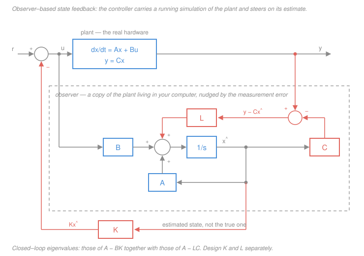

# Control Systems · Lesson 5.4: Pole placement & observers

> ⏱ ~15 min · Module 5: State-space control · Builds on: [5.3 Controllability & observability](05-03-controllability-observability.md), [5.2 Solving the state equations](05-02-solving-state-equations.md), [2.2 Second-order response](02-02-second-order-response.md) · Unlocks: [5.5 A taste of digital control](05-05-digital-control.md)

## Why this matters

This is the lesson the whole module was building toward, and it is the first time the modern approach hands you something the classical one simply cannot give.

Everything in Modules 3 and 4 was a negotiation. In [3.1](03-01-root-locus-construction.md) you sketched the root locus and discovered that the closed-loop poles are trapped on a set of curves the plant chose for you; in [3.2](03-02-root-locus-design.md) you slid a single gain along those curves and took the best point available. If no point on the locus met the spec, you had to *add dynamics* — a lead or lag network ([4.3](04-03-lead-lag-compensators.md)) — to bend the locus somewhere better.

State feedback ends the negotiation. If the system is controllable, you write down where you want the closed-loop poles and you get them. Exactly. Every one of them. And when you object that you can't feed back states you don't measure, the second half of this lesson builds a machine that manufactures the missing states out of thin air — and the **separation principle** says the two designs don't even interfere with each other.

## The idea

**One knob versus $n$ knobs.** Root locus feeds back a single signal — the output $y$ — through a single number $K$. One knob, one degree of freedom, and the poles go where the locus lets them. State feedback feeds back *the entire state vector*, each component through its own gain:

$$u = -(k_1 x_1 + k_2 x_2 + \cdots + k_n x_n).$$

That is $n$ independent knobs for the $n$ closed-loop poles you're trying to set — exactly enough. The count is the whole intuition: $n$ unknowns, $n$ coefficients to match, generically a unique solution. Controllability, from [5.3](05-03-controllability-observability.md), is precisely the condition that guarantees the $n$ knobs really are independent and not secretly redundant.

**The catch, and the fix.** A cart has position *and* velocity; a motor has current, speed, and shaft angle. You typically instrument **one** of them, because encoders and tachometers and current sensors cost money, weight, and reliability. So $u = -Kx$ asks for something you don't have.

The fix is audacious and it works: run a **simulation of the plant inside your controller**. You know $A$, $B$, $C$ — you built the model in [5.1](05-01-state-space-modeling.md) — and you know $u$, because you're the one generating it. So integrate $\dot{\hat x} = A\hat x + Bu$ and read off the simulated state $\hat x$. That is dead reckoning: perfectly fine until your model is slightly wrong or the initial condition is unknown, at which point the simulation drifts away from reality with nothing to stop it.

So add a correction. Your simulation predicts a measurement, $\hat y = C\hat x$. Compare it to the real sensor reading $y$. If they disagree, the simulation is wrong somewhere — nudge it. That comparison-and-nudge is the **observer**, and it is the same idea as a navigator who dead-reckons between GPS fixes and pulls the plot back on course each time a fix arrives.

## The formal version

Throughout: the plant is single-input, single-output, with $n$ states,

$$\dot x = Ax + Bu, \qquad y = Cx,$$

where $x \in \mathbb{R}^n$ is the state, $u$ a scalar control, $y$ a scalar measurement, $A$ is $n \times n$, $B$ is $n \times 1$, $C$ is $1 \times n$. (We take $D = 0$; a nonzero $D$ changes nothing below.)

### State feedback

Choose a **gain row vector** $K = \begin{bmatrix} k_1 & k_2 & \cdots & k_n\end{bmatrix}$ ($1 \times n$; entry $k_i$ carries units of control-per-unit-of-$x_i$) and set

$$u = -Kx.$$

Substitute into the state equation:

$$\dot x = Ax + B(-Kx) = (A - BK)\,x.$$

$$\boxed{\;\dot x = (A-BK)x \;\Longrightarrow\; \text{closed-loop poles} = \text{eigenvalues of } A - BK.\;}$$

*In words: feeding back the state doesn't add any new dynamics — it just replaces the system matrix $A$ with $A - BK$, and the poles are wherever that new matrix's eigenvalues land.* This is the same fact as [5.2](05-02-solving-state-equations.md)'s: the eigenvalues of the system matrix are the poles, full stop.

**Pole-placement theorem.** If $(A,B)$ is controllable — the controllability matrix $\mathcal{C} = \begin{bmatrix} B & AB & \cdots & A^{n-1}B\end{bmatrix}$ has rank $n$ ([5.3](05-03-controllability-observability.md)) — then for **any** desired set of $n$ complex numbers (closed under conjugation, so the gains come out real) there exists a real $K$ making them the eigenvalues of $A - BK$. For single input, that $K$ is unique.

*In words: controllable means you can put the poles anywhere you want.* Contrast this with the root locus, where one gain drags all the poles along one fixed set of curves and you take whatever compromise the plant offers. Here there is no locus and no compromise — you name the poles, you get the poles. That difference is the entire selling point of state-space design.

### The design procedure

1. **Specs to poles.** Turn transient requirements into desired pole locations using [2.2](02-02-second-order-response.md): a percent overshoot $M_p$ fixes the damping ratio $\zeta$, and a 2-percent settling time $t_s$ fixes the real part via $\zeta\omega_n = 4/t_s$. Dominant pair at $s = -\zeta\omega_n \pm j\omega_n\sqrt{1-\zeta^2}$; put any extra poles well to the left so they don't interfere.
2. **Desired characteristic polynomial.** Multiply the desired factors out: $\phi_d(s) = (s-s_1)(s-s_2)\cdots(s-s_n) = s^n + \alpha_{n-1}s^{n-1} + \cdots + \alpha_0$.
3. **Symbolic expansion.** Compute $\det(sI - A + BK)$ with the $k_i$ left as unknowns. This is a degree-$n$ polynomial whose coefficients are linear in the $k_i$.
4. **Match coefficients.** Equate like powers of $s$. That's $n$ linear equations in $n$ unknowns; solve.

### Ackermann's formula

The closed form of steps 3–4:

$$\boxed{\;K = \begin{bmatrix} 0 & 0 & \cdots & 0 & 1\end{bmatrix}\,\mathcal{C}^{-1}\,\phi_d(A).\;}$$

Piece by piece: $\phi_d(A)$ means **evaluate the desired characteristic polynomial at the matrix $A$** — replace $s^k$ with $A^k$ and the constant term $\alpha_0$ with $\alpha_0 I$, so $\phi_d(A) = A^n + \alpha_{n-1}A^{n-1} + \cdots + \alpha_0 I$, an $n \times n$ matrix. $\mathcal{C}^{-1}$ is the inverse of the controllability matrix, which exists exactly when the system is controllable — so the formula visibly fails precisely when pole placement is impossible. The row $\begin{bmatrix}0 & \cdots & 0 & 1\end{bmatrix}$ picks off the last row of the product, turning the $n \times n$ result into the $1 \times n$ gain.

*In words: Ackermann packages "expand the determinant and match coefficients" into one matrix expression.* For $n = 2$ or $3$ by hand, coefficient matching is faster and less error-prone; Ackermann is what `place`/`acker` in software implements. One caveat worth knowing: forming $\mathcal{C}^{-1}$ and the matrix powers is numerically poor for large $n$, so production software uses more robust eigenstructure-assignment algorithms instead.

### The full-order observer

You have $y = Cx$ — one number — and you need all $n$. Build the **Luenberger observer**:

$$\boxed{\;\dot{\hat x} = \underbrace{A\hat x + Bu}_{\text{simulate the plant}} + \underbrace{L\,(y - C\hat x)}_{\text{correct with the measurement}}\;}$$

where $\hat x \in \mathbb{R}^n$ is the **state estimate** and $L$ is the **observer gain**, an $n \times 1$ *column* vector (note: $K$ is a row, $L$ is a column — they are dual objects, not the same shape). The quantity $y - C\hat x$ is the **innovation**: the part of the measurement your simulation failed to predict. Large $L$ means "trust the sensor, snap hard onto it"; small $L$ means "trust the model, ignore the wiggles."

**Error dynamics — the calculation that makes it work.** Define the estimation error $e = x - \hat x$ and differentiate, substituting both equations and $y = Cx$:

$$\dot e = \dot x - \dot{\hat x} = (Ax + Bu) - \big(A\hat x + Bu + L(Cx - C\hat x)\big).$$

The $Bu$ terms cancel — the observer is driven by the *same* control the plant gets, so the input drops out entirely. Grouping what's left:

$$\dot e = A(x - \hat x) - LC(x - \hat x) = (A - LC)\,e.$$

$$\boxed{\;\dot e = (A - LC)e.\;}$$

*In words: the error obeys its own autonomous linear ODE — so if every eigenvalue of $A - LC$ has negative real part, the estimate converges to the true state no matter how badly wrong you started.* Notice what is **not** in that equation: $u$, $r$, and $x$ itself. The error doesn't care what the plant is doing.

**Duality.** Placing eigenvalues of $A - LC$ by choosing $L$ is structurally identical to placing eigenvalues of $A - BK$ by choosing $K$, because $\det(sI - A + LC) = \det(sI - A^{\mathsf T} + C^{\mathsf T}L^{\mathsf T})$ (a matrix and its transpose have the same determinant). So *designing an observer for $(A,C)$ is designing a controller for $(A^{\mathsf T}, C^{\mathsf T})$*, and by [5.3](05-03-controllability-observability.md)'s duality it is possible for arbitrary poles exactly when the original system is **observable**. Same theorem, wearing a transpose.

**How fast?** Rule of thumb: place the observer poles **2–10 times farther left** than the controller poles, so the estimate has essentially converged before the controller does anything important with it. But faster is not free: $L$ multiplies the raw innovation, and sensor noise lives in $y$, so a very aggressive $L$ pumps measurement noise straight into $\hat x$ and out through $u$ into your actuator. The honest statement of the trade is that observer bandwidth buys you speed of convergence and costs you noise rejection. Choosing $L$ optimally when you know the noise statistics is exactly the **Kalman filter** — same observer structure, with $L$ computed from the process- and measurement-noise covariances rather than from pole locations. We name it and move on.

### The separation principle

Now combine them: run the observer, and feed back the estimate, $u = -K\hat x$. Two questions immediately: does this still work, and did designing $K$ against the true state invalidate anything?

Write the closed loop in the coordinates $(x, e)$. Since $\hat x = x - e$,

$$\dot x = Ax + Bu = Ax - BK\hat x = Ax - BK(x - e) = (A - BK)x + BK\,e,$$

and we already have $\dot e = (A - LC)e$ (that derivation never assumed anything about $u$). Stacking:

$$\frac{d}{dt}\begin{bmatrix} x \\ e\end{bmatrix} = \begin{bmatrix} A - BK & BK \\ 0 & A - LC \end{bmatrix}\begin{bmatrix} x \\ e\end{bmatrix}.$$

That zero block in the lower left is the whole story. A **block-triangular** matrix has determinant equal to the product of its diagonal blocks' determinants, so

$$\det\!\left(sI - \begin{bmatrix} A - BK & BK \\ 0 & A-LC\end{bmatrix}\right) = \det(sI - A + BK)\cdot\det(sI - A + LC).$$

$$\boxed{\;\text{closed-loop eigenvalues} = \text{eig}(A-BK)\ \cup\ \text{eig}(A-LC).\;}$$

*In words: the $2n$ poles of the combined system are exactly the $n$ poles you designed for the controller together with the $n$ poles you designed for the observer — they do not shift each other.* Therefore you may **design $K$ and $L$ independently**, each pretending the other doesn't exist. That is the separation principle, and it is genuinely surprising: two feedback loops wrapped around each other that somehow refuse to interact.

The reason the lower-left block is zero is worth naming: the error dynamics are unaffected by the control, because the observer receives the identical $u$ the plant receives. Break that (feed the observer a different signal, or model the actuator wrong) and the block is no longer zero and separation fails.

### What you just built, in classical clothing

Eliminate $\hat x$ from $\dot{\hat x} = A\hat x + Bu + L(y - C\hat x)$ with $u = -K\hat x$:

$$\dot{\hat x} = (A - BK - LC)\hat x + Ly, \qquad u = -K\hat x.$$

That is a linear system with input $y$ and output $u$ — a **dynamic compensator of order $n$**, transfer function $C_c(s) = K(sI - A + BK + LC)^{-1}L$, sitting in the feedback path. Which is to say: the modern route arrives at the same *kind* of object as [4.3](04-03-lead-lag-compensators.md)'s lead–lag networks, by a completely different road — you specified pole locations instead of shaping a Bode plot, and the compensator fell out. Finally, choosing $K$ to minimize a quadratic cost $\int_0^\infty (x^{\mathsf T}Qx + u^{\mathsf T}Ru)\,dt$ instead of naming poles is **LQR** — named here only, as the syllabus promises.

## Picture

## Worked examples

**Example 1 — the design (boss problem 5b).** Take

$$A = \begin{bmatrix} 0 & 1 \\ 0 & -2\end{bmatrix}, \qquad B = \begin{bmatrix} 0 \\ 1\end{bmatrix}, \qquad C = \begin{bmatrix}1 & 0\end{bmatrix},$$

the state-space form of a motor: $x_1$ is position, $x_2$ is velocity, and $\dot x_2 = -2x_2 + u$ is a first-order drag law. Place the closed-loop poles at $-2 \pm j2$.

*Step 0 — is it controllable?* $AB = \begin{bmatrix}0&1\\0&-2\end{bmatrix}\begin{bmatrix}0\\1\end{bmatrix} = \begin{bmatrix}1\\-2\end{bmatrix}$, so

$$\mathcal{C} = \begin{bmatrix} B & AB\end{bmatrix} = \begin{bmatrix} 0 & 1 \\ 1 & -2\end{bmatrix}, \qquad \det\mathcal{C} = (0)(-2) - (1)(1) = -1 \neq 0.$$

Rank 2, controllable. Pole placement will succeed.

*Step 1 — the gain enters.* With $K = \begin{bmatrix}k_1 & k_2\end{bmatrix}$,

$$BK = \begin{bmatrix}0\\1\end{bmatrix}\begin{bmatrix}k_1 & k_2\end{bmatrix} = \begin{bmatrix} 0 & 0 \\ k_1 & k_2\end{bmatrix}, \qquad A - BK = \begin{bmatrix} 0 & 1 \\ -k_1 & -2-k_2\end{bmatrix}.$$

*Step 2 — expand the determinant.*

$$sI - A + BK = \begin{bmatrix} s & -1 \\ k_1 & s + 2 + k_2\end{bmatrix},$$
$$\det = s(s+2+k_2) - (-1)(k_1) = s^2 + (2+k_2)s + k_1.$$

*Step 3 — desired polynomial.* Poles at $-2 \pm j2$:

$$\phi_d(s) = (s+2-j2)(s+2+j2) = (s+2)^2 + 4 = s^2 + 4s + 8.$$

*Step 4 — match.*

$$2 + k_2 = 4 \Rightarrow k_2 = 2, \qquad k_1 = 8 \qquad\Longrightarrow\qquad \boxed{K = \begin{bmatrix}8 & 2\end{bmatrix}}.$$

*Verify — substitute back and take eigenvalues.* $A - BK = \begin{bmatrix}0 & 1\\ -8 & -4\end{bmatrix}$. For a $2\times2$ matrix the characteristic polynomial is $s^2 - (\operatorname{tr})s + \det$, and here $\operatorname{tr} = 0 + (-4) = -4$, $\det = (0)(-4) - (1)(-8) = 8$, giving $s^2 + 4s + 8$ ✓ — the desired polynomial exactly. Roots: $s = \frac{-4 \pm \sqrt{16-32}}{2} = \frac{-4 \pm j4}{2} = -2 \pm j2$ ✓.

*Cross-check with Ackermann.* $\mathcal{C}^{-1} = \frac{1}{-1}\begin{bmatrix}-2 & -1 \\ -1 & 0\end{bmatrix} = \begin{bmatrix}2 & 1 \\ 1 & 0\end{bmatrix}$. And $A^2 = \begin{bmatrix}0&-2\\0&4\end{bmatrix}$, so

$$\phi_d(A) = A^2 + 4A + 8I = \begin{bmatrix}0&-2\\0&4\end{bmatrix} + \begin{bmatrix}0&4\\0&-8\end{bmatrix} + \begin{bmatrix}8&0\\0&8\end{bmatrix} = \begin{bmatrix}8&2\\0&4\end{bmatrix}.$$

Then $\begin{bmatrix}0&1\end{bmatrix}\mathcal{C}^{-1} = \begin{bmatrix}1 & 0\end{bmatrix}$, and $\begin{bmatrix}1&0\end{bmatrix}\begin{bmatrix}8&2\\0&4\end{bmatrix} = \begin{bmatrix}8&2\end{bmatrix}$ ✓. Same $K$, two independent routes.

Sanity in physical terms: the plant already had $-2$ of natural drag on $x_2$; $k_2 = 2$ adds another $2$ of artificial damping, and $k_1 = 8$ manufactures a spring that wasn't there. State feedback literally installed a mass–spring–damper on a system that had no spring.

**Example 2 — the observer for the same plant, and what the two together become.** Only position is measured: $C = \begin{bmatrix}1&0\end{bmatrix}$. First, observable? $CA = \begin{bmatrix}1&0\end{bmatrix}\begin{bmatrix}0&1\\0&-2\end{bmatrix} = \begin{bmatrix}0&1\end{bmatrix}$, so $\mathcal{O} = \begin{bmatrix}C \\ CA\end{bmatrix} = I$, rank 2 ✓. (Of course: watch position, differentiate, get velocity.)

Boss problem 5(c) asks for observer poles at $-8, -8$ — four times faster than the controller's real part of $-2$, comfortably inside the 2–10 rule. Their characteristic polynomial is

$$(s+8)^2 = s^2 + 16s + 64,$$

expanding as $s^2 + 8s + 8s + 64$ ✓.

Now find $L = \begin{bmatrix}\ell_1 \\ \ell_2\end{bmatrix}$. Since $LC = \begin{bmatrix}\ell_1 & 0\\ \ell_2 & 0\end{bmatrix}$,

$$A - LC = \begin{bmatrix}-\ell_1 & 1 \\ -\ell_2 & -2\end{bmatrix}, \qquad sI - A + LC = \begin{bmatrix} s+\ell_1 & -1 \\ \ell_2 & s+2\end{bmatrix},$$
$$\det = (s+\ell_1)(s+2) + \ell_2 = s^2 + (2+\ell_1)s + (2\ell_1 + \ell_2).$$

Match against $s^2 + 16s + 64$: $2 + \ell_1 = 16 \Rightarrow \ell_1 = 14$, then $2(14) + \ell_2 = 64 \Rightarrow \ell_2 = 36$. So $L = \begin{bmatrix}14\\36\end{bmatrix}$.

*Verify.* $A - LC = \begin{bmatrix}-14 & 1\\ -36 & -2\end{bmatrix}$: trace $= -16$, determinant $= (-14)(-2) - (1)(-36) = 28 + 36 = 64$, so the characteristic polynomial is $s^2 + 16s + 64 = (s+8)^2$ ✓, double root at $-8$ ✓.

*The combined system.* By the separation principle its four eigenvalues are $-2 \pm j2$ (controller) and $-8, -8$ (observer) — and no computation on the $4\times4$ matrix is needed to say so.

*And as a classical compensator.* With $A - BK - LC = \begin{bmatrix}-14 & 1 \\ -44 & -4\end{bmatrix}$ (subtract the $BK$ and $LC$ matrices above from $A$ entrywise) the compensator transfer function $C_c(s) = K(sI - A + BK + LC)^{-1}L$ works out to

$$C_c(s) = \frac{184s + 512}{s^2 + 18s + 100},$$

a second-order network with a zero at $s \approx -2.78$ and poles at $-9 \pm j4.36$. *In words: the entire modern design collapses into one classical block you could have drawn in Module 4* — you just found it by naming poles instead of by sliding a lead network around a Bode plot.

## Watch out

- **You might think pole placement lets you shape the response completely.** It doesn't touch the **zeros**: the transfer function $C(sI - A + BK)^{-1}B$ has the same numerator as the open-loop one, because $K$ appears only in the matrix being inverted. So overshoot from a nasty right-half-plane zero survives every $K$ you can write down. Poles are yours; zeros are the plant's.
- **You might think faster poles are strictly better.** Poles far to the left mean large gains, and $u = -Kx$ with large $K$ means a large control signal — which real actuators cannot deliver. Push the poles out and you saturate the motor, at which point the linear theory you just used stops describing your system. Aggressive is a cost, not a bonus.
- **You might think $u = -K\hat x$ behaves identically to $u = -Kx$.** Only the *eigenvalues* separate. The actual response is still contaminated by the estimation transient: if $\hat x(0)$ is wrong, the $BK\,e$ term in the block-triangular system injects the decaying error into $x$, and you see it in $y$. Separation is a statement about poles, not about waveforms.
- **You might drop a sign.** The closed-loop matrix is $A - BK$, not $A + BK$ — the minus is already inside $u = -Kx$, so do not subtract it twice. Likewise the observer is $A - LC$, with $L$ a column and $C$ a row, so $LC$ is $n \times n$ (an outer product), never a scalar.

## One-liner

> Controllable means you can put every closed-loop pole exactly where you want it with $u = -Kx$; observable means you can rebuild the states you never measured; and the separation principle says you get to do the two jobs one at a time.

## Problems

**P1 (🟢)** For $A = \begin{bmatrix}0 & 1 \\ -2 & -3\end{bmatrix}$, $B = \begin{bmatrix}0\\1\end{bmatrix}$, design $K$ placing the closed-loop poles at $-3$ and $-4$. Verify by computing the eigenvalues of $A - BK$.

**P2 (🟡)** Same plant, with $C = \begin{bmatrix}1 & 0\end{bmatrix}$. Design an observer gain $L$ placing both observer poles at $-10$, and verify. Then state, without any further computation, the four eigenvalues of the combined observer-plus-state-feedback loop using your $K$ from P1.

**P3 (🔴)** The double integrator $A = \begin{bmatrix}0&1\\0&0\end{bmatrix}$, $B = \begin{bmatrix}0\\1\end{bmatrix}$ (a frictionless mass, $\ddot p = u$). (a) Show that pure proportional feedback on position alone, $u = -k_1 x_1$, can never stabilize it, for any $k_1 > 0$. (b) Design a full state feedback $K$ meeting 2-percent settling time $t_s \le 1$ s and percent overshoot $M_p \le 5$. Verify your poles.

Solutions

**P1** With $K = \begin{bmatrix}k_1 & k_2\end{bmatrix}$, $BK = \begin{bmatrix}0&0\\k_1&k_2\end{bmatrix}$, so

$$A - BK = \begin{bmatrix}0 & 1 \\ -2-k_1 & -3-k_2\end{bmatrix}, \qquad sI - A + BK = \begin{bmatrix}s & -1 \\ 2+k_1 & s+3+k_2\end{bmatrix},$$
$$\det = s(s+3+k_2) + (2+k_1) = s^2 + (3+k_2)s + (2+k_1).$$

Desired: $(s+3)(s+4) = s^2 + 7s + 12$. Matching, $3 + k_2 = 7 \Rightarrow k_2 = 4$, and $2 + k_1 = 12 \Rightarrow k_1 = 10$. So

$$K = \begin{bmatrix}10 & 4\end{bmatrix}.$$

*Verify.* $A - BK = \begin{bmatrix}0&1\\-12&-7\end{bmatrix}$: trace $=-7$, determinant $= (0)(-7) - (1)(-12) = 12$, characteristic polynomial $s^2 + 7s + 12 = (s+3)(s+4)$ ✓, eigenvalues $-3$ and $-4$ ✓. (Controllability check: $AB = \begin{bmatrix}1\\-3\end{bmatrix}$, $\det\begin{bmatrix}0&1\\1&-3\end{bmatrix} = -1 \neq 0$ ✓, so a solution had to exist.)

**P2** Observability first: $CA = \begin{bmatrix}1&0\end{bmatrix}\begin{bmatrix}0&1\\-2&-3\end{bmatrix} = \begin{bmatrix}0&1\end{bmatrix}$, so $\mathcal{O} = \begin{bmatrix}1&0\\0&1\end{bmatrix}$, rank 2 ✓.

With $L = \begin{bmatrix}\ell_1\\\ell_2\end{bmatrix}$ and $LC = \begin{bmatrix}\ell_1&0\\\ell_2&0\end{bmatrix}$,

$$A - LC = \begin{bmatrix}-\ell_1 & 1 \\ -2-\ell_2 & -3\end{bmatrix}, \qquad sI - A + LC = \begin{bmatrix}s+\ell_1 & -1 \\ 2+\ell_2 & s+3\end{bmatrix},$$
$$\det = (s+\ell_1)(s+3) + (2+\ell_2) = s^2 + (3+\ell_1)s + (3\ell_1 + 2 + \ell_2).$$

Desired: $(s+10)^2 = s^2 + 20s + 100$. So $3 + \ell_1 = 20 \Rightarrow \ell_1 = 17$, and $3(17) + 2 + \ell_2 = 100 \Rightarrow 53 + \ell_2 = 100 \Rightarrow \ell_2 = 47$. Hence

$$L = \begin{bmatrix}17 \\ 47\end{bmatrix}.$$

*Verify.* $A - LC = \begin{bmatrix}-17 & 1 \\ -49 & -3\end{bmatrix}$: trace $= -20$ ✓, determinant $= (-17)(-3) - (1)(-49) = 51 + 49 = 100$ ✓, so the polynomial is $s^2 + 20s + 100 = (s+10)^2$, double eigenvalue at $-10$ ✓.

*Combined loop.* By the separation principle the four eigenvalues are the union of the two designs: $\{-3,\,-4\}$ from $A - BK$ and $\{-10,\,-10\}$ from $A - LC$. The observer poles sit $2.5$–$3.3$ times farther left than the controller poles, inside the 2–10 rule of thumb.

**P3 (a)** With $u = -k_1x_1$ (no velocity feedback), $K = \begin{bmatrix}k_1 & 0\end{bmatrix}$ and

$$A - BK = \begin{bmatrix}0&1\\-k_1&0\end{bmatrix}, \qquad \det(sI - A + BK) = s^2 + k_1.$$

For $k_1 > 0$ the roots are $s = \pm j\sqrt{k_1}$: purely imaginary for *every* gain — an undamped oscillation, marginally stable, never asymptotically stable. (For $k_1 < 0$ one root is real and positive, which is worse.) This is exactly the root-locus picture: the locus of $K/s^2$ is the imaginary axis itself, so no choice of gain escapes it. You need the second state to add damping — which is precisely what full state feedback gives you and output-only proportional gain cannot.

**(b)** Turn specs into poles with [2.2](02-02-second-order-response.md). Take $\zeta = 0.707$ (that is $1/\sqrt2$), which gives $M_p = e^{-\pi\zeta/\sqrt{1-\zeta^2}} = e^{-\pi} = 0.0432$, i.e. 4.3 percent overshoot, comfortably under the limit. The 2-percent settling time is $t_s \approx 4/(\zeta\omega_n)$, so $t_s \le 1$ needs $\zeta\omega_n \ge 4$; take $\zeta\omega_n = 4$ exactly. With $\zeta = 1/\sqrt2$ the imaginary part equals the real part, so the poles are

$$s = -4 \pm j4.$$

Desired polynomial: $(s+4)^2 + 16 = s^2 + 8s + 32$. Now the plant: $BK = \begin{bmatrix}0&0\\k_1&k_2\end{bmatrix}$, so

$$A - BK = \begin{bmatrix}0&1\\-k_1&-k_2\end{bmatrix}, \qquad \det(sI - A + BK) = \det\begin{bmatrix}s&-1\\k_1&s+k_2\end{bmatrix} = s^2 + k_2 s + k_1.$$

Matching: $k_2 = 8$, $k_1 = 32$, so

$$K = \begin{bmatrix}32 & 8\end{bmatrix}.$$

*Verify.* $A - BK = \begin{bmatrix}0&1\\-32&-8\end{bmatrix}$: trace $= -8$, determinant $= 32$, polynomial $s^2 + 8s + 32$ ✓. Roots $s = \frac{-8 \pm \sqrt{64 - 128}}{2} = \frac{-8 \pm j8}{2} = -4 \pm j4$ ✓. Spec check: $\omega_n = \sqrt{32} = 5.66$ rad/s, $\zeta = 8/(2\omega_n) = 4/5.66 = 0.707$ ✓, so $t_s = 4/(0.707 \times 5.66) = 4/4 = 1$ s ✓ and $M_p = 4.3$ percent ✓. Both specs met, with the velocity gain $k_2 = 8$ supplying every bit of the damping the frictionless mass lacked.

## Flashback

**From Lesson 4.1 (PID control):** A unity-feedback loop has plant $G(s) = \dfrac{2}{(s+1)(s+3)}$ under a proportional controller $G_c(s) = K_c = 6$. (a) What is the steady-state error to a unit step? (b) Which PID term would drive that error to zero, and by what mechanism?

Solution

**(a)** The open-loop transfer function is

$$L(s) = K_cG(s) = \frac{12}{(s+1)(s+3)}.$$

It has no pole at the origin, so this is a **type 0** system. The position error constant is

$$K_p = \lim_{s \to 0} L(s) = \frac{12}{(1)(3)} = 4,$$

and for a type 0 system the unit-step error is

$$e_{ss} = \frac{1}{1+K_p} = \frac{1}{5} = 0.2.$$

*Check by the final value theorem.* The closed loop is $T(s) = \dfrac{12}{(s+1)(s+3)+12} = \dfrac{12}{s^2+4s+15}$, so $T(0) = 12/15 = 0.8$ — the output settles to 0.8 against a reference of 1, an error of 0.2. The two routes agree. (The theorem is legitimate here because $s^2+4s+15$ has roots $-2 \pm j\sqrt{11}$, both in the left half-plane.)

**(b)** The **integral** term. Adding $K_i/s$ puts a pole at the origin in $L(s)$, raising the system from type 0 to type 1. The mechanism is worth stating precisely: at steady state the integrator's output is $K_i\int e\,dt$, and that integral keeps growing for as long as $e \neq 0$. The only way the loop can settle is with $e = 0$ exactly — a nonzero error would drive the control signal without bound. So the integrator *cannot* come to rest at an offset.

The cost, per 4.1, is $-90^\circ$ of phase lag at low frequency, which eats phase margin and typically adds overshoot.

*(Tie-in to this lesson: state feedback $u = -Kx$ is proportional action on every state at once, so it places poles beautifully but has the same blind spot — it leaves a steady-state offset. The standard fix is the same one: augment the state with an integrator of the tracking error, then place poles on the augmented system.)*

## Connections

- **Backward:** the rank tests that license both halves of this lesson are [5.3](05-03-controllability-observability.md)'s, and the duality between them is what makes observer design *the same problem* as controller design. "Eigenvalues are the poles" is [5.2](05-02-solving-state-equations.md); the models themselves are [5.1](05-01-state-space-modeling.md); the translation from percent overshoot and settling time into pole locations is [2.2](02-02-second-order-response.md), and $\det(sI - M)$ is the determinant machinery of [`linalg-refresher` 2.3](../../linalg-refresher/lessons/02-03-determinants.md) with [`linalg-refresher` 3.1](../../linalg-refresher/lessons/03-01-eigenvalues-eigenvectors.md) supplying the eigenvalues.
- **Forward:** [5.5](05-05-digital-control.md) puts all of this on a digital computer, where the observer becomes a difference equation and the pole locations move from the left half-plane to the inside of the unit circle. Beyond this course, the observer with $L$ chosen from noise statistics is the Kalman filter, and $K$ chosen from a quadratic cost is LQR — together, LQG.
- **Sideways:** the eliminated-observer form $C_c(s) = K(sI-A+BK+LC)^{-1}L$ is a dynamic compensator exactly like the networks of [4.3](04-03-lead-lag-compensators.md) — same object, opposite design philosophy (place poles versus shape a frequency response). The "simulate, then correct with the measurement error" pattern reappears anywhere estimation happens: navigation, sensor fusion, and the state-estimation layer of any modern [`robotics`](../../robotics/syllabus.md) stack. The block-triangular determinant trick is the same one that makes an upper-triangular matrix's eigenvalues its diagonal in [`linalg-refresher` 3.2](../../linalg-refresher/lessons/03-02-diagonalization.md).
