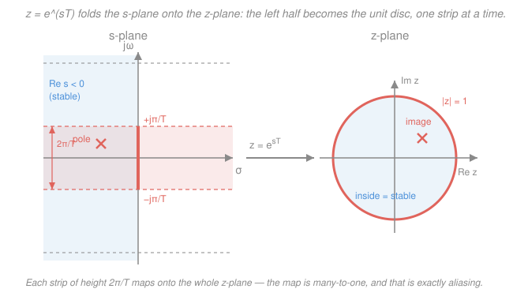
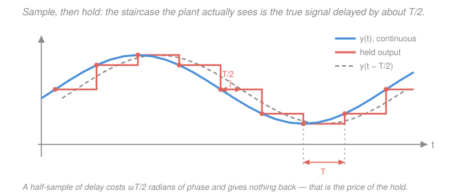

# Control Systems · Lesson 5.5: A taste of digital control

> ⏱ ~15 min · Module 5: State-space control · Builds on: [3.4 Gain & phase margins](03-04-gain-and-phase-margins.md), [4.1 PID control](04-01-pid-control.md), [5.4 Pole placement & observers](05-04-pole-placement-observers.md), [`signals-systems` 3.1 Sampling](../../signals-systems/lessons/03-01-sampling-nyquist-shannon.md) · Unlocks: the end of the course — and [`robotics`](../../robotics/syllabus.md)

## Why this matters

Every controller you have designed in this course is a piece of continuous-time mathematics: an integral, a derivative, a lead network, a matrix multiply $-Kx$. **None of it will run that way.** It will run as a loop on a microcontroller that wakes up every $T$ seconds, reads one number off an A/D converter, does arithmetic, writes one number to a D/A converter, and goes back to sleep.

That single change — the controller only *looks* at the world at discrete instants, and only *speaks* to it in held steps — is enough to destabilize a design that had a beautiful $60^\circ$ phase margin on paper. Not because the math was wrong, but because sampling costs you phase, and phase margin is the thing you were spending. This lesson is the bridge from the design you did to the code you'll ship: what the sample period $T$ does to your poles, what it does to your margins, and how to pick it.

We are taking a *taste*, not a full course. `signals-systems` already builds the machinery — [sampling](../../signals-systems/lessons/03-01-sampling-nyquist-shannon.md), [aliasing](../../signals-systems/lessons/03-02-aliasing-and-reconstruction.md), the [z-transform](../../signals-systems/lessons/04-01-z-transform-and-roc.md), the [z-plane](../../signals-systems/lessons/04-02-discrete-transfer-functions-z-plane.md) — so we borrow it and spend our budget on the *control* consequences.

## The idea

Draw the real loop and you get something odd: a **hybrid**. The plant is a physical object obeying a differential equation in continuous time — it never stops moving. The controller is a difference equation running on a clock. Between them sit two translators:

- an **A/D converter (the sampler)**, which turns the continuous $y(t)$ into a sequence $y[k] = y(kT)$;
- a **D/A converter with a zero-order hold (ZOH)**, which turns the number $u[k]$ into a voltage that stays *pinned at that value* for the whole next period, then jumps.

Two facts follow, and they are the whole lesson.

**First: you are now blind between samples.** Whatever the plant does in the $T$ seconds after a measurement, you will not know about it and cannot react to it. If the plant can do something interesting faster than $T$, you are flying on stale information. That is where aliasing lives.

**Second: you are now deaf between samples too.** The hold does not interpolate; it staircases. On average the plant is being driven by a command that is *half a sample period out of date*. Half a sample of delay sounds harmless. It is not — delay is the single most corrosive thing you can put in a feedback loop, because it burns phase margin without giving you any gain reduction in return ([3.4](03-04-gain-and-phase-margins.md)).

So: sampling too slowly does not usually make the plant "miss" information the way a bad audio recording does. It makes the *loop* unstable. That is why control engineers sample far, far faster than an audio engineer would for the same signal.

## The formal version

**The z-transform, compactly.** Where the Laplace transform turned $d/dt$ into $s$, the z-transform turns *one sample of delay* into $z^{-1}$: if $Y(z)$ is the transform of $y[k]$, then $z^{-1}Y(z)$ is the transform of $y[k-1]$. A discrete system therefore gets a **pulse transfer function** $G(z) = Y(z)/U(z)$, built from poles and zeros in the z-plane exactly as $G(s)$ was in the s-plane. Everything transfers except the stability boundary:

$$\text{continuous: poles in } \operatorname{Re}s < 0 \qquad\longleftrightarrow\qquad \text{discrete: poles with } |z| < 1.$$

*In words: "left half-plane" becomes "inside the unit circle."* A pole at $|z| > 1$ means a mode multiplied by something bigger than 1 every sample — divergence. A pole on the circle is marginal. That is all we need here; the derivations, the region of convergence, and the z-plane geometry are in [`signals-systems` 4.1](../../signals-systems/lessons/04-01-z-transform-and-roc.md) and [4.2](../../signals-systems/lessons/04-02-discrete-transfer-functions-z-plane.md).

**The mapping $z = e^{sT}$.** Why does "left half" become "inside"? Because sampling a continuous mode $e^{st}$ at $t = kT$ gives $e^{skT} = (e^{sT})^k$ — a geometric sequence with ratio

$$\boxed{\,z = e^{sT}\,}$$

*In words: a continuous pole at $s$ shows up, after sampling, as a discrete pole at $z = e^{sT}$.* Write $s = \sigma + j\omega$ and read off three consequences.

1. **Magnitude is set by $\sigma$ alone:** $|z| = e^{\sigma T}$. So $\sigma < 0 \Rightarrow |z| < 1$, $\sigma = 0 \Rightarrow |z| = 1$, $\sigma > 0 \Rightarrow |z| > 1$. The stability regions correspond exactly, which is the reason the whole classical picture survives the move to discrete time.
2. **The $j\omega$ axis becomes the unit circle:** $z = e^{j\omega T}$ has modulus 1 and angle $\omega T$. As $\omega$ runs from $-\pi/T$ to $+\pi/T$, the angle runs from $-\pi$ to $+\pi$ — once around.
3. **The map is many-to-one.** Since $e^{sT} = e^{(s + j2\pi/T)T}$, every horizontal strip of height $2\pi/T$ in the s-plane maps onto the *entire* z-plane. There is no way to tell, from the samples, which strip a mode came from. **That is aliasing, viewed structurally** rather than in the frequency domain of [`signals-systems` 3.2](../../signals-systems/lessons/03-02-aliasing-and-reconstruction.md) — same phenomenon, same $\pi/T$ boundary.

One more distortion worth knowing about: a constant-$\zeta$ ray in the s-plane (the design lines you used in [3.2](03-02-root-locus-design.md)) maps to a **logarithmic spiral**. Parametrize the ray by the damped angle $\theta = \omega_d T$; then $|z| = e^{-\theta\zeta/\sqrt{1-\zeta^2}}$, a radius shrinking exponentially in angle. This is why discrete design charts — constant-$\zeta$ spirals and constant-$\omega_n$ arcs inside the unit disc — look so strange next to the clean straight lines of the s-plane.

**The practical bite.** A real pole at $s = -a$ lands at $z = e^{-aT}$, and the product $aT$ is what matters, not $a$:

| $aT$ | $z = e^{-aT}$ | what it means |
|---|---|---|
| $0.2$ | $0.819$ | well resolved; ~5 samples per time constant |
| $2$ | $0.135$ | the mode is nearly gone in one sample |
| $4$ | $0.0183$ | crowded at the origin |
| $8$ | $0.000335$ | indistinguishable from $aT = 4$ |

*In words: sample too slowly relative to a fast pole and it collapses onto $z = 0$, where you can no longer see it, distinguish it from other fast poles, or place it.* Complex poles are worse — their angle $\omega_d T$ wraps past $\pi$ and comes back somewhere else entirely (Example 1).

**The zero-order hold's real cost.** This is the most important practical fact in the lesson. The hold has an exact transfer function $G_{\text{zoh}}(s) = \dfrac{1 - e^{-sT}}{s}$, and on the $j\omega$ axis it factors as

$$G_{\text{zoh}}(j\omega) = T\,\frac{\sin(\omega T/2)}{\omega T/2}\;e^{-j\omega T/2}.$$

*In words: the hold's phase is exactly $-\omega T/2$ radians — a pure half-sample delay — while its magnitude barely moves.* (At one-tenth the sample rate, $\omega = \omega_s/10$, the magnitude factor is $\sin(\pi/10)/(\pi/10) = 0.984$, i.e. $-0.14\ \text{dB}$. Nothing.) So to a very good approximation,

$$\boxed{\,\text{ZOH} \;\approx\; e^{-sT/2}: \text{ extra phase lag } \Delta\phi = \tfrac{\omega T}{2}\ \text{rad, no gain change.}\,}$$

Now evaluate that at the gain-crossover frequency $\omega_{gc}$, where phase margin is measured ([3.4](03-04-gain-and-phase-margins.md)). With $\omega_{gc} = 1$ rad/s:

| $T$ | $\Delta\phi = \omega_{gc}T/2$ | in degrees | verdict |
|---|---|---|---|
| $0.1$ s | $0.05$ rad | $2.86^\circ$ | negligible |
| $1$ s | $0.5$ rad | $28.6^\circ$ | catastrophic |

A design with $45^\circ$ of phase margin, sampled at $T = 1$ s, is left with $45 - 28.6 = 16.4^\circ$ — ringing, barely stable, and one modeling error from disaster. Sampled at $T = 0.1$ s it keeps $42.1^\circ$ and nobody notices. **Same controller, same plant; the only difference is the clock.** This one calculation is how you decide a sample rate.

**Choosing $T$.** Nyquist ([`signals-systems` 3.1](../../signals-systems/lessons/03-01-sampling-nyquist-shannon.md)) says $\omega_s > 2\omega_{\max}$ — that is the floor for *reconstructing a signal*, and it is nowhere near enough for *closing a loop*. Reconstruction only needs the information to survive; a feedback loop needs the information to survive **and** arrive on time. The rules of thumb engineers actually use:

$$\omega_s \approx 20\text{–}40\,\omega_{B} \qquad\text{or equivalently}\qquad 4\text{–}10 \text{ samples per rise time } t_r,$$

where $\omega_B$ is the **closed-loop bandwidth** (rad/s). *In words: sample twenty to forty times faster than the loop can move.* Compare the two floors for a loop with $\omega_B = 5$ rad/s: Nyquist would allow $T = \pi/5 = 0.63$ s; the control rule at $30\omega_B$ demands $\omega_s = 150$ rad/s, i.e. $T = 0.042$ s ($f_s = 23.9$ Hz) — **fifteen times faster**. The extra factor is bought entirely with phase margin.

**The anti-aliasing filter is not optional.** Sampling folds every noise component above $\pi/T$ down into your control band, where it is *permanently* indistinguishable from real signal ([`signals-systems` 3.2](../../signals-systems/lessons/03-02-aliasing-and-reconstruction.md)) — no amount of clever digital filtering afterwards can remove it, because the information is gone. So an analog low-pass filter goes **before** the sampler, always. And it is not free: a first-order filter with corner $\omega_c$ contributes $\arctan(\omega_{gc}/\omega_c)$ of lag. Put the corner at $5\omega_{gc}$ and you have spent another $\arctan(0.2) = 11.3^\circ$. Budget for it alongside the ZOH.

**Discretizing a design you already have.** Most engineers do exactly what you did in this course — design $G_c(s)$ in continuous time — and then convert. Three substitutions, in increasing order of quality:

- **Forward Euler**, $s \leftarrow \dfrac{z-1}{T}$. Simplest, and the derivative approximation you'd write by hand. It maps $s = -a$ to $z = 1 - aT$, which leaves the unit disc when $aT > 2$: **it can turn a stable design into an unstable one.**
- **Backward Euler**, $s \leftarrow \dfrac{z-1}{Tz}$. Maps $s = -a$ to $z = 1/(1+aT)$, always inside the circle — safe, but it distorts the frequency response noticeably and drags extra damping in.
- **Tustin (bilinear)**, the standard choice:

$$\boxed{\;s \;\leftarrow\; \frac{2}{T}\,\frac{z-1}{z+1}\;}$$

*In words: replace every $s$ in your controller with this expression and simplify.* Tustin maps the entire left half-plane onto the interior of the unit disc, one-to-one — so a stable controller discretizes to a stable one, guaranteed. Its one flaw is **frequency warping**: the whole infinite $j\omega$ axis has to be squeezed onto a finite circle, so an analog corner at $\omega$ lands at the digital frequency $\omega_d$ satisfying $\omega = \frac{2}{T}\tan(\omega_d T/2)$. If one particular frequency matters (a crossover, a notch), you **pre-warp**: shift the analog design so that after warping the feature lands exactly where you wanted it.

**A PID you could type into a microcontroller.** Take the parallel PID of [4.1](04-01-pid-control.md), $u = K_p e + K_i\!\int\! e\,dt + K_d\,\dot e$. Replace the integral by accumulation and the derivative by a backward difference:

$$u_i[k] = u_i[k-1] + K_i T\,e[k], \qquad u_d[k] = K_d\,\frac{e[k] - e[k-1]}{T},$$

$$u[k] = K_p\,e[k] + u_i[k] + u_d[k].$$

*In words: keep a running sum for the integral, subtract consecutive errors for the derivative, add the three terms.* That is four lines of code and two stored variables ($u_i[k-1]$ and $e[k-1]$) — a **difference equation**, exactly the object realized as a block diagram in [`signals-systems` 4.3](../../signals-systems/lessons/04-03-difference-equations-realizations.md).

Look hard at that $1/T$ in the derivative term. Sample faster and it grows without bound: at $T = 20$ ms with $K_d = 0.1$ the gain on $(e[k]-e[k-1])$ is $5$; at $T = 2$ ms it is $50$. But $e[k] - e[k-1]$ contains all your measurement noise and, at small $T$, very little real signal. **This is precisely why derivative action is the noise-sensitive term, and why real implementations always filter it** (a "derivative on measurement, low-pass filtered" form). Two more effects are real and worth a sentence: the A/D quantizes, so there is a noise floor and a limit cycle you can't design away, and fixed-point word length can make an integrator with a tiny $K_i T$ silently accumulate *nothing* when the increment rounds to zero.

**LQR, named only.** The systematic alternative to hand-picking closed-loop poles in [5.4](05-04-pole-placement-observers.md) is the **linear-quadratic regulator**: it computes the state-feedback gain $K$ that minimizes a quadratic cost $J$ trading accumulated state error against accumulated control effort, so you tune two weightings instead of guessing $n$ pole locations. It has a clean discrete-time version. That is all we'll say — it belongs to optimal control.

## Picture

## Worked examples

**Example 1 (mechanical — map a pole pair, and watch it alias).** A closed-loop pole pair has $\zeta = 0.5$, $\omega_n = 10$ rad/s, so

$$s = -\zeta\omega_n \pm j\omega_d = -5 \pm j8.660, \qquad \omega_d = 10\sqrt{1 - 0.25} = 8.660\ \text{rad/s}.$$

*Sampled at $T = 0.05$ s.* Magnitude $|z| = e^{-5(0.05)} = e^{-0.25} = 0.779$; angle $\omega_d T = 8.660(0.05) = 0.433$ rad $= 24.8^\circ$. That is $2\pi/0.433 = 14.5$ samples per oscillation — plenty. The discrete pole sits at $0.779\angle{\pm}24.8^\circ$, comfortably inside the circle and comfortably away from both $z = 0$ and $z = 1$. Design here works.

*Sampled at $T = 0.5$ s.* Magnitude $e^{-2.5} = 0.0821$; angle $8.660(0.5) = 4.330$ rad. But $4.330 > \pi$, so this is *past the Nyquist boundary* $\pi/T = 6.283$ rad/s $< \omega_d$. The angle wraps:

$$4.330 - 2\pi = -1.953\ \text{rad} \;\Longrightarrow\; \text{apparent frequency } \frac{1.953}{0.5} = 3.906\ \text{rad/s}.$$

*Check.* Aliasing predicts an apparent frequency $\omega_s - \omega_d = \frac{2\pi}{0.5} - 8.660 = 12.566 - 8.660 = 3.906$ rad/s. ✓ Same number, two routes.

So your $8.66$ rad/s oscillation *reads on the samples as a $3.9$ rad/s oscillation going the other way* — at $1.45$ samples per cycle you literally cannot see the real motion. And $|z| = 0.082$ puts it a whisker from the origin, where it is indistinguishable from any other fast mode. A controller designed against that discrete model is designed against a fiction.

**Example 2 (why you'd care — from spec to firmware).** A loop crosses over at $\omega_{gc} = 8$ rad/s with a continuous-time phase margin of $60^\circ$, and you have a PI controller $G_c(s) = 2 + 5/s$ to implement.

*Step 1 — spend the phase budget.* Pick $T = 0.01$ s. ZOH lag: $\omega_{gc}T/2 = 8(0.01)/2 = 0.04$ rad $= 2.29^\circ$. Anti-aliasing filter, first order at $\omega_c = 5\omega_{gc} = 40$ rad/s: $\arctan(8/40) = 11.31^\circ$. Total spent $13.6^\circ$, leaving $46.4^\circ$ — acceptable.

*Step 2 — sanity-check against the rule of thumb.* $\omega_s = 2\pi/0.01 = 628$ rad/s $= 78.5\,\omega_{gc}$. Well above the $20$–$40\times$ guideline, which is why the budget came out so cheap. (If $T$ had been forced up to $0.05$ s, $\omega_s/\omega_{gc} = 15.7$ — below the guideline — and the ZOH alone would cost $11.5^\circ$.)

*Step 3 — discretize.* With $K_p = 2$, $K_i = 5$, $T = 0.01$, the accumulate-and-add form gives $K_i T = 0.05$:

$$u_i[k] = u_i[k-1] + 0.05\,e[k], \qquad u[k] = 2\,e[k] + u_i[k].$$

*Step 4 — remember the physical world.* Clamp $u_i$ to the actuator's range (integral windup, [4.1](04-01-pid-control.md)), and make sure the loop really executes every $10$ ms — jitter in $T$ is jitter in your phase margin.

That is the entire journey from a Bode plot to shipping code.

## Watch out

- **You might think Nyquist tells you how fast to sample a control loop.** It doesn't — it tells you the rate below which the *signal* is unrecoverable. A loop sampled at 3× its bandwidth satisfies Nyquist handsomely and is often unstable. Sample rate in control is set by the **phase budget**, not by the information content.
- **You might think a slow sample rate just makes the response a bit coarse.** The failure mode is not coarseness, it's *instability* — $\omega T/2$ of lag at crossover with nothing gained in return. And it is invisible in a continuous-time simulation, which is why designs pass in simulation and oscillate on the bench.
- **You might think you can digitally filter out aliased noise.** You cannot. Once a 300 Hz vibration folds down to 5 Hz, it *is* a 5 Hz signal in your data — no filter can separate it from the real 5 Hz motion. The anti-aliasing filter must be analog and must sit before the A/D. This is the one part of a digital controller you can't fix in software.
- **You might reach for forward Euler because it's the obvious difference quotient.** It is the one substitution that can hand you an unstable controller from a stable design ($|1 - aT| > 1$ whenever $aT > 2$). Use Tustin unless you have a reason not to.

## One-liner

> $z = e^{sT}$ wraps the left half-plane into the unit disc — many-to-one, which is aliasing — and the hold that makes it all work quietly charges you $\omega T/2$ radians of phase margin every time around the loop.

## Problems

**P1 (🟢)** A continuous plant has a pole at $s = -4$. (a) Where does it land in the z-plane if you sample at $T = 0.05$ s? (b) What sample period would put the discrete pole at $z = 0.5$? (c) For any $a > 0$ and $T > 0$, can $z = e^{-aT}$ ever land outside the unit circle?

**P2 (🟡)** A unity-feedback loop has gain crossover at $\omega_{gc} = 8$ rad/s and a continuous-time phase margin of $55^\circ$. You will implement the controller digitally with a ZOH, and the spec requires at least $45^\circ$ of phase margin after discretization. (a) What is the largest sample period $T$ you can use, and the corresponding minimum sampling frequency in Hz? (b) Express your $\omega_s$ as a multiple of $\omega_{gc}$ and compare it against the $20$–$40\times$ rule of thumb. Would you actually ship the $T$ from part (a)?

**P3 (🔴)** A controller has a pole at $s = -10$ and you are stuck with $T = 0.25$ s. Compute the discrete pole location under (a) the exact map $z = e^{sT}$, (b) forward Euler, (c) backward Euler, (d) Tustin. Which method fails, and what is the failure?

Solutions

**P1**

(a) The map is $z = e^{sT}$ with $s = -4$, $T = 0.05$, so $aT = 0.2$:

$$z = e^{-0.2} = 0.8187.$$

*Check.* $aT = 0.2$ is small, so we expect $z$ just inside $1$ — the pole is slow compared to the sampling, exactly as the table in the lesson says (5 samples per time constant, since $\tau = 1/4 = 0.25$ s and $T = 0.05$ s). ✓

(b) Solve $e^{-4T} = 0.5$:

$$-4T = \ln 0.5 = -0.6931 \;\Longrightarrow\; T = \frac{0.6931}{4} = 0.1733\ \text{s}.$$

*Check.* Substitute back: $e^{-4(0.1733)} = e^{-0.6931} = 0.5000$. ✓ Note this is $T \approx 0.69\tau$ — sampling slower than the plant's own time constant, which is already far too slow for closed-loop use even though the map itself is perfectly well behaved.

(c) No. For $a > 0$ and $T > 0$ the exponent $-aT$ is strictly negative, so $z = e^{-aT} \in (0, 1)$ — always strictly inside the unit circle, and always on the positive real axis. **A stable continuous pole is always a stable discrete pole under the exact map.** (This is the "left half maps inside" property, and it is exactly what forward Euler in P3 fails to preserve.) Slow sampling doesn't destabilize the *plant model*; it destabilizes the *loop*, through the hold's phase lag — a different mechanism entirely.

**P2**

(a) The ZOH costs $\Delta\phi = \omega_{gc}T/2$ radians at crossover. The budget is what you can afford to lose:

$$\Delta\phi_{\max} = 55^\circ - 45^\circ = 10^\circ = 10 \times \frac{\pi}{180} = 0.17453\ \text{rad}.$$

Set $\omega_{gc}T/2 = 0.17453$ and solve:

$$T = \frac{2(0.17453)}{8} = 0.043633\ \text{s}, \qquad f_s = \frac{1}{T} = 22.9\ \text{Hz}.$$

*Check.* At $T = 0.043633$: $\Delta\phi = 8(0.043633)/2 = 0.17453$ rad $= 0.17453 \times \frac{180}{\pi} = 10.00^\circ$, leaving exactly $45^\circ$. ✓

(b) The sampling frequency in rad/s is

$$\omega_s = \frac{2\pi}{T} = \frac{6.2832}{0.043633} = 144.0\ \text{rad/s} = 18.0\,\omega_{gc}.$$

That is **below** the $20$–$40\times$ guideline — and it should be, because part (a) deliberately spent the *entire* margin surplus on the hold alone, leaving nothing for the anti-aliasing filter, computational delay, or plant-model error. So no, don't ship it.

Take $T = 0.03$ s instead: $\omega_s = 2\pi/0.03 = 209.4$ rad/s $= 26.2\,\omega_{gc}$, inside the guideline, and the ZOH now costs $\Delta\phi = 8(0.03)/2 = 0.12$ rad $= 6.88^\circ$, leaving $48.1^\circ$. Still not much slack: a first-order anti-aliasing filter at $\omega_c = 5\omega_{gc} = 40$ rad/s would add $\arctan(0.2) = 11.3^\circ$ and drop you to $36.8^\circ$. The honest conclusion is that you must either sample faster still or push the filter corner out — which is precisely the trade the guideline exists to warn you about.

**P3** With $a = 10$ and $T = 0.25$, so $aT = 2.5$:

(a) **Exact:** $z = e^{-aT} = e^{-2.5} = 0.0821$. Stable, but crowded against the origin — the mode is essentially dead within one sample.

(b) **Forward Euler**, $s = (z-1)/T$: setting $(z-1)/T = -a$ gives $z = 1 - aT = 1 - 2.5 = -1.5$.

(c) **Backward Euler**, $s = (z-1)/(Tz)$: setting $(z-1)/(Tz) = -a$ gives $z - 1 = -aTz$, so $z(1 + aT) = 1$ and

$$z = \frac{1}{1 + aT} = \frac{1}{3.5} = 0.2857.$$

(d) **Tustin**, $s = \frac{2}{T}\frac{z-1}{z+1}$: inverting gives $z = \dfrac{1 + sT/2}{1 - sT/2}$, and with $sT/2 = -1.25$,

$$z = \frac{1 - 1.25}{1 + 1.25} = \frac{-0.25}{2.25} = -0.1111.$$

**Forward Euler fails.** $|z| = 1.5 > 1$: a perfectly stable continuous pole has been discretized into an *unstable* discrete one. The condition is $|1 - aT| > 1$, i.e. $aT > 2$, and here $aT = 2.5$. Backward Euler ($|z| = 0.286$) and Tustin ($|z| = 0.111$) both stay inside, as their mapping properties guarantee.

*Check.* Every method should agree with the exact answer as $T \to 0$. Try $T = 0.01$ ($aT = 0.1$): exact $e^{-0.1} = 0.9048$; forward $1 - 0.1 = 0.9000$; backward $1/1.1 = 0.9091$; Tustin $(1-0.05)/(1+0.05) = 0.9048$. ✓ All four agree to three digits, and Tustin matches the exact value to four — the accuracy ranking the lesson claims. The disagreement at $T = 0.25$ is entirely a large-$aT$ effect.

*Note the sign.* Tustin's $z = -0.111$ is negative real, which corresponds to a mode alternating sign every sample (ringing at the Nyquist frequency). It's stable, but it's a warping artifact, not physics — another reminder that $aT = 2.5$ is simply too coarse.

## Flashback

**From Lesson 2.2 (Second-order response):** A closed-loop system has poles at $s = -3 \pm j4$. Find $\zeta$, $\omega_n$, the percent overshoot, and the 2 percent settling time. Then: below what sample rate would this pole pair alias?

Solution

Read the pole $s = -\zeta\omega_n + j\omega_d$ directly. The distance from the origin is $\omega_n$:

$$\omega_n = \sqrt{3^2 + 4^2} = \sqrt{25} = 5\ \text{rad/s}, \qquad \zeta = \frac{3}{\omega_n} = \frac{3}{5} = 0.6.$$

Percent overshoot:

$$M_p = 100\,e^{-\pi\zeta/\sqrt{1-\zeta^2}} = 100\,e^{-\pi(0.6)/0.8} = 100\,e^{-2.3562} = 9.48,$$

so about $9.5$ percent. Settling time to 2 percent uses $t_s \approx 4/(\zeta\omega_n)$, and $\zeta\omega_n = 3$ is just the magnitude of the real part:

$$t_s \approx \frac{4}{3} = 1.33\ \text{s}.$$

*Check.* $\sqrt{1 - 0.36} = \sqrt{0.64} = 0.8$ ✓, and $\zeta = 0.6$ is the textbook "about 10 percent overshoot" damping — consistent. Cross-check $\omega_d$: the imaginary part is $4$, and $\omega_n\sqrt{1-\zeta^2} = 5(0.8) = 4$ ✓.

*The digital part.* The pair aliases once $\omega_d$ exceeds the Nyquist frequency $\pi/T$, i.e. when

$$\frac{\pi}{T} < 4 \;\Longrightarrow\; T > \frac{\pi}{4} = 0.785\ \text{s}.$$

So sampling slower than about $1.27$ Hz makes the oscillation misreport its own frequency. But note how useless that floor is as a design rule: at $T = 0.785$ s the ZOH would cost $\omega_{gc}T/2$ radians of phase at whatever crossover this loop has — tens of degrees. You'd be choosing $T$ from the phase budget long before aliasing became your problem, which is the whole point of this lesson.

## Connections

- **Backward:** the stability test you've used since [2.4](02-04-stability-routh-hurwitz.md) — poles strictly in the left half-plane — becomes "poles strictly inside the unit circle," because $|z| = e^{\sigma T}$. The phase-margin bookkeeping is [3.4](03-04-gain-and-phase-margins.md) verbatim, with one extra term $\omega T/2$ in the ledger. The PID you're discretizing is [4.1](04-01-pid-control.md), and the state feedback LQR would design for you is [5.4](05-04-pole-placement-observers.md).
- **Forward:** [`robotics`](../../robotics/syllabus.md) is where this gets used hardest — every joint servo is a discrete loop closed at a few kHz around a nonlinear, coupled plant, and the sample-rate/phase-margin argument in this lesson is the reason those rates are what they are.
- **Sideways:** the difference equation $u[k] = K_p e[k] + u_i[k] + u_d[k]$ is a filter, and [`signals-systems` 4.3](../../signals-systems/lessons/04-03-difference-equations-realizations.md) shows how to realize it as a block diagram and why some realizations are numerically better than others. Tustin's frequency warping is the same warping used in digital [filter design](../../signals-systems/lessons/04-04-filter-design-basics.md) — a controller and a filter are the same object wearing different job titles.

**Closing the loop on the course.** Look at what you can now do. You took physical hardware and wrote its differential equation ([1.2](01-02-modeling-systems-as-odes.md)); Laplace turned that into algebra and a transfer function whose poles *are* the behavior ([1.3](01-03-laplace-transform-toolkit.md)–[1.4](01-04-transfer-functions-poles-zeros.md)); block-diagram algebra collapsed a whole interconnection into one $T(s)$ ([1.5](01-05-block-diagram-algebra.md)); you learned to read speed, overshoot, accuracy, and — above all — stability straight off those poles ([2.1](02-01-first-order-response.md)–[2.4](02-04-stability-routh-hurwitz.md)). Then two graphical superpowers: the root locus, which shows you where the poles *go* as you turn the gain ([3.1](03-01-root-locus-construction.md)–[3.2](03-02-root-locus-design.md)), and the frequency response, which tells you not just whether you're stable but *how close to not being* ([3.3](03-03-frequency-response-bode-plots.md)–[3.5](03-05-nyquist-criterion.md)). With those you designed real controllers — PID, tuned systematically, and lead/lag networks to buy back the phase or the accuracy a plain gain couldn't ([4.1](04-01-pid-control.md)–[4.3](04-03-lead-lag-compensators.md)). Then the modern view: states instead of input–output, where you can test whether steering and sensing are even *possible*, place every pole at will, and rebuild the states you can't measure ([5.1](05-01-state-space-modeling.md)–[5.4](05-04-pole-placement-observers.md)). And now, finally, the honest ending: all of it will run as a `while` loop on a chip that glances at the world every $T$ seconds and holds its answer in between — and that clock is a design variable as real as any gain.

What we deliberately left out, so you know where the edges are: **nonlinear control** (when linearization stops being honest — saturation, friction, big excursions), **optimal control** (LQR and beyond, choosing $K$ by minimizing a cost instead of by taste), **robust control** ($H_\infty$ and friends, designing against a *set* of plants because you never know the real one), and **adaptive control** (when the plant changes underneath you). Each is a course. But every one of them is built on the objects in your hands right now: a model, a loop, a pole, and a margin.
