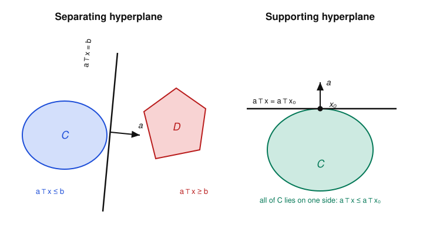

# Convex Optimization · Lesson 1.1: Convex sets and the separating hyperplane

> ⏱ ~15 min · Module 1: Convex sets and convex functions · Builds on: nothing (course start) · Unlocks: [Lesson 1.2](01-02-convex-set-zoo-operations.md) (a zoo of convex sets and operations that preserve them)

## Why this matters

The entire course hangs on one geometric fact: a convex set has no dents, so a flat plane can always be slipped between it and any point (or set) outside it. That plane is the separating hyperplane, and it is the hidden actor behind everything downstream — it is why a Lagrange dual gives a valid lower bound (Module 3), why the KKT conditions are geometry and not just algebra, and it is literally the classifier a support vector machine learns (Lesson 5.2). Get comfortable *seeing* convexity now and the rest of the course becomes bookkeeping on top of this one picture.

## The idea

A set is **convex** if, whenever two points belong to it, the entire straight segment joining them belongs to it too. A filled disk is convex; a solid cube, a line, a halfplane — all convex. A crescent moon is not: pick a point on each horn and the chord between them cuts through empty space. "No dents, no holes, no notches" is the whole intuition.

Why do we care so much? Because a convex blob has a defining feature: from any point *outside* it, you can hold up a flat sheet — a **hyperplane** — that has the whole blob on one side and the point on the other. Two convex blobs that don't overlap can be split the same way, one blob per side. And if you stand *on the boundary* of a convex set, you can always lean a flat sheet against the set right there, touching it but never cutting in. Non-convex sets fail all of this: a dent lets a would-be separator slice straight through the set.

Those three sheets — separating a point from a set, separating two sets, and resting against a boundary — are the same idea at different settings, and they are the reason convexity is the watershed between optimization problems you can solve globally and ones you can only pray about.

## The formal version

Throughout, $x, y \in \mathbb{R}^n$ are points (vectors), and $a^\top x = \sum_{i} a_i x_i$ is the standard inner product of $a$ with $x$.

**Definition (convex set).** A set $C \subseteq \mathbb{R}^n$ is **convex** if for all $x, y \in C$ and all $\theta \in [0,1]$,
$$\theta x + (1-\theta) y \in C.$$

*In words:* if two points are in the set, every point on the segment between them is in the set too — sweeping $\theta$ from $0$ to $1$ traces that segment from $y$ to $x$.

**Definition (convex combination, convex hull).** A **convex combination** of points $x_1,\dots,x_k$ is any weighted average $\sum_{i=1}^k \theta_i x_i$ with weights $\theta_i \ge 0$ and $\sum_i \theta_i = 1$. The **convex hull** $\operatorname{conv} S$ is the set of all convex combinations of points of $S$ — equivalently, the smallest convex set containing $S$.

*In words:* a convex combination is a "center of mass" of points using non-negative weights that sum to one; the convex hull is the shape you get by shrink-wrapping $S$.

An easy induction extends the definition: a set is convex **iff** it contains every convex combination of *finitely many* of its points, not just pairs.

**Definition (hyperplane, halfspace).** For a nonzero vector $a \in \mathbb{R}^n$ and scalar $b \in \mathbb{R}$, the **hyperplane** is
$$H = \{x : a^\top x = b\},$$
and it splits $\mathbb{R}^n$ into two closed **halfspaces** $\{x : a^\top x \le b\}$ and $\{x : a^\top x \ge b\}$.

*In words:* a hyperplane is a flat sheet of one dimension less than the space (a line in the plane, a plane in 3D). The vector $a$ is its **normal** — it points perpendicular to the sheet — and $b$ sets how far the sheet sits from the origin. Each halfspace is everything on one side.

**Separating Hyperplane Theorem.** Let $C$ and $D$ be nonempty disjoint convex sets in $\mathbb{R}^n$. Then there exist $a \neq 0$ and $b$ with
$$a^\top x \le b \ \text{ for all } x \in C, \qquad a^\top x \ge b \ \text{ for all } x \in D.$$
If in addition one of them is **closed** and the other is **compact** (closed and bounded), the separation can be made **strict** (with $<$ and $>$, and a genuine gap between the two sets).

*In words:* two convex sets that don't touch can be cleanly divided by a single flat sheet — everything of $C$ on one side, everything of $D$ on the other. The closed-plus-compact hypothesis is what buys you a *gap* rather than a sheet the two sets might both graze.

**Supporting Hyperplane Theorem.** Let $C$ be a convex set and $x_0$ a point on its boundary. Then there exists $a \neq 0$ with
$$a^\top x \le a^\top x_0 \quad \text{for all } x \in C.$$
The hyperplane $\{x : a^\top x = a^\top x_0\}$ is a **supporting hyperplane** to $C$ at $x_0$.

*In words:* at any boundary point you can rest a flat sheet against the set — it touches at $x_0$ and the whole set stays on one side of it. (At a smooth boundary point this is the tangent plane; at a corner there are many choices of $a$.)

**Proof sketch (separation via the closest point).** Take the clean case: $C$ closed and convex, and a single point $y \notin C$. Because $C$ is closed and $\lVert x - y\rVert_2$ grows without bound as $x$ leaves any bounded region, the distance from $y$ to $C$ is attained at a unique closest point $x^\star \in C$ (uniqueness is exactly convexity: if two points tied for closest, their midpoint would be strictly closer — the parallelogram identity makes this precise). Set the normal to point from $x^\star$ toward $y$:
$$a = y - x^\star \neq 0.$$
The claim is that the hyperplane through the midpoint with this normal separates $y$ from $C$. Geometrically: if any $x \in C$ poked across to $y$'s side, then stepping a hair from $x^\star$ toward $x$ — legal, since $C$ is convex, so the whole segment $[x^\star, x] \subseteq C$ — would land *closer* to $y$ than $x^\star$, contradicting that $x^\star$ was closest. Formally, for any $x \in C$ and small $\theta \in (0,1]$, $x^\star + \theta(x - x^\star) \in C$, so its squared distance to $y$ is $\ge \lVert x^\star - y\rVert_2^2$; expanding and letting $\theta \to 0^+$ yields $a^\top(x - x^\star) \le 0$, i.e. $a^\top x \le a^\top x^\star < a^\top y$. Separating two convex sets $C, D$ reduces to this: apply it to the difference set $C - D = \{u - v : u \in C, v \in D\}$, which is convex, and to the point $0$ (which lies outside $C-D$ precisely because $C$ and $D$ are disjoint). The supporting theorem follows by approaching a boundary point $x_0$ with outside points $y_k \to x_0$, separating each, and taking a limit of the (normalized) normals. $\blacksquare$

## Picture

On the left, the disjoint convex sets $C$ and $D$ live in opposite halfspaces of the line $a^\top x = b$; the normal $a$ points from $C$'s side toward $D$. On the right, the sheet touches $C$ at the single boundary point $x_0$ and the entire set stays below it — that is *support*, not separation.

## Worked examples

**Example 1 (mechanical — is it convex, and separate a point).** Let $C = \{x \in \mathbb{R}^2 : \lVert x\rVert_2 \le 1\}$, the closed unit disk, and take the outside point $y = (2, 0)$.

*Convex?* For $x, x'$ in the disk and $\theta \in [0,1]$, the triangle inequality gives $\lVert \theta x + (1-\theta) x'\rVert_2 \le \theta\lVert x\rVert_2 + (1-\theta)\lVert x'\rVert_2 \le \theta + (1-\theta) = 1$, so the segment stays in $C$. Convex. ✓

*Separate.* The closest point of $C$ to $y$ is $x^\star = (1,0)$ (walk straight in from $y$ to the boundary). The recipe gives the normal $a = y - x^\star = (1,0)$, and we place the sheet at the midpoint $(1.5, 0)$: take $b = a^\top(1.5,0) = 1.5$. Check: every $x = (x_1, x_2) \in C$ has $a^\top x = x_1 \le 1 < 1.5 = b$, while $a^\top y = 2 > 1.5$. Strict separation, with a gap — exactly what closed-plus-compact promised.

**Example 2 (why you'd care — a separator is a linear classifier).** Suppose one convex blob of data points is "spam" and a disjoint convex blob is "not spam" in feature space $\mathbb{R}^n$. The separating hyperplane theorem hands you $a$ and $b$ with $a^\top x \le b$ for one class and $a^\top x \ge b$ for the other. The decision rule "predict spam iff $a^\top x < b$" *is* a linear classifier — and choosing the separator with the widest gap is precisely the support vector machine you'll derive as a convex program in [Lesson 5.2](05-02-support-vector-machines.md). Convexity of the two clouds is what guarantees a clean linear divider exists at all; when the clouds interlock (non-convex, overlapping), no such sheet works and you must either lift to a higher-dimensional feature space or allow margin violations.

## Watch out

- You might think "convex" means *rounded* — but it is about the segment test, nothing to do with curvature. A solid triangle, square, or halfspace is convex despite having flat sides and sharp corners; a boomerang shape is non-convex despite being all curves. Test the chord, not the outline.
- You might think a supporting hyperplane at a boundary point is unique — but only at *smooth* boundary points. At a corner of a polygon (or the tip of the ice-cream cone in Lesson 2.3) there is a whole fan of valid supporting hyperplanes, one for each direction you could lean the sheet. The theorem promises *at least one*, not exactly one.
- You might think *any* two disjoint convex sets can be *strictly* separated — but they can't in general. Take $C = \{(x_1,x_2): x_2 \le 0\}$ and $D = \{(x_1,x_2): x_1 > 0,\ x_2 \ge 1/x_1\}$: both convex, disjoint, yet they crowd arbitrarily close to the line $x_2 = 0$, so only *non-strict* separation ($\le$/$\ge$) holds. The closed-plus-compact hypothesis is exactly the fix that rules this out.

## One-liner

> A convex set has no dents, so you can always slide a flat sheet against it — between it and an outside point, between two of them, or resting on its boundary — and that sheet is the separating/supporting hyperplane the whole course is built on.

## Problems

**P1 (🟢)** Prove directly from the definition that the intersection of two convex sets $C_1, C_2 \subseteq \mathbb{R}^n$ is convex. Then give a two-set example showing the *union* need not be convex.

**P2 (🟡)** Let $C = \{x \in \mathbb{R}^2 : x_1 \ge 0,\ x_2 \ge 0\}$ be the nonnegative quadrant (convex — you may assume it). Find a supporting hyperplane at the boundary point $x_0 = (3, 0)$, and explain why the supporting hyperplane at the corner $x_0 = (0,0)$ is *not* unique by exhibiting two different valid normals $a$.

**P3 (🔴, optional)** Prove the "closest point is unique" claim used in the separation proof: if $C$ is closed and convex and $y \notin C$, there is exactly one $x^\star \in C$ minimizing $\lVert x - y\rVert_2$. (Hint: suppose $x^\star$ and $\tilde{x}$ both attain the minimum distance $d$. Their midpoint lies in $C$ by convexity; bound its distance to $y$ using the parallelogram law $\lVert u\rVert_2^2 + \lVert v\rVert_2^2 = \tfrac12\lVert u+v\rVert_2^2 + \tfrac12\lVert u-v\rVert_2^2$.)

Solutions

**P1** Let $x, y \in C_1 \cap C_2$ and $\theta \in [0,1]$. Since $x, y \in C_1$ and $C_1$ is convex, $\theta x + (1-\theta)y \in C_1$. Since $x, y \in C_2$ and $C_2$ is convex, $\theta x + (1-\theta)y \in C_2$. Hence the point lies in both, i.e. in $C_1 \cap C_2$, which is therefore convex. $\blacksquare$ (The same one-line argument shows an intersection of *any* family of convex sets is convex — the workhorse of Lesson 1.2.)

*Union counterexample:* let $C_1 = \{(t,0): t \in [0,1]\}$ and $C_2 = \{(t,1): t \in [0,1]\}$ be two parallel unit segments (each convex). Their union contains $(0,0)$ and $(0,1)$ but not the midpoint $(0, \tfrac12)$, so it is not convex.

**P2** *At $x_0 = (3,0)$:* this point sits on the boundary edge $\{x_2 = 0,\ x_1 \ge 0\}$. Take the normal $a = (0, -1)$, giving the hyperplane $a^\top x = a^\top x_0$, i.e. $-x_2 = 0$, the $x_1$-axis. For every $x \in C$ we have $x_2 \ge 0$, so $a^\top x = -x_2 \le 0 = a^\top x_0$. The whole quadrant lies on one side and the sheet touches at $x_0$. Valid. ✓

*At the corner $x_0 = (0,0)$:* here $a^\top x_0 = 0$ for any $a$, so we need $a^\top x \le 0$ for all $x \in C$, i.e. $a_1 x_1 + a_2 x_2 \le 0$ whenever $x_1, x_2 \ge 0$. This holds exactly when $a_1 \le 0$ and $a_2 \le 0$. Two valid choices: $a = (-1, 0)$ (the sheet is the $x_2$-axis) and $a = (0,-1)$ (the sheet is the $x_1$-axis) — and indeed any $a = (-\alpha, -\beta)$ with $\alpha,\beta \ge 0$ works. The corner admits a whole fan of supporting hyperplanes, so it is not unique. $\blacksquare$

**P3** Let $d = \inf_{x \in C}\lVert x - y\rVert_2$. Because $C$ is closed and the objective $\to \infty$ off any bounded set, the infimum is attained (a minimizing sequence stays bounded, has a convergent subsequence, and its limit lies in $C$ by closedness). So at least one minimizer exists.

*Uniqueness.* Suppose $x^\star, \tilde{x} \in C$ both attain $\lVert x^\star - y\rVert_2 = \lVert \tilde{x} - y\rVert_2 = d$. By convexity the midpoint $m = \tfrac12(x^\star + \tilde{x}) \in C$, so $\lVert m - y\rVert_2 \ge d$. Apply the parallelogram law with $u = x^\star - y$ and $v = \tilde{x} - y$:
$$\lVert u\rVert_2^2 + \lVert v\rVert_2^2 = \tfrac12\lVert u+v\rVert_2^2 + \tfrac12\lVert u - v\rVert_2^2.$$
Now $u + v = (x^\star + \tilde{x}) - 2y = 2(m - y)$ and $u - v = x^\star - \tilde{x}$, so
$$d^2 + d^2 = \tfrac12\,\lVert 2(m-y)\rVert_2^2 + \tfrac12\lVert x^\star - \tilde{x}\rVert_2^2 = 2\lVert m - y\rVert_2^2 + \tfrac12\lVert x^\star - \tilde{x}\rVert_2^2.$$
Thus $2d^2 = 2\lVert m-y\rVert_2^2 + \tfrac12\lVert x^\star - \tilde{x}\rVert_2^2 \ge 2d^2 + \tfrac12\lVert x^\star - \tilde{x}\rVert_2^2$, forcing $\lVert x^\star - \tilde{x}\rVert_2^2 \le 0$. Hence $x^\star = \tilde{x}$: the closest point is unique. $\blacksquare$ (This is *exactly* where convexity of $C$ is spent — without it, a nonconvex set can have two equidistant nearest points.)

## Connections

- **Forward:** [Lesson 1.2](01-02-convex-set-zoo-operations.md) uses P1's intersection rule as its main engine — polyhedra, norm balls, ellipsoids, and the PSD cone are all built by intersecting or transforming the halfspaces and simple sets introduced here.
- **Forward:** the separating/supporting hyperplane is the geometric heart of duality (Module 3): weak duality *is* a separating hyperplane between the epigraph of the problem and the region below the optimal value, and the KKT stationarity condition (Lesson 3.3) says the objective's gradient is a supporting hyperplane's normal to the feasible set. Watch for the picture to return in [Lesson 3.4](03-04-geometry-of-duality.md).
- **Sideways (statistical learning):** the maximum-margin separator of [Lesson 5.2](05-02-support-vector-machines.md) is a separating hyperplane chosen to maximize the gap — the same object `statistical-learning` studies as the SVM classifier. Example 2's linear decision rule is its skeleton.
