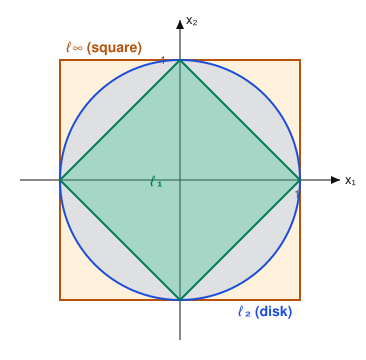
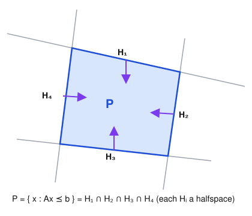

# Convex Optimization · Lesson 1.2: A zoo of convex sets, and operations that preserve convexity

> ⏱ ~15 min · Module 1: Convex sets and convex functions · Builds on: [Lesson 1.1](01-01-convex-sets-separating-hyperplane.md) · Unlocks: [Lesson 1.3](01-03-convex-functions-epigraph.md) (convex functions and the epigraph)

## Why this matters

Lesson 1.1 gave you the definition of a convex set and one theorem (separation). But you can't run the line-segment definition from scratch on every feasible set you meet — real problems come with dozens of constraints. The professional move is different: memorize a small **zoo** of shapes that are convex on sight, learn a handful of **operations** that are guaranteed to keep you inside convex-land, and then *assemble*. Every LP, QP, SOCP, and SDP feasible set in Module 2 is one of these primitives glued together with these operations. Get fluent here and "is this problem convex?" becomes a lookup, not a proof.

## The idea

Think of how you handle continuity. You don't do an $\varepsilon$–$\delta$ argument for $e^{\sin x}+3x^2$; you know $e^x$, $\sin x$, $x^2$ are continuous and that sums and compositions of continuous functions are continuous, so you're done in one glance. Convexity works the same way, and this lesson is the two halves of that reflex:

1. **A stock of primitives** you recognize instantly — halfspaces, polyhedra, norm balls, ellipsoids, the positive-semidefinite cone, the probability simplex.
2. **Safe operations** — intersection, affine images and preimages, sums, products — each one a promise: *feed me convex sets and I return a convex set.*

The one operation that is conspicuously **absent** is union, and remembering that saves you from the most common beginner error.

## The formal version

Recall the definition from Lesson 1.1: a set $C\subseteq\mathbb{R}^n$ is **convex** if for all $x,y\in C$ and $\theta\in[0,1]$, the point $\theta x+(1-\theta)y$ lies in $C$ — the whole segment between any two members stays inside.

### The zoo

**Hyperplane and halfspace.** For $a\in\mathbb{R}^n$, $a\neq 0$, and $b\in\mathbb{R}$:
$$\text{hyperplane } \{x: a^\top x = b\}, \qquad \text{halfspace } \{x: a^\top x \le b\}.$$
*In words:* a hyperplane is a flat sheet; a halfspace is everything on one side of it. Both are convex — if $a^\top x\le b$ and $a^\top y\le b$ then $a^\top(\theta x+(1-\theta)y)=\theta a^\top x+(1-\theta)a^\top y\le \theta b+(1-\theta)b=b$. These are the atoms; everything below is built from them.

**Polyhedron.** A finite system of linear inequalities (and equalities):
$$P=\{x: Ax\preceq b\}, \qquad A\in\mathbb{R}^{m\times n},$$
where $\preceq$ is componentwise $\le$. *In words:* a polyhedron is the region cut out by finitely many flat walls — the intersection of $m$ halfspaces. (Equalities $a^\top x=b$ are allowed too, being two opposed inequalities.) Boxes, simplices, and the feasible sets of every linear program are polyhedra.

**Norm ball.** For any norm $\lVert\cdot\rVert$, center $c$, radius $r>0$:
$$B=\{x: \lVert x-c\rVert \le r\}.$$
*In words:* all points within distance $r$ of $c$. Convex by the triangle inequality and homogeneity: if $\lVert x-c\rVert\le r$ and $\lVert y-c\rVert\le r$, then for $\theta\in[0,1]$,
$$\lVert \theta x+(1-\theta)y - c\rVert = \lVert \theta(x-c)+(1-\theta)(y-c)\rVert \le \theta\lVert x-c\rVert+(1-\theta)\lVert y-c\rVert \le r.$$
The *shape* depends on the norm: the $\ell_1$ ball $\{x:\sum_i|x_i|\le 1\}$ is a **diamond**, the $\ell_2$ ball $\{x:\sqrt{\sum_i x_i^2}\le 1\}$ is a round **disk**, and the $\ell_\infty$ ball $\{x:\max_i|x_i|\le 1\}$ is a **square**. All convex; different silhouettes (see the Picture). In fact the $\ell_1$ and $\ell_\infty$ balls are polyhedra.

**Ellipsoid.** For $c\in\mathbb{R}^n$ and $P\succ 0$ (symmetric positive definite):
$$E=\{x: (x-c)^\top P^{-1}(x-c)\le 1\}.$$
*In words:* a stretched, rotated ball — the eigenvectors of $P$ are the axis directions and $\sqrt{\lambda_i}$ the axis half-lengths. The cleanest way to see it is convex: $E$ is the **affine image of the unit $\ell_2$ ball**, $E=\{c+P^{1/2}u: \lVert u\rVert_2\le 1\}$, and affine images preserve convexity (below).

**The positive-semidefinite cone.** Inside the space $\mathbf{S}^n$ of symmetric $n\times n$ matrices,
$$\mathbf{S}^n_+=\{X\in\mathbf{S}^n: X\succeq 0\}.$$
*In words:* all symmetric matrices with no negative eigenvalues. It's a **convex cone**: if $X,Y\succeq 0$ and $\theta\in[0,1]$, then for every $z$, $\;z^\top(\theta X+(1-\theta)Y)z=\theta\, z^\top X z+(1-\theta)\, z^\top Y z\ge 0$, so $\theta X+(1-\theta)Y\succeq 0$. Notice each condition "$z^\top X z\ge 0$" is a *halfspace* in $X$ (it's linear in the entries of $X$), so $\mathbf{S}^n_+$ is an **intersection of infinitely many halfspaces** — a preview of the arbitrary-intersection rule. This cone is the arena of semidefinite programming (Lesson 2.4).

**Probability simplex.**
$$\Delta_n=\{x\in\mathbb{R}^n: x\succeq 0,\ \mathbf 1^\top x=1\},$$
where $\mathbf 1$ is the all-ones vector. *In words:* all probability distributions over $n$ outcomes. It's the intersection of the nonnegative orthant (halfspaces $x_i\ge 0$) with the hyperplane $\sum_i x_i=1$ — a polyhedron, hence convex.

### Operations that preserve convexity

**Intersection (arbitrary).** If $C_\alpha$ is convex for every $\alpha$ in *any* index set, then $\bigcap_\alpha C_\alpha$ is convex.

*Proof (direct).* Let $x,y\in\bigcap_\alpha C_\alpha$ and $\theta\in[0,1]$. For each $\alpha$, both $x,y\in C_\alpha$, and $C_\alpha$ is convex, so $\theta x+(1-\theta)y\in C_\alpha$. This holds for *every* $\alpha$, so the point lies in the intersection. $\blacksquare$

*In words:* piling on more convex constraints never creates a dent — the feasible set of many convex constraints is convex. This is why a polyhedron $\{x:Ax\preceq b\}=\bigcap_{i=1}^m\{x:a_i^\top x\le b_i\}$ is convex: it's an intersection of halfspaces, each convex.

**Affine image and preimage.** Let $f(x)=Ax+b$ be affine. If $C$ is convex then its image $f(C)=\{Ax+b: x\in C\}$ is convex; if $D$ is convex then its preimage $f^{-1}(D)=\{x: Ax+b\in D\}$ is convex. *In words:* stretching, rotating, projecting, or shifting a convex set — or pulling a convex set back through a linear map — keeps it convex. (Ellipsoids, scalings, projections, and slabs all fall out of this.)

**Minkowski sum.** $C+D=\{x+y: x\in C,\ y\in D\}$ is convex when $C,D$ are. *In words:* "inflate $C$ by the shape $D$"; e.g. a polyhedron plus a ball is a rounded polyhedron.

**Cartesian product.** $C\times D=\{(x,y): x\in C,\ y\in D\}$ is convex when $C,D$ are. *In words:* stacking independent convex constraints in separate coordinate blocks stays convex.

**Perspective (mention).** The perspective map $P(x,t)=x/t$ on $t>0$ preserves convexity of images and preimages too; it's the machinery behind linear-fractional programs and shows up again when we build convex functions in Lesson 1.4. File it away.

## Picture

The three norm balls in $\mathbb{R}^2$, all centered at the origin with radius $1$, overlaid. They nest — $\ell_1\subseteq\ell_2\subseteq\ell_\infty$ — because a larger norm makes a smaller ball. Each is convex; only the shape changes with the norm.

And a polyhedron as the intersection of four halfspaces. Each gray line is the boundary of one halfspace; the purple arrow points into the feasible side; the blue region $P$ is everything satisfying all four at once.

## Worked examples

**Example 1 (mechanical — an ellipsoid is a squashed ball).** Show that
$$E=\Big\{x\in\mathbb{R}^2: \tfrac{x_1^2}{4}+\tfrac{x_2^2}{1}\le 1\Big\}$$
is convex, using the affine-image rule rather than brute force.

Write the constraint as $x^\top P^{-1}x\le 1$ with $P^{-1}=\operatorname{diag}(1/4,\,1)$, i.e. $P=\operatorname{diag}(4,1)\succ 0$. Its symmetric square root is $P^{1/2}=\operatorname{diag}(2,1)$. Then
$$E=\{P^{1/2}u: \lVert u\rVert_2\le 1\}=\{(2u_1,\,u_2): u_1^2+u_2^2\le 1\},$$
the image of the unit disk under the linear map $u\mapsto \operatorname{diag}(2,1)u$. (Check: $x_1=2u_1,\ x_2=u_2\Rightarrow u_1^2+u_2^2=x_1^2/4+x_2^2\le 1$. ✓) The unit disk is a convex norm ball, and an affine image of a convex set is convex, so $E$ is convex — an ellipse with semi-axes $2$ and $1$. No triangle-inequality gymnastics required.

**Example 2 (why you'd care — the PSD cone two ways).** In Lesson 2.4 you'll optimize over matrices $X\succeq 0$; you need to *know* that feasible region is convex. Here are both proofs, and they teach different reflexes.

*Directly.* Take $X,Y\in\mathbf{S}^n_+$ and $\theta\in[0,1]$. For any vector $z\in\mathbb{R}^n$,
$$z^\top\big(\theta X+(1-\theta)Y\big)z=\theta\,(z^\top X z)+(1-\theta)\,(z^\top Y z)\ge 0,$$
since each term is a nonnegative number ($X,Y\succeq 0$) times a nonnegative weight. So $\theta X+(1-\theta)Y\succeq 0$: the cone is convex.

*As an intersection.* Fix a direction $z$. The set $\{X\in\mathbf S^n: z^\top X z\ge 0\}$ is a **halfspace** in matrix space — $z^\top X z=\sum_{i,j}z_iz_j X_{ij}$ is linear in the entries of $X$. Then
$$\mathbf{S}^n_+=\bigcap_{z\in\mathbb{R}^n}\{X: z^\top X z\ge 0\}$$
is an (infinite) intersection of halfspaces, convex by the arbitrary-intersection rule. This is the same trick that later shows a *linear matrix inequality* carves out a convex set — the backbone of SDPs.

## Watch out

- **Union is not preserved.** You might think "two convex sets glued together" is convex — but the union of two disjoint disks is not: the segment joining them leaves the set. Only *intersection* is safe. (Convexity of a union is the exception, not the rule.)
- **Affine, not arbitrary, maps.** The image of a convex set under a *nonlinear* map can be anything. The image/preimage rule requires $f(x)=Ax+b$. Likewise, a norm ball is convex because $\lVert\cdot\rVert$ is a genuine norm; the "$\ell_p$ ball" for $0<p<1$ (e.g. $\{|x_1|^{1/2}+|x_2|^{1/2}\le 1\}$) is a pinched, star-shaped set — **not** convex, because $\ell_p$ for $p<1$ fails the triangle inequality and so isn't a norm.
- **Ellipsoids need $P\succ 0$, strictly.** The form $(x-c)^\top P^{-1}(x-c)\le 1$ requires $P$ positive *definite* so $P^{-1}$ exists. If $P$ is only PSD (a zero eigenvalue), the ellipsoid degenerates into an unbounded slab-like region; the clean "squashed ball" picture and the $P^{1/2}$ argument break down.

## One-liner

> Convex sets are closed under intersection, affine maps, sums, and products — so you assemble every feasible set from a handful of memorized primitives and never argue from the segment definition again.

## Problems

**P1 (🟢)** (a) Show the **slab** $S=\{x\in\mathbb{R}^n: \alpha\le a^\top x\le\beta\}$ (with $\alpha\le\beta$) is convex by writing it as an intersection of two halfspaces. (b) Write the $\ell_\infty$ unit ball $\{x\in\mathbb{R}^2:\max_i|x_i|\le 1\}$ explicitly as a polyhedron $\{x:Ax\preceq b\}$ — give $A$ and $b$.

**P2 (🟡)** Prove directly from the segment definition that the affine preimage of a convex set is convex: given a convex set $C$ and $f(x)=Ax+b$, show $f^{-1}(C)=\{x: Ax+b\in C\}$ is convex.

**P3 (🔴, optional)** Prove that the **second-order (ice-cream) cone** $K=\{(x,t)\in\mathbb{R}^{n+1}: \lVert x\rVert_2\le t\}$ is convex. (You'll meet this cone as the feasible geometry of SOCPs in Lesson 2.3.)

Solutions

**P1** (a) Split the two-sided inequality: $S=\{x: a^\top x\le\beta\}\cap\{x: a^\top x\ge\alpha\}$. Rewrite the second as $\{x: (-a)^\top x\le-\alpha\}$. Each is a halfspace, hence convex, and the intersection of convex sets is convex (arbitrary-intersection rule). So $S$ is convex — a polyhedron cut by two parallel walls. $\blacksquare$

(b) $\max_i|x_i|\le 1$ in $\mathbb{R}^2$ means $-1\le x_1\le 1$ and $-1\le x_2\le 1$, i.e. four inequalities $x_1\le 1,\ -x_1\le 1,\ x_2\le 1,\ -x_2\le 1$. Stacking them:
$$A=\begin{bmatrix}1&0\\-1&0\\0&1\\0&-1\end{bmatrix},\qquad b=\begin{bmatrix}1\\1\\1\\1\end{bmatrix},\qquad Ax\preceq b.$$
This is the unit square — a polyhedron, confirming the $\ell_\infty$ ball is polyhedral.

**P2** Let $x,y\in f^{-1}(C)$ and $\theta\in[0,1]$. By definition $f(x)=Ax+b\in C$ and $f(y)=Ay+b\in C$. Evaluate $f$ at the convex combination, using $\theta+(1-\theta)=1$ to absorb the offset $b$:
$$f(\theta x+(1-\theta)y)=A(\theta x+(1-\theta)y)+b=\theta(Ax+b)+(1-\theta)(Ay+b)=\theta f(x)+(1-\theta)f(y).$$
This is a convex combination of the two points $f(x),f(y)\in C$, and $C$ is convex, so it lies in $C$. Therefore $\theta x+(1-\theta)y\in f^{-1}(C)$, proving $f^{-1}(C)$ is convex. $\blacksquare$

**P3** Take $(x,s),(y,u)\in K$, so $\lVert x\rVert_2\le s$ and $\lVert y\rVert_2\le u$ (which also forces $s,u\ge 0$), and let $\theta\in[0,1]$. The convex combination is $(\theta x+(1-\theta)y,\ \theta s+(1-\theta)u)$. By the triangle inequality and absolute homogeneity of the norm, with $\theta,1-\theta\ge 0$,
$$\lVert \theta x+(1-\theta)y\rVert_2 \le \lVert\theta x\rVert_2+\lVert(1-\theta)y\rVert_2=\theta\lVert x\rVert_2+(1-\theta)\lVert y\rVert_2\le \theta s+(1-\theta)u.$$
So the norm of the first block is bounded by the second component: the combination lies in $K$. Hence $K$ is convex. $\blacksquare$ (It's called the ice-cream cone because in $\mathbb{R}^3$ it's a circular disk of radius $t$ stacked as $t$ grows — a filled cone opening upward.)

## Connections

- **Backward:** this rests entirely on Lesson 1.1 — the segment definition powers every proof here, and halfspaces/hyperplanes are exactly the objects the separating-hyperplane theorem produces. The PSD cone and the $P^{1/2}$ square root come from the linear-algebra refresher's ([linalg-refresher](../../linalg-refresher/syllabus.md)) treatment of the PSD cone and SVD.
- **Forward:** [Lesson 1.3](01-03-convex-functions-epigraph.md) defines a convex function through the convexity of *one specific set*, its epigraph — so this lesson's vocabulary is the bridge from convex sets to convex functions. And the entire conic ladder of Module 2 is these primitives: polyhedra power LPs/QPs (2.2), the second-order cone from P3 powers SOCPs (2.3), and the PSD cone from Example 2 powers SDPs (2.4). The nesting halfspace $\subseteq$ second-order cone $\subseteq$ PSD cone *is* the LP $\subseteq$ SOCP $\subseteq$ SDP hierarchy.
- **Sideways:** the "intersection of infinitely many halfspaces" view of $\mathbf{S}^n_+$ is the finite-dimensional shadow of a supporting-hyperplane description of any closed convex set — the same duality-of-descriptions ("as a list of points" vs. "as a list of constraints") you'll exploit when reading duality geometrically in Lesson 3.4.
