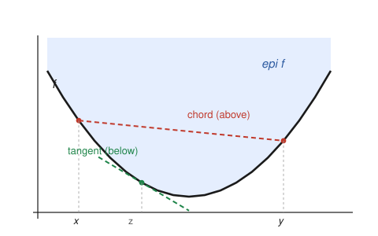

# Convex Optimization · Lesson 1.3: Convex functions and the epigraph

> ⏱ ~15 min · Module 1: Convex sets and convex functions · Builds on: [1.1](01-01-convex-sets-separating-hyperplane.md), [1.2](01-02-convex-set-zoo-operations.md) · Unlocks: [1.4](01-04-recognizing-convexity.md)

## Why this matters

Modules 1.1–1.2 taught you convex *sets*. But optimization minimizes a *function*, so we need the analogous notion for functions — and the whole reason convex optimization is tractable is a single fact you'll prove today: **a convex function is just a function whose region-above is a convex set.** That one bridge lets every set-theoretic tool (separating hyperplanes, intersection rules) attack functions, and it is why a point where the gradient vanishes is not just a local minimum but the *global* one. Every algorithm in Module 4 and every duality argument in Module 3 cashes out this property.

## The idea

A function is **convex** if its graph never bulges upward between two points — the straight line (chord) joining any two points on the graph sits *on or above* the graph. Picture a bowl: pick any two spots on the rim, stretch a string between them, and the string floats above the bowl's surface. That's it.

The same picture read from the bottom gives the other half of the story: at any point, the tangent line to a convex function lies *below* the whole graph. So convexity is squeezed between two lines — chords above, tangents below — and both are visible in one drawing.

And here's the unifying move. Instead of talking about the curve, talk about the **solid region above it** — the epigraph. For a bowl that's the bowl's interior-and-up, an ordinary convex set. The claim "the chord stays above the graph" becomes "the segment between two points of that region stays inside the region," which is *exactly* the definition of a convex set from Lesson 1.1. Convex functions and convex sets are the same idea wearing two hats.

## The formal version

Throughout, $f:\mathbb{R}^n\to\mathbb{R}$ has a **convex domain** $\operatorname{dom} f$ (this is part of being convex — the inequality below is meaningless if the midpoint escapes the domain).

**Definition (convex function).** $f$ is convex if for all $x,y\in\operatorname{dom} f$ and all $\theta\in[0,1]$,
$$f\big(\theta x+(1-\theta)y\big)\ \le\ \theta f(x)+(1-\theta)f(y).$$

*In words:* the function's value at a weighted average of two inputs is at most the same weighted average of the two output values — the graph dips below its own chords.

$f$ is **strictly convex** if the inequality is strict ($<$) whenever $x\neq y$ and $\theta\in(0,1)$ — no flat stretches or straight segments. $f$ is **concave** if $-f$ is convex (chords lie *below*; a dome, not a bowl); **affine** functions $f(x)=a^\top x+b$ are the only functions that are both.

**Jensen's inequality.** Iterating the definition to $k$ points: for weights $\theta_i\ge 0$ with $\sum_i\theta_i=1$,
$$f\Big(\sum_{i=1}^k \theta_i x_i\Big)\ \le\ \sum_{i=1}^k \theta_i f(x_i).$$
Taking the limit of many points, the probabilistic form: for any random vector $X$ (with $\mathbb{E}X\in\operatorname{dom} f$),
$$f(\mathbb{E}\,X)\ \le\ \mathbb{E}\,f(X).$$

*In words:* averaging *inside* a convex function beats averaging *outside* it — the finite convexity inequality is just Jensen with two points and weights $\theta,1-\theta$.

**The epigraph.** The set living above the graph,
$$\operatorname{epi} f=\big\{(x,t)\in\mathbb{R}^{n+1}\ :\ x\in\operatorname{dom} f,\ f(x)\le t\big\}.$$

*In words:* $\operatorname{epi} f$ is every point $(x,t)$ that sits on or above the graph in the extra "height" coordinate $t$.

**Bridge theorem.** $f$ is convex $\iff \operatorname{epi} f$ is a convex set. *(Proof below — this is the heart of the lesson.)*

For differentiable $f$, two calculus tests dodge the definition entirely:

**First-order condition.** If $f$ is differentiable, then $f$ is convex $\iff \operatorname{dom} f$ is convex and
$$f(y)\ \ge\ f(x)+\nabla f(x)^\top(y-x)\qquad\text{for all }x,y\in\operatorname{dom} f.$$

*In words:* the first-order Taylor approximation at $x$ — the tangent hyperplane — is a *global underestimator*: the graph never dips below any of its tangents.

**Second-order condition.** If $f$ is twice differentiable on an open convex domain, then $f$ is convex $\iff \nabla^2 f(x)\succeq 0$ for all $x$ (the Hessian is positive semidefinite everywhere). Furthermore $\nabla^2 f(x)\succ 0$ everywhere is *sufficient* (but not necessary) for strict convexity.

*In words:* in one dimension this is the old rule $f''\ge 0$ — the function curves upward; in $n$ dimensions "curves upward in every direction" is exactly $\nabla^2 f\succeq 0$.

### Proof of the bridge theorem

**($\Rightarrow$) $f$ convex $\implies \operatorname{epi} f$ convex.** Take two points $(x,s),(y,t)\in\operatorname{epi} f$, so by definition $f(x)\le s$ and $f(y)\le t$. For $\theta\in[0,1]$, their convex combination is $\big(\theta x+(1-\theta)y,\ \theta s+(1-\theta)t\big)$. Its first coordinate lies in $\operatorname{dom} f$ (convex), and by convexity of $f$,
$$f\big(\theta x+(1-\theta)y\big)\ \le\ \theta f(x)+(1-\theta)f(y)\ \le\ \theta s+(1-\theta)t.$$
The height coordinate $\theta s+(1-\theta)t$ is $\ge$ the function value, so the combination is in $\operatorname{epi} f$. Hence $\operatorname{epi} f$ is convex.

**($\Leftarrow$) $\operatorname{epi} f$ convex $\implies f$ convex.** Take $x,y\in\operatorname{dom} f$. The two points $(x,f(x))$ and $(y,f(y))$ sit on the graph, so they lie in $\operatorname{epi} f$. By convexity of the set, for any $\theta\in[0,1]$,
$$\big(\theta x+(1-\theta)y,\ \theta f(x)+(1-\theta)f(y)\big)\in\operatorname{epi} f.$$
Membership in $\operatorname{epi} f$ means precisely that the height dominates the function value at that input:
$$f\big(\theta x+(1-\theta)y\big)\ \le\ \theta f(x)+(1-\theta)f(y),$$
which is the definition of convexity. (The first coordinate ranging over all such combinations also shows $\operatorname{dom} f$ is convex.) $\blacksquare$

### Where the first-order condition comes from

The forward direction is a two-line squeeze worth seeing, because it *is* the intuition. Fix $x,y\in\operatorname{dom} f$ and $\theta\in(0,1]$. Convexity applied to the point $x+\theta(y-x)=\theta y+(1-\theta)x$ gives
$$f\big(x+\theta(y-x)\big)\ \le\ (1-\theta)f(x)+\theta f(y).$$
Move $f(x)$ over and divide by $\theta>0$:
$$f(y)\ \ge\ f(x)+\frac{f\big(x+\theta(y-x)\big)-f(x)}{\theta}.$$
As $\theta\to 0^+$, the difference quotient converges to the directional derivative $\nabla f(x)^\top(y-x)$, leaving $f(y)\ge f(x)+\nabla f(x)^\top(y-x)$. The tangent at $x$ underestimates $f$ *everywhere*, using only local information (the gradient at one point). That is why $\nabla f(x^*)=0$ certifies a **global** minimum for a convex function — worked as P1.

## Picture

One drawing, three facts. The shaded region is the **epigraph** — a convex set (the bowl-and-up). The red **chord** between the points above $x$ and $y$ floats above the graph (the definition: between $x$ and $y$ the curve stays strictly under the chord). The green **tangent** at the interior point $z$ lies below the entire graph (the first-order condition). Chords above, tangents below — convexity trapped between two lines.

## Worked examples

**Example 1 (mechanical — all three tests agree).** Show $f(x)=x^2$ is convex on $\mathbb{R}$, three ways.

*Definition.* Compute the gap RHS $-$ LHS:
$$\theta x^2+(1-\theta)y^2-\big(\theta x+(1-\theta)y\big)^2=\theta(1-\theta)(x-y)^2\ \ge\ 0,$$
with equality only if $x=y$ or $\theta\in\{0,1\}$. So $f$ is convex — in fact *strictly* convex.
*First-order.* $f(y)-\big[f(x)+f'(x)(y-x)\big]=y^2-x^2-2x(y-x)=(y-x)^2\ge 0$: the graph clears every tangent, with slack $(y-x)^2$.
*Second-order.* $f''(x)=2\succ 0$ everywhere. All three tell the same story; the epigraph is the region on and above the parabola, a convex set.

**Example 2 (why you'd care — Jensen instantly yields AM–GM).** The logarithm is concave on $(0,\infty)$: $(\log)''(x)=-1/x^2<0$, so $-\log$ is convex. Apply Jensen to the *convex* function $-\log$ with weights $\theta_i\ge 0$, $\sum_i\theta_i=1$, at positive points $a_i$:
$$-\log\Big(\sum_i\theta_i a_i\Big)\ \le\ \sum_i\theta_i\,(-\log a_i)\quad\Longrightarrow\quad \log\Big(\sum_i\theta_i a_i\Big)\ \ge\ \sum_i\theta_i\log a_i.$$
Exponentiate both sides:
$$\sum_i\theta_i a_i\ \ge\ \prod_i a_i^{\theta_i}.$$
That's the **weighted AM–GM inequality**, and with equal weights $\theta_i=1/n$ it is the classic "arithmetic mean $\ge$ geometric mean." A one-line consequence of concavity — this reflex (recognize a convex/concave function, invoke Jensen) is how half of applied inequality theory gets proved, and the expectation form $f(\mathbb{E}X)\le\mathbb{E}f(X)$ is a workhorse in probability and information theory.

## Watch out

- **Convex does not mean "has a minimum."** $f(x)=e^{x}$ is convex on $\mathbb{R}$ but has no minimizer (it slides off to $0$ as $x\to-\infty$). Convexity guarantees that *if* a stationary point exists it's a global min — not that one exists.
- **The domain must be convex, and it's part of the definition.** $f(x)=1/x$ on $\{x\neq 0\}$ is *not* a convex function, because its domain isn't convex — the inequality can't even be tested across $x<0$ and $x>0$. Restricted to $(0,\infty)$ it *is* convex ($f''=2/x^3>0$).
- **$\nabla^2 f\succ 0$ is sufficient but not necessary for strict convexity.** $f(x)=x^4$ is strictly convex, yet $f''(0)=0$, so the Hessian is only $\succeq 0$, not $\succ 0$, at the origin. Don't conclude "not strictly convex" from a single zero eigenvalue.
- **PSD means *everywhere*, not at one point.** $\nabla^2 f(x_0)\succeq 0$ at one $x_0$ says nothing; convexity requires $\nabla^2 f(x)\succeq 0$ at *every* point of the domain.

## One-liner

> A convex function is a function whose epigraph is a convex set — equivalently, one that stays below all its chords and above all its tangents.

## Problems

**P1 (🟢)** Let $f$ be convex and differentiable on $\mathbb{R}^n$, and suppose $\nabla f(x^*)=0$ at some point $x^*$. Prove $x^*$ is a *global* minimizer of $f$. (This is the payoff that makes convex optimization tractable — you'll meet it as a theorem in [Lesson 2.1](02-01-convex-problem-local-global.md).)

**P2 (🟡)** Consider the "quadratic-over-linear" function $f(x,y)=x^2/y$ on the domain $\{(x,y):y>0\}$. (a) Check the domain is convex. (b) Compute the Hessian $\nabla^2 f$ and show it is positive semidefinite everywhere on the domain, hence $f$ is convex. *(Hint: try to write the $2\times 2$ Hessian as a positive scalar times an outer product $vv^\top$.)*

**P3 (🔴, optional)** Prove that if $f$ is convex then every **sublevel set** $C_\alpha=\{x\in\operatorname{dom} f: f(x)\le\alpha\}$ is a convex set (any $\alpha\in\mathbb{R}$) — another set/function bridge, previewing [Lesson 1.4](01-04-recognizing-convexity.md). Then show the *converse fails*: exhibit a non-convex function all of whose sublevel sets are convex.

Solutions

**P1** By the first-order condition, for every $y\in\mathbb{R}^n$,
$$f(y)\ \ge\ f(x^*)+\nabla f(x^*)^\top(y-x^*)=f(x^*)+0^\top(y-x^*)=f(x^*).$$
So $f(y)\ge f(x^*)$ for all $y$: $x^*$ is a global minimizer. $\blacksquare$ Note the argument is global — no "near $x^*$" is needed, unlike the general (nonconvex) case, where $\nabla f=0$ only rules out first-order descent locally.

**P2** (a) The domain is the open halfspace $\{(x,y):y>0\}$; halfspaces are convex (if $y_1>0$ and $y_2>0$ then $\theta y_1+(1-\theta)y_2>0$), so the domain is convex.

(b) First derivatives: $f_x=\dfrac{2x}{y}$ and $f_y=-\dfrac{x^2}{y^2}$. Second derivatives:
$$f_{xx}=\frac{2}{y},\qquad f_{xy}=f_{yx}=-\frac{2x}{y^2},\qquad f_{yy}=\frac{2x^2}{y^3}.$$
So
$$\nabla^2 f=\begin{pmatrix} \dfrac{2}{y} & -\dfrac{2x}{y^2}\\[2mm] -\dfrac{2x}{y^2} & \dfrac{2x^2}{y^3}\end{pmatrix}=\frac{2}{y^3}\begin{pmatrix} y^2 & -xy\\ -xy & x^2\end{pmatrix}=\frac{2}{y^3}\begin{pmatrix} y\\ -x\end{pmatrix}\begin{pmatrix} y & -x\end{pmatrix}=\frac{2}{y^3}\,vv^\top,$$
with $v=(y,-x)^\top$. For any $z\in\mathbb{R}^2$, $z^\top(vv^\top)z=(v^\top z)^2\ge 0$, so $vv^\top\succeq 0$; and $2/y^3>0$ since $y>0$. A nonnegative scalar times a PSD matrix is PSD, so $\nabla^2 f\succeq 0$ throughout the domain. Hence $f$ is convex. $\blacksquare$ (Its rank-one Hessian shows it's convex but *not strictly* convex — flat along the direction $z\perp v$.)

**P3** *Sublevel sets are convex.* Take $x_1,x_2\in C_\alpha$, so $f(x_1)\le\alpha$ and $f(x_2)\le\alpha$; the domain is convex so $\theta x_1+(1-\theta)x_2\in\operatorname{dom} f$ for $\theta\in[0,1]$. By convexity,
$$f\big(\theta x_1+(1-\theta)x_2\big)\ \le\ \theta f(x_1)+(1-\theta)f(x_2)\ \le\ \theta\alpha+(1-\theta)\alpha=\alpha,$$
so $\theta x_1+(1-\theta)x_2\in C_\alpha$. Thus $C_\alpha$ is convex. $\blacksquare$

*Converse fails.* Take $f(x)=\sqrt{|x|}$ on $\mathbb{R}$. Its sublevel sets are $\{x:\sqrt{|x|}\le\alpha\}=[-\alpha^2,\alpha^2]$ for $\alpha\ge 0$ (and empty for $\alpha<0$) — all intervals, hence convex. But $f$ is not convex: with $x=0$, $y=1$, $\theta=\tfrac12$,
$$f(\tfrac12)=\sqrt{\tfrac12}\approx 0.707\ >\ \tfrac12 f(0)+\tfrac12 f(1)=\tfrac12(0)+\tfrac12(1)=0.5,$$
violating the definition. (Such "all sublevel sets convex" functions are called *quasiconvex* — a genuinely weaker notion you'll meet in Lesson 1.4.)

## Flashback

**From [Lesson 1.1](01-01-convex-sets-separating-hyperplane.md) (separating hyperplanes):** Given two distinct points $p,q\in\mathbb{R}^n$, construct an explicit hyperplane $\{x:a^\top x=b\}$ that *strictly* separates them — with $a^\top p>b$ and $a^\top q<b$ — and identify it geometrically.

Solution

Use the **perpendicular bisector**: take the normal $a=p-q\ (\neq 0)$ and offset $b=a^\top\!\left(\dfrac{p+q}{2}\right)$. Then
$$a^\top p-b=(p-q)^\top\!\Big(p-\tfrac{p+q}{2}\Big)=(p-q)^\top\tfrac{p-q}{2}=\tfrac12\lVert p-q\rVert_2^2\ >\ 0,$$
$$a^\top q-b=(p-q)^\top\!\Big(q-\tfrac{p+q}{2}\Big)=(p-q)^\top\tfrac{q-p}{2}=-\tfrac12\lVert p-q\rVert_2^2\ <\ 0.$$
So $a^\top p>b>a^\top q$: the hyperplane strictly separates $p$ and $q$. Geometrically it is the set of points equidistant from $p$ and $q$, cutting the segment $\overline{pq}$ at its midpoint, perpendicular to it — the simplest instance of the separating-hyperplane theorem, here for two singletons. $\blacksquare$

## Connections

- **Backward:** the bridge theorem literally *is* the convex-set definition from [Lesson 1.1](01-01-convex-sets-separating-hyperplane.md) applied to the epigraph, and building convex functions from convexity-preserving operations (next lesson) mirrors the set operations of [Lesson 1.2](01-02-convex-set-zoo-operations.md).
- **Forward:** [Lesson 1.4](01-04-recognizing-convexity.md) uses the epigraph and the three tests to certify convexity of messy expressions without ever touching a Hessian; [Lesson 2.1](02-01-convex-problem-local-global.md) promotes P1 into the theorem "for convex problems, local optima are global," the reason the whole enterprise works.
- **Sideways (probability / statistics):** Jensen's expectation form $f(\mathbb{E}X)\le\mathbb{E}f(X)$ is a staple of [`statistical-learning`](../../statistical-learning/syllabus.md) and information theory (it underlies entropy bounds and the EM algorithm's likelihood inequality); the AM–GM derivation here is its simplest deterministic shadow.
