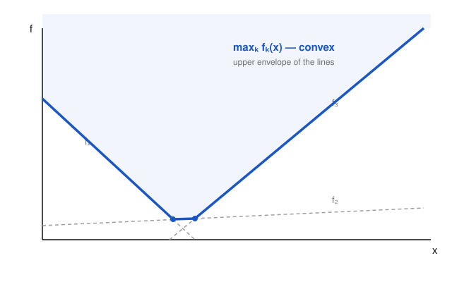

# Convex Optimization · Lesson 1.4: Recognizing convexity in the wild

> ⏱ ~15 min · Module 1: Convex sets and convex functions · Builds on: [Lesson 1.3](01-03-convex-functions-epigraph.md) · Unlocks: Module 2, [Lesson 2.1](02-01-convex-problem-local-global.md)

## Why this matters

You now have three ways to prove a function convex — the definition, Jensen, and $\nabla^2 f \succeq 0$ (Lesson 1.3). But the functions you actually meet are ugly: $\lVert Ax-b\rVert_2 + \lambda\lVert x\rVert_1$, a pointwise maximum of a hundred linear pieces, a distance to a set, a log-sum-exp. Grinding out a Hessian for these is slow, error-prone, and sometimes impossible (nonsmooth functions have no Hessian at all). This lesson gives you the **convexity calculus**: a short list of operations that *preserve* convexity, so you can certify a monster expression convex by inspection — reading it like a chemist reads a structural formula — the reflex that lets you glance at an optimization problem in Module 2 and instantly know whether it's solvable.

## The idea

Convexity is a *closure property*. A handful of moves take convex functions and return convex functions; if every step in building your function is one of those moves, the result is convex — no derivatives required. Think of it like proving a number is even: you don't factor it, you just check it was built by adding and multiplying even numbers in the right pattern.

Four moves carry most of the weight, and each has a one-picture reason:

- **Add them (with nonnegative weights).** Stacking bowls gives a bowl.
- **Take the pointwise max.** The upper envelope of bowls is a bowl — the kinks only ever point *up* (see the Picture).
- **Feed in an affine map first**, $f(Ax+b)$. Stretching and shifting the floor plan doesn't unbend a bowl.
- **Compose with a monotone outer bowl.** A convex increasing function of a convex function stays convex — increasing means it won't flip the bulge, convex means it can only add more.

Master these and you'll certify $95\%$ of the convex functions in this course without touching a second derivative.

## The formal version

Throughout, "convex" means convex on the stated (convex) domain. Each rule is stated for convex $f$; the mirror statement for concave $f$ (flip max$\to$min, nondecreasing$\to$nonincreasing) holds by applying the rule to $-f$.

**1. Nonnegative weighted sum.** If $f_1,\dots,f_m$ are convex and $w_1,\dots,w_m \ge 0$, then $\sum_i w_i f_i$ is convex. (Extends to infinite sums, integrals, and expectations: $\mathbb{E}_y f(x,y)$ is convex in $x$ if each $f(\cdot,y)$ is.)

*In words:* piling up bowls, none of them flipped upside down, gives a bowl.

**2. Affine precomposition.** If $f$ is convex and $g(x) = f(Ax+b)$, then $g$ is convex.

*In words:* convexity survives any linear change of variables plus a shift — you're just relabeling the floor.

**3. Pointwise maximum / supremum.** If $\{f_y\}_{y\in\mathcal{Y}}$ are all convex, then $g(x) = \sup_{y\in\mathcal{Y}} f_y(x)$ is convex (whenever it is finite). The finite case $g = \max\{f_1,\dots,f_m\}$ is the everyday one.

*In words:* the upper envelope of any family of bowls is a bowl. (Reason: $\operatorname{epi} g = \bigcap_y \operatorname{epi} f_y$ — an intersection of convex epigraphs, hence convex, and Lesson 1.3 says a convex epigraph means a convex function.)

**4. Composition (scalar).** Let $g:\mathbb{R}^n\to\mathbb{R}$ and $h:\mathbb{R}\to\mathbb{R}$, and $f = h\circ g$. Then $f$ is convex if either
$$h \text{ convex and nondecreasing, } g \text{ convex}, \qquad\text{or}\qquad h \text{ convex and nonincreasing, } g \text{ concave}.$$

*In words:* a convex, uphill $h$ applied to a convex $g$ stays convex; a convex, downhill $h$ applied to a concave $g$ does too. (The monotonicity is about $h$'s *extended-value* extension — see Watch out.)

**5. Composition (vector).** Let $f(x) = h\big(g_1(x),\dots,g_k(x)\big)$. Then $f$ is convex if $h$ is convex and, for each argument $i$, either $h$ is nondecreasing in that argument and $g_i$ is convex, or $h$ is nonincreasing in it and $g_i$ is concave. (Rule 4 is the $k=1$ case; nonnegative sum is $h(z)=\sum w_i z_i$.)

**6. Partial minimization.** If $f(x,y)$ is convex *jointly* in $(x,y)$ and $C$ is a convex set, then $g(x) = \inf_{y\in C} f(x,y)$ is convex (wherever $g(x) > -\infty$).

*In words:* minimizing a jointly-convex function over some of its variables leaves a convex function of the rest. (This is the dual companion to Rule 3 — sup of convex is convex; inf *over a slice* of jointly convex is convex.)

**Sublevel sets.** For any convex $f$ and level $\alpha$, the set $\{x : f(x)\le\alpha\}$ is convex.

*In words:* every "$f$ below a threshold" region of a convex function is a convex set — the fact that will make convex *constraints* convex in Module 2. Proof: if $f(x)\le\alpha$ and $f(y)\le\alpha$ then $f(\theta x+(1-\theta)y)\le\theta\alpha+(1-\theta)\alpha=\alpha$.

**The converse is false.** Convex sublevel sets do *not* imply a convex function. A function all of whose sublevel sets are convex is called **quasiconvex** — strictly weaker. Example: $f(x)=\sqrt{|x|}$ has sublevel sets $[-\alpha^2,\alpha^2]$ (all convex intervals), yet $f$ is not convex (it bulges the wrong way near $0$). Quasiconvexity is the natural class for problems where you only care about level sets, not curvature; we flag it now and mostly set it aside.

**A taste of log-concavity.** A nonnegative $f$ is **log-concave** if $\log f$ is concave, i.e. $f(\theta x+(1-\theta)y) \ge f(x)^\theta f(y)^{1-\theta}$. The Gaussian density $e^{-x^\top x/2}$ is the poster child. Log-concave functions are closed under products (add the logs) and — less obviously — under marginalization, which is why so many probability densities stay well-behaved under conditioning. A convenient bonus: a log-concave $f$ is automatically quasiconcave, so its superlevel sets are convex.

## Picture

Pointwise maximum of three affine functions $f_1,f_2,f_3$. The thick curve is $\max_k f_k$ — its kinks all open *upward*, and its epigraph (shaded) is the intersection of the three half-plane epigraphs, hence convex. This is Rule 3 in one glance, and it is exactly how a piecewise-linear convex function is born.

## Worked examples

**Example 1 (mechanical — read it like a formula).** Certify that
$$f(x) = \max\Big\{\ \lVert x\rVert_1,\ \ \tfrac12 x^\top P x - q^\top x\ \Big\}, \qquad P \succeq 0,$$
is convex on $\mathbb{R}^n$ — no Hessian.

Parse it bottom-up:

1. $\lVert x\rVert_1$ is a norm, hence convex (norms are convex — Lesson 1.3).
2. $\tfrac12 x^\top P x - q^\top x$ is a quadratic; its Hessian is $P\succeq 0$, so it's convex. (This one fact we borrow from 1.3; everything above it is pure calculus.)
3. $f$ is the **pointwise max** of these two convex functions $\Rightarrow$ convex by Rule 3. $\blacksquare$

Total work: name three rules. Note $f$ is nonsmooth (kinked where the two pieces cross), so a global Hessian argument was never even available — the calculus is not just faster here, it's the *only* elementary route.

**Example 2 (why you'd care — and where the calculus runs out).** The log-sum-exp function
$$\mathrm{lse}(x) = \log\sum_{i=1}^n e^{x_i}$$
is the smooth stand-in for $\max_i x_i$ that shows up all over machine learning (it's the log-partition function / softmax's parent). Try to certify it by rules:

- each $x_i$ is affine, hence convex;
- $e^{x_i} = h(x_i)$ with $h(t)=e^t$ convex and nondecreasing $\Rightarrow$ convex (Rule 4);
- $\sum_i e^{x_i}$ is a nonnegative sum of convex $\Rightarrow$ convex (Rule 1).

Now we want $\log$ of that convex function — and here the chain **breaks**: $\log$ is concave and nondecreasing, which is *not* one of the convexity-preserving patterns of Rule 4 (log of a convex function is generally not convex). The calculus is honest about its limits.

When the rules stall, fall back to Lesson 1.3 and compute the Hessian. Writing $z_i = e^{x_i}/\sum_j e^{x_j}$ (the softmax — a probability vector, $z_i>0$, $\mathbf 1^\top z = 1$),
$$\nabla^2 \mathrm{lse}(x) = \operatorname{diag}(z) - zz^\top.$$
For any $v$, $v^\top(\operatorname{diag}(z)-zz^\top)v = \sum_i z_i v_i^2 - \big(\sum_i z_i v_i\big)^2 = \mathbb{E}_z[v^2] - (\mathbb{E}_z[v])^2 = \operatorname{Var}_z(v) \ge 0$. So $\nabla^2\mathrm{lse}\succeq 0$ and $\mathrm{lse}$ is convex. The moral: certify by calculus when you can, reach for the Hessian exactly where you can't — and log-sum-exp marks that boundary.

## Watch out

- **The rules are sufficient, not necessary.** A function can be convex without any rule certifying it — you may have just picked the wrong decomposition. $\sqrt{1+x^2}$ fails the naive "$\sqrt{\text{convex}}$" check (concave outer function) yet is convex; recognize it instead as $\lVert(1,x)\rVert_2$, an affine map into a norm. If one parse stalls, try another before concluding anything.
- **Monotonicity of $h$ must hold over the range $g$ actually takes.** $h(t)=t^2$ is convex but *not* nondecreasing on all of $\mathbb{R}$, so $h(g(x))=g(x)^2$ can fail to be convex for convex $g$. Concretely, $g(x)=\lvert x\rvert-1$ is convex, yet $g(x)^2$ dips at the origin — it equals $1$ at $x=0$, drops to $0$ at $x=\pm1$, then rises again, a clearly non-convex valley. The clean fix: $g(x)^2$ is convex when $g$ is convex **and nonnegative** (then $h=t^2$ is nondecreasing over $g$'s range). Always check $h$'s direction over the values $g$ hits, not on all of $\mathbb{R}$.
- **Convex sublevel sets $\ne$ convex function.** That's quasiconvexity, a weaker property. Don't certify a function convex from the shape of one level set.
- **Max is convex; min is not.** The pointwise *maximum* of convex functions is convex, but the pointwise *minimum* generally is not (two bowls have a non-convex lower envelope). Minimization only preserves convexity in the special jointly-convex, partial-minimization form of Rule 6.

## One-liner

> Don't differentiate — parse: if a function is *built* from convex pieces by nonnegative sums, pointwise max, affine input, monotone-convex composition, or partial minimization, it's convex by construction.

## Problems

**P1 (🟢)** Certify convex on the stated domain by naming operations only — no Hessian.
(a) $f(x) = \lVert Ax-b\rVert_2 + \lambda\lVert x\rVert_1$ on $\mathbb{R}^n$, where $\lambda \ge 0$ (this is the lasso objective of [Lesson 5.1](05-01-least-squares-lasso.md)).
(b) $g(x_1,x_2) = \max\{\,x_1^2 + x_2^2,\ \ e^{x_1 - x_2}\,\}$ on $\mathbb{R}^2$.

**P2 (🟡)** For each, decide convex / concave / neither and justify by the composition rule — or, if the rule is inconclusive, find a different certificate.
(a) $f(x) = \exp(x^2 - 2x)$ on $\mathbb{R}$.
(b) $f(x) = \sqrt{1 + x^2}$ on $\mathbb{R}$.

**P3 (🔴, optional)** Prove the partial-minimization rule and apply it. (a) Let $f(x,y)$ be convex jointly in $(x,y)$ and let $C$ be a convex set; assume $g(x) := \inf_{y\in C} f(x,y) > -\infty$ for all $x$. Prove $g$ is convex. (b) Deduce that the **distance to a convex set**, $\operatorname{dist}(x,C) = \inf_{y\in C}\lVert x-y\rVert_2$, is a convex function of $x$.

Solutions

**P1(a)** Parse bottom-up. $\lVert\cdot\rVert_2$ is a norm, hence convex; $x\mapsto Ax-b$ is affine, so $\lVert Ax-b\rVert_2$ is convex by **affine precomposition** (Rule 2). $\lVert x\rVert_1$ is a norm, hence convex. Finally $f = 1\cdot\lVert Ax-b\rVert_2 + \lambda\cdot\lVert x\rVert_1$ with weights $1\ge0$ and $\lambda\ge0$ is a **nonnegative weighted sum** of convex functions (Rule 1), hence convex. $\blacksquare$

**P1(b)** $x_1^2+x_2^2 = \lVert x\rVert_2^2$ is convex (a norm composed with the squaring $t\mapsto t^2$, which is convex nondecreasing on the nonnegative range of a norm — or just: sum of the convex $x_1^2, x_2^2$). Next, $x_1-x_2$ is affine, and $t\mapsto e^t$ is convex and nondecreasing, so $e^{x_1-x_2}$ is convex by **composition** (Rule 4) with an affine inner map. Then $g$ is the **pointwise maximum** of two convex functions (Rule 3), hence convex. $\blacksquare$

**P2(a)** Convex. Write $f = h\circ g$ with $g(x)=x^2-2x$ and $h(t)=e^t$. Here $g$ is convex ($g''=2>0$), and $h$ is convex and nondecreasing on all of $\mathbb{R}$. By the composition rule (Rule 4, first case), $f$ is convex. $\blacksquare$

**P2(b)** Convex — but the naive composition parse is *inconclusive*, and noticing that is the point. Writing $f=h(g(x))$ with $g(x)=1+x^2$ (convex) and $h(t)=\sqrt t$: $h$ is nondecreasing but **concave**, which is not a convexity-preserving pattern, so Rule 4 says nothing. Find another certificate: $f(x)=\sqrt{1+x^2}=\big\lVert (1,\,x)\big\rVert_2$, i.e. the $2$-norm precomposed with the affine map $x\mapsto(1,x)$. Norm (convex) $\circ$ affine $\Rightarrow$ convex by Rule 2. $\blacksquare$ (Sanity check via 1.3: $f''=(1+x^2)^{-3/2}>0$.)

**P3(a)** Fix $x_1,x_2$ and $\theta\in[0,1]$; write $x_\theta=\theta x_1+(1-\theta)x_2$. Let $\varepsilon>0$. By definition of infimum choose $y_1,y_2\in C$ with $f(x_i,y_i)\le g(x_i)+\varepsilon$. Since $C$ is convex, $y_\theta := \theta y_1+(1-\theta)y_2\in C$, so $y_\theta$ is a feasible point for the infimum defining $g(x_\theta)$. Then, using joint convexity of $f$,
$$g(x_\theta) \le f(x_\theta, y_\theta) \le \theta f(x_1,y_1) + (1-\theta) f(x_2,y_2) \le \theta g(x_1) + (1-\theta) g(x_2) + \varepsilon.$$
The first inequality is because $g(x_\theta)$ is an infimum and $y_\theta$ is one candidate; the second is joint convexity; the third is our choice of $y_1,y_2$. Letting $\varepsilon\to 0^+$ gives $g(x_\theta)\le \theta g(x_1)+(1-\theta)g(x_2)$, i.e. $g$ is convex. $\blacksquare$

**P3(b)** Let $f(x,y)=\lVert x-y\rVert_2$. The map $(x,y)\mapsto x-y$ is affine (jointly in $(x,y)$), and $\lVert\cdot\rVert_2$ is convex, so $f$ is **jointly** convex by affine precomposition. With $C$ convex, part (a) gives that $\operatorname{dist}(x,C)=\inf_{y\in C} f(x,y)$ is convex in $x$. $\blacksquare$ (This convex distance function is the workhorse behind projection onto a convex set, which you'll meet in the algorithms of Module 4.)

## Flashback

**From [Lesson 1.3](01-03-convex-functions-epigraph.md) (second-order condition):** Use $\nabla^2 f \succeq 0$ to decide whether the **quadratic-over-linear** function
$$f(x,y) = \frac{x^2}{y}, \qquad y > 0,$$
is convex on its domain $\{(x,y): y>0\}$.

Solution

First derivatives: $f_x = \dfrac{2x}{y}$, $f_y = -\dfrac{x^2}{y^2}$. Second derivatives:
$$f_{xx} = \frac{2}{y}, \qquad f_{xy} = -\frac{2x}{y^2}, \qquad f_{yy} = \frac{2x^2}{y^3}.$$
So the Hessian is
$$\nabla^2 f = \begin{pmatrix} \dfrac{2}{y} & -\dfrac{2x}{y^2} \\[2mm] -\dfrac{2x}{y^2} & \dfrac{2x^2}{y^3} \end{pmatrix} = \frac{2}{y^3}\begin{pmatrix} y^2 & -xy \\ -xy & x^2 \end{pmatrix} = \frac{2}{y^3}\begin{pmatrix} y \\ -x \end{pmatrix}\begin{pmatrix} y & -x \end{pmatrix}.$$
The last form exhibits $\nabla^2 f$ as $\tfrac{2}{y^3}\,vv^\top$ with $v=(y,-x)^\top$ — a rank-one outer product scaled by $\tfrac{2}{y^3}>0$ (since $y>0$). Any matrix $c\,vv^\top$ with $c\ge 0$ is positive semidefinite: $u^\top(c\,vv^\top)u = c\,(v^\top u)^2 \ge 0$. Hence $\nabla^2 f \succeq 0$ everywhere on the domain, so $f(x,y)=x^2/y$ is **convex**. (Its eigenvalues are $0$ and $\tfrac{2}{y^3}(x^2+y^2)$ — one flat direction, one strictly curved.) This function reappears as an SOCP building block in [Lesson 2.3](02-03-second-order-cone-programs.md).

## Connections

- **Backward:** every rule here is the function-level echo of Lesson 1.2's set operations, glued on by Lesson 1.3's epigraph dictionary — pointwise-max convexity is literally an *intersection of epigraphs*, and sublevel-set convexity is the bridge from convex functions back to convex sets.
- **Forward:** [Lesson 2.1](02-01-convex-problem-local-global.md) defines a convex problem as "convex objective, convex constraint sets," and the sublevel-set fact is exactly what makes an inequality constraint $f_i(x)\le 0$ carve out a convex feasible region. From Module 2 on, you'll certify problems convex by this calculus rather than from scratch.
- **Sideways (statistics / [statistical-learning](../../statistical-learning/syllabus.md)):** log-concave densities (the Gaussian, the taste above) are why maximum-likelihood estimation is so often a *convex* problem — maximizing a concave log-likelihood — and the composition rules are what certify regularized losses like the lasso objective of [Lesson 5.1](05-01-least-squares-lasso.md) convex in one glance.
