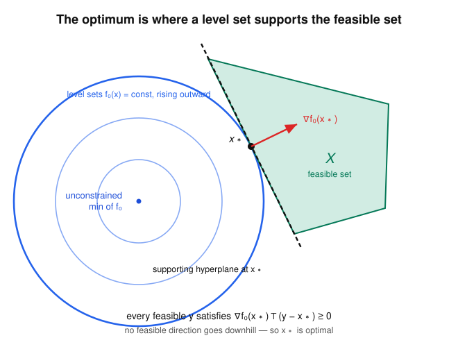

# Convex Optimization · Lesson 2.1: The convex optimization problem — why local means global

> ⏱ ~15 min · Module 2: Convex problems and how to model with them · Builds on: [Lesson 1.3](01-03-convex-functions-epigraph.md), [Lesson 1.4](01-04-recognizing-convexity.md) · Unlocks: [Lesson 2.2](02-02-linear-quadratic-programs.md)

## Why this matters

Every optimization algorithm you will ever run is, at heart, a machine that finds a point it *can't improve on locally* — a place where no small step helps. In a general (nonconvex) problem that guarantees nothing: you might be stuck in a shallow dimple while the real basin lies over the ridge. Convexity is the single structural assumption that closes this gap. For a convex problem, "I can't do better nearby" upgrades — for free, provably — to "I can't do better anywhere." That one fact is what makes the gradient descent of Module 4, the interior-point solver behind every `cvxpy` call, and the least-squares/SVM/portfolio models of Module 5 *trustworthy*: they return the global answer and hand you a checkable certificate that it is.

## The idea

Picture the objective as a landscape and the constraints as a fenced-off region you're allowed to stand in. Minimizing means finding the lowest reachable point.

In a general landscape there are false valleys: local dips that aren't the global bottom. Convexity forbids them. A convex function over a convex region is a single smooth bowl — one connected basin, no secondary pockets. So if you're standing somewhere and *every* direction into the region either goes uphill or stays level, you must be at the bottom. There's nowhere lower to hide.

Here's the whole argument in one sentence, and it's worth internalizing before we make it precise: **if a strictly better feasible point existed somewhere else, the straight line to it would descend the whole way** (that's convexity of the objective) **and stay inside the region** (that's convexity of the feasible set) — so it would already beat you *right next to where you stand*, contradicting the claim that you're locally best. No false valley can survive that.

## The formal version

**Standard form.** A (finite-dimensional) optimization problem in standard form is
$$
\begin{aligned}
\min_{x\in\mathbb{R}^n}\quad & f_0(x)\\
\text{subject to}\quad & f_i(x)\le 0,\quad i=1,\dots,m,\\
& a_j^\top x = b_j,\quad j=1,\dots,p,
\end{aligned}
$$
the equalities collected as $Ax = b$. Here $f_0$ is the **objective**, the $f_i$ are the **inequality constraints**, and $Ax=b$ the **equality constraints**.

It is a **convex problem** when $f_0, f_1,\dots,f_m$ are all convex *and* the equality constraints are **affine** (that's why we insist on $a_j^\top x = b_j$, not a general $h_j(x)=0$).

*In words:* convex objective, convex inequality constraints, straight-line equality constraints — nothing else counts.

**The feasible set** is $X = \{x : f_i(x)\le 0\ \forall i,\ Ax=b\}$. Each inequality carves out a sublevel set $\{f_i\le 0\}$, which is convex because $f_i$ is (Lesson 1.4); $\{Ax=b\}$ is an affine set, hence convex; and $X$ is their intersection.

*In words:* the feasible set of a convex problem is automatically convex — it's an intersection of convex pieces.

**Optimal value and optimal set.**
$$
p^* = \inf\{\, f_0(x) : x \in X \,\},\qquad X_{\text{opt}} = \{\, x\in X : f_0(x) = p^* \,\}.
$$
By convention $p^* = +\infty$ if $X=\varnothing$ (infeasible), and $p^*$ may be $-\infty$ (unbounded below). A point $x^\star\in X_{\text{opt}}$ is called **(globally) optimal**. A feasible $x$ is **locally optimal** if it minimizes $f_0$ over $X\cap\{z : \lVert z-x\rVert_2 \le R\}$ for some radius $R>0$.

*In words:* $p^*$ is the best achievable value (a number, possibly $\pm\infty$); the optimal set collects every point that hits it — and may be empty, a single point, or a whole flat.

**Theorem (local $\Rightarrow$ global).** *For a convex problem, every locally optimal point is globally optimal.*

*Proof.* Let $x^\star$ be locally optimal within radius $R$, and suppose for contradiction some feasible $y$ has $f_0(y) < f_0(x^\star)$. For $\theta\in(0,1]$ set $z_\theta = \theta y + (1-\theta)x^\star$. Since $X$ is convex, $z_\theta\in X$. Choose $\theta$ small enough that $\lVert z_\theta - x^\star\rVert_2 = \theta\lVert y-x^\star\rVert_2 \le R$, so $z_\theta$ lies in the local neighborhood. By convexity of $f_0$,
$$
f_0(z_\theta) \le \theta f_0(y) + (1-\theta)f_0(x^\star) < \theta f_0(x^\star) + (1-\theta)f_0(x^\star) = f_0(x^\star).
$$
So $z_\theta$ is a feasible point *inside the neighborhood* with strictly smaller objective — contradicting local optimality. Hence no such $y$ exists. $\blacksquare$

**Theorem (first-order optimality over a convex feasible set).** *Suppose $f_0$ is convex and differentiable, and $X$ is convex. Then $x^\star\in X$ is optimal if and only if*
$$
\nabla f_0(x^\star)^\top (y - x^\star) \ge 0 \quad\text{for all } y\in X.
$$
*If $X=\mathbb{R}^n$ (unconstrained), this reduces to $\nabla f_0(x^\star)=0$.*

*In words:* at the optimum, every feasible direction $y-x^\star$ is a non-descent direction — you can't lower $f_0$ by moving toward any other feasible point.

*Proof.* ($\Leftarrow$) The first-order convexity inequality (Lesson 1.3) says $f_0(y) \ge f_0(x^\star) + \nabla f_0(x^\star)^\top(y-x^\star)$ for all $y$. If the bracketed inner product is $\ge 0$ for every feasible $y$, then $f_0(y)\ge f_0(x^\star)$ throughout $X$, so $x^\star$ is optimal. ($\Rightarrow$) Suppose instead some feasible $y$ had $\nabla f_0(x^\star)^\top(y-x^\star) < 0$. The directional derivative of $f_0$ at $x^\star$ along $y-x^\star$ is exactly that negative number, so $f_0(x^\star + t(y-x^\star))$ strictly decreases for small $t>0$; and $x^\star + t(y-x^\star)\in X$ by convexity. That contradicts optimality. $\blacksquare$

Geometrically the condition says $-\nabla f_0(x^\star)$ defines a **supporting hyperplane** of $X$ at $x^\star$: the whole feasible set lies on the side where $f_0$ increases.

**Two reformulations you'll reuse constantly.**

- **Epigraph form.** Push the objective into a constraint with a fresh scalar $t$:
$$
\min_{x,t}\ t \quad\text{subject to}\quad f_0(x)\le t,\ \ x\in X.
$$
This has the *same* optimal $x$ but a **linear** objective — the trick that lets any convex problem be posed for a conic solver (you'll cash it in for SOCPs in [Lesson 2.3](02-03-second-order-cone-programs.md)).
- **Monotone transform of the objective.** If $\varphi$ is strictly increasing on the range of $f_0$, then minimizing $\varphi\!\circ\! f_0$ has the *same optimal set* as minimizing $f_0$. So you may minimize $\lVert Ax-b\rVert_2^2$ instead of $\lVert Ax-b\rVert_2$ (square is increasing on $[0,\infty)$) to get a smooth objective — same minimizer, easier calculus.

## Picture

The blue circles are level sets of $f_0$ (here $f_0(x)=\lVert x-c\rVert_2^2$), shrinking toward the unconstrained minimizer $c$. That minimizer is *outside* the green feasible set $X$, so the best we can do is push to the smallest level set that still touches $X$ — and it touches at a single point $x^\star$. At that tangency the level curve and the boundary of $X$ share a tangent line: that line is a **supporting hyperplane**, and $\nabla f_0(x^\star)$ (red) is its outward normal. Every feasible $y$ sits on the far side, so $\nabla f_0(x^\star)^\top(y-x^\star)\ge 0$ — the first-order condition, read straight off the geometry.

## Worked examples

**Example 1 (the first-order condition as a certificate).** Minimize $f_0(x) = (x_1-2)^2 + (x_2-1)^2$ over the triangle $X=\{x : x_1\ge 0,\ x_2\ge 0,\ x_1+x_2\le 1\}$.

This is convex: $f_0$ is a sum of squares of affine functions (convex), and $X$ is a polyhedron (intersection of halfspaces). The unconstrained minimizer $(2,1)$ is infeasible, so the optimum lands on the boundary. Project $(2,1)$ onto the active edge $x_1+x_2=1$:
$$
x^\star = (2,1) - \frac{(2+1)-1}{2}(1,1) = (2,1)-(1,1) = (1,0),
$$
which is the vertex $(1,0)$ — feasible. **Certify it** with the first-order condition. The gradient is $\nabla f_0(x)=\big(2(x_1-2),\,2(x_2-1)\big)$, so $\nabla f_0(x^\star)=(-2,-2)$. For any feasible $y=(y_1,y_2)$,
$$
\nabla f_0(x^\star)^\top(y-x^\star) = -2(y_1-1) - 2(y_2-0) = 2 - 2(y_1+y_2) \ge 0,
$$
because $y_1+y_2\le 1$ on $X$. The condition holds for every feasible $y$, so $x^\star=(1,0)$ is *globally* optimal, with $p^\star = 1+1 = 2$. Notice $\nabla f_0(x^\star)\ne 0$: on a boundary the gradient does not vanish — the variational inequality is what does the certifying.

**Example 2 (why the reformulations pay off — least-squares).** Minimize the residual norm $\lVert Ax-b\rVert_2$ over $x\in\mathbb{R}^n$ (with $A$ tall, full column rank). The norm is convex but *not differentiable* where the residual is zero, which is awkward. Apply a monotone transform: since $t\mapsto t^2$ is strictly increasing on $[0,\infty)$, minimizing $\lVert Ax-b\rVert_2^2$ has the identical optimal set — and this objective is a smooth convex quadratic. It's unconstrained, so the first-order condition is simply $\nabla f_0(x^\star)=0$:
$$
\nabla_x \big(x^\top A^\top A x - 2b^\top A x + b^\top b\big) = 2A^\top A x - 2A^\top b = 0 \ \Longrightarrow\ A^\top A\,x^\star = A^\top b,
$$
the **normal equations**. Alternatively, if you need the problem in a solver's standard form, put the *original* norm in epigraph form: $\min_{x,t} t$ s.t. $\lVert Ax-b\rVert_2 \le t$ — a single second-order-cone constraint (Lesson 2.3). Same minimizer, three faces: nondifferentiable norm, smooth QP, conic program. You choose the face that suits the tool.

## Watch out

- **A convex feasible set is not enough for a convex *problem*.** Convexity of the *problem* is a property of how it's written: the $f_i$ must be convex and the equalities affine. You might think any equality $h(x)=0$ with convex $h$ is fine — but $\{h=0\}$ is convex only when $h$ is affine. For instance $h(x)=\lVert x\rVert_2^2-1=0$ has convex $h$, yet its solution set (a sphere) is decidedly not convex.
- **Local $\Rightarrow$ global needs *both* halves of convexity.** Minimize a perfectly convex $f_0$ over a nonconvex $X$ and you can get trapped: the segment argument breaks the moment $z_\theta$ can leave the feasible set. Both the objective and the region must be convex.
- **"Has an optimal value" $\ne$ "attains it."** $p^\star$ is always defined as an infimum, but $X_{\text{opt}}$ can be empty — minimize $e^x$ over $\mathbb{R}$: $p^\star=0$, achieved by nothing. And when $f_0$ is flat along a direction, $X_{\text{opt}}$ is a whole convex set, not a point.
- **$\nabla f_0(x^\star)=0$ is the unconstrained rule only.** On a constrained boundary the gradient generally isn't zero (Example 1). The correct universal statement is the variational inequality $\nabla f_0(x^\star)^\top(y-x^\star)\ge 0$; forcing $\nabla f_0=0$ everywhere is a classic error.

## One-liner

> In a convex problem the landscape is a single bowl, so being unbeatable *nearby* means being unbeatable *everywhere* — and $\nabla f_0(x^\star)^\top(y-x^\star)\ge 0$ is the one-line certificate.

## Problems

**P1 (🟢)** Minimize $f_0(x)=(x_1-3)^2+(x_2+2)^2$ over the nonnegative orthant $X=\{x : x_1\ge 0,\ x_2\ge 0\}$. (a) Explain in one line why this is a convex problem. (b) Find $x^\star$, and verify optimality using the first-order condition (note whether $\nabla f_0(x^\star)=0$).

**P2 (🟡)** Prove that the optimal set $X_{\text{opt}}$ of a convex problem is convex. (No calculus needed — use the definition of $p^\star$ and convexity of $f_0$ and $X$.)

**P3 (🔴, optional)** Minimize $f_0(x)=\tfrac12\lVert x\rVert_2^2 - b^\top x$ over the box $X=[0,1]^n$, with $b\in\mathbb{R}^n$ given. Show the first-order condition **decouples coordinatewise**, and derive $x_i^\star = \min\{1,\max\{0,b_i\}\}$ (clip $b$ to $[0,1]$). Then certify the case $n=2$, $b=(0.5,\,2)$ explicitly.

Solutions

**P1** (a) $f_0$ is a sum of squares of affine functions, hence convex; $X$ is an intersection of two halfspaces, hence convex — so it's a convex problem. (b) The unconstrained minimizer is $(3,-2)$, whose second coordinate is infeasible ($x_2\ge 0$). The nearest feasible point clips that coordinate to the boundary: $x^\star=(3,0)$. Check with the first-order condition. $\nabla f_0(x)=\big(2(x_1-3),\,2(x_2+2)\big)$, so $\nabla f_0(x^\star)=(0,4)$. For any feasible $y$,
$$
\nabla f_0(x^\star)^\top(y-x^\star)=0\cdot(y_1-3)+4\cdot(y_2-0)=4y_2\ge 0\quad(\text{since }y_2\ge 0).
$$
Holds for all feasible $y$, so $x^\star=(3,0)$ is globally optimal, $p^\star = 0 + 4 = 4$. Here $\nabla f_0(x^\star)=(0,4)\ne 0$: the $x_1$-component vanishes (that coordinate is interior) but the $x_2$-component does not (that coordinate is pinned at the boundary).

**P2** Let $x,y\in X_{\text{opt}}$, so both are feasible with $f_0(x)=f_0(y)=p^\star$, and take $\theta\in[0,1]$, $z=\theta x+(1-\theta)y$. Since $X$ is convex, $z\in X$, so $f_0(z)\ge p^\star$ by definition of $p^\star$ as the infimum over $X$. By convexity of $f_0$,
$$
f_0(z)\le \theta f_0(x)+(1-\theta)f_0(y)=\theta p^\star+(1-\theta)p^\star=p^\star.
$$
Both inequalities give $f_0(z)=p^\star$, so $z\in X_{\text{opt}}$. Thus $X_{\text{opt}}$ is convex. $\blacksquare$

**P3** The objective is separable: $f_0(x)=\sum_{i=1}^n\big(\tfrac12 x_i^2 - b_i x_i\big)$, and the box $X=[0,1]^n$ is a product of intervals, so the feasible directions factor coordinatewise. The gradient is $\nabla f_0(x)=x-b$, i.e. component $i$ is $x_i-b_i$. The first-order condition $\nabla f_0(x^\star)^\top(y-x^\star)\ge 0$ for all $y\in[0,1]^n$ becomes
$$
\sum_{i=1}^n (x_i^\star-b_i)(y_i-x_i^\star)\ge 0\quad\text{for all }y_i\in[0,1],
$$
and since the $y_i$ are chosen independently, it must hold **term by term**: $(x_i^\star-b_i)(y_i-x_i^\star)\ge 0$ for all $y_i\in[0,1]$. Analyze coordinate $i$:
- If $0<x_i^\star<1$ (interior), $y_i-x_i^\star$ takes both signs, so we need $x_i^\star-b_i=0$, i.e. $x_i^\star=b_i$ — consistent only when $b_i\in(0,1)$.
- If $x_i^\star=0$, then $y_i-x_i^\star=y_i\ge 0$, so we need $x_i^\star-b_i=-b_i\ge 0$, i.e. $b_i\le 0$.
- If $x_i^\star=1$, then $y_i-x_i^\star=y_i-1\le 0$, so we need $x_i^\star-b_i=1-b_i\le 0$, i.e. $b_i\ge 1$.

These three cases assemble exactly into the clip $x_i^\star=\min\{1,\max\{0,b_i\}\}$: below $0\to 0$, inside $[0,1]\to b_i$, above $1\to 1$. (This is the Euclidean projection of $b$ onto the box — a preview of the projected-gradient step in [Lesson 4.1](04-01-first-order-methods.md).)

**Certificate for $n=2$, $b=(0.5,2)$:** $x^\star=(\,\text{clip}(0.5),\,\text{clip}(2)\,)=(0.5,\,1)$. Then $\nabla f_0(x^\star)=x^\star-b=(0,-1)$, and for any $y\in[0,1]^2$,
$$
\nabla f_0(x^\star)^\top(y-x^\star)=0\cdot(y_1-0.5)+(-1)(y_2-1)=1-y_2\ge 0\quad(\text{since }y_2\le 1).
$$
Holds for all feasible $y$, certifying $x^\star=(0.5,1)$ as the global optimum. $\blacksquare$

## Flashback

**From [Lesson 1.4](01-04-recognizing-convexity.md) (recognizing convexity in the wild):** Certify — using only the operations that preserve convexity, no Hessian — that
$$
f(x) = e^{a^\top x} \;+\; (c^\top x + d)^2 \;+\; \max\{x_1,\dots,x_n\}
$$
is convex on $\mathbb{R}^n$, for any fixed $a,c\in\mathbb{R}^n$ and $d\in\mathbb{R}$.

Solution

Handle each term with a convexity-preserving rule, then add.

- $e^{a^\top x}$: the map $t\mapsto e^t$ is convex, and $a^\top x$ is affine. A convex function composed with an **affine** inner map is convex (no monotonicity needed for an affine inner argument). Convex.
- $(c^\top x+d)^2$: $t\mapsto t^2$ is convex on all of $\mathbb{R}$, and $c^\top x+d$ is affine — again convex $\circ$ affine. Convex. (Monotonicity is irrelevant here precisely *because* the inner map is affine; contrast with squaring a general convex function, which needs the outer square applied to a nonnegative argument.)
- $\max\{x_1,\dots,x_n\}$: a pointwise maximum of the linear (hence convex) functions $x\mapsto x_i$. A pointwise max of convex functions is convex. Convex.

Finally, a sum of convex functions is convex, so $f$ is convex on $\mathbb{R}^n$. $\blacksquare$

## Connections

- **Backward:** this lesson cashes in all of Module 1. The feasible set is convex because inequality constraints are sublevel sets of convex functions ([Lesson 1.4](01-04-recognizing-convexity.md)); the first-order optimality test *is* the first-order convexity inequality of [Lesson 1.3](01-03-convex-functions-epigraph.md); and its geometry is the supporting hyperplane of [Lesson 1.1](01-01-convex-sets-separating-hyperplane.md), now supporting the feasible set at the optimum.
- **Forward:** [Lesson 2.2](02-02-linear-quadratic-programs.md) instantiates standard form as LPs and QPs, and the rest of Module 2 climbs the conic ladder (SOCP, SDP). Module 3 generalizes the variational inequality to constrained problems by *pricing* each constraint — the KKT conditions — and Module 4's algorithms rely on local $\Rightarrow$ global for their output to be the true answer, not a lucky one.
- **Sideways:** the condition "no feasible direction improves the objective" is the same fixed-point logic as a **best-response / equilibrium** condition in [`grad-game-theory`](../../grad-game-theory/syllabus.md) and the constrained utility maximum of [`grad-micro`](../../grad-micro/syllabus.md) (both formalized once we add multipliers in Module 3). And the empirical-risk objectives of [`statistical-learning`](../../statistical-learning/syllabus.md) — least-squares here in Example 2, later ridge, lasso, and the SVM — are exactly convex programs of this standard form.
