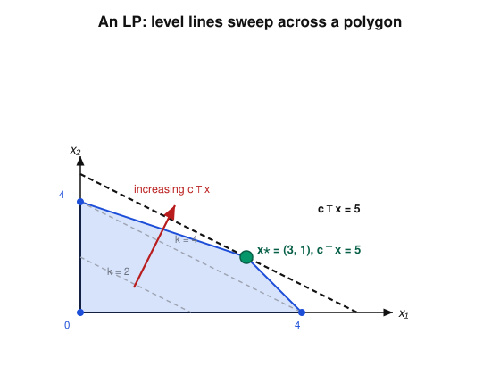

# Convex Optimization · Lesson 2.2: Linear and quadratic programs

> ⏱ ~15 min · Module 2: Convex problems and how to model with them · Builds on: [Lesson 2.1](02-01-convex-problem-local-global.md) · Unlocks: [Lesson 2.3](02-03-second-order-cone-programs.md)

## Why this matters

Lesson 2.1 told you *that* a convex problem is solvable globally. This lesson gives you the first two problem classes you can actually hand to a solver — and they are the two you'll meet most often anywhere. A linear program (LP) is what you write when everything in sight — cost, constraints — is linear: production planning, network flows, diet problems, the LP relaxations behind half of combinatorial optimization. A quadratic program (QP) is what you write the moment a *squared* quantity appears: least-squares fitting, ridge regression, the Markowitz portfolio (Lesson 5.3), the support-vector machine (Lesson 5.2), and every "track this trajectory with minimal control effort" problem in optimal control. Learn to spot these two shapes and you can model a startling fraction of applied math without inventing anything new.

## The idea

Both classes minimize a simple objective over a **polyhedron** — a region carved out by finitely many flat walls (linear inequalities), like a room whose corners are where walls meet.

- An **LP** has a *flat* objective: its level sets $\{x : c^\top x = k\}$ are parallel hyperplanes. Picture a sheet of these parallel planes sweeping across the room in the direction of decreasing cost. The last point of the room the sheet touches is your minimizer — and because the room is a polyhedron with flat walls, that last point is almost always a **corner** (a vertex). This is the one geometric fact to keep: *a linear objective over a polyhedron is minimized at a vertex.*

- A **QP** keeps the polyhedral room but bows the objective into a **bowl** — an upward-opening paraboloid. Now the minimizer is wherever the bowl bottoms out inside the room: possibly in the interior (if the unconstrained bottom is feasible), otherwise pushed against a wall or into a corner. The bowl opens *upward* — never a saddle, never a dome — exactly when the matrix defining its curvature is positive semidefinite. That single condition, $P \succeq 0$, is what makes a QP convex.

Least-squares — "find $x$ making $Ax$ as close as possible to $b$" — is the QP you already know from linear algebra. Its bowl is $\lVert Ax-b\rVert_2^2$, and it has no walls at all.

## The formal version

**Linear program (LP).** With decision variable $x \in \mathbb{R}^n$, data $c \in \mathbb{R}^n$, $A \in \mathbb{R}^{m\times n}$, $b \in \mathbb{R}^m$, $C \in \mathbb{R}^{p\times n}$, $d \in \mathbb{R}^p$:
$$\min_{x}\ c^\top x \quad \text{subject to}\quad Ax \preceq b,\ \ Cx = d.$$
Here $\preceq$ is the **componentwise** order: $Ax \preceq b$ means every row's inequality $a_i^\top x \le b_i$ holds. The feasible set $\{x : Ax \preceq b,\ Cx = d\}$ is a **polyhedron** — an intersection of finitely many halfspaces and hyperplanes.

*In words:* minimize a linear cost over a region bounded by flat walls.

**Quadratic program (QP).** With additionally a symmetric matrix $P \in \mathbb{R}^{n\times n}$ and $q \in \mathbb{R}^n$:
$$\min_{x}\ \tfrac12 x^\top P x + q^\top x \quad \text{subject to}\quad Ax \preceq b,\ \ Cx = d, \qquad P \succeq 0.$$
The objective is convex **iff** $P \succeq 0$ (its Hessian is exactly $P$). The $\tfrac12$ is pure convention — it makes the gradient $Px + q$ come out clean.

*In words:* minimize a bowl-shaped quadratic over a polyhedron; the bowl opens upward precisely when $P \succeq 0$.

**Least-squares as a QP.** The unconstrained problem $\min_x \lVert Ax - b\rVert_2^2$ expands, using $\lVert v\rVert_2^2 = v^\top v$, to
$$\lVert Ax-b\rVert_2^2 = x^\top (A^\top A)\, x - 2 b^\top A\, x + b^\top b.$$
Matching this to $\tfrac12 x^\top P x + q^\top x + \text{const}$ gives
$$\boxed{\,P = 2A^\top A, \qquad q = -2 A^\top b\,,}$$
and the constant $b^\top b$ doesn't move the minimizer. Since $x^\top (A^\top A) x = \lVert Ax\rVert_2^2 \ge 0$ for all $x$, we always have $A^\top A \succeq 0$, so $P \succeq 0$ — **least-squares is automatically a convex QP with no constraints.** Setting the gradient $Px + q = 2A^\top A x - 2A^\top b$ to zero recovers the **normal equations** $A^\top A\, x = A^\top b$.

**The nesting.** Set $P = 0$ and a QP *is* an LP — so $\text{LP} \subseteq \text{QP}$. Push further and you can also bound a quadratic in the *constraints*, not just the objective: a **QCQP** (quadratically constrained QP) replaces the linear walls with $\tfrac12 x^\top P_i x + q_i^\top x + r_i \le 0$, still convex when every $P_i \succeq 0$. That's the doorway to Lesson 2.3's cones — $\text{LP} \subseteq \text{QP} \subseteq \text{QCQP} \subseteq \text{SOCP}$.

## Picture

The LP $\ \max\ x_1 + 2x_2\ $ (equivalently $\min\ -x_1 - 2x_2$) subject to $x_1 + x_2 \le 4$, $x_1 + 3x_2 \le 6$, $x \succeq 0$. The parallel dashed lines are level sets $x_1 + 2x_2 = k$; as $k$ grows they sweep up-and-right (red arrow, the direction of $c$). The last vertex they touch — $x^* = (3,1)$ with objective $5$ — is the optimum.

## Worked examples

**Example 1 (least-squares → QP, then solve).** Fit a line $y = x_1 + x_2 t$ to the three points $(t,y) = (0,1),\,(1,3),\,(2,2)$ by least squares. Stacking the model $x_1 + x_2 t_i = y_i$ gives
$$A = \begin{bmatrix} 1 & 0 \\ 1 & 1 \\ 1 & 2 \end{bmatrix},\qquad b = \begin{bmatrix} 1 \\ 3 \\ 2 \end{bmatrix},\qquad \min_x \lVert Ax - b\rVert_2^2 .$$
Compute the QP data:
$$A^\top A = \begin{bmatrix} 3 & 3 \\ 3 & 5 \end{bmatrix},\quad A^\top b = \begin{bmatrix} 6 \\ 7 \end{bmatrix} \ \Rightarrow\ P = 2A^\top A = \begin{bmatrix} 6 & 6 \\ 6 & 10 \end{bmatrix},\quad q = -2A^\top b = \begin{bmatrix} -12 \\ -14 \end{bmatrix}.$$
The normal equations $A^\top A\, x = A^\top b$ read $3x_1 + 3x_2 = 6$ and $3x_1 + 5x_2 = 7$. Subtracting, $2x_2 = 1$, so $x_2 = \tfrac12$ and $x_1 = \tfrac{6 - 3\cdot\frac12}{3} = \tfrac32$. The best-fit line is $y = \tfrac32 + \tfrac12 t$. Because $P \succ 0$ here (its eigenvalues are positive — $\det P = 24 > 0$, trace $> 0$), the bowl has a unique bottom and this is *the* global minimizer.

**Example 2 (reading an LP optimum off the vertices).** Take the LP of the Picture, in standard minimization form: $\min\ c^\top x$ with $c = (-1,-2)$ over the polygon with vertices $(0,0),\,(4,0),\,(3,1),\,(0,2)$. A bounded LP attains its optimum at a vertex, so we need only evaluate $c^\top x = -x_1 - 2x_2$ at the four corners:
$$(0,0)\!: 0,\quad (4,0)\!: -4,\quad (3,1)\!: -5,\quad (0,2)\!: -4.$$
The minimum is $-5$ at $x^* = (3,1)$ — i.e. the *maximum* of $x_1 + 2x_2$ is $5$ there. No calculus, no gradient hunt: on a polyhedron a linear objective is a "check the corners" problem. (The corner $(3,1)$ is where the two walls $x_1+x_2=4$ and $x_1+3x_2=6$ meet — solving that $2\times2$ system is how you'd find it without a picture.)

## Watch out

- You might think any quadratic objective gives a convex QP — but only $P \succeq 0$ does. If $P$ is indefinite (a saddle) the feasible set is still a polyhedron, yet the problem is **nonconvex** and outside this course. Always check the curvature matrix before calling something a QP.
- You might think the $\tfrac12$ and the factor of $2$ in $P = 2A^\top A$ are typos — they're bookkeeping. With the $\tfrac12$ convention the gradient is $Px + q$; drop the $\tfrac12$ and you'd write $P = A^\top A$, $q = -2A^\top b$ instead. Either is fine, but **be consistent**, because the same $P$ appears in the KKT and Newton systems later. The minimizer is unaffected.
- You might think "optimum at a vertex" is a law — it's a *guarantee only when the LP is bounded and the optimum is attained*. If $c$ points into an unbounded direction the value runs off to $-\infty$ (no minimizer). And if a level line is parallel to a wall, an entire **edge** can be optimal — but even then a vertex of that edge is still *a* minimizer, which is all a solver needs.

## One-liner

> An LP slides a flat sheet across a polyhedron until it kisses a corner; a QP drops a bowl into the same polyhedron and finds where it bottoms out — convex exactly when $P \succeq 0$.

## Problems

**P1 (🟢)** Solve the LP $\ \max\ 2x_1 + 3x_2\ $ subject to $x_1 + x_2 \le 5$, $x_1 + 2x_2 \le 8$, $x_1 \ge 0$, $x_2 \ge 0$ by listing all vertices of the feasible polygon and evaluating the objective at each. Report the optimal vertex and value.

**P2 (🟡)** *Ridge regression is a QP.* Consider $\ \min_x\ \lVert Ax - b\rVert_2^2 + \lambda \lVert x\rVert_2^2\ $ with $\lambda > 0$. (a) Write it as a QP: find $P$ and $q$. (b) Show $P \succ 0$ (strictly positive definite) for every $\lambda > 0$, even when $A$ has more columns than rows so that $A^\top A$ is singular. (c) One sentence: why does that guarantee a *unique* minimizer where plain least-squares might not? (This is the fix statistical learning uses — see [Lesson 5.1](05-01-least-squares-lasso.md).)

**P3 (🔴, optional)** *Standard-form conversion.* Rewrite $\ \max\ 3x_1 - x_2\ $ subject to $x_1 - x_2 \ge -1$, $x_1 + x_2 = 4$, $x_1 \ge 0$, $x_2$ **free** (unrestricted in sign), into the LP standard form $\min\ c^\top x'\ \text{s.t.}\ A x' \preceq b,\ C x' = d$ with all variables $\succeq 0$. State the final $c, A, b, C, d$ and the substitution you used for the free variable.

Solutions

**P1** The walls are $x_1+x_2 \le 5$, $x_1 + 2x_2 \le 8$, and the two axes. Vertices:
- $(0,0)$ — the axes meet.
- $(5,0)$ — $x_1 + x_2 = 5$ meets $x_2 = 0$.
- $(0,4)$ — $x_1 + 2x_2 = 8$ meets $x_1 = 0$.
- $(2,3)$ — the two slanted walls meet: subtract $x_1+x_2=5$ from $x_1+2x_2=8$ to get $x_2 = 3$, then $x_1 = 2$.

(Check $(5,0)$ satisfies $x_1+2x_2 = 5 \le 8$ ✓ and $(0,4)$ satisfies $x_1+x_2=4\le5$ ✓, so both are genuine vertices.) Evaluate $2x_1 + 3x_2$:
$$(0,0)\!:0,\quad (5,0)\!:10,\quad (2,3)\!:4+9=13,\quad (0,4)\!:12.$$
Optimum: $x^* = (2,3)$, value $\mathbf{13}$.

**P2** (a) Expand both squared norms with $\lVert v\rVert_2^2 = v^\top v$:
$$\lVert Ax-b\rVert_2^2 + \lambda\lVert x\rVert_2^2 = x^\top(A^\top A)x - 2b^\top A x + b^\top b + \lambda\, x^\top x = x^\top\!\big(A^\top A + \lambda I\big)x - 2b^\top A x + b^\top b.$$
Matching to $\tfrac12 x^\top P x + q^\top x + \text{const}$:
$$P = 2\big(A^\top A + \lambda I\big), \qquad q = -2A^\top b.$$
(b) For any $x \neq 0$,
$$x^\top(A^\top A + \lambda I)x = \lVert Ax\rVert_2^2 + \lambda\lVert x\rVert_2^2 \ge \lambda \lVert x\rVert_2^2 > 0,$$
since $\lambda > 0$ and $x\neq 0$. So $A^\top A + \lambda I \succ 0$, hence $P = 2(A^\top A + \lambda I) \succ 0$ — regardless of the shape or rank of $A$. (Equivalently: $A^\top A$ has eigenvalues $\ge 0$; adding $\lambda I$ shifts them all up to $\ge \lambda > 0$.)
(c) A strictly convex objective ($P \succ 0$) is a bowl with a single lowest point, so the minimizer exists and is unique; plain least-squares has $P = 2A^\top A$ only $\succeq 0$, and when $A^\top A$ is singular the bowl has a flat trough — infinitely many minimizers. The ridge term $\lambda I$ tilts that trough into a strict bowl.

**P3** Convert step by step.
- **Objective:** $\max\ 3x_1 - x_2 \ \Longleftrightarrow\ \min\ -3x_1 + x_2$.
- **Free variable:** replace $x_2$ by $x_2 = x_2^+ - x_2^-$ with $x_2^+, x_2^- \ge 0$. New variable vector $x' = (x_1, x_2^+, x_2^-) \succeq 0$.
- **The $\ge$ inequality:** $x_1 - x_2 \ge -1 \Longleftrightarrow -x_1 + x_2 \le 1 \Longleftrightarrow -x_1 + x_2^+ - x_2^- \le 1$.
- **Equality:** $x_1 + x_2 = 4 \Longleftrightarrow x_1 + x_2^+ - x_2^- = 4$.

Final standard form, in $x' = (x_1, x_2^+, x_2^-)$:
$$c = \begin{bmatrix} -3 \\ 1 \\ -1 \end{bmatrix},\quad A = \begin{bmatrix} -1 & 1 & -1 \end{bmatrix},\quad b = \begin{bmatrix} 1 \end{bmatrix},\quad C = \begin{bmatrix} 1 & 1 & -1 \end{bmatrix},\quad d = \begin{bmatrix} 4 \end{bmatrix},$$
together with the implicit sign constraints $x' \succeq 0$. The two tricks — negate to flip $\min\!\leftrightarrow\!\max$ and to flip $\ge\!\rightarrow\!\le$, and split a free variable into a difference of nonnegatives — convert essentially any LP to standard form.

## Flashback

**From [Lesson 1.2](01-02-convex-set-zoo-operations.md) (a zoo of convex sets):** Show that the $\ell_1$-ball $B = \{x \in \mathbb{R}^2 : \lVert x\rVert_1 \le 1\}$ (where $\lVert x\rVert_1 = |x_1| + |x_2|$) is a **polyhedron** by writing it as an intersection of halfspaces. How many walls does it need? (This is why an $\ell_1$-constraint keeps a problem an LP/QP — the geometry that makes the lasso in Lesson 5.1 tractable.)

Solution

The condition $|x_1| + |x_2| \le 1$ must hold for *every* combination of signs of $x_1, x_2$. Since $|x_1| = \max\{x_1, -x_1\}$ and likewise for $x_2$, the single nonlinear inequality is equivalent to the four **linear** ones (one per sign pattern):
$$x_1 + x_2 \le 1,\qquad x_1 - x_2 \le 1,\qquad -x_1 + x_2 \le 1,\qquad -x_1 - x_2 \le 1.$$
So $B = \{x : Ax \preceq \mathbf{1}\}$ with
$$A = \begin{bmatrix} 1 & 1 \\ 1 & -1 \\ -1 & 1 \\ -1 & -1 \end{bmatrix},\qquad \mathbf{1} = \begin{bmatrix}1\\1\\1\\1\end{bmatrix},$$
an intersection of **four** halfspaces — the diamond with vertices $(\pm 1, 0)$ and $(0, \pm 1)$. It is a polyhedron. (In $\mathbb{R}^n$ the $\ell_1$-ball is the intersection of $2^n$ halfspaces, the cross-polytope.) Contrast the $\ell_2$-ball $\{\lVert x\rVert_2 \le 1\}$, which is convex but curved — *not* a polyhedron — and is exactly what forces Lesson 2.3's second-order cone instead of an LP.

## Connections

- **Backward:** This instantiates [Lesson 2.1](02-01-convex-problem-local-global.md)'s standard form with the two simplest objective/constraint shapes; the "local $\Rightarrow$ global" guarantee is exactly why checking the corners of an LP, or setting the QP gradient to zero, actually finds the global optimum. The polyhedral feasible set is the halfspace-intersection object from [Lesson 1.2](01-02-convex-set-zoo-operations.md), and $P \succeq 0$ is the Hessian test from Lesson 1.3.
- **Forward:** [Lesson 2.3](02-03-second-order-cone-programs.md) adds one curved wall — the second-order cone — capturing Euclidean-norm and robust constraints that no polyhedron can, and shows $\text{QP} \subseteq \text{SOCP}$. The normal equations here return in [Lesson 4.2](04-02-newtons-method.md): a Newton step *is* the solution of a least-squares/QP model of the objective.
- **Sideways (statistical learning):** least-squares and its ridge ($\ell_2$) and lasso ($\ell_1$) variants are the workhorse estimators of [statistical-learning](../../statistical-learning/syllabus.md), set up as convex programs in [Lesson 5.1](05-01-least-squares-lasso.md). The max-margin QP of the support-vector machine ([Lesson 5.2](05-02-support-vector-machines.md)) and the Markowitz mean–variance QP of portfolio choice ([Lesson 5.3](05-03-portfolio-optimal-control.md)) are two more QPs you now have the eye to recognize on sight.
