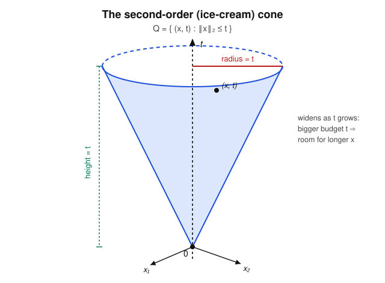

# Convex Optimization · Lesson 2.3: Second-order cone programs

> ⏱ ~15 min · Module 2: Convex problems and how to model with them · Builds on: [Lesson 2.2](02-02-linear-quadratic-programs.md) (LP & QP) · Unlocks: [Lesson 2.4](02-04-semidefinite-programs-conic-ladder.md) (SDP and the conic ladder)

## Why this matters

The moment your problem contains a *Euclidean length* — the distance you travel, the standard deviation of a portfolio, the size of a modeling error — you have left the world of LP and QP. A raw $\lVert \cdot \rVert_2$ in a constraint is not linear and not quadratic-in-the-QP-sense, yet it is still perfectly convex. The **second-order cone program (SOCP)** is exactly the problem class built to swallow such constraints whole. Its flagship payoff is **robustness**: a constraint that must survive *every* data vector in an ellipsoid of uncertainty — infinitely many linear inequalities — collapses into a *single* second-order cone constraint. SOCP sits one rung above LP/QP on the conic ladder and is still solved blazingly fast; climbing here instead of jumping straight to SDP (Lesson 2.4) is the modeling reflex this lesson trains.

## The idea

Picture carrying a stick of length $\lVert x \rVert_2$ and being handed a *budget* $t$. The pair $(x, t)$ is "legal" if the budget covers the stick: $\lVert x \rVert_2 \le t$. Collect every legal pair into one set. As the budget $t$ grows, the room for $x$ grows with it — the set of allowed $x$ is a ball of radius $t$. Stack those balls by height $t$ and you get an **ice-cream cone**: a point at the bottom ($t=0$ forces $x=0$), flaring open at a perfect 45° as you rise.

That cone is the whole story. An SOCP is just linear optimization where some of the variables are required to live *inside* one of these cones. And the reason it matters is a small miracle: "$a^\top x \le b$ must hold for all $a$ in an ellipsoid" — a demand you'd think needs infinitely many constraints — turns out to be *one* statement of the form "a certain vector fits inside a certain budget," i.e. one cone constraint.

## The formal version

**Definition (second-order cone).** The **second-order cone** (also *Lorentz* or *ice-cream* cone) in $\mathbb{R}^{n+1}$ is
$$\mathcal{Q}^{n+1} = \left\{ (x, t) \in \mathbb{R}^n \times \mathbb{R} \;:\; \lVert x \rVert_2 \le t \right\}.$$

*In words:* all pairs of a vector $x$ and a scalar $t$ where $t$ is at least as big as the length of $x$.

It is a **convex cone**: closed under nonnegative scaling (if $(x,t)$ is in it, so is $(\theta x, \theta t)$ for $\theta \ge 0$, since $\lVert \theta x\rVert_2 = \theta\lVert x\rVert_2 \le \theta t$) and closed under averaging (the triangle inequality gives $\lVert \lambda x_1 + (1{-}\lambda)x_2\rVert_2 \le \lambda t_1 + (1{-}\lambda)t_2$). You prove both cleanly in P3.

**Definition (SOCP standard form).** A second-order cone program is
$$\min_{x \in \mathbb{R}^n} \; c^\top x \qquad \text{subject to} \quad \lVert A_i x + b_i \rVert_2 \le c_i^\top x + d_i, \quad i = 1, \dots, m,$$
with data $A_i \in \mathbb{R}^{k_i \times n}$, $b_i \in \mathbb{R}^{k_i}$, $c_i \in \mathbb{R}^n$, $d_i \in \mathbb{R}$.

*In words:* minimize a linear objective, where each constraint says the pair $(A_i x + b_i,\; c_i^\top x + d_i)$ must sit inside a second-order cone. Each constraint is called a **second-order cone (SOC) constraint**. Note the right side is *affine* and the left is a Euclidean norm — that asymmetry is the whole shape of an SOC constraint.

**The conic ladder, rung by rung.** SOCP contains LP and (convex) QP as special cases:

- **LP $\subseteq$ SOCP.** A linear inequality $a^\top x \le b$ is the SOC constraint with $A_i = 0$: it reads $\lVert 0 \rVert_2 = 0 \le b - a^\top x$. Set $c_i = -a$, $d_i = b$. So every LP *is* an SOCP with degenerate (zero-height) cones.

- **Convex QCQP $\subseteq$ SOCP** via the **squared-norm trick.** A convex quadratic constraint hides a squared norm, and
$$\boxed{\ \lVert u \rVert_2^2 \le t \quad\Longleftrightarrow\quad \left\lVert \begin{pmatrix} 2u \\ t - 1 \end{pmatrix} \right\rVert_2 \le t + 1.\ }$$
The right side is a genuine SOC constraint. *Why it works:* both sides of the right-hand inequality are nonnegative when $t \ge 0$, so square them safely:
$$4\lVert u\rVert_2^2 + (t-1)^2 \le (t+1)^2 \iff 4\lVert u\rVert_2^2 \le (t+1)^2 - (t-1)^2 = 4t,$$
which is exactly $\lVert u\rVert_2^2 \le t$. Now take any convex quadratic constraint written as $\lVert Fx + g\rVert_2^2 \le h^\top x + e$ (a convex-quadratic-$\le$-affine, which is what a constraint $x^\top P x + q^\top x + r \le 0$ with $P = F^\top F \succeq 0$ becomes). Substitute $u = Fx + g$ (affine in $x$) and $t = h^\top x + e$ (affine in $x$) into the box: the result is a single SOC constraint in $x$.

So: **LP $\subseteq$ QP/QCQP $\subseteq$ SOCP.** Each rung buys strictly more modeling power at modest extra cost. The art of Module 2 is to climb only as high as your problem forces you.

**The flagship: robust linear programming.** Take an ordinary linear constraint $a^\top x \le b$, but suppose the coefficient vector $a$ is *uncertain* — known only to lie in an ellipsoid
$$\mathcal{E} = \{\, \bar a + P u : \lVert u\rVert_2 \le 1 \,\},$$
centered at the nominal $\bar a$, with shape matrix $P$. You demand the constraint hold **no matter which** $a \in \mathcal{E}$ nature picks:
$$a^\top x \le b \quad \text{for all } a \in \mathcal{E}.$$
This is infinitely many linear constraints. Reduce it to the *worst case* — the largest left-hand side:
$$\sup_{\lVert u\rVert_2 \le 1} (\bar a + Pu)^\top x = \bar a^\top x + \sup_{\lVert u\rVert_2 \le 1} u^\top (P^\top x) = \bar a^\top x + \lVert P^\top x \rVert_2,$$
using that $\sup_{\lVert u\rVert_2\le 1} u^\top v = \lVert v\rVert_2$ (the unit vector aligned with $v$ maximizes the inner product). The robust constraint is therefore the **single SOC constraint**
$$\boxed{\ \bar a^\top x + \lVert P^\top x \rVert_2 \le b.\ }$$

*In words:* to be safe against the whole ellipsoid, shrink the nominal budget by a **safety margin** $\lVert P^\top x\rVert_2$ that grows with how exposed your decision $x$ is to the uncertain directions. Infinitely many constraints, gone, replaced by one ice-cream-cone constraint.

## Picture

The cone flares at 45°: at height $t$ the legal $x$ fill a ball of radius exactly $t$. The apex at the origin is the only point where $t = 0$, forcing $x = 0$. An SOC constraint $\lVert A_i x + b_i\rVert_2 \le c_i^\top x + d_i$ says the *affine image* $(A_i x + b_i,\, c_i^\top x + d_i)$ of your decision must land somewhere inside this cone.

## Worked examples

**Example 1 (mechanical — the epigraph reflex).** Minimize a Euclidean norm, $\min_x \lVert Ax - b\rVert_2$. This objective is convex but not linear, so it is not yet SOCP *standard* form (which needs a linear objective). Fix it with the **epigraph trick**: introduce a scalar $t$ and push the norm into a constraint.
$$\min_{x,\,t} \; t \qquad \text{subject to} \quad \lVert Ax - b\rVert_2 \le t.$$
The objective $t$ is linear in the enlarged variable $(x,t)$; the single constraint is an SOC constraint with $A_1 = A$, $b_1 = -b$, $c_1^\top(x,t) = t$, $d_1 = 0$. This is now a bona fide SOCP. The same move handles a **sum of norms** $\min_x \sum_j \lVert F_j x - g_j\rVert_2$: give each term its own budget $t_j$, minimize $\sum_j t_j$ subject to $\lVert F_j x - g_j\rVert_2 \le t_j$ — one SOC constraint per term. (Minimizing the *unsquared* norm, or a sum of them, is genuinely SOCP and not QP — a first place the extra rung earns its keep.)

**Example 2 (why you'd care — a robust budget).** A planner spends $x = (x_1, x_2) \succeq 0$ on two inputs whose per-unit costs are uncertain: the nominal cost vector is $\bar a = (1, 1)$, and the true cost lies in a **spherical** uncertainty ball $a = \bar a + \rho u$, $\lVert u\rVert_2 \le 1$, with radius $\rho = \tfrac12$ (so $P = \rho I$). The budget cap is $b = 4$. When is a plan robustly affordable?

Specializing the boxed robust constraint with $P^\top = \rho I$:
$$\bar a^\top x + \rho\lVert x\rVert_2 \le b \quad\Longrightarrow\quad x_1 + x_2 + \tfrac12\lVert x\rVert_2 \le 4.$$
The nominal plan $x = (2, 2)$ costs exactly $\bar a^\top x = 4$ at nominal prices — right at the cap. But its safety margin is $\tfrac12\lVert(2,2)\rVert_2 = \tfrac12\sqrt{8} \approx 1.41$, so the robust left side is $4 + 1.41 = 5.41 > 4$: **not** robustly feasible. Adversarial prices $a = \bar a + \tfrac12\frac{x}{\lVert x\rVert}$ push the true cost to $5.41$ and blow the budget. Robustness has quietly shrunk the affordable region inward — and it did so by exactly one SOC constraint.

## Watch out

- **The right side must be affine, and it's a norm $\le$ affine — not norm $\le$ norm.** $\lVert A x + b\rVert_2 \le \lVert Cx + d\rVert_2$ is generally **not** convex (the right side is convex, and requiring a convex thing to be an *upper* bound is the wrong direction). Only $\lVert \text{affine}\rVert_2 \le \text{affine-scalar}$ is an SOC constraint.
- **Squared vs. unsquared norm.** $\lVert x\rVert_2 \le t$ is *directly* an SOC constraint; $\lVert x\rVert_2^2 \le t$ is a convex quadratic that needs the squared-norm trick above (or lives natively in a QP). Don't reach for the trick when the norm isn't squared — you already have a cone constraint.
- **Nonnegativity of the right side is automatic — don't double-count it.** Since the left side $\lVert A_i x + b_i\rVert_2 \ge 0$, any feasible point already satisfies $c_i^\top x + d_i \ge 0$. You never add "$c_i^\top x + d_i \ge 0$" as a separate constraint; the cone encodes it.
- **This is not the PSD cone.** The second-order cone lives in a vector space $\mathbb{R}^{n+1}$; the cone of Lesson 2.4 lives in the space of symmetric matrices. SOCP $\subseteq$ SDP, but keep the two cones straight.

## One-liner

> An SOCP is linear optimization with some variables trapped inside ice-cream cones $\lVert x\rVert_2 \le t$ — and its superpower is turning "robust against a whole ellipsoid of data" into a single such constraint.

## Problems

**P1 (🟢)** Rewrite the convex quadratic constraint
$$\lVert x\rVert_2^2 \le 2x_1 + 4, \qquad x \in \mathbb{R}^n,$$
as a single second-order cone constraint of the form $\lVert (\cdot) \rVert_2 \le (\text{affine in } x)$. (Use the squared-norm trick with $u = x$ and $t = 2x_1 + 4$.)

**P2 (🟡)** A cost vector $a \in \mathbb{R}^2$ is uncertain: $a = \bar a + Pu$ with $\lVert u\rVert_2 \le 1$, nominal $\bar a = (1,1)$, and $P = \tfrac12 I$. The budget constraint $a^\top x \le b$ with $b = 4$ must hold for **all** admissible $a$. (a) Write the robust constraint as a single SOC constraint in $x$. (b) Decide whether $x = (3, 0)$ is robustly feasible, and if not, name the worst-case cost vector $a$ that breaks it.

**P3 (🔴, optional)** Prove directly from the definition that $\mathcal{Q}^{n+1} = \{(x,t) : \lVert x\rVert_2 \le t\}$ is a convex cone: (a) it is a cone — $(x,t) \in \mathcal{Q} \Rightarrow (\theta x, \theta t) \in \mathcal{Q}$ for every $\theta \ge 0$; (b) it is convex. Then use (b)'s style of argument to justify the claim "LP $\subseteq$ SOCP": exhibit the linear inequality $a^\top x \le b$ as an SOC constraint.

Solutions

**P1** Apply the trick $\lVert u\rVert_2^2 \le t \iff \lVert(2u,\, t-1)\rVert_2 \le t+1$ with $u = x$ and $t = 2x_1 + 4$. Then $t - 1 = 2x_1 + 3$ and $t + 1 = 2x_1 + 5$, giving
$$\left\lVert \begin{pmatrix} 2x \\ 2x_1 + 3 \end{pmatrix} \right\rVert_2 \le 2x_1 + 5.$$
*Check by squaring* (valid since $2x_1 + 5 \ge 0$ on the feasible set): $4\lVert x\rVert_2^2 + (2x_1+3)^2 \le (2x_1+5)^2$. The difference of the two squares is $(2x_1+5)^2 - (2x_1+3)^2 = \big((2x_1+5)+(2x_1+3)\big)\big((2x_1+5)-(2x_1+3)\big) = (4x_1 + 8)(2) = 8x_1 + 16$, so the inequality reduces to $4\lVert x\rVert_2^2 \le 8x_1 + 16$, i.e. $\lVert x\rVert_2^2 \le 2x_1 + 4$. ✓

**P2** (a) With $P^\top = \tfrac12 I$, the worst-case value is $\sup_{\lVert u\rVert_2\le1}(\bar a + Pu)^\top x = \bar a^\top x + \lVert P^\top x\rVert_2 = (x_1 + x_2) + \tfrac12\lVert x\rVert_2$. The robust constraint is
$$x_1 + x_2 + \tfrac12\lVert x\rVert_2 \le 4.$$
(b) At $x = (3, 0)$: nominal part $x_1 + x_2 = 3$; margin $\tfrac12\lVert(3,0)\rVert_2 = \tfrac12(3) = 1.5$. Robust left side $= 3 + 1.5 = 4.5 > 4$, so $x = (3,0)$ is **not** robustly feasible. The worst-case $a$ is the maximizer $a = \bar a + P\,\frac{P^\top x}{\lVert P^\top x\rVert_2}$; here $P^\top x = \tfrac12(3,0) = (1.5, 0)$, so the unit direction is $(1, 0)$ and $a = (1,1) + \tfrac12(1, 0) = (1.5,\, 1)$. Check: $a^\top x = 1.5\cdot 3 + 1\cdot 0 = 4.5 > 4$. ✓ (Nominal price would have said $a^\top x = 3 \le 4$, "affordable" — robustness catches what the nominal model misses.)

**P3** (a) *Cone.* Let $(x,t) \in \mathcal{Q}$, so $\lVert x\rVert_2 \le t$, and let $\theta \ge 0$. Then $\lVert \theta x\rVert_2 = \theta\lVert x\rVert_2 \le \theta t$ (homogeneity of the norm, and $\theta \ge 0$ preserves the inequality). Hence $(\theta x, \theta t) \in \mathcal{Q}$.

(b) *Convex.* Let $(x_1, t_1), (x_2, t_2) \in \mathcal{Q}$ and $\lambda \in [0,1]$. By the triangle inequality and homogeneity,
$$\lVert \lambda x_1 + (1-\lambda) x_2\rVert_2 \le \lambda\lVert x_1\rVert_2 + (1-\lambda)\lVert x_2\rVert_2 \le \lambda t_1 + (1-\lambda) t_2,$$
where the last step uses $\lVert x_i\rVert_2 \le t_i$ and $\lambda, 1-\lambda \ge 0$. So the convex combination $\big(\lambda x_1 + (1-\lambda)x_2,\ \lambda t_1 + (1-\lambda) t_2\big)$ is again in $\mathcal{Q}$. Thus $\mathcal{Q}$ is convex; with (a) it is a convex cone.

*LP $\subseteq$ SOCP.* The inequality $a^\top x \le b$ is equivalent to $0 \le b - a^\top x$, i.e. $\lVert \mathbf{0}\rVert_2 \le b - a^\top x$ where $\mathbf{0}$ is the (empty/zero) left-hand vector. This is an SOC constraint with $A_i = 0$, $b_i = 0$, $c_i = -a$, $d_i = b$: the pair $(0,\ b - a^\top x)$ lies in the degenerate cone $\mathcal{Q}^1 = \{(0, s): s \ge 0\}$. Every linear inequality is therefore an SOC constraint, so any LP is an SOCP. $\blacksquare$

## Flashback

**From Lesson 2.2 (least-squares as a QP):** Fit a line $y = c + mt$ to the three data points $(t, y) = (0, 1), (1, 1), (2, 3)$ by least squares. (a) Write the fitting problem $\min_{c,m} \sum_i (c + m t_i - y_i)^2$ as $\min_z \lVert A z - b\rVert_2^2$ and identify the QP form $\tfrac12 z^\top P z + q^\top z + r$ (give $P$ and $q$). (b) Solve it via the normal equations $A^\top A z = A^\top b$.

Solution

(a) With $z = (c, m)$, stacking the three residuals gives
$$A = \begin{pmatrix} 1 & 0 \\ 1 & 1 \\ 1 & 2 \end{pmatrix}, \qquad b = \begin{pmatrix} 1 \\ 1 \\ 3 \end{pmatrix}.$$
Expanding $\lVert Az - b\rVert_2^2 = z^\top A^\top A\, z - 2 b^\top A z + b^\top b$, this is the QP $\tfrac12 z^\top P z + q^\top z + r$ with
$$P = 2 A^\top A = 2\begin{pmatrix} 3 & 3 \\ 3 & 5 \end{pmatrix} = \begin{pmatrix} 6 & 6 \\ 6 & 10 \end{pmatrix}, \qquad q = -2 A^\top b = -2\begin{pmatrix} 5 \\ 7 \end{pmatrix} = \begin{pmatrix} -10 \\ -14 \end{pmatrix},$$
and $r = b^\top b = 11$. Here $A^\top A = \begin{pmatrix} 3 & 3 \\ 3 & 5\end{pmatrix}$ and $A^\top b = (1{+}1{+}3,\ 0{+}1{+}6) = (5, 7)$. Since $P = 2A^\top A \succ 0$, the QP is strictly convex — one global minimizer.

(b) Solve $A^\top A\, z = A^\top b$, i.e. $\begin{pmatrix} 3 & 3 \\ 3 & 5\end{pmatrix} \begin{pmatrix} c \\ m \end{pmatrix} = \begin{pmatrix} 5 \\ 7\end{pmatrix}$. The determinant is $15 - 9 = 6$, so
$$\begin{pmatrix} c \\ m\end{pmatrix} = \frac{1}{6}\begin{pmatrix} 5 & -3 \\ -3 & 3\end{pmatrix}\begin{pmatrix} 5 \\ 7\end{pmatrix} = \frac{1}{6}\begin{pmatrix} 25 - 21 \\ -15 + 21\end{pmatrix} = \frac{1}{6}\begin{pmatrix} 4 \\ 6\end{pmatrix} = \begin{pmatrix} 2/3 \\ 1\end{pmatrix}.$$
The best-fit line is $y = \tfrac{2}{3} + t$. (Sanity: predictions $\tfrac23, \tfrac53, \tfrac83$ vs. data $1, 1, 3$; residuals $\tfrac13, -\tfrac23, \tfrac13$ sum to $0$, as least-squares with an intercept always forces.) ✓

## Connections

- **Backward:** this generalizes [Lesson 2.2](02-02-linear-quadratic-programs.md) — LP and convex QP are the flat and quadratic special cases sitting *inside* SOCP. The epigraph trick that turned least-squares into a QP is the same move that puts a norm objective into SOCP standard form.
- **Forward:** [Lesson 2.4](02-04-semidefinite-programs-conic-ladder.md) adds the top rung, the PSD cone, giving LP $\subseteq$ SOCP $\subseteq$ SDP; you'll re-express an SOC constraint as a linear matrix inequality via a Schur complement and see the ladder whole. The robust-modeling idea here is the entry point to robust portfolios in [Lesson 5.3](05-03-portfolio-optimal-control.md), where portfolio risk $\lVert \Sigma^{1/2} x\rVert_2$ is a native SOC quantity.
- **Sideways (statistics/finance):** the safety margin $\lVert P^\top x\rVert_2$ is exactly a *standard-deviation* term — in [`statistical-learning`](../../statistical-learning/syllabus.md) and in Markowitz portfolio theory, controlling $\lVert \Sigma^{1/2} x\rVert_2$ (return volatility) is an SOC constraint, which is why mean–variance and robust portfolio problems are SOCPs, not just QPs.
