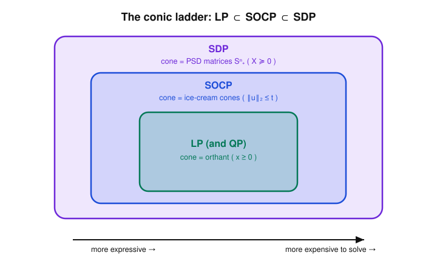
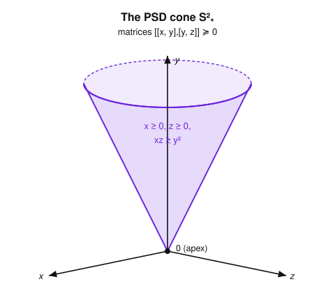

# Convex Optimization · Lesson 2.4: Semidefinite programs and the conic ladder

> ⏱ ~15 min · Module 2: Convex problems and how to model with them · Builds on: [Lesson 2.3](02-03-second-order-cone-programs.md) · Unlocks: [Lesson 3.1](03-01-lagrangian-dual-function.md)

## Why this matters

Some of the most important convex problems have a *matrix* for a variable: the covariance you tune in portfolio design, the Gram matrix you fit in machine learning, the Lyapunov matrix that certifies a control system won't blow up. Semidefinite programming (SDP) is the language for optimizing over such matrices, subject to the single most powerful convex constraint there is — "this matrix is positive semidefinite." It sits at the top of a ladder: every LP is a QP, every QP is an SOCP, and every SOCP is an SDP. Knowing where a problem lives on that ladder tells you both how expressively you can model it and how much it will cost to solve.

## The idea

You already met the PSD cone in [Lesson 1.2](01-02-convex-set-zoo-operations.md): the set of symmetric matrices $X \succeq 0$ is convex, so "minimize a linear function over it" is a legitimate convex problem — just with a matrix where you're used to a vector.

Here's the reframe that makes it click. In an LP the variable lives in the **nonnegative orthant** ($x \ge 0$, coordinate by coordinate). In an SOCP it lives in an **ice-cream cone** ($\lVert u\rVert_2 \le t$). In an SDP it lives in the **PSD cone** ($X \succeq 0$). Same template every time — *minimize a linear function subject to linear equalities and membership in a cone* — but a richer cone each rung up. And the PSD cone is rich enough to *contain* the other two: the orthant is the set of PSD diagonal matrices, and the ice-cream cone is a slice of the PSD cone (that's the Schur-complement trick, below). So climbing the ladder never loses anything; it only adds power, at a price.

The one tool you need to actually climb is the **Schur complement**: a gadget that turns a *quadratic* inequality into a *linear* condition on a bigger matrix being PSD. That single move is what lets you rewrite a norm constraint or a convex quadratic constraint as a semidefinite constraint — the concrete proof that SOCP $\subseteq$ SDP.

## The formal version

Throughout, $\mathbf{S}^n$ is the set of $n\times n$ symmetric matrices and $\mathbf{S}^n_+ = \{X \in \mathbf{S}^n : X \succeq 0\}$ the PSD cone. The natural inner product on matrices is
$$\langle C, X\rangle = \operatorname{tr}(C^\top X) = \sum_{i,j} C_{ij} X_{ij},$$
the entrywise dot product (for symmetric $C$, this is just $\operatorname{tr}(CX)$).

*In words:* treat a matrix as a long vector of its entries; $\langle C,X\rangle$ is the ordinary dot product, so it's linear in $X$.

**SDP, standard (equality) form.** With data $C, A_1,\dots,A_m \in \mathbf{S}^n$ and $b \in \mathbb{R}^m$, and matrix variable $X \in \mathbf{S}^n$:
$$\min_{X}\ \langle C, X\rangle \quad \text{subject to}\quad \langle A_i, X\rangle = b_i\ (i=1,\dots,m),\quad X \succeq 0.$$

*In words:* minimize a linear function of the matrix $X$, subject to $m$ linear equality constraints on its entries, over all PSD matrices. Compare an LP $\min c^\top x$ s.t. $a_i^\top x = b_i,\ x \ge 0$: identical, with the orthant swapped for the PSD cone.

**SDP, inequality (LMI) form.** With a *vector* variable $x \in \mathbb{R}^k$ and symmetric matrices $F_0, F_1, \dots, F_k$:
$$\min_{x}\ c^\top x \quad \text{subject to}\quad F(x) := F_0 + \sum_{i=1}^k x_i F_i \ \succeq\ 0.$$
The constraint $F(x)\succeq 0$ is a **linear matrix inequality (LMI)**: $F(x)$ is affine in $x$, and we require it to be PSD.

*In words:* an LMI says a matrix that depends *linearly* on your decision variables must be positive semidefinite. Because $\{x : F(x)\succeq 0\}$ is the preimage of the convex cone $\mathbf{S}^n_+$ under an affine map, it is a convex set — so any number of LMIs (and linear constraints) still gives a convex feasible set.

The two forms are interchangeable; use whichever fits the data. The workhorse for building LMIs is:

**Schur complement lemma.** For symmetric $A$ and $C$ with $C \succ 0$,
$$M = \begin{bmatrix} A & B \\ B^\top & C \end{bmatrix} \succeq 0 \quad\Longleftrightarrow\quad A - B\,C^{-1}B^\top \ \succeq\ 0.$$
The matrix $A - B C^{-1}B^\top$ is the **Schur complement** of $C$ in $M$. (By symmetry, if instead $A \succ 0$, then $M \succeq 0 \iff C - B^\top A^{-1}B \succeq 0$.)

*In words:* a block matrix with a positive-definite corner is PSD exactly when the "residual after eliminating that corner" is PSD. The magic is that $M$ is *linear* in $B$ even though the Schur complement involves $B C^{-1}B^\top$, which is *quadratic* in $B$ — so a quadratic PSD condition becomes a linear one, one dimension up.

## Picture

The ladder — each class is the previous one with a richer cone. Climb only as high as your problem forces you to.

And the object at the top: the PSD cone $\mathbf{S}^2_+$, the set of symmetric $2\times 2$ matrices $\begin{bmatrix}x&y\\y&z\end{bmatrix}\succeq 0$, i.e. $x\ge 0$, $z\ge 0$, $xz\ge y^2$. It is a genuine solid cone in $(x,y,z)$-space — convex, with its apex at the origin.

## Worked examples

**Example 1 (mechanical — a second-order cone constraint as an LMI).** Take the SOC constraint from [Lesson 2.3](02-03-second-order-cone-programs.md): $\lVert u\rVert_2 \le t$ with $u\in\mathbb{R}^k$, $t\ge 0$. Claim:
$$\lVert u\rVert_2 \le t \quad\Longleftrightarrow\quad \begin{bmatrix} t\,I_k & u \\ u^\top & t\end{bmatrix} \succeq 0.$$
Apply the Schur lemma with the *scalar* corner $C = t$ (assume $t>0$; the case $t=0$ forces $u=0$ separately). The Schur complement of $C$ is
$$A - BC^{-1}B^\top = t\,I_k - u\,\tfrac{1}{t}\,u^\top = t\,I_k - \tfrac{1}{t}uu^\top.$$
This is PSD iff $t^2 I_k - uu^\top \succeq 0$ (multiply by $t>0$). The eigenvalues of $uu^\top$ are $\lVert u\rVert_2^2$ (once) and $0$ (the rest), so $t^2 I_k - uu^\top \succeq 0 \iff t^2 \ge \lVert u\rVert_2^2 \iff t \ge \lVert u\rVert_2$. Done — and since the block matrix is affine in $(u,t)$, a whole SOCP constraint $\lVert A x + b\rVert_2 \le c^\top x + d$ becomes the LMI
$$\begin{bmatrix} (c^\top x + d)\,I & Ax+b \\ (Ax+b)^\top & c^\top x + d\end{bmatrix} \succeq 0.$$
That's the explicit embedding SOCP $\subseteq$ SDP.

**Example 2 (why you'd care — minimizing the largest eigenvalue).** Here's a problem SDP handles that no LP/QP/SOCP can express directly. Given symmetric matrices depending affinely on $x$, form $F(x) = F_0 + \sum_i x_i F_i$ and minimize its largest eigenvalue $\lambda_{\max}(F(x))$. The key identity is
$$\lambda_{\max}(F(x)) \le t \quad\Longleftrightarrow\quad t I - F(x) \succeq 0,$$
because "every eigenvalue of $F(x)$ is $\le t$" is exactly "$tI - F(x)$ has no negative eigenvalue." So
$$\min_{x}\ \lambda_{\max}(F(x)) \quad=\quad \min_{x,\,t}\ t \ \ \text{subject to}\ \ tI - F(x) \succeq 0,$$
an SDP in inequality form (the LMI is affine in $(x,t)$). Minimizing a maximum eigenvalue is the beating heart of robust control and spectral graph problems — and it is *linear objective + one LMI*, nothing fancier.

## Watch out

- You might think $X \succeq 0$ means "every entry of $X$ is nonnegative" — it does **not**. It means $v^\top X v \ge 0$ for all $v$ (equivalently, all eigenvalues $\ge 0$). $\begin{bmatrix}1 & -2\\ -2 & 5\end{bmatrix}$ has a negative entry but is PSD; $\begin{bmatrix}1 & 2\\ 2 & 1\end{bmatrix}$ has all-positive entries but is *not* (its eigenvalues are $3$ and $-1$). Entrywise-nonnegative is a different, unrelated cone.
- You might think the Schur lemma works with any corner block — but the clean "iff" above needs $C \succ 0$ (strictly). If $C$ is merely PSD and singular, $C^{-1}$ doesn't exist and you need the generalized-inverse version with an extra range condition. For modeling, arrange for the pivot block to be $I$ or a positive scalar and you'll never hit this.
- You might think climbing to SDP is free power, so always model at the top — but higher rungs cost more per iteration (an $n\times n$ LMI carries $\sim n^2$ variables and dense linear algebra). The reflex is: find the *tightest* class that fits. An SOC constraint solved as an SOCP is far cheaper than the same constraint inflated into an LMI, even though both are correct.

## One-liner

> LP, SOCP, SDP is one template — minimize a linear function over a cone — up a ladder of ever-richer cones, and the Schur complement is the elevator that lifts a quadratic constraint into a linear matrix inequality.

## Problems

**P1 (🟢)** Use the Schur complement to write the convex quadratic constraint $x_1^2 + x_2^2 \le t$ as a $3\times 3$ LMI in $(x_1, x_2, t)$. Then check your LMI directly at the two points $(x_1,x_2,t) = (3,4,25)$ and $(3,4,20)$: which one is feasible?

**P2 (🟡)** Prove the eigenvalue fact used in Example 1: for $u\in\mathbb{R}^k$ and $t>0$, show $t^2 I_k - uu^\top \succeq 0 \iff t \ge \lVert u\rVert_2$. (Hint: what are the eigenvalues and eigenvectors of the rank-one matrix $uu^\top$?)

**P3 (🔴, optional)** Consider $A(x) = \begin{bmatrix} 2 & x \\ x & 0\end{bmatrix}$ for $x\in\mathbb{R}$. Write "$\min_x \lambda_{\max}(A(x))$" as an SDP in inequality form using a $2\times 2$ LMI, then solve it by hand (find the optimal $x$ and optimal value) two ways: (a) via the Schur complement of the LMI, and (b) by directly computing $\lambda_{\max}(A(x))$. Confirm they agree.

Solutions

**P1** Write $x = (x_1, x_2)$. The constraint is $x^\top x \le t$, i.e. $\lVert x\rVert_2^2 \le t$. Take the block matrix with corner $C = 1$ (a positive scalar):
$$\begin{bmatrix} I_2 & x \\ x^\top & t \end{bmatrix} = \begin{bmatrix} 1 & 0 & x_1 \\ 0 & 1 & x_2 \\ x_1 & x_2 & t\end{bmatrix} \succeq 0.$$
It is affine in $(x_1,x_2,t)$, so it is a valid LMI. Schur check: the Schur complement of the top-left $I_2 \succ 0$ is $t - x^\top I_2^{-1} x = t - (x_1^2 + x_2^2)$, and $\succeq 0$ reproduces exactly $x_1^2+x_2^2 \le t$.

At $(3,4,25)$: $x_1^2+x_2^2 = 25 = t$, Schur complement $= 0 \ge 0$, so the matrix is PSD — **feasible** (boundary case, the matrix is singular). At $(3,4,20)$: Schur complement $= 20 - 25 = -5 < 0$, so **not PSD** — infeasible.

**P2** $uu^\top$ is symmetric of rank $\le 1$. If $u \ne 0$: $u$ is an eigenvector, since $(uu^\top)u = u(u^\top u) = \lVert u\rVert_2^2\, u$, eigenvalue $\lVert u\rVert_2^2$. Any $v \perp u$ gives $(uu^\top)v = u(u^\top v) = 0$, eigenvalue $0$ (multiplicity $k-1$). So the eigenvalues of $t^2 I_k - uu^\top$ are $t^2 - \lVert u\rVert_2^2$ (once) and $t^2$ ($k-1$ times). Since $t>0$, $t^2 > 0$ automatically; PSD requires only $t^2 - \lVert u\rVert_2^2 \ge 0$, i.e. $t \ge \lVert u\rVert_2$ (using $t>0$ to take the nonnegative root). If $u = 0$ the matrix is $t^2 I_k \succeq 0$ and $t \ge 0 = \lVert u\rVert_2$ holds trivially. $\blacksquare$

**P3** SDP form: $\lambda_{\max}(A(x)) \le t \iff tI - A(x)\succeq 0$, so
$$\min_{x,t}\ t \quad\text{subject to}\quad tI - A(x) = \begin{bmatrix} t-2 & -x \\ -x & t\end{bmatrix} \succeq 0.$$

(a) *Schur.* Take the corner $C = t$ (need $t>0$). Schur complement of $C$: $(t-2) - (-x)\tfrac{1}{t}(-x) = (t-2) - \tfrac{x^2}{t}$. Require $\ge 0$: $t(t-2) \ge x^2$, i.e. $t^2 - 2t - x^2 \ge 0$. Solving the boundary $t^2 - 2t - x^2 = 0$ for the larger root, $t = 1 + \sqrt{1 + x^2}$. Minimizing $t$ over $x$ means minimizing $1 + \sqrt{1+x^2}$, smallest at $x = 0$, giving $t^\star = 2$ (with $x^\star = 0$). (At $x=0$, $t=2$: the matrix is $\operatorname{diag}(0,2)\succeq 0$, boundary-feasible.)

(b) *Direct.* Characteristic polynomial of $A(x)$: $\det\!\begin{bmatrix}2-\lambda & x\\ x & -\lambda\end{bmatrix} = \lambda^2 - 2\lambda - x^2 = 0$, so $\lambda = 1 \pm \sqrt{1+x^2}$ and $\lambda_{\max}(A(x)) = 1 + \sqrt{1+x^2}$. Minimized at $x = 0$: value $2$.

Both give $x^\star = 0$, optimal value $2$. ✓ Note this is genuinely an SDP: minimizing $\lambda_{\max}$ of a matrix isn't a norm constraint, so there's no direct SOCP form — this is a problem the top rung earns its keep on.

## Flashback

**From Lesson 2.3 (Second-order cone programs — robust linear programming):** A linear constraint $a^\top x \le b$ must hold not just for one $a$, but for *every* coefficient vector $a$ in the ellipsoid $\mathcal{E} = \{\bar a + P u : \lVert u\rVert_2 \le 1\}$ (uncertainty in the data). Show the robust constraint "$a^\top x \le b$ for all $a \in \mathcal{E}$" is equivalent to a single second-order cone constraint, and write it out. Then instantiate with $\bar a = (1, 0)^\top$, $P = \operatorname{diag}(0.5, 0.5)$, $b = 2$: what is the robust constraint on $x = (x_1, x_2)$?

Solution

The constraint must survive the *worst-case* $a$, so it holds for all $a\in\mathcal{E}$ iff it holds at the maximizer of the left side:
$$\sup_{a\in\mathcal{E}} a^\top x = \sup_{\lVert u\rVert_2\le 1} (\bar a + Pu)^\top x = \bar a^\top x + \sup_{\lVert u\rVert_2\le 1} u^\top(P^\top x) = \bar a^\top x + \lVert P^\top x\rVert_2,$$
using that $\sup_{\lVert u\rVert_2\le 1} u^\top w = \lVert w\rVert_2$ (Cauchy–Schwarz, attained at $u = w/\lVert w\rVert_2$). So the robust constraint is the single SOC constraint
$$\bar a^\top x + \lVert P^\top x\rVert_2 \le b.$$
*In words:* protecting against ellipsoidal uncertainty just adds a norm "safety margin" to the nominal constraint.

Instantiating: $P^\top x = \operatorname{diag}(0.5,0.5)\,x = (0.5 x_1, 0.5 x_2)^\top$, so $\lVert P^\top x\rVert_2 = 0.5\sqrt{x_1^2 + x_2^2}$, and $\bar a^\top x = x_1$. The robust constraint is
$$x_1 + 0.5\sqrt{x_1^2 + x_2^2} \le 2.$$

## Connections

- **Backward:** the PSD cone $\mathbf{S}^n_+$ is exactly the convex cone from [Lesson 1.2](01-02-convex-set-zoo-operations.md), and the LMI feasible set is convex for the reason there — the affine preimage of a convex cone. Example 1 makes good on the promise in [Lesson 2.3](02-03-second-order-cone-programs.md) that SOCP sits *inside* SDP.
- **Forward:** with the modeling ladder complete, [Module 3](03-01-lagrangian-dual-function.md) turns to *duality* — every one of these conic problems has a dual, and the PSD cone's self-duality makes SDP duality especially clean. The Schur complement will reappear whenever a quadratic shows up inside a KKT system.
- **Sideways:** the covariance matrix in the Markowitz portfolio ([Lesson 5.3](05-03-portfolio-optimal-control.md)) and robust variants are naturally SDP/SOCP constraints; and minimizing $\lambda_{\max}$ (Example 2) is the convex relaxation workhorse that reaches toward the combinatorial problems living near [`graph-theory`](../../graph-theory/syllabus.md) — the one place the course brushes against the nonconvex world it otherwise skips.
