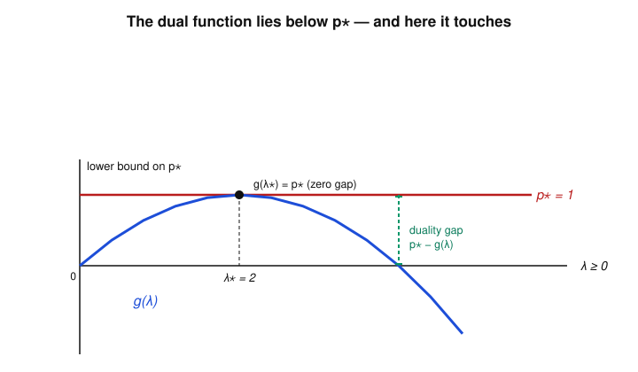

# Convex Optimization · Lesson 3.1: The Lagrangian and the dual function

> ⏱ ~15 min · Module 3: Duality and the KKT conditions · Builds on: [Lesson 2.1](02-01-convex-problem-local-global.md) (standard form, optimal value $p^*$) and all of Module 2 · Unlocks: [Lesson 3.2](03-02-strong-duality-slater.md) (strong duality and Slater)

## Why this matters

You have an optimization problem and you've found *a* feasible point with objective value $7.3$. Is that any good? Without a lower bound you have no idea — the true optimum could be $7.2$ or $-40$. Duality manufactures lower bounds *for free*: attach a price to every constraint, and out pops a number that provably sits below the optimum, no matter how you obtained it. Those prices are not an accounting trick — a Lagrange multiplier is literally the **shadow price** of its constraint, the same object an economist reads off a constrained consumer problem in [`grad-micro`](../../grad-micro/syllabus.md). This lesson builds the machine; the next two make it exact (strong duality) and turn it into the master optimality test (KKT).

## The idea

Constrained optimization is annoying because feasibility is a hard wall: step across $f_i(x) \le 0$ and your point is simply illegal. Duality replaces the wall with a **toll**. Instead of forbidding a violation, you *charge* for it: pick a price $\lambda_i \ge 0$ per unit of violation of constraint $i$, fold the tolls into the objective, and then minimize over *all* $x$ with no constraints at all.

That tolled objective is the **Lagrangian**. Minimizing it over $x$ gives a single number, the **dual function** $g(\lambda,\nu)$, which depends only on the prices. Two facts make this magical:

1. **It's always a lower bound.** For *any* nonnegative prices, $g(\lambda,\nu) \le p^*$. Why? At a genuinely feasible point the tolls are $\le 0$ (you're not violating anything), so the tolled objective never exceeds the true objective — and minimizing over all $x$ only pushes it lower. You get a certified floor under the optimum, for the cost of one unconstrained minimization.
2. **The floor is a concave function of the prices** — always, even when the original problem is a nonconvex horror. So "find the *best* (highest) lower bound" is itself a nice concave maximization, the dual problem of [Lesson 3.2](03-02-strong-duality-slater.md).

Raise the prices to their best setting and the floor rises toward $p^*$. Often it rises all the way and *touches* (zero gap) — that handshake is the whole point of Module 3.

## The formal version

Start from the standard form of [Lesson 2.1](02-01-convex-problem-local-global.md), with variable $x \in \mathbb{R}^n$ over a domain $\mathcal{D}$:

$$\min_{x}\; f_0(x) \quad \text{subject to}\quad f_i(x) \le 0\ (i=1,\dots,m), \quad h_j(x) = 0\ (j=1,\dots,p),$$

with optimal value $p^*$. Nothing here is assumed convex yet.

**Definition (Lagrangian).** For multipliers $\lambda \in \mathbb{R}^m$ and $\nu \in \mathbb{R}^p$,
$$L(x,\lambda,\nu) \;=\; f_0(x) \;+\; \sum_{i=1}^m \lambda_i\, f_i(x) \;+\; \sum_{j=1}^p \nu_j\, h_j(x).$$
The $\lambda_i$ are prices on the inequality constraints and the $\nu_j$ prices on the equalities. We call $\lambda,\nu$ **dual variables** or **Lagrange multipliers**.

*In words:* the objective plus a per-constraint toll, one toll term per constraint.

**Definition (dual function).** The **Lagrange dual function** is the unconstrained infimum over $x$:
$$g(\lambda,\nu) \;=\; \inf_{x \in \mathcal{D}} \, L(x,\lambda,\nu).$$

*In words:* charge the tolls, then optimize over $x$ freely; the resulting number depends only on the prices. It can be $-\infty$ for some prices — that's allowed, it just means those prices give a useless (vacuous) bound.

**Theorem (concavity — the free lunch).** $g$ is a **concave** function of $(\lambda,\nu)$ on all of $\mathbb{R}^m \times \mathbb{R}^p$, regardless of whether $f_0, f_i, h_j$ are convex.

*In words:* the dual function is concave even when the primal is a mess.

*Proof.* Fix any $x$. As a function of $(\lambda,\nu)$, $L(x,\lambda,\nu) = f_0(x) + \sum_i \lambda_i f_i(x) + \sum_j \nu_j h_j(x)$ is **affine** — the coefficients $f_i(x), h_j(x)$ are constants once $x$ is fixed. So $g$ is a pointwise infimum of a family of affine functions (one per $x$), and a pointwise infimum of affine (hence concave) functions is concave. $\blacksquare$

**Theorem (weak duality).** For every $\lambda \succeq 0$ and every $\nu$,
$$g(\lambda,\nu) \;\le\; p^*.$$
Here $\lambda \succeq 0$ means every component $\lambda_i \ge 0$; the equality prices $\nu$ are unrestricted in sign.

*In words:* any nonnegative inequality prices (with any equality prices) give a valid lower bound on the optimum.

*Proof (one line, worth memorizing).* Let $\tilde{x}$ be any feasible point. Feasibility gives $f_i(\tilde{x}) \le 0$, so with $\lambda_i \ge 0$ each $\lambda_i f_i(\tilde{x}) \le 0$; and $h_j(\tilde{x}) = 0$, so each $\nu_j h_j(\tilde{x}) = 0$. Hence
$$g(\lambda,\nu) \;=\; \inf_{x}\, L(x,\lambda,\nu) \;\le\; L(\tilde{x},\lambda,\nu) \;=\; f_0(\tilde{x}) + \underbrace{\textstyle\sum_i \lambda_i f_i(\tilde{x})}_{\le\,0} + \underbrace{\textstyle\sum_j \nu_j h_j(\tilde{x})}_{=\,0} \;\le\; f_0(\tilde{x}).$$
The first "$\le$" is just "an infimum is $\le$ any particular value." Since $g(\lambda,\nu) \le f_0(\tilde{x})$ for *every* feasible $\tilde{x}$, it is $\le$ the smallest such value, which is $p^*$. $\blacksquare$

**Definition (duality gap).** With $d^* = \max_{\lambda \succeq 0,\, \nu} g(\lambda,\nu)$ the best possible bound, the **optimal duality gap** is $p^* - d^* \ge 0$. When it's zero we say **strong duality** holds — the subject of the next lesson.

The sign convention worth burning in: **the requirement $\lambda \succeq 0$ is what makes the inequality toll help.** If a price could go negative, violating a constraint would *pay* you, and the bound would break.

## Picture

The dual function $g(\lambda)$ is a concave curve pinned below the horizontal line $p^*$. Raising the price $\lambda$ from $0$ lifts the bound until, at the best price $\lambda^*$, the curve *touches* $p^*$ (zero gap — a preview of [Lesson 3.2](03-02-strong-duality-slater.md)). Everywhere else there's a visible gap. This is exactly the picture of Example 1 below, where $g(\lambda) = -\tfrac14\lambda^2 + \lambda$ and $p^* = 1$.

## Worked examples

**Example 1 (mechanical — a one-constraint program, and the picture above).**

$$\min_{x}\; x^2 \quad \text{subject to}\quad x \ge 1.$$

Write the constraint in standard form as $f_1(x) = 1 - x \le 0$. The Lagrangian is
$$L(x,\lambda) = x^2 + \lambda(1 - x), \qquad \lambda \ge 0.$$
Minimize over $x$ (unconstrained now): $\partial_x L = 2x - \lambda = 0 \Rightarrow x^\star = \lambda/2$. Substitute:
$$g(\lambda) = \left(\tfrac{\lambda}{2}\right)^2 + \lambda\!\left(1 - \tfrac{\lambda}{2}\right) = \tfrac{\lambda^2}{4} + \lambda - \tfrac{\lambda^2}{2} = -\tfrac14\lambda^2 + \lambda.$$
This is concave (a downward parabola) exactly as promised. Weak duality says $-\tfrac14\lambda^2 + \lambda \le p^*$ for every $\lambda \ge 0$. Sanity-check the bound at a random price: $\lambda = 1$ gives $g(1) = 0.75$, and indeed the true optimum is $x=1$, $p^* = 1 \ge 0.75$. The *best* bound maximizes $g$: $g'(\lambda) = -\tfrac12\lambda + 1 = 0 \Rightarrow \lambda^* = 2$, giving $d^* = g(2) = -1 + 2 = 1 = p^*$. Zero gap — the curve kisses the line at $\lambda^* = 2$, which is the dot in the figure.

**Example 2 (why you'd care — equality-constrained least squares and a shadow price).**

$$\min_{x_1,x_2}\; x_1^2 + x_2^2 \quad \text{subject to}\quad x_1 + x_2 = 2.$$

This is the smallest "least-norm / least-squares with a linear constraint" problem: find the point of smallest length on a line. Take $h_1(x) = x_1 + x_2 - 2$ with multiplier $\nu$ (a scalar, sign-free because it prices an equality):
$$L(x,\nu) = x_1^2 + x_2^2 + \nu(x_1 + x_2 - 2).$$
Minimize over $x$: $\partial_{x_1} = 2x_1 + \nu = 0$ and $\partial_{x_2} = 2x_2 + \nu = 0$, so $x_1^\star = x_2^\star = -\nu/2$. Substitute:
$$g(\nu) = 2\cdot\tfrac{\nu^2}{4} + \nu\!\left(-\tfrac{\nu}{2} - \tfrac{\nu}{2} - 2\right) = \tfrac{\nu^2}{2} - \nu^2 - 2\nu = -\tfrac12\nu^2 - 2\nu.$$
Concave again. Maximize: $g'(\nu) = -\nu - 2 = 0 \Rightarrow \nu^* = -2$, and $d^* = g(-2) = -2 + 4 = 2$. The primal optimum is $x_1 = x_2 = 1$ (symmetry), $p^* = 1^2 + 1^2 = 2$. Zero gap.

Now the payoff interpretation. Change the budget from $2$ to $2 + \delta$: the optimum becomes $x_1 = x_2 = 1 + \delta/2$, so $p^*(\delta) = 2(1+\delta/2)^2$, and
$$\left.\frac{d\,p^*}{d\delta}\right|_{\delta=0} = 2 \cdot 2 \cdot \tfrac12 = 2 = -\nu^*.$$
The multiplier (up to sign) is exactly the **marginal cost of tightening the constraint** — the shadow price. Relax the "budget" $x_1+x_2 = 2$ by one unit and the optimal objective moves by $-\nu^* = 2$. This is precisely the Lagrange multiplier an economist calls the shadow price of the budget in [`grad-micro`](../../grad-micro/syllabus.md)'s constrained utility problem, and it's the sensitivity we'll formalize in [Lesson 3.4](03-04-geometry-of-duality.md).

## Watch out

- **You might think a bigger $\lambda$ always means a better bound — but $g$ is concave, so there's a single best price and overshooting it makes the bound *worse* again.** In Example 1, $\lambda = 4$ gives $g(4) = 0 < g(2) = 1$. Maximize $g$; don't crank $\lambda$.
- **You might think $g(\lambda,\nu) = -\infty$ is a bug — it isn't.** It's the honest report that these prices give no useful floor (the Lagrangian is unbounded below in $x$). The dual function's effective domain is exactly the set of prices where the bound is finite; the dual problem searches only there.
- **You might drop the sign restriction — don't.** $\lambda \succeq 0$ is mandatory for inequality prices; a negative $\lambda_i$ would reward violating $f_i \le 0$ and destroy weak duality. Equality multipliers $\nu$, by contrast, are free in sign, because an equality is violated equally by going either way.
- **The infimum is over the domain $\mathcal{D}$, not over the feasible set.** That's the whole trick: dropping the constraints is what makes the inner minimization easy (often closed-form). The constraints re-enter only through the toll terms.

## One-liner

> Price each constraint, fold the tolls into the objective, minimize over all $x$: the result is a concave function of the prices that always sits below $p^*$ — a free, certified lower bound whose best value you chase in the dual problem.

## Problems

**P1 (🟢)** For $\min\, x^2$ subject to $x \ge 3$ (i.e. $f_1(x) = 3 - x \le 0$): form the Lagrangian, derive the dual function $g(\lambda)$ for $\lambda \ge 0$, and find the best lower bound $d^*$ by maximizing $g$. Confirm it equals $p^*$ and report the optimal price $\lambda^*$.

**P2 (🟡)** Consider the linear program $\min\, c\,x$ subject to $x \ge 1$, with $f_1(x) = 1 - x \le 0$ and a scalar constant $c > 0$. Show that
$$g(\lambda) = \begin{cases} \lambda, & \lambda = c,\\[2pt] -\infty, & \lambda \ne c,\end{cases}$$
so the dual function is $-\infty$ except at a single price. Identify $d^*$ and check weak duality. (This is the LP phenomenon from the second "Watch out": the inner infimum of a linear objective is $-\infty$ unless the linear coefficient in $x$ vanishes.)

**P3 (🔴, optional)** Take a two-inequality problem, $\min\, x^2$ subject to $x \ge 1$ and $x \le 3$, written as $f_1 = 1 - x \le 0$, $f_2 = x - 3 \le 0$, with prices $\lambda_1,\lambda_2 \ge 0$. (a) Compute $g(\lambda_1,\lambda_2)$ in closed form. (b) Maximize it over $\lambda \succeq 0$ and verify $d^* = p^* = 1$. (c) Which multiplier is zero at the optimum, and what does that say about which constraint is "doing work"? (This is a preview of complementary slackness, [Lesson 3.3](03-03-kkt-conditions.md).)

Solutions

**P1** $L(x,\lambda) = x^2 + \lambda(3 - x)$. Minimize over $x$: $2x - \lambda = 0 \Rightarrow x^\star = \lambda/2$. Then
$$g(\lambda) = \tfrac{\lambda^2}{4} + \lambda\!\left(3 - \tfrac{\lambda}{2}\right) = \tfrac{\lambda^2}{4} + 3\lambda - \tfrac{\lambda^2}{2} = -\tfrac14\lambda^2 + 3\lambda.$$
Concave; $g'(\lambda) = -\tfrac12\lambda + 3 = 0 \Rightarrow \lambda^* = 6$. Then $d^* = g(6) = -9 + 18 = 9$. Primal: the constraint binds at $x = 3$, so $p^* = 9$. Zero gap, $\lambda^* = 6$. (Check: $\lambda^* = -\,dp^*/d(\text{rhs})$? Relaxing $x \ge 3$ to $x \ge 3+\delta$ gives $p^* = (3+\delta)^2$, derivative $6$ at $\delta = 0$, matching $\lambda^* = 6$ — a shadow price.)

**P2** $L(x,\lambda) = c\,x + \lambda(1 - x) = (c - \lambda)x + \lambda$. This is affine in $x$, so
$$g(\lambda) = \inf_x\,\big[(c-\lambda)x + \lambda\big] = \begin{cases} \lambda, & c - \lambda = 0,\\ -\infty, & c - \lambda \ne 0.\end{cases}$$
A nonzero slope $(c-\lambda)$ lets $x \to \pm\infty$ drive the linear function to $-\infty$. So the only finite bound is at $\lambda = c$, where $g(c) = c$. Hence $d^* = \max_{\lambda \ge 0} g(\lambda) = c$ (attained at $\lambda = c$, which is $\ge 0$ since $c > 0$). Primal: the constraint binds at $x = 1$, so $p^* = c\cdot 1 = c$. Weak duality holds with equality, $d^* = p^* = c$. The lesson: for an LP the dual function is $-\infty$ off a lower-dimensional set carved out by "the coefficient of $x$ is zero" — that set *is* the dual feasibility condition.

**P3** (a) $L = x^2 + \lambda_1(1 - x) + \lambda_2(x - 3)$. Minimize over $x$: $2x - \lambda_1 + \lambda_2 = 0 \Rightarrow x^\star = \tfrac12(\lambda_1 - \lambda_2)$. Substitute; writing $u = \lambda_1 - \lambda_2$,
$$g(\lambda_1,\lambda_2) = \tfrac{u^2}{4} + \lambda_1\!\left(1 - \tfrac{u}{2}\right) + \lambda_2\!\left(\tfrac{u}{2} - 3\right) = -\tfrac14(\lambda_1 - \lambda_2)^2 + \lambda_1 - 3\lambda_2.$$
(Concave: the quadratic part is $-\tfrac14 u^2$, negative semidefinite in $(\lambda_1,\lambda_2)$.)
(b) Maximize over $\lambda \succeq 0$. Try the interior stationarity: $\partial_{\lambda_1} g = -\tfrac12(\lambda_1-\lambda_2) + 1 = 0$ and $\partial_{\lambda_2} g = +\tfrac12(\lambda_1-\lambda_2) - 3 = 0$ are inconsistent (they'd need $u = 2$ and $u = 6$), so the max is on the boundary $\lambda_2 = 0$. With $\lambda_2 = 0$: $g = -\tfrac14\lambda_1^2 + \lambda_1$, maximized at $\lambda_1 = 2$, value $1$. Check the other face $\lambda_1 = 0$: $g = -\tfrac14\lambda_2^2 - 3\lambda_2$, decreasing for $\lambda_2 \ge 0$, best value $0$ at $\lambda_2 = 0$. So $d^* = 1$ at $(\lambda_1^*,\lambda_2^*) = (2, 0)$. Primal: $\min x^2$ on $[1,3]$ is at $x = 1$, $p^* = 1$. Zero gap. ✓
(c) $\lambda_2^* = 0$. The upper constraint $x \le 3$ is slack (inactive) at the optimum $x = 1$, so its price is zero — you don't pay for a constraint that isn't binding. Only $\lambda_1^* = 2 > 0$, pricing the *active* constraint $x \ge 1$. That "price times slack $= 0$" pattern is complementary slackness ([Lesson 3.3](03-03-kkt-conditions.md)).

## Flashback

**From [Lesson 2.1](02-01-convex-problem-local-global.md) (first-order optimality over a feasible set):** Recall the first-order optimality condition for minimizing a differentiable convex $f_0$ over a convex feasible set $C$: a point $x^*\in C$ is optimal **iff** $\nabla f_0(x^*)^\top (x - x^*) \ge 0$ for all $x \in C$ (no feasible direction points downhill). Use it: for $f_0(x) = (x - 3)^2$ on the feasible interval $C = [0,1]$, verify that $x^* = 1$ satisfies the condition, and conclude it is the *global* minimizer.

Solution

Here $f_0'(x) = 2(x - 3)$, so $f_0'(1) = 2(1 - 3) = -4$. The condition at $x^* = 1$ reads $f_0'(1)\,(x - 1) \ge 0$ for all $x \in [0,1]$, i.e. $-4\,(x - 1) \ge 0$. For every $x \in [0,1]$ we have $x - 1 \le 0$, hence $-4(x-1) \ge 0$. ✓ The condition holds, so $x^* = 1$ is optimal. Because $f_0$ is convex and $C$ is convex, first-order optimality is not just necessary but sufficient, and any local optimum is global (Lesson 2.1's $\text{local} \Rightarrow \text{global}$), so $x^* = 1$ is *the* global minimizer, with value $f_0(1) = 4$. Intuition: the unconstrained minimum sits at $x = 3$, to the right of the interval, so the objective is still decreasing as $x$ rises to the right endpoint $1$ — the feasible point closest to $3$ wins.

## Connections

- **Backward:** the inner step "minimize $L$ over all $x$" is an *unconstrained* problem, solved with the first-order optimality of [Lesson 2.1](02-01-convex-problem-local-global.md); and the LP/QP structure of [Module 2](02-02-linear-quadratic-programs.md) is exactly what makes those inner minimizations closed-form (linear objective $\Rightarrow$ dual is $-\infty$ off a hyperplane; quadratic objective $\Rightarrow$ dual is a concave quadratic, as in Examples 1–2).
- **Forward:** [Lesson 3.2](03-02-strong-duality-slater.md) asks *when* the gap $p^* - d^*$ is zero (Slater's condition) so the dual actually solves the primal; [Lesson 3.3](03-03-kkt-conditions.md) fuses stationarity of $L$, feasibility, and complementary slackness (previewed in P3) into the KKT master conditions; [Lesson 3.4](03-04-geometry-of-duality.md) reads the multiplier as the sensitivity/shadow price Example 2 computed by hand.
- **Sideways (economics):** the multiplier as a shadow price is the same object as the budget multiplier in [`grad-micro`](../../grad-micro/syllabus.md)'s constrained consumer problem — a price on a constraint, paid only when the constraint binds. The same machinery reappears as the max-margin dual of the SVM in [Lesson 5.2](05-02-support-vector-machines.md).
