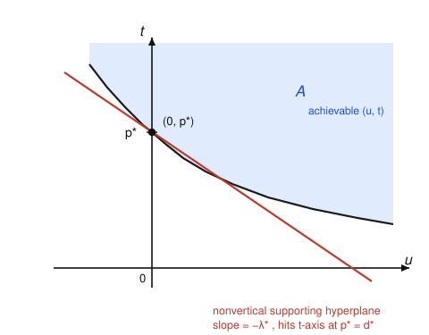

# Convex Optimization · Lesson 3.2: Strong duality and Slater's condition

> ⏱ ~15 min · Module 3: Duality and the KKT conditions · Builds on: [3.1 The Lagrangian and the dual function](03-01-lagrangian-dual-function.md), [1.1 Convex sets and the separating hyperplane](01-01-convex-sets-separating-hyperplane.md) · Unlocks: [3.3 The KKT conditions](03-03-kkt-conditions.md)

## Why this matters

Last lesson gave you a free *lower* bound on any minimization: the dual function $g(\lambda,\nu)$ never exceeds the true optimum $p^*$. A lower bound is nice, but the dream is that the best lower bound is *exact* — that solving the (always convex) dual hands you the answer to the primal. When that happens we say **strong duality** holds, and it is the hinge the entire theory of optimization swings on: it turns a hard constrained problem into a sometimes-easier one, it certifies optimality (a matching dual point is a proof you've found $p^*$), and — next lesson — it is what makes the KKT conditions *sufficient*, not merely necessary. The catch: strong duality is not automatic, even for convex problems. This lesson tells you exactly when to expect it, and shows you the one clean picture that explains why.

## The idea

Recall the primal from [3.1](03-01-lagrangian-dual-function.md):
$$\min_x\ f_0(x)\quad \text{subject to}\quad f_i(x)\le 0\ (i=1,\dots,m),\quad h_j(x)=0\ (j=1,\dots,p),$$
with optimal value $p^*$. Its **dual problem** is to squeeze the best possible lower bound out of $g$:
$$\max_{\lambda,\nu}\ g(\lambda,\nu)\quad \text{subject to}\quad \lambda\succeq 0,$$
with optimal value $d^*$. Weak duality (last lesson) says every feasible $g$ sits below $p^*$, so the *best* one does too: $d^*\le p^*$. The nonnegative number $p^*-d^*$ is the **duality gap**.

**Strong duality** is the statement $d^*=p^*$: the gap is zero, and the dual's answer *is* the primal's answer. Two facts make this worth chasing. First, the dual is **always a concave maximization** — a convex program — no matter how ugly the primal was; so if the gap is zero you may get the primal value by solving something structurally nicer. Second, the gap being zero is *geometric*: it says a certain convex set can be propped up from below by a **nonvertical** supporting hyperplane touching at exactly the right point. Convexity of the primal almost guarantees this — the only thing that can go wrong is a degenerate, "vertical" boundary, and **Slater's condition** is the mild hygiene rule that rules it out: *just find one strictly feasible point.*

## The formal version

**The dual problem is convex — always.** The dual function $g(\lambda,\nu)=\inf_x L(x,\lambda,\nu)$ is a pointwise infimum of functions that are *affine* (hence concave) in $(\lambda,\nu)$; an infimum of concave functions is concave. Maximizing a concave $g$ over the convex set $\{\lambda\succeq 0\}$ is a convex program.

*In words:* whatever the primal, the dual is a well-behaved convex problem — this is why duality is a tool and not just a curiosity.

**Weak vs. strong duality.**
$$d^* \;\le\; p^* \quad\text{(weak, always)}, \qquad\qquad d^* \;=\; p^* \quad\text{(strong, sometimes)}.$$

*In words:* the best lower bound is always $\le$ the truth; strong duality says it hits the truth exactly.

**Slater's condition.** Suppose the primal is **convex** ($f_0,\dots,f_m$ convex, the $h_j$ affine). If there exists a point $x$ in the relative interior of the domain that is **strictly feasible** —
$$f_i(x) < 0 \ \text{ for every nonaffine } f_i, \qquad h_j(x)=0 \ \text{for all } j$$
— then **strong duality holds** ($d^*=p^*$), and moreover the dual optimum is **attained** (some $\lambda^*\succeq0,\nu^*$ achieves $g(\lambda^*,\nu^*)=p^*$).

*In words:* for a convex problem, if you can wiggle strictly inside every curved inequality constraint (affine ones you only need to satisfy), the gap is guaranteed to close. Slater is a **constraint qualification** — a sanity check on the constraints, cheap to verify: exhibit one interior point.

Two things to underline. (1) The affine constraints get a pass — they need only *hold*, not hold *strictly*. That's why LPs, whose constraints are all affine, enjoy strong duality whenever they're feasible, no wiggle room required. (2) Slater is **sufficient, not necessary**: it fails silently on problems that nonetheless have zero gap (you'll build one in P2). It is a guarantee, not a diagnosis.

## Picture

Here is the geometry, and it is the whole lesson. Track the constraint value $u$ and the objective value $t$ jointly — the set of jointly *achievable-or-worse* pairs (one inequality constraint shown, so $u,t\in\mathbb{R}$):
$$\mathcal{A} \;=\; \{(u,t)\ :\ \exists\, x \text{ with } f_1(x)\le u,\ f_0(x)\le t\}.$$
When the primal is convex, $\mathcal{A}$ is a **convex** set. Two readings live in this one picture:

- The primal value is where the vertical axis $u=0$ first enters $\mathcal{A}$ from below: $p^* = \inf\{t : (0,t)\in\mathcal{A}\}$ — the point $(0,p^*)$ sits on the lower boundary.
- A dual multiplier $\lambda\ge0$ names a **nonvertical hyperplane** with normal $(\lambda,1)$; supporting $\mathcal{A}$ from below with it, its height over $u=0$ is exactly $g(\lambda)$. Since the whole set lies above the hyperplane and $(0,p^*)\in\mathcal{A}$, we read off $g(\lambda)\le p^*$ — that's weak duality, *drawn*.

Strong duality is the case pictured: there is a nonvertical supporting hyperplane touching $\mathcal{A}$ **at the boundary point $(0,p^*)$ itself**. Its slope is $-\lambda^*$, and because it touches on the axis, its intercept there equals $p^*$ — i.e. $g(\lambda^*)=p^*=d^*$, zero gap. The *only* way this can fail for a convex $\mathcal{A}$ is if every supporting hyperplane at $(0,p^*)$ is **vertical** (normal $(\lambda,0)$ with no $t$-component) — a pathological boundary where the "constraint direction" points straight up and no finite slope $-\lambda^*$ exists. Slater's strictly-feasible point forces $(0,p^*)$ to sit where the boundary has a genuine, non-vertical tangent, ruling the pathology out. This is the [separating/supporting-hyperplane theorem of 1.1](01-01-convex-sets-separating-hyperplane.md) doing all the work — duality is that theorem in disguise.

## Worked examples

**Example 1 (Slater holds — the dual delivers the primal).** Solve
$$\min_x\ x^2 \quad \text{subject to}\quad 1 - x \le 0.$$
Convex, and $x=2$ gives $1-2=-1<0$: **strictly feasible**, so Slater holds and we may trust the dual. Lagrangian $L(x,\lambda)=x^2+\lambda(1-x)$. Minimize over $x$: $\partial_x L = 2x-\lambda=0\Rightarrow x=\lambda/2$, so
$$g(\lambda)=\left(\tfrac{\lambda}{2}\right)^2+\lambda\!\left(1-\tfrac{\lambda}{2}\right)=\lambda-\tfrac{\lambda^2}{4}.$$
Dual: $\max_{\lambda\ge0}\ \lambda-\lambda^2/4$. Setting $1-\lambda/2=0$ gives $\lambda^*=2$, and $g(2)=2-1=1$. So $d^*=1$. The primal is obviously minimized at $x=1$ with $p^*=1$. Indeed $d^*=p^*=1$ — **zero gap**, exactly as Slater promised, and $\lambda^*=2$ is the slope $-\lambda^*$ from the picture. (Preview: that $\lambda^*=2$ is the *shadow price* — nudging the constraint to $1+\varepsilon-x\le0$ raises $p^*$ at rate $\lambda^*$. More in [3.4](03-04-geometry-of-duality.md).)

**Example 2 (convex, but Slater fails — a real gap).** This is the example to remember, because it kills the tempting belief "convex $\Rightarrow$ zero gap." Take, on the domain $\{(x,y):y>0\}$,
$$\min_{x,y}\ e^{-x}\quad\text{subject to}\quad \frac{x^2}{y}\le 0.$$
It is convex: $e^{-x}$ is convex, and $x^2/y$ is a quadratic-over-linear, convex on $y>0$ (see [1.4](01-04-recognizing-convexity.md)). But $x^2/y\ge0$ always, so the constraint forces $x=0$; the feasible set is $\{(0,y):y>0\}$ and $p^*=e^0=1$. **Slater fails**: no point makes $x^2/y<0$ strictly. Now the dual. For $\lambda\ge0$,
$$g(\lambda)=\inf_{x,\,y>0}\Big(e^{-x}+\lambda\,\tfrac{x^2}{y}\Big)=0,$$
because sending $y\to\infty$ kills the second term and $x\to\infty$ sends $e^{-x}\to0$; the objective is bounded below by $0$ and approaches it. So $g(\lambda)=0$ for all $\lambda\ge0$, giving $d^*=0$. The **duality gap is $p^*-d^*=1-0=1$** — strictly positive, on a fully convex problem. Geometrically, $\mathcal{A}$ here has a vertical supporting hyperplane at $(0,1)$: no finite-slope line props it up there, so no $\lambda^*$ can reach $p^*$. That vertical wall is *precisely* what Slater exists to forbid.

## Watch out

- **You might think convexity alone gives $d^*=p^*$** — but Example 2 is convex with a gap of $1$. You need convexity **plus** a constraint qualification like Slater. Convexity guarantees $\mathcal{A}$ is convex; Slater guarantees the touching hyperplane isn't vertical.
- **You might think Slater failing proves a gap exists** — it doesn't. Slater is *sufficient only*. A problem can flunk Slater and still have zero gap (P2 builds exactly this). To conclude "gap," you must actually compute $d^*<p^*$.
- **You might strictly enforce every constraint when checking Slater** — but affine equalities and affine inequalities need only be *satisfied*, not made strict. Demanding $f_i(x)<0$ on an affine $f_i$ would wrongly disqualify feasible LPs. Only the genuinely curved (nonaffine) inequalities require strict slack.
- **Don't confuse $d^*\le p^*$ (weak, unconditional) with $d^*=p^*$ (strong, conditional).** Weak duality holds for *any* problem, convex or not — it's the free lower bound. Strong duality is the extra gift.

## One-liner

> For a convex problem, one strictly feasible point (Slater) tilts the supporting hyperplane off vertical and slams the duality gap shut — the dual then solves the primal.

## Problems

**P1 (🟢)** For $\min_x\ x^2+2x$ subject to $1-x\le 0$: (a) check Slater; (b) form $g(\lambda)$ and solve the dual for $\lambda^*$ and $d^*$; (c) confirm $d^*=p^*$ by solving the primal directly.

**P2 (🟡)** Consider $\min_x\ x$ subject to $x^2\le 0$ (scalar $x$). (a) Find the feasible set and $p^*$. (b) Show Slater **fails**. (c) Compute $g(\lambda)$ for $\lambda>0$ and find $d^*=\sup_{\lambda>0}g(\lambda)$. (d) Is there a duality gap? What does this show about Slater as a condition?

**P3 (🔴, optional)** Suppose strong duality holds and both optima are attained: $x^\star$ solves the primal and $(\lambda^\star,\nu^\star)$ the dual, with $f_0(x^\star)=g(\lambda^\star,\nu^\star)$. Prove that $\lambda_i^\star\, f_i(x^\star)=0$ for every $i$ — the **complementary slackness** condition. (This is the bridge into [3.3](03-03-kkt-conditions.md): a binding price meets a binding constraint.)

Solutions

**P1.** (a) $x=2$ gives $1-2=-1<0$: strictly feasible, Slater holds (convex problem). (b) $L=x^2+2x+\lambda(1-x)$; $\partial_x L=2x+2-\lambda=0\Rightarrow x=(\lambda-2)/2$. Substitute:
$$g(\lambda)=\frac{(\lambda-2)^2}{4}+(\lambda-2)+\frac{4\lambda-\lambda^2}{2}=\frac{-\lambda^2+8\lambda-4}{4}.$$
Maximize over $\lambda\ge0$: $\partial_\lambda g=(-2\lambda+8)/4=0\Rightarrow \lambda^*=4$, and $g(4)=(-16+32-4)/4=12/4=3$, so $d^*=3$. (c) Unconstrained, $x^2+2x$ minimizes at $x=-1$, but the constraint requires $x\ge1$; the objective is increasing for $x\ge1$, so the minimum is at $x=1$ with $p^*=1+2=3$. Thus $d^*=p^*=3$. ✓

**P2.** (a) $x^2\le0\iff x=0$, so the feasible set is $\{0\}$ and $p^*=0$. (b) Slater would need $x$ with $x^2<0$ — impossible (and $x^2$ is nonaffine), so Slater fails. (c) $L=x+\lambda x^2$. For $\lambda>0$ this is a convex parabola in $x$, minimized at $x=-1/(2\lambda)$:
$$g(\lambda)=-\frac{1}{2\lambda}+\lambda\cdot\frac{1}{4\lambda^2}=-\frac{1}{2\lambda}+\frac{1}{4\lambda}=-\frac{1}{4\lambda}.$$
(For $\lambda=0$, $g(0)=\inf_x x=-\infty$.) Then $d^*=\sup_{\lambda>0}\big(-\tfrac{1}{4\lambda}\big)=0$, approached as $\lambda\to\infty$ (never attained). (d) $d^*=0=p^*$: **no gap**, even though Slater failed. Moral: Slater is *sufficient but not necessary* — its failure is not a proof of a gap; you must compute $d^*$ to know. (Note too that the dual optimum is not attained here, a symptom of the missing qualification.)

**P3.** Chain the assumed equalities and the definition of $g$:
$$f_0(x^\star)=g(\lambda^\star,\nu^\star)=\inf_x L(x,\lambda^\star,\nu^\star)\ \le\ L(x^\star,\lambda^\star,\nu^\star)=f_0(x^\star)+\sum_i\lambda_i^\star f_i(x^\star)+\sum_j\nu_j^\star h_j(x^\star).$$
Primal feasibility gives $h_j(x^\star)=0$, so the last sum vanishes. Subtracting $f_0(x^\star)$ from both ends:
$$0\ \le\ \sum_i \lambda_i^\star f_i(x^\star).$$
But each term is $\le0$: $\lambda_i^\star\ge0$ (dual feasibility) and $f_i(x^\star)\le0$ (primal feasibility). A sum of nonpositive terms that is $\ge0$ must be $0$, and every term must individually be $0$:
$$\lambda_i^\star f_i(x^\star)=0\quad\text{for all }i. \qquad\blacksquare$$
Reading it: for each constraint, either the price is zero ($\lambda_i^\star=0$) or the constraint is tight ($f_i(x^\star)=0$) — you only pay for constraints that bind. (As a corollary, the middle inequality is an equality, so $x^\star$ *minimizes* $L(\cdot,\lambda^\star,\nu^\star)$ — the stationarity half of KKT.)

## Flashback

**From Lesson 3.1 (the Lagrangian, dual function, and weak-duality bound):** For
$$\min_x\ x^2\quad\text{subject to}\quad 2 - x \le 0,$$
form the Lagrangian, derive the dual function $g(\lambda)$, and use **weak duality** to produce a numerical lower bound on $p^*$ by evaluating $g$ at $\lambda=1$. Then find the multiplier that gives the *best* bound and state $d^*$.

Solution

$L(x,\lambda)=x^2+\lambda(2-x)$. Minimizing over $x$: $2x-\lambda=0\Rightarrow x=\lambda/2$, so
$$g(\lambda)=\frac{\lambda^2}{4}+\lambda\!\left(2-\frac{\lambda}{2}\right)=2\lambda-\frac{\lambda^2}{4}.$$
At $\lambda=1$: $g(1)=2-\tfrac14=\tfrac74$. Weak duality ($g(\lambda)\le p^*$ for any $\lambda\ge0$) gives the certified lower bound $p^*\ge \tfrac{7}{4}$. Best bound: $\partial_\lambda g=2-\lambda/2=0\Rightarrow \lambda^*=4$, and $g(4)=8-4=4$, so $d^*=4$. (Check: the primal minimizes $x^2$ subject to $x\ge2$ at $x=2$, giving $p^*=4=d^*$ — zero gap, since $x=3$ is strictly feasible and Slater holds.)

## Connections

- **Backward:** this is the [separating/supporting-hyperplane theorem of 1.1](01-01-convex-sets-separating-hyperplane.md) applied to the set $\mathcal{A}$ — strong duality *is* the existence of a nonvertical supporting hyperplane at $(0,p^*)$. It upgrades the weak-duality lower bound of [3.1](03-01-lagrangian-dual-function.md) from "a bound" to "the answer."
- **Forward:** with the gap closed, the KKT conditions of [3.3](03-03-kkt-conditions.md) become *sufficient*, not just necessary — P3 already extracted complementary slackness and stationarity from a zero gap. [3.4](03-04-geometry-of-duality.md) reads $\lambda^*$ as a shadow price / sensitivity.
- **Sideways (economics):** Slater is why the Lagrange-multiplier method of [`grad-micro`](../../grad-micro/syllabus.md)'s constrained consumer problem *works* — an interior (strictly feasible) consumption bundle guarantees the multiplier prices exist and the marginal-value interpretation is exact. The same qualification underlies the equilibrium/best-response conditions of [`grad-game-theory`](../../grad-game-theory/syllabus.md).
- **Sideways (learning):** the hard-margin SVM of [5.2](05-02-support-vector-machines.md) is a convex QP with a strictly feasible interior whenever the data are separable, so strong duality holds and the SVM dual — the workhorse of [`statistical-learning`](../../statistical-learning/syllabus.md) — is guaranteed exact.
