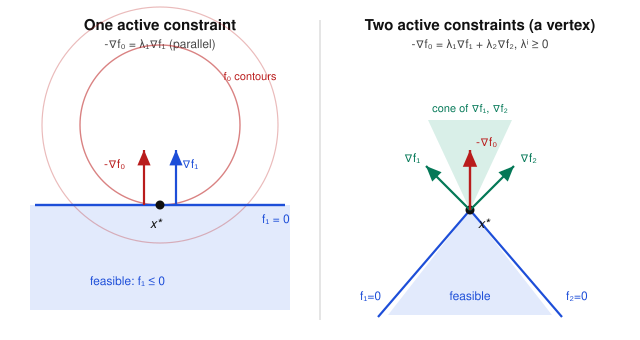

# Convex Optimization · Lesson 3.3: The KKT conditions

> ⏱ ~15 min · Module 3: Duality and the KKT conditions · Builds on: [Lesson 3.2](03-02-strong-duality-slater.md) (strong duality & Slater), [Lesson 3.1](03-01-lagrangian-dual-function.md) (the Lagrangian) · Unlocks: [Lesson 3.4](03-04-geometry-of-duality.md) (the geometry of duality)

## Why this matters

Everything in Module 3 has been building toward a single, portable checklist: a set of equations and inequalities that a point either satisfies or doesn't, and that — for a convex problem — settles the question of optimality completely. That checklist is the **Karush–Kuhn–Tucker (KKT) conditions**. They are the workhorse of applied optimization: you write them down, and either you solve them by hand to get a closed form (water-filling, the SVM, portfolio weights all fall this way), or you hand them to a solver that hunts for a point satisfying them. And their fourth condition, *complementary slackness*, is the exact same accounting rule that runs a consumer's budget in [`grad-micro`](../../grad-micro/syllabus.md) and an equilibrium best-response in [`grad-game-theory`](../../grad-game-theory/syllabus.md): **you only pay for a constraint that actually binds.**

## The idea

Recall the standard-form problem from [Lesson 3.1](03-01-lagrangian-dual-function.md):
$$\min_x\ f_0(x)\quad \text{s.t.}\quad f_i(x)\le 0\ (i=1,\dots,m),\quad h_j(x)=0\ (j=1,\dots,p),$$
with Lagrangian $L(x,\lambda,\nu)=f_0(x)+\sum_i\lambda_i f_i(x)+\sum_j\nu_j h_j(x)$. Here $\lambda_i$ is the *price* on inequality $i$ and $\nu_j$ the price on equality $j$.

At an optimum, four things must be true, and each is common sense once you say it in English:

1. **You've stopped moving.** There's no feasible direction that lowers the objective — the objective's pull is exactly balanced by the constraints pushing back. That's *stationarity of the Lagrangian*.
2. **You're actually allowed to be there.** The point satisfies every constraint — *primal feasibility*.
3. **Prices are nonnegative.** A "$\le$" constraint can only push you *back into* the feasible set, never pull you out, so its price can't be negative — *dual feasibility*, $\lambda\succeq 0$.
4. **You only pay for what binds.** If a constraint has room to spare ($f_i(x)<0$, slack), its price is zero; if you're paying a positive price, the constraint must be tight ($f_i(x)=0$). That's *complementary slackness*.

The picture behind condition 1 is the whole geometry of the lesson: at the optimum, the downhill direction of the objective, $-\nabla f_0$, points *out* of the feasible set — straight into the fence made by the active constraints — and it can be written as a nonnegative mix of the outward normals of exactly those active constraints.

## The formal version

**The KKT conditions.** Let $f_0,f_1,\dots,f_m$ be differentiable and $h_1,\dots,h_p$ differentiable. A point $x^*$ together with multipliers $\lambda^*\in\mathbb{R}^m,\ \nu^*\in\mathbb{R}^p$ is a **KKT point** if:

$$
\begin{aligned}
&\textbf{(1) Stationarity:} && \nabla f_0(x^*)+\sum_{i=1}^m \lambda_i^*\,\nabla f_i(x^*)+\sum_{j=1}^p \nu_j^*\,\nabla h_j(x^*)=0,\\[2pt]
&\textbf{(2) Primal feasibility:} && f_i(x^*)\le 0\ \ \forall i,\qquad h_j(x^*)=0\ \ \forall j,\\[2pt]
&\textbf{(3) Dual feasibility:} && \lambda_i^*\ge 0\ \ \forall i,\\[2pt]
&\textbf{(4) Complementary slackness:} && \lambda_i^*\,f_i(x^*)=0\ \ \forall i.
\end{aligned}
$$

*In words:* (1) the Lagrangian's gradient in $x$ vanishes — the objective and the priced constraints are in a force balance; (2) $x^*$ obeys the constraints; (3) inequality prices are nonnegative; (4) for each $i$, either the price is zero or the constraint is tight (never both nonzero).

Note condition (4) is a *product = 0* statement, so term by term it says: $\lambda_i^*>0 \Rightarrow f_i(x^*)=0$ (a paid-for constraint binds), and $f_i(x^*)<0 \Rightarrow \lambda_i^*=0$ (a slack constraint is free). Equality constraints carry no sign restriction and no slackness condition — their multipliers $\nu_j^*$ are free.

**When do KKT points matter? Two theorems.**

**(A) Necessary at an optimum (any problem, under a constraint qualification).** If $x^*$ is a local optimum of a problem with differentiable data *and* a **constraint qualification** holds at $x^*$ (for convex problems, Slater's condition from [Lesson 3.2](03-02-strong-duality-slater.md) is enough; in general, e.g. the constraint gradients of the active constraints are linearly independent), then there exist $\lambda^*,\nu^*$ making $(x^*,\lambda^*,\nu^*)$ a KKT point. *In words: at any decent optimum, KKT must hold — so KKT is a sieve that catches every candidate.*

**(B) Sufficient — and globally so — for a convex problem.** If the problem is **convex** ($f_0,\dots,f_m$ convex, $h_j$ affine) and $(x^*,\lambda^*,\nu^*)$ is *any* KKT point, then $x^*$ is a **global** minimizer.

Putting (A)+(B) together: **for a convex problem with Slater's condition, KKT is necessary and sufficient.** Solving the KKT system *is* solving the problem — no second-order test, no checking "is this the global one," because for convex problems local means global (that was [Lesson 2.1](02-01-convex-problem-local-global.md)) and KKT is the certificate.

**Proof of (B) — sufficiency.** Suppose the problem is convex and $(x^*,\lambda^*,\nu^*)$ satisfies (1)–(4). Fix the multipliers and look at $L(\,\cdot\,,\lambda^*,\nu^*)$ as a function of $x$:
$$L(x,\lambda^*,\nu^*)=f_0(x)+\sum_i \lambda_i^* f_i(x)+\sum_j \nu_j^* h_j(x).$$
Because $\lambda_i^*\ge 0$ (dual feasibility) and each $f_i$ is convex, each term $\lambda_i^* f_i$ is convex; each $\nu_j^* h_j$ is affine hence convex; $f_0$ is convex. A sum of convex functions is convex, so $L(\,\cdot\,,\lambda^*,\nu^*)$ is **convex in $x$**. Stationarity (1) says its gradient vanishes at $x^*$, and for a convex function a zero-gradient point is a *global* minimizer (the first-order condition, [Lesson 1.3](01-03-convex-functions-epigraph.md)). Hence for every $x$,
$$L(x^*,\lambda^*,\nu^*)\ \le\ L(x,\lambda^*,\nu^*).\tag{$\star$}$$
Now evaluate the left side using slackness. By complementary slackness $\lambda_i^* f_i(x^*)=0$, and by primal feasibility $h_j(x^*)=0$, so all the extra terms drop:
$$L(x^*,\lambda^*,\nu^*)=f_0(x^*).$$
Take any *feasible* $x$ (so $f_i(x)\le 0$ and $h_j(x)=0$). Then $\lambda_i^* f_i(x)\le 0$ (nonneg price times nonpositive constraint) and $\nu_j^* h_j(x)=0$, so
$$L(x,\lambda^*,\nu^*)=f_0(x)+\underbrace{\textstyle\sum_i\lambda_i^* f_i(x)}_{\le 0}+\underbrace{\textstyle\sum_j\nu_j^* h_j(x)}_{=0}\ \le\ f_0(x).$$
Chaining this with $(\star)$: $\ f_0(x^*)=L(x^*,\lambda^*,\nu^*)\le L(x,\lambda^*,\nu^*)\le f_0(x)$. So $f_0(x^*)\le f_0(x)$ for every feasible $x$: $x^*$ is globally optimal. $\blacksquare$

The proof also reveals *why* the pieces are there: dual feasibility makes $L$ convex, stationarity makes $x^*$ minimize it, and complementary slackness is exactly what makes the minimum of $L$ equal the objective $f_0$ (it closes the duality gap — the strong-duality handshake of [Lesson 3.2](03-02-strong-duality-slater.md), now read off pointwise).

## Picture

At the optimum, $-\nabla f_0(x^*)$ — the direction the objective *wants* to go — is a **nonnegative combination of the gradients of the active constraints**. With one active constraint that means $-\nabla f_0$ is parallel to the outward normal $\nabla f_1$ (left); at a vertex where two constraints bind, $-\nabla f_0$ lies inside the *cone* spanned by their normals (right). Stationarity is precisely this gradient-balancing statement.

If $-\nabla f_0$ ever pointed *outside* that cone, you could slide along the fence and decrease $f_0$ — so you wouldn't be at the optimum yet.

## Worked examples

**Example 1 (equality-constrained quadratic — mechanical).** Solve
$$\min_x\ x_1^2+x_2^2\quad\text{s.t.}\quad x_1+x_2=1.$$
This is convex (convex objective, affine constraint), and there are no inequalities, so conditions (3) and (4) are vacuous — only **stationarity** and **primal feasibility** remain. With $h(x)=x_1+x_2-1$ and multiplier $\nu$:
$$\nabla f_0+\nu\nabla h = \begin{pmatrix}2x_1\\ 2x_2\end{pmatrix}+\nu\begin{pmatrix}1\\ 1\end{pmatrix}=0 \ \Rightarrow\ x_1=x_2=-\tfrac{\nu}{2}.$$
Feasibility: $x_1+x_2=1\Rightarrow -\nu=1\Rightarrow \nu^*=-1$, giving $x^*=(\tfrac12,\tfrac12)$, optimal value $p^*=\tfrac12$. Geometrically this is the projection of the origin onto the line $x_1+x_2=1$, and the equality multiplier $\nu^*=-1$ has no sign restriction — equality prices can be negative.

**Example 2 (inequalities — complementary slackness picks the active set).** Solve
$$\min_x\ (x_1-2)^2+(x_2-2)^2\quad\text{s.t.}\quad \underbrace{x_1+2x_2\le 4}_{f_1},\ \ \underbrace{-x_1\le 0}_{f_2}.$$
Convex QP. Gradients: $\nabla f_0=\big(2(x_1-2),\,2(x_2-2)\big)$, $\nabla f_1=(1,2)$, $\nabla f_2=(-1,0)$. The unconstrained minimizer is $(2,2)$; check it against the constraints: $f_1(2,2)=2+4-4=2>0$ (**violated**), $f_2(2,2)=-2<0$ (satisfied with room). So the solution is pushed onto $f_1$, and $f_2$ looks slack. Complementary slackness turns "which constraints are active?" into a small case analysis — here the smart guess is **$f_1$ active, $f_2$ slack**, i.e. $\lambda_2^*=0$ and $f_1(x^*)=0$:

- Stationarity: $\ 2(x_1-2)+\lambda_1(1)+\lambda_2(-1)=0,\quad 2(x_2-2)+\lambda_1(2)=0.$
- Set $\lambda_2=0$: $\ x_1=2-\tfrac{\lambda_1}{2},\quad x_2=2-\lambda_1.$
- $f_1$ binds: $\ x_1+2x_2=4\ \Rightarrow\ (2-\tfrac{\lambda_1}{2})+2(2-\lambda_1)=4\ \Rightarrow\ 6-\tfrac{5}{2}\lambda_1=4\ \Rightarrow\ \lambda_1^*=0.8.$

Then $x^*=(1.6,\,1.2)$. Now **verify the whole checklist**: dual feasibility $\lambda_1^*=0.8\ge0$, $\lambda_2^*=0\ge0$ ✓; primal feasibility $f_1=0$ (tight) and $f_2(x^*)=-1.6<0$ (slack) ✓; complementary slackness $\lambda_1^* f_1=0.8\cdot 0=0$ and $\lambda_2^* f_2=0\cdot(-1.6)=0$ ✓. All four hold, the problem is convex, so by theorem (B) $x^*=(1.6,1.2)$ is the **global** optimum, with $p^*=(1.6-2)^2+(1.2-2)^2=0.16+0.64=0.8$.

Had we instead guessed $f_1$ slack ($\lambda_1=0$), stationarity would force $x=(2,2)$, which violates $f_1$ — **infeasible, rejected.** That failed branch is complementary slackness earning its keep: it told us $f_1$ *had* to bind. (You can confirm $x^*$ is the foot of the perpendicular from $(2,2)$ to the line $x_1+2x_2=4$; the distance is $2/\sqrt5$, and $(2/\sqrt5)^2=0.8=p^*$.)

## Watch out

- **You might think complementary slackness says "either $\lambda_i=0$ or $f_i=0$, but not both."** Actually *both* can be zero at once — a constraint that happens to be exactly tight but carries zero price (a **degenerate** or weakly-active constraint). The condition only forbids both being *nonzero*; the product $\lambda_i^* f_i(x^*)$ must be $0$.
- **You might think a KKT point is automatically optimal.** Only for a **convex** problem (theorem B). For a nonconvex problem KKT points can be local maxima or saddle points — there, KKT is merely *necessary* (theorem A), a filter, not a certificate.
- **Sign and standard form.** Stationarity as written needs constraints in the form $f_i(x)\le 0$ and the *plus* sign in the Lagrangian, and it forces $\lambda\succeq 0$. Writing a constraint as $g(x)\ge 0$ or flipping a sign flips the sign of its multiplier — always convert to standard form first, or you'll get a "negative price" that's really a bookkeeping error.
- **Don't skip the constraint qualification.** Theorem (A) can fail without one: a genuine optimum may admit *no* KKT multipliers if the active-constraint gradients are pathological (e.g. a cusp). Slater rescues every convex problem, which is why we insisted on it in [Lesson 3.2](03-02-strong-duality-slater.md).

## One-liner

> KKT = stationarity + feasibility (primal and dual) + "you only pay for binding constraints" — and for a convex problem, any point that passes this four-part test is globally optimal.

## Problems

**P1 (🟢)** Solve by KKT: $\ \min_x\ x_1^2+x_2^2\ \ \text{s.t.}\ \ x_1+2x_2=4.$ Find $x^*$ and the equality multiplier $\nu^*$, and state which KKT conditions are active (i.e. non-vacuous) here.

**P2 (🟡)** Solve by KKT: $\ \min_x\ (x_1-1)^2+(x_2-1)^2\ \ \text{s.t.}\ \ x_1+x_2\le 1,\ \ x_1\ge 0,\ \ x_2\ge 0.$ Identify $x^*$, all three multipliers, and say for each constraint whether it binds or is slack — and how complementary slackness told you.

**P3 (🔴, optional — the shadow-price bridge)** For the family
$$p^*(b)=\min_x\ (x_1-1)^2+(x_2-1)^2\ \ \text{s.t.}\ \ x_1+x_2\le b\qquad(\text{ignore sign constraints; assume }b\le 2),$$
solve by KKT to get $x^*(b)$ and the multiplier $\lambda_1^*(b)$, then compute $p^*(b)$ explicitly and verify $\dfrac{dp^*}{db}=-\lambda_1^*(b)$. This is the **shadow-price theorem**: the multiplier is minus the sensitivity of the optimal value to relaxing the constraint — the *exact* object a consumer's Lagrange multiplier is in [`grad-micro`](../../grad-micro/syllabus.md) (marginal utility of income) and a firm's is in `grad-game-theory` (the marginal value of an equilibrium resource constraint).

Solutions

**P1** No inequalities, so dual feasibility (3) and complementary slackness (4) are vacuous; only **stationarity** (1) and **primal feasibility** (2) do work. With $h(x)=x_1+2x_2-4$:
$$\begin{pmatrix}2x_1\\ 2x_2\end{pmatrix}+\nu\begin{pmatrix}1\\ 2\end{pmatrix}=0\ \Rightarrow\ x_1=-\tfrac{\nu}{2},\ \ x_2=-\nu.$$
Feasibility: $x_1+2x_2 = -\tfrac{\nu}{2}-2\nu=-\tfrac{5}{2}\nu=4\Rightarrow \nu^*=-\tfrac{8}{5}=-1.6.$ Then $x^*=(0.8,\,1.6)$. Check: $0.8+3.2=4$ ✓. Optimal value $0.8^2+1.6^2=0.64+2.56=3.2$ (the squared distance $=(4/\sqrt5)^2=16/5=3.2$ ✓ — the projection of the origin onto the line).

**P2** Convex QP; unconstrained minimizer is $(1,1)$, which violates $x_1+x_2\le 1$ (gives $2$) but satisfies $x_1,x_2\ge0$. Put the constraints in standard form: $f_1=x_1+x_2-1$, $f_2=-x_1$, $f_3=-x_2$, with gradients $(1,1),(-1,0),(0,-1)$. **Guess** $f_1$ active, $f_2,f_3$ slack, so $\lambda_2^*=\lambda_3^*=0$:
$$2(x_1-1)+\lambda_1=0,\quad 2(x_2-1)+\lambda_1=0\ \Rightarrow\ x_1=x_2=1-\tfrac{\lambda_1}{2}.$$
$f_1$ binds: $x_1+x_2=1\Rightarrow 2(1-\tfrac{\lambda_1}{2})=1\Rightarrow \lambda_1^*=1.$ Then $x^*=(\tfrac12,\tfrac12)$, value $2\cdot(\tfrac12-1)^2=0.5$. **Checklist:** $\lambda_1^*=1\ge0$ ✓; $f_2(x^*)=-\tfrac12<0$ and $f_3(x^*)=-\tfrac12<0$, both slack, consistent with $\lambda_2^*=\lambda_3^*=0$ ✓; $\lambda_1^* f_1=1\cdot0=0$ ✓. All KKT hold, problem convex ⇒ global optimum. Reading of complementary slackness: the budget line $x_1+x_2\le1$ **binds** (positive price $\lambda_1^*=1$), while the two nonnegativity constraints are **slack** (zero price) — we don't "pay" for constraints we're strictly inside of, so setting their multipliers to zero was forced.

**P3** For $b\le 2$ the target $(1,1)$ is infeasible, so $f_1=x_1+x_2-b$ binds. With $\lambda_1$: stationarity $2(x_1-1)+\lambda_1=0$, $2(x_2-1)+\lambda_1=0\Rightarrow x_1=x_2=1-\tfrac{\lambda_1}{2}$. Binding: $x_1+x_2=b\Rightarrow 2(1-\tfrac{\lambda_1}{2})=b\Rightarrow \lambda_1^*(b)=2-b\ (\ge0$ since $b\le2$, so dual feasibility holds ✓). Thus $x^*(b)=(\tfrac{b}{2},\tfrac{b}{2})$ and
$$p^*(b)=2\left(\tfrac{b}{2}-1\right)^2=\tfrac12(b-2)^2.$$
Differentiate: $\dfrac{dp^*}{db}=\tfrac12\cdot 2(b-2)=b-2=-(2-b)=-\lambda_1^*(b).$ ✓ So $\dfrac{dp^*}{db}=-\lambda_1^*$: loosening the constraint by $db$ *lowers* the optimal cost at rate $\lambda_1^*$. (Sanity: at $b=2$ the constraint stops binding, $\lambda_1^*=0$, and indeed $p^*=0$ flat — a free constraint has zero shadow price, complementary slackness again.) This is exactly the marginal-utility-of-income reading of the multiplier in `grad-micro`.

## Flashback

**From [Lesson 3.2](03-02-strong-duality-slater.md) (strong duality & Slater):** Consider
$$\min_x\ x_1^2+x_2^2\quad\text{s.t.}\quad x_1+x_2\ge 1,\qquad x_1^2+(x_2-1)^2\le 1.$$
(a) Is this a convex problem? (b) Does **Slater's condition** hold — is there a *strictly* feasible point? (c) What does that let you conclude about the duality gap?

Solution

(a) **Yes.** The objective $x_1^2+x_2^2$ is convex. Rewrite the constraints in standard form: $f_1(x)=1-x_1-x_2\le0$ is affine (hence convex), and $f_2(x)=x_1^2+(x_2-1)^2-1\le0$ is convex (a shifted squared norm). Convex objective, convex inequality constraints, no equality constraints ⇒ convex problem.

(b) **Yes.** Slater asks for a point that satisfies every inequality *strictly*. Try $x=(0.4,\,0.9)$: $x_1+x_2=1.3>1$ so $f_1=-0.3<0$ strictly ✓; and $x_1^2+(x_2-1)^2=0.16+0.01=0.17<1$ so $f_2=-0.83<0$ strictly ✓. A strictly feasible point exists, so Slater holds. (Since $f_1$ is affine, it would have sufficed to satisfy it non-strictly, but here we get strictness for free.)

(c) By **Slater's theorem** (Lesson 3.2), for a convex problem a strictly feasible point guarantees **strong duality**: the optimal duality gap is **zero**, $p^*=d^*$, and the dual optimum is attained. Consequently — jumping ahead to this lesson — a KKT point exists and solving the KKT system will recover the global optimum.

## Connections

- **Backward:** KKT is the pointwise face of [Lesson 3.2](03-02-strong-duality-slater.md)'s strong duality — complementary slackness is precisely what makes $\min_x L(x,\lambda^*,\nu^*)$ equal $f_0(x^*)$, closing the gap. Stationarity reuses the first-order condition for convex functions from [Lesson 1.3](01-03-convex-functions-epigraph.md), and "local ⇒ global" from [Lesson 2.1](02-01-convex-problem-local-global.md) is what upgrades a KKT point to a global optimum.
- **Forward:** [Lesson 3.4](03-04-geometry-of-duality.md) redraws stationarity as a *supporting hyperplane* and extends KKT to nonsmooth objectives via subgradients (the optimality condition $0\in\partial f_0(x^*)+\dots$). The whole Module-3 machinery then gets *used*: [Lesson 5.2](05-02-support-vector-machines.md) derives the SVM by passing to the KKT/dual and reading off support vectors from complementary slackness, and the Module-3 boss problem (water-filling) is pure KKT.
- **Sideways (economics & game theory):** the multiplier $\lambda_i^*$ is a **shadow price** — P3 proves $\lambda_i^*=-\,dp^*/db_i$, which is the marginal utility of income in [`grad-micro`](../../grad-micro/syllabus.md)'s constrained consumer problem. Complementary slackness — *pay only for binding constraints* — is the same logic as an equilibrium best-response leaving unused strategies unpriced in [`grad-game-theory`](../../grad-game-theory/syllabus.md).
