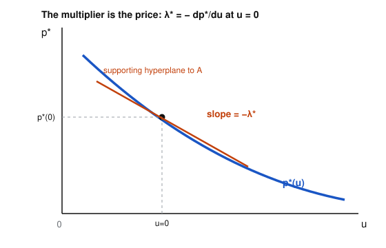

# Convex Optimization · Lesson 3.4: The geometry of duality: hyperplanes, subgradients, shadow prices

> ⏱ ~15 min · Module 3: Duality and the KKT conditions · Builds on: [3.3 KKT conditions](03-03-kkt-conditions.md), [3.2 strong duality & Slater](03-02-strong-duality-slater.md) · Unlocks: [4.1 first-order methods](04-01-first-order-methods.md)

## Why this matters

Lesson 3.3 handed you KKT as a system of equations to solve. This lesson tells you what those equations *mean*. Three payoffs. First, you'll *see* the dual: the best multiplier is the slope of a supporting hyperplane, so weak duality, strong duality, and the duality gap become one picture. Second, you'll learn to optimize functions with corners — $|x|$, $\max_i x_i$, the lasso penalty — where "$\nabla f = 0$" is meaningless but a **subgradient** condition takes over. Third, and most useful across every applied field: a Lagrange multiplier is a **price**. It measures exactly how much the optimal value moves when you loosen a constraint by one unit — the marginal cost of a resource. That single fact is the bridge from this course to the constrained consumer problem of [`grad-micro`](../../grad-micro/syllabus.md).

## The idea

**A multiplier is a price.** Imagine minimizing cost subject to "produce at least $q$ units." Solve it, then bump the requirement to $q+1$ and re-solve. The optimal cost goes up by some amount — call it the *marginal cost of one more unit*. That number is the Lagrange multiplier on the constraint. If a constraint doesn't bind (you were already producing more than required), loosening it changes nothing, so its price is zero — that is exactly complementary slackness, read as economics.

**Duality is a supporting hyperplane.** Plot the achievable pairs (how much constraint you use, what objective you get). Convexity makes the lower boundary of this region a convex curve. A dual variable $\lambda$ picks a line of slope $-\lambda$ and slides it up from below until it just touches the region: the height where it touches is the dual bound $g(\lambda)$. The *best* line touches right under the optimum — and when the region has no downward "notch" there (a convexity + Slater guarantee), it touches at exactly $p^*$: **zero gap**. The gap in [3.1](03-01-lagrangian-dual-function.md)–[3.2](03-02-strong-duality-slater.md) was the vertical distance between the best supporting line and the optimum.

**Corners need a fan, not a tangent.** A smooth convex function has one tangent line at each point, and the minimum is where that tangent is flat. At a corner like the bottom of the "V" $f(x)=|x|$ there is no single tangent — instead a whole *fan* of lines through the vertex, each lying below the graph. Any one of their slopes is a **subgradient**. The point is a minimum precisely when the flat line (slope $0$) fits inside the fan.

## The formal version

**Subgradient.** For a convex $f$, a vector $g$ is a **subgradient** of $f$ at $x$ if
$$f(y) \ \ge\ f(x) + g^\top (y - x) \qquad \text{for all } y.$$
The set of all such $g$ is the **subdifferential** $\partial f(x)$ — a closed convex set.

*In words:* $g$ is a subgradient if the line (hyperplane) through $(x,f(x))$ with slope $g$ stays below the whole graph. It is the first-order convexity inequality from [1.3](01-03-convex-functions-epigraph.md), but now $g$ need not be a gradient.

At a point where $f$ is differentiable, the only line that stays below is the tangent, so $\partial f(x) = \{\nabla f(x)\}$ — a single point. At a corner, $\partial f(x)$ is a whole interval (or set).

**Nonsmooth optimality condition.**
$$x^* \ \text{minimizes convex } f \quad\Longleftrightarrow\quad 0 \in \partial f(x^*).$$

*In words:* $x^*$ is a global minimum exactly when the flat hyperplane is one of the supporting hyperplanes at $x^*$. (Proof is one line: $0\in\partial f(x^*)$ means $f(y)\ge f(x^*)+0=f(x^*)$ for all $y$.) This generalizes "$\nabla f(x^*)=0$" to functions with kinks, and it is the true stationarity condition hiding inside KKT.

**The perturbation function and the sensitivity theorem.** Take the standard problem and perturb each inequality constraint's right-hand side by $u_i$:
$$p^*(u) \ =\ \inf_x \ \{\, f_0(x) \ :\ f_i(x) \le u_i,\ \ h_j(x)=0 \,\}.$$
So $u_i > 0$ *loosens* constraint $i$; $u=0$ is the original problem, $p^*(0)=p^*$. For a convex problem $p^*$ is a convex function of $u$. Let $\lambda^* \succeq 0$ be an optimal dual (a KKT multiplier). Then two facts, one always true and one needing smoothness:

- **Global lower bound (from weak duality, always):** $\;p^*(u) \ \ge\ p^*(0) - \lambda^{*\top} u.$
- **Local rate (if strong duality holds and $p^*$ is differentiable at $0$):**
$$\boxed{\ \lambda_i^* \ =\ -\,\frac{\partial p^*}{\partial u_i}\bigg|_{u=0}\ }$$

*In words:* $\lambda_i^*$ is the rate at which the optimal value *drops* as you relax constraint $i$ — its **shadow price**. A binding constraint has a positive price; complementary slackness ($\lambda_i^*=0$ when $f_i(x^*)<0$) says a slack constraint is free, because loosening something that wasn't binding buys you nothing. The bound line $p^*(0)-\lambda^{*\top}u$ is exactly the supporting hyperplane to the achievable set — duality and sensitivity are the same geometry.

## Picture

![Subdifferential of |x|: a fan of supporting lines with slopes in [-1,1] at the kink](assets/03-04-fig1.svg)

The V $f(x)=|x|$ (blue). Away from $0$ there is one supporting line (slope $+1$ right, $-1$ left) — the ordinary derivative. At the kink, *every* slope in $[-1,1]$ gives a line that stays below the graph, so $\partial f(0)=[-1,1]$. The flat line (green, slope $0$) is in that fan, so $0\in\partial f(0)$ and $x=0$ is the minimum.

The optimal value $p^*(u)$ as you loosen the constraint (right) or tighten it (left). It is convex, and its tangent at $u=0$ has slope $-\lambda^*$ — the supporting hyperplane, whose slope is the shadow price.

## Worked examples

**Example 1 (mechanical: a corner minimum via $0\in\partial f$).** Minimize the convex function
$$f(x) = |x-1| + |x-2| + |x-4|, \qquad x\in\mathbb{R}.$$
Each absolute value contributes $+1$ to the slope when its inside is positive, $-1$ when negative, and $[-1,1]$ at its own kink. Build $\partial f$ piecewise. On $(2,4)$: the first two terms give $+1,+1$ and the third gives $-1$, so $f'=+1>0$ — increasing. On $(1,2)$: $+1,-1,-1$, so $f'=-1<0$ — decreasing. The function turns around at $x=2$. Check the corner:
$$\partial f(2) = \underbrace{(+1)}_{|x-1|} + \underbrace{[-1,1]}_{|x-2|} + \underbrace{(-1)}_{|x-4|} = [-1,1] \ni 0.$$
So $0\in\partial f(2)$ and $x^*=2$ — the **median** of $\{1,2,4\}$ — is the minimizer, with $f(2)=1+0+2=3$. No derivative is ever zero here; the minimum lives at a kink, and only the subgradient condition detects it.

**Example 2 (a shadow price as the cost of a resource).** A firm meets a demand $d$ using two plants at cost $f_0(x)=x_1^2 + 2x_2^2$, subject to $x_1 + x_2 \ge d$ with $d=6$. Write the inequality as $f_1(x)=d-x_1-x_2\le 0$ and form the Lagrangian $L = x_1^2+2x_2^2 + \lambda(d-x_1-x_2)$. Stationarity: $2x_1=\lambda$ and $4x_2=\lambda$, so $x_1=\lambda/2,\ x_2=\lambda/4$. The constraint binds (cost pushes you to the boundary), so $x_1+x_2=d$ gives $\tfrac{3\lambda}{4}=d$, hence
$$\lambda^* = \tfrac{4}{3}d = 8, \qquad x^*=(4,2), \qquad p^*=16+2(4)=24.$$
Now read $\lambda^*$ as a price. The optimal value as a function of demand is $p^*(d)=\tfrac{2}{3}d^2$ (substitute $\lambda=\tfrac43 d$ into the cost), so $\frac{dp^*}{dd}=\tfrac43 d = 8 = \lambda^*$: the marginal cost of one more unit of demand is exactly the multiplier. Predict the cost at $d=6.2$: $\;p^*\approx 24 + \lambda^*(0.2) = 24 + 1.6 = 25.6$. Exact: $\tfrac23(6.2)^2 = 25.63$ — the linear price estimate is right to first order. And in the loosening convention $f_1\le u$ (allow the shortfall $d-x_1-x_2\le u$): $p^*(u)=\tfrac23(d-u)^2$, so $\left.\partial p^*/\partial u\right|_{0}=-\tfrac43 d=-\lambda^*$, matching the boxed theorem.

## Watch out

- **A subgradient is a set element, not "the gradient."** You might say "let $g=\nabla f$" at a kink, but $\nabla f$ doesn't exist there. Write $g\in\partial f(x)$, and remember $\partial f(x)$ collapses to the single point $\{\nabla f(x)\}$ only where $f$ is differentiable.
- **The optimality test is $0\in\partial f(x^*)$, not $\nabla f(x^*)=0$.** A corner can be a minimum precisely because the flat line fits inside its fan of supporting slopes. Insisting on a zero gradient would miss every $\ell_1$-type solution — including the lasso's sparsity in [5.1](05-01-least-squares-lasso.md).
- **Sensitivity needs strong duality *and* differentiability of $p^*$.** With those, $\lambda_i^*=-\partial p^*/\partial u_i$. Without differentiability (a kink in $p^*$, e.g. a degenerate LP) you get only the one-sided bound $p^*(u)\ge p^*(0)-\lambda^{*\top}u$, and left/right marginal prices can differ. Mind the sign, too: $\lambda_i^*\ge 0$ because loosening a constraint can only *help* (lower $p^*$).

## One-liner

> A multiplier is a price and "$0\in\partial f$" is "the flat line fits in the fan" — duality and sensitivity are one supporting hyperplane, seen from two sides.

## Problems

**P1 (🟢)** Let $f(x)=|x+1| + |x-2|$ on $\mathbb{R}$. (a) Compute $\partial f(x)$ on each of the regions $x<-1$, $-1<x<2$, $x>2$, and at the two kinks $x=-1,\,x=2$. (b) Using $0\in\partial f$, find the *complete* set of minimizers and the minimum value.

**P2 (🟡)** A firm minimizes cost $C(x)=x_1^2 + 2x_2^2$ subject to the output requirement $x_1 + x_2 \ge q$ with $q=6$. (a) Solve via KKT for $x^*$ and the multiplier $\lambda^*$. (b) Interpret $\lambda^*$ as a shadow price and estimate the cost if the requirement rises to $q=6.2$. (c) Verify against an exact re-solve. *(This is the marginal-cost / shadow-price reasoning that reappears as the Lagrange multiplier on the budget constraint in [`grad-micro`](../../grad-micro/syllabus.md).)*

**P3 (🔴, optional)** Prove the global sensitivity bound. With $\lambda^*\succeq 0,\ \nu^*$ an optimal dual and *strong duality* holding for the unperturbed problem, show $p^*(u)\ge p^*(0)-\lambda^{*\top}u$ for every $u$. Then conclude that if $p^*$ is differentiable at $u=0$, $\ \partial p^*/\partial u_i = -\lambda_i^*$.

Solutions

**P1** (a) Each term contributes $+1$ (inside $>0$), $-1$ (inside $<0$), or $[-1,1]$ (at its kink).
- $x<-1$: both insides negative $\Rightarrow \partial f = -1 + (-1) = \{-2\}$.
- $-1<x<2$: $|x+1|$ gives $+1$, $|x-2|$ gives $-1$ $\Rightarrow \partial f = \{0\}$.
- $x>2$: both positive $\Rightarrow \partial f = \{+2\}$.
- $x=-1$: $\partial f = [-1,1] + (-1) = [-2,0]$.
- $x=2$: $\partial f = (+1) + [-1,1] = [0,2]$.

(b) $0\in\partial f(x)$ holds throughout $-1\le x\le 2$: on the open interval $\partial f=\{0\}$, and at both endpoints $0$ lies in $[-2,0]$ and $[0,2]$ respectively. So the minimizer set is the whole interval $[-1,2]$ (the function is flat there), with minimum value $f(x)=(x+1)+(2-x)=3$ for any such $x$. A convex minimum need not be a single point.

**P2** (a) $L = x_1^2 + 2x_2^2 + \lambda(q - x_1 - x_2)$. Stationarity: $2x_1=\lambda,\ 4x_2=\lambda\Rightarrow x_1=\lambda/2,\ x_2=\lambda/4$. Cost forces the constraint to bind, so $x_1+x_2=q$: $\tfrac{3\lambda}{4}=q\Rightarrow \lambda^*=\tfrac{4}{3}q=8$, giving $x^*=(4,2)$ and $C^*=16+2(4)=24$. Dual feasibility $\lambda^*=8\ge0$ ✓, complementary slackness holds since the constraint is active.

(b) $\lambda^*=8$ is the marginal cost of one unit of required output. Raising $q$ by $0.2$: $C^*\approx 24 + 8(0.2) = 25.6$.

(c) In closed form $C^*(q)=\tfrac{2}{3}q^2$ (plug $\lambda=\tfrac43 q$ into $x_1^2+2x_2^2 = \tfrac{\lambda^2}{4}+\tfrac{\lambda^2}{8}=\tfrac{3\lambda^2}{8}=\tfrac{3}{8}\cdot\tfrac{16}{9}q^2$). At $q=6.2$: $\tfrac{2}{3}(6.2)^2=\tfrac{2}{3}(38.44)=25.63$. The linear estimate $25.6$ matches to first order; the extra $0.03$ is the curvature of $C^*(q)$.

**P3** For any $x$ feasible for the *perturbed* problem (so $f_i(x)\le u_i$ and $h_j(x)=0$), use $\lambda^*\succeq 0$:
$$f_0(x) \ \ge\ f_0(x) + \sum_i \lambda_i^*\big(f_i(x)-u_i\big) + \sum_j \nu_j^* h_j(x) \ =\ L(x,\lambda^*,\nu^*) - \lambda^{*\top}u.$$
The inequality holds because each added term is $\le 0$: $\lambda_i^*\ge0$ and $f_i(x)-u_i\le 0$, while $h_j(x)=0$. Now bound the Lagrangian below by the dual function and use strong duality on the *unperturbed* problem, $g(\lambda^*,\nu^*)=p^*(0)$:
$$f_0(x) \ \ge\ \inf_z L(z,\lambda^*,\nu^*) - \lambda^{*\top}u \ =\ g(\lambda^*,\nu^*) - \lambda^{*\top}u \ =\ p^*(0) - \lambda^{*\top}u.$$
Taking the infimum over all feasible $x$ gives $p^*(u)\ge p^*(0)-\lambda^{*\top}u$ for every $u$.

Conclusion: the affine function $u\mapsto p^*(0)-\lambda^{*\top}u$ lies below the convex $p^*$ and touches it at $u=0$ (equality there, by strong duality). So $-\lambda^*$ is a subgradient of $p^*$ at $0$: $-\lambda^*\in\partial p^*(0)$. If $p^*$ is differentiable at $0$, the subdifferential is the single point $\{\nabla p^*(0)\}$, so $\nabla p^*(0)=-\lambda^*$, i.e. $\partial p^*/\partial u_i=-\lambda_i^*$. $\blacksquare$

## Flashback

**From Lesson 3.3 (the KKT conditions):** Solve, by KKT, the convex program
$$\min_{x\in\mathbb{R}^2}\ (x_1-1)^2 + (x_2-2)^2 \quad \text{subject to}\quad x_1+x_2\le 1,\ \ x_2\ge 0.$$
Find $x^*$ and both multipliers, and use complementary slackness to say which constraint is binding and which is free.

Solution

The unconstrained minimizer is $(1,2)$, which violates $x_1+x_2\le1$ ($1+2=3$), so that constraint should bind; and $x_2=2>0$ suggests $x_2\ge0$ stays slack. Write both as $\le 0$: $f_1=x_1+x_2-1$, $f_2=-x_2$, with multipliers $\lambda_1,\lambda_2\ge0$. Lagrangian:
$$L=(x_1-1)^2+(x_2-2)^2+\lambda_1(x_1+x_2-1)+\lambda_2(-x_2).$$
Stationarity: $2(x_1-1)+\lambda_1=0$ and $2(x_2-2)+\lambda_1-\lambda_2=0$. Guess constraint 2 slack, so complementary slackness gives $\lambda_2=0$; constraint 1 binding, so $x_1+x_2=1$.
From stationarity: $x_1=1-\tfrac{\lambda_1}{2}$, $x_2=2-\tfrac{\lambda_1}{2}$. Sum $=3-\lambda_1=1\Rightarrow \lambda_1=2$. Then $x^*=(0,1)$, $\lambda_1^*=2,\ \lambda_2^*=0$.

Check all KKT conditions: primal feasibility $0+1=1\le1$ ✓ and $x_2=1\ge0$ ✓; dual feasibility $\lambda_1^*=2\ge0,\ \lambda_2^*=0\ge0$ ✓; complementary slackness $\lambda_1^*(x_1+x_2-1)=2\cdot0=0$ ✓ and $\lambda_2^*(-x_2)=0\cdot(-1)=0$ ✓. Because the problem is convex, KKT is sufficient, so $x^*=(0,1)$ is the global minimizer, with value $(0-1)^2+(1-2)^2=2$. Reading the prices: constraint 1 binds and carries a positive shadow price $\lambda_1^*=2$; constraint 2 is free ($\lambda_2^*=0$), so relaxing $x_2\ge0$ would not change the optimum.

## Connections

- **Backward:** the subgradient inequality is the first-order convexity condition from [1.3](01-03-convex-functions-epigraph.md) with the gradient replaced by a set; the supporting-hyperplane reading of the dual is the separating/supporting-hyperplane theorem of [1.1](01-01-convex-sets-separating-hyperplane.md) applied to the achievable set, and it makes the strong-duality picture of [3.2](03-02-strong-duality-slater.md) precise.
- **Forward:** subgradients are the engine of subgradient descent in [4.1](04-01-first-order-methods.md) (how to move downhill when $\nabla f$ doesn't exist), and the $0\in\partial f$ condition is what makes the lasso produce exactly-zero coefficients in [5.1](05-01-least-squares-lasso.md).
- **Sideways (economics):** the shadow price $\lambda_i^*=-\partial p^*/\partial u_i$ is *literally* the Lagrange multiplier on the budget constraint in [`grad-micro`](../../grad-micro/syllabus.md)'s constrained consumer problem — the marginal utility of income — and the same object appears as the price that clears a best-response/equilibrium condition in [`grad-game-theory`](../../grad-game-theory/syllabus.md). Complementary slackness is the economics statement "you only pay for a resource that is scarce."
