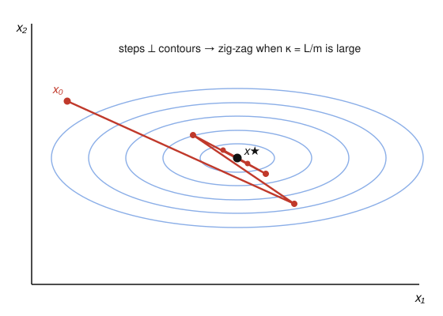

# Convex Optimization · Lesson 4.1: First-order methods — gradient and subgradient descent

> ⏱ ~15 min · Module 4: Algorithms, from first-order to interior-point · Builds on: [convex functions & the first-order condition (1.3)](01-03-convex-functions-epigraph.md), [subgradients (3.4)](03-04-geometry-of-duality.md) · Unlocks: [Newton's method (4.2)](04-02-newtons-method.md)

## Why this matters

Modules 1–3 told you *which* problems are solvable in principle and *what* the solution must satisfy (KKT). This module is about actually computing it. The cheapest, most general idea in all of optimization is: stand where you are, look downhill, take a step. That single reflex — gradient descent — trains most of modern machine learning, and its nonsmooth cousin (the subgradient method) is what you reach for the moment a kink appears, as it does in the lasso and the SVM you'll meet in Module 5. The catch is that "how well does a step downhill work" has a sharp, quantitative answer, and that answer is governed by one number: the condition number.

## The idea

Imagine standing on a hillside in fog. You can't see the valley floor, but you can feel the slope under your feet. The steepest-descent instinct is to walk directly downhill — opposite the gradient — for a bit, stop, refeel the slope, and repeat. That is **gradient descent**, verbatim.

Two things can go wrong, and both are geometric. First, *how far* do you step? Too short and you crawl; too long and you overshoot and climb the far wall. Second — and this is the deep one — if the valley is a long narrow trough rather than a round bowl, the downhill direction points mostly *across* the trough, not *along* it toward the bottom. So you ricochet from wall to wall, inching down the length of the valley: the famous **zig-zag**. How stretched the trough is *is* the condition number $\kappa$, and it is exactly what sets your speed.

And when the landscape has a sharp crease — a fold where the slope is undefined, like the point of the function $|x|$ — the gradient doesn't exist. The fix is to use *any* supporting slope at the crease (a **subgradient**) and step along it. It still works, but it's slower and, strikingly, it isn't even guaranteed to go downhill on any single step.

## The formal version

We minimize a convex, differentiable $f:\mathbb{R}^n\to\mathbb{R}$ with optimal value $p^* = \min_x f(x)$.

**Gradient descent.** Pick a start $x_0$ and iterate
$$x_{k+1} = x_k - t_k\,\nabla f(x_k),$$
where $t_k>0$ is the **step size** (or learning rate) at iteration $k$.

*In words:* move from $x_k$ a distance $t_k\lVert\nabla f(x_k)\rVert_2$ in the steepest-descent direction $-\nabla f(x_k)$.

**Three ways to choose the step.**
- **Fixed:** $t_k = t$, one constant for all $k$. Simplest; needs $t$ small enough (below) to be safe.
- **Exact line search:** $t_k = \operatorname{argmin}_{t\ge 0} f\big(x_k - t\,\nabla f(x_k)\big)$ — walk downhill until $f$ stops decreasing along the ray. Optimal per step, rarely cheap.
- **Backtracking (Armijo):** fix parameters $\alpha\in(0,\tfrac12)$, $\beta\in(0,1)$. Start $t=1$; while
$$f\big(x_k - t\nabla f(x_k)\big) > f(x_k) - \alpha\,t\,\lVert\nabla f(x_k)\rVert_2^2,\qquad\text{set } t\leftarrow\beta t.$$
*In words:* keep halving-ish the step until it buys at least an $\alpha$-fraction of the decrease the slope promised. Cheap and robust — the practical default.

**What makes a fixed step safe.** Call $f$ **$L$-smooth** if $\nabla f$ is $L$-Lipschitz, $\lVert\nabla f(x)-\nabla f(y)\rVert_2\le L\lVert x-y\rVert_2$ (equivalently $\nabla^2 f\preceq LI$ when twice differentiable). Then the *descent lemma* gives, for any step $t$,
$$f\big(x - t\nabla f(x)\big)\le f(x) - t\Big(1-\tfrac{Lt}{2}\Big)\lVert\nabla f(x)\rVert_2^2 .$$
Taking $t=1/L$ yields a guaranteed drop $f(x^+)\le f(x)-\frac{1}{2L}\lVert\nabla f(x)\rVert_2^2$. *In words:* if you never step longer than $1/L$, every iteration strictly decreases $f$ until the gradient vanishes.

**Convergence and the condition number.** Add strong convexity: $f$ is **$m$-strongly convex** if $f(y)\ge f(x)+\nabla f(x)^\top(y-x)+\tfrac{m}{2}\lVert y-x\rVert_2^2$ for all $x,y$ (equivalently $\nabla^2 f\succeq mI$). With both $mI\preceq\nabla^2 f\preceq LI$, define the **condition number**
$$\kappa = \frac{L}{m}\ \ge 1 .$$
Gradient descent with a fixed step $t=1/L$ (or with exact line search / backtracking) converges **linearly**:
$$f(x_k)-p^* \;\le\; c^k\,\big(f(x_0)-p^*\big),\qquad c = 1-\tfrac{1}{\kappa}\in[0,1).$$
*In words:* the error shrinks by a constant factor every step — geometric decay — but the factor $c=1-1/\kappa$ crawls toward $1$ as the problem gets ill-conditioned. To cut the error by $10^{-6}$ takes on the order of $\kappa\log(1/\epsilon)$ steps: **iteration count scales linearly with $\kappa$.** A round bowl ($\kappa=1$) converges in essentially one step; a stretched trough ($\kappa=10^4$) needs tens of thousands.

Without strong convexity (merely convex and $L$-smooth) the rate degrades to $f(x_k)-p^*=O(1/k)$ — still respectable.

**The subgradient method (nonsmooth $f$).** If $f$ is convex but not differentiable, replace $\nabla f(x_k)$ by any **subgradient** $g_k\in\partial f(x_k)$, i.e. any $g_k$ with $f(y)\ge f(x_k)+g_k^\top(y-x_k)$ for all $y$ (from Lesson 3.4):
$$x_{k+1} = x_k - t_k\,g_k,\qquad g_k\in\partial f(x_k).$$
Two things change, and both hurt:
- **It is not a descent method.** A subgradient step can *increase* $f$. So you must track the running best, $f_{\text{best},k}=\min_{i\le k} f(x_i)$, not the last value.
- **Diminishing steps and a slow rate.** With a fixed step it oscillates forever near the optimum; convergence needs $t_k\to 0$ while $\sum_k t_k=\infty$ (e.g. $t_k = 1/k$). For $f$ that is $G$-Lipschitz ($\lVert g\rVert_2\le G$) with $\lVert x_0-x^*\rVert_2\le R$, the best choice gives
$$f_{\text{best},k}-p^* \;=\; O\!\Big(\tfrac{RG}{\sqrt{k}}\Big) = O\!\Big(\tfrac{1}{\sqrt{k}}\Big).$$
*In words:* reaching accuracy $\epsilon$ costs on the order of $1/\epsilon^2$ iterations — vastly slower than the $\log(1/\epsilon)$ of smooth strongly convex GD. Nonsmoothness is expensive; that's why Module 4 will keep hunting for structure to exploit.

## Picture

The concentric ellipses are level sets of an ill-conditioned quadratic — a long narrow valley. Each gradient step is perpendicular to the contour it starts on, so it aims *across* the valley, not along it. The result is the red staircase: big sideways swings, tiny progress toward $x^\star$. Stretch the ellipses more (raise $\kappa$) and the zig-zag gets tighter and slower; make them circular ($\kappa=1$) and a single step lands on $x^\star$.

## Worked examples

**Example 1 (mechanical — GD on a quadratic, and the rate as a function of $\kappa$).**
Take $f(x)=\tfrac12 x^\top Q x$ with $Q=\operatorname{diag}(1,10)$, so $\nabla f(x)=Qx$, minimizer $x^\star=0$, $p^*=0$. The eigenvalues of the Hessian are $m=1$ and $L=10$, so $\kappa=10$. Use the safe fixed step $t=1/L=0.1$. The iteration is linear:
$$x_{k+1}=x_k-tQx_k=(I-tQ)x_k,\qquad I-tQ=\operatorname{diag}(1-0.1,\,1-1)=\operatorname{diag}(0.9,\,0).$$
Start $x_0=(1,1)$:
$$x_1=(0.9,\,0),\qquad x_2=(0.81,\,0).$$
Watch what happened: the *stiff* coordinate (eigenvalue $L=10$) is annihilated in one step — because $t=1/L$ zeroes that mode exactly — while the *soft* coordinate (eigenvalue $m=1$) only contracts by $1-t m = 1-1/\kappa = 0.9$ per step. Objective values:
$$f(x_0)=\tfrac12(1+10)=5.5,\quad f(x_1)=\tfrac12(0.81)=0.405,\quad f(x_2)=\tfrac12(0.6561)=0.328.$$
From $x_1$ on, each step multiplies $f$ by $(0.9)^2=0.81$: the asymptotic per-step factor is $(1-1/\kappa)^2$, and the guarantee $f(x_k)-p^*\le(1-1/\kappa)^k(f_0-p^*)=0.9^k\cdot 5.5$ holds with room to spare. The lesson: the *soft* direction, contracting at rate $1-1/\kappa$, is the bottleneck — the bigger $\kappa$, the closer that factor sits to $1$ and the slower you crawl along the valley floor.

**Example 2 (why you'd care — a subgradient step need not go downhill).**
Minimize the nonsmooth $f(x)=|x|$ on $\mathbb{R}$, with $x^\star=0$. For $x>0$ the only subgradient is $g=+1$; for $x<0$, $g=-1$; at the kink $x=0$, $\partial f(0)=[-1,1]$. Run the subgradient method from $x_0=1$ with a **fixed** step $t=0.7$:
$$x_1 = 1-0.7(+1)=0.3,\qquad x_2 = 0.3-0.7(+1)=-0.4,\qquad x_3=-0.4-0.7(-1)=0.3,\ \dots$$
The objective goes $1\to 0.3\to 0.4\to 0.3\to 0.4\to\cdots$. The step from $x_1$ to $x_2$ **increased** $f$ (from $0.3$ to $0.4$): the step overshot the kink. With a fixed step it now oscillates in $[-0.4,0.3]$ forever — best-so-far stuck at $0.3$. The remedy is diminishing steps, say $t_k=0.7/(k+1)$: the swings shrink to zero and $f_{\text{best},k}\to 0$, but only at the sluggish $O(1/\sqrt k)$ pace. This exact pattern — a kink at the optimum, no true gradient — is what the $\ell_1$ penalty of the [lasso (5.1)](05-01-least-squares-lasso.md) creates, and why plain subgradient methods, or smarter proximal methods, show up there.

## Watch out

- **You might think a bigger step is always faster — but past $t=2/L$ gradient descent *diverges*** on a quadratic: the mode with eigenvalue $L$ has multiplier $|1-tL|>1$ and blows up. Fixed steps live in $(0,2/L)$; safety is $t\le 1/L$.
- **You might think the subgradient method is just "gradient descent with $g$ instead of $\nabla f$" — but it loses the descent property.** Never test convergence by "did $f$ drop this step"; track $f_{\text{best}}$, and never use a fixed step if you want the true optimum.
- **You might read the star as $\nabla f=0$ and stop — but that's only for smooth $f$.** At a kink the optimality condition is $0\in\partial f(x^\star)$ (the subgradient *set* straddles zero), not $\nabla f(x^\star)=0$. And $\kappa$ is a property of $f$, not of your algorithm — no step-size rule can make first-order descent beat the $\kappa$-dependent rate; only using curvature can, which is exactly [Newton's method (4.2)](04-02-newtons-method.md).

## One-liner

> Walk downhill by the gradient (or any subgradient at a kink); how fast you arrive is set by the condition number $\kappa=L/m$ — round bowls are instant, stretched troughs zig-zag.

## Problems

**P1 (🟢)** Let $f(x)=\tfrac12 x^\top Q x$ with $Q=\operatorname{diag}(1,4)$, minimizer $x^\star=0$. (a) Identify $m$, $L$, and $\kappa$. (b) Run one step of gradient descent with fixed step $t=1/L$ from $x_0=(2,1)$, giving $x_1$ and $x_2$. (c) State the asymptotic per-step contraction factor of $f$ and explain in one sentence which coordinate is the bottleneck.

**P2 (🟡, connects to Module 5)** Let $f(x)=\max\{\,2x_1-x_2,\ \ x_1+x_2\,\}$, a convex nonsmooth function (max of two affines). (a) At $x=(1,1)$, decide which piece is active and give a subgradient $g\in\partial f(x)$, then take one subgradient step with $t=0.1$. (b) At the tie point $x=(2,1)$ (both pieces equal $3$), describe the full subdifferential $\partial f(x)$. (c) In one line, why is such a nonsmooth "max" objective the natural setting for the subgradient method rather than gradient descent?

**P3 (🔴, optional)** For a quadratic with Hessian eigenvalues spanning $[m,L]$, gradient descent contracts the error by the factor $\rho(t)=\max\{\,|1-tm|,\ |1-tL|\,\}$ per step. (a) Find the fixed step $t^\star$ minimizing $\rho(t)$. (b) Show the resulting optimal factor is $\dfrac{\kappa-1}{\kappa+1}$. (c) Deduce that the number of iterations to reach relative error $\epsilon$ grows like $\tfrac{\kappa}{2}\log(1/\epsilon)$ for large $\kappa$ — linear in $\kappa$.

Solutions

**P1.** (a) The Hessian is $Q=\operatorname{diag}(1,4)$, so $m=1$, $L=4$, $\kappa=L/m=4$. (b) Step $t=1/L=0.25$; $\nabla f(x)=Qx$, so
$$x_{k+1}=(I-tQ)x_k=\operatorname{diag}(1-0.25,\,1-1)\,x_k=\operatorname{diag}(0.75,\,0)\,x_k.$$
From $x_0=(2,1)$: $x_1=(0.75\cdot 2,\ 0)=(1.5,\,0)$, and $x_2=(0.75\cdot 1.5,\ 0)=(1.125,\,0)$. (Check: $f(x_0)=\tfrac12(4+4)=4$, $f(x_1)=\tfrac12(2.25)=1.125$, $f(x_2)=\tfrac12(1.2656)=0.633$.) (c) The stiff coordinate ($\lambda=L$) is zeroed immediately; the soft coordinate ($\lambda=m$) contracts by $1-1/\kappa=0.75$ per step, so $f$ contracts by $(0.75)^2=0.5625$ asymptotically. The soft ($m$-)direction is the bottleneck — the larger $\kappa$, the closer $1-1/\kappa$ is to $1$.

**P2.** (a) At $x=(1,1)$: $2x_1-x_2=1$ and $x_1+x_2=2$, so the *second* piece is active and $f=2$. On the interior of that region $f$ is smooth with gradient equal to that piece's gradient, $g=(1,1)$. One step: $x-t g=(1,1)-0.1(1,1)=(0.9,\,0.9)$. (b) At $x=(2,1)$ both pieces equal $3$; the subdifferential of a max of smooth functions at a tie is the convex hull of the active gradients:
$$\partial f(2,1)=\operatorname{conv}\{(2,-1),\,(1,1)\}=\{\lambda(2,-1)+(1-\lambda)(1,1):\lambda\in[0,1]\}.$$
(c) Because the objective has kinks exactly along the tie lines where the two pieces cross, the gradient is undefined there and $\nabla f$ can't be evaluated — but a subgradient always exists, so the subgradient method still makes progress. (This "max of affine functions" is the canonical nonsmooth convex objective, and the same shape appears in the SVM hinge loss of [5.2](05-02-support-vector-machines.md).)

**P3.** (a) $\rho(t)=\max\{|1-tm|,|1-tL|\}$. For small $t>0$, $1-tm>0$ and (once $t>1/L$) $1-tL<0$; the two absolute values are balanced at the minimizer, where $1-tm=-(1-tL)=tL-1$. Solving, $2=t(m+L)$, so
$$t^\star=\frac{2}{m+L}.$$
(b) At $t^\star$, the factor is $\rho(t^\star)=1-t^\star m=1-\dfrac{2m}{m+L}=\dfrac{L-m}{L+m}$. Dividing top and bottom by $m$ (with $\kappa=L/m$),
$$\rho(t^\star)=\frac{\kappa-1}{\kappa+1}.$$
(c) To reach $\lVert x_k\rVert\le\epsilon\lVert x_0\rVert$ needs $\rho(t^\star)^k\le\epsilon$, i.e. $k\ge\dfrac{\log(1/\epsilon)}{\log\frac{\kappa+1}{\kappa-1}}$. For large $\kappa$, $\log\frac{\kappa+1}{\kappa-1}=\log\!\big(1+\tfrac{2}{\kappa-1}\big)\approx\tfrac{2}{\kappa}$, so $k\approx\tfrac{\kappa}{2}\log(1/\epsilon)$ — the iteration count is linear in $\kappa$, confirming why ill-conditioning is the enemy of first-order methods.

## Flashback

**From Lesson 1.3 (convex functions & the second-order condition):** Determine whether $f(x_1,x_2)=x_1^4 + x_2^2 - x_1 x_2$ is convex on all of $\mathbb{R}^2$. Use the second-order condition $\nabla^2 f\succeq 0$.

Solution

Compute the gradient: $\partial f/\partial x_1 = 4x_1^3 - x_2$, $\partial f/\partial x_2 = 2x_2 - x_1$. Hessian:
$$\nabla^2 f(x)=\begin{pmatrix} 12x_1^2 & -1\\ -1 & 2\end{pmatrix}.$$
For a symmetric $2\times2$ matrix, PSD $\iff$ both diagonal entries $\ge 0$ *and* determinant $\ge 0$. Here the $(1,1)$ entry $12x_1^2\ge 0$ always, and
$$\det\nabla^2 f = 24x_1^2 - 1 \ge 0 \iff x_1^2\ge\tfrac{1}{24}\iff |x_1|\ge\tfrac{1}{\sqrt{24}}\approx 0.204.$$
So the Hessian is PSD only where $|x_1|\ge 1/\sqrt{24}$, and **not** everywhere: at the origin $\nabla^2 f(0)=\begin{pmatrix}0&-1\\-1&2\end{pmatrix}$ has determinant $-1<0$, hence a negative eigenvalue — the function is not convex on $\mathbb{R}^2$. (It *is* convex on the region $|x_1|\ge 1/\sqrt{24}$.) The moral, worth carrying into descent methods: convexity is a global promise, and a single point where the Hessian fails PSD breaks it.

## Connections

- **Backward:** the *reason* going downhill finds the global minimum is Lesson 1.3's first-order condition — for convex $f$, $\nabla f(x^\star)=0$ is not just necessary but sufficient, so a stationary point is a global optimum. The subgradient step is the nonsmooth generalization from [3.4](03-04-geometry-of-duality.md): replace the tangent by any supporting slope, and optimality becomes $0\in\partial f(x^\star)$.
- **Forward:** [Newton's method (4.2)](04-02-newtons-method.md) attacks exactly the $\kappa$-bottleneck exposed here — by rescaling with the Hessian it makes every valley look round, killing the zig-zag and converging quadratically; [barrier/interior-point (4.3)](04-03-barrier-interior-point.md) then applies Newton along the central path to handle constraints.
- **Sideways (statistical-learning):** subgradient and its proximal descendants are the training workhorses for the $\ell_1$/nonsmooth objectives of [`statistical-learning`](../../statistical-learning/syllabus.md) — the lasso ([5.1](05-01-least-squares-lasso.md)) and the hinge-loss SVM ([5.2](05-02-support-vector-machines.md)) — where the kink in the penalty is precisely the source of the nondifferentiability handled here.
