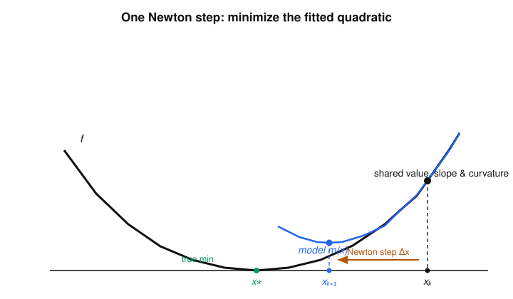

# Convex Optimization · Lesson 4.2: Newton's method

> ⏱ ~15 min · Module 4: Algorithms, from first-order to interior-point · Builds on: [Lesson 4.1](04-01-first-order-methods.md) (gradient & subgradient descent) · Unlocks: [Lesson 4.3](04-03-barrier-interior-point.md) (barrier & interior-point)

## Why this matters

Gradient descent (Lesson 4.1) only knows which way is downhill; on a stretched, ill-conditioned bowl it zig-zags and crawls, and its rate degrades with the condition number $\kappa$. Newton's method reads the **curvature** too — it fits a paraboloid to the function and jumps to that paraboloid's bottom. The payoff is spectacular: near the optimum the error roughly *squares* each step (five correct digits become ten), and the method doesn't care how you scaled your coordinates. This curvature-plus-affine-invariance is exactly what interior-point methods (Lesson 4.3) ride to solve constrained problems in polynomial time — Newton is the engine, the barrier is the fuel.

## The idea

Stand at a point $x$. Gradient descent looks at the slope and steps against it. Newton does something smarter: it builds the best **quadratic** picture of $f$ near $x$ — a paraboloid matching $f$'s value, slope, *and* curvature — and steps straight to the bottom of that paraboloid.

Why is that a good idea? Because a smooth function looks like a quadratic up close, and quadratics you can minimize in closed form. So if the local quadratic model is accurate, its minimizer is nearly the true minimizer, and you leap most of the way there in one shot. As you get closer the model gets better, the leaps get more accurate, and accuracy compounds — this is the "error squares each step" behavior.

Two more gifts fall out for free. First, **affine invariance**: because Newton uses curvature to rescale the step, it behaves identically whether your variables are in meters or millimeters — no condition-number penalty, unlike gradient descent. Second, a **built-in progress meter**, the Newton decrement, that tells you how close you are without knowing the answer.

## The formal version

Let $f$ be convex and twice differentiable, with gradient $\nabla f(x)$ and Hessian $\nabla^2 f(x) \succ 0$ (positive definite, so invertible). The second-order Taylor model at $x$ is
$$\hat f(x+v) = f(x) + \nabla f(x)^\top v + \tfrac12\, v^\top \nabla^2 f(x)\, v.$$
This is a convex quadratic in the step $v$; minimize it by setting its gradient $\nabla f(x) + \nabla^2 f(x)\,v = 0$. The minimizing step is the **Newton step**:
$$\boxed{\;\Delta x_{\mathrm{nt}} = -\,\nabla^2 f(x)^{-1}\,\nabla f(x)\;}$$
and the update is $x^{+} = x + t\,\Delta x_{\mathrm{nt}}$ for a step length $t>0$.

*In words:* fit the best paraboloid to $f$ at $x$ and step toward its bottom; $\Delta x_{\mathrm{nt}}$ is that step.

**The Newton decrement.** Define
$$\lambda(x) = \left(\nabla f(x)^\top \nabla^2 f(x)^{-1} \nabla f(x)\right)^{1/2} = \left(\Delta x_{\mathrm{nt}}^\top\, \nabla^2 f(x)\, \Delta x_{\mathrm{nt}}\right)^{1/2}.$$
The two forms are equal (substitute the boxed step). The gap between $f(x)$ and the model's minimum value is exactly $\tfrac12\lambda(x)^2$:
$$f(x) - \min_v \hat f(x+v) = \tfrac12\,\lambda(x)^2 .$$

*In words:* $\tfrac12\lambda(x)^2$ is the quadratic model's own estimate of how far above the optimum you still are — so **stop when $\tfrac12\lambda(x)^2 \le \varepsilon$**. It is the natural progress meter, and (Problem 3) it does not change if you rescale coordinates.

**Two phases (global $\to$ local).** With a step length chosen by **backtracking line search** (shrink $t$ until $f$ decreases enough), Newton runs in two regimes:

- **Damped Newton phase** (far away): the line search may pick $t<1$, but each step still cuts $f$ by at least a *fixed* constant. So you exit this phase after a bounded number of steps.
- **Pure Newton phase** (close in): the full step $t=1$ is always accepted, and convergence becomes quadratic.

**Quadratic local convergence (the theorem).** Once $x$ is close enough to the optimum $x^\star$ (equivalently, once $\lambda(x)$ drops below a threshold), the pure Newton step $t=1$ satisfies, for a constant $c$ depending on the problem,
$$\lVert x^{+} - x^\star \rVert \;\le\; c\,\lVert x - x^\star \rVert^{2}.$$

*In words:* near the optimum the error is (roughly) **squared** every step. If $c\lVert x - x^\star\rVert = 10^{-1}$, the next errors are about $10^{-2}, 10^{-4}, 10^{-8}, 10^{-16}$ — a handful of steps buys machine precision. Contrast Lesson 4.1's *linear* rate, where each step only shaves off a constant fraction.

**Affine invariance.** If you change variables $x = Ty$ with $T$ invertible and set $\tilde f(y) = f(Ty)$, the Newton iterates correspond exactly: $T\,\Delta y_{\mathrm{nt}} = \Delta x_{\mathrm{nt}}$, and $\lambda$ is unchanged. *In words:* Newton produces the *same* sequence of points regardless of how you stretch or rotate the coordinates — so, unlike gradient descent, there is **no condition-number penalty** (you prove this in Problem 3).

**Self-concordance (a taste).** The "close enough" and the constant $c$ above look problem-dependent and messy. The modern fix is a class of functions where they are *universal*: $f$ is **self-concordant** if $\lvert f'''(x)\rvert \le 2\,f''(x)^{3/2}$ (scalar version), with the multivariate statement asking this along every line. For such $f$ the whole two-phase analysis holds with *absolute* constants — e.g. the pure phase kicks in once $\lambda(x) < \tfrac14$, giving $\lambda(x^{+}) \le 2\lambda(x)^2$ — and, crucially, the bounds are themselves affine-invariant. The log-barrier $-\sum_i \log x_i$ is self-concordant, which is precisely why Newton drives the interior-point method of Lesson 4.3.

## Picture

Here $f(u)=\cosh u$ (true min at $x^\star = 0$). At the current iterate $x_k=1.6$ the blue quadratic matches $f$ in value, slope, and curvature; its minimizer sits at $x_{k+1} = x_k - \tanh(x_k) \approx 0.68$. One step erased most of the distance to $x^\star$ — and the *next* model, fitted at $0.68$, will be even more faithful, so the following step lands far closer still.

## Worked examples

**Example 1 (a step, a decrement, and squaring — all in 1-D).** Take $f(x) = x - \log x$ on $x>0$ (convex; $x^\star = 1$). Then $f'(x) = 1 - \tfrac1x$ and $f''(x) = \tfrac1{x^2}$, so
$$\Delta x_{\mathrm{nt}} = -\frac{f'(x)}{f''(x)} = -x^2\Big(1-\tfrac1x\Big) = x - x^2, \qquad \lambda(x) = \frac{\lvert f'(x)\rvert}{\sqrt{f''(x)}} = \lvert x\rvert\,\Big\lvert 1-\tfrac1x\Big\rvert = \lvert x-1\rvert.$$
So the pure step ($t=1$) gives $x^{+} = x + (x - x^2) = 2x - x^2$. Writing the error $e = x - 1$,
$$e^{+} = x^{+} - 1 = 2x - x^2 - 1 = -(x-1)^2 = -\,e^{2}.$$
The error squares *exactly* every step — quadratic convergence in the flesh. From $x_0 = 0.5$: $e_0 = -0.5 \to e_1 = -0.25 \to e_2 = -0.0625 \to e_3 \approx -0.0039$, i.e. $x_3 \approx 0.9961$. And $\lambda(x_0) = 0.5$, whose square-halved $\tfrac12(0.5)^2 = 0.125$ is the model's honest guess of the remaining gap.

**Example 2 (why you'd care — Newton nails a quadratic in one step).** Let $f(x) = \tfrac12 x^\top Q x - b^\top x$ with $Q \succ 0$; then $\nabla f(x) = Qx - b$ and $\nabla^2 f(x) = Q$, so from *any* starting point $x$,
$$\Delta x_{\mathrm{nt}} = -Q^{-1}(Qx - b) = -x + Q^{-1}b \quad\Longrightarrow\quad x^{+} = x + \Delta x_{\mathrm{nt}} = Q^{-1}b .$$
That is the exact minimizer $x^\star = Q^{-1}b$ (where $\nabla f = 0$) — reached in **one** full step, with no line search, regardless of where you started. The reason is clean: for a quadratic the second-order model $\hat f$ *is* $f$, so minimizing the model minimizes $f$. Every smooth problem looks like this once you're close, which is why the endgame is so fast. (This is the seed of Boss Problem 4(b).)

## Watch out

- **You might think** the Newton step always points downhill and you can take $t=1$ from the start — **but** far from the optimum the quadratic model can badly overshoot, so you *must* damp with a line search. The descent direction is safe ($\nabla f^\top \Delta x_{\mathrm{nt}} = -\lambda^2 < 0$ whenever $\nabla^2 f \succ 0$), but the *length* isn't; $t=1$ is earned only in the pure phase.
- **You might think** the Newton decrement is just $\lVert \nabla f\rVert$ in disguise — **but** $\lambda(x)$ measures the gradient in the *Hessian-weighted* norm $\lVert\cdot\rVert_{\nabla^2 f}$, which is exactly what makes it affine-invariant and a meaningful stopping test. The raw gradient norm is not: rescale $x$ and $\lVert\nabla f\rVert$ changes while $\lambda$ does not.
- **You might think** Newton is strictly better than gradient descent — **but** each step costs a Hessian *solve* ($O(n^3)$ in general), versus $O(n)$ for a gradient step. For huge $n$ (think large-scale machine learning) first-order methods often win on wall-clock time despite more iterations. Newton wins when Hessians are cheap or $n$ is moderate, and it is the right tool inside interior-point.
- **You might think** you need $\nabla^2 f \succ 0$ everywhere — **but** convexity only gives $\nabla^2 f \succeq 0$; if the Hessian is singular the step is undefined. In practice one adds a small $\varepsilon I$ (regularization), which interpolates toward a gradient step.

## One-liner

> Fit the best paraboloid and jump to its bottom: Newton trades an $O(n^3)$ Hessian solve per step for affine-invariant, error-squaring convergence near the optimum — exact in one step on a quadratic.

## Problems

**P1 (🟢)** For $f(x) = x - \log x$ on $x>0$, start at $x_0 = 2$. (a) Compute the Newton decrement $\lambda(x_0)$ and the model's estimated gap $\tfrac12\lambda(x_0)^2$. (b) Take one pure Newton step ($t=1$) to get $x_1$, then a second to get $x_2$. (c) Verify the errors obey $e_{k+1} = -e_k^2$ and report $x_2$ to four decimals.

**P2 (🟡)** Let $f(x) = \tfrac12 x^\top Q x - b^\top x$ with
$$Q = \begin{pmatrix} 4 & 1 \\ 1 & 3\end{pmatrix}, \qquad b = \begin{pmatrix} 1 \\ 2 \end{pmatrix}.$$
Starting from $x_0 = (0,0)$, compute the Newton step $\Delta x_{\mathrm{nt}}$ and the resulting $x_1$. Confirm $x_1$ is the exact minimizer by checking $\nabla f(x_1) = 0$, and compute $\lambda(x_0)$.

**P3 (🔴, optional)** Prove **affine invariance**. Let $T$ be invertible, $\tilde f(y) = f(Ty)$, and suppose $x = Ty$. Using $\nabla \tilde f(y) = T^\top \nabla f(Ty)$ and $\nabla^2 \tilde f(y) = T^\top \nabla^2 f(Ty)\,T$, show that (a) the Newton steps satisfy $T\,\Delta y_{\mathrm{nt}} = \Delta x_{\mathrm{nt}}$, so the iterates correspond exactly, and (b) the Newton decrement is invariant, $\tilde\lambda(y) = \lambda(x)$. Conclude in one sentence why Newton — unlike gradient descent — has no condition-number penalty.

Solutions

**P1** Recall from Example 1: $f'(x) = 1 - \tfrac1x$, $f''(x) = \tfrac1{x^2}$, $\lambda(x) = \lvert x - 1\rvert$, and the pure step gives $x^{+} = 2x - x^2$ with error law $e^{+} = -e^2$.

(a) $\lambda(x_0) = \lvert 2 - 1\rvert = 1$, so the estimated gap is $\tfrac12\lambda(x_0)^2 = \tfrac12$. (Sanity: the true gap is $f(2) - f(1) = (2 - \log 2) - 1 = 1 - \log 2 \approx 0.307$; the model overestimates because $x_0=2$ is not yet in the pure/quadratic region — $\lambda_0 = 1$ is not small.)

(b) $x_1 = 2(2) - 2^2 = 0$ — which is *outside the domain* $x>0$! This is exactly the "$t=1$ overshoots far from the optimum" trap: the undamped step leaves the feasible region. A backtracking line search would shrink $t$. Take, say, $t = \tfrac12$: $x_1 = 2 + \tfrac12(x_0 - x_0^2) = 2 + \tfrac12(2-4) = 1$ — the exact optimum. (Any $t \in (0,1)$ keeps $x_1 = 2 + t(-2) = 2-2t \in (0,2)$ safely positive; $t=\tfrac12$ happens to land on $x^\star=1$.)

(c) The clean error-squaring law $e_{k+1} = -e_k^2$ holds for the **pure** step $t=1$ and is only reliable once $\lvert e_k\rvert < 1$ (the quadratic region). Starting from $x_0=2$ we have $\lvert e_0\rvert = 1$ — the boundary — which is why the raw $t=1$ step misbehaves. Restart the accounting from a point inside the region, e.g. $x_0 = 1.5$ ($e_0 = 0.5$): $e_1 = -0.25$ ($x_1 = 0.75$), $e_2 = -0.0625$ ($x_2 = 0.9375$). Then $x_2 = 0.9375$ to four decimals. **Lesson:** quadratic convergence is a *local* promise; the damped phase exists precisely to shepherd you into the region where $t=1$ and $e_{k+1}=-e_k^2$ take over.

**P2** $\nabla f(x) = Qx - b$, $\nabla^2 f(x) = Q$. At $x_0=(0,0)$: $\nabla f(x_0) = -b = (-1,-2)$. Need $Q^{-1}$: $\det Q = 4\cdot 3 - 1\cdot 1 = 11$, so
$$Q^{-1} = \frac{1}{11}\begin{pmatrix} 3 & -1 \\ -1 & 4\end{pmatrix}.$$
Newton step: $\Delta x_{\mathrm{nt}} = -Q^{-1}\nabla f(x_0) = -Q^{-1}(-b) = Q^{-1}b = \tfrac1{11}\begin{pmatrix}3 & -1\\ -1 & 4\end{pmatrix}\begin{pmatrix}1\\2\end{pmatrix} = \tfrac1{11}\begin{pmatrix}3-2\\ -1+8\end{pmatrix} = \begin{pmatrix} 1/11 \\ 7/11 \end{pmatrix}.$
Then $x_1 = x_0 + \Delta x_{\mathrm{nt}} = (1/11,\,7/11) \approx (0.0909,\,0.6364)$. Check optimality: $\nabla f(x_1) = Q x_1 - b = Q Q^{-1} b - b = b - b = 0$. ✓ Exact minimizer in one step, as Example 2 promised. Newton decrement: $\lambda(x_0)^2 = \nabla f(x_0)^\top Q^{-1}\nabla f(x_0) = b^\top Q^{-1} b = (1,2)\,\tfrac1{11}(1,7)^\top = \tfrac{1 + 14}{11} = \tfrac{15}{11}$, so $\lambda(x_0) = \sqrt{15/11} \approx 1.168$. (And indeed $\tfrac12\lambda(x_0)^2 = \tfrac{15}{22} \approx 0.682 = f(x_0) - p^\star$ exactly, since for a quadratic the model *is* $f$: $p^\star = f(x_1) = \tfrac12 x_1^\top Q x_1 - b^\top x_1 = -\tfrac12 b^\top Q^{-1} b = -\tfrac{15}{22}$, and $f(x_0)=0$.)

**P3** (a) Write $g = \nabla f(Ty)$, $H = \nabla^2 f(Ty)$ at $x = Ty$. Then $\nabla \tilde f(y) = T^\top g$ and $\nabla^2 \tilde f(y) = T^\top H T$ (invertible since $T,H$ are). The Newton step in $y$-coordinates is
$$\Delta y_{\mathrm{nt}} = -\big(T^\top H T\big)^{-1} T^\top g = -\,T^{-1} H^{-1} T^{-\top} T^\top g = -\,T^{-1} H^{-1} g = T^{-1}\Delta x_{\mathrm{nt}},$$
using $(T^\top H T)^{-1} = T^{-1}H^{-1}T^{-\top}$ and $T^{-\top}T^\top = I$. Hence $T\,\Delta y_{\mathrm{nt}} = \Delta x_{\mathrm{nt}}$. So if $x = Ty$ then $x + \Delta x_{\mathrm{nt}} = Ty + T\Delta y_{\mathrm{nt}} = T(y + \Delta y_{\mathrm{nt}})$: one Newton step in $x$-space is the image under $T$ of one Newton step in $y$-space. By induction the entire iterate sequences correspond, $x_k = T y_k$.

(b) $\tilde\lambda(y)^2 = \nabla\tilde f(y)^\top \big(\nabla^2\tilde f(y)\big)^{-1}\nabla\tilde f(y) = (T^\top g)^\top (T^\top H T)^{-1}(T^\top g) = g^\top T\,T^{-1}H^{-1}T^{-\top}\,T^\top g = g^\top H^{-1} g = \lambda(x)^2.$
So $\tilde\lambda(y) = \lambda(x)$.

**Conclusion:** Newton's iterates and its stopping meter are unchanged by any invertible linear reparametrization. Gradient descent is *not* affine invariant — $\nabla \tilde f = T^\top \nabla f$ but there is no $T^\top H T$ rescaling of the step, so a stretch of the coordinates (which changes the condition number $\kappa$) changes its trajectory and its rate. Newton absorbs that stretch through the Hessian inverse, so it pays no condition-number penalty. $\blacksquare$

## Flashback

**From Lesson 4.1 (gradient descent & the condition number):** Consider the quadratic $f(x) = \tfrac12 x^\top Q x$ with $Q \succ 0$ having eigenvalues $\lambda_{\min} = 2$ and $\lambda_{\max} = 8$. Gradient descent with the optimal fixed step size contracts the distance to the optimum linearly, $\lVert x_{k+1} - x^\star\rVert \le \rho\,\lVert x_k - x^\star\rVert$, with rate $\rho = \dfrac{\kappa - 1}{\kappa + 1}$ where $\kappa = \lambda_{\max}/\lambda_{\min}$. (a) Compute $\kappa$ and $\rho$. (b) How many iterations guarantee the distance is cut by a factor of $100$? (c) How many steps would **Newton** need on this same $f$, and why?

Solution

(a) $\kappa = 8/2 = 4$, so $\rho = \dfrac{4-1}{4+1} = \dfrac{3}{5} = 0.6$.

(b) After $k$ steps the distance is at most $\rho^k$ times the start, so we need $\rho^k \le 10^{-2}$, i.e. $0.6^k \le 0.01$. Taking logs: $k \ge \dfrac{\ln 0.01}{\ln 0.6} = \dfrac{-4.6052}{-0.5108} \approx 9.02$, so $k = 10$ iterations suffice. (Each step is cheap — one gradient — but progress is only a constant factor $0.6$ per step: *linear* convergence.)

(c) **One step.** $f$ is a convex quadratic, so the second-order Taylor model equals $f$ exactly; the Newton step from any point lands on $x^\star = Q^{-1}\cdot 0 = 0$ (Example 2). Newton pays a Hessian solve but is blind to $\kappa$ — the affine-invariance from Problem 3 is exactly the statement that stretching the eigenvalues (changing $\kappa$) cannot slow it down, whereas it is precisely what slows gradient descent.

## Connections

- **Backward:** This is the curvature-aware upgrade of [Lesson 4.1](04-01-first-order-methods.md). Gradient descent's Achilles' heel was the condition number $\kappa$; Newton's affine invariance annihilates it. The Newton step also reuses the second-order convexity condition $\nabla^2 f \succeq 0$ from [Lesson 1.3](01-03-convex-functions-epigraph.md) — Newton needs the strict version $\succ 0$ to invert the Hessian, which the PSD-cone and eigenvalue tools of the [linalg-refresher](../../linalg-refresher/syllabus.md) make routine.
- **Forward:** [Lesson 4.3](04-03-barrier-interior-point.md) runs Newton *inside* the barrier method: the log-barrier $-\sum_i \log x_i$ is self-concordant, so damped Newton solves each centering step with the universal, affine-invariant guarantees sketched here — this is what makes interior-point methods polynomial-time.
- **Sideways (analysis):** the quadratic-convergence statement $\lVert x^{+} - x^\star\rVert \le c\lVert x - x^\star\rVert^2$ is a fixed-point/contraction argument of the kind made rigorous in [real-analysis](../../real-analysis/syllabus.md); "error squares each step" is the hallmark that separates Newton's *quadratic* rate from the *linear* rate of first-order methods.
- **Sideways (computation):** the per-step cost is a linear solve $\nabla^2 f(x)\,\Delta x = -\nabla f(x)$, so everything you know about exploiting sparsity and structure in Hessians (Cholesky, Schur complements from [Lesson 2.4](02-04-semidefinite-programs-conic-ladder.md)) is what makes Newton practical at scale.
