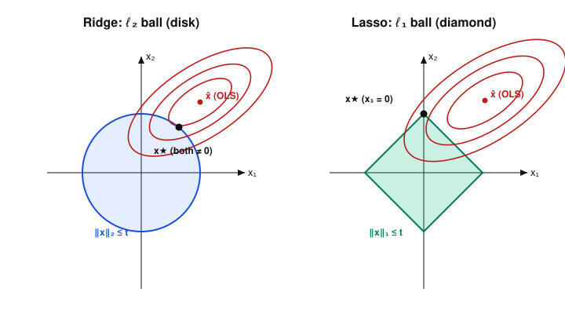

# Convex Optimization · Lesson 5.1: Least-squares, regularization, and the lasso

> ⏱ ~15 min · Module 5: Applications · Builds on: [Lesson 2.2](02-02-linear-quadratic-programs.md) (least-squares as a QP), [Lesson 1.2](01-02-convex-set-zoo-operations.md) (norm balls) · Unlocks: [Lesson 5.2](05-02-support-vector-machines.md)

## Why this matters

Fitting a model to data *is* an optimization problem, and the oldest one in the book — least-squares — is convex. But raw least-squares is fragile: when the features are nearly redundant it produces wild, unstable coefficients, and when there are more knobs than data it memorizes noise. The fix is to add a penalty for complexity, turning "fit the data" into "fit the data *and* stay simple." The astonishing part is that *which* penalty you pick changes the answer's character completely: one penalty gently shrinks every coefficient, the other zeroes most of them out and hands you a short list of the features that matter. That difference is pure convex geometry — and it is the entire engine room of [`statistical-learning`](../../statistical-learning/syllabus.md).

## The idea

You have measurements stacked into a matrix $A$ (each row a data point, each column a feature) and observed outputs $b$. You want a coefficient vector $x$ so that $Ax \approx b$. Least-squares picks the $x$ minimizing the total squared miss.

Two things can go wrong. If two feature-columns are nearly parallel, the fit can't tell them apart, so it can dial one coefficient huge-positive and the other huge-negative and barely change $Ax$ — the numbers are meaningless and blow up on new data. And if you have many features, the fit will contort itself to nail every training point, noise included. Both are cured by the same reflex: **penalize large $x$.** Add a term that grows with the size of $x$ and tune how hard it pushes with a knob $\lambda \ge 0$.

Here's the punchline you should carry out of this lesson. Measure "size of $x$" with the round $\ell_2$ norm and you get **ridge**, which shrinks every coefficient smoothly toward zero but leaves them all nonzero. Measure it with the pointy $\ell_1$ norm and you get **lasso**, which drives most coefficients *exactly* to zero — automatic feature selection. Round penalty shrinks; pointy penalty selects. The reason is that the $\ell_1$ ball has corners, and the corners sit on the axes.

## The formal version

**Ordinary least-squares (OLS).** Given $A \in \mathbb{R}^{m\times n}$ and $b \in \mathbb{R}^m$,
$$\min_{x\in\mathbb{R}^n}\ \lVert Ax-b\rVert_2^2.$$
The objective is a convex quadratic (its Hessian is $2A^\top A \succeq 0$), so this is the unconstrained QP of [Lesson 2.2](02-02-linear-quadratic-programs.md). Setting the gradient to zero, $\nabla_x \lVert Ax-b\rVert_2^2 = 2A^\top(Ax-b) = 0$, gives the **normal equations**
$$A^\top A\, x = A^\top b.$$

*In words:* the best fit makes the residual $Ax-b$ orthogonal to every feature-column — there's no leftover signal in the data you could still use.

If $A$ has full column rank, $A^\top A$ is invertible and the solution is unique: $x = (A^\top A)^{-1}A^\top b$. **When it isn't** — columns nearly dependent — $A^\top A$ is near-singular, its inverse enormous, and the solution swings violently with tiny changes in $b$. This *ill-conditioning* is the concrete disease regularization treats.

**Ridge / Tikhonov regularization ($\ell_2$).**
$$\min_{x}\ \lVert Ax-b\rVert_2^2 + \lambda\lVert x\rVert_2^2, \qquad \lambda > 0.$$
The new Hessian is $2(A^\top A + \lambda I) \succ 0$ — *strictly* positive definite for any $\lambda>0$ — so the objective is strictly convex and has a unique minimizer with a clean closed form:
$$x_{\text{ridge}} = (A^\top A + \lambda I)^{-1}A^\top b.$$

*In words:* adding $\lambda I$ props up the flat, unstable directions of $A^\top A$ so the inverse is always well-behaved. The price is bias: every coefficient is pulled toward zero (it *shrinks*), never reaching it.

**Lasso ($\ell_1$).**
$$\min_{x}\ \lVert Ax-b\rVert_2^2 + \lambda\lVert x\rVert_1, \qquad \lVert x\rVert_1=\sum_i |x_i|.$$
Still convex (a convex quadratic plus a convex piecewise-linear penalty), but the $\ell_1$ term is nondifferentiable at $0$, so there's no closed form — and that kink is exactly what forces coefficients to *stick* at zero. The lasso returns **sparse** solutions: most $x_i = 0$ exactly.

**The constrained twins.** Each penalized ("Lagrangian") form has an equivalent constrained form — for every $\lambda$ there is a budget $t$ giving the same solution:
$$\text{ridge}:\ \min_x \lVert Ax-b\rVert_2^2 \ \text{ s.t. }\ \lVert x\rVert_2\le t, \qquad \text{lasso}:\ \min_x \lVert Ax-b\rVert_2^2 \ \text{ s.t. }\ \lVert x\rVert_1\le t.$$
Both are convex programs over the norm balls of [Lesson 1.2](01-02-convex-set-zoo-operations.md): the ridge constraint set is the $\ell_2$ ball (a disk/sphere), the lasso set is the $\ell_1$ ball (a diamond/cross-polytope). Both fit inside the SOCP class of [Lesson 2.3](02-03-second-order-cone-programs.md) — the $\ell_2$ constraint $\lVert x\rVert_2 \le t$ *is* a second-order cone constraint, and the $\ell_1$ ball is a polyhedron carved by the $2^n$ linear inequalities $\pm x_1 \pm \cdots \pm x_n \le t$, so the lasso is even a QP. The multiplier $\lambda$ is precisely the shadow price of the budget $t$ — the Lagrange-duality reading from Module 3.

## Picture

The constrained form makes the whole story visible. The squared-error objective $\lVert Ax - b\rVert_2^2$ is a convex quadratic; its level sets are nested ellipses centered at the *unconstrained* OLS solution $\hat x$. The constrained solution is the first point where a growing ellipse touches the constraint ball. Where that first contact lands is everything.

On the **left**, the disk is smooth, so the tangent point is generically off both axes: both coefficients are nonzero — ridge shrinks but doesn't select. On the **right**, the diamond's sharp corners jut out along the axes, so a growing ellipse almost always strikes a *corner* first — and a corner on the $x_2$-axis means $x_1 = 0$ exactly. Sharp corners on the axes are the entire reason $\ell_1$ produces sparsity. In higher dimensions the diamond has corners, edges, and faces of every dimension, so lasso can zero out any subset of coordinates.

## Worked examples

**Example 1 (mechanical — ridge shrinks).** Take an orthogonal design
$$A=\begin{pmatrix}1&1\\ 1&-1\end{pmatrix},\qquad b=\begin{pmatrix}3\\1\end{pmatrix}.$$
The columns are orthogonal with $A^\top A=\begin{pmatrix}2&0\\0&2\end{pmatrix}=2I$, and $A^\top b=\begin{pmatrix}1\cdot3+1\cdot1\\ 1\cdot3-1\cdot1\end{pmatrix}=\begin{pmatrix}4\\2\end{pmatrix}$.

*OLS:* the normal equations $2I\,x=(4,2)^\top$ give $\hat x=(2,\,1)$.

*Ridge with $\lambda=2$:* $x_{\text{ridge}}=(A^\top A+\lambda I)^{-1}A^\top b=(2I+2I)^{-1}(4,2)^\top=\tfrac14(4,2)^\top=(1,\,0.5)$.

Every coefficient was multiplied by $\tfrac{2}{2+\lambda}=\tfrac12$: pure shrinkage toward the origin, and *neither* coefficient became zero. That factor $\frac{\text{eigenvalue}}{\text{eigenvalue}+\lambda}$ is the general ridge story on orthogonal features.

**Example 2 (why you'd care — lasso selects).** Keep the orthogonal setup so $A^\top A=I$ after rescaling; then $\lVert Ax-b\rVert_2^2 = \lVert x-\hat x\rVert_2^2 + \text{const}$ and the penalized problems **decouple coordinate-by-coordinate**. For a single coordinate with OLS value $c=\hat x_i$:

- *Ridge* solves $\min_x (x-c)^2+\lambda x^2$, giving $x=\dfrac{c}{1+\lambda}$ — shrink by a constant factor, never zero.
- *Lasso* solves $\min_x (x-c)^2+\lambda|x|$. For $x>0$ the derivative $2(x-c)+\lambda=0$ gives $x=c-\tfrac{\lambda}{2}$, valid only while that's positive; symmetrically for $x<0$. The minimizer is the **soft-threshold**
$$x=\operatorname{sign}(c)\,\max\!\Big(|c|-\tfrac{\lambda}{2},\,0\Big).$$

So lasso doesn't just shrink — once a coefficient's OLS value falls below the threshold $\lambda/2$, it is set to *exactly* zero. That flat dead-zone around the origin is sparsity, and it comes straight from the kink in $|x|$ that ridge's smooth $x^2$ lacks.

## Watch out

- **The ridge penalty is the *squared* norm $\lVert x\rVert_2^2$, but the ridge *constraint* is the plain norm $\lVert x\rVert_2\le t$.** Squaring inside the objective keeps it a smooth quadratic (nice for the closed form); the constraint form drops the square because a ball is a ball. Don't square the $\ell_1$ penalty — $\lVert x\rVert_1$ unsquared is what keeps the corners sharp.
- You might think a bigger $\lambda$ is always safer. But $\lambda$ trades variance for bias: too large and you shrink toward the zero model and *underfit*. $\lambda$ is a dial to tune (by cross-validation in `statistical-learning`), not to crank.
- **Standardize your columns first, and don't penalize the intercept.** Both penalties depend on the scale of each feature — measuring a length in millimeters vs. kilometers changes which coefficients look "large." Center and scale the columns so the penalty is comparing like with like.
- Ridge always has a *unique* solution (strictly convex). Plain OLS and lasso need not, when $A$ is rank-deficient — though lasso still returns *a* sparse solution.

## One-liner

> Round penalties shrink and pointy penalties select: the $\ell_1$ diamond's corners sit on the axes, so the fit lands on a corner and coefficients vanish.

## Problems

**P1 (🟢)** Using the orthogonal design $A=\begin{pmatrix}1&1\\1&-1\end{pmatrix}$, $b=(3,1)^\top$ from Example 1: (a) recompute the OLS solution from the normal equations, and (b) find the ridge solution for $\lambda=6$. By what factor did each coefficient shrink?

**P2 (🟡)** Consider the scalar lasso problem $\min_{x}\ (x-2)^2+\lambda|x|$ with $\lambda\ge0$. (a) Give the minimizer $x^\star$ as a function of $\lambda$. (b) For which $\lambda$ is $x^\star=0$ exactly? (c) Contrast with the ridge problem $\min_x (x-2)^2+\lambda x^2$: does *its* minimizer ever hit zero for finite $\lambda$?

**P3 (🔴, optional)** Prove that for any $A\in\mathbb{R}^{m\times n}$ and any $\lambda>0$, the matrix $A^\top A+\lambda I$ is positive definite — hence invertible — *even when $A$ is rank-deficient*. Conclude that the ridge objective is strictly convex and its minimizer is unique. (Hint: use the eigenvalues of the symmetric PSD matrix $A^\top A$, from the `linalg-refresher`.)

Solutions

**P1** (a) With $A^\top A=2I$ and $A^\top b=(4,2)^\top$, the normal equations $2I\,x=(4,2)^\top$ give $\hat x=(2,\,1)$.

(b) $x_{\text{ridge}}=(A^\top A+\lambda I)^{-1}A^\top b=(2I+6I)^{-1}(4,2)^\top=\tfrac18(4,2)^\top=(0.5,\,0.25)$. Each coefficient is multiplied by $\frac{2}{2+6}=\frac14$, i.e. shrunk to one-quarter of its OLS value. Neither is zero.

**P2** (a) For $x>0$: $\frac{d}{dx}\big[(x-2)^2+\lambda x\big]=2(x-2)+\lambda=0\Rightarrow x=2-\tfrac{\lambda}{2}$, valid while $2-\tfrac{\lambda}{2}>0$, i.e. $\lambda<4$. Since $c=2>0$ the minimizer can't be negative, so
$$x^\star=\max\!\Big(2-\tfrac{\lambda}{2},\,0\Big),$$
the soft-threshold with $c=2$.

(b) $x^\star=0$ precisely when $2-\tfrac{\lambda}{2}\le0$, i.e. $\lambda\ge4$. (At $x=0$ the nonsmooth optimality condition is $|2(0-2)|=4\le\lambda$.)

(c) Ridge: $2(x-2)+2\lambda x=0\Rightarrow x=\dfrac{2}{1+\lambda}$. This is strictly positive for every finite $\lambda$ and only approaches $0$ as $\lambda\to\infty$ — it never *equals* zero. That's the whole ridge-vs-lasso distinction in one coordinate: soft-threshold has a dead-zone at $0$; smooth shrinkage does not.

**P3** $A^\top A$ is symmetric and positive semidefinite: for any $v$, $v^\top A^\top A\,v=\lVert Av\rVert_2^2\ge0$. So it has an orthonormal eigenbasis with real eigenvalues $\mu_1,\dots,\mu_n\ge0$ (some may be $0$ exactly when $A$ is rank-deficient). Adding $\lambda I$ shifts every eigenvalue by $\lambda$: the eigenvalues of $A^\top A+\lambda I$ are $\mu_i+\lambda\ge\lambda>0$. A symmetric matrix with all-positive eigenvalues is positive definite, hence invertible — no matter the rank of $A$.

Therefore the ridge Hessian $2(A^\top A+\lambda I)\succ0$ everywhere, so the objective is strictly convex; a strictly convex function has at most one minimizer, and setting the gradient to zero yields exactly one, $x=(A^\top A+\lambda I)^{-1}A^\top b$. This is *why* regularization cures ill-conditioning: it lifts the smallest eigenvalue off $0$ up to at least $\lambda$, bounding the condition number and taming the inverse. $\blacksquare$

## Flashback

**From Lesson 2.2 (Linear and quadratic programs):** Take $A=\begin{pmatrix}1&0\\1&1\end{pmatrix}$ and $b=(2,3)^\top$. Write the least-squares problem $\min_x\lVert Ax-b\rVert_2^2$ in QP standard form $\min_x \tfrac12 x^\top P x + q^\top x + r$: identify $P$, $q$, $r$, then solve the stationarity condition $Px=-q$ (the normal equations) for the optimal $x$.

Solution

Expand $\lVert Ax-b\rVert_2^2=(Ax-b)^\top(Ax-b)=x^\top A^\top A\,x-2b^\top A\,x+b^\top b$. Matching to $\tfrac12 x^\top P x+q^\top x+r$:
$$P=2A^\top A,\qquad q=-2A^\top b,\qquad r=b^\top b.$$
Compute $A^\top A=\begin{pmatrix}2&1\\1&1\end{pmatrix}$ (column dots: $c_1\cdot c_1=2,\ c_1\cdot c_2=1,\ c_2\cdot c_2=1$) and $A^\top b=\begin{pmatrix}2+3\\0+3\end{pmatrix}=\begin{pmatrix}5\\3\end{pmatrix}$. So $P=\begin{pmatrix}4&2\\2&2\end{pmatrix}$, $q=(-10,-6)^\top$, $r=b^\top b=13$.

Stationarity $Px=-q$ is $2A^\top A\,x=2A^\top b$, i.e. the normal equations $A^\top A\,x=A^\top b$:
$$\begin{pmatrix}2&1\\1&1\end{pmatrix}x=\begin{pmatrix}5\\3\end{pmatrix}.$$
The determinant is $2\cdot1-1\cdot1=1$, so $\begin{pmatrix}2&1\\1&1\end{pmatrix}^{-1}=\begin{pmatrix}1&-1\\-1&2\end{pmatrix}$ and
$$x=\begin{pmatrix}1&-1\\-1&2\end{pmatrix}\begin{pmatrix}5\\3\end{pmatrix}=\begin{pmatrix}2\\1\end{pmatrix}.$$
Check: $Ax=(2,\,2+1)^\top=(2,3)^\top=b$ — an exact fit (two equations, two unknowns, $A$ invertible), so the minimum residual is $0$ and $P\succ0$ confirms it's the unique global min. $\blacksquare$

## Connections

- **Backward:** this is [Lesson 2.2](02-02-linear-quadratic-programs.md)'s least-squares QP with a penalty bolted on, sitting on the $\ell_1$/$\ell_2$/$\ell_\infty$ norm balls you cataloged in [Lesson 1.2](01-02-convex-set-zoo-operations.md) — now reappearing as *constraint sets* whose shape decides sparsity. The multiplier $\lambda$ pricing the budget $t$ is the shadow-price reading of Module 3 duality.
- **Forward:** [Lesson 5.2](05-02-support-vector-machines.md) is the same move again — the SVM objective $\tfrac12\lVert w\rVert_2^2$ is exactly a ridge ($\ell_2$) penalty on the separating hyperplane — and there we pass to the Lagrangian dual to expose the support vectors.
- **Sideways (`statistical-learning`):** ridge and lasso *are* the regularized estimators of [`statistical-learning`](../../statistical-learning/syllabus.md). Set up here as convex programs, they're used there as learning methods: $\lambda$ tunes the bias–variance trade-off, and the lasso's sparsity is automatic feature selection. Same objects, two vantage points — keep them consistent.
