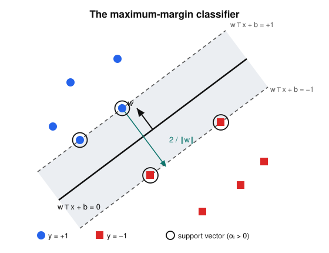

# Convex Optimization · Lesson 5.2: Support vector machines

> ⏱ ~15 min · Module 5: Applications · Builds on: [3.3 KKT conditions](03-03-kkt-conditions.md), [1.1 Separating hyperplanes](01-01-convex-sets-separating-hyperplane.md), [2.2 Linear & quadratic programs](02-02-linear-quadratic-programs.md) · Unlocks: [5.3 Portfolio & optimal control](05-03-portfolio-optimal-control.md)

## Why this matters

You have labeled data — spam vs. not, tumor vs. benign — and you want a rule that separates the two classes and, crucially, *generalizes* to points you haven't seen. Of the infinitely many hyperplanes that split a separable dataset, the support vector machine picks the one specific choice with a principled claim to generalization: the one that carves the **widest possible gap** between the classes. The payoff of this lesson is twofold. First, that "widest gap" is a convex quadratic program (Lesson [2.2](02-02-linear-quadratic-programs.md)) — so it has a unique global solution you can actually compute. Second, when you take its dual (Lesson [3.3](03-03-kkt-conditions.md)) the data enters *only through inner products* $x_i^\top x_j$, and that single fact is the hinge on which the entire kernel-methods industry swings.

## The idea

Picture two clouds of points, one class blue and one red, that a straight line can separate. Don't just find *a* separating line — find the **fattest slab** you can slide between the clouds without touching a point. The slab's centerline is your decision boundary; its half-width is the *margin*. Intuitively, a fat margin is a confident rule: every training point sits well clear of the boundary, so a small wiggle in the data won't flip a label.

Here is the beautiful part. Widen the slab until it jams. It jams because a few points — the ones touching its edges — block it from growing further. Those points are the **support vectors**. Every other point could be deleted and the optimal slab wouldn't move an inch. The whole classifier is pinned in place by a handful of boundary cases, and finding them is exactly a job for complementary slackness.

When the clouds *overlap* and no slab fits cleanly, we don't give up — we let a few points sit inside the slab (or on the wrong side) and charge a penalty for each violation. That penalty knob is $C$, and it turns the hard problem into one that always has a solution.

## The formal version

**Setup.** Data $(x_i, y_i)$ for $i = 1,\dots,m$, with feature vectors $x_i \in \mathbb{R}^n$ and labels $y_i \in \{-1, +1\}$. A **linear classifier** is a hyperplane $w^\top x + b = 0$ with weight vector $w \in \mathbb{R}^n$ and offset $b \in \mathbb{R}$; we predict $\operatorname{sign}(w^\top x + b)$.

**Geometric margin.** The signed distance from a point $x_i$ to the hyperplane is $(w^\top x_i + b)/\lVert w\rVert_2$. Multiplying by the label $y_i$ makes it positive exactly when the point is classified correctly, so define the **geometric margin** of the dataset as
$$\gamma \;=\; \min_i \; \frac{y_i\,(w^\top x_i + b)}{\lVert w\rVert_2}.$$
*In words:* $\gamma$ is the distance from the boundary to the closest point — the half-width of the fattest slab centered on the hyperplane.

**Killing the scale freedom.** The pair $(w, b)$ and $(tw, tb)$ for any $t > 0$ describe the *same* hyperplane but different-length $w$. We spend that freedom by normalizing so the closest points satisfy $y_i(w^\top x_i + b) = 1$ (the *functional* margin is $1$). Then the geometric margin is simply $\gamma = 1/\lVert w\rVert_2$, and maximizing it means minimizing $\lVert w\rVert_2$. Squaring and halving (monotone, and it makes the gradient clean) gives the **hard-margin SVM**:
$$\boxed{\;\min_{w,\,b}\ \tfrac12\lVert w\rVert_2^2 \quad\text{subject to}\quad y_i\,(w^\top x_i + b) \ge 1,\ \ i=1,\dots,m.\;}$$
*In words:* find the shortest $w$ such that every point clears the margin. This is a convex QP: quadratic objective, linear constraints (Lesson [2.2](02-02-linear-quadratic-programs.md)).

**Soft margin for the messy real world.** If the classes overlap, the constraints above are infeasible. Introduce a **slack** $\xi_i \ge 0$ measuring how far point $i$ falls short of its margin, and pay for it:
$$\min_{w,\,b,\,\xi}\ \tfrac12\lVert w\rVert_2^2 + C\sum_{i=1}^m \xi_i \quad\text{s.t.}\quad y_i(w^\top x_i + b) \ge 1 - \xi_i,\ \ \xi_i \ge 0.$$
At the optimum $\xi_i = \max\{0,\,1 - y_i(w^\top x_i + b)\}$ — the **hinge loss** — so the problem is equivalently "minimize $\tfrac12\lVert w\rVert_2^2 + C\sum_i \text{hinge}_i$." The constant $C > 0$ sets the exchange rate: large $C$ punishes violations hard (narrow, careful margin), small $C$ tolerates them (wide, forgiving margin).

**The dual.** Attach multipliers $\alpha_i \ge 0$ to the margin constraints and form the Lagrangian of the hard-margin problem:
$$L(w,b,\alpha) = \tfrac12\lVert w\rVert_2^2 - \sum_i \alpha_i\big[y_i(w^\top x_i + b) - 1\big].$$
Stationarity in the primal variables (Lesson [3.3](03-03-kkt-conditions.md)) gives the two identities that carry everything:
$$\nabla_w L = 0 \ \Rightarrow\ w = \sum_i \alpha_i y_i x_i, \qquad \frac{\partial L}{\partial b} = 0 \ \Rightarrow\ \sum_i \alpha_i y_i = 0.$$
Substitute $w = \sum_i \alpha_i y_i x_i$ back into $L$; the $b$-term drops (its coefficient is $\sum_i \alpha_i y_i = 0$) and after simplifying you get the **SVM dual**:
$$\boxed{\;\max_{\alpha}\ \sum_{i} \alpha_i - \tfrac12\sum_{i,j}\alpha_i\alpha_j\,y_i y_j\,x_i^\top x_j \quad\text{s.t.}\quad 0 \le \alpha_i \ (\le C),\ \ \sum_i \alpha_i y_i = 0.\;}$$
*In words:* another convex QP, now in the multipliers $\alpha$. The upper bound $\alpha_i \le C$ appears only in the **soft-margin** version (P2 derives it); hard margin has no ceiling. Because the problem is convex and Slater holds, strong duality gives a zero gap — solving the dual solves the primal.

**Support vectors via complementary slackness.** The KKT condition $\alpha_i\big[y_i(w^\top x_i + b) - 1\big] = 0$ (Lesson [3.3](03-03-kkt-conditions.md)) forces a dichotomy for every point:
- $\alpha_i = 0$: the point sits strictly outside the margin and is *ignored* — deleting it changes nothing.
- $\alpha_i > 0$: the constraint binds, $y_i(w^\top x_i + b) = 1$ — the point lies **on** the margin. This is a **support vector**.

So $w = \sum_{i:\,\alpha_i > 0} \alpha_i y_i x_i$ is a combination of support vectors *only*, and recovering the offset needs just one of them: $b = y_i - w^\top x_i$ for any support vector $i$ (using $y_i^2 = 1$). This "you only pay for constraints that bind" reading is exactly the shadow-price logic of the constrained consumer problem in [`grad-micro`](../../grad-micro/syllabus.md) and the active-constraint best response of [`grad-game-theory`](../../grad-game-theory/syllabus.md): the multiplier $\alpha_i$ prices margin constraint $i$, and it is zero unless that constraint is active.

**The kernel slot.** Both the dual objective and the prediction $w^\top x + b = \sum_i \alpha_i y_i\,(x_i^\top x) + b$ touch the data *only* through inner products. Replace every $x_i^\top x_j$ with $k(x_i, x_j) = \varphi(x_i)^\top \varphi(x_j)$ for some feature map $\varphi$, and you get a max-margin classifier in a (possibly huge) feature space **without ever computing $\varphi$**. That is the kernel trick, and this inner-product-only structure is the slot it plugs into (P3).

## Picture

The solid line is the decision boundary $w^\top x + b = 0$; the dashed lines are the margins $w^\top x + b = \pm 1$. The shaded slab has width $2/\lVert w\rVert_2$, and $w$ points perpendicular to the boundary toward the positive class. Only the four ringed points touch a margin line — those are the support vectors. Slide any un-ringed point around inside its cloud and the optimal slab doesn't budge.

## Worked examples

**Example 1 (a two-point SVM, solved from the geometry).** Take $x_+ = (2,2)$ with $y_+ = +1$ and $x_- = (0,0)$ with $y_- = -1$. By symmetry the boundary is the perpendicular bisector of the segment joining them, so $w \parallel (1,1)$; write $w = (s, s)$. Both points must be support vectors (there's nothing else to pin the slab), so both margin constraints hold with equality:
$$y_-(w^\top x_- + b) = 1:\ \ -(0 + b) = 1 \ \Rightarrow\ b = -1, \qquad y_+(w^\top x_+ + b) = 1:\ \ (4s - 1) = 1 \ \Rightarrow\ s = \tfrac12.$$
So $w = (\tfrac12, \tfrac12)$, $b = -1$, and the margin is $1/\lVert w\rVert_2 = 1/\sqrt{1/2} = \sqrt{2}$. Sanity check: the two points are $\lVert(2,2)\rVert = 2\sqrt2$ apart, and half of that is $\sqrt2$. ✓

**Example 2 (the same problem through the dual — watch the inner products do all the work).** With two points the constraint $\sum_i \alpha_i y_i = 0$ reads $\alpha_+ - \alpha_- = 0$, so $\alpha_+ = \alpha_- = \alpha$. The inner products are $x_+^\top x_+ = 8$, $x_-^\top x_- = 0$, $x_+^\top x_- = 0$. The dual objective becomes
$$W(\alpha) = (\alpha_+ + \alpha_-) - \tfrac12\big[\alpha_+^2\,x_+^\top x_+ + \alpha_-^2\,x_-^\top x_- - 2\alpha_+\alpha_-\,x_+^\top x_-\big] = 2\alpha - \tfrac12(8\alpha^2) = 2\alpha - 4\alpha^2.$$
Maximize: $W'(\alpha) = 2 - 8\alpha = 0 \Rightarrow \alpha = \tfrac14 > 0$, so both points are support vectors. Recover the primal:
$$w = \alpha_+ y_+ x_+ + \alpha_- y_- x_- = \tfrac14(+1)(2,2) + \tfrac14(-1)(0,0) = (\tfrac12,\tfrac12),$$
and from the support vector $x_+$, $\; b = y_+ - w^\top x_+ = 1 - 2 = -1$. Identical to Example 1 — and notice the entire computation saw the data only as the numbers $8, 0, 0$. Swap those for kernel values and nothing about the machinery changes. This is the max-margin classifier of [`statistical-learning`](../../statistical-learning/syllabus.md), derived here purely as a convex program.

## Watch out

- **You might think** minimizing $\lVert w\rVert_2$ is shrinking the classifier toward zero for its own sake — **but** it's maximizing the margin $1/\lVert w\rVert_2$ *under the normalization* that the closest points have functional margin $1$. Drop that constraint and $w = 0$ is a meaningless "optimum." Objective and constraints are a package.
- **You might think** more support vectors means a better fit — **but** support vectors are the constraints that *bind*, not a quality score. In the separable case a fat-margin solution typically has very few (often just $n{+}1$). Many support vectors usually signals overlap or a small $C$ forcing lots of points into the slab.
- **You might think** $C$ and $\lVert w\rVert$ do the same job — **but** $C$ is fixed by you before solving (it sets how much a violation costs), while $\lVert w\rVert$ is *chosen* by the optimizer. Large $C$ → the optimizer picks a larger $\lVert w\rVert$ (narrow margin) to avoid the steep violation penalty; small $C$ → a wide, forgiving margin. $C = \infty$ recovers the hard margin.

## One-liner

> The SVM is the shortest $w$ that clears every point by a unit margin; its dual sees the data only through inner products, and only the boundary-touching support vectors — the constraints complementary slackness keeps alive — survive in the answer.

## Problems

**P1 (🟢)** A hyperplane has $w = (1, 2)$, $b = -2$, and a point $x = (3, 1)$ with label $y = +1$. (a) Compute the functional margin $y(w^\top x + b)$ and the geometric margin $y(w^\top x + b)/\lVert w\rVert_2$. (b) Now rescale to $(w', b') = (2w, 2b)$. Recompute both margins and explain in one sentence which one is invariant and why that is exactly what justifies the normalization "set the functional margin to $1$."

**P2 (🟡)** Derive the box constraint $\alpha_i \le C$ in the *soft-margin* dual. Start from the soft-margin Lagrangian with multipliers $\alpha_i \ge 0$ for the margin constraints and $\mu_i \ge 0$ for $\xi_i \ge 0$:
$$L = \tfrac12\lVert w\rVert_2^2 + C\sum_i \xi_i - \sum_i \alpha_i\big[y_i(w^\top x_i + b) - 1 + \xi_i\big] - \sum_i \mu_i \xi_i.$$
Set $\partial L/\partial \xi_i = 0$ and use $\mu_i \ge 0$ to conclude $0 \le \alpha_i \le C$. Then, using complementary slackness on both $\alpha_i$ and $\mu_i$, state what $\alpha_i = C$ tells you about point $i$'s slack $\xi_i$ (is it on the margin, inside it, or misclassified?).

**P3 (🔴, optional)** The kernel slot, concretely. Define $k(u, v) = (u^\top v)^2$ for $u, v \in \mathbb{R}^2$. (a) Find an explicit feature map $\varphi:\mathbb{R}^2 \to \mathbb{R}^3$ with $\varphi(u)^\top \varphi(v) = k(u,v)$. (b) Explain in one or two sentences why the SVM dual and prediction rule let you train and classify in this 3-dimensional feature space while only ever evaluating the 2-dimensional formula $(u^\top v)^2$ — never forming $\varphi$ itself.

Solutions

**P1** (a) $w^\top x + b = (1)(3) + (2)(1) - 2 = 3$, and $y = +1$, so the functional margin is $y(w^\top x + b) = 3$. Here $\lVert w\rVert_2 = \sqrt{1^2 + 2^2} = \sqrt5$, so the geometric margin is $3/\sqrt5$.

(b) With $w' = 2w = (2,4)$ and $b' = 2b = -4$: the functional margin is $y(w'^\top x + b') = (6 + 4 - 4) = 6$, which **doubled**. But $\lVert w'\rVert_2 = \sqrt{4 + 16} = 2\sqrt5$, so the geometric margin is $6/(2\sqrt5) = 3/\sqrt5$, **unchanged**. The geometric margin is invariant because it is a true Euclidean distance to a hyperplane, and $(w,b)$ and $(2w,2b)$ describe the *same* hyperplane; the functional margin is not invariant because it scales with $\lVert w\rVert$. That scale freedom is a redundancy, and pinning the functional margin of the closest points to $1$ spends it, turning "maximize $1/\lVert w\rVert_2$" into the clean QP "minimize $\tfrac12\lVert w\rVert_2^2$."

**P2** Differentiate: $\dfrac{\partial L}{\partial \xi_i} = C - \alpha_i - \mu_i = 0$, so $\alpha_i = C - \mu_i$. Since $\mu_i \ge 0$, this gives $\alpha_i \le C$; combined with the primal multiplier sign $\alpha_i \ge 0$, we get $0 \le \alpha_i \le C$. (The stationarity in $w$ and $b$ is identical to the hard-margin case, so the dual objective is unchanged — only the ceiling is new.)

Interpretation via complementary slackness. If $\alpha_i = C$, then $\mu_i = C - \alpha_i = 0$, so the complementary-slackness condition $\mu_i \xi_i = 0$ places **no** constraint on $\xi_i$ — the slack is free to be positive. So $\alpha_i = C$ marks a point that is *inside the margin or misclassified* ($\xi_i \ge 0$, possibly $> 0$). The full trichotomy: $\alpha_i = 0 \Rightarrow$ correctly outside the margin; $0 < \alpha_i < C \Rightarrow \mu_i > 0 \Rightarrow \xi_i = 0$, so exactly **on** the margin (these are the ones used to recover $b$); $\alpha_i = C \Rightarrow$ inside the margin or on the wrong side.

**P3** (a) Take $\varphi(u) = (u_1^2,\ \sqrt{2}\,u_1 u_2,\ u_2^2)$. Then
$$\varphi(u)^\top \varphi(v) = u_1^2 v_1^2 + 2 u_1 u_2 v_1 v_2 + u_2^2 v_2^2 = (u_1 v_1 + u_2 v_2)^2 = (u^\top v)^2 = k(u,v). \checkmark$$
(b) The dual objective $\sum_i \alpha_i - \tfrac12\sum_{i,j}\alpha_i\alpha_j y_i y_j\,\varphi(x_i)^\top\varphi(x_j)$ and the prediction $\sum_i \alpha_i y_i\,\varphi(x_i)^\top\varphi(x) + b$ reference the feature vectors *only* through inner products $\varphi(\cdot)^\top\varphi(\cdot)$. Since every such inner product equals $(u^\top v)^2$, you compute all of them with the 2-dimensional formula and never build the 3-dimensional $\varphi(x_i)$. The optimal $w = \sum_i \alpha_i y_i \varphi(x_i)$ lives in feature space implicitly — you evaluate the classifier through kernel values alone. (With a large $m$ this is the whole point: the feature space can even be infinite-dimensional, e.g. the Gaussian kernel, while every computation stays finite.)

## Flashback

**From Lesson 3.3 (KKT / complementary slackness):** Solve
$$\min_{x,y}\ (x-2)^2 + (y-2)^2 \quad\text{subject to}\quad x + y \le 2.$$
Write the KKT conditions, find the optimum and the multiplier, and confirm complementary slackness holds.

Solution

Let $g(x,y) = x + y - 2 \le 0$ with multiplier $\lambda \ge 0$. The Lagrangian is $L = (x-2)^2 + (y-2)^2 + \lambda(x+y-2)$.

**Stationarity:** $\partial_x L = 2(x-2) + \lambda = 0$ and $\partial_y L = 2(y-2) + \lambda = 0$. Subtracting gives $x = y$, and each gives $x = 2 - \lambda/2$.

**Check whether the constraint binds.** The unconstrained minimizer is $(2,2)$, which violates $x + y \le 2$ ($4 \not\le 2$), so the constraint must be active: $x + y = 2 \Rightarrow x = y = 1$.

**Recover the multiplier:** $2(1 - 2) + \lambda = 0 \Rightarrow \lambda = 2 \ge 0$. ✓ (Dual feasibility holds.)

**Complementary slackness:** $\lambda\,(x + y - 2) = 2 \cdot 0 = 0$. ✓ — the constraint is active, so its multiplier is allowed to be positive, and indeed $\lambda = 2 > 0$ prices exactly how hard the constraint is pushing. The optimum is $(1,1)$ with value $(1-2)^2 + (1-2)^2 = 2$.

(Contrast: had the constraint been $x + y \le 4$, the unconstrained $(2,2)$ would already satisfy it, forcing $\lambda = 0$ by complementary slackness — a constraint you don't pay for. That is the same $\alpha_i = 0 \Leftrightarrow$ non-support-vector dichotomy from this lesson.)

## Connections

- **Backward:** the hard-margin SVM is a QP from Lesson [2.2](02-02-linear-quadratic-programs.md) built on the separating-hyperplane idea of Lesson [1.1](01-01-convex-sets-separating-hyperplane.md); the dual and the support-vector dichotomy come straight from the KKT conditions and complementary slackness of Lesson [3.3](03-03-kkt-conditions.md).
- **Forward:** Lesson [5.3](05-03-portfolio-optimal-control.md) applies the same "recognize it as a QP/SOCP, then read the KKT conditions" reflex to portfolios and control — the last stop of the applications module.
- **Sideways (statistics):** this is exactly the max-margin classifier of [`statistical-learning`](../../statistical-learning/syllabus.md), and — as with ridge/lasso in Lesson [5.1](05-01-least-squares-lasso.md) — the model that field *uses* is the convex program *derived here*.
- **Sideways (economics & game theory):** the multiplier $\alpha_i$ is the **shadow price** of margin constraint $i$ — the same object as the price on a budget constraint in [`grad-micro`](../../grad-micro/syllabus.md) and the active-constraint condition of a best response in [`grad-game-theory`](../../grad-game-theory/syllabus.md). Complementary slackness — "you only pay for constraints that bind" — is why the classifier depends on the support vectors alone.
