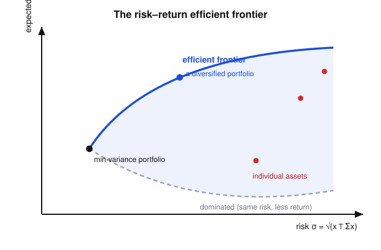

# Convex Optimization · Lesson 5.3: Portfolio optimization and optimal control

> ⏱ ~15 min · Module 5: Applications · Builds on: [Lesson 2.2](02-02-linear-quadratic-programs.md) (QP), [Lesson 2.3](02-03-second-order-cone-programs.md) (SOCP) · Unlocks: nothing — course complete

## Why this matters

Two of the most consequential engineering problems of the last seventy years — *how should I split money across risky assets?* and *how should I steer a system to a target without spending too much fuel?* — turn out to be the same convex program wearing different clothes: a quadratic cost over a linear structure. Markowitz won a Nobel for the first; the second (LQR) flies airplanes, lands rockets, and stabilizes power grids. Once you see both as a QP (Lesson 2.2), you can hand them to a solver and get a certified-global answer, and — via the duality of Module 3 — read a price off every constraint. This is the last lesson; by its end you'll have modeled a problem from *every* class on the conic ladder.

## The idea

**Portfolios: diversification is a quadratic.** You have a budget to spread across $n$ assets. Each asset has an expected return, but returns wobble, and — crucially — they wobble *together*: two tech stocks tend to rise and fall as one. Total portfolio risk is the *variance* of your blended return, and variance of a weighted sum is a quadratic form $x^\top\Sigma x$ in the weights $x$, where $\Sigma$ encodes how each pair of assets co-wobbles. Minimizing risk while demanding a floor on return is therefore a QP. The magic word is *diversification*: because of the cross terms in $\Sigma$, a mix of two risky assets can be less risky than either alone.

**Control: steering has a quadratic price too.** You have a system — a drone, a thermostat, a portfolio's rebalancing — whose state $x_t$ evolves as $x_{t+1}=Ax_t+Bu_t$ when you apply control $u_t$. You want to drive the state to zero (level flight, target temperature) but every nudge $u_t$ costs fuel. Charge a quadratic penalty for being off-target ($x_t^\top Q x_t$) and for the effort you spend ($u_t^\top R u_t$), sum over time, and minimize. The dynamics are *linear equalities*; the cost is *convex quadratic*. Same animal.

## The formal version

### Markowitz mean–variance portfolios

Let $x\in\mathbb{R}^n$ be the portfolio weights (fraction of wealth in each asset), $\mu\in\mathbb{R}^n$ the vector of expected returns, and $\Sigma\in\mathbb{R}^{n\times n}$ the return covariance matrix — symmetric and $\Sigma\succeq 0$ because it is a covariance (variances are never negative). The **minimum-variance-for-a-target-return** problem is

$$\min_{x}\ x^\top\Sigma x \quad\text{subject to}\quad \mu^\top x \ge r_{\min},\ \ \mathbf{1}^\top x = 1,\ \ x\succeq 0.$$

*In words:* find the least-jittery blend that still earns at least $r_{\min}$, spends exactly all your money ($\mathbf{1}^\top x=1$, where $\mathbf{1}$ is the all-ones vector), and never shorts ($x\succeq 0$, i.e. every weight nonnegative). This is a **QP**: convex quadratic objective (since $\Sigma\succeq 0$), linear constraints.

**The efficient frontier.** Now sweep $r_{\min}$ from small to large and re-solve each time. Each solution is a point in the $(\text{risk }\sigma,\ \text{return }\mu^\top x)$ plane with $\sigma=\sqrt{x^\top\Sigma x}$, and the trace of optimal points is the **efficient frontier**: for each level of return, the smallest achievable risk. Its leftmost tip is the global **minimum-variance portfolio** (drop the return constraint entirely).

**The risk-aversion form.** Instead of a hard return floor, price return directly against risk with a knob $\gamma\ge 0$:

$$\min_{x}\ x^\top\Sigma x - \gamma\,\mu^\top x \quad\text{subject to}\quad \mathbf{1}^\top x = 1,\ x\succeq 0.$$

*In words:* minimize risk minus $\gamma$ times return; large $\gamma$ = greedy for return (risk-tolerant), $\gamma=0$ = pure minimum-variance. Sweeping $\gamma\ge 0$ traces the *same* efficient frontier — this is just scalarizing the two-objective (risk down, return up) trade-off. Still a QP.

**Robust portfolios → an SOCP.** In reality you don't *know* $\mu$; you estimate it. Suppose the truth lies in an ellipsoid $\mathcal{U}=\{\bar\mu + Pu : \lVert u\rVert_2\le 1\}$ around your estimate $\bar\mu$. Demand the return floor in the *worst case*:

$$\min_{\mu\in\mathcal{U}}\ \mu^\top x \;=\; \bar\mu^\top x - \lVert P^\top x\rVert_2 \;\ge\; r_{\min}.$$

The worst-case return picks up a *Euclidean-norm penalty* $\lVert P^\top x\rVert_2$ — the more uncertain the estimate points along your holdings, the more return you must give up to be safe. Rearranged, $\bar\mu^\top x - r_{\min}\ge \lVert P^\top x\rVert_2$ is exactly a **second-order cone constraint** (Lesson 2.3): a Euclidean norm bounded above by an affine function. So a robust portfolio is an **SOCP**. (Derivation of the min: over $\lVert u\rVert_2\le1$, $\min_u u^\top(P^\top x)=-\lVert P^\top x\rVert_2$ by Cauchy–Schwarz.)

### Finite-horizon optimal control (LQR)

State $x_t\in\mathbb{R}^n$, control $u_t\in\mathbb{R}^m$, horizon $T$, given start $x_0$. With cost matrices $Q\succeq 0$ (penalize being off-target) and $R\succ 0$ (penalize effort):

$$\min_{x_1,\dots,x_T,\,u_0,\dots,u_{T-1}}\ \sum_{t=0}^{T-1}\big(x_t^\top Q x_t + u_t^\top R u_t\big) + x_T^\top Q_T x_T \quad\text{subject to}\quad x_{t+1}=Ax_t+Bu_t,\ \ t=0,\dots,T-1.$$

*In words:* choose the whole trajectory of states and controls to minimize total (tracking + effort) cost, subject to the physics. Stack every $x_t$ and $u_t$ into one giant vector $z$; the objective is $z^\top H z$ with $H\succeq 0$ block-diagonal, and the dynamics are one big linear equality $Fz=g$. This is a (large, sparse, equality-constrained) **QP** — the *Linear-Quadratic Regulator*. Because it is convex with linear equalities, the KKT conditions of Module 3 are *necessary and sufficient*, and solving them recursively backward in time is the classical Riccati recursion.

**Model-predictive control (MPC)** is LQR's receding-horizon cousin, and the reason convex optimization is *live* inside modern controllers. At each real time step: solve the finite-horizon QP above over the next $T$ steps, apply *only* the first control $u_0$, then slide the window forward one step and re-solve with the new measured state. Each solve is convex; you can bolt on hard constraints ($\lVert u_t\rVert_\infty\le u_{\max}$ actuator limits, $x_t$ safety boxes) and stay convex, which is precisely why MPC beats hand-tuned controllers when limits bite.

## Picture

Every attainable portfolio lives in the shaded bullet. The solid blue upper boundary is the **efficient frontier** — you would never hold a portfolio strictly inside it, because directly up (more return, same risk) or directly left (less risk, same return) is always available. Individual assets (red) sit *inside*, to the lower-right: diversification lets a blend dominate any single stock. The tip is the minimum-variance portfolio; the dashed lower boundary is dominated.

## Worked examples

**Example 1 (mechanical — a two-asset QP).** Two uncorrelated assets, $\mu=(0.10,\,0.20)$, $\Sigma=\begin{pmatrix}0.04 & 0\\ 0 & 0.16\end{pmatrix}$ (standard deviations $20\%$ and $40\%$). Find the minimum-variance portfolio. Write $x=(w,\,1-w)$, which builds in $\mathbf{1}^\top x=1$. Then

$$f(w)=x^\top\Sigma x = 0.04\,w^2 + 0.16\,(1-w)^2.$$

Set $f'(w)=0.08w-0.32(1-w)=0\Rightarrow 0.40w=0.32\Rightarrow w=0.8$. So the minimum-variance blend is $x=(0.8,\,0.2)$ — *mostly* the safe asset, but not all of it, because the volatile asset still shaves risk at the margin. Its return is $0.8(0.10)+0.2(0.20)=0.12$ and its variance is $0.04(0.64)+0.16(0.04)=0.032$, i.e. $\sigma\approx 0.179$ — a lower std than the $0.20$ of the safe asset *alone*. That is diversification, computed.

**Example 2 (why you'd care — the smallest LQR).** Scalar state, one control step. Dynamics $x_1=x_0+u_0$, start $x_0=1$, cost $J(u_0)=q\,x_1^2 + r\,u_0^2$ with $q,r>0$. Substituting the dynamics *eliminates the state*, turning the equality-constrained QP into a one-variable unconstrained QP:

$$J(u_0)=q\,(1+u_0)^2 + r\,u_0^2,\qquad J'(u_0)=2q(1+u_0)+2r\,u_0=0 \ \Rightarrow\ u_0^\star=-\frac{q}{q+r}.$$

Then $x_1^\star = 1+u_0^\star = \dfrac{r}{q+r}$. Read the knobs: if control is cheap ($r\to0$) you drive the state fully to zero ($u_0^\star\to-1$); if control is expensive ($r\to\infty$) you barely move ($u_0^\star\to0$). With $q=1,r=3$: $u_0^\star=-\tfrac14$, $x_1^\star=\tfrac34$. The "eliminate the states" trick is exactly how the big LQR QP is condensed before solving.

## Watch out

- **$\Sigma\succeq 0$, not $\succ 0$.** Covariance matrices are only *positive semidefinite* (a redundant asset — one that's a combination of others — makes $\Sigma$ singular). The QP is still convex, but the minimizer need not be unique. You get uniqueness only when $\Sigma\succ 0$.
- **The efficient frontier is only the *upper* arc.** The minimum-variance portfolio sits at the leftmost tip; every point on the lower boundary has a point directly above it with the same risk and more return, so it is dominated. "Minimum-variance" $\ne$ "efficient" — the min-variance point is efficient, but most of that lower curve is not.
- **Robust $\ne$ just more variance.** The worst-case term $\lVert P^\top x\rVert_2$ comes from *estimation uncertainty in $\mu$*, a different object from the *return variance* $x^\top\Sigma x$. One is an SOC (norm) term, the other a quadratic; a full robust Markowitz model can carry both.
- **MPC is convex each step, but the closed loop is not "one QP".** You solve a fresh QP at every time step and discard all but the first move. Adding constraints keeps each solve convex *only* if those constraints are convex — a nonconvex obstacle (avoid a region) breaks it.

## One-liner

> Quadratic cost over linear structure is a QP — so "diversify a portfolio" and "steer a system cheaply" are the same solvable problem, and a norm of uncertainty turns either one into an SOCP.

## Problems

**P1 (🟢)** Using the same two assets as Example 1 ($\mu=(0.10,0.20)$, $\Sigma=\operatorname{diag}(0.04,0.16)$), solve the risk-aversion form $\min_x\ x^\top\Sigma x-\gamma\,\mu^\top x$ subject to $\mathbf{1}^\top x=1$. Write $x=(w,1-w)$, find $w^\star$ as a function of $\gamma$, and evaluate it at $\gamma=0.5$ and $\gamma=2$. Confirm $\gamma=0$ recovers Example 1, and say in one sentence which direction along the frontier increasing $\gamma$ moves you.

**P2 (🟡)** A two-step scalar LQR. Dynamics $x_{t+1}=x_t+u_t$ for $t=0,1$, start $x_0=1$, terminal-only cost $J=x_2^2 + r\,(u_0^2+u_1^2)$ with $r=2$. Set it up as a QP, eliminate the states, and find the optimal $u_0^\star,u_1^\star$, the resulting $x_2^\star$, and the optimal cost. *(Hint: let $s=u_0+u_1$; for fixed $s$, the cheapest split of effort is the symmetric one.)*

**P3 (🔴, optional — the modeling reflex)** A fund wants the minimum-variance portfolio $\min_x x^\top\Sigma x$ subject to $\mathbf{1}^\top x=1$, $\mu^\top x\ge r_{\min}$, **and** a turnover cap $\lVert x-x^{\text{old}}\rVert_2\le\delta$ limiting how far it drifts from last month's holdings $x^{\text{old}}$. What is the *tightest* standard problem class on the conic ladder (LP $\subseteq$ QP $\subseteq$ SOCP $\subseteq$ SDP) that fits, and why? Show the reformulation into that class.

Solutions

**P1** With $x=(w,1-w)$ the objective is
$$g(w)=0.04w^2+0.16(1-w)^2-\gamma\big[0.10w+0.20(1-w)\big].$$
Differentiate: $g'(w)=0.08w-0.32(1-w)+0.10\gamma = 0.40w-0.32+0.10\gamma$. Setting $g'(w)=0$,
$$w^\star=\frac{0.32-0.10\gamma}{0.40}=0.8-0.25\gamma.$$
At $\gamma=0.5$: $w^\star=0.675$. At $\gamma=2$: $w^\star=0.30$. At $\gamma=0$: $w^\star=0.8$, exactly Example 1's minimum-variance portfolio. ✓ Increasing $\gamma$ shifts weight *out* of the safe asset into the high-return, high-risk asset — i.e. it moves you **up and to the right along the efficient frontier** (more return, more risk). (Both values keep $x\succeq0$, so the no-short constraint is slack and the elimination is valid.)

**P2** Stacking $z=(x_1,x_2,u_0,u_1)$, the cost is $z^\top H z$ with $H=\operatorname{diag}(0,1,r,r)$, and the dynamics $x_1=x_0+u_0$, $x_2=x_1+u_1$ are the linear equalities — a QP. Eliminate the states: $x_2=x_0+u_0+u_1=1+s$ with $s:=u_0+u_1$. For a fixed sum $s$, minimizing $u_0^2+u_1^2$ subject to $u_0+u_1=s$ gives the symmetric split $u_0=u_1=s/2$, so $u_0^2+u_1^2=s^2/2$. Then
$$J(s)=(1+s)^2+\frac{r}{2}\,s^2,\qquad J'(s)=2(1+s)+r\,s=0\ \Rightarrow\ s=\frac{-2}{2+r}.$$
With $r=2$: $s=-\tfrac12$, so $u_0^\star=u_1^\star=-\tfrac14$ and $x_2^\star=1+s=\tfrac12$. The optimal cost is
$$J^\star=(x_2^\star)^2 + r\big[(u_0^\star)^2+(u_1^\star)^2\big]=\left(\tfrac12\right)^2 + 2\left[\left(\tfrac14\right)^2+\left(\tfrac14\right)^2\right]=0.25 + 2(0.125)=0.5.$$
Effort is spread evenly across the two steps, and because control is expensive ($r=2$) the optimal policy leaves a residual $x_2^\star=\tfrac12$ rather than driving the state fully to zero.

**P3** The objective $x^\top\Sigma x$ is convex quadratic and the turnover cap is a genuine Euclidean-norm constraint, so the tightest fit is an **SOCP** (strictly above QP because of the norm ball; well below SDP). Reformulate by epigraphing the quadratic objective and keeping the norm constraint as an SOC constraint:
$$\min_{x,t}\ t \quad\text{s.t.}\quad \lVert \Sigma^{1/2}x\rVert_2^2\le t,\ \ \lVert x-x^{\text{old}}\rVert_2\le\delta,\ \ \mathbf{1}^\top x=1,\ \ \mu^\top x\ge r_{\min},$$
where $\Sigma^{1/2}$ is a PSD square root ($\Sigma=\Sigma^{1/2}\Sigma^{1/2}$). The first constraint $\lVert\Sigma^{1/2}x\rVert_2^2\le t$ is a *rotated* second-order cone (equivalently $\big\lVert(2\Sigma^{1/2}x,\ t-1)\big\rVert_2\le t+1$), and the turnover cap is a plain SOC constraint; the rest are linear. Every piece is SOC-representable, so this is an SOCP.

## Flashback

**From [Lesson 2.3](02-03-second-order-cone-programs.md) (Second-order cone programs):** Show that the constraint $\lVert A x - b\rVert_2 \le c^\top x + d$ (with $A\in\mathbb{R}^{m\times n}$, $b\in\mathbb{R}^m$, $c\in\mathbb{R}^n$, $d\in\mathbb{R}$, and $x$ the decision variable) is a second-order cone constraint, and explain why it is convex.

Solution

Recall the second-order (ice-cream) cone $\mathcal{Q}^{m+1}=\{(y,s)\in\mathbb{R}^m\times\mathbb{R} : \lVert y\rVert_2\le s\}$, which is convex. Define the affine map
$$x \longmapsto \big(Ax-b,\ \ c^\top x + d\big)\in\mathbb{R}^m\times\mathbb{R}.$$
The constraint $\lVert Ax-b\rVert_2\le c^\top x+d$ says exactly that this image lies in $\mathcal{Q}^{m+1}$. So the feasible set is the **preimage of the convex cone $\mathcal{Q}^{m+1}$ under an affine map**, and preimages of convex sets under affine maps are convex — hence the constraint is convex and is, by definition, a second-order cone constraint. (Note the right side must be *affine*, not merely nonnegative: $\lVert Ax-b\rVert_2\le \lVert Cx-e\rVert_2$ would generally be nonconvex.) This is precisely the shape the robust-return constraint $\bar\mu^\top x - r_{\min}\ge\lVert P^\top x\rVert_2$ took in this lesson.

## Connections

- **Backward:** this lesson is Module 2 cashed out — the portfolio QP is [Lesson 2.2](02-02-linear-quadratic-programs.md), the robust portfolio and the turnover cap are [Lesson 2.3](02-03-second-order-cone-programs.md), and the LQR is a large sparse QP whose KKT system (Module 3) is the Riccati recursion. With it, the syllabus's **Dangerous Checklist is now fully covered**: you can recognize a problem, place it on the LP $\subseteq$ QP $\subseteq$ SOCP $\subseteq$ SDP ladder, dualize it, and solve it.
- **Forward / sideways (statistical learning):** convex optimization is the *engine* under [statistical-learning](../../statistical-learning/syllabus.md). Mean–variance portfolios and ridge/lasso (Lesson [5.1](05-01-least-squares-lasso.md)) share the same quadratic-plus-penalty skeleton, and MPC's repeated re-solving is the online-learning loop in miniature.
- **Sideways (economics & game theory):** the Lagrange multiplier on the budget constraint $\mathbf{1}^\top x=1$ is the **shadow price of wealth** — the same object as the marginal utility of income in the constrained consumer problem of [grad-micro](../../grad-micro/syllabus.md), and the multiplier / best-response price of [grad-game-theory](../../grad-game-theory/syllabus.md). Complementary slackness (Module 3) is why a no-short constraint $x_i\ge0$ only "charges" you when it binds — an asset you're forbidden to short but wouldn't buy anyway costs you nothing.
