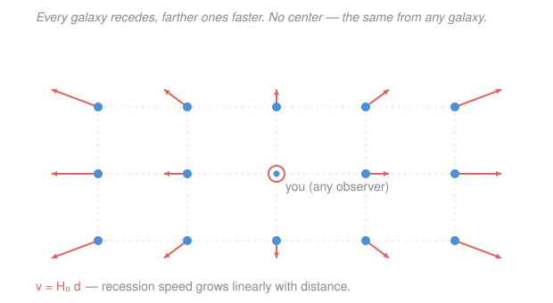

# Cosmology · Lesson 1.1: The cosmological principle and Hubble's law

> ⏱ ~15 min · Module 1: The expanding universe and the Friedmann equations · Builds on: [relativity](../../relativity/syllabus.md) · Unlocks: [1.2 The FLRW metric and comoving coordinates](01-02-flrw-metric-comoving-coordinates.md)

## Why this matters

Cosmology tries to do something absurd: write down the physics of *the entire universe* as one system. That's only possible because of a single simplifying observation — on large enough scales the universe looks the same everywhere and in every direction. That assumption, the **cosmological principle**, is the load-bearing wall of the whole subject: it is what lets us use one scale factor, one set of Friedmann equations, one energy budget for everything. In this first lesson we take that principle and squeeze a hard prediction out of it with almost no machinery — that the universe must be expanding according to a *linear* velocity law, $v = H_0 d$. Edwin Hubble measured exactly that in 1929, and it remains the most direct evidence that we live in an evolving, finite-age cosmos.

## The idea

Zoom out far enough — past individual stars, past galaxies, past clusters of galaxies — and the lumpiness averages out. Beyond about $100$ megaparsecs ($1\ \mathrm{Mpc} \approx 3.26$ million light years) any big box of the universe holds roughly the same number of galaxies, the same average density, as any other. Two claims are hiding in that sentence, and they're different:

- **Homogeneous** — the same at every *place*. Slide to another location and the average scene is unchanged. (No special spots.)
- **Isotropic** — the same in every *direction*. Turn around and the average scene is unchanged. (No special directions.)

They're genuinely independent. A universe with a constant density gradient — denser to the left, thinner to the right — is homogeneous nowhere-special in a loose sense but *not* isotropic (left looks different from right). A universe of nested spherical shells around one center is isotropic *from that center* but not homogeneous (move off-center and it stops looking round). The neat fact that stitches them together: **if the universe looks isotropic from every point, it must be homogeneous.** (Isotropy about you plus isotropy about your neighbor, repeated across all observers, forbids any place from being special.)

Now the punchline. Suppose this homogeneous universe is expanding — every galaxy drifting away from every other. What velocity pattern is *allowed*? Here's the raisin-bread image: a lump of dough with raisins baking in the oven. As the dough swells, every raisin moves apart from every other. Sit on any raisin and watch: nearby raisins drift away slowly, far raisins drift away fast, and the drift speed is *exactly proportional* to distance — because there's twice as much expanding dough between you and a raisin twice as far. And crucially, *every* raisin sees the identical picture. No raisin is the center. That proportional-to-distance drift is Hubble's law, and the next section shows it's the *only* law consistent with homogeneity.

## The formal version

**The cosmological principle.** Averaged over scales $\gtrsim 100\ \mathrm{Mpc}$, the spatial distribution of matter is **homogeneous** (invariant under translations — no preferred location) and **isotropic** (invariant under rotations about any point — no preferred direction). *In words: on the largest scales, no place and no direction is special.*

**Deriving Hubble's law.** Let $\mathbf v(\mathbf r)$ be the recession velocity we measure for a galaxy at position $\mathbf r$ relative to us (we sit at the origin). We want the *form* of $\mathbf v(\mathbf r)$ forced by homogeneity. Take three galaxies: us at $\mathbf 0$, galaxy A at $\mathbf r_1$, and galaxy B at $\mathbf r_1 + \mathbf r_2$ (so B sits at $\mathbf r_2$ *as seen from A*). Homogeneity says an observer on A measures recession by the *same* law $\mathbf v(\cdot)$ that we do — the laws of the universe can't depend on which galaxy you're standing on. Ordinary (Galilean) velocity addition then gives B's velocity in our frame as B's velocity in A's frame plus A's velocity in ours:

$$\mathbf v(\mathbf r_1 + \mathbf r_2) = \mathbf v(\mathbf r_2) + \mathbf v(\mathbf r_1).$$

*In words: the recession law must be additive — the velocity to a far galaxy equals the sum of velocities across each leg of the trip.* This is **Cauchy's functional equation**, and its only continuous solutions are *linear*: $\mathbf v(\mathbf r) = \mathsf{H}\,\mathbf r$ for some fixed matrix $\mathsf H$. Isotropy then kills every off-diagonal and anisotropic piece of $\mathsf H$ (no direction can be special), leaving a single scalar multiple of the identity, $\mathsf H = H_0 \mathbb{1}$:

$$\boxed{\;\mathbf v = H_0\,\mathbf r \quad\Longleftrightarrow\quad v = H_0\, d\;}$$

*In words: recession speed is proportional to distance, with one universal constant of proportionality.* This is **Hubble's law**; $H_0$ is the **Hubble constant** (the "$0$" flags *today's* value — it changes over cosmic time, so in general it's the Hubble parameter $H(t)$, the subject of [1.2](01-02-flrw-metric-comoving-coordinates.md)). Any *non*-linear law would fail additivity, and a law that wasn't $\propto \mathbf r$ would single out a center — contradicting homogeneity. Linear expansion is the unique center-free option.

**Units and numbers.** $H_0$ carries units of velocity per distance, i.e. inverse time, but is quoted in the observer-friendly mix

$$H_0 \approx 70\ \frac{\mathrm{km/s}}{\mathrm{Mpc}}.$$

*In words: a galaxy one Mpc away recedes at about $70$ km/s, one at two Mpc at about $140$ km/s, and so on.* The true value is under active dispute — "early-universe" determinations (from the CMB) give $\approx 67$, "local" ladder measurements give $\approx 73$, and this $\sim 5\text{–}9\%$ gap is the **Hubble tension** (we return to it in [4.5](04-05-cosmic-distance-ladder-observational.md)). Because $H_0$ is an inverse time and inverse length, it hands us two natural scales for the universe:

$$t_H \equiv \frac{1}{H_0} \approx 14\ \mathrm{Gyr}, \qquad d_H \equiv \frac{c}{H_0} \approx 4300\ \mathrm{Mpc}.$$

$t_H$ is the **Hubble time** (a rough age of the universe — the time since everything was on top of everything else, *if* expansion had been constant), and $d_H$ is the **Hubble distance** or **Hubble radius**. The conversions are worked in Example 1 and Problem 1.

**Expansion is not motion through space.** This is the subtle heart of the lesson. Galaxies are (very nearly) *at rest* — their coordinates on the raisin-bread grid don't change. What grows is the *dough between them*: space itself stretches, carrying galaxies apart. These fixed grid labels are **comoving coordinates** ([1.2](01-02-flrw-metric-comoving-coordinates.md)). The redshift of distant galaxies is therefore *not* a Doppler shift of something flying through space toward or away from us; it's the wavelength of light being **stretched along with space** as it travels ([1.3](01-03-redshift-cosmic-distances.md)). Real galaxies do also have small **peculiar velocities** — genuine local motions through space, $v_{\rm pec} \sim$ a few hundred km/s, from the gravitational tug of neighbors — riding on top of the smooth Hubble flow. On large scales the Hubble term $H_0 d$ swamps them.

One consequence looks paranormal but isn't: for $d > d_H$, Hubble's law gives $v = H_0 d > c$. **Distant galaxies recede faster than light.** No relativity is violated, because special relativity's speed limit applies to motion *through* space in a local frame — and no galaxy moves through its own local space at all. Stretching space has no such cap.

## Picture

## Worked examples

**Example 1 (mechanical — the two Hubble scales).** Take $H_0 = 70\ \mathrm{km\,s^{-1}\,Mpc^{-1}}$. First strip it to pure inverse-time using $1\ \mathrm{Mpc} = 3.086\times 10^{19}\ \mathrm{km}$:

$$H_0 = \frac{70\ \mathrm{km/s}}{3.086\times 10^{19}\ \mathrm{km}} = 2.27\times 10^{-18}\ \mathrm{s^{-1}}.$$

The Hubble time is its reciprocal, converted to years with $1\ \mathrm{yr} = 3.156\times 10^{7}\ \mathrm{s}$:

$$t_H = \frac{1}{H_0} = 4.41\times 10^{17}\ \mathrm{s} = \frac{4.41\times10^{17}}{3.156\times10^{7}}\ \mathrm{yr} = 1.40\times 10^{10}\ \mathrm{yr} \approx 14\ \mathrm{Gyr}.$$

The Hubble distance uses $c = 3.0\times 10^5\ \mathrm{km/s}$:

$$d_H = \frac{c}{H_0} = \frac{3.0\times 10^5\ \mathrm{km/s}}{70\ \mathrm{km\,s^{-1}\,Mpc^{-1}}} = 4.3\times 10^3\ \mathrm{Mpc}.$$

Notice these are consistent: $d_H = c\,t_H$, a light-travel distance of $\sim 14$ billion light years. The universe's real age ($13.8$ Gyr) is startlingly close to $t_H$ — a coincidence that the $\Lambda$CDM budget ([1.5](01-05-cosmic-energy-budget-lambda-cdm.md)) explains, since the universe spent time both decelerating and accelerating and the two nearly cancel.

**Example 2 (why you'd care — no center, from any raisin).** Suppose galaxy A, at distance $d_A$ from us, sees *us* receding at $v_A = H_0 d_A$ — as it must, since our velocities are equal and opposite. Now A looks at a third galaxy B, which we see at position $\mathbf r_B$. In A's frame B sits at $\mathbf r_B - \mathbf r_A$, and A (using the same $H_0$) measures its recession as $H_0(\mathbf r_B - \mathbf r_A)$. Does this agree with what *we* see for B, namely $H_0 \mathbf r_B$? Add A's own recession to what A measures:

$$\underbrace{H_0(\mathbf r_B - \mathbf r_A)}_{\text{B relative to A}} + \underbrace{H_0 \mathbf r_A}_{\text{A relative to us}} = H_0 \mathbf r_B = \underbrace{\mathbf v_B}_{\text{B relative to us}}. \checkmark$$

Everything is consistent, and *nowhere* did we use that we're special — the same algebra runs from any galaxy. This is exactly why the raisin-bread expansion has no center: linearity makes every observer the apparent hub of the outflow.

## Watch out

- **You might think Hubble's law means we're at the center of the universe** — everything rushes away from *us*. But Example 2 shows every galaxy sees the identical outflow. Recession-from-everywhere is the signature of expanding space with *no* center, not of us sitting at one.
- **You might read cosmological redshift as a Doppler shift** of galaxies hurtling through space. It isn't: galaxies sit nearly still on the comoving grid, and their light is stretched because the space it crosses stretches. (This is why the "velocity" in $v = H_0 d$ is a recession *rate of the expanding grid*, not a speedometer reading — and why it can legally exceed $c$.)
- **You might think superluminal recession ($v > c$ beyond $d_H$) violates relativity.** It doesn't — special relativity forbids *local* motion through space faster than light. No galaxy exceeds $c$ relative to the space right next to it; the distances simply add up faster than $c$ across a stretching manifold.
- **You might conflate homogeneity and isotropy.** Isotropy is about directions, homogeneity about places. A radial density profile is isotropic-from-the-center but inhomogeneous; only isotropy *about every point* delivers homogeneity.

## One-liner

> Homogeneity forces the expansion velocity field to be linear, $v = H_0 d$ — the one center-free law — where space itself stretches (redshift isn't Doppler, and $v > c$ is allowed) at a rate set by $H_0 \approx 70\ \mathrm{km/s/Mpc}$, i.e. a Hubble time of $\sim 14$ Gyr.

## Problems

**P1 (🟢)** With $H_0 = 70\ \mathrm{km\,s^{-1}\,Mpc^{-1}}$: (a) find the recession velocity of a galaxy at distance $100\ \mathrm{Mpc}$; (b) reproduce the Hubble time in Gyr from $t_H = 1/H_0$, showing the unit conversions.

**P2 (🟡)** Homogeneity forces linearity. Model the recession speed as a scalar function $v(\mathbf r)$ of position. Assuming every observer measures galaxies with the *same* law and that ordinary velocity addition holds, argue that $v(\mathbf r_1 + \mathbf r_2) = v(\mathbf r_1) + v(\mathbf r_2)$, and explain why this (with continuity and isotropy) forces $\mathbf v = H_0\mathbf r$. Then show explicitly that a *quadratic* law $v \propto d^2$ would let a distant observer identify a unique center.

**P3 (🔴)** Estimate the distance $d_H$ at which the recession velocity equals the speed of light, using $H_0 = 70\ \mathrm{km\,s^{-1}\,Mpc^{-1}}$ and $c = 3.0\times 10^5\ \mathrm{km/s}$. Galaxies beyond $d_H$ recede faster than light — explain in one or two sentences why this does not violate special relativity, and whether we can still see any of them.

Solutions

**P1** (a) Direct application of $v = H_0 d$:

$$v = 70\ \frac{\mathrm{km/s}}{\mathrm{Mpc}} \times 100\ \mathrm{Mpc} = 7000\ \mathrm{km/s}.$$

(That's $\approx 0.023\,c$ — safely non-relativistic, so a plain $v = H_0 d$ is fine here.)

(b) Convert $H_0$ to inverse seconds with $1\ \mathrm{Mpc} = 3.086\times 10^{19}\ \mathrm{km}$:

$$H_0 = \frac{70}{3.086\times 10^{19}}\ \mathrm{s^{-1}} = 2.27\times 10^{-18}\ \mathrm{s^{-1}}, \qquad t_H = \frac{1}{H_0} = 4.41\times 10^{17}\ \mathrm{s}.$$

Then with $1\ \mathrm{yr} = 3.156\times 10^{7}\ \mathrm{s}$:

$$t_H = \frac{4.41\times 10^{17}}{3.156\times 10^{7}}\ \mathrm{yr} = 1.40\times 10^{10}\ \mathrm{yr} = 14.0\ \mathrm{Gyr}.$$

*Check.* Units: $(\mathrm{km/s})/\mathrm{km} = \mathrm{s^{-1}}$ ✓; reciprocal gives seconds, converted to Gyr ✓. A larger $H_0$ (faster expansion) would give a *shorter* Hubble time — a younger universe — as it should.

**P2** Put us at the origin, galaxy A at $\mathbf r_1$, galaxy B at $\mathbf r_1 + \mathbf r_2$ (so B is at $\mathbf r_2$ relative to A). Homogeneity means the universe has no special location, so an observer on A applies the *same* recession law $\mathbf v(\cdot)$ we do. Velocity addition gives B's velocity in our frame as (B relative to A) + (A relative to us):

$$\mathbf v(\mathbf r_1 + \mathbf r_2) = \mathbf v(\mathbf r_2) + \mathbf v(\mathbf r_1).$$

This is Cauchy's functional equation; its only continuous solutions are linear, $\mathbf v(\mathbf r) = \mathsf H \mathbf r$ for a constant matrix $\mathsf H$. Isotropy forbids any preferred direction, so $\mathsf H$ must be a scalar times the identity, $\mathsf H = H_0\mathbb 1$, giving $\mathbf v = H_0 \mathbf r$.

Why a quadratic law breaks: suppose instead $v = \alpha d^2$ (speed grows as distance squared, measured from us). Test additivity along a line: a galaxy at distance $d_1 + d_2$ would need $\alpha(d_1+d_2)^2 = \alpha d_1^2 + \alpha d_2^2$, i.e. $2\alpha d_1 d_2 = 0$ — false for any nonzero distances. So a distant observer would *not* see the same law and could, by comparing recession speeds in different directions, triangulate the one point about which $v \propto d^2$ holds: a unique center. Homogeneity forbids a center, so only the linear law survives.

*Check.* The additivity test is exactly the raisin-bread consistency of Example 2; only $v \propto d$ passes it, matching the boxed result.

**P3** Set $v = c$ in Hubble's law and solve for distance:

$$d_H = \frac{c}{H_0} = \frac{3.0\times 10^5\ \mathrm{km/s}}{70\ \mathrm{km\,s^{-1}\,Mpc^{-1}}} = 4.3\times 10^3\ \mathrm{Mpc} \approx 4300\ \mathrm{Mpc}$$

(about $14$ billion light years). Beyond this Hubble radius, $v = H_0 d > c$. No violation: special relativity caps the speed of *local motion through space* in any inertial frame, but these galaxies are essentially at rest in their own local space — it is the intervening space that stretches, and there is no relativistic speed limit on the expansion of space itself. And yes, we can still see some galaxies that are *currently* beyond $d_H$: the light we receive today was emitted long ago when they were much closer, and the boundary of what we can ever see (the cosmological horizon) is a separate, subtler surface than the instantaneous Hubble radius.

*Check.* $d_H = c/H_0 = c\,t_H$, consistent with Example 1's $\sim 14$ Gly, and $d_H \gg 100\ \mathrm{Mpc}$, so the cosmological principle's averaging scale sits comfortably inside the observable universe. ✓

## Connections

- **Forward:** [1.2](01-02-flrw-metric-comoving-coordinates.md) promotes "space stretches" from a slogan to geometry — the FLRW metric with its single scale factor $a(t)$ and comoving coordinates — and turns the constant $H_0$ into the time-varying Hubble parameter $H(t) = \dot a / a$. Redshift as stretched light gets its formula $1 + z = a_0/a$ in [1.3](01-03-redshift-cosmic-distances.md), and the dynamics of $a(t)$ — *why* it expands and how fast — come from the Friedmann equations in [1.4](01-04-friedmann-fluid-acceleration-equations.md).
- **Backward (relativity):** the cosmological principle is what makes the general-relativistic problem tractable — homogeneity and isotropy collapse the full metric down to the FLRW form you first met at the end of [relativity](../../relativity/syllabus.md). Everything here is the physical, coordinate-light preview of that geometry.
- **Sideways:** the Hubble tension previewed here ($67$ vs $73$) is a live measurement clash between the early-universe CMB inference and the local distance ladder — the observational thread we pick up in [4.5](04-05-cosmic-distance-ladder-observational.md). The additivity argument for linearity is the same "no preferred origin" symmetry reasoning that underlies inertial frames in special relativity.
