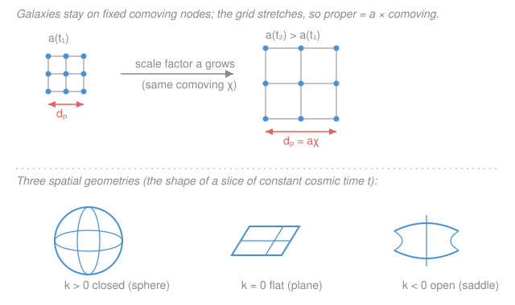

# Cosmology · Lesson 1.2: The FLRW metric and comoving coordinates

> ⏱ ~15 min · Module 1: The expanding universe and the Friedmann equations · Builds on: [1.1 The cosmological principle and Hubble's law](01-01-cosmological-principle-hubble-law.md), [`relativity` (the spacetime metric)](../../relativity/syllabus.md) · Unlocks: [1.3 Redshift and cosmic distances](01-03-redshift-cosmic-distances.md)

## Why this matters

In [1.1](01-01-cosmological-principle-hubble-law.md) we *observed* that galaxies recede with $v = H_0 d$ and *posited* that the universe is homogeneous and isotropic. That's a description, not a theory. This lesson gives us the object that turns those words into equations: the **FLRW metric** (Friedmann–Lemaître–Robertson–Walker), the one spacetime consistent with the cosmological principle. From it, Hubble's law stops being an observed fact and becomes a *theorem* — the time-derivative of a single geometric statement. Every later result — redshift ([1.3](01-03-redshift-cosmic-distances.md)), the Friedmann equations ([1.4](01-04-friedmann-fluid-acceleration-equations.md)), the age and fate of the universe — is bookkeeping on this one metric.

## The idea

Think of space as an infinite rubber grid with galaxies painted on as dots. As the universe expands, the *grid itself* stretches, carrying the dots apart — but each dot keeps the same grid label it was born with. Those fixed labels are **comoving coordinates**. A galaxy sitting still on the grid never changes its comoving position, even as every other galaxy drifts away from it. Nothing is moving *through* space; space is growing *between* things.

All the stretching is bundled into a single number that depends only on time: the **scale factor** $a(t)$. If two galaxies are a comoving distance $\chi$ apart on the grid, their *actual* (proper) separation right now is $a(t)\,\chi$ — the grid label times the current stretch. Double $a$ and you double every real distance at once. That's the whole engine of cosmic expansion: one clock-driven zoom knob multiplying a frozen map.

The only freedom left is the *shape* of the frozen map. Homogeneity and isotropy allow exactly three: flat (an ordinary grid), closed (the surface of a sphere, finite and curving back on itself), or open (an endless saddle). A single constant $k$ picks which.

## The formal version

A **metric** tells you the true spacetime interval $ds$ between two nearby events from their coordinate differences — the generalization of Pythagoras to curved, relativistic spacetime (see [`relativity`](../../relativity/syllabus.md)). Demanding that space be homogeneous (same everywhere) and isotropic (same in every direction) at each instant forces the metric into a unique form, the **FLRW metric**:

$$ds^2 = -c^2\,dt^2 + a(t)^2\left[\frac{dr^2}{1 - kr^2} + r^2\,d\Omega^2\right], \qquad d\Omega^2 = d\theta^2 + \sin^2\theta\,d\phi^2.$$

*In words: the interval splits into a time part ($-c^2 dt^2$) and a space part, and the entire space part is scaled by the single time-dependent factor $a(t)^2$.* Every symbol:

- $t$ — **cosmic time** (also proper time), the clock read by an observer who sits still on the grid. $c$ is the speed of light.
- $a(t)$ — the **scale factor**: dimensionless, and normalized so that *today* $a_0 \equiv a(t_0) = 1$. It measures how stretched space is relative to now; $a = 0.5$ means every distance was half its present value.
- $r$ — the **comoving radial coordinate**, the frozen grid label. A galaxy carried only by expansion keeps $r$ fixed forever.
- $k$ — the **curvature constant**, the same value everywhere: $k > 0$ closed, $k = 0$ flat, $k < 0$ open.
- $\theta, \phi$ — ordinary angular coordinates on the sky; $d\Omega^2$ is the angular piece (an infinitesimal patch of a unit sphere).

**Scale factor sets all distances.** For two comoving points separated by comoving distance $\chi$ (the accumulated radial coordinate distance along the grid), the **proper distance** — what a chain of rulers laid end to end at one instant would read — is

$$d_p(t) = a(t)\,\chi.$$

*In words: proper distance is the frozen comoving distance times the current stretch.* Because $a_0 = 1$, the proper distance *today* equals the comoving distance itself: $d_p(t_0) = \chi$. That's the point of the normalization — comoving distance is just "proper distance measured in today's units."

**The Hubble parameter is the expansion rate.** Define

$$H(t) \equiv \frac{\dot a(t)}{a(t)}, \qquad \dot a \equiv \frac{da}{dt}, \qquad H_0 \equiv H(t_0).$$

*In words: $H$ is the fractional growth rate of the scale factor — the percent-per-unit-time that every distance is currently swelling.* Now watch Hubble's law fall out. A comoving galaxy has fixed $\chi$, so differentiating $d_p = a\chi$ in time (with $\chi$ constant):

$$\dot d_p = \dot a\,\chi = \frac{\dot a}{a}\,(a\chi) = H\,d_p.$$

*In words: the recession speed of a galaxy equals $H$ times its proper distance* — exactly Hubble's law $v = H d$ from [1.1](01-01-cosmological-principle-hubble-law.md), now **derived** rather than assumed. The linearity of $v$ in $d$ is not a coincidence to be fit; it is the unavoidable signature of a metric whose space part scales uniformly.

**The three geometries.** The constant $k$ fixes the shape of a slice of constant $t$:

| $k$ | geometry | spatial slice | angles of a triangle |
|---|---|---|---|
| $k>0$ | closed | sphere (finite, unbounded) | sum $> 180^\circ$ |
| $k=0$ | flat | ordinary plane (infinite) | sum $= 180^\circ$ |
| $k<0$ | open | saddle / hyperbolic (infinite) | sum $< 180^\circ$ |

Only the *sign* of $k$ is physical: you can rescale $r$ and absorb the units of $|k|$ into $a(t)$, conventionally setting $k \in \{+1, 0, -1\}$. Which case we live in is a measurement — and the answer ([1.5](01-05-cosmic-energy-budget-lambda-cdm.md)) is very nearly $k = 0$.

**Comoving observers.** An observer at fixed $(r,\theta,\phi)$ is a **comoving** (or **fundamental**) observer. Two facts define them: (1) their proper time is exactly cosmic time $t$ — the metric has no cross terms and a plain $-c^2dt^2$, so a clock at fixed spatial coordinate ticks $t$ directly; (2) they see the cosmic microwave background as isotropic (no dipole). Our own motion relative to this frame shows up as a small CMB dipole — we are *not* quite comoving, but we can correct for it.

## Picture

## Worked examples

**Example 1 (mechanical — read off the distances).** Two galaxies sit at a fixed comoving separation $\chi = 400$ Mpc. Today ($a_0 = 1$) their proper separation is

$$d_p(t_0) = a_0\,\chi = 1 \times 400 = 400\ \text{Mpc}.$$

When the universe was half its present size, $a = 0.5$, the *same* two galaxies (same $\chi$ — they never moved on the grid) were

$$d_p = a\,\chi = 0.5 \times 400 = 200\ \text{Mpc}$$

apart. The galaxies did nothing; the grid did everything. This is the entire logic of "the universe was smaller in the past": rewind $a$, and every proper distance shrinks in lockstep.

**Example 2 (why you'd care — the expansion rate).** Suppose at the present epoch $a_0 = 1$ and the scale factor is growing at $\dot a_0 = 0.0716\ \text{Gyr}^{-1}$. Then

$$H_0 = \frac{\dot a_0}{a_0} = \frac{0.0716}{1} = 0.0716\ \text{Gyr}^{-1} \approx 70\ \frac{\text{km/s}}{\text{Mpc}},$$

the measured Hubble constant. A galaxy at proper distance $d_p = 100$ Mpc therefore recedes at $v = H_0 d_p = 70 \times 100 = 7000$ km/s — no galaxy "chose" to move; its recession is just its share of the universal stretch. Notice $H$ carries units of inverse time: $1/H_0 \approx 14$ Gyr is a first, rough estimate of the age of the universe (the time to expand from a point at today's rate).

## Watch out

- **You might think galaxies fly through space like debris from an explosion.** They don't — comoving galaxies sit *still* on the grid; it's the grid between them that grows. There's no center and no edge, and recession speeds can exceed $c$ for distant enough galaxies without violating relativity, because nothing is moving *through* space faster than light.
- **You might read $k$'s magnitude as physical.** Only its *sign* is: $|k|$ can be rescaled away into $a$, so "$k = 1$" vs "$k = 5$" is a units choice, not a different universe. Flat, closed, open — three cases, not a continuum of curvatures at fixed convention.
- **You might conflate comoving and proper distance.** Comoving distance $\chi$ is a fixed label; proper distance $a\chi$ changes with time. They coincide *only today* because we defined $a_0 = 1$. Quote a distance without saying which one, and factors of $a$ will bite you in [1.3](01-03-redshift-cosmic-distances.md).

## One-liner

> Homogeneity + isotropy force one metric, $ds^2 = -c^2dt^2 + a(t)^2[\,dr^2/(1-kr^2) + r^2d\Omega^2\,]$; galaxies hold fixed comoving coordinates while $a(t)$ stretches every distance, and Hubble's law $v = Hd$ is simply the time-derivative of $d_p = a\chi$.

## Problems

**P1 (🟢)** Two galaxies have comoving separation $\chi = 300$ Mpc. (a) What is their proper separation today ($a_0 = 1$)? (b) What was it at the epoch $a = 0.5$? (c) At present the scale factor grows at $\dot a_0 = 0.05\ \text{Gyr}^{-1}$ with $a_0 = 1$; find the Hubble parameter $H_0$.

**P2 (🟡)** Starting from the definition of proper distance $d_p(t) = a(t)\,\chi$ for a comoving galaxy (fixed $\chi$), show that its recession speed obeys $\dot d_p = H\,d_p$ with $H = \dot a/a$. State in one sentence why this *derives* Hubble's law rather than assuming it.

**P3 (🔴)** For the **flat** FLRW metric ($k = 0$, so the comoving radial coordinate is $\chi$ itself), consider a radial light ray heading toward us ($d\theta = d\phi = 0$). Using that light travels on a null path, $ds^2 = 0$, show that the comoving distance it covers is

$$\chi = \int \frac{c\,dt}{a(t)} = \int \frac{c\,da}{a^2 H}.$$

This is the master integral for cosmic distances in [1.3](01-03-redshift-cosmic-distances.md).

Solutions

**P1** (a) Today $a_0 = 1$, so $d_p(t_0) = a_0\chi = 1 \times 300 = 300$ Mpc. (b) At $a = 0.5$ the comoving separation is unchanged (galaxies are comoving), so $d_p = a\chi = 0.5 \times 300 = 150$ Mpc. (c) By definition $H_0 = \dot a_0/a_0 = 0.05/1 = 0.05\ \text{Gyr}^{-1}$.

*Check.* Proper distance scales linearly with $a$: halving $a$ halved the separation (300 → 150 Mpc) ✓. $H_0$ has units of inverse time, as it must ($1/H_0 = 20$ Gyr here) ✓.

**P2** For a comoving galaxy $\chi$ is a constant, so it passes through the time-derivative untouched:

$$\dot d_p = \frac{d}{dt}\big(a(t)\,\chi\big) = \dot a\,\chi.$$

Now multiply and divide by $a$ to reintroduce the proper distance:

$$\dot d_p = \frac{\dot a}{a}\,\big(a\chi\big) = \frac{\dot a}{a}\,d_p = H\,d_p.$$

This *derives* Hubble's law because we assumed only the FLRW form $d_p = a\chi$ (i.e., homogeneous uniform stretching) — the linear proportionality $v \propto d$ then follows as a mathematical consequence, rather than being read off a plot and fit as in [1.1](01-01-cosmological-principle-hubble-law.md).

*Check.* Units: $[\dot a/a] = \text{time}^{-1}$, times $[d_p] = \text{length}$, gives a speed ✓. The proportionality "constant" $H$ is the same for every galaxy at a given instant (it depends only on $t$), reproducing the observed universality of Hubble's law ✓.

**P3** A radial null ray in the flat metric ($k = 0$, $r = \chi$, $d\theta = d\phi = 0$) satisfies

$$ds^2 = -c^2\,dt^2 + a(t)^2\,d\chi^2 = 0 \;\Longrightarrow\; a^2\,d\chi^2 = c^2\,dt^2 \;\Longrightarrow\; a\,d\chi = c\,dt$$

(taking the positive root for a ray moving through positive $\chi$). Solving for $d\chi$ and integrating:

$$\chi = \int d\chi = \int \frac{c\,dt}{a(t)}.$$

To change the integration variable from $t$ to $a$, use $H = \dot a/a$, i.e. $da = \dot a\,dt = aH\,dt$, so $dt = \dfrac{da}{aH}$. Substituting:

$$\chi = \int \frac{c}{a}\,\frac{da}{aH} = \int \frac{c\,da}{a^2 H}. \qquad\blacksquare$$

*Check.* Dimensions: $c\,dt/a$ is (speed × time) since $a$ is dimensionless, giving a length ✓. The factor $1/a$ inside the integral is the key physical content — light emitted long ago, when $a$ was small, covers *more* comoving distance per unit time, because the space it crosses has since stretched. This is precisely what makes distant objects' light our window into the small-$a$ past, developed in [1.3](01-03-redshift-cosmic-distances.md).

## Connections

- **Backward:** this metric turns [1.1](01-01-cosmological-principle-hubble-law.md)'s *postulates* (homogeneity, isotropy) and *observation* (Hubble's law) into a single object — $H = \dot a/a$ is the same $H_0$ measured there, and P2 derives $v = Hd$ from the geometry. The interval $ds^2$ and the idea of a metric come from [`relativity`](../../relativity/syllabus.md).
- **Forward:** [1.3](01-03-redshift-cosmic-distances.md) rides null geodesics through this metric to get cosmological redshift ($1 + z = 1/a$) and the distance integrals P3 sets up; [1.4](01-04-friedmann-fluid-acceleration-equations.md) plugs the FLRW metric into Einstein's equations to get the Friedmann equations governing $a(t)$ itself.
- **Sideways:** the split of "fixed comoving label" from "time-dependent physical scale" is the same move as separating a coordinate from its metric-supplied length in differential geometry — and the flat-space limit $a \to 1$, $k \to 0$ recovers ordinary Minkowski spacetime from [`relativity`](../../relativity/syllabus.md).
