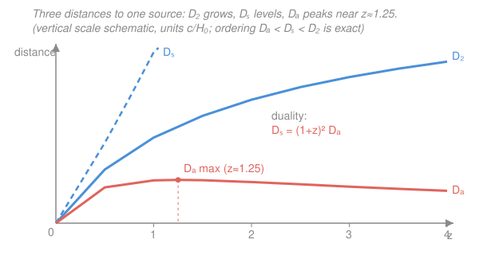

# Cosmology · Lesson 1.3: Redshift and cosmic distances

> ⏱ ~15 min · Module 1: The expanding universe and the Friedmann equations · Builds on: [1.2 FLRW metric and comoving coordinates](01-02-flrw-metric-comoving-coordinates.md) · Unlocks: [1.4 Friedmann, fluid, and acceleration equations](01-04-friedmann-fluid-acceleration-equations.md)

## Why this matters

Every number in observational cosmology enters through two doors: **how far** a source is and **how fast the universe was expanding when the light left it**. Both are read off a single measurement — the **redshift** $z$. But "distance" splinters into several inequivalent things once space itself is stretching between you and the source: the distance you'd measure with a ruler laid down today, the distance inferred from how bright a supernova looks, and the distance inferred from how big a galaxy appears are *three different numbers*. Getting these straight is the difference between a supernova telling you the universe accelerates and it telling you nonsense. This lesson turns $z$ into a clock and a ruler, and sorts out the distance zoo.

## The idea

Light is a wave riding on a rubber sheet that is being stretched. Emit a wave when the universe was half its present size; by the time it reaches you the sheet has doubled, so every wavelength has doubled too. Redder light. That is **cosmological redshift**: not a Doppler shift from motion *through* space, but a stretching *of* space. The stretch factor is exactly the scale factor $a$ from [1.2](01-02-flrw-metric-comoving-coordinates.md), so measuring how much a known spectral line has reddened tells you directly how much smaller the universe was when the light set out. Redshift *is* a snapshot of the past scale factor.

Now distance. On a static stage, distance is distance. But here the stage grew *while the light was in transit*, so the honest answer to "how far?" depends on what you actually measure. If you measure **brightness**, you're comparing the source's known power to the trickle you receive — but that trickle was diluted both by the expanding sphere the photons spread over and by the stretching that saps each photon's energy and slows their arrival. If you measure **angular size**, you compare a known physical size to the tiny angle it subtends — and light from a high-redshift object left when the object was *closer* to the (then-smaller) space around it, so it can look deceptively large. Same source, same $z$, but "bright-far" and "big-far" disagree. The bookkeeping is clean once you know the rules.

## The formal version

**Cosmological redshift.** Work in the flat FLRW metric from [1.2](01-02-flrw-metric-comoving-coordinates.md), $ds^2 = -c^2\,dt^2 + a(t)^2\,d\chi^2$ along a radial ray, where $t$ is cosmic time, $a(t)$ the scale factor (normalized $a_0 \equiv a(t_0)=1$ today), $\chi$ the comoving radial coordinate, and $c$ the speed of light. Light travels on a **null geodesic**, $ds^2=0$, so

$$c\,dt = a(t)\,d\chi \qquad\Longrightarrow\qquad \chi = \int_{t_\text{e}}^{t_0}\frac{c\,dt}{a(t)},$$

the comoving distance a photon covers between emission $t_\text{e}$ and observation $t_0$. *In words: comoving coordinates strip out the expansion, so the comoving path length is fixed even though the physical path stretched.* Now send a second wavecrest one period later, at $t_\text{e}+\delta t_\text{e}$, arriving at $t_0+\delta t_0$. It covers the *same* comoving distance $\chi$ (the source and you sit at fixed comoving coordinates), so

$$\int_{t_\text{e}}^{t_0}\frac{c\,dt}{a} = \int_{t_\text{e}+\delta t_\text{e}}^{t_0+\delta t_0}\frac{c\,dt}{a} \quad\Longrightarrow\quad \frac{\delta t_\text{e}}{a(t_\text{e})} = \frac{\delta t_0}{a(t_0)}.$$

Since a wave period is proportional to wavelength ($\lambda = c\,\delta t$), and defining redshift $z$ by $1+z \equiv \lambda_\text{obs}/\lambda_\text{emit}$,

$$\boxed{\,1+z = \frac{\lambda_\text{obs}}{\lambda_\text{emit}} = \frac{a_0}{a(t_\text{e})} = \frac{1}{a}\,}\qquad\Longleftrightarrow\qquad a = \frac{1}{1+z}.$$

*In words: one plus the redshift is the factor by which the universe has grown since the light was emitted.* This makes $z$ a direct clock: a quasar at $z=6$ shows us the universe at $a=1/7$ of its present size.

**Redshift as a time coordinate.** Differentiate $a = 1/(1+z)$ and use the Hubble rate $H \equiv \dot a/a$ from [1.1](01-01-cosmological-principle-hubble-law.md) (with $\dot a = da/dt$):

$$dt = \frac{da}{\dot a} = \frac{da}{aH} = -\frac{dz}{(1+z)\,H(z)}.$$

*In words: a step in redshift is a step back in time, weighted by how fast expansion was running then.* The minus sign says increasing $z$ means earlier $t$. Integrating gives the **lookback time** — how long ago the light left:

$$t_L = t_0 - t_\text{e} = \int_0^{z}\frac{dz'}{(1+z')\,H(z')}.$$

**The distance measures.** All are built from $H(z)$, which [1.4](01-04-friedmann-fluid-acceleration-equations.md) will tie to the universe's contents.

- **Comoving distance** — combine $\chi=\int c\,dt/a$ with $dt = -dz/[(1+z)H]$ and $1/a=1+z$; the factors collapse:

$$D_C = \int_0^z \frac{c\,dz'}{H(z')}.$$

  *In words: the ruler-distance today, summed up in redshift shells.* For a flat universe the comoving distance and the transverse comoving distance coincide, which is why the two forms below are so simple.

- **Luminosity distance** — *defined* so the familiar inverse-square law still holds. If a source of intrinsic luminosity $L$ (power emitted) delivers observed flux $F$ (power per area), then

$$F = \frac{L}{4\pi D_L^2}, \qquad\text{and in flat FLRW}\qquad D_L = (1+z)\,D_C.$$

  *In words: $D_L$ is whatever distance makes a standard candle's brightness obey $1/D^2$ — inflated by $(1+z)$ because expansion dims sources.* (One $(1+z)$ from photon energy loss, one from the stretched arrival rate; the geometric sphere supplies the rest.)

- **Angular-diameter distance** — *defined* so the small-angle law still holds. A source of physical size $\ell$ subtending angle $\theta$ has

$$\theta = \frac{\ell}{D_A}, \qquad\text{and in flat FLRW}\qquad D_A = \frac{D_C}{1+z}.$$

  *In words: $D_A$ is whatever distance makes a standard ruler's angular size obey $\theta=\ell/D$ — shrunk by $(1+z)$ because the universe was smaller when the light left.*

**Distance duality.** Dividing the two,

$$\boxed{\,D_L = (1+z)^2\,D_A\,}.$$

*In words: the brightness-distance and the size-distance of one source differ by exactly $(1+z)^2$.* This is a robust theorem — it needs only photon conservation and light on null geodesics, not any particular cosmology — so a measured violation would signal exotic physics (dust, photon decay, modified gravity). A famous consequence: because $D_A = D_C/(1+z)$ while $D_C$ keeps rising toward a finite limit, $D_A$ **peaks and then decreases** at high $z$. Beyond the peak, more distant objects subtend a *larger* angle — they look **bigger**.

**Small-$z$ limit.** For $z\ll 1$, $H(z)\approx H_0$, so $D_C \approx cz/H_0$, and the $(1+z)$ factors are $\approx 1$:

$$D_C \approx D_L \approx D_A \approx \frac{cz}{H_0}\quad\Longrightarrow\quad cz \approx H_0 D,$$

recovering **Hubble's law** from [1.1](01-01-cosmological-principle-hubble-law.md). The distinctions only bite at $z\gtrsim 0.5$ — which is exactly where supernova cosmology lives.

## Picture

## Worked examples

**Example 1 (mechanical — turn $z$ into the numbers you need).** A galaxy sits at $z=1$. Then the universe was $a = 1/(1+z) = 1/2$ its present size when the observed light left. Its three distances stand in fixed ratios regardless of cosmology:

$$\frac{D_L}{D_C} = 1+z = 2, \qquad \frac{D_A}{D_C} = \frac{1}{1+z} = \tfrac12, \qquad \frac{D_L}{D_A} = (1+z)^2 = 4.$$

So a standard candle at $z=1$ appears as faint as a static-universe source *twice* as far, while a standard ruler appears as large as one at *half* $D_C$. The single measured $z$ fixes all the conversions.

**Example 2 (why you'd care — the turnover that fooled people).** A galaxy of fixed physical size $\ell$ is observed at increasing redshift. Naively you expect it to shrink forever. But $\theta = \ell/D_A$, and $D_A$ turns over: in the matter-dominated model of the next problem it peaks at $z\approx 1.25$. Push past that redshift and $\theta$ starts **growing** — the most distant galaxies subtend *larger* angles than nearer ones. The reason is intuitive once stated: the light we see from a very high-$z$ galaxy left when the whole universe (and hence the space right around that galaxy) was tiny, so the galaxy was physically close to "here" at emission, and close things look big. This is the same effect that makes the CMB's acoustic features (Module 3) span about a degree despite coming from the edge of the observable universe.

## Watch out

- **You might think cosmological redshift is a Doppler shift.** It isn't a velocity *through* space — nothing is moving locally. It's the accumulated stretch of space *itself* during transit, $1+z = a_0/a$. The Doppler formula only reappears as the $z\ll 1$ approximation, where $cz\approx v = H_0 D$.
- **You might think "the distance" is one number.** At $z\gtrsim 0.5$, $D_C$, $D_L$, and $D_A$ genuinely differ — by factors of $(1+z)$ and $(1+z)^2$. Always ask *which* distance a formula or dataset means: fluxes use $D_L$, angular sizes use $D_A$, ruler-comparisons use $D_C$.
- **You might expect distant things to always look smaller.** Past the $D_A$ peak they look *bigger* — the turnover is real, not an artifact. And $D_A$ decreasing does **not** mean the object is getting closer; $D_C$ still increases monotonically.

## One-liner

> Redshift is the scale factor in disguise, $1+z=1/a$; expansion then splits distance into $D_C$ (ruler), $D_L=(1+z)D_C$ (brightness), and $D_A=D_C/(1+z)$ (size), locked together by $D_L=(1+z)^2 D_A$.

## Problems

**P1 (🟢)** A galaxy is observed at redshift $z=2$. (a) What was the scale factor $a$ when its light was emitted? (b) What is the ratio $D_L/D_A$? (c) A spectral line known to be emitted at $500$ nm is observed at $1500$ nm — what is that source's redshift?

**P2 (🟡)** In a flat, matter-only universe (Einstein–de Sitter) the expansion rate is $H(z) = H_0(1+z)^{3/2}$. Compute the comoving distance $D_C(z) = \int_0^z c\,dz'/H(z')$ in closed form.

**P3 (🔴)** Using your $D_C$ from P2, form the angular-diameter distance $D_A = D_C/(1+z)$ and show it has a maximum. Find the redshift $z_\star$ of maximum angular-diameter distance — the redshift at which a galaxy of fixed size appears *smallest* before growing again.

Solutions

**P1** (a) $a = \dfrac{1}{1+z} = \dfrac{1}{3}$: the universe was one-third its present size.

(b) $\dfrac{D_L}{D_A} = (1+z)^2 = 3^2 = 9$.

(c) $1+z = \dfrac{\lambda_\text{obs}}{\lambda_\text{emit}} = \dfrac{1500}{500} = 3 \Rightarrow z = 2$ — the same source, consistent with parts (a)–(b).

*Check.* Wavelength tripled, so the universe tripled in size, so $a$ went from $1$ to... running the emission-to-now direction, $a_\text{e}=1/3$ grew to $a_0=1$, a factor $3 = 1+z$ ✓.

**P2** Pull out the constants and integrate the power:

$$D_C = \int_0^z \frac{c\,dz'}{H_0(1+z')^{3/2}} = \frac{c}{H_0}\int_0^z (1+z')^{-3/2}\,dz'.$$

With $u = 1+z'$, $\int u^{-3/2}\,du = -2u^{-1/2}$, so

$$D_C = \frac{c}{H_0}\Big[-2(1+z')^{-1/2}\Big]_0^z = \frac{c}{H_0}\Big(-2(1+z)^{-1/2} + 2\Big) = \frac{2c}{H_0}\left[1 - \frac{1}{\sqrt{1+z}}\right].$$

*Check.* Small-$z$: expand $(1+z)^{-1/2}\approx 1 - \tfrac12 z$, giving $D_C \approx \frac{2c}{H_0}\cdot\tfrac12 z = cz/H_0$ — Hubble's law ✓. Large-$z$: $D_C \to 2c/H_0$, a finite comoving horizon, as expected for a matter universe ✓.

**P3** Divide by $1+z$ and substitute $u = 1+z$ (so $u\ge 1$):

$$D_A = \frac{D_C}{1+z} = \frac{2c}{H_0}\,\frac{1 - u^{-1/2}}{u} = \frac{2c}{H_0}\left(u^{-1} - u^{-3/2}\right).$$

Maximize: differentiate with respect to $u$ and set to zero,

$$\frac{d}{du}\left(u^{-1} - u^{-3/2}\right) = -u^{-2} + \tfrac32\,u^{-5/2} = 0.$$

Multiply through by $u^{5/2}$: $-u^{1/2} + \tfrac32 = 0 \Rightarrow u^{1/2} = \tfrac32 \Rightarrow u = \tfrac94$. Hence

$$1+z_\star = \frac94 = 2.25 \qquad\Longrightarrow\qquad \boxed{z_\star = \tfrac54 = 1.25.}$$

*Check.* It's genuinely a maximum: at small $z$, $D_A\approx cz/H_0$ rises; at large $z$, $D_C\to 2c/H_0$ is finite while the $1/(1+z)$ factor drives $D_A\to 0$ — so a hump in between. Numerically $D_A(z_\star) = \frac{2c}{H_0}(\tfrac{4}{9} - (\tfrac94)^{-3/2}) = \frac{2c}{H_0}(0.4444 - 0.2963) = 0.296\,\frac{c}{H_0}$, matching the coral peak in the figure ✓. This is the classic Einstein–de Sitter result: beyond $z=1.25$, galaxies of fixed size look progressively *larger*.

## Flashback

**From Lesson 1.2 (FLRW metric and comoving coordinates):** A source sits at fixed comoving distance $\chi = 3\ \text{Gpc}$ from us. Using $a_0 = 1$ today, (a) what is its **proper** (physical) distance *right now*? (b) The light we currently receive from it left at redshift $z=2$; what was the proper distance to it *at the moment of emission*? (Fresh variant — recall that proper distance is $d(t) = a(t)\,\chi$.)

Solution

Proper distance is the comoving distance scaled by the scale factor at that epoch: $d(t) = a(t)\,\chi$.

(a) Today $a_0 = 1$, so $d(t_0) = 1\cdot 3 = 3\ \text{Gpc}$ — for a flat universe, "now" is the one time proper and comoving distance coincide.

(b) At emission $a(t_\text{e}) = \dfrac{1}{1+z} = \dfrac13$, so

$$d(t_\text{e}) = a(t_\text{e})\,\chi = \tfrac13 \times 3\ \text{Gpc} = 1\ \text{Gpc}.$$

*Check.* The ratio $d(t_0)/d(t_\text{e}) = 3 = 1+z$ — the universe (and every proper separation frozen in comoving coordinates) grew by exactly $1+z$ while the light was in flight, which is the same stretch that reddened the light ✓. Note the comoving distance $\chi$ never changed; only the physical scale multiplying it did.

## Connections

- **Backward:** the null-geodesic condition $c\,dt = a\,d\chi$ and the comoving coordinate $\chi$ are straight from [1.2](01-02-flrw-metric-comoving-coordinates.md); the small-$z$ collapse to $cz = H_0 D$ recovers Hubble's law from [1.1](01-01-cosmological-principle-hubble-law.md), and $H(z)$ is the running version of the Hubble constant introduced there.
- **Forward:** every distance here is an integral of $1/H(z)$, and [1.4 Friedmann, fluid, and acceleration equations](01-04-friedmann-fluid-acceleration-equations.md) supplies $H(z)$ from the universe's energy content — turning $D_L(z)$ into a *test* of what the universe is made of. That test, applied to supernovae, is the dark-energy discovery you'll reach in [4.4](04-04-dark-energy-cosmic-acceleration.md) and [4.5](04-05-cosmic-distance-ladder-observational.md).
- **Sideways:** the distance-duality theorem $D_L=(1+z)^2 D_A$ rests only on photon-number conservation along null rays — the same relativistic light-propagation machinery developed in the relativity course (see [relativity syllabus](../../relativity/syllabus.md)). The $D_A$ turnover is why the CMB's degree-scale acoustic peaks (Module 3) look as large as they do.
