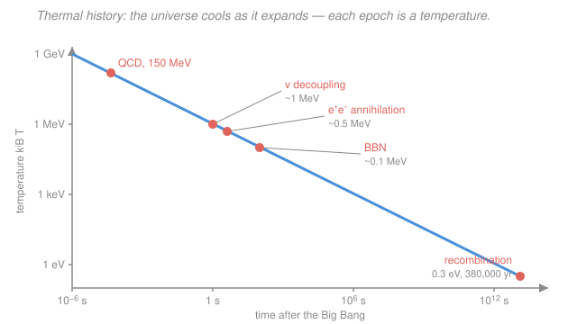

# Cosmology · Lesson 2.1: The hot Big Bang and thermal equilibrium

> ⏱ ~15 min · Module 2: Thermal history and Big Bang nucleosynthesis · Builds on: [1.5 The cosmic energy budget and ΛCDM](01-05-cosmic-energy-budget-lambda-cdm.md), equilibrium distributions and the Boltzmann factor from [stat-mech](../../stat-mech/syllabus.md) · Unlocks: [2.2 Decoupling and freeze-out](02-02-decoupling-freeze-out.md)

## Why this matters

In [1.5](01-05-cosmic-energy-budget-lambda-cdm.md) you learned that radiation dilutes faster than everything else: $\rho_r\propto a^{-4}$ versus $\rho_m\propto a^{-3}$. Read that forward and radiation is a rounding error today. Read it *backward* and radiation wins — at early enough times it dominated the whole energy budget, and the universe was a blindingly hot, dense soup of particles slamming into each other fast enough to stay in **thermal equilibrium**. That single fact is the master key to the next four lessons: once you know the universe was hot and in equilibrium, its entire contents at any epoch are fixed by *one number*, the temperature. Nucleosynthesis, the neutrino background, and the CMB are all just "what happens as this fireball cools." This lesson builds the thermometer and the clock.

## The idea

Expansion stretches everything, including the wavelengths of the photons filling space. A photon's energy is inversely proportional to its wavelength, and its wavelength stretches with the scale factor $a$ — so the whole radiation bath loses energy per particle as the universe grows. The upshot is beautifully simple: **the temperature of the universe scales as $T\propto 1/a$.** Play the film backward ($a\to0$) and the temperature climbs without limit. There is no cap; the early universe was arbitrarily hot.

Why "equilibrium"? Because when things are hot and dense, collisions are ferociously frequent — particles exchange energy far faster than the universe expands, so the soup relaxes to the most probable state, exactly like a gas in a box reaching a common temperature. And a system in thermal equilibrium forgets its history: its contents depend *only* on the temperature (and a couple of conserved charges), not on how it got there. So instead of tracking $10^{89}$ particles, we track one dial. Turn the dial up and new species of particle "turn on" as soon as it's hot enough to make them; turn it down and they annihilate away. The thermal history of the universe is the story of that dial slowly falling.

## The formal version

**Temperature and redshift.** The radiation bath is a blackbody, and its temperature redshifts with expansion:

$$T(a) = \frac{T_0}{a}, \qquad\text{equivalently}\qquad T(z) = (1+z)\,T_0,$$

where $a$ is the scale factor normalized to $a_0=1$ today, $z$ is redshift ($1+z=1/a$ from [1.3](01-03-redshift-cosmic-distances.md)), and $T_0 = 2.725\ \mathrm{K}$ is today's CMB temperature. *In words: a universe half its present size was twice as hot.* At recombination, $z\approx1000$, gives $T\approx 1000\times2.725\approx3000\ \mathrm{K}$.

**Equilibrium distributions.** In equilibrium every species has its occupation number fixed by its energy $E$, temperature $T$, and chemical potential $\mu$ — the two families you met in [stat-mech](../../stat-mech/syllabus.md):

$$f(E)=\frac{1}{e^{(E-\mu)/k_BT}\pm1}, \qquad \begin{cases}+1 & \text{fermions (Fermi–Dirac)}\\ -1 & \text{bosons (Bose–Einstein)}\end{cases}$$

where $k_B$ is Boltzmann's constant. *In words: the Boltzmann factor $e^{-E/k_BT}$ sets how many particles sit at each energy, with a quantum $\pm1$ correction.* For the early universe the useful regime is **relativistic** ($k_BT\gg mc^2$): particles are effectively massless, $\mu$ is negligible, and integrating $f(E)$ over momentum gives number and energy densities that depend only on $T$ and how many internal states the particle has.

**Radiation energy density and $g_*$.** Summing the relativistic species gives a Stefan–Boltzmann-like law:

$$\rho_r c^2 = \frac{\pi^2}{30}\,\frac{(k_BT)^4}{(\hbar c)^3}\,g_*, \qquad g_* = \sum_{\text{bosons}} g_i + \frac{7}{8}\sum_{\text{fermions}} g_i,$$

where $\rho_r c^2$ is the radiation *energy* density (J/m³), $\hbar$ is the reduced Planck constant, $c$ the speed of light, and $g_*$ is the **effective number of relativistic degrees of freedom** — a headcount of every light particle's internal states (spin, particle/antiparticle), with fermions weighted by $7/8$. *In words: energy density grows as $T^4$, and $g_*$ just counts how many kinds of hot particle are contributing.* The $7/8$ comes from the sign difference in $f(E)$: the Pauli exclusion in Fermi–Dirac statistics makes each fermionic state carry $7/8$ the energy of a bosonic one. A single photon (spin up/down) has $g=2$.

**The temperature–time relation.** Combine $\rho_r\propto g_*T^4$ with the flat radiation-era Friedmann equation from [1.4](01-04-friedmann-fluid-acceleration-equations.md):

$$H^2 = \frac{8\pi G}{3}\rho \;\;\Longrightarrow\;\; H \propto \sqrt{\rho_r}\,\propto\, \sqrt{g_*}\,T^2.$$

In the radiation era $a\propto t^{1/2}$, so $H = \dot a/a = 1/(2t)$, which turns $H\propto T^2$ into

$$t \propto T^{-2}, \qquad\text{with the handy rule}\qquad \boxed{\;\frac{t}{1\ \mathrm{s}} \approx \left(\frac{k_BT}{1\ \mathrm{MeV}}\right)^{-2}\;}$$

(order of magnitude, for $g_*\sim10$). *In words: the hotter the universe, the younger it is — and $1\ \mathrm{MeV}$ of temperature corresponds to about one second after the Big Bang.* This is the clock: name a temperature, read off an age.

**Entropy conservation.** Expansion is adiabatic (nothing flows in or out of a comoving volume on average), so the total entropy in a comoving volume is conserved:

$$S \propto g_{*s}\,(aT)^3 = \text{const},$$

where $g_{*s}$ is the entropy analogue of $g_*$ (the same headcount, weighted for entropy). *In words: the number $(aT)^3$ stays fixed unless the particle census changes.* The subtlety is that word "unless": when a species **annihilates** — say $e^+e^-\to\gamma\gamma$ once $k_BT$ drops below the electron mass — it dumps its entropy into the particles still in the bath, so those get *reheated* relative to any species that already stopped interacting. Holding $g_{*s}(aT)^3$ constant across the $e^+e^-$ annihilation is exactly what will give the famous photon-to-neutrino temperature ratio $T_\nu/T_\gamma=(4/11)^{1/3}$ in [2.3](02-03-relics-neutrino-background.md).

**The energy–temperature dictionary.** Physicists quote epochs by energy $k_BT$, using

$$1\ \mathrm{eV} \leftrightarrow 1.16\times10^{4}\ \mathrm{K}.$$

The key milestones, cooling from hot to cold:

| Epoch | $k_BT$ | Rough time |
|---|---|---|
| QCD transition (quarks → hadrons) | $\sim150$ MeV | $\sim10^{-5}$ s |
| Neutrino decoupling / $e^+e^-$ annihilation | $\sim1$ MeV | $\sim1$ s |
| Big Bang nucleosynthesis | $\sim0.1$ MeV | $\sim3$ min |
| Recombination (CMB released) | $\sim0.3$ eV | $\sim380{,}000$ yr |

## Picture

## Worked examples

**Example 1 (the thermometer, both ways).** How hot was the universe one second after the Big Bang, and what does that mean in kelvin? Use the clock rule at $t=1$ s: $k_BT\approx1$ MeV. Convert with the dictionary: $1\ \mathrm{MeV}=10^6\ \mathrm{eV}$, so

$$T = 10^6\times(1.16\times10^4\ \mathrm{K}) = 1.16\times10^{10}\ \mathrm{K}.$$

Ten billion kelvin at one second old — hot enough that electron–positron pairs pop in and out of the vacuum freely. Now go the other way: at recombination the CMB was released at $T\approx3000$ K, i.e. $k_BT\approx 3000/(1.16\times10^4)\approx0.26$ eV. That tiny energy — a fraction of an electron-volt — is why neutral hydrogen could finally form and the universe turned transparent (the subject of [3.1](03-01-recombination-origin-cmb.md)).

**Example 2 (counting the census, $g_*$).** Just before $e^+e^-$ annihilation, at $k_BT\sim$ a few MeV, the relativistic bath is photons, electrons and positrons, and three neutrino species. Count:

- **Photons** (boson): 2 polarization states $\Rightarrow g=2$.
- **Electrons + positrons** (fermions): each of $e^-$ and $e^+$ has 2 spin states $\Rightarrow g=4$, weighted $\tfrac78$.
- **Neutrinos** (fermions): 3 flavors, each with $\nu$ and $\bar\nu$ (one helicity each) $\Rightarrow g=6$, weighted $\tfrac78$.

$$g_* = 2 + \tfrac78(4+6) = 2 + \tfrac78(10) = 2 + 8.75 = 10.75.$$

So $\rho_r$ is $10.75/2\approx5.4$ times what photons alone would give. That extra factor is exactly why the expansion rate — and hence the neutron-freeze-out temperature that sets the helium abundance in [2.4](02-04-big-bang-nucleosynthesis.md) — depends on how many light species exist. Counting particles literally weighs the universe.

## Watch out

- **You might think "temperature scales as $1/a$" is a separate assumption.** It isn't — it *follows* from a blackbody staying a blackbody while its photon wavelengths stretch as $a$. The peak wavelength redshifts, and a stretched blackbody is just a cooler blackbody. That's why $T_0=2.725$ K today is a measured spectrum, not a fitted parameter.
- **You might read $g_*$ as "number of particles."** It's a weighted count of *internal states* of *relativistic* species only. Once $k_BT$ falls below a particle's rest energy $mc^2$, that particle stops being relativistic, annihilates, and drops out of $g_*$ — so $g_*$ decreases in steps as the universe cools, from $\sim106$ in the very early universe down to a few today.
- **You might expect $t\propto T^{-2}$ to hold forever.** It's a *radiation-era* result ($a\propto t^{1/2}$). After matter–radiation equality (around $z\approx3400$) the universe is matter-dominated, $a\propto t^{2/3}$, and the temperature–time relation changes. Recombination sits in the matter era — the rule gets you the right ballpark but not the precise 380,000 years.

## One-liner

> Run the clock back and radiation wins: the early universe is a hot equilibrium bath whose entire contents are set by one falling dial, $T\propto1/a$, with $1\ \mathrm{MeV}\leftrightarrow1\ \mathrm{s}$.

## Problems

**P1 (🟢)** Take $T_0=2.725$ K. (a) Find the temperature at recombination, $z=1100$. (b) Convert $k_BT=1$ MeV to kelvin using $1\ \mathrm{eV}\leftrightarrow1.16\times10^4$ K, and give the corresponding cosmic time. (c) BBN runs at $k_BT\approx0.1$ MeV — what temperature (in K) and roughly what time is that?

**P2 (🟡)** Recount $g_*$ for the plasma of Example 2 (photons, $e^\pm$, and 3 neutrino species) and confirm $g_*=10.75$. Then suppose a hypothetical *fourth* neutrino species existed and was still relativistic and in equilibrium at this epoch — what would $g_*$ become, and by what factor would that raise the expansion rate $H$?

**P3 (🔴)** Starting from $\rho_r\propto g_* T^4$ and the flat radiation-era Friedmann equation $H^2=\tfrac{8\pi G}{3}\rho$, derive the scaling $t\propto T^{-2}$ (you may use $H=1/(2t)$ for $a\propto t^{1/2}$). Then use the calibrated rule $t/\mathrm{s}\approx(k_BT/\mathrm{MeV})^{-2}$ to estimate the age of the universe when $k_BT=1$ MeV, and say in one sentence why species heavier than $\sim1$ MeV/$c^2$ (like protons) are already non-relativistic there.

Solutions

**P1**
(a) $T=(1+z)T_0=1101\times2.725\ \mathrm{K}=3000\ \mathrm{K}$ (to two significant figures). Recombination is a few thousand kelvin — cool enough for hydrogen to hold onto its electron.

(b) $1\ \mathrm{MeV}=10^6\ \mathrm{eV}$, so $T=10^6\times1.16\times10^4\ \mathrm{K}=1.16\times10^{10}\ \mathrm{K}\approx1.2\times10^{10}\ \mathrm{K}$. Cosmic time from the rule: $t\approx(1)^{-2}\ \mathrm{s}=1\ \mathrm{s}$.

(c) $k_BT=0.1\ \mathrm{MeV}=10^5\ \mathrm{eV}$, so $T=10^5\times1.16\times10^4\ \mathrm{K}=1.16\times10^{9}\ \mathrm{K}\approx1.2\times10^{9}\ \mathrm{K}$. Time: $t\approx(0.1)^{-2}\ \mathrm{s}=100\ \mathrm{s}\approx2\ \mathrm{min}$. (A fuller treatment gives $\sim3$ min — the rule is order-of-magnitude.)

*Check.* Temperatures fall monotonically with time (3000 K at 380,000 yr $<$ $10^9$ K at 100 s $<$ $10^{10}$ K at 1 s) — hotter means younger, as it must. ✓

**P2** Photons: boson, $g=2$. Electrons+positrons: fermions, $g=2+2=4$. Three neutrino species, each $\nu+\bar\nu$: fermions, $g=6$. Then
$$g_* = \underbrace{2}_{\text{bosons}} + \tfrac78\underbrace{(4+6)}_{\text{fermions}} = 2 + \tfrac78(10)=2+8.75=10.75.\ \checkmark$$
A fourth neutrino adds $\nu+\bar\nu$, i.e. $g=2$ more fermionic states: $g_*'=2+\tfrac78(12)=2+10.5=12.5$. Since $H\propto\sqrt{g_*}$ at fixed $T$, the expansion speeds up by $\sqrt{12.5/10.75}=\sqrt{1.163}\approx1.08$ — about 8% faster. (This is precisely how counting neutrino species from the primordial helium abundance works — extra species make the universe expand faster, freeze out more neutrons, and produce more helium.)

*Check.* Adding a fermionic pair raises $g_*$ by $\tfrac78\times2=1.75$, and $10.75+1.75=12.5$ ✓.

**P3** Energy density: $\rho_r c^2=\frac{\pi^2}{30}g_*\frac{(k_BT)^4}{(\hbar c)^3}$, so the mass density $\rho_r\propto g_*T^4$. Feed into Friedmann:
$$H^2=\frac{8\pi G}{3}\rho_r \;\Longrightarrow\; H\propto\sqrt{\rho_r}\propto\sqrt{g_*}\,T^2.$$
In the radiation era $a\propto t^{1/2}$, so $H=\dot a/a=\tfrac12 t^{-1}=1/(2t)$. Therefore
$$\frac{1}{2t}\propto T^2 \;\Longrightarrow\; t\propto T^{-2}. \qquad\checkmark$$
Estimate at $k_BT=1$ MeV: $t\approx(1)^{-2}\ \mathrm{s}=1\ \mathrm{s}$ (a careful calculation with $g_*=10.75$ gives $t\approx0.7$ s — same order). Protons ($m_pc^2\approx938$ MeV) have rest energy far above $k_BT=1$ MeV, so $k_BT\ll m_pc^2$: they are deeply non-relativistic and their number is Boltzmann-suppressed, not part of $g_*$.

*Check.* Dimensionally $H\propto T^2$ gives $t\propto H^{-1}\propto T^{-2}$ ✓, and the exponent $-2$ matches the boxed rule. ✓

## Flashback

**From Lesson 1.5 (The cosmic energy budget and ΛCDM):** A flat universe today has matter fraction $\Omega_m=0.31$ and radiation fraction $\Omega_r=9.1\times10^{-5}$. At what redshift were the matter and radiation *densities* equal? What temperature (in kelvin, and in eV) does that correspond to?

Solution

Each component's density scales with the scale factor as $\rho_m\propto a^{-3}$ and $\rho_r\propto a^{-4}$ (from [1.5](01-05-cosmic-energy-budget-lambda-cdm.md)). Their ratio is
$$\frac{\rho_m}{\rho_r}=\frac{\Omega_m a^{-3}}{\Omega_r a^{-4}}=\frac{\Omega_m}{\Omega_r}\,a=\frac{\Omega_m}{\Omega_r}\frac{1}{1+z}.$$
Equality means this ratio equals 1:
$$1+z_{\rm eq}=\frac{\Omega_m}{\Omega_r}=\frac{0.31}{9.1\times10^{-5}}\approx3.4\times10^{3} \;\Longrightarrow\; z_{\rm eq}\approx3400.$$
Temperature at that redshift: $T=(1+z_{\rm eq})T_0\approx3400\times2.725\ \mathrm{K}\approx9.3\times10^{3}\ \mathrm{K}$, i.e. $k_BT\approx9300/(1.16\times10^4)\approx0.8$ eV.

*Check.* Because radiation dilutes with one extra power of $a$, going back in time ($a$ smaller) inevitably makes radiation overtake matter — equality must lie at high redshift, and $z_{\rm eq}\sim3400$ sits comfortably *before* recombination ($z\approx1100$), so the universe was already matter-dominated when the CMB was released. ✓

## Connections

- **Backward:** this lesson *inverts* [1.5](01-05-cosmic-energy-budget-lambda-cdm.md)'s density scalings — reading $\rho_r\propto a^{-4}$ toward small $a$ is what makes the early universe radiation-dominated and hot — and reuses the flat radiation-era Friedmann equation from [1.4](01-04-friedmann-fluid-acceleration-equations.md) to build the temperature–time clock.
- **Forward:** [2.2](02-02-decoupling-freeze-out.md) asks *when* a species falls out of equilibrium by racing its reaction rate $\Gamma$ against $H(T)$ — the expansion rate you just derived. The entropy-conservation setup here delivers the neutrino temperature $(4/11)^{1/3}$ in [2.3](02-03-relics-neutrino-background.md), and $g_*$ fixes the neutron freeze-out that sets helium in [2.4](02-04-big-bang-nucleosynthesis.md).
- **Sideways (statistical mechanics):** the Fermi–Dirac and Bose–Einstein occupation numbers and the Boltzmann factor $e^{-E/k_BT}$ are straight out of [stat-mech](../../stat-mech/syllabus.md) — the early universe is the largest equilibrium thermodynamics problem there is, and $\rho_r\propto T^4$ is the Stefan–Boltzmann law with a particle-physics headcount $g_*$ bolted on.
