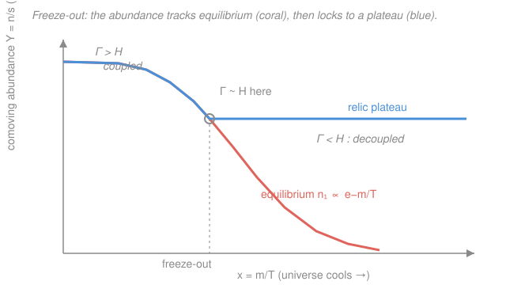

# Cosmology · Lesson 2.2: Decoupling and freeze-out

> ⏱ ~15 min · Module 2: Thermal history and Big Bang nucleosynthesis · Builds on: [2.1 Hot Big Bang and thermal equilibrium](02-01-hot-big-bang-thermal-equilibrium.md) · Unlocks: [2.3 Relics and the cosmic neutrino background](02-03-relics-neutrino-background.md)

## Why this matters

The early universe is a soup of particles slamming into each other fast enough to stay in perfect thermal equilibrium — until it isn't. As space expands and dilutes, every species eventually reaches a moment when its reactions can no longer keep up with the stretching, and it *decouples*: its abundance freezes, and it coasts as a fossil. This one idea — **freeze-out** — is the engine behind almost every relic we observe: the cosmic neutrino background ([2.3](02-03-relics-neutrino-background.md)), the light-element ratios of nucleosynthesis ([2.4](02-04-big-bang-nucleosynthesis.md)), the surface of last scattering that makes the CMB ([3.1](03-01-recombination-origin-cmb.md)), and quite possibly the dark matter itself. Learn to compare two rates and you can predict what survives from the first second.

## The idea

Picture two particles that need to *find each other* to react. In a dense, hot plasma that's easy — collisions happen constantly, and the species stays locked to its equilibrium abundance, whatever the temperature dictates. But the universe is expanding, thinning the crowd and pulling partners apart. There's a race between two clocks: how often a particle reacts, versus how fast the universe is stretching.

While reactions win, the species *tracks equilibrium* — it can instantly adjust to the falling temperature, shedding or gaining particles as needed. But the reaction clock keeps slowing (fewer targets, spread thinner) faster than the expansion clock does. The instant reactions lose the race, the species can no longer talk to itself: its comoving population is **frozen**. Whatever number happened to be there at that moment is the number that survives, essentially forever. That's decoupling. The beauty is that you don't need to solve the full dynamics — you just find where the two clocks tick at the same rate.

## The formal version

**The two rates.** A given particle reacts at a rate (interactions per unit time)

$$\Gamma = n\,\langle\sigma v\rangle,$$

where $n$ is the number density of targets it can react with (per cubic meter), $\sigma$ is the interaction cross-section (an effective area, in $\mathrm{m}^2$), $v$ is the relative speed, and $\langle\sigma v\rangle$ is that product **thermally averaged** over the distribution of speeds (units $\mathrm{m}^3/\mathrm{s}$). *In words: reaction rate = how many targets are around $\times$ how efficiently you hit each one.* Compare this to the **Hubble rate** $H = \dot a/a$ (per second) from [1.4](01-04-friedmann-fluid-acceleration-equations.md) — the expansion clock, whose inverse $1/H$ is roughly the age of the universe at that moment.

**The freeze-out condition.** Form the dimensionless ratio $\Gamma/H$:

$$\Gamma \gtrsim H \;\Rightarrow\; \textbf{coupled}\ \text{(tracks equilibrium)}, \qquad \Gamma \lesssim H \;\Rightarrow\; \textbf{decoupled}\ \text{(frozen out)}.$$

Freeze-out is the crossover, $\boxed{\Gamma \sim H}$. *In words: a species stays in equilibrium only while it reacts faster than the universe expands.* The intuition is a time comparison: $1/\Gamma$ is the typical wait between interactions and $1/H$ is the Hubble time. Once $1/\Gamma > 1/H$, a particle typically won't react even once before the universe doubles in size and dilutes its partners away — so it can't find anyone anymore.

**Why freeze-out is inevitable.** In the radiation era the Friedmann equation gives $H \propto T^2$ (energy density $\rho \propto T^4$, and $H \propto \sqrt{\rho}$; see [2.1](02-01-hot-big-bang-thermal-equilibrium.md)). Meanwhile $\Gamma$ usually falls *faster* as the universe cools — for weak interactions, $\Gamma \propto T^5$. Then

$$\frac{\Gamma}{H} \propto \frac{T^5}{T^2} = T^3,$$

which plunges toward zero as $T$ drops. So no matter how strongly a species is coupled early on, the ratio eventually crosses $1$: **every species decouples once the universe cools enough.** It's not a special accident; it's the generic fate.

**Two flavors of relic.** What survives depends on whether the particle is still relativistic ($T \gtrsim m$) or already non-relativistic ($T \lesssim m$) at freeze-out:

- **Relativistic decoupling (hot relic).** The species is still ultra-relativistic when $\Gamma$ drops below $H$. Its comoving number density is simply frozen and it *free-streams* thereafter — like a gas that stops interacting and just coasts. Neutrinos are the archetype ([2.3](02-03-relics-neutrino-background.md)). The abundance is set by the number density at decoupling, comparable to the photon density.

- **Non-relativistic freeze-out (cold relic / WIMP).** A massive species ($m \gg T$) *tries* to follow its equilibrium abundance, which is **Boltzmann-suppressed**,

  $$n_{\rm eq} \propto (mT)^{3/2}\, e^{-m/T},$$

  crashing exponentially as $T$ falls below $m$ (it costs energy $\sim m$ to make one, and there are ever fewer photons energetic enough). *In words: once it's too cold to create the particle, equilibrium wants almost none of them.* Annihilations $\chi\chi \to \text{lighter stuff}$ keep depleting the population — until they too freeze out. At that moment the exponential plunge halts and a **relic abundance** is left stranded:

  $$\Omega_{\rm relic} \propto \frac{1}{\langle\sigma v\rangle}.$$

  *In words: a bigger annihilation cross-section means the particles keep finding each other longer, so more get destroyed and fewer survive — the relic abundance is inversely proportional to $\langle\sigma v\rangle$.* Plugging in a *weak-scale* cross-section gives, remarkably, roughly the observed dark-matter density — the celebrated **"WIMP miracle"** (full detail in [2.3](02-03-relics-neutrino-background.md)).

**The Boltzmann-equation picture (qualitative).** All of this is governed by one equation for the number density:

$$\dot n + 3Hn = -\langle\sigma v\rangle\big(n^2 - n_{\rm eq}^2\big).$$

*In words:* the $3Hn$ on the left is **dilution** — expansion alone thins the gas as $n \propto a^{-3}$. The right-hand side is **interactions**, which drive $n$ toward its equilibrium value $n_{\rm eq}$ (the $n^2$ is annihilation, the $n_{\rm eq}^2$ is the reverse creation). When $\langle\sigma v\rangle$ is large the RHS dominates and pins $n = n_{\rm eq}$. When expansion has diluted $n$ enough that the RHS becomes negligible next to $3Hn$, the interaction term effectively **shuts off** — that's freeze-out — and only dilution remains, freezing the comoving number $n a^3$.

## Picture

The horizontal axis is $x = m/T$, which *grows* as the universe cools; the vertical axis is the comoving abundance $Y = n/s$ (number per unit entropy, which strips out plain dilution) on a log scale. Coral is the equilibrium curve — flat while relativistic, then Boltzmann-plunging. Blue is what actually happens: it hugs equilibrium until $\Gamma \sim H$, then peels off and locks to a constant plateau. That plateau *is* the relic.

## Worked examples

**Example 1 (mechanical — find the crossover temperature).** Suppose for some species $\Gamma = A\,T^5$ and $H = B\,T^2$, with constants $A, B$. Freeze-out is where $\Gamma = H$:

$$A\,T_f^5 = B\,T_f^2 \quad\Longrightarrow\quad T_f^3 = \frac{B}{A} \quad\Longrightarrow\quad T_f = \left(\frac{B}{A}\right)^{1/3}.$$

Above $T_f$ we have $\Gamma/H = (A/B)T^3 > 1$ (coupled); below it, $< 1$ (decoupled). One line of algebra pins the decoupling temperature — this is the entire method.

**Example 2 (why you'd care — a cross-section changes the fossil).** Take two hypothetical cold relics, identical except that species B annihilates ten times more efficiently: $\langle\sigma v\rangle_B = 10\,\langle\sigma v\rangle_A$. Which leaves more dark matter today? Since $\Omega_{\rm relic} \propto 1/\langle\sigma v\rangle$,

$$\frac{\Omega_B}{\Omega_A} = \frac{\langle\sigma v\rangle_A}{\langle\sigma v\rangle_B} = \frac{1}{10}.$$

The *more strongly* interacting species leaves *ten times less* relic. Intuitively, B's annihilations stay effective longer (freeze out later, at lower $T$), so more of B is destroyed before the door shuts. This inversion is exactly why the observed dark-matter abundance pins down the required cross-section — and why it lands suspiciously near the weak scale.

## Watch out

- **You might think a species freezes out because it "runs out" of particles.** Not quite — it freezes out because it runs out of *interactions*. The comoving number can be perfectly healthy; what fails is the ability to react, once $\Gamma$ drops below $H$. Dilution eventually kills any $\Gamma = n\langle\sigma v\rangle$ because $n$ falls with expansion.
- **You might compare $\Gamma$ to $T$, or to zero.** The benchmark is always $H$, the expansion rate — freeze-out is a *race*, not an absolute threshold. A rate that looks "small" can still be coupling if $H$ is smaller still.
- **You might expect a bigger cross-section to give more relic (more of everything).** For a *cold* relic it's the opposite: bigger $\langle\sigma v\rangle$ means more efficient annihilation, so *less* survives — $\Omega_{\rm relic} \propto 1/\langle\sigma v\rangle$. (For a *hot* relic that decouples while relativistic, the abundance is set by the number density at decoupling, not by $\langle\sigma v\rangle$ this way.)

## One-liner

> A species stays in equilibrium only while $\Gamma = n\langle\sigma v\rangle$ beats the expansion rate $H$; since $\Gamma/H$ generically falls as the universe cools, everything eventually freezes out — leaving a hot relic (frozen number) or a cold relic (abundance $\propto 1/\langle\sigma v\rangle$).

## Problems

**P1 (🟢)** A weakly-interacting species has $\Gamma \propto T^5$ while the radiation-era expansion rate has $H \propto T^2$. (a) How does the ratio $\Gamma/H$ scale with $T$, and why does this guarantee the species eventually decouples as the universe cools? (b) Writing $\Gamma = A\,T^5$ and $H = B\,T^2$, find the freeze-out temperature $T_f$ at which $\Gamma = H$.

**P2 (🟡)** For a cold (non-relativistic) relic, explain in two or three sentences why a *larger* thermally-averaged cross-section $\langle\sigma v\rangle$ leaves a *smaller* relic abundance today. Refer to when freeze-out happens and how much annihilation occurs.

**P3 (🔴)** Estimate the neutrino decoupling temperature by order of magnitude. Weak interactions have $\langle\sigma v\rangle \sim G_F^2 T^2$ (with $G_F$ the Fermi constant), and in the relativistic soup $n \sim T^3$, so $\Gamma \sim G_F^2 T^5$. In the radiation era $H \sim T^2/M_{\rm Pl}$ (with $M_{\rm Pl}$ the Planck mass). Set $\Gamma = H$ and solve for $T_{\rm dec}$ in terms of $G_F$ and $M_{\rm Pl}$; then, using $G_F \approx 1.2\times10^{-5}\ \mathrm{GeV}^{-2}$ and $M_{\rm Pl} \approx 1.2\times10^{19}\ \mathrm{GeV}$, show it comes out around $1\ \mathrm{MeV}$.

Solutions

**P1** (a) Dividing the scalings,

$$\frac{\Gamma}{H} \propto \frac{T^5}{T^2} = T^3.$$

As the universe expands it cools ($T \to 0$), so $T^3 \to 0$ and $\Gamma/H$ falls monotonically through $1$. However tightly coupled the species is at high $T$ (where $\Gamma/H \gg 1$), the ratio must eventually drop below $1$ — decoupling is unavoidable. *In words: the reaction clock slows faster than the expansion clock, so expansion always wins in the end.*

(b) Set $A\,T_f^5 = B\,T_f^2$. Dividing both sides by $T_f^2$ (valid for $T_f \neq 0$):

$$A\,T_f^3 = B \quad\Longrightarrow\quad T_f = \left(\frac{B}{A}\right)^{1/3}.$$

*Check.* For $T > T_f$, $\Gamma/H = (A/B)T^3 > 1$ (coupled); for $T < T_f$, $< 1$ (decoupled) — the crossover sits exactly at $T_f$, as it must. ✓

**P2** A larger $\langle\sigma v\rangle$ means the annihilation term in the Boltzmann equation stays effective down to *lower* temperature — the species keeps in equilibrium longer and freezes out **later**, deeper into the Boltzmann-suppressed regime $n_{\rm eq}\propto e^{-m/T}$. More annihilation happens before the interactions shut off, so fewer particles are left stranded. Quantitatively $\Omega_{\rm relic}\propto 1/\langle\sigma v\rangle$: double the cross-section, halve the relic. (Intuition: efficient annihilators are better at destroying themselves, so less of them survives.)

**P3** Set the weak reaction rate equal to the expansion rate:

$$\Gamma \sim G_F^2\,T^5 \;=\; H \sim \frac{T^2}{M_{\rm Pl}}.$$

Divide both sides by $T^2$:

$$G_F^2\,T^3 \sim \frac{1}{M_{\rm Pl}} \quad\Longrightarrow\quad T_{\rm dec}^3 \sim \frac{1}{G_F^2\,M_{\rm Pl}} \quad\Longrightarrow\quad T_{\rm dec} \sim \left(G_F^2\,M_{\rm Pl}\right)^{-1/3}.$$

Now plug in numbers (working in GeV, where $G_F \approx 1.2\times10^{-5}\ \mathrm{GeV}^{-2}$ and $M_{\rm Pl}\approx1.2\times10^{19}\ \mathrm{GeV}$):

$$G_F^2 \approx (1.2\times10^{-5})^2 \approx 1.44\times10^{-10}\ \mathrm{GeV}^{-4},$$

$$G_F^2\,M_{\rm Pl} \approx (1.44\times10^{-10})(1.2\times10^{19}) \approx 1.7\times10^{9}\ \mathrm{GeV}^{-3}.$$

Taking the cube root of the inverse:

$$T_{\rm dec} \sim (1.7\times10^{9})^{-1/3}\ \mathrm{GeV} \approx \frac{1}{1.2\times10^{3}}\ \mathrm{GeV} \approx 8\times10^{-4}\ \mathrm{GeV} \approx 0.8\ \mathrm{MeV}.$$

So $T_{\rm dec} \sim 1\ \mathrm{MeV}$, the standard result. *Check.* $(1.7\times10^9)^{1/3}$: since $10^9{}^{1/3}=10^3$ and $1.7^{1/3}\approx1.19$, we get $\approx1.2\times10^3$, and $1/(1.2\times10^3)\ \mathrm{GeV}\approx0.8\ \mathrm{MeV}$ ✓. This $\sim1\ \mathrm{MeV}$ scale is why the neutrino background decouples right around the era of nucleosynthesis — the two stories are linked in [2.3](02-03-relics-neutrino-background.md) and [2.4](02-04-big-bang-nucleosynthesis.md).

## Flashback

**From Lesson 2.1 (Hot Big Bang and thermal equilibrium):** In the radiation era the photon temperature scales with the scale factor as $T \propto 1/a$. If the universe expands so that the scale factor grows by a factor of $1000$ between two epochs, by what factor does the temperature change, and by what factor does the photon number density $n_\gamma \propto T^3$ change?

Solution

Since $T \propto 1/a$, a growth $a \to 1000\,a$ gives

$$T \to \frac{T}{1000},$$

a temperature drop by a factor of $1000$. The photon number density scales as $n_\gamma \propto T^3 \propto a^{-3}$, so

$$n_\gamma \to \frac{n_\gamma}{1000^3} = \frac{n_\gamma}{10^9},$$

a fall by a factor of $10^9$ (one billion). *Check.* $n_\gamma \propto a^{-3}$ is exactly plain volume dilution — the photon count in a comoving box is fixed while the box's volume grows as $a^3$ — consistent with the $3Hn$ dilution term in this lesson's Boltzmann equation. ✓ This steep $\propto a^{-3}$ thinning of targets is *why* $\Gamma = n\langle\sigma v\rangle$ inevitably falls below $H$ and every species freezes out.

## Connections

- **Backward:** the expansion rate $H \propto T^2$ and the temperature scaling $T \propto 1/a$ come straight from the radiation-era Friedmann equation ([1.4](01-04-friedmann-fluid-acceleration-equations.md)) and the thermal history of [2.1](02-01-hot-big-bang-thermal-equilibrium.md). The Boltzmann-suppressed $n_{\rm eq}\propto e^{-m/T}$ is the same equilibrium statistics — Boltzmann factors and partition functions — you meet in stat-mech.
- **Forward:** [2.3 Relics and the cosmic neutrino background](02-03-relics-neutrino-background.md) applies hot-relic freeze-out to neutrinos (and unpacks the WIMP miracle for cold dark matter); [2.4 Big Bang nucleosynthesis](02-04-big-bang-nucleosynthesis.md) uses the *same* $\Gamma$-vs-$H$ race for the neutron-to-proton freeze-out that fixes the helium abundance; and [3.1 Recombination and the origin of the CMB](03-01-recombination-origin-cmb.md) is photon decoupling — freeze-out one more time.
- **Sideways:** freeze-out is the cosmological twin of **chemical decoupling** — a reaction quenching when its rate falls below the rate the system changes — and the microphysics of $\sigma$, $G_F$, and weak cross-sections belongs to particle physics (the field of nuclear and particle interactions). Same $\Gamma$-versus-timescale logic recurs wherever a reaction can't keep up with a changing environment.
