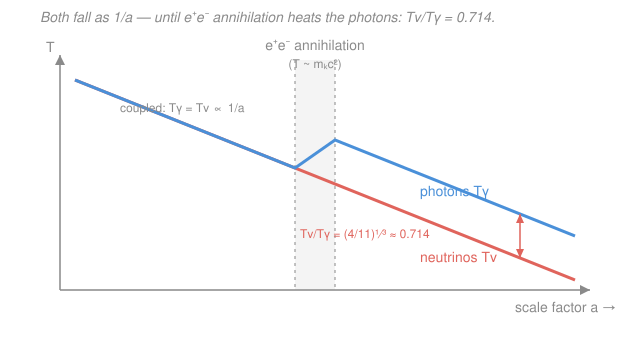

# Cosmology · Lesson 2.3: Relics and the neutrino background

> ⏱ ~15 min · Module 2: Thermal history and Big Bang nucleosynthesis · Builds on: [2.2 Decoupling and freeze-out](02-02-decoupling-freeze-out.md) · Unlocks: [2.4 Big Bang nucleosynthesis](02-04-big-bang-nucleosynthesis.md)

## Why this matters

The universe keeps receipts. Every time a species stops talking to the rest of the plasma, it freezes into a **relic** — a snapshot of the moment it decoupled, drifting freely ever after. The photons gave us the CMB. But there is an *older* relic: a sea of neutrinos that broke away when the universe was one second old and one billion Kelvin, and it is still here, about 340 of them in every cubic centimeter of the room you're in. This lesson derives the one number that makes that background precise — why the neutrinos ended up a touch *colder* than the photons, exactly $(4/11)^{1/3}$ as cold — and then uses the same freeze-out logic to explain why a heavy dark-matter particle with an ordinary weak-scale interaction naturally lands at the observed cosmic abundance. That coincidence, the "WIMP miracle," is one of the strongest hints we have about what dark matter might be.

## The idea

In [2.2](02-02-decoupling-freeze-out.md) we met the central competition of the early universe: a reaction stays in equilibrium only while its rate $\Gamma$ outpaces the expansion rate $H$. Neutrinos interact **only** through the weak force, and the weak rate collapses fast as things cool ($\Gamma \propto T^5$). Around $T \approx 1$ MeV — a photon energy of about a million electron-volts, roughly ten billion Kelvin — the weak rate falls below $H$ and the neutrinos simply stop colliding. They **free-stream** from then on: an untouched relic gas, the **cosmic neutrino background (C$\nu$B)**, the exact analog of the CMB but decoupled far earlier and hotter.

Here's the twist that makes them *colder* than the photons. Just after the neutrinos leave, the temperature dips below $m_e c^2 \approx 0.511$ MeV — the rest energy of the electron. Below that threshold, electron–positron pairs can no longer be replenished, so they **annihilate** into photons and dump all their energy and entropy into the photon bath. But the neutrinos have already left the party. They get *none* of that entropy. The photons are reheated; the neutrinos are not. From that moment on the two backgrounds cool in lockstep ($T \propto 1/a$) but with the photons permanently warmer, locked at a ratio we can compute exactly from bookkeeping the entropy.

## The formal version

**Neutrino decoupling.** The weak interaction rate per neutrino is $\Gamma = n\langle\sigma v\rangle \sim G_F^2\,T^5$, where $G_F$ is the Fermi constant (the strength of the weak force) and $T$ is the plasma temperature in energy units. In the radiation era the expansion rate is $H \sim T^2/M_{\rm Pl}$, with $M_{\rm Pl}$ the Planck mass (see [`relativity`](../../relativity/syllabus.md) for the Friedmann equation behind this). Their ratio is

$$\frac{\Gamma}{H} \sim \frac{G_F^2\,T^5}{T^2/M_{\rm Pl}} = G_F^2 M_{\rm Pl}\,T^3 \sim \left(\frac{T}{1\,\text{MeV}}\right)^3.$$

*In words: weak reactions run a thousand times faster than the expansion at 10 MeV, but a thousand times slower at 0.1 MeV — the crossover is a sharp $T^3$, so decoupling snaps shut near $T_{\rm dec}\approx 1$ MeV.* After that, neutrino number is frozen and each neutrino just redshifts.

**Entropy and $g_{*s}$.** From [2.1](02-01-hot-big-bang-thermal-equilibrium.md), the entropy density of a relativistic bath is $s \propto g_{*s}\,T^3$, where $g_{*s}$ is the **effective entropy degrees of freedom** — a headcount of species, weighted $1$ for each bosonic spin state and $\tfrac78$ for each fermionic one (the $\tfrac78$ is the Fermi–Dirac vs Bose–Einstein statistics factor from [`stat-mech`](../../stat-mech/syllabus.md)). For anything still in thermal contact, the comoving entropy is conserved:

$$g_{*s}\,(aT)^3 = \text{constant},$$

with $a$ the scale factor. *In words: as the universe expands, temperature drops like $1/a$ — unless species disappear and pour their entropy into what's left, which reheats the survivors.*

**The photon reheating factor.** Just before $e^+e^-$ annihilation, the coupled photon–electron–positron bath has

$$g_{*s}^{\text{before}} = \underbrace{2}_{\text{photons}} + \underbrace{\tfrac78 \cdot 4}_{e^-,\,e^+} = 2 + \tfrac72 = \frac{11}{2},$$

(photons have $2$ polarizations; electrons and positrons each have $2$ spin states, so $4$ fermionic states $\times\,\tfrac78$). After annihilation only photons remain coupled: $g_{*s}^{\text{after}} = 2$. Apply entropy conservation to this photon bath, and separately note that the *decoupled* neutrinos satisfy $a T_\nu = \text{const}$ on their own. Setting $T_\gamma = T_\nu$ at the instant before annihilation:

$$g_{*s}^{\text{before}}\,(a T_\gamma)^3_{\text{before}} = g_{*s}^{\text{after}}\,(a T_\gamma)^3_{\text{after}} \;\Longrightarrow\; (a T_\gamma)^3_{\text{after}} = \frac{11/2}{2}\,(a T_\gamma)^3_{\text{before}} = \frac{11}{4}\,(a T_\nu)^3.$$

Since $a T_\nu$ never changed, $\left(T_\gamma/T_\nu\right)^3 = 11/4$, i.e. the photons are boosted by $(11/4)^{1/3}\approx 1.40$ relative to the neutrinos. Inverting:

$$\boxed{\;\frac{T_\nu}{T_\gamma} = \left(\frac{4}{11}\right)^{1/3} \approx 0.714\;}$$

*In words: dumping the electron–positron entropy into the photons alone heats them by a factor $(11/4)^{1/3}$, so the neutrinos end up permanently at $71.4\%$ of the photon temperature.*

**The present neutrino background.** Today $T_\gamma = 2.725$ K (the measured CMB temperature), so

$$T_\nu = \left(\frac{4}{11}\right)^{1/3}\!\times 2.725\ \text{K} \approx 1.95\ \text{K}.$$

The number density works out to $n_\nu = \tfrac{3}{11}\,n_\gamma \approx 112\ \text{cm}^{-3}$ per flavor (neutrino plus antineutrino), or **about 340 cm$^{-3}$** summed over the three flavors. With eV-scale masses these neutrinos are non-relativistic today and contribute a small matter density $\Omega_\nu$; while relativistic they count as radiation.

**Effective radiation and $N_{\rm eff}$.** The total radiation energy density is photons plus neutrinos. Because each neutrino species carries $\tfrac78$ of a boson's energy and sits at temperature $T_\nu = (4/11)^{1/3}T_\gamma$,

$$\rho_r = \rho_\gamma\left[\,1 + \frac{7}{8}\left(\frac{4}{11}\right)^{4/3} N_{\rm eff}\,\right], \qquad N_{\rm eff} = 3.046.$$

*In words: the neutrinos add a fixed fraction on top of the photon energy, set by their number ($N_{\rm eff}$) and their cooler temperature (the $(4/11)^{4/3}$).* The value is $3.046$ rather than exactly $3$ because neutrino decoupling wasn't perfectly complete when annihilation began — the highest-energy neutrinos caught a sliver of the $e^+e^-$ entropy — plus small finite-temperature corrections. This $\rho_r$ fixes $\Omega_r$, the radiation budget that sets matter–radiation equality back in [1.5](01-05-cosmic-energy-budget-lambda-cdm.md).

**A general relic: the WIMP miracle.** The same freeze-out arithmetic applies to a hypothetical heavy, cold particle $\chi$. A species that annihilates with a thermally-averaged cross section $\langle\sigma v\rangle$ freezes out with a relic abundance

$$\Omega_\chi h^2 \approx \frac{3\times 10^{-27}\ \text{cm}^3\,\text{s}^{-1}}{\langle\sigma v\rangle},$$

where $h$ is the Hubble constant in units of $100\ \text{km s}^{-1}\text{Mpc}^{-1}$. Plug in a **weak-scale** cross section $\langle\sigma v\rangle \sim 3\times 10^{-26}\ \text{cm}^3\,\text{s}^{-1}$ and you get $\Omega_\chi h^2 \approx 0.1$, i.e. $\Omega_{\rm DM}\approx 0.26$ — exactly the observed dark-matter density. *In words: a particle whose interactions are as strong as the weak force, with no fine-tuning, freezes out at the right abundance to be all of dark matter.* That is the WIMP (Weakly Interacting Massive Particle) miracle, the bridge to [3.3](03-03-dark-matter-evidence-candidates.md) and to particle-physics model building (see [`nuclear-particle-physics`](../../nuclear-particle-physics/syllabus.md)).

## Picture

## Worked examples

**Example 1 (mechanical — the relic temperature).** What is the C$\nu$B temperature today, and how much colder is it than the CMB? Using $T_\gamma = 2.725$ K,

$$T_\nu = \left(\frac{4}{11}\right)^{1/3} T_\gamma = 0.714 \times 2.725\ \text{K} = 1.95\ \text{K},$$

so the neutrino sea is $71.4\%$ as warm as the photon sea — colder by the boost the photons alone received when the electrons and positrons annihilated. This 1.95 K background has never been detected directly (neutrinos this cold barely interact), but its energy density is felt indirectly through $N_{\rm eff}$, which the CMB and nucleosynthesis both measure.

**Example 2 (why you'd care — the WIMP number).** Suppose a dark-matter candidate annihilates with $\langle\sigma v\rangle = 3\times 10^{-26}\ \text{cm}^3\,\text{s}^{-1}$. Then

$$\Omega_\chi h^2 \approx \frac{3\times 10^{-27}}{3\times 10^{-26}} = 0.1,$$

and with $h\approx 0.68$, $\Omega_\chi \approx 0.1/0.68^2 \approx 0.22$–$0.26$. The striking part is the *scale*: nobody put the dark-matter density into the cross section by hand. A cross section characteristic of the weak interaction — the same force that decoupled the neutrinos — is precisely what's needed. Note the inverse relation: a *bigger* cross section means the particle stays coupled longer, annihilates more of itself away, and leaves a *smaller* relic. Freeze-out later ⇒ fewer survivors.

## Watch out

- **You might think the neutrinos are colder because they expanded more.** They didn't — both backgrounds redshift identically as $1/a$. The neutrinos are colder because the *photons got heated* by $e^+e^-$ annihilation after the neutrinos had already decoupled. It's a one-sided entropy injection, not a difference in cooling.
- **You might think $e^+e^-$ annihilation warms everything.** It only warms whatever is still in thermal contact — the photons. The already-decoupled neutrinos are spectators. If neutrinos had decoupled *later*, they'd have shared the entropy and $T_\nu = T_\gamma$. The timing is the whole point.
- **You might read $N_{\rm eff}=3.046$ as "3.046 species of neutrino."** There are exactly 3. $N_{\rm eff}$ is a *bookkeeping* number for the total relativistic energy in units of one ideal, fully-decoupled neutrino; the excess $0.046$ encodes the residual heating and QED corrections, not a fractional fourth neutrino. A measured value well above $3.046$ would signal extra relativistic relics ("dark radiation").

## One-liner

> Neutrinos froze out at 1 MeV just before $e^+e^-$ annihilation reheated the photons alone, leaving a 1.95 K relic sea forever $(4/11)^{1/3}$ as cold as the CMB — and the same freeze-out math makes a weak-scale particle the right amount of dark matter.

## Problems

**P1 (🟢)** Take the CMB temperature $T_\gamma = 2.725$ K. Compute today's cosmic neutrino background temperature $T_\nu$, and state the ratio $T_\nu/T_\gamma$.

**P2 (🟡)** Derive $T_\nu/T_\gamma = (4/11)^{1/3}$ from entropy conservation. Use $g_{*s}^{\text{before}} = \tfrac{11}{2}$ (photons $+\,e^\pm$) and $g_{*s}^{\text{after}} = 2$ (photons only) for the coupled bath, together with the fact that the decoupled neutrinos satisfy $a T_\nu = \text{const}$ and $T_\gamma = T_\nu$ just before annihilation. Show every step.

**P3 (🔴)** Compute the effective radiation factor $\displaystyle 1 + \frac{7}{8}\left(\frac{4}{11}\right)^{4/3} N_{\rm eff}$ for $N_{\rm eff}=3.046$. Then explain in one or two sentences what this factor does to the redshift of matter–radiation equality $1+z_{\rm eq} \propto 1/\Omega_r$ compared with counting photons only.

Solutions

**P1** Directly,

$$T_\nu = \left(\frac{4}{11}\right)^{1/3} T_\gamma = 0.7138 \times 2.725\ \text{K} = 1.945\ \text{K} \approx 1.95\ \text{K},$$

and the ratio is $T_\nu/T_\gamma = (4/11)^{1/3} \approx 0.714$.

*Check.* $(4/11)^{1/3}$: since $0.714^3 = 0.364 = 4/11$ ✓. The neutrino sea is a little colder than the photon sea, as it must be after the one-sided photon reheating. ✓

**P2** Entropy of the coupled photon(+$e^\pm$) bath is conserved: $g_{*s}\,(aT_\gamma)^3 = \text{const}$. Evaluate before and after $e^+e^-$ annihilation:

$$g_{*s}^{\text{before}}\,(a T_\gamma)^3_{\text{before}} = g_{*s}^{\text{after}}\,(a T_\gamma)^3_{\text{after}} \;\Longrightarrow\; \frac{11}{2}\,(a T_\gamma)^3_{\text{before}} = 2\,(a T_\gamma)^3_{\text{after}}.$$

The neutrinos decoupled first, so their comoving temperature is untouched: $(aT_\nu)_{\text{after}} = (aT_\nu)_{\text{before}}$. And just before annihilation everything shared one temperature, $T_{\gamma,\text{before}} = T_{\nu,\text{before}}$, so $(aT_\gamma)_{\text{before}} = (aT_\nu)_{\text{after}}$. Substitute that into the right-hand side:

$$2\,(a T_\gamma)^3_{\text{after}} = \frac{11}{2}\,(a T_\nu)^3_{\text{after}} \;\Longrightarrow\; \left(\frac{T_\gamma}{T_\nu}\right)^3 = \frac{11}{4} \;\Longrightarrow\; \frac{T_\nu}{T_\gamma} = \left(\frac{4}{11}\right)^{1/3}.$$

*Check.* $g_{*s}$ dropped from $11/2$ to $2$, a factor $11/4$; that entropy went into boosting $(aT_\gamma)$ by $(11/4)^{1/3}\approx 1.40$, so the neutrinos are relatively cooler by its inverse $(4/11)^{1/3}\approx 0.714$. ✓

**P3** Evaluate the bracket. First $(4/11)^{4/3} = \left[(4/11)^{1/3}\right]^4 = 0.7138^4 = 0.2596$. Then

$$\frac{7}{8}\times 0.2596 = 0.2271, \qquad 0.2271 \times 3.046 = 0.6918,$$

$$1 + 0.6918 = 1.692 \approx 1.69.$$

(With the idealized $N_{\rm eff}=3$ this is the textbook $1.68$; the extra $0.046$ nudges it to $1.69$.) So including neutrinos makes the total radiation density about $1.69\times$ the photon density alone. Since $\Omega_r$ is $69\%$ larger than a photon-only estimate, and $1+z_{\rm eq}\propto 1/\Omega_r$ scales inversely, matter–radiation equality happens at a **lower** redshift — matter dominates *later* — than you'd conclude by counting photons only. Getting $z_{\rm eq}$ right is why the neutrino contribution to $\Omega_r$ can't be dropped.

*Check.* $0.7138^2 = 0.5095$, squared again $= 0.2596$ ✓; $0.875\times 0.2596\times 3.046 = 0.692$ ✓.

## Flashback

**From Lesson 2.2 (Decoupling and freeze-out):** For the weak interactions that decouple the neutrinos, the ratio of reaction rate to expansion rate scales as $\Gamma/H \propto T^3$, and it equals $1$ at the decoupling temperature $T_{\rm dec} = 1$ MeV. At what temperature were the weak interactions running **1000 times** faster than the expansion?

Solution

Because $\Gamma/H \propto T^3$, and it equals $1$ at $T_{\rm dec}=1$ MeV, we can write $\Gamma/H = (T/1\,\text{MeV})^3$. Set this to $1000$:

$$\left(\frac{T}{1\,\text{MeV}}\right)^3 = 1000 \;\Longrightarrow\; \frac{T}{1\,\text{MeV}} = 1000^{1/3} = 10 \;\Longrightarrow\; T = 10\ \text{MeV}.$$

*Check.* Higher temperature ⇒ faster weak rate (the $T^5$ in $\Gamma$ beats the $T^2$ in $H$), so the ratio should exceed $1$ above $T_{\rm dec}$ — and indeed at $10\times$ the decoupling temperature the interactions are $10^3$ times faster, comfortably in equilibrium. Ten times *below* decoupling ($0.1$ MeV) they'd be $1000$ times too slow, deep in the free-streaming regime. This steep $T^3$ is exactly why decoupling is sudden rather than gradual. ✓

## Connections

- **Backward:** this is [2.2](02-02-decoupling-freeze-out.md)'s $\Gamma$-vs-$H$ competition applied to the weak force, and it uses the entropy-and-$g_*$ machinery of [2.1](02-01-hot-big-bang-thermal-equilibrium.md). The radiation density $\rho_r$ derived here is the $\Omega_r$ that set matter–radiation equality in [1.5](01-05-cosmic-energy-budget-lambda-cdm.md).
- **Forward:** [2.4](02-04-big-bang-nucleosynthesis.md) needs both results — the neutron-to-proton freeze-out is the *same* weak decoupling at $\sim 1$ MeV, and $N_{\rm eff}$ directly sets the expansion rate during nucleosynthesis, hence the primordial helium fraction. The relic-abundance formula returns in [3.3](03-03-dark-matter-evidence-candidates.md) for dark-matter candidates.
- **Sideways:** the WIMP miracle is a thermal-relic freeze-out calculation whose input is a particle-physics cross section — the bridge to weak-interaction physics in nuclear and particle physics (see [`nuclear-particle-physics`](../../nuclear-particle-physics/syllabus.md)). The underlying entropy bookkeeping and Fermi–Dirac $\tfrac78$ factor come straight from equilibrium statistical mechanics (see [`stat-mech`](../../stat-mech/syllabus.md)), and the expansion rate $H(T)$ is the Friedmann equation of [`relativity`](../../relativity/syllabus.md).
