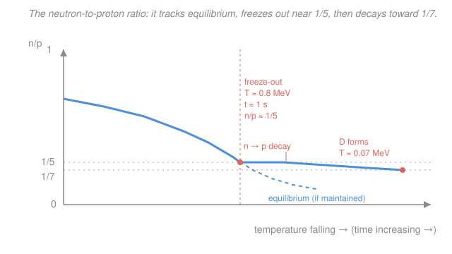

# Cosmology · Lesson 2.4: Big Bang nucleosynthesis

> ⏱ ~15 min · Module 2: Thermal history and Big Bang nucleosynthesis · Builds on: [2.3 Relics and the neutrino background](02-03-relics-neutrino-background.md), [2.2 Decoupling and freeze-out](02-02-decoupling-freeze-out.md) · Unlocks: [3.1 Recombination and the origin of the CMB](03-01-recombination-origin-cmb.md)

## Why this matters

For its first three minutes the universe was a nuclear reactor, and it left a receipt. About a quarter of all ordinary matter, by mass, is helium — and essentially every helium-4 nucleus you will ever meet was forged not in a star but in those first minutes, when the whole cosmos was hot and dense enough to fuse. **Big Bang nucleosynthesis (BBN)** predicts the primordial abundances of the light elements — H, D (deuterium), $^3$He, $^4$He, $^7$Li — from just a handful of numbers, and the predictions match observation across nine orders of magnitude. It is the earliest event we can test directly, and its most sensitive dial, the leftover deuterium, independently weighs all the baryons in the universe — a number the CMB will confirm in [3.6](03-06-reading-cmb-power-spectrum.md). This is one of the two great quantitative triumphs of the hot Big Bang (the CMB is the other).

## The idea

Rewind to one second after the bang, temperature $\sim 1$ MeV. The universe is a plasma of protons, neutrons, electrons and positrons, photons, and neutrinos, all in thermal contact. Neutrons and protons interconvert freely through weak reactions like $n + \nu_e \leftrightarrow p + e^-$, so their relative numbers sit at the value thermodynamics demands: because a neutron is slightly heavier than a proton, it is slightly harder to make, and equilibrium keeps a few more protons than neutrons.

Two clocks now race. As the universe cools, the weak reactions get slower (fewer energetic particles to drive them), while expansion keeps stretching everything apart. The moment the reactions can't keep up with expansion, the neutron-to-proton ratio **freezes** — locked in at whatever value it had, roughly one neutron per five protons. This is the same $\Gamma$-versus-$H$ competition that governs every freeze-out in [2.2](02-02-decoupling-freeze-out.md): a process shuts off when its rate drops below the expansion rate.

But there's a catch that delays the payoff. To build helium you first need deuterium (a proton stuck to a neutron), and deuterium is fragile — the sea of photons is so vast that even after the *average* photon is far too cool to break it apart, the rare high-energy photons in the tail still smash every deuteron the instant it forms. So fusion stalls in a **bottleneck** for a few minutes. During that wait, free neutrons quietly do what free neutrons do — they decay — dragging the ratio down from about 1/5 to about 1/7. Only when the universe is cool enough (around 0.07 MeV, three-ish minutes in) does deuterium finally survive, and then a burst of fast reactions funnels essentially every remaining neutron into $^4$He, the most tightly bound light nucleus. Count the neutrons at that moment and you know the helium yield. That's the whole story: **the helium fraction is set by how many neutrons survived to the three-minute mark.**

## The formal version

**Equilibrium n/p ratio.** While weak reactions are fast, the neutron and proton number densities follow a Boltzmann factor set by their rest-mass-energy difference:

$$\frac{n_n}{n_p} = \exp\!\left(-\frac{\Delta m\, c^2}{k_B T}\right), \qquad \Delta m\, c^2 = (m_n - m_p)c^2 = 1.293\ \text{MeV},$$

where $n_n,\,n_p$ are the number densities (per cubic meter), $T$ is the temperature, $k_B$ is Boltzmann's constant, and $\Delta m\,c^2$ is the neutron–proton mass gap in energy units. *In words: it costs 1.293 MeV of energy to turn a proton into a neutron, so the heavier neutron is exponentially rarer — and more so as the universe cools.* This is the same Boltzmann suppression from stat-mech that governs any two states separated by an energy gap. We write $r \equiv n_n/n_p$ from here on.

**Freeze-out.** The weak-interaction rate per particle scales steeply as $\Gamma_\text{weak} \propto T^5$, while the Hubble expansion rate goes as $H \propto T^2$ in the radiation era ([2.1](02-01-hot-big-bang-thermal-equilibrium.md)). They cross — $\Gamma_\text{weak} = H$ — at the **freeze-out temperature**

$$T_f \approx 0.8\ \text{MeV} \quad (t \approx 1\ \text{s}),$$

below which the interconversions effectively stop. *In words: once reactions are slower than the universe expands, the ratio stops adjusting and locks in.* Plugging $T_f$ into the Boltzmann factor:

$$r_f = \exp\!\left(-\frac{1.293}{0.8}\right) = e^{-1.616} \approx 0.20 \approx \frac{1}{5}.$$

**Neutron decay during the bottleneck.** Free neutrons are unstable, decaying $n \to p + e^- + \bar\nu_e$ with mean lifetime $\tau_n \approx 880\ \text{s}$. In the delay $\Delta t$ between freeze-out and the moment deuterium can finally survive, the surviving neutron fraction shrinks by $e^{-\Delta t/\tau_n}$, and each lost neutron becomes a proton. By the time deuterium forms (at $t \approx 3\ \text{min}$, $T \approx 0.07$ MeV), the ratio has fallen to

$$r_\text{BBN} \approx \frac{1}{7}.$$

*In words: waiting costs neutrons — decay converts the frozen 1/5 into roughly 1/7 before fusion can start.*

**The deuterium bottleneck.** Helium can't assemble directly; the gateway reaction is $p + n \to d + \gamma$, binding energy $B_D = 2.22\ \text{MeV}$. The obstacle is the **baryon-to-photon ratio**

$$\eta \equiv \frac{n_b}{n_\gamma} \approx 6 \times 10^{-10},$$

with $n_b$ the baryon density and $n_\gamma$ the photon density — photons outnumber baryons by more than a billion to one. Even when the *average* photon energy $k_B T$ has dropped below $B_D$, the exponential high-energy tail of the blackbody distribution still contains more than one photon per baryon above $2.22$ MeV, and those photons photodissociate deuterium ($d + \gamma \to p + n$) as fast as it forms. Deuterium only survives once

$$k_B T \;\lesssim\; \frac{B_D}{\ln(1/\eta)} \approx \frac{2.22\ \text{MeV}}{21} \approx 0.1\ \text{MeV},$$

*In words: because there are $1/\eta \sim 10^9$ photons per baryon, you must cool far below the binding energy — until even the rare energetic photons are outnumbered — before deuterium sticks.* A more careful count of the reaction rates puts the release at $T \approx 0.07$ MeV.

**The helium yield.** Once deuterium survives, fast reactions ($d + d$, $d + p$, etc.) rapidly channel nearly every free neutron into $^4$He, the most bound of the light nuclei. Since each $^4$He locks up 2 neutrons and 2 protons, the number of helium nuclei is $n_\text{He} = n_n/2$ (neutrons are the limiting reagent). The **primordial helium mass fraction** is the mass in helium divided by the total baryon mass. Taking each nucleon mass as $\approx 1$ unit and $^4$He mass as $\approx 4$:

$$Y_p = \frac{4\,n_\text{He}}{n_n + n_p} = \frac{4\,(n_n/2)}{n_n + n_p} = \frac{2\,n_n}{n_n + n_p} = \frac{2\,r}{1 + r},$$

dividing numerator and denominator by $n_p$ in the last step. *In words: the helium fraction depends only on the neutron-to-proton ratio at fusion.* With $r = 1/7$:

$$Y_p = \frac{2(1/7)}{1 + 1/7} = \frac{2/7}{8/7} = \frac{2}{8} = 0.25.$$

Roughly a quarter of all baryonic matter, by mass, is primordial helium — and it barely depends on the details, because it hinges almost entirely on one frozen ratio.

**Abundances as a baryometer.** Fusion is never perfectly efficient: trace amounts of D, $^3$He, and $^7$Li survive unburned. Deuterium is the key one because it is a *bottleneck intermediary* — the more baryons there are (larger $\eta$, hence larger $\Omega_b$), the faster the fusion chain runs to completion and the *less* leftover deuterium remains. Measured against Big Bang predictions, the observed primordial ratio $\text{D/H} \approx 2.5 \times 10^{-5}$ pins

$$\Omega_b h^2 \approx 0.022,$$

where $\Omega_b$ is the baryon density parameter and $h$ is the Hubble constant in units of $100\ \text{km/s/Mpc}$. This BBN measurement of the baryon content agrees with the completely independent value read off the CMB in [3.6](03-06-reading-cmb-power-spectrum.md) — two clocks 380,000 years apart telling the same time. (The one blemish: predicted $^7$Li is about three times the observed amount — the unresolved **lithium problem**.)

## Picture

The blue curve tracks equilibrium while weak reactions are fast, then departs at freeze-out (had it stayed coupled, it would keep diving along the dashed line toward zero). Instead it locks near $1/5$ and drifts slowly down to $1/7$ as free neutrons decay during the deuterium bottleneck.

## Worked examples

**Example 1 (the equilibrium ratio at a given temperature).** What is $n_n/n_p$ in equilibrium at $T = 2$ MeV, well before freeze-out? Straight from the Boltzmann factor:

$$r = \exp\!\left(-\frac{1.293}{2}\right) = e^{-0.6465} \approx 0.524 \approx \frac{1}{1.9}.$$

At 2 MeV the universe holds nearly one neutron per two protons — the mass gap barely matters when $k_B T$ is larger than it. By the time it cools to freeze-out at 0.8 MeV, the same formula gives $\approx 1/5$: cooling *magnifies* the mass-gap penalty exponentially, which is exactly why the ratio slides as the universe expands.

**Example 2 (why the helium fraction is so robust).** Suppose neutrons had *not* decayed at all during the bottleneck, so the ratio stayed frozen at $r = 1/5$. Then

$$Y_p = \frac{2(1/5)}{1 + 1/5} = \frac{2/5}{6/5} = \frac{2}{6} = 0.33.$$

Decay from $1/5$ to $1/7$ pulls the yield from $0.33$ down to $0.25$ — a real effect, but notice how *insensitive* $Y_p$ is: a 40% change in $r$ moves the helium fraction by only a third. That flatness is why $^4$He is a poor baryometer (it barely cares about $\eta$) but a superb *consistency check*: any hot Big Bang cooking neutrons at $r \sim 1/7$ must produce close to a quarter helium, full stop. Deuterium, by contrast, swings by orders of magnitude with $\eta$ — so it does the weighing.

## Watch out

- **You might think fusion begins as soon as $k_B T$ drops below the 2.22 MeV binding energy** (around $T \sim 2$ MeV). It doesn't — the enormous photon-to-baryon ratio means the blackbody tail still holds enough $>2.22$ MeV photons to shatter every deuteron until $T \approx 0.07$ MeV. The bottleneck delay is *set by $\eta$*, not by the binding energy alone.
- **You might think the "three minutes" is when freeze-out happens.** Freeze-out of the $n/p$ ratio is at $t \approx 1$ s; the *three minutes* is the later moment the deuterium bottleneck breaks and helium actually forms. The gap between them is the decay window that turns $1/5$ into $1/7$.
- **You might treat $Y_p = 2r/(1+r)$ as a number fraction.** It's a *mass* fraction — the factor of 2 (not 4) comes from $4 \times (n_n/2)$: four mass units per helium nucleus, one nucleus per two neutrons. Don't double-count.

## One-liner

> Helium is a fossil of the neutron-to-proton ratio: freeze-out locks it near $1/5$, decay trims it to $1/7$, and $Y_p = 2r/(1+r) \approx 0.25$ — while leftover deuterium weighs every baryon in the universe.

## Problems

**P1 (🟢)** (a) Compute the neutron-to-proton ratio $r$ at freeze-out, $T_f = 0.8$ MeV, from $r = e^{-1.293/0.8}$. (b) Using the mass-fraction formula $Y_p = 2r/(1+r)$ with the post-decay value $r = 1/7$, confirm the primordial helium fraction is about $0.25$.

**P2 (🟡)** Explain, using the bottleneck picture, why increasing the baryon-to-photon ratio $\eta$ (more baryons, larger $\Omega_b$) *lowers* the leftover primordial D/H. Address both the abundance of dissociating photons and the speed of the fusion chain.

**P3 (🔴, Boss-2 rehearsal)** Start from the frozen ratio $r_f = 1/5$ at $t_f \approx 1$ s. Free neutrons decay with $\tau_n = 880$ s (each lost neutron becoming a proton). Take the deuterium bottleneck to break at $t \approx 250$ s, so the decay window is $\Delta t \approx 250$ s. (a) Find the surviving-neutron factor $e^{-\Delta t/\tau_n}$. (b) Track both species and compute the new ratio $r_\text{BBN}$. (c) Feed it into $Y_p = 2r/(1+r)$ to get the helium mass fraction.

Solutions

**P1** (a) The exponent is $1.293/0.8 = 1.6163$, so

$$r = e^{-1.6163} = 0.199 \approx \frac{1}{5.03} \approx \frac{1}{5}.$$

(b) With $r = 1/7$:

$$Y_p = \frac{2(1/7)}{1 + 1/7} = \frac{2/7}{8/7} = \frac{2}{8} = 0.25. \checkmark$$

*Check.* $Y_p$ is a fraction between 0 and 1, and matches the observed primordial value $Y_p \approx 0.245$–$0.25$. ✓

**P2** Larger $\eta$ means more baryons per photon, i.e. the photon sea is *relatively* smaller. Two consequences both cut the deuterium leftover:

- *Fewer dissociators per baryon.* The bottleneck breaks when the number of $>2.22$ MeV photons *per baryon* drops below one. With more baryons (larger $\eta$), that condition is met at a slightly *higher* temperature — deuterium survives a touch earlier, giving the fusion chain more time and a denser medium to run in.
- *Faster fusion.* Reaction rates scale with the density of reactants, $\propto n_b$. More baryons means the D that forms is burned into $^4$He more rapidly and more completely, leaving less unburned deuterium behind.

Deuterium is a *transient intermediary* on the road to helium, so anything that speeds the road (more baryons) depletes it. Hence D/H falls steeply as $\eta$ (and $\Omega_b$) rises — which is exactly what makes measured D/H a precise baryometer, pinning $\Omega_b h^2 \approx 0.022$.

**P3** (a) Surviving-neutron factor:

$$f = e^{-\Delta t/\tau_n} = e^{-250/880} = e^{-0.2841} = 0.753.$$

(b) Track raw counts. Start with, say, $n_n = 1$ and $n_p = 5$ (ratio $1/5$). After the window, the surviving neutrons are $n_n' = 1 \times 0.753 = 0.753$, and the $1 - 0.753 = 0.247$ decayed neutrons each add a proton: $n_p' = 5 + 0.247 = 5.247$. So

$$r_\text{BBN} = \frac{0.753}{5.247} = 0.1435 \approx \frac{1}{7.0}. \checkmark$$

(c) Helium mass fraction:

$$Y_p = \frac{2(0.1435)}{1 + 0.1435} = \frac{0.287}{1.1435} = 0.251 \approx 0.25. \checkmark$$

*Check.* The decay window ($\sim 250$ s, just after the famous three-minute mark) turns the frozen $1/5$ into $1/7$ and lands the helium fraction on $0.25$ — the observed value. Note the small proton *increase* (from decayed neutrons) matters: ignoring it would give $r = 0.753/5 = 0.151$, slightly too high. ✓

## Flashback

**From Lesson 2.1 (Hot Big Bang and thermal equilibrium):** In the radiation era the time–temperature relation is $t \approx 2.4\,g_*^{-1/2}\,(T/\text{MeV})^{-2}$ seconds, where $g_*$ is the effective number of relativistic degrees of freedom. Just before $e^+e^-$ annihilation ($T \approx 0.8$ MeV) the relevant species are photons, $e^\pm$, and three neutrino families, giving $g_* = 10.75$. Estimate the age of the universe at freeze-out, $T = 0.8$ MeV.

Solution

Plug in $g_* = 10.75$ and $T = 0.8$ MeV:

$$t \approx \frac{2.4}{\sqrt{10.75}}\,(0.8)^{-2} = \frac{2.4}{3.279}\times\frac{1}{0.64} = 0.732 \times 1.5625 \approx 1.1\ \text{s}.$$

*Check.* This is the $t \approx 1$ s used as $t_f$ in the Boss problem above — freeze-out really does happen about one second in. The steep $T^{-2}$ scaling also shows why cooling from $0.8$ MeV to the $0.07$ MeV deuterium point ($\times 1/11$ in $T$) stretches the clock by $\sim 11^2 \approx 130$, landing fusion in the few-minute range. ✓

## Connections

- **Backward:** the $n/p$ freeze-out is the same $\Gamma$-versus-$H$ competition as chemical decoupling in [2.2](02-02-decoupling-freeze-out.md) — a rate falls below the expansion rate and a quantity locks in. The equilibrium ratio itself is a Boltzmann factor from stat-mech (a two-state energy gap), and the neutron background of leftover particles echoes the relic-abundance logic of [2.3](02-03-relics-neutrino-background.md). The expansion rate $H(T)$ and the radiation-era clock come from the Friedmann equations you built in the [relativity](../../relativity/syllabus.md) course.
- **Forward:** BBN fixes $\Omega_b h^2$, the total baryon budget, which reappears as the odd-versus-even peak heights of the CMB acoustic spectrum in [3.6](03-06-reading-cmb-power-spectrum.md) — and their agreement is a headline test of the hot Big Bang. Recombination in [3.1](03-01-recombination-origin-cmb.md) is the *next* time the photon-to-baryon ratio $\eta$ runs the show, this time delaying hydrogen recombination the way it here delayed deuterium.
- **Sideways:** the deuterium bottleneck is a nuclear-reaction-network problem — binding energies, photodissociation, and reaction cross-sections are the domain of nuclear and particle physics; the same blackbody high-energy-tail argument (a rare-but-decisive exponential tail) will return for the Saha equation at recombination.
