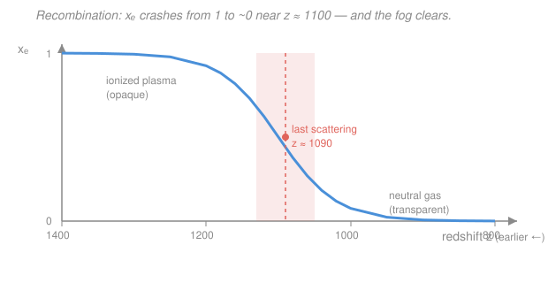

# Cosmology · Lesson 3.1: Recombination and the origin of the CMB

> ⏱ ~15 min · Module 3: The CMB and structure formation · Builds on: [2.4 Big Bang nucleosynthesis](02-04-big-bang-nucleosynthesis.md), Saha / ionization equilibrium from [`stat-mech`](../../stat-mech/syllabus.md) · Unlocks: [3.2 Gravitational instability and linear growth](03-02-gravitational-instability-linear-growth.md)

## Why this matters

The cosmic microwave background (CMB) is the oldest light in the universe and the single richest dataset in cosmology — a baby photo of the cosmos at 380,000 years old. But to read that photo you have to understand *how it was taken*: why the universe was an opaque fog for its first few hundred thousand years, and why it suddenly became transparent, releasing the light we still catch today. That moment — **recombination**, when electrons and protons paired into neutral hydrogen — is what this lesson is about. It's also a perfect echo of nucleosynthesis: the same enormous photon-to-baryon ratio that delayed deuterium in [2.4](02-04-big-bang-nucleosynthesis.md) delays neutral hydrogen here.

## The idea

Run the early universe forward. It starts hot and dense, and as it expands it cools ([relativity](../../relativity/syllabus.md) sets the FLRW expansion; recall $T \propto 1/a$). While it's hot, every hydrogen atom that tries to form gets instantly blasted apart by an energetic photon — the gas is a **plasma** of bare protons and free electrons. Free electrons are lethal to light: photons **Thomson-scatter** off them constantly, so a photon can't travel any distance in a straight line. The universe is *opaque*, like the inside of the Sun — a glowing fog.

Then it cools past a threshold. Around $T \sim 3000$ K the photons finally lack the punch to keep ripping atoms apart, and electrons settle onto protons: neutral hydrogen forms wholesale. This is **recombination** (a misnomer — the electrons and protons were never "combined" before, but the name stuck). With the free electrons gone, there's nothing left to scatter light. The fog clears in a geological instant. The photons that were bouncing around suddenly stream freely in straight lines — and they've been streaming ever since. Those are the CMB photons. The last place each one scattered before breaking free traces out a shell around us: the **surface of last scattering**.

Here's the twist that makes it interesting: naively you'd expect atoms to form when $k_B T \approx 13.6$ eV, the energy it takes to ionize hydrogen. But recombination waits until $k_B T \approx 0.3$ eV — about **forty times cooler**. The reason is the same one that held up nucleosynthesis: there are roughly a *billion* photons for every proton, so even when the *average* photon is far too weak to ionize hydrogen, the tiny high-energy tail of the photon distribution still contains enough ionizing photons to keep the gas broken apart. Hydrogen can't win until the universe is *drastically* colder than the binding energy suggests.

## The formal version

**The ionization threshold.** Hydrogen's binding energy is $B = 13.6$ eV — the energy needed to knock the electron off. A photon with energy above $B$ can ionize an atom; the reaction runs both ways:
$$p + e^- \;\rightleftharpoons\; H + \gamma.$$
*In words: protons and electrons combine into a neutral atom, emitting a photon; and a photon can reverse it, ionizing the atom back apart.* Which direction wins is set by temperature and density — a chemical equilibrium.

**The Saha equation.** In thermal equilibrium, the balance point is given by the Saha equation (a Boltzmann-factor result from [`stat-mech`](../../stat-mech/syllabus.md) — this is *exactly* the ionization equilibrium chemists use for stellar atmospheres and flames; the same physics that governs any ionization balance in chemistry). Writing $x_e = n_e/n_b$ for the **free-electron fraction** ($n_e$ = free-electron number density, $n_b$ = total baryon = proton density, so $x_e = 1$ is fully ionized and $x_e = 0$ fully neutral),
$$\frac{1 - x_e}{x_e^{2}} \;=\; n_b \left(\frac{2\pi m_e k_B T}{h^{2}}\right)^{-3/2} e^{\,B / k_B T}.$$
Here $m_e$ = electron mass, $k_B$ = Boltzmann's constant, $h$ = Planck's constant, $T$ = temperature. *In words: the ratio of neutral atoms to (free electrons)² is governed by a Boltzmann factor $e^{B/k_BT}$ — how hard it is to ionize — divided by the number of thermally accessible quantum states $(2\pi m_e k_B T/h^2)^{3/2}$ available to a free electron.*

The right side has a giant $e^{B/k_BT}$ pushing toward neutral, fought by a small prefactor $\propto n_b$. Because $n_b$ is minuscule — the photon-to-baryon ratio is $\eta^{-1} \sim 10^{9}$, i.e. $\eta = n_b/n_\gamma \approx 6\times10^{-10}$ — the equation only tips toward neutral ($x_e \to 0$) when $e^{B/k_BT}$ has grown truly enormous, which needs $B/k_BT \approx 40$, i.e. $k_B T \approx 0.3$ eV. **Same $1/\eta$ logic as the deuterium bottleneck in [2.4](02-04-big-bang-nucleosynthesis.md):** a flood of photons keeps the reaction from completing until $k_BT$ is far below the binding energy.

**Decoupling and last scattering.** Neutral atoms don't scatter light nearly as well as free electrons, so photons stop scattering once $x_e$ collapses. Quantitatively, photons **decouple** when the Thomson scattering rate falls below the expansion rate,
$$\Gamma_{\rm T} = n_e \,\sigma_{\rm T}\, c \;\lesssim\; H,$$
where $\sigma_{\rm T}$ = Thomson cross-section and $H$ = Hubble rate. *In words: when a photon scatters less than once per expansion time, it's effectively free.* This is the **same $\Gamma$-vs-$H$ freeze-out competition** as chemical decoupling and neutrino decoupling ([2.2](02-02-decoupling-freeze-out.md)). It happens at $z_{\rm ls} \approx 1090$, just *after* recombination proper ($z \approx 1100$) — because $\Gamma_{\rm T} \propto n_e = x_e n_b$, you need $x_e$ to have already dropped a lot. Keep the two ideas distinct: **recombination** = atoms form ($x_e$ crashes); **decoupling / last scattering** = photons break free. They nearly coincide, decoupling trailing slightly.

**The CMB blackbody.** The last-scattered photons carried the thermal spectrum of the $\sim 3000$ K gas — a near-perfect **blackbody** (Planck spectrum). Expansion has since redshifted them by a factor $1 + z_{\rm ls} \approx 1091$, cooling the blackbody to
$$T_0 = 2.725\ \text{K}$$
today (measured by COBE/FIRAS — the most perfect blackbody ever observed in nature, deviations below $10^{-4}$). Crucially, **a blackbody stays a blackbody under expansion**: because every photon frequency redshifts as $\nu \propto 1/a$ *and* the temperature falls as $T \propto 1/a$, the ratio $h\nu/k_BT$ is frozen, so the Planck form is preserved with only $T$ shrinking (you'll prove this in P3). The spectrum peaks in the microwave (wavelength $\sim 1$ mm). Overlaid on the uniform glow are a $\sim 3.4$ mK **dipole** from our $\sim 370$ km/s motion through the CMB rest frame, and — once that's removed — tiny $\Delta T / T \sim 10^{-5}$ **anisotropies**: the primordial density seeds of every galaxy and cluster, which we'll decode in [3.5](03-05-cmb-anisotropies-acoustic-oscillations.md).

## Picture

The blue Saha curve shows $x_e$ holding near 1 (fully ionized) at high redshift, then plunging through the coral band — the narrow window where the universe recombines, decouples, and the CMB is released.

## Worked examples

**Example 1 (mechanical — temperature then, temperature now).** The CMB temperature scales as $T \propto 1/a = 1 + z$ (redshift from [1.3](01-03-redshift-cosmic-distances.md); the FLRW scale factor from [relativity](../../relativity/syllabus.md)). Given $T_0 = 2.725$ K today and last scattering at $z_{\rm ls} = 1100$,
$$T_{\rm ls} = T_0 (1 + z_{\rm ls}) = 2.725 \times 1101 \approx 3000\ \text{K}.$$
Convert to energy: $k_B T_{\rm ls} = (8.617\times10^{-5}\ \text{eV/K})(3000\ \text{K}) \approx 0.26$ eV — safely below $B = 13.6$ eV, as recombination requires. Every CMB photon has also had its wavelength stretched by $1 + z_{\rm ls} \approx 1100$: light emitted near the peak of a 3000 K blackbody (around $1\ \mu$m, near-infrared) reaches us near $1\ \mu\text{m} \times 1100 \approx 1.1$ mm — microwaves.

**Example 2 (why you'd care — the fog metaphor made quantitative).** Why is the plasma opaque but neutral gas transparent? Opacity is set by the mean free path $\ell = 1/(n_e \sigma_{\rm T})$. Before recombination $n_e = n_b \sim 300\ \text{cm}^{-3}$ and $\sigma_{\rm T} = 6.65\times10^{-25}\ \text{cm}^2$, giving $\ell \sim 5\times10^{21}$ cm $\approx 1.6$ kpc — vanishingly small compared to the horizon, so photons random-walk in place: opaque. After recombination $x_e$ drops by orders of magnitude, $n_e$ with it, and $\ell$ balloons past the horizon size: a photon crosses the observable universe without scattering. The switch from "trapped" to "free" is that sudden because $\ell \propto 1/x_e$ and $x_e$ falls off a cliff.

## Watch out

- **You might think recombination happens at $k_B T \approx 13.6$ eV** because that's the binding energy. It happens at $\approx 0.3$ eV, ~40× cooler. The culprit is $\eta \approx 6\times10^{-10}$: a billion photons per baryon means the high-energy tail keeps hydrogen ionized long after the *average* photon has gone soft. Ionization is a competition against photon *number*, not photon *average energy*.
- **You might treat recombination and last scattering (decoupling) as the same event.** They're distinct: atoms forming ($x_e$ collapsing) is recombination; photons stopping scattering is decoupling. Decoupling follows recombination slightly, because the scattering rate $\Gamma_{\rm T} \propto x_e$ needs $x_e$ to have already fallen. On a plot they're a hair apart; conceptually they're two steps.
- **You might think expansion should distort the CMB away from a blackbody** (redshifting "reddens" it, surely?). No — redshift cools a blackbody but keeps it a blackbody, because $\nu$ and $T$ redshift together and $h\nu/k_BT$ is invariant. That's why the observed spectrum is Planck to one part in $10^4$ despite a factor-1100 stretch.

## One-liner

> The universe cooled to $\sim 3000$ K, electrons latched onto protons, the fog of free electrons cleared, and the trapped thermal light streamed free — redshifting over 13.8 billion years into the 2.725 K microwave blackbody we call the CMB.

## Problems

**P1 (🟢)** Take $T_0 = 2.725$ K and last scattering at $z_{\rm ls} = 1100$. (a) Find the CMB temperature at last scattering. (b) By what factor has each CMB photon's wavelength been stretched between then and now?

**P2 (🟡)** Using the Saha logic with $\eta \approx 6\times10^{-10}$, estimate the temperature of recombination and show it must be far below $B = 13.6$ eV. Use the crude criterion that hydrogen stays ionized until the fraction of blackbody photons above the ionization energy, roughly $e^{-B/k_BT}$, drops to order $\eta$. Why does the tiny value of $\eta$ force $k_BT \ll B$?

**P3 (🔴)** Show that a blackbody spectrum stays a blackbody under cosmic expansion, with temperature falling as $T \propto 1/a$. Use that (i) every photon's frequency redshifts as $\nu \propto 1/a$, and (ii) the number of photons is conserved and the occupation number of each mode is preserved as the universe expands.

Solutions

**P1** (a) Temperature scales as $T \propto 1 + z$:
$$T_{\rm ls} = T_0(1 + z_{\rm ls}) = 2.725 \times (1 + 1100) = 2.725 \times 1101 \approx 3000\ \text{K}.$$
*(In energy units, $k_B T_{\rm ls} \approx 0.26$ eV.)*
(b) Wavelength stretches by the same factor the universe expanded, $1 + z_{\rm ls}$:
$$\frac{\lambda_{\rm obs}}{\lambda_{\rm emit}} = 1 + z_{\rm ls} = 1101 \approx 1.1\times10^{3}.$$
*Check.* A 3000 K blackbody peaks near $1\ \mu$m; stretched by 1101 that's $\approx 1.1$ mm, the microwave band the CMB actually peaks in. ✓

**P2** Criterion: recombination completes when the ionizing-photon supply drops to roughly one per baryon, i.e. when the fraction of photons above $B$ falls to $\sim \eta$. Approximating the high-energy tail of the Planck distribution by its Boltzmann factor, that fraction is $\sim e^{-B/k_BT}$. Set it equal to $\eta$:
$$e^{-B/k_BT} \sim \eta \quad\Longrightarrow\quad \frac{B}{k_BT} \sim \ln\!\frac{1}{\eta} = \ln\!\frac{1}{6\times10^{-10}} = \ln(1.7\times10^{9}) \approx 21.$$
So
$$k_BT \sim \frac{B}{21} = \frac{13.6\ \text{eV}}{21} \approx 0.65\ \text{eV},$$
already more than an order of magnitude below $B$. The full Saha equation adds the phase-space prefactor $(2\pi m_e k_BT/h^2)^{3/2}/n_b$, which contributes another factor of $\sim e^{20}$, pushing the log up to $B/k_BT \approx 40$ and the answer down to $k_BT \approx 0.3$ eV ($T \approx 3700$ K, $z \approx 1400$ in the Saha approximation; the true half-ionization point is a bit later, near $z \approx 1200$).

*Why $\eta$ forces $k_BT \ll B$:* if there were one photon per baryon ($\eta \sim 1$), you'd get $B/k_BT \sim \ln 1 = 0$ — recombination as soon as $k_BT \lesssim B$, the naive answer. But with a *billion* photons per baryon, even after the mean photon energy has dropped far below $B$, the exponentially rare tail still holds $\sim \eta^{-1}\sim 10^9$-times-too-many ionizing photons. You must cool until that tail thins to $\sim \eta$, which takes $k_BT$ down by the factor $\ln(1/\eta)\approx 21$–$40$. This is precisely the deuterium bottleneck of [2.4](02-04-big-bang-nucleosynthesis.md) wearing new clothes.

*Check.* $0.3$ eV $\leftrightarrow 3500$ K via $k_B = 8.6\times10^{-5}$ eV/K, consistent with $T_{\rm ls}\approx 3000$ K from P1. ✓

**P3** Consider the photons at scale factor $a$ with a Planck spectrum at temperature $T$. The number of photons per unit volume in the frequency interval $[\nu, \nu + d\nu]$ is
$$n(\nu)\,d\nu = \frac{8\pi \nu^{2}}{c^{3}} \, \frac{1}{e^{\,h\nu/k_BT} - 1}\, d\nu,$$
where the last factor is the mode occupation number. Now expand the universe to $a' = a(1+z)$. Two things happen:

1. **Every frequency redshifts:** $\nu \to \nu' = \nu\,(a/a') = \nu/(1+z)$, so $\nu \propto 1/a$. Likewise a band $d\nu \to d\nu' = d\nu/(1+z)$.
2. **Photons are conserved and diluted only by volume:** the number in a comoving region is fixed, and physical volume grows as $a^3$, so number densities scale as $n \to n/(1+z)^3$. Equivalently, the occupation number of each redshifting mode is unchanged — expansion is adiabatic for the photon gas.

Track the occupation number of the mode that is now at $\nu'$. It was the mode at $\nu = \nu'(1+z)$ before, whose occupation was $\left[e^{h\nu/k_BT} - 1\right]^{-1} = \left[e^{h\nu'(1+z)/k_BT} - 1\right]^{-1}$, and that value is carried along unchanged. Define
$$T' \equiv \frac{T}{1+z}.$$
Then $\dfrac{h\nu'(1+z)}{k_BT} = \dfrac{h\nu'}{k_B T'}$, so the occupation of the mode now at $\nu'$ is
$$\frac{1}{e^{\,h\nu'/k_BT'} - 1}.$$
That is *exactly* the Planck occupation number at temperature $T'$. Since the prefactor $8\pi\nu'^2/c^3$ is just the (unchanged) density of modes, the full spectrum $n(\nu')$ is again a Planck spectrum — now at $T' = T/(1+z)$. So the blackbody form is preserved and only the temperature drops, $T \propto 1/(1+z) \propto 1/a$. $\blacksquare$

*Check.* The invariant is $h\nu/k_BT$: both numerator ($\nu\propto 1/a$) and denominator ($T\propto 1/a$) redshift identically, so the dimensionless spectral shape never changes — only its temperature scale slides. This is why a 3000 K release survives as a pristine 2.725 K blackbody today. ✓

## Flashback

**From Lesson 2.4 (Big Bang nucleosynthesis):** Neutron–proton freeze-out fixes the primordial helium abundance. The neutron–proton mass difference gives $Q = 1.29$ MeV, and weak interactions freeze out at $k_BT_{\rm f} \approx 0.8$ MeV. (a) Estimate the neutron-to-proton ratio $n/p$ at freeze-out. (b) By the time nucleosynthesis completes, neutron decay has lowered this to about $n/p \approx 1/7$; estimate the helium mass fraction $Y_p = \dfrac{2(n/p)}{1 + (n/p)}$.

Solution

(a) In equilibrium the ratio is a Boltzmann factor in the mass-energy difference:
$$\frac{n}{p} = e^{-Q/k_BT_{\rm f}} = e^{-1.29/0.8} = e^{-1.61} \approx 0.20 \approx \frac{1}{5}.$$
(b) With $n/p = 1/7$ at the onset of fusion (nearly all neutrons end up in $^4$He, two neutrons per helium nucleus):
$$Y_p = \frac{2(n/p)}{1 + (n/p)} = \frac{2 \times \tfrac{1}{7}}{1 + \tfrac{1}{7}} = \frac{2/7}{8/7} = \frac{2}{8} = 0.25.$$

*Check.* $Y_p \approx 0.25$ — a quarter of the baryonic mass in helium — matches observation and is one of the Big Bang's flagship predictions. Note the freeze-out logic ($\Gamma \lesssim H$) is the *same competition* that sets decoupling in this lesson; only the reaction changes. ✓

## Connections

- **Backward:** recombination is the ionization twin of the deuterium bottleneck in [2.4](02-04-big-bang-nucleosynthesis.md) — both wait for $k_BT$ to fall *far* below a binding energy because of the huge photon-to-baryon ratio $\eta^{-1}\sim10^9$. The decoupling criterion $\Gamma \lesssim H$ is the freeze-out logic of [2.2](02-02-decoupling-freeze-out.md), and the cooling law $T \propto 1/a$ traces back to the thermal-history and redshift lessons ([2.1](02-01-hot-big-bang-thermal-equilibrium.md), [1.3](01-03-redshift-cosmic-distances.md)).
- **Forward:** the surface of last scattering is the screen onto which all CMB observations are projected. The tiny $\Delta T/T \sim 10^{-5}$ fluctuations it carries are the initial conditions for [3.2](03-02-gravitational-instability-linear-growth.md)'s gravitational growth, and their statistics become the acoustic peaks decoded in [3.5](03-05-cmb-anisotropies-acoustic-oscillations.md) and [3.6](03-06-reading-cmb-power-spectrum.md).
- **Sideways:** the Saha equation is standard ionization-equilibrium statistical mechanics ([`stat-mech`](../../stat-mech/syllabus.md)) — the very same balance that governs ionization in stellar atmospheres and in a chemistry-class flame test. And the blackbody-preservation argument is a Planck-spectrum result from thermal physics; the CMB is the largest and most perfect blackbody thermodynamics has ever handed us.
