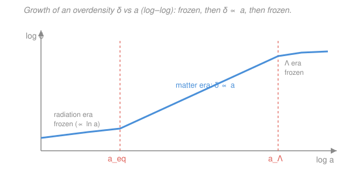

# Cosmology · Lesson 3.2: Gravitational instability and linear growth

> ⏱ ~15 min · Module 3: The CMB and structure formation · Builds on: [3.1 Recombination and the origin of the CMB](03-01-recombination-origin-cmb.md) · Unlocks: [3.3 Dark matter: evidence and candidates](03-03-dark-matter-evidence-candidates.md)

## Why this matters

The universe today is lumpy — galaxies, clusters, cosmic web — yet [the CMB](03-01-recombination-origin-cmb.md) shows it started almost perfectly smooth, with density variations of one part in $10^5$. How did a nearly featureless plasma become a sky full of galaxies? The answer is **gravitational instability**: gravity is an amplifier that turns tiny overdensities into big ones. This lesson is the engine of all structure formation. It tells you *which* lumps grow and which just ring like sound waves (the Jeans criterion), *how fast* they grow in each cosmic era, and — crucially — *why the universe needs dark matter* to have built structure in the time available. That last point sets up all of [3.3](03-03-dark-matter-evidence-candidates.md) and the power spectrum in [3.4](03-04-matter-power-spectrum.md).

## The idea

Gravity is unstable in the best possible way. Take a region that is slightly denser than average. It has slightly more mass, so it pulls surrounding matter in a little harder, so it gets denser still, so it pulls harder still. More mass makes more pull makes more mass — a runaway. Left alone, gravity turns any speck of excess density into a collapsing clump. That is the whole story of how the cosmic web grew.

But gravity has a rival: **pressure**. Squeeze gas and it pushes back. So there's a competition. If a lump is *big* enough, its self-gravity wins and it collapses. If it's *small* enough, pressure has time to react — the lump just bounces back and oscillates as a sound wave, never collapsing. The dividing size is the **Jeans length**. Bigger than that, you collapse; smaller, you ring.

There's one more twist that makes cosmic structure formation different from a static gas cloud: **the universe is expanding**. Expansion works against collapse — it's constantly pulling your overdense region apart, like trying to pile up sand while the ground stretches beneath you. The result is that gravity still wins for big lumps, but it wins *slowly*: growth is no longer an explosive exponential but a gentle power law in time. And in eras when the expansion is especially fast (radiation domination, or the late dark-energy era), growth nearly stops altogether.

## The formal version

Describe lumpiness with the **density contrast**

$$\delta(\mathbf{x}, t) \equiv \frac{\rho(\mathbf{x}, t) - \bar\rho(t)}{\bar\rho(t)},$$

where $\rho$ is the local matter density at position $\mathbf{x}$ and time $t$, and $\bar\rho$ is the average density of the universe. *In words: $\delta$ measures the fractional excess (or deficit) of density.* $\delta = 0$ is exactly average, $\delta = 1$ is twice the mean, $\delta = -1$ is empty. The **linear regime** is $|\delta| \ll 1$ — small ripples, where the equations can be linearized. (Today's galaxies have $\delta \sim 10^6$, deeply nonlinear; but every structure passed through the linear regime first, and that early growth is what we can calculate cleanly.)

**Jeans analysis (static medium).** Model matter as a self-gravitating fluid governed by three equations: **continuity** (mass conservation), **Euler** (Newton's law for a fluid, with a pressure force), and **Poisson** (gravity sources the potential). Write each quantity as background-plus-perturbation ($\rho = \bar\rho + \delta\rho$, etc.), keep only first-order terms, and look for a plane-wave ripple $\delta \propto e^{i(\mathbf{k}\cdot\mathbf{x} - \omega t)}$ with wavenumber $k = 2\pi/\lambda$ (wavelength $\lambda$) and frequency $\omega$. The three equations collapse to one **dispersion relation**:

$$\boxed{\;\omega^2 = c_s^2 k^2 - 4\pi G \bar\rho\;}$$

where $c_s$ is the sound speed (how fast pressure signals travel) and $G$ is Newton's constant. *In words: the pressure term $c_s^2 k^2$ pushes toward oscillation; the gravity term $4\pi G\bar\rho$ pushes toward collapse.* Everything hangs on the sign of $\omega^2$:

- $\omega^2 > 0$ ⇒ $\omega$ real ⇒ $\delta$ oscillates: a **sound wave**. Pressure won.
- $\omega^2 < 0$ ⇒ $\omega$ imaginary ⇒ $\delta \propto e^{|\omega| t}$ grows exponentially: **collapse**. Gravity won.

The break-even point $\omega = 0$ defines the **Jeans wavenumber** and **Jeans length**:

$$k_J = \frac{\sqrt{4\pi G\bar\rho}}{c_s}, \qquad \lambda_J = \frac{2\pi}{k_J} = c_s\sqrt{\frac{\pi}{G\bar\rho}}.$$

Modes with $k < k_J$ — i.e. wavelengths **longer** than $\lambda_J$ — are unstable and collapse; shorter wavelengths oscillate. (Long wavelength = big region = more enclosed mass = gravity wins. Intuitive.) The mass inside a sphere of the Jeans length sets the **Jeans mass** $M_J \sim \tfrac{4}{3}\pi\bar\rho(\lambda_J/2)^3$ — the smallest cloud that can collapse under its own gravity.

**Growth in an expanding universe.** Redo the fluid analysis on the expanding FLRW background (from the relativity course, [`relativity` syllabus](../../relativity/syllabus.md) — scale factor $a(t)$, Hubble rate $H = \dot a/a$). For a pressureless matter perturbation on scales *well below* the Jeans length (so we can drop pressure entirely), the linearized equation for $\delta$ becomes

$$\boxed{\;\ddot\delta + 2H\dot\delta - 4\pi G\bar\rho_m\,\delta = 0\;}$$

where $\bar\rho_m$ is the mean matter density and dots are time derivatives. *In words: acceleration of the contrast, minus a gravity-driven growth term, plus a brand-new middle term $2H\dot\delta$ — "Hubble friction" — that drags on growth exactly like air resistance drags on a falling body.* Compare it to the runaway static case ($\ddot\delta = 4\pi G\bar\rho\,\delta$, pure exponential): the $2H\dot\delta$ term is what tames the explosion into a power law. Being second-order, it has **two independent solutions**: a **growing mode** $\delta_+(t)$ and a **decaying mode** $\delta_-(t)$, and $\delta(t) = C_+\delta_+ + C_-\delta_-$.

**Growth in each era** (the results you must remember):

- **Matter era** (Einstein–de Sitter, matter-dominated): $\delta_+ \propto a \propto t^{2/3}$. Perturbations grow **linearly with the scale factor** — the workhorse regime where structure is built. (Problem 1 verifies this; Problem 3 finds the companion decaying mode.)
- **Radiation era**: growth is nearly **frozen** — the **Mészáros effect**. Sub-horizon dark-matter lumps grow only *logarithmically* ($\delta \propto \ln a$, barely) because radiation dominates the expansion (fast Hubble friction) but is too smooth and fast-moving to clump, so it doesn't help gravity. This suppression of early growth imprints the turnover in the [matter power spectrum (3.4)](03-04-matter-power-spectrum.md).
- **$\Lambda$ (dark-energy) era**: growth freezes **again**, $\delta_+ \to$ const. Accelerated expansion (from the [energy budget, 1.5](01-05-cosmic-energy-budget-lambda-cdm.md)) stretches space faster than gravity can pull material together — the runaway outruns collapse.

**Why dark matter matters (bridge to [3.3](03-03-dark-matter-evidence-candidates.md)).** Before recombination, baryons are locked to photons in the plasma, so their sound speed is enormous and their Jeans mass is huge — baryon perturbations **cannot grow**, they just oscillate (those are the acoustic waves of [3.5](03-05-cmb-anisotropies-acoustic-oscillations.md)). Dark matter is different: it's pressureless and doesn't feel photons, so it starts growing the instant matter comes to dominate the expansion, at **matter–radiation equality** $a_\text{eq}$. By recombination, dark matter has already dug deep gravitational potential wells. When baryons finally decouple from photons at [recombination (3.1)](03-01-recombination-origin-cmb.md), they fall straight into those ready-made wells and catch up fast. Without dark matter's head start, there simply wasn't enough time to grow galaxies from $\delta \sim 10^{-5}$ to $\delta \sim 1$ by today.

## Picture

The growing mode $\delta_+(a)$: flat (Mészáros-frozen) before $a_\text{eq}$, a clean unit-slope climb $\delta \propto a$ through the matter era, then flattening again once dark energy takes over at $a_\Lambda$. On a log–log plot "$\delta \propto a$" is just a straight line of slope 1 — the signature of the matter era.

## Worked examples

**Example 1 (mechanical — the Jeans criterion in action).** A cold molecular cloud has mean density $\bar\rho = 10^{-18}\ \mathrm{kg/m^3}$ and sound speed $c_s = 300\ \mathrm{m/s}$. Is it stable? Compute the Jeans length:

$$\lambda_J = c_s\sqrt{\frac{\pi}{G\bar\rho}} = 300\sqrt{\frac{3.14}{(6.67\times10^{-11})(10^{-18})}} = 300\sqrt{4.7\times10^{28}} \approx 6.5\times10^{16}\ \mathrm{m} \approx 2.1\ \mathrm{pc}.$$

Any part of the cloud bigger than about 2 pc across will collapse; anything smaller just oscillates. This is (schematically) how star-forming clouds decide to fragment.

**Example 2 (why you'd care — how much can structure grow?).** Dark-matter perturbations effectively start growing at equality, $a_\text{eq} \approx 3\times10^{-4}$ (redshift $z_\text{eq}\approx 3400$), and grow as $\delta \propto a$ through the matter era until dark energy freezes them near $a_\Lambda \approx 0.75$. So the *maximum* linear growth factor is roughly

$$\frac{\delta(a_\Lambda)}{\delta(a_\text{eq})} \approx \frac{a_\Lambda}{a_\text{eq}} \approx \frac{0.75}{3\times10^{-4}} \approx 2500.$$

Starting from CMB-era ripples of $\delta \sim 10^{-5}$, linear growth alone reaches only $\delta \sim 10^{-5}\times 2500 \sim 0.025$ — still small! That's exactly why the final collapse into galaxies ($\delta \gg 1$) must be **nonlinear**, and why the growth had to begin as early as $a_\text{eq}$ (dark matter), not at recombination (baryons). Every factor of expansion counts.

## Watch out

- **You might think all overdense regions collapse.** Only those larger than the Jeans length do; smaller ones have pressure support and merely oscillate as sound waves. "More mass ⇒ more pull" is true, but pressure gets a vote, and on small scales it wins.
- **You might expect exponential collapse like a static cloud.** In an expanding universe the $2H\dot\delta$ Hubble-friction term throttles growth down to a power law ($\delta \propto a$ in the matter era). Expansion never quite stops collapse for large-scale modes, but it slows it dramatically — and in the radiation and $\Lambda$ eras it nearly halts it.
- **You might think baryons and dark matter grow together.** Before recombination baryons are pressure-locked to photons and can't grow at all; dark matter grows from $a_\text{eq}$ onward. The baryons catch up *later* by falling into dark-matter wells. Ignoring this makes the observed structure impossible to explain in the available time.
- **Don't confuse $\delta \propto a$ with $\rho \propto a$.** The *background* matter density falls as $\bar\rho_m \propto a^{-3}$; it's the *contrast* $\delta$ (the fractional lumpiness) that grows as $a$. Both happen at once.

## One-liner

> Gravity amplifies overdensities, pressure resists on scales below the Jeans length, and cosmic expansion (Hubble friction) slows the amplification to $\delta \propto a$ in the matter era — frozen before equality and after dark energy takes over.

## Problems

**P1 (🟢)** Verify that $\delta \propto t^{2/3}$ (equivalently $\delta \propto a$) is a solution of the matter-era growth equation $\ddot\delta + 2H\dot\delta - 4\pi G\bar\rho_m\delta = 0$. Use the Einstein–de Sitter background values $H = \dfrac{2}{3t}$ and $\bar\rho_m = \dfrac{1}{6\pi G t^2}$.

**P2 (🟡)** A cloud has $\bar\rho = 10^{-18}\ \mathrm{kg/m^3}$ and $c_s = 300\ \mathrm{m/s}$ (as in Example 1). (a) Estimate its Jeans mass $M_J \approx \tfrac{4}{3}\pi\bar\rho(\lambda_J/2)^3$. (b) A density mode of wavelength $\lambda = 5\ \mathrm{pc}$ ripples through it — does it collapse or oscillate? Use $\lambda_J \approx 2.1\ \mathrm{pc}$ from Example 1, $G = 6.67\times10^{-11}$, $1\ \mathrm{pc} = 3.09\times10^{16}\ \mathrm{m}$, $M_\odot = 1.99\times10^{30}\ \mathrm{kg}$.

**P3 (🔴)** Show that the same matter-era equation has a **decaying** solution $\delta_- \propto t^{-1}$ alongside the growing $\delta_+ \propto t^{2/3}$. Then explain, using the general solution $\delta(t) = C_+ t^{2/3} + C_- t^{-1}$, why only the growing mode matters at late times.

Solutions

**P1** Let $\delta = t^{2/3}$. Then $\dot\delta = \tfrac{2}{3}t^{-1/3}$ and $\ddot\delta = -\tfrac{2}{9}t^{-4/3}$. Evaluate each term (every one comes out proportional to $t^{-4/3}$):

- $\ddot\delta = -\dfrac{2}{9}t^{-4/3}$.
- $2H\dot\delta = 2\cdot\dfrac{2}{3t}\cdot\dfrac{2}{3}t^{-1/3} = \dfrac{8}{9}t^{-4/3}$.
- $4\pi G\bar\rho_m\,\delta = 4\pi G\cdot\dfrac{1}{6\pi G t^2}\cdot t^{2/3} = \dfrac{2}{3}t^{-4/3}$.

Sum: $\left(-\dfrac{2}{9} + \dfrac{8}{9} - \dfrac{2}{3}\right)t^{-4/3} = \dfrac{-2 + 8 - 6}{9}\,t^{-4/3} = 0.$ ✓ So $\delta \propto t^{2/3}$ solves it. Since Einstein–de Sitter has $a \propto t^{2/3}$, this is the statement $\delta \propto a$.

**P2** (a) The Jeans radius is $\lambda_J/2 = 1.05\ \mathrm{pc} = 1.05\times 3.09\times10^{16} = 3.25\times10^{16}\ \mathrm{m}$. Then

$$M_J \approx \tfrac{4}{3}\pi\bar\rho\left(\tfrac{\lambda_J}{2}\right)^3 = \tfrac{4}{3}\pi(10^{-18})(3.25\times10^{16})^3 = \tfrac{4}{3}\pi(10^{-18})(3.4\times10^{49}) \approx 1.4\times10^{32}\ \mathrm{kg}.$$

In solar masses, $M_J \approx 1.4\times10^{32}/1.99\times10^{30} \approx 70\,M_\odot$. (b) The mode's wavelength $\lambda = 5\ \mathrm{pc}$ exceeds the Jeans length $\lambda_J \approx 2.1\ \mathrm{pc}$, i.e. $k = 2\pi/\lambda < k_J$. Long wavelength ⇒ gravity beats pressure ⇒ **it collapses**. (A 1 pc mode, being shorter than $\lambda_J$, would instead oscillate.)

**P3** Let $\delta = t^{-1}$. Then $\dot\delta = -t^{-2}$ and $\ddot\delta = 2t^{-3}$. With $4\pi G\bar\rho_m = 4\pi G\cdot\tfrac{1}{6\pi G t^2} = \tfrac{2}{3t^2}$:

- $\ddot\delta = 2t^{-3}$.
- $2H\dot\delta = 2\cdot\dfrac{2}{3t}\cdot(-t^{-2}) = -\dfrac{4}{3}t^{-3}$.
- $-4\pi G\bar\rho_m\,\delta = -\dfrac{2}{3t^2}\cdot t^{-1} = -\dfrac{2}{3}t^{-3}$.

Sum: $\left(2 - \dfrac{4}{3} - \dfrac{2}{3}\right)t^{-3} = (2 - 2)\,t^{-3} = 0.$ ✓ So $\delta_- \propto t^{-1}$ is the decaying mode.

Why only $\delta_+$ matters at late times: in the general solution $\delta = C_+t^{2/3} + C_- t^{-1}$, the decaying piece dies as $t^{-1} \to 0$ while the growing piece climbs as $t^{2/3}$. Their ratio $\delta_-/\delta_+ \propto t^{-1}/t^{2/3} = t^{-5/3} \to 0$. So whatever the initial mix, after enough expansion the decaying contribution is negligible and $\delta \approx C_+ t^{2/3}$. This is why cosmologists track only the growing mode — the universe forgets the decaying one.

## Flashback

**From Lesson 1.5 (Cosmic energy budget):** Matter–radiation equality is the moment dark-matter perturbations begin to grow, so its epoch sets the clock for structure formation. Given today's density parameters $\Omega_{m,0} = 0.31$ and $\Omega_{r,0} = 9.0\times10^{-5}$, find the scale factor $a_\text{eq}$ and redshift $z_\text{eq}$ of equality. (Fresh variant — new numbers.)

Solution

Matter dilutes as $\rho_m \propto a^{-3}$ and radiation as $\rho_r \propto a^{-4}$, so $\rho_r/\rho_m \propto a^{-1}$. Equality ($\rho_m = \rho_r$) occurs when

$$\Omega_{m,0}\,a^{-3} = \Omega_{r,0}\,a^{-4} \;\Longrightarrow\; a_\text{eq} = \frac{\Omega_{r,0}}{\Omega_{m,0}} = \frac{9.0\times10^{-5}}{0.31} \approx 2.9\times10^{-4}.$$

The redshift follows from $1 + z = 1/a$:

$$1 + z_\text{eq} = \frac{1}{a_\text{eq}} = \frac{0.31}{9.0\times10^{-5}} \approx 3.4\times10^{3} \;\Longrightarrow\; z_\text{eq} \approx 3400.$$

*Check.* Equality lands well before recombination ($z \approx 1100$ from [3.1](03-01-recombination-origin-cmb.md)), i.e. earlier in time — correct, since radiation must have already yielded to matter for dark-matter growth (and later recombination) to proceed. ✓

## Connections

- **Backward:** the smooth initial condition comes from [3.1](03-01-recombination-origin-cmb.md)'s CMB ($\delta \sim 10^{-5}$), and the growth equation lives on the FLRW background and Friedmann expansion rate $H(a)$ from the relativity course and the [energy budget, 1.5](01-05-cosmic-energy-budget-lambda-cdm.md). The Jeans competition is the same gravity-vs-support balance that governs star formation.
- **Forward:** the scale-dependent growth (frozen before $a_\text{eq}$, $\propto a$ after) carves the turnover in the [matter power spectrum (3.4)](03-04-matter-power-spectrum.md); the necessity of a pressureless, early-clustering component is the dynamical case for [dark matter (3.3)](03-03-dark-matter-evidence-candidates.md); and the baryon oscillations we deferred here become the [acoustic peaks (3.5)](03-05-cmb-anisotropies-acoustic-oscillations.md).
- **Sideways:** the $2H\dot\delta$ term is a **damping/friction** term — mathematically the same drag that turns undamped oscillation into decay in the damped-oscillator equation of classical mechanics; here it converts would-be exponential collapse into power-law growth. And decomposing $\delta(\mathbf{x})$ into plane-wave modes $e^{i\mathbf{k}\cdot\mathbf{x}}$ is a Fourier transform — the bridge to Fourier analysis that [3.4](03-04-matter-power-spectrum.md) makes explicit.
